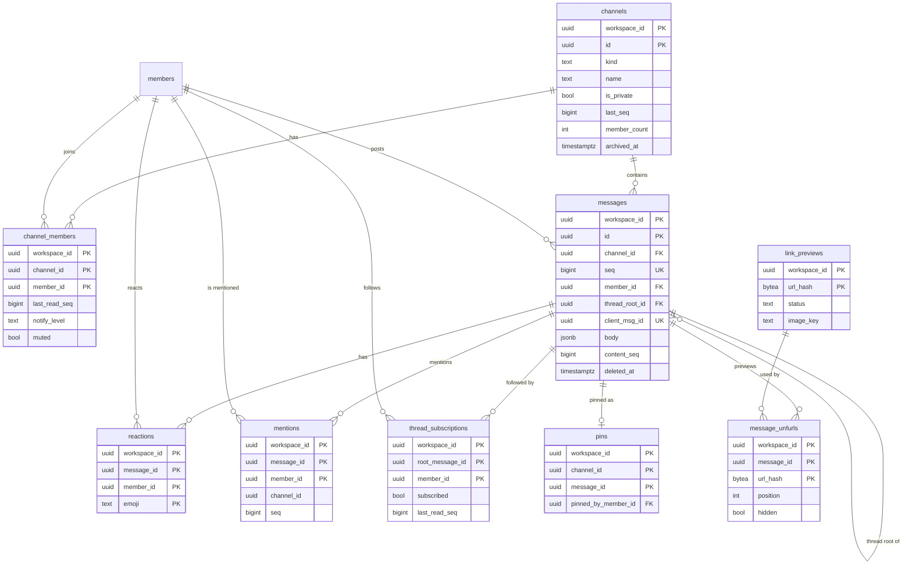
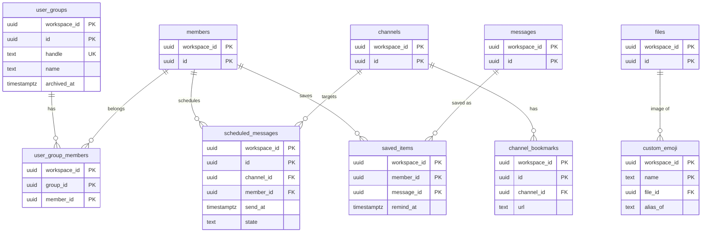

# Data model: 会話

[data-model.md](../data-model.md) の一部。規約は、そちらの 2 節に従う。振る舞いは [messaging.md](../messaging.md)、[read-state-and-notifications.md](../read-state-and-notifications.md)、[ADR-0001](../../decisions/0001-per-channel-sequence.md)、[ADR-0006](../../decisions/0006-message-body-ast.md) を正とする。

すべてテナントテーブル（`workspace_id`、複合キー、FORCE RLS）。

## 1. ER 図

### 1.1 チャンネルとメッセージ

### 1.2 会話の周辺

## 2. チャンネル

### channels

パブリック・プライベートのチャンネル、DM、グループ DM。`seq` の採番の元（ADR-0001）。

| 列 | 型 | NULL | 既定 | 説明 |
| --- | --- | --- | --- | --- |
| `workspace_id`、`id` | `uuid` | NO | | 主キー |
| `kind` | `text` | NO | | `channel` / `dm` / `group_dm` |
| `name` | `text` | YES | | `channel` だけ。小文字・数字・`-`・`_`、1〜80 文字 |
| `is_private` | `boolean` | NO | `false` | `dm` / `group_dm` は常に true |
| `dm_key` | `text` | YES | | `dm` / `group_dm` の参加者の `member_id` を並べて連結した値。同じ組の DM を 2 つ作らない |
| `topic` | `text` | YES | | 250 文字まで |
| `description` | `text` | YES | | 250 文字まで |
| `last_seq` | `bigint` | NO | `0` | 最後に採番した `seq` |
| `member_count` | `integer` | NO | `0` | 参加者の数。参加・退出と同じトランザクションで更新する。@channel の確認（6 人以上）と大規模チャンネルの判定に使う |
| `is_large` | `boolean` | NO | `false` | 大規模チャンネル（初期値 1,000 人以上）。Relay と Gateway が参照する（[realtime.md](../realtime.md) の 5.3 節）。しきい値は共通の設定から読む |
| `created_by_member_id` | `uuid` | YES | | DM は NULL |
| `archived_at` | `timestamptz` | YES | | |
| `archived_by_member_id` | `uuid` | YES | | |
| `created_at` / `updated_at` | `timestamptz` | NO | `now()` | |

- 主キー：`(workspace_id, id)`。
- 一意：`UNIQUE (workspace_id, name) WHERE kind = 'channel'`。`UNIQUE (workspace_id, dm_key) WHERE kind IN ('dm', 'group_dm')`。
- 外部キー：`(workspace_id, created_by_member_id)`、`(workspace_id, archived_by_member_id)` → `members`。
- CHECK：`kind = 'channel'` と `name IS NOT NULL` は同値。`kind <> 'channel'` なら `is_private` と `dm_key IS NOT NULL`。`last_seq >= 0`、`member_count >= 0`。
- 索引：主キー（チャンネルの取得と `last_seq` の採番）、`(workspace_id, is_private, name) WHERE kind = 'channel' AND archived_at IS NULL`（パブリックチャンネルの一覧・参加の画面）。
- 採番：`UPDATE channels SET last_seq = last_seq + 1 WHERE ... RETURNING last_seq`。メッセージ・`channel_events`・`outbox` と同じトランザクション（I-2）。
- 格納：`fillfactor = 70`、`autovacuum_vacuum_scale_factor = 0.01`（HOT 更新にする。[capacity.md](../capacity.md) の 3.1 節）。
- 削除：アーカイブだけ。チャンネルの削除（ADR-0018 の「チャンネルの削除」）は管理者の操作として、メッセージを含めて保持の Worker の経路で消す。
- S1 の規模：約 50 万行（DM を含む）。

### channel_members

チャンネルの参加者と、既読の位置・チャンネルごとの通知設定。**読めるかの判定は、この表を直接参照せず、判定関数を通す**（ADR-0005）。

| 列 | 型 | NULL | 既定 | 説明 |
| --- | --- | --- | --- | --- |
| `workspace_id`、`channel_id`、`member_id` | `uuid` | NO | | 主キー |
| `last_read_seq` | `bigint` | NO | `0` | 後退しない（`GREATEST`。I-10） |
| `notify_level` | `text` | YES | | `all` / `mentions` / `none`。NULL はメンバーの既定（`member_notification_prefs`）に従う |
| `muted` | `boolean` | NO | `false` | |
| `ignore_broadcast` | `boolean` | NO | `false` | @channel / @here を無視する |
| `joined_at` | `timestamptz` | NO | `now()` | |

- 主キー：`(workspace_id, channel_id, member_id)`。
- 外部キー：`(workspace_id, channel_id)` → `channels`、`(workspace_id, member_id)` → `members`。
- 索引：主キー（チャンネルの参加者、通知の受け手、アプリの配送先のボット）、`(workspace_id, member_id, channel_id)`（自分のチャンネルの一覧、`readable_channel_ids()`、未読の要約）。
- 退出で行を消す（`channel.member_left` を積む）。`guest_single` の参加は 1 行だけ（サービス関数で検査。409 `guest_channel_limit`）。
- 格納：`fillfactor = 80`、`autovacuum_vacuum_scale_factor = 0.02`（既読の更新が多い）。
- S1 の規模：約 500 万行。既読の更新はピークで 1,500 行/秒。

## 3. メッセージ

### messages

メッセージとスレッドの返信。削除は墓標（本文を消して行を残す）。

| 列 | 型 | NULL | 既定 | 説明 |
| --- | --- | --- | --- | --- |
| `workspace_id`、`id` | `uuid` | NO | | 主キー |
| `channel_id` | `uuid` | NO | | |
| `seq` | `bigint` | NO | | 作成時の `seq`。変えない（I-4） |
| `member_id` | `uuid` | NO | | 投稿者 |
| `thread_root_id` | `uuid` | YES | | 返信なら親。スレッドは 1 段だけ |
| `also_send_to_channel` | `boolean` | NO | `false` | 返信をチャンネルの一覧にも出す。投稿時にだけ決める |
| `body` | `jsonb` | NO | | 本文の AST（ADR-0006）。削除で `{"v":1,"blocks":[]}` にする |
| `body_format` | `smallint` | NO | `1` | AST のバージョン |
| `ui_blocks` | `jsonb` | YES | | アプリの UI ブロック（[apps.md](../apps.md) の 10 節）。削除で NULL |
| `installation_id` | `uuid` | YES | | アプリから送ったとき、そのインストール |
| `client_msg_id` | `uuid` | NO | | 冪等キー（I-5） |
| `broadcast_mention` | `text` | NO | `'none'` | `none` / `here` / `channel` / `everyone` |
| `content_seq` | `bigint` | NO | | 本文を最後に変えたイベントの `seq`。作成時は `seq` と同じ（検索のバージョン。I-12） |
| `reply_count` | `integer` | NO | `0` | 親に非正規化 |
| `reply_member_ids` | `uuid[]` | NO | `'{}'` | 返信した人の先頭 5 人 |
| `last_reply_at` | `timestamptz` | YES | | |
| `last_reply_seq` | `bigint` | YES | | 最後の返信の `seq`。スレッドの未読の判定に使う（[read-state-and-notifications.md](../read-state-and-notifications.md) の 2 節） |
| `edited_at` | `timestamptz` | YES | | |
| `deleted_at` | `timestamptz` | YES | | |
| `created_at` | `timestamptz` | NO | `now()` | 表示用。並べ替えには使わない |

- 主キー：`(workspace_id, id)`。
- 一意：`UNIQUE (workspace_id, channel_id, seq)`（I-2）、`UNIQUE (workspace_id, channel_id, member_id, client_msg_id)`（I-5）。
- 外部キー：`(workspace_id, channel_id)` → `channels`、`(workspace_id, member_id)` → `members`、`(workspace_id, thread_root_id)` → `messages`、`(workspace_id, installation_id)` → `app_installations`。
- CHECK：
  - `also_send_to_channel` なら `thread_root_id IS NOT NULL`。
  - `thread_root_id IS NOT NULL` なら `reply_count = 0`（返信は親にならない）。
  - `broadcast_mention IN (...)`、`reply_count >= 0`、`cardinality(reply_member_ids) <= 5`。
  - `deleted_at IS NOT NULL` なら `ui_blocks IS NULL`。
- 索引：
  - `(workspace_id, channel_id, seq)`（一意索引が兼ねる）：履歴（`seq` の降順、`before_seq`）、`around_seq`。
  - `(workspace_id, thread_root_id, seq) WHERE thread_root_id IS NOT NULL`：スレッドの返信（`seq` の昇順）。
  - 主キー：ID での取得。保持の Worker は、UUIDv7 の ID の範囲で古い行を選ぶ（時刻の索引を別に持たない）。
- 履歴 API は `thread_root_id IS NULL OR also_send_to_channel` の行を返す。返信のない削除済みの行は返さない。
- 保持：ワークスペース・チャンネルの保持ポリシー（既定は無期限）。物理削除は保持の Worker だけ（ADR-0019）。
- 格納：既定のまま（[capacity.md](../capacity.md) の 3.1 節）。
- S1 の規模：1 日 500 万行、1 年で約 18 億行・約 1.8 TB。

### reactions

| 列 | 型 | NULL | 既定 | 説明 |
| --- | --- | --- | --- | --- |
| `workspace_id`、`message_id`、`member_id` | `uuid` | NO | | |
| `emoji` | `text` | NO | | 標準の絵文字の短縮名（肌の色は `::skin-tone-N`）、またはカスタム絵文字の名前 |
| `created_at` | `timestamptz` | NO | `now()` | |

- 主キー：`(workspace_id, message_id, member_id, emoji)`。
- 外部キー：`(workspace_id, message_id)` → `messages`、`(workspace_id, member_id)` → `members`。
- CHECK：`emoji ~ '^[a-z0-9_+-]{1,64}(::skin-tone-[2-6])?$'`。
- 索引：主キー（履歴のページごとの集計。先頭が `(workspace_id, message_id)`）。
- 上限（1 メッセージの異なる絵文字 50、1 人 20）はサービス関数で検査する。
- メッセージの削除で消す。
- S1 の規模：1 日約 200 万行、1 年で約 7 億行。

### mentions

@メンバーだけを入れる（@here / @channel / @everyone は `messages.broadcast_mention`）。

| 列 | 型 | NULL | 既定 | 説明 |
| --- | --- | --- | --- | --- |
| `workspace_id`、`message_id`、`member_id` | `uuid` | NO | | `member_id` はメンションされた人 |
| `channel_id` | `uuid` | NO | | 非正規化 |
| `seq` | `bigint` | NO | | メッセージの `seq`。バッジの数え方に使う |
| `created_at` | `timestamptz` | NO | `now()` | |

- 主キー：`(workspace_id, message_id, member_id)`。
- 外部キー：`(workspace_id, message_id)` → `messages`、`(workspace_id, member_id)` → `members`。
- 索引：`(workspace_id, member_id, channel_id, seq)`（未読のメンションの数。`seq > last_read_seq`）、`(workspace_id, member_id, message_id DESC)`（メンションの一覧。ID は時刻順）。
- 編集で作り直す。メッセージの削除で消す。
- S1 の規模：1 日約 150 万行、1 年で約 5.5 億行。

### thread_subscriptions

スレッドの購読と既読。

| 列 | 型 | NULL | 既定 | 説明 |
| --- | --- | --- | --- | --- |
| `workspace_id`、`root_message_id`、`member_id` | `uuid` | NO | | |
| `channel_id` | `uuid` | NO | | 非正規化。権限の判定と一覧に使う |
| `subscribed` | `boolean` | NO | `true` | false は明示的な解除（行を残す） |
| `last_read_seq` | `bigint` | NO | `0` | スレッドで読んだ最後の返信の `seq`。後退しない |
| `updated_at` | `timestamptz` | NO | `now()` | |

- 主キー：`(workspace_id, root_message_id, member_id)`。
- 外部キー：`(workspace_id, root_message_id)` → `messages`、`(workspace_id, member_id)` → `members`、`(workspace_id, channel_id)` → `channels`。
- 索引：`(workspace_id, member_id, subscribed)`（「スレッド」画面、未読のスレッドの数）。
- S1 の規模：1 年で約 1 億行。

### pins

| 列 | 型 | NULL | 既定 | 説明 |
| --- | --- | --- | --- | --- |
| `workspace_id`、`channel_id`、`message_id` | `uuid` | NO | | |
| `pinned_by_member_id` | `uuid` | NO | | |
| `created_at` | `timestamptz` | NO | `now()` | |

- 主キー：`(workspace_id, channel_id, message_id)`。
- 外部キー：`(workspace_id, message_id)` → `messages`、`(workspace_id, channel_id)` → `channels`、`(workspace_id, pinned_by_member_id)` → `members`。
- 上限：1 チャンネル 100 件（サービス関数で検査）。メッセージの削除で消す。
- S1 の規模：数百万行。

### link_previews

リンクのプレビューのキャッシュ。ワークスペースをまたがない（URL が秘密でありうるため）。

| 列 | 型 | NULL | 既定 | 説明 |
| --- | --- | --- | --- | --- |
| `workspace_id` | `uuid` | NO | | |
| `url_hash` | `bytea` | NO | | 正規化した URL の SHA-256 |
| `url` | `text` | NO | | |
| `status` | `text` | NO | | `ok` / `failed` / `blocked` |
| `title`、`description`、`site_name` | `text` | YES | | 取得器が返した値（長さを切り詰める） |
| `image_key` | `text` | YES | | `derived` バケットのキー（[stores.md](stores.md) の 3 節） |
| `fetched_at` | `timestamptz` | NO | | 24 時間を過ぎたら取り直す |

- 主キー：`(workspace_id, url_hash)`。
- 保持：どのメッセージからも参照されず、30 日を過ぎた行を消す（画像も消す）。
- S1 の規模：1 日約 50 万行（投稿の 1 割にリンク）。掃除の後で数千万行。

### message_unfurls

| 列 | 型 | NULL | 既定 | 説明 |
| --- | --- | --- | --- | --- |
| `workspace_id`、`message_id` | `uuid` | NO | | |
| `url_hash` | `bytea` | NO | | |
| `position` | `smallint` | NO | | 本文の中の順（0〜2） |
| `hidden` | `boolean` | NO | `false` | 投稿者が消した |

- 主キー：`(workspace_id, message_id, url_hash)`。
- 外部キー：`(workspace_id, message_id)` → `messages`、`(workspace_id, url_hash)` → `link_previews`。
- CHECK：`position BETWEEN 0 AND 2`。
- メッセージの削除で消す。
- S1 の規模：1 年で約 1.8 億行。

## 4. 会話の周辺

### user_groups

ユーザーグループ（@team）。

| 列 | 型 | NULL | 既定 | 説明 |
| --- | --- | --- | --- | --- |
| `workspace_id`、`id` | `uuid` | NO | | |
| `handle` | `text` | NO | | メンションの名前。メンバーの表示名とは別の名前空間 |
| `name` | `text` | NO | | |
| `description` | `text` | YES | | |
| `created_by_member_id` | `uuid` | NO | | |
| `archived_at` | `timestamptz` | YES | | |
| `created_at` / `updated_at` | `timestamptz` | NO | `now()` | |

- 主キー：`(workspace_id, id)`。一意：`UNIQUE (workspace_id, handle)`（小文字で保存する）。
- S1 の規模：数万行。

### user_group_members

| 列 | 型 | NULL | 既定 | 説明 |
| --- | --- | --- | --- | --- |
| `workspace_id`、`group_id`、`member_id` | `uuid` | NO | | |
| `added_at` | `timestamptz` | NO | `now()` | |

- 主キー：`(workspace_id, group_id, member_id)`。索引：`(workspace_id, member_id)`（メンバーの所属）。
- 外部キー：`(workspace_id, group_id)` → `user_groups`、`(workspace_id, member_id)` → `members`。
- S1 の規模：数十万行。

### scheduled_messages

予約送信。送るまで `messages` に入れない（`seq` を消費しない）。

| 列 | 型 | NULL | 既定 | 説明 |
| --- | --- | --- | --- | --- |
| `workspace_id`、`id` | `uuid` | NO | | |
| `channel_id` | `uuid` | NO | | |
| `member_id` | `uuid` | NO | | 投稿者。本人だけが一覧・編集・取り消しできる |
| `thread_root_id` | `uuid` | YES | | 返信の予約 |
| `body` | `jsonb` | NO | | 本文の AST |
| `body_format` | `smallint` | NO | `1` | |
| `client_msg_id` | `uuid` | NO | | 送るときの冪等キー |
| `send_at` | `timestamptz` | NO | | |
| `state` | `text` | NO | `'scheduled'` | `scheduled` / `sent` / `failed` / `canceled` |
| `failure_reason` | `text` | YES | | `not_in_channel` / `member_deactivated` など |
| `sent_message_id` | `uuid` | YES | | |
| `created_at` / `updated_at` | `timestamptz` | NO | `now()` | |

- 主キー：`(workspace_id, id)`。
- 外部キー：`channels`、`members`、`messages`（`thread_root_id`、`sent_message_id`）。
- 索引：`(send_at) WHERE state = 'scheduled'`（1 分ごとの Worker。ワークスペースをまたいで期限の来た行を探すので、`tenant_resolver` の関数 `scheduler_due_items` から引く。[data-model.md](../data-model.md) の 2.3 節）、`(workspace_id, member_id, send_at)`（本人の一覧）。
- 保持：`sent` / `canceled` / `failed` を 30 日で消す。
- S1 の規模：数十万行。

### custom_emoji

| 列 | 型 | NULL | 既定 | 説明 |
| --- | --- | --- | --- | --- |
| `workspace_id` | `uuid` | NO | | |
| `name` | `text` | NO | | `/^[a-z0-9_+-]{1,64}$/`。標準の絵文字の名前と重ならない |
| `file_id` | `uuid` | YES | | 画像（`files.purpose = 'custom_emoji'`）。別名なら NULL |
| `alias_of` | `text` | YES | | 別名の元（標準またはカスタムの名前） |
| `created_by_member_id` | `uuid` | NO | | |
| `created_at` | `timestamptz` | NO | `now()` | |

- 主キー：`(workspace_id, name)`。
- 外部キー：`(workspace_id, file_id)` → `files`。
- CHECK：`(file_id IS NULL) <> (alias_of IS NULL)`。
- 削除は物理削除。本文とリアクションは名前で参照するので、名前のまま表示される。
- S1 の規模：数十万行。

### saved_items

後で読む。本人だけが見られる（行為者で絞るのはサービス関数）。

| 列 | 型 | NULL | 既定 | 説明 |
| --- | --- | --- | --- | --- |
| `workspace_id`、`member_id`、`message_id` | `uuid` | NO | | |
| `saved_at` | `timestamptz` | NO | `now()` | |
| `remind_at` | `timestamptz` | YES | | リマインダーと同じ仕組みで知らせる |
| `reminded_at` | `timestamptz` | YES | | |
| `completed_at` | `timestamptz` | YES | | 済みにした |

- 主キー：`(workspace_id, member_id, message_id)`。
- 索引：`(workspace_id, member_id, saved_at DESC)`（一覧）、`(remind_at) WHERE remind_at IS NOT NULL AND reminded_at IS NULL`（`scheduler_due_items`）。
- メッセージが削除されたら、一覧では「削除されました」と出し、行は保持の Worker が消す。
- S1 の規模：数百万行。

### channel_bookmarks

チャンネルのブックマーク。追加・変更は `seq` を消費するイベント（`channel.updated`）。

| 列 | 型 | NULL | 既定 | 説明 |
| --- | --- | --- | --- | --- |
| `workspace_id`、`id` | `uuid` | NO | | |
| `channel_id` | `uuid` | NO | | |
| `title` | `text` | NO | | |
| `url` | `text` | NO | | `isSafeUrl` で検査する |
| `position` | `integer` | NO | `0` | |
| `created_by_member_id` | `uuid` | NO | | |
| `created_at` / `updated_at` | `timestamptz` | NO | `now()` | |

- 主キー：`(workspace_id, id)`。索引：`(workspace_id, channel_id, position)`。
- S1 の規模：数十万行。
