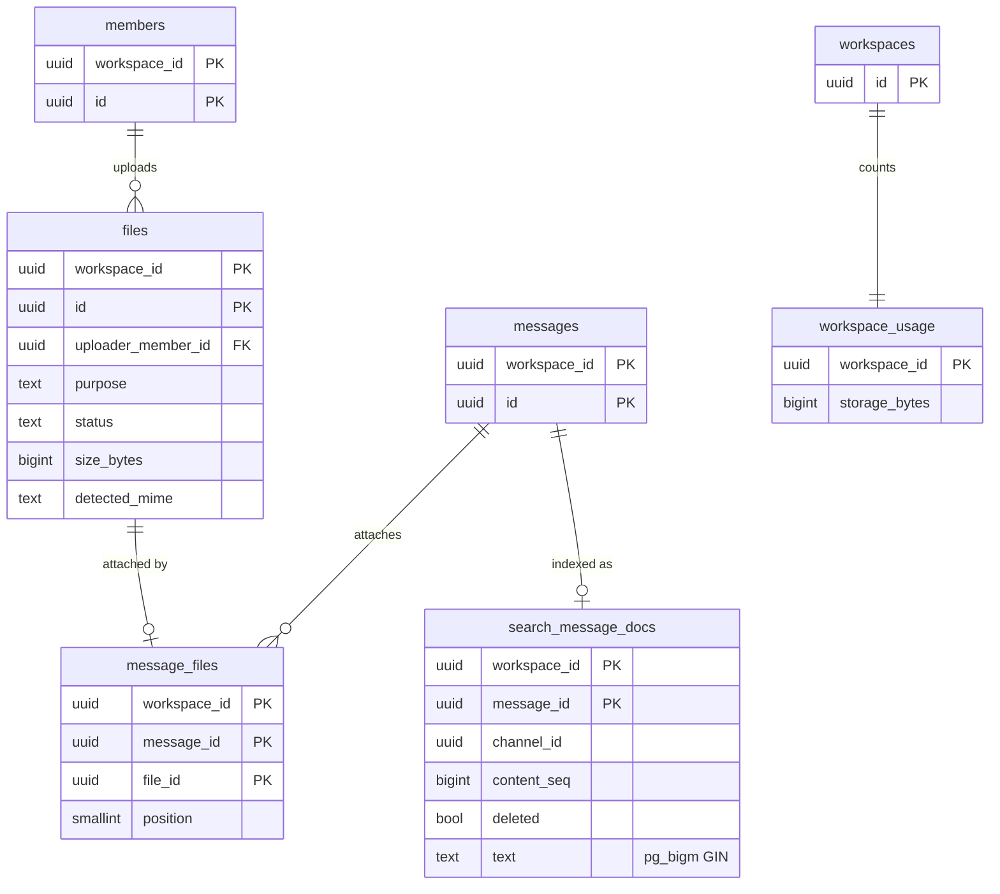

# Data model: ファイルと検索

[data-model.md](../data-model.md) の一部。規約は、そちらの 2 節に従う。振る舞いは [files.md](../files.md)、[search.md](../search.md)、[ADR-0015](../../decisions/0015-file-upload-scan-and-delivery.md)、[ADR-0004](../../decisions/0004-postgres-fulltext-search-first.md)、[ADR-0027](../../decisions/0027-search-table-rls-exception.md) を正とする。S3 のキーと OpenSearch のマッピングは [stores.md](stores.md) にある。

## 1. ER 図

`search_message_docs` は `search.message_docs` を表す。`messages` への外部キーは張らない（2.4 節）。

## 2. 表

### files

アップロードしたファイルのメタデータ。本体は S3 にある。キーは `ws/{workspace_id}/files/{file_id}` で、ID から決まるので列に持たない。

| 列 | 型 | NULL | 既定 | 説明 |
| --- | --- | --- | --- | --- |
| `workspace_id`、`id` | `uuid` | NO | | |
| `uploader_member_id` | `uuid` | NO | | |
| `purpose` | `text` | NO | `'message'` | `message` / `avatar` / `custom_emoji` / `app_asset`（下記） |
| `name` | `text` | NO | | 元のファイル名。255 文字まで |
| `size_bytes` | `bigint` | NO | | 申告した大きさ。完了時に `HeadObject` と照合する |
| `declared_mime` | `text` | NO | | 利用者の申告 |
| `detected_mime` | `text` | YES | | 先頭のバイト列から判定した種類 |
| `status` | `text` | NO | `'pending_upload'` | `pending_upload` / `scanning` / `processing` / `ready` / `blocked` / `unscannable` / `failed` / `deleted` |
| `scan_result` | `text` | YES | | GuardDuty の結果（`NO_THREATS_FOUND` など） |
| `scan_attempts` | `smallint` | NO | `0` | 再スキャンは 1 回まで |
| `scanned_at` | `timestamptz` | YES | | |
| `width`、`height` | `integer` | YES | | 画像だけ |
| `has_thumbnails` | `boolean` | NO | `false` | 幅 360・720・1440 の WebP を作ったか |
| `completed_at` | `timestamptz` | YES | | アップロードの完了 |
| `deleted_at` | `timestamptz` | YES | | |
| `created_at` / `updated_at` | `timestamptz` | NO | `now()` | |

- 主キー：`(workspace_id, id)`。
- 外部キー：`(workspace_id, uploader_member_id)` → `members`。
- CHECK：`size_bytes BETWEEN 1 AND 104857600`（100 MB）。`status = 'deleted'` と `deleted_at IS NOT NULL` は同値。
- 索引：
  - `(workspace_id, uploader_member_id, created_at DESC)`：自分のファイル、未投稿のファイル。
  - `(created_at) WHERE status = 'pending_upload'`：24 時間の GC。
  - `(updated_at) WHERE status = 'scanning'`：15 分で結果の来ないファイルの再スキャン。
  - どちらもワークスペースをまたいで探すので、`scheduler_due_items` から引く（[data-model.md](../data-model.md) の 2.3 節）。
- **`purpose`**（2026-09-28 に決定）：メッセージに付かないファイルの読める範囲を決める。
  - `message`：付いたメッセージのチャンネルを読めるとき（[files.md](../files.md) の 6 節）。投稿前はアップロードした本人だけ。
  - `avatar`・`custom_emoji`：そのワークスペースのメンバー全員。
  - `app_asset`：アプリの UI ブロックの画像とアイコン。そのワークスペースのメンバー全員。
  - スキャン・状態・削除の経路（`deleteFile`）は、どれも同じ。
- 削除：論理削除（`deleted`）→ file Worker が S3 から消し、容量を戻す。リーガルホールドの対象は消さない（ADR-0019）。
- 保持：メッセージと同じ保持ポリシー。行は S3 の消去の後、保持の Worker が消す。
- S1 の規模：1 日約 35 万行（投稿の約 7%）、1 年で約 1.3 億行。

### message_files

メッセージとファイルの対応。

| 列 | 型 | NULL | 既定 | 説明 |
| --- | --- | --- | --- | --- |
| `workspace_id`、`message_id`、`file_id` | `uuid` | NO | | |
| `position` | `smallint` | NO | | 表示の順（0〜9） |

- 主キー：`(workspace_id, message_id, file_id)`。
- 一意：`UNIQUE (workspace_id, file_id)`（I-8。1 つのファイルは 1 つのメッセージにだけ付く）。
- 外部キー：`(workspace_id, message_id)` → `messages`、`(workspace_id, file_id)` → `files`。
- CHECK：`position BETWEEN 0 AND 9`（1 メッセージ 10 件まで）。
- 付けられるのは `purpose = 'message'` のファイルだけ（サービス関数で検査）。
- S1 の規模：`files` とほぼ同じ。

### workspace_usage

ワークスペースの容量の計数。

| 列 | 型 | NULL | 既定 | 説明 |
| --- | --- | --- | --- | --- |
| `workspace_id` | `uuid` | NO | | 主キー |
| `storage_bytes` | `bigint` | NO | `0` | 予約を含む使用量。サムネイルとプレビューの画像は数えない |
| `updated_at` | `timestamptz` | NO | `now()` | |

- CHECK：`storage_bytes >= 0`。
- ファイルの作成で予約し、失敗・GC・削除で戻す。同じトランザクションで更新する。上限は entitlement の `limit.storage.bytes`。
- ずれを直すため、1 日 1 回 `files` から数え直して比べる（差があればメトリクスに出す）。
- S1 の規模：約 1 万行。

### search.message_docs

S1 の検索用の表（[search.md](../search.md) の 4 節）。**RLS を持たない唯一のテナントの表**（ADR-0027）。`app` ロールには権限を与えず、`search_owner` が所有する関数 `search.find_messages(...)` と `search.upsert_docs(...)` だけで読み書きする。

| 列 | 型 | NULL | 既定 | 説明 |
| --- | --- | --- | --- | --- |
| `workspace_id`、`message_id` | `uuid` | NO | | |
| `channel_id`、`member_id` | `uuid` | NO | | |
| `thread_root_id` | `uuid` | YES | | |
| `created_at` | `timestamptz` | NO | | メッセージの投稿時刻 |
| `content_seq` | `bigint` | NO | | 版。古い版で上書きしない（I-12） |
| `deleted` | `boolean` | NO | `false` | 墓標。本文は空 |
| `has_file`、`has_link` | `boolean` | NO | `false` | |
| `text` | `text` | NO | | `normalizeForSearch(toPlainText(body))` とファイル名 |

- 主キー：`(workspace_id, message_id)`。
- 外部キーは張らない。indexer が非同期に書き、墓標を 7 日残すため。
- 索引：`USING gin (text gin_bigm_ops)`、`(workspace_id, created_at DESC, message_id DESC)`、`(workspace_id, channel_id, created_at DESC)`、`(workspace_id, member_id, created_at DESC)`。
- 分割：`HASH (workspace_id)`、32 分割。
- 保持：墓標は 7 日後に定期ジョブで消す。ワークスペースの消去で `workspace_id` ごと消す。
- S2 で OpenSearch に移り、4 週間の並行の後に表を消す（[search.md](../search.md) の 5.4 節）。
- S1 の規模：`messages` と同じ行数（1 年で約 18 億行）。本文のテキストと GIN の索引で、`messages` と同程度の容量を見込む。
