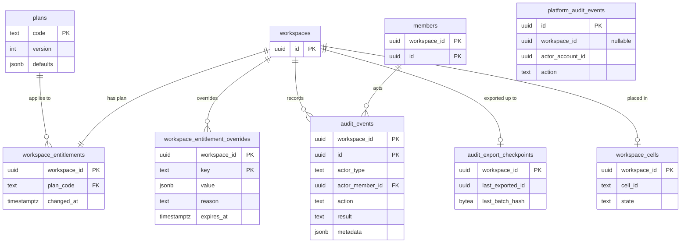
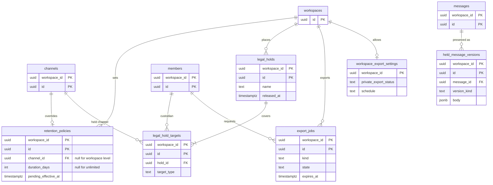

# Data model: プラン・監査・保持

[data-model.md](../data-model.md) の一部。規約は、そちらの 2 節に従う。振る舞いは [ADR-0018](../../decisions/0018-audit-log.md)（監査ログ）、[ADR-0019](../../decisions/0019-data-retention-and-deletion.md)（保持と削除）、[ADR-0032](../../decisions/0032-plans-and-entitlements.md)・[ADR-0033](../../decisions/0033-slack-aligned-platform-and-plan-decisions.md)（プラン）、[ADR-0023](../../decisions/0023-cell-based-architecture.md)（セル）、[security.md](../security.md) の 14〜15 節を正とする。

## 1. ER 図

### 1.1 プラン・監査・セル

`platform_audit_events` はテナントの外の表で、他の表と外部キーを持たない。

### 1.2 保持・リーガルホールド・エクスポート

## 2. プランと entitlement

### plans

プランの定義（テナントの外）。値の名前は `limit.<対象>` と `feature.<機能>`（ADR-0032）。

| 列 | 型 | NULL | 既定 | 説明 |
| --- | --- | --- | --- | --- |
| `code` | `text` | NO | | `free` / `pro` / `business_plus` / `enterprise`（ADR-0033）と、開発用のワークスペースの `developer`（[public-api.md](../public-api.md) の 11 節） |
| `name` | `text` | NO | | 表示名 |
| `defaults` | `jsonb` | NO | | 各上限と機能の既定値。`packages/entitlements` の型で検証する |
| `version` | `integer` | NO | `1` | 定義を変えるたびに増やす |
| `updated_at` | `timestamptz` | NO | `now()` | |

- 主キー：`(code)`。
- 変更は Ops だけ。`platform_audit_events` に残す。
- S1 の規模：5 行。

### workspace_entitlements

ワークスペースのプラン。1 ワークスペースに 1 行。

| 列 | 型 | NULL | 既定 | 説明 |
| --- | --- | --- | --- | --- |
| `workspace_id` | `uuid` | NO | | 主キー |
| `plan_code` | `text` | NO | | → `plans.code` |
| `changed_at` | `timestamptz` | NO | `now()` | |
| `changed_by_operator_id` | `text` | YES | | 運用者（社内の SSO の ID）。将来は課金の仕組み |

- アプリは、プランの既定値と上書きを合わせた結果を 60 秒キャッシュする。変更はメンバーのストリームにも流す。
- 変更は監査ログに残す（ADR-0018）。
- S1 の規模：約 1 万行。

### workspace_entitlement_overrides

ワークスペース単位の上書き。上限の緩和（レート制限を含む。[rate-limiting.md](../rate-limiting.md) の 4 節）と、個別の機能の有効化に使う。ADR-0032 の「上書きには理由と期限を持たせる」を、上書き 1 件ごとの行で表した（2026-09-28 に決定）。

| 列 | 型 | NULL | 既定 | 説明 |
| --- | --- | --- | --- | --- |
| `workspace_id` | `uuid` | NO | | |
| `key` | `text` | NO | | `limit.*` / `feature.*` の名前。`packages/entitlements` に定義のあるものだけ |
| `value` | `jsonb` | NO | | |
| `reason` | `text` | NO | | |
| `expires_at` | `timestamptz` | YES | | 期限切れは日次で検出して Ops に知らせる |
| `created_by_operator_id` | `text` | NO | | |
| `created_at` | `timestamptz` | NO | `now()` | |

- 主キー：`(workspace_id, key)`。
- 索引：`(expires_at) WHERE expires_at IS NOT NULL`（日次の検出。運用のロールで読む）。
- S1 の規模：数百行。

## 3. 監査ログ

### audit_events

ワークスペースの監査ログ（ADR-0018）。操作と同じトランザクションで書く。**追記だけ**（I-13）。

| 列 | 型 | NULL | 既定 | 説明 |
| --- | --- | --- | --- | --- |
| `workspace_id`、`id` | `uuid` | NO | | `id` は分割キー |
| `occurred_at` | `timestamptz` | NO | `now()` | |
| `actor_type` | `text` | NO | | `human` / `bot` / `agent` / `operator` / `system` |
| `actor_member_id` | `uuid` | YES | | テナントの中は `member_id`（ADR-0010） |
| `actor_operator_id` | `text` | YES | | 運用者（社内の SSO の ID） |
| `action` | `text` | NO | | 例：`member.role_changed` |
| `target_type` | `text` | YES | | |
| `target_id` | `text` | YES | | UUID 以外の対象（設定の名前など）もあるので `text` |
| `result` | `text` | NO | | `success` / `denied` |
| `ip` | `inet` | YES | | |
| `user_agent` | `text` | YES | | |
| `request_id` | `text` | YES | | トレースとの突合 |
| `metadata` | `jsonb` | NO | `'{}'` | 変更前後の値。本文・トークンを入れない |

- 主キー：`(workspace_id, id)`。
- 外部キー：`(workspace_id, actor_member_id)` → `members`。
- CHECK：`actor_type = 'operator'` なら `actor_operator_id IS NOT NULL`。`actor_type IN ('human', 'bot', 'agent')` なら `actor_member_id IS NOT NULL`。
- 索引：主キー（期間での絞り込み。ID は時刻順）、`(workspace_id, actor_member_id, id DESC)`、`(workspace_id, action, id DESC)`、`(workspace_id, target_type, target_id)`。
- 権限：`app` は INSERT と SELECT だけ。トリガーで UPDATE・DELETE を拒否する。`audit_exporter` は全行の SELECT。
- 分割：`RANGE (id)`、1 か月。1 年を過ぎたパーティションを `audit_pruner` が落とし、その実行を `platform_audit_events` に残す。
- 保持：DB に 1 年、S3 のアーカイブに 2 年（ADR-0033 の 6）。管理者が画面で見られるのは Enterprise だけ（`feature.audit_log`）。
- S1 の規模：1 年で数百万行（管理操作だけを記録するため少ない）。

### platform_audit_events

ワークスペースに属さない記録（テナントの外）。アカウントのログイン、ワークスペースを特定しない運用者の操作、ワークスペースの消去の完了、プランの定義の変更。

| 列 | 型 | NULL | 既定 | 説明 |
| --- | --- | --- | --- | --- |
| `id` | `uuid` | NO | `uuidv7()` | 分割キー |
| `workspace_id` | `uuid` | YES | | 関係するワークスペース（消去の完了など）。外部キーは張らない |
| `actor_account_id` | `uuid` | YES | | アカウントのログインなど |
| `occurred_at`、`actor_type`、`actor_operator_id`、`action`、`target_type`、`target_id`、`result`、`ip`、`user_agent`、`request_id`、`metadata` | | | | `audit_events` と同じ |

- 主キー：`(id)`。
- 索引：`(actor_account_id, id DESC)`（本人のログイン履歴。本人だけが見られる）、`(workspace_id, id DESC) WHERE workspace_id IS NOT NULL`。
- 権限・分割・保持：`audit_events` と同じ。アカウントの削除では、`actor_account_id` を残したまま個人情報（IP・User-Agent）を消す。
- S1 の規模：1 日約 30 万行（ログインの成功・失敗）、1 年で約 1 億行。

### audit_export_checkpoints

監査ログのエクスポーターの進み具合と、ハッシュの連鎖の直前の値（テナントの外）。細かい方式は、実装の `plan.md` で決める（ADR-0018）。

| 列 | 型 | NULL | 既定 | 説明 |
| --- | --- | --- | --- | --- |
| `workspace_id` | `uuid` | NO | | 主キー。`platform_audit_events` は `00000000-0000-0000-0000-000000000000` で表す |
| `last_exported_id` | `uuid` | NO | | 透かし（watermark）の位置 |
| `last_batch_hash` | `bytea` | NO | | 次のバッチに含める直前のハッシュ |
| `last_batch_key` | `text` | NO | | S3 のキー（[stores.md](stores.md) の 3 節） |
| `updated_at` | `timestamptz` | NO | `now()` | |

- 権限：`audit_exporter` だけが読み書きする。
- S1 の規模：約 1 万行。

## 4. 保持とリーガルホールド

どれも E8 で作る。リーガルホールドを保持ポリシーより先に作る（ADR-0019）。

### retention_policies

| 列 | 型 | NULL | 既定 | 説明 |
| --- | --- | --- | --- | --- |
| `workspace_id`、`id` | `uuid` | NO | | |
| `channel_id` | `uuid` | YES | | NULL はワークスペースの既定。値があればそのチャンネル（DM を含む）の上書き |
| `duration_days` | `integer` | YES | | NULL は無期限。最短 1 日 |
| `pending_duration_days` | `integer` | YES | | 短くする変更の予約 |
| `pending_effective_at` | `timestamptz` | YES | | 予約の実行時刻（7 日の猶予） |
| `admins_can_override` | `boolean` | NO | `false` | ワークスペースの行だけ。admin にチャンネルの上書きを許すか |
| `updated_by_member_id` | `uuid` | NO | | |
| `created_at` / `updated_at` | `timestamptz` | NO | `now()` | |

- 主キー：`(workspace_id, id)`。一意：`UNIQUE NULLS NOT DISTINCT (workspace_id, channel_id)`。
- CHECK：`duration_days IS NULL OR duration_days >= 1`。
- 変更は監査ログに残す。
- S1 の規模：数万行。

### legal_holds

| 列 | 型 | NULL | 既定 | 説明 |
| --- | --- | --- | --- | --- |
| `workspace_id`、`id` | `uuid` | NO | | |
| `name` | `text` | NO | | |
| `description` | `text` | YES | | |
| `created_by_member_id` | `uuid` | NO | | owner |
| `created_at` | `timestamptz` | NO | `now()` | |
| `released_at` | `timestamptz` | YES | | 解除するまで有効 |
| `released_by_member_id` | `uuid` | YES | | |

- 索引：`(workspace_id) WHERE released_at IS NULL`（有効なホールドがあるか。ワークスペースの削除を拒む）。
- S1 の規模：数百行。

### legal_hold_targets

| 列 | 型 | NULL | 既定 | 説明 |
| --- | --- | --- | --- | --- |
| `workspace_id`、`id` | `uuid` | NO | | |
| `hold_id` | `uuid` | NO | | |
| `target_type` | `text` | NO | | `member`（カストディアン）/ `channel` |
| `member_id` | `uuid` | YES | | |
| `channel_id` | `uuid` | YES | | |
| `added_at` | `timestamptz` | NO | `now()` | |
| `removed_at` | `timestamptz` | YES | | |

- CHECK：`target_type = 'member'` なら `member_id` だけ、`channel` なら `channel_id` だけが値を持つ。
- 索引：`(workspace_id, member_id) WHERE removed_at IS NULL`、`(workspace_id, channel_id) WHERE removed_at IS NULL`（削除・編集の経路が「ホールドの対象か」を引く）。
- S1 の規模：数千行。

### held_message_versions

ホールドの対象のメッセージの、元の内容と編集前・削除前の版（ADR-0019）。通常の API・検索からは見えない。eDiscovery のエクスポートだけが読む。

| 列 | 型 | NULL | 既定 | 説明 |
| --- | --- | --- | --- | --- |
| `workspace_id`、`id` | `uuid` | NO | | |
| `message_id` | `uuid` | NO | | |
| `channel_id`、`member_id` | `uuid` | NO | | 絞り込み用 |
| `version_kind` | `text` | NO | | `before_edit` / `before_delete` |
| `body` | `jsonb` | NO | | |
| `body_format` | `smallint` | NO | | |
| `ui_blocks` | `jsonb` | YES | | |
| `captured_at` | `timestamptz` | NO | `now()` | |

- 外部キー：`(workspace_id, message_id)` → `messages`（墓標の行は残るので張れる）。
- 索引：`(workspace_id, message_id, captured_at)`。
- 編集・削除のトランザクションの中で、対象がホールドされていれば書く。
- 保持：どのホールドの対象でもなくなったら、保持の Worker が消す。
- S1 の規模：ホールドの利用に比例。

### export_jobs

エクスポートの依頼と成果物（ADR-0019）。

| 列 | 型 | NULL | 既定 | 説明 |
| --- | --- | --- | --- | --- |
| `workspace_id`、`id` | `uuid` | NO | | |
| `kind` | `text` | NO | | `standard` / `full` / `ediscovery` |
| `requested_by_member_id` | `uuid` | NO | | |
| `range_from`、`range_to` | `timestamptz` | YES | | 期間 |
| `state` | `text` | NO | `'queued'` | `queued` / `running` / `completed` / `failed` / `expired` |
| `size_bytes` | `bigint` | YES | | |
| `error` | `text` | YES | | |
| `created_at` | `timestamptz` | NO | `now()` | |
| `started_at`、`completed_at` | `timestamptz` | YES | | |
| `expires_at` | `timestamptz` | YES | | 完了から 7 日。S3 のライフサイクルと同じ |

- 索引：`(workspace_id, created_at DESC)`。
- 同時実行は `concurrency-bulk`（[rate-limiting.md](../rate-limiting.md)）。依頼・完了・ダウンロードを監査ログに残す。
- S1 の規模：数万行。

### workspace_export_settings

全データのエクスポートの申請と承認、定期のエクスポート（[security.md](../security.md) の 15 節）。

| 列 | 型 | NULL | 既定 | 説明 |
| --- | --- | --- | --- | --- |
| `workspace_id` | `uuid` | NO | | 主キー |
| `private_export_status` | `text` | NO | `'none'` | `none` / `requested` / `approved` / `revoked`。`feature.export_private` が上限 |
| `requested_by_member_id` | `uuid` | YES | | owner |
| `requested_at` | `timestamptz` | YES | | |
| `approved_by_operator_id` | `text` | YES | | Ops |
| `approved_at` | `timestamptz` | YES | | |
| `schedule` | `text` | NO | `'none'` | `none` / `daily` / `weekly` / `monthly` |
| `updated_at` | `timestamptz` | NO | `now()` | |

- S1 の規模：数千行。

## 5. セル（S3）

### workspace_cells

S3 のセル構成で、Global の DB に置く対応表（[infrastructure.md](../infrastructure.md) の 10 節）。S1・S2 では作らない。

| 列 | 型 | NULL | 既定 | 説明 |
| --- | --- | --- | --- | --- |
| `workspace_id` | `uuid` | NO | | 主キー |
| `cell_id` | `text` | NO | | 例：`cell-01`、`cell-big-01` |
| `state` | `text` | NO | `'active'` | `active` / `moving` / `read_only` |
| `moved_at` | `timestamptz` | YES | | |
| `updated_at` | `timestamptz` | NO | `now()` | |

- 索引：`(cell_id)`（セルの使用率）。
- Global が正本。各セルにはキャッシュとして配る。
- アカウント → ワークスペースの一覧（`account_id` → `workspace_id`・`cell_id`）は、セルの outbox から作る索引で、形は S3 の着手時に決める（[identity-and-access.md](../identity-and-access.md) の 13 節）。
