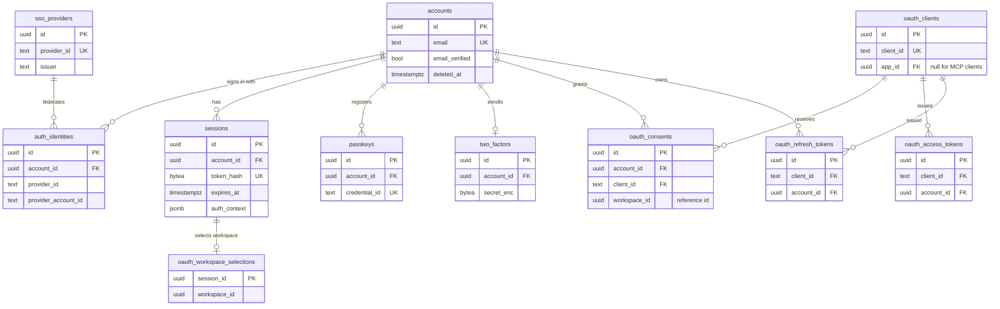
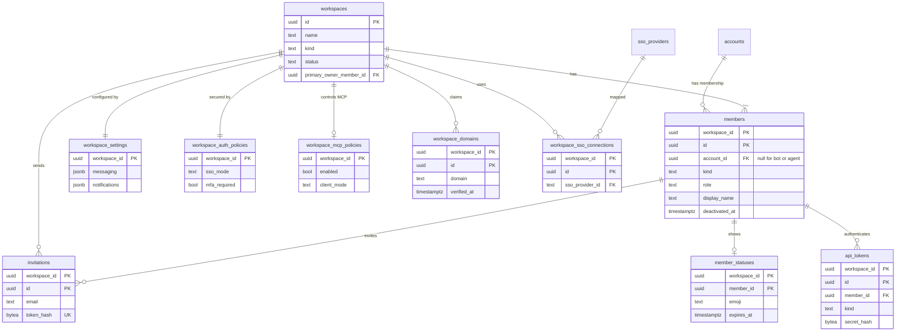

# Data model: 認証・ワークスペース・メンバー

[data-model.md](../data-model.md) の一部。規約（ID、RLS、型、削除、暗号化）は、そちらの 2 節に従う。振る舞いは [identity-and-access.md](../identity-and-access.md)、[ADR-0010](../../decisions/0010-accounts-and-workspace-members.md)、[ADR-0012](../../decisions/0012-self-hosted-auth-with-better-auth.md) を正とする。

## 1. ER 図

### 1.1 認証（テナントの外）

Better Auth が読み書きする表と、OAuth の認可サーバーの表。

`verifications`・`auth_rate_limits`・`jwks` は、他の表と関係を持たないので図から省いた。

### 1.2 ワークスペースとメンバー

## 2. テナントの外の表

Better Auth のモデルを snake_case の表名・列名に写す。**Better Auth のバージョンで列が増減する。** ここには、本システムが依存する列と、追加した列だけを書く。生成されるスキーマ（Better Auth の CLI）は、この表と差分を確かめてからマイグレーションにする。

どの表も RLS を持たない。触れてよいのは `apps/api/src/auth/` のモジュールだけ（lint で禁止する）。テナントの中の表は、これらを参照しない（ADR-0010。例外は `members.account_id`）。

### accounts

ログインの主体。Better Auth の `user` モデル。プロフィールは持たない（メンバーごとに持つ。ADR-0010）。

| 列 | 型 | NULL | 既定 | 説明 |
| --- | --- | --- | --- | --- |
| `id` | `uuid` | NO | `uuidv7()` | |
| `email` | `text` | NO | | 小文字に正規化して保存する |
| `email_verified` | `boolean` | NO | `false` | OTP または IdP の確認で true |
| `name` | `text` | NO | `''` | Better Auth が必須とする項目。本システムは使わない（表示名は `members`） |
| `image` | `text` | YES | | 同上。使わない |
| `two_factor_enabled` | `boolean` | NO | `false` | Better Auth の 2FA プラグインが持つ |
| `email_suppressed_at` | `timestamptz` | YES | | SES のバウンス・苦情で、通知のメールを止めた時刻（[read-state-and-notifications.md](../read-state-and-notifications.md) の 7.2 節） |
| `created_at` / `updated_at` | `timestamptz` | NO | `now()` | |
| `deleted_at` | `timestamptz` | YES | | アカウントの削除の手順の 2 で設定。全ジョブの完了後に行を消す（[identity-and-access.md](../identity-and-access.md) の 12 節） |

- 一意：`UNIQUE (email) WHERE deleted_at IS NULL`。削除済みのアカウントと同じメールで、新しいアカウントを作れる。
- 索引：一意索引が、メールでのログインを受ける。
- 保持：削除の手順の 4 で物理削除。
- S1 の規模：約 15 万行。

### auth_identities

認証手段ごとの行（Google、Microsoft、ワークスペースの SSO）。Better Auth の `account` モデルを改名したもの。

| 列 | 型 | NULL | 既定 | 説明 |
| --- | --- | --- | --- | --- |
| `id` | `uuid` | NO | `uuidv7()` | |
| `account_id` | `uuid` | NO | | → `accounts.id`（Better Auth の `userId`） |
| `provider_id` | `text` | NO | | `google` / `microsoft` / SSO の `provider_id` |
| `provider_account_id` | `text` | NO | | IdP の中の利用者の ID（Better Auth の `accountId`） |
| `access_token_enc`、`refresh_token_enc`、`id_token_enc` | `text` | YES | | `encryptOAuthTokens` で暗号化する |
| `access_token_expires_at`、`refresh_token_expires_at` | `timestamptz` | YES | | |
| `scope` | `text` | YES | | |
| `created_at` / `updated_at` | `timestamptz` | NO | `now()` | |

- 一意：`UNIQUE (provider_id, provider_account_id)`。同じ IdP の利用者を 2 つのアカウントに結び付けない。
- 外部キー：`account_id` → `accounts (id) ON DELETE CASCADE`。
- 索引：`(account_id)`（設定画面の一覧、削除）。
- パスワードの列（Better Auth の `password`）は使わない（パスワードを保存しない。[identity-and-access.md](../identity-and-access.md) の 2.1 節）。
- S1 の規模：約 10 万行。

### sessions

ログインのセッション。正本は DB だけに置く（Valkey に置かない。[identity-and-access.md](../identity-and-access.md) の 3.2 節の決定）。

| 列 | 型 | NULL | 既定 | 説明 |
| --- | --- | --- | --- | --- |
| `id` | `uuid` | NO | `uuidv7()` | WebSocket のチケットや監査ログから参照する |
| `account_id` | `uuid` | NO | | → `accounts.id` |
| `token` | `text` | NO | | Cookie の値に対応する不透明なトークン。Better Auth が照合する |
| `expires_at` | `timestamptz` | NO | | アイドルタイムアウト（14 日。使うたびに延びる） |
| `ip_address` | `inet` | YES | | |
| `user_agent` | `text` | YES | | |
| `auth_context` | `jsonb` | NO | `'{}'` | 追加の列。どのワークスペースの SSO でいつ認証したか、MFA を満たしたか（`{"sso": {"<workspace_id>": "<時刻>"}, "mfa_at": "<時刻>"}`） |
| `created_at` / `updated_at` | `timestamptz` | NO | `now()` | `created_at` は絶対タイムアウト（90 日）の起点 |

- 一意：`UNIQUE (token)`。
- 索引：`(account_id)`（一覧と一括の取り消し）、`(expires_at)`（期限切れの掃除）。
- 保持：期限切れの行は 1 日ごとのジョブで消す。
- 変更は Better Auth の API（`revokeSession` など）だけで行う。
- S1 の規模：約 30 万行（1 アカウント平均 2 端末）。

### verifications

メールの OTP、SAML の AuthnRequest など、一時的な検証値。

| 列 | 型 | NULL | 既定 | 説明 |
| --- | --- | --- | --- | --- |
| `id` | `uuid` | NO | `uuidv7()` | |
| `identifier` | `text` | NO | | 例：`email-otp:<email>` |
| `value` | `text` | NO | | ハッシュにした値（Better Auth の `storeOTP: "hashed"` を使う） |
| `expires_at` | `timestamptz` | NO | | OTP は 10 分 |
| `created_at` / `updated_at` | `timestamptz` | NO | `now()` | |

- 索引：`(identifier)`、`(expires_at)`。
- 保持：期限切れを 1 時間ごとに消す。
- S1 の規模：数万行（常に短命）。

### passkeys

WebAuthn の公開鍵。

| 列 | 型 | NULL | 既定 | 説明 |
| --- | --- | --- | --- | --- |
| `id` | `uuid` | NO | `uuidv7()` | |
| `account_id` | `uuid` | NO | | → `accounts.id` |
| `name` | `text` | YES | | 利用者が付けた名前 |
| `credential_id` | `text` | NO | | |
| `public_key` | `text` | NO | | |
| `counter` | `bigint` | NO | `0` | |
| `device_type`、`transports`、`aaguid` | `text` | YES | | |
| `backed_up` | `boolean` | NO | `false` | |
| `created_at` | `timestamptz` | NO | `now()` | |

- 一意：`UNIQUE (credential_id)`。索引：`(account_id)`。
- S1 の規模：約 5 万行。

### two_factors

TOTP の秘密とバックアップコード。

| 列 | 型 | NULL | 既定 | 説明 |
| --- | --- | --- | --- | --- |
| `id` | `uuid` | NO | `uuidv7()` | |
| `account_id` | `uuid` | NO | | → `accounts.id` |
| `secret` | `text` | NO | | Better Auth が暗号化して書く |
| `backup_codes` | `text` | NO | | 同上。10 個、1 回限り |

- 一意：`UNIQUE (account_id)`。
- S1 の規模：約 3 万行。

### sso_providers

OIDC・SAML の接続設定。Better Auth の `ssoProvider` モデル。organization プラグインは使わない（`organization_id` は常に NULL）。ワークスペースとの対応は `workspace_sso_connections` で持つ。

| 列 | 型 | NULL | 既定 | 説明 |
| --- | --- | --- | --- | --- |
| `id` | `uuid` | NO | `uuidv7()` | |
| `provider_id` | `text` | NO | | 接続の名前（本システムが `ws-<workspace_id>-<連番>` の形で付ける） |
| `issuer` | `text` | NO | | |
| `domain` | `text` | NO | | Better Auth が必須とする。振り分けの正本は `workspace_domains` |
| `oidc_config` / `saml_config` | `text` | YES | | JSON。クライアントの秘密を含むので、Better Auth の暗号化を使う |
| `created_at` / `updated_at` | `timestamptz` | NO | `now()` | |

- 一意：`UNIQUE (provider_id)`。
- 書き込みは管理 API（`/api/workspaces/{ws}/admin/sso`）からだけ（[identity-and-access.md](../identity-and-access.md) の 5.1 節）。
- S1 の規模：数百行。

### auth_rate_limits

Better Auth のレート制限の計数。`secondaryStorage` を使わない決定（[identity-and-access.md](../identity-and-access.md) の 3.2 節）により、DB に置く（`rateLimit.storage: "database"`）。

| 列 | 型 | NULL | 既定 | 説明 |
| --- | --- | --- | --- | --- |
| `id` | `uuid` | NO | `uuidv7()` | |
| `key` | `text` | NO | | 例：`<ip>:/sign-in/email-otp` |
| `count` | `integer` | NO | | |
| `last_request` | `bigint` | NO | | UNIX ミリ秒（Better Auth の形） |

- 一意：`UNIQUE (key)`。
- 保持：1 日ごとに、1 日以上古い行を消す。
- 本システム自身の制限（OTP の送信の上限など）は Valkey の GCRA で行う（[rate-limiting.md](../rate-limiting.md)）。この表は Better Auth の内蔵の制限だけに使う。
- S1 の規模：数万行。

### jwks

JWT プラグインの署名鍵（OAuth のアクセストークン、MCP のトークン）。

| 列 | 型 | NULL | 既定 | 説明 |
| --- | --- | --- | --- | --- |
| `id` | `uuid` | NO | `uuidv7()` | `kid` |
| `public_key` | `text` | NO | | |
| `private_key` | `text` | NO | | Better Auth が暗号化して書く |
| `created_at` | `timestamptz` | NO | `now()` | 90 日で入れ替える（ADR-0017） |

- S1 の規模：数行。

### oauth_clients

OAuth のクライアント。アプリ（[apps.md](../apps.md)）1 つにつき 1 行。MCP のクライアントは CIMD で登録され、`client_id` はメタデータの URL になる（[mcp.md](../mcp.md) の 3.1 節）。Better Auth の oauth-provider プラグインのモデル。

| 列 | 型 | NULL | 既定 | 説明 |
| --- | --- | --- | --- | --- |
| `id` | `uuid` | NO | `uuidv7()` | |
| `client_id` | `text` | NO | | アプリなら生成した値、MCP なら URL |
| `client_secret` | `text` | YES | | ハッシュ。公開クライアント（MCP）は NULL |
| `app_id` | `uuid` | YES | | 追加の列。→ `apps.id`（アプリの ID と 1 対 1）。MCP は NULL |
| `name`、`uri`、`logo_uri` | `text` | YES | | 同意の画面に出す |
| `redirect_uris` | `text[]` | NO | | |
| `token_endpoint_auth_method` | `text` | NO | | アプリは `client_secret_basic`、MCP は `none` |
| `disabled` | `boolean` | NO | `false` | |
| `created_at` / `updated_at` | `timestamptz` | NO | `now()` | |

- 一意：`UNIQUE (client_id)`、`UNIQUE (app_id) WHERE app_id IS NOT NULL`。
- 旧い `client_secret` の 24 時間の重なりは、`app_credentials` に持つ（[app-platform.md](app-platform.md)）。
- S1 の規模：数千行。

### oauth_access_tokens / oauth_refresh_tokens

Better Auth の oauth-provider が発行するトークン。アクセストークンは JWT なので、取り消しの検査は同意とメンバーの状態で行う（[public-api.md](../public-api.md) の 4 節）。リフレッシュトークンは使うたびに入れ替える。

| 列 | 型 | NULL | 既定 | 説明 |
| --- | --- | --- | --- | --- |
| `id` | `uuid` | NO | `uuidv7()` | |
| `token` | `text` | NO | | ハッシュ |
| `client_id` | `text` | NO | | → `oauth_clients.client_id` |
| `account_id` | `uuid` | NO | | → `accounts.id` |
| `session_id` | `uuid` | YES | | 発行したときのセッション |
| `reference_id` | `uuid` | YES | | 同意の参照 ID（= `workspace_id`） |
| `scopes` | `text[]` | NO | | |
| `expires_at` | `timestamptz` | NO | | アクセス 1 時間、リフレッシュ 30 日 |
| `revoked_at` | `timestamptz` | YES | | |
| `created_at` | `timestamptz` | NO | `now()` | |

- 一意：`UNIQUE (token)`。索引：`(account_id, client_id)`（一覧と取り消し）、`(expires_at)`（掃除）。
- 保持：期限切れと取り消し済みを 1 日ごとに消す。
- S1 の規模：E9（MCP）と E12（公開 API）の利用に比例。数十万行。

### oauth_consents

同意の記録。（アカウント、クライアント、ワークスペース）の組を単位にする（[mcp.md](../mcp.md) の 3.1 節、[identity-and-access.md](../identity-and-access.md) の 15 節）。

| 列 | 型 | NULL | 既定 | 説明 |
| --- | --- | --- | --- | --- |
| `id` | `uuid` | NO | `uuidv7()` | |
| `account_id` | `uuid` | NO | | → `accounts.id` |
| `client_id` | `text` | NO | | → `oauth_clients.client_id` |
| `reference_id` | `uuid` | NO | | `workspace_id`（`consentReferenceId` の戻り値） |
| `scopes` | `text[]` | NO | | |
| `created_at` / `updated_at` | `timestamptz` | NO | `now()` | |

- 一意：`UNIQUE (account_id, client_id, reference_id)`。
- 取り消すと、そのクライアントのトークンも失効させる。管理者の一覧は、テナントの中の `app_user_authorizations`（アプリ）とこの表（MCP）から作る。
- S1 の規模：数十万行。

### oauth_workspace_selections

OAuth の postLogin の画面で選んだワークスペースを、同意までの短い間だけ置く（[public-api.md](../public-api.md) の 4.1 節、[apps.md](../apps.md) の 5.1 節）。

| 列 | 型 | NULL | 既定 | 説明 |
| --- | --- | --- | --- | --- |
| `session_id` | `uuid` | NO | | 主キー。→ `sessions.id` |
| `workspace_id` | `uuid` | NO | | 選んだワークスペース。外部キーは張らない（テナントの外の短命の行） |
| `expires_at` | `timestamptz` | NO | | 10 分後 |

- 主キー：`(session_id)`。同じセッションで選び直したら上書きする。
- 保持：期限切れを 10 分ごとに消す。
- S1 の規模：数百行。

## 3. ワークスペース

### workspaces

テナントの根。テナントの外の表だが、RLS を持つ（2026-09-28 に決定）。

| 列 | 型 | NULL | 既定 | 説明 |
| --- | --- | --- | --- | --- |
| `id` | `uuid` | NO | `uuidv7()` | = `workspace_id` |
| `name` | `text` | NO | | 1〜80 文字 |
| `kind` | `text` | NO | `'standard'` | `standard` / `developer`（[public-api.md](../public-api.md) の 11 節） |
| `status` | `text` | NO | `'active'` | `active` / `suspended`（運用者の停止）/ `pending_deletion` / `deleted` |
| `primary_owner_member_id` | `uuid` | YES | | 主たる所有者。作成のトランザクションの最後に設定する。`(id, primary_owner_member_id)` → `members (workspace_id, id)` |
| `default_channel_id` | `uuid` | YES | | 全員が参加する既定のチャンネル。@everyone を使える場所（[messaging.md](../messaging.md)）。`(id, default_channel_id)` → `channels (workspace_id, id)` |
| `created_by_account_id` | `uuid` | NO | | 作った人。開発用のワークスペースの作成の上限（1 人 2 つまで）に使う。→ `accounts.id` |
| `expires_at` | `timestamptz` | YES | | 開発用のワークスペースの有効期限（6 か月） |
| `deletion_requested_at` | `timestamptz` | YES | | 削除の依頼（ADR-0019） |
| `purge_after` | `timestamptz` | YES | | 猶予期間（30 日）の終わり |
| `deleted_at` | `timestamptz` | YES | | 消去の完了。行は ID と日時だけの墓標として残る |
| `created_at` / `updated_at` | `timestamptz` | NO | `now()` | |

- 主キー：`(id)`。
- 外部キー：上の 3 つ。`primary_owner_member_id` と `default_channel_id` は、循環するので `DEFERRABLE INITIALLY DEFERRED` にする。
- CHECK：`kind = 'developer'` なら `expires_at IS NOT NULL`。`status = 'deleted'` なら `deleted_at IS NOT NULL`。
- 索引：`(created_by_account_id, created_at)`（開発用の作成の上限）、`(status, purge_after) WHERE status = 'pending_deletion'`（消去のジョブ）。
- RLS：`USING (id = current_setting('app.workspace_id')::uuid)`。コンテキストの前の読み取り（`auth_resolve_member`、一覧）は `tenant_resolver` の関数で行う。
- 保持：消去の後、墓標（`id`、`status`、`deleted_at`）を残し、他の列は消す（ADR-0019）。
- S1 の規模：約 1 万行。

### workspace_settings

ワークスペースの設定のうち、専用の表を持たないもの。1 ワークスペースに 1 行。領域ごとに `jsonb` の列を分け、型は `packages/contract` の Zod で持つ（2026-09-28 に決定）。

| 列 | 型 | NULL | 既定 | 説明 |
| --- | --- | --- | --- | --- |
| `workspace_id` | `uuid` | NO | | 主キー。→ `workspaces.id` |
| `messaging` | `jsonb` | NO | `'{}'` | リンクのプレビューの無効化、@channel などの送信前の確認の無効化、@channel / @here / @everyone を使えるロール、ユーザーグループを作れるロール、メンバーの招待をメンバーに許すか（[messaging.md](../messaging.md)、[identity-and-access.md](../identity-and-access.md) の 6.3 節） |
| `notifications` | `jsonb` | NO | `'{}'` | Web Push・メールの本文のプレビューを管理者が無効にするか（[read-state-and-notifications.md](../read-state-and-notifications.md) の 7 節） |
| `profile` | `jsonb` | NO | `'{}'` | メールアドレスを同じワークスペースのメンバーに見せるか（[identity-and-access.md](../identity-and-access.md) の「プロフィールとステータス」） |
| `apps` | `jsonb` | NO | `'{}'` | ゲストにスラッシュコマンドを出すか（[apps.md](../apps.md) の 9.2 節） |
| `analytics` | `jsonb` | NO | `'{}'` | GA4 を読み込むか（ADR-0025。既定は entitlement の `feature.analytics_default_off`） |
| `updated_at` | `timestamptz` | NO | `now()` | |
| `updated_by_member_id` | `uuid` | YES | | |

- 主キー：`(workspace_id)`。
- 変更は監査ログに残す（ADR-0018 の「管理設定」）。変更前後の値を `metadata` に置く。
- 認証ポリシー・アプリの方針・MCP の方針・保持ポリシー・エクスポートは、判定の入口が別なので、それぞれ専用の表に置く。
- S1 の規模：約 1 万行。

### workspace_auth_policies

認証ポリシー。`auth_resolve_member` が返す（[identity-and-access.md](../identity-and-access.md) の 6.2 節）。

| 列 | 型 | NULL | 既定 | 説明 |
| --- | --- | --- | --- | --- |
| `workspace_id` | `uuid` | NO | | 主キー |
| `sso_mode` | `text` | NO | `'off'` | `off` / `optional` / `required` |
| `sso_applies_to_guests` | `boolean` | NO | `false` | `required` のとき、ゲストも対象にするか |
| `mfa_required` | `boolean` | NO | `false` | |
| `session_max_age_seconds` | `integer` | YES | | ワークスペースごとの最大有効期間（1 時間〜90 日）。NULL は制限なし |
| `domain_join_enabled` | `boolean` | NO | `false` | ドメインでの参加を許すか（8.3 節） |
| `updated_at` | `timestamptz` | NO | `now()` | |

- CHECK：`session_max_age_seconds BETWEEN 3600 AND 7776000`。
- S1 の規模：約 1 万行。

### workspace_domains

ワークスペースが持つメールのドメイン。

| 列 | 型 | NULL | 既定 | 説明 |
| --- | --- | --- | --- | --- |
| `workspace_id`、`id` | `uuid` | NO | | 主キー |
| `domain` | `text` | NO | | 小文字の FQDN |
| `purpose` | `text` | NO | | `sso_routing` / `join` |
| `verification_token` | `text` | NO | | DNS TXT に置く値 |
| `verified_at` | `timestamptz` | YES | | |
| `created_at` | `timestamptz` | NO | `now()` | |

- 一意：`UNIQUE (workspace_id, domain, purpose)`。**全体での一意**：`UNIQUE (domain) WHERE purpose = 'sso_routing' AND verified_at IS NOT NULL`（I-18。1 つのドメインを SSO の振り分けに使えるのは 1 つのワークスペースだけ）。ワークスペースをまたぐ一意索引なので、RLS の下でも DB が守る。衝突したら運用の判断に回す。
- 索引：`(domain) WHERE verified_at IS NOT NULL`（ログイン画面での IdP の選択、ドメインでの参加の候補。`tenant_resolver` の関数から引く）。
- S1 の規模：数千行。

### workspace_sso_connections

ワークスペースと SSO の接続の対応。

| 列 | 型 | NULL | 既定 | 説明 |
| --- | --- | --- | --- | --- |
| `workspace_id`、`id` | `uuid` | NO | | 主キー |
| `sso_provider_id` | `text` | NO | | → `sso_providers.provider_id`（テナントの外の表への参照。`accounts` ではないので、ADR-0010 の lint には当たらない） |
| `created_at` | `timestamptz` | NO | `now()` | |

- 一意：`UNIQUE (sso_provider_id)`（1 つの接続は 1 つのワークスペースだけ）。
- S1 の規模：数百行。

## 4. メンバー

### members

ワークスペースの中の主体。人間、ボット、エージェント、ひな形のダミー。

| 列 | 型 | NULL | 既定 | 説明 |
| --- | --- | --- | --- | --- |
| `workspace_id`、`id` | `uuid` | NO | | 主キー |
| `account_id` | `uuid` | YES | | → `accounts.id`。ボット・エージェント・ダミー・削除されたユーザーは NULL |
| `kind` | `text` | NO | `'human'` | `human` / `bot` / `agent` / `sample`（開発用のワークスペースのダミー。[public-api.md](../public-api.md) の 11 節） |
| `role` | `text` | NO | `'member'` | `owner` / `admin` / `member` / `guest_multi` / `guest_single` |
| `display_name` | `text` | NO | | 一意にしない |
| `real_name` | `text` | YES | | |
| `avatar_file_id` | `uuid` | YES | | → `files`（`purpose = 'avatar'`） |
| `title` | `text` | YES | | 役職 |
| `time_zone` | `text` | NO | `'Asia/Tokyo'` | IANA。DND・リマインダー・検索の日付の解釈に使う |
| `locale` | `text` | NO | `'ja-JP'` | |
| `installation_id` | `uuid` | YES | | ボットなら、そのインストール（[apps.md](../apps.md) の 5.2 節） |
| `deactivated_at` | `timestamptz` | YES | | 無効化・退出・アンインストール |
| `created_at` / `updated_at` | `timestamptz` | NO | `now()` | |

- 主キー：`(workspace_id, id)`。
- 一意：`UNIQUE (workspace_id, account_id)`（I-6。NULL は重複してよい）。`UNIQUE (workspace_id, installation_id) WHERE installation_id IS NOT NULL`。
- 外部キー：`(workspace_id, avatar_file_id)` → `files`、`(workspace_id, installation_id)` → `app_installations`。`account_id` → `accounts (id)`（テナントの外への唯一の参照。I-7）。
- CHECK：
  - `kind IN ('bot', 'agent', 'sample')` なら `account_id IS NULL` かつ `role = 'member'`。
  - `installation_id IS NOT NULL` なら `kind = 'bot'`。E12 の前の内部のボット（[identity-and-access.md](../identity-and-access.md) の 9 節）は、`installation_id` を持たない `bot` として作る。
- 索引：`(workspace_id, account_id)`（一意索引が兼ねる。メンバーの解決）、`(workspace_id, lower(display_name))`（`from:@名前` の解決、補完）、`(workspace_id, kind) WHERE kind <> 'human'`（ボットの一覧）。
- 削除：無効化だけ。アカウントの削除では匿名化する（`display_name` を「削除されたユーザー」、`real_name`・`avatar_file_id`・`title` を NULL、`account_id` を NULL。ADR-0019）。
- S1 の規模：約 20 万行。

### member_statuses

メンバーのステータス（絵文字と文）。

| 列 | 型 | NULL | 既定 | 説明 |
| --- | --- | --- | --- | --- |
| `workspace_id`、`member_id` | `uuid` | NO | | 主キー。→ `members` |
| `emoji` | `text` | YES | | 絵文字の名前 |
| `text` | `text` | YES | | 100 文字まで |
| `expires_at` | `timestamptz` | YES | | 読み取り時に期限を見て、無いものとして扱う |
| `updated_at` | `timestamptz` | NO | `now()` | |

- 保持：期限切れの行は 1 日ごとに消す。
- S1 の規模：約 5 万行。

### invitations

メールでの招待と、招待リンク（S2）。

| 列 | 型 | NULL | 既定 | 説明 |
| --- | --- | --- | --- | --- |
| `workspace_id`、`id` | `uuid` | NO | | 主キー |
| `kind` | `text` | NO | `'email'` | `email` / `link`（S2） |
| `email` | `text` | YES | | 招待先。`link` は NULL |
| `role` | `text` | NO | | 招待のロール（`owner` は不可） |
| `channel_ids` | `uuid[]` | NO | `'{}'` | 参加させるチャンネル。受諾の関数が読めるかを確かめる |
| `invited_by_member_id` | `uuid` | NO | | → `members` |
| `token_hash` | `bytea` | NO | | SHA-256 |
| `max_uses` / `use_count` | `integer` | NO | `1` / `0` | `link` の上限 |
| `expires_at` | `timestamptz` | NO | | 7 日（`link` は最大 30 日） |
| `accepted_at` / `revoked_at` | `timestamptz` | YES | | |
| `created_at` | `timestamptz` | NO | `now()` | |

- 一意：`UNIQUE (token_hash)`（全体。受諾の関数がトークンから引く）。
- CHECK：`kind = 'email'` なら `email IS NOT NULL`。`role <> 'owner'`。
- 索引：`(workspace_id, email) WHERE accepted_at IS NULL AND revoked_at IS NULL`（未処理の招待の一覧）。
- 保持：期限切れから 90 日で消す。
- S1 の規模：数十万行。

### api_tokens

ボット・エージェント・SCIM のトークン（[identity-and-access.md](../identity-and-access.md) の 9 節）。E12 からボットのトークンはインストールに属する。

| 列 | 型 | NULL | 既定 | 説明 |
| --- | --- | --- | --- | --- |
| `workspace_id`、`id` | `uuid` | NO | | 主キー。`id` はトークンの中の `token_id` |
| `kind` | `text` | NO | | `bot` / `scim` |
| `member_id` | `uuid` | YES | | 主体のメンバー。`scim` は NULL |
| `installation_id` | `uuid` | YES | | → `app_installations`（E12） |
| `secret_hash` | `bytea` | NO | | SHA-256 |
| `scopes` | `text[]` | NO | | |
| `expires_at` | `timestamptz` | YES | | 既定は無期限。入れ替えでは旧いトークンに 24 時間後を設定する |
| `last_used_at` | `timestamptz` | YES | | 1 分に 1 回までにまとめて書く |
| `revoked_at` | `timestamptz` | YES | | |
| `created_by_member_id` | `uuid` | YES | | |
| `created_at` | `timestamptz` | NO | `now()` | |

- 一意：`UNIQUE (id)`（全体。`auth_resolve_api_token(token_id)` が引く）。
- CHECK：`kind = 'bot'` なら `member_id IS NOT NULL`。
- 索引：`(workspace_id, member_id)`、`(workspace_id, installation_id)`（アンインストールで一括失効）。
- 保持：取り消し・期限切れから 90 日で消す（監査ログは残る）。
- S1 の規模：数万行。

### workspace_mcp_policies

MCP の利用の設定（[mcp.md](../mcp.md) の 3.3 節）。行がなければ、entitlement の既定を使う。

| 列 | 型 | NULL | 既定 | 説明 |
| --- | --- | --- | --- | --- |
| `workspace_id` | `uuid` | NO | | 主キー |
| `enabled` | `boolean` | NO | | MCP の利用 |
| `client_mode` | `text` | NO | `'all'` | `all` / `allowlist` |
| `client_allowlist` | `text[]` | NO | `'{}'` | `client_id` の URL、またはドメイン |
| `write_scopes_allowed` | `boolean` | NO | `false` | 書き込みのスコープを同意の画面に出すか（`feature.mcp_write` が上限） |
| `guests_allowed` | `boolean` | NO | `false` | |
| `updated_at` | `timestamptz` | NO | `now()` | |

- S1 の規模：数千行。
