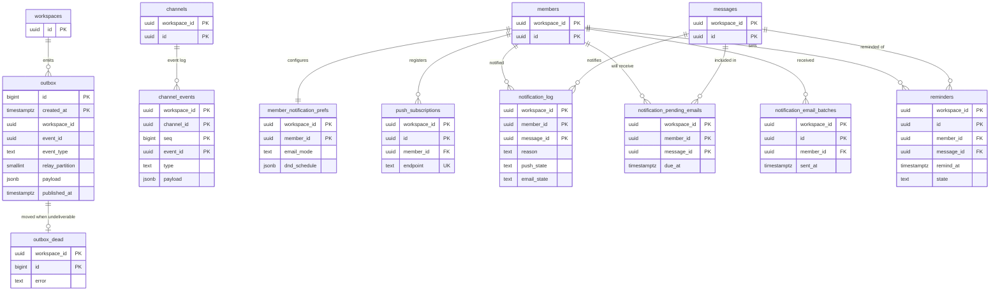

# Data model: イベントと通知

[data-model.md](../data-model.md) の一部。規約は、そちらの 2 節に従う。振る舞いは [realtime.md](../realtime.md)、[read-state-and-notifications.md](../read-state-and-notifications.md)、[ADR-0002](../../decisions/0002-db-as-source-of-truth-with-outbox.md)、[ADR-0014](../../decisions/0014-sqs-worker-queues-and-notification-delivery.md) を正とする。ペイロードの形は [stores.md](stores.md) の 4 節にある。

すべてテナントテーブル。`outbox` と `outbox_dead` は、`relay` ロールに全行を読む別のポリシーを持つ。

## 1. ER 図

## 2. イベント

### outbox

transactional outbox（ADR-0002）。API が業務の変更と同じトランザクションで積み、Relay が読んで Valkey と SQS に流し、消す。

| 列 | 型 | NULL | 既定 | 説明 |
| --- | --- | --- | --- | --- |
| `id` | `bigint` | NO | identity | Relay の読む順 |
| `created_at` | `timestamptz` | NO | `now()` | 分割キー |
| `workspace_id` | `uuid` | NO | | |
| `event_id` | `uuid` | NO | `uuidv7()` | 封筒の `event_id`。SQS・アプリへの配送でも同じ値 |
| `event_type` | `text` | NO | | `message.created` など（[messaging.md](../messaging.md) の「イベント」） |
| `channel_id` | `uuid` | YES | | チャンネルのストリームのイベント |
| `member_id` | `uuid` | YES | | メンバーのストリームのイベント（`read.updated` など）の宛先 |
| `seq` | `bigint` | YES | | `seq` を消費するイベントだけ |
| `relay_partition` | `smallint` | NO | | `hash(channel_id または member_id) mod P`（S1 は P = 16）。API が書く |
| `payload_v` | `smallint` | NO | `1` | |
| `payload` | `jsonb` | NO | | 16 KB を超える本文は省き、`truncated: true` を付ける |
| `trace_context` | `text` | YES | | W3C の `traceparent`（[observability.md](../observability.md) の 2.1 節） |
| `published_at` | `timestamptz` | YES | | Valkey に出した時刻。SQS への送出が済むまで行を残す（[realtime.md](../realtime.md) の 11.3 節） |

- 主キー：`(id, created_at)`（分割キーを含める）。ワークスペースを先頭にしない例外。行はワークスペースで引かず、Relay が `relay_partition` ごとに `id` の順で読むため。
- CHECK：`channel_id IS NOT NULL OR member_id IS NOT NULL`。`seq IS NOT NULL` なら `channel_id IS NOT NULL`。
- 索引：`(relay_partition, id)`（Relay の `ORDER BY id LIMIT 500`）。
- RLS：`tenant_isolation`（`app` は INSERT だけ許す）と、`relay` 向けの `USING (true)` のポリシー。`relay` は SELECT・DELETE と `published_at` の UPDATE だけ。
- 分割：`RANGE (created_at)`、1 日。空になった過去の日のパーティションを落とす（2.8 節）。
- 保持：配信の直後に消す。通常は数秒以内。
- S1 の規模：常に数千行以下。流量はピークで約 2,000 行/秒（`seq` のイベント約 450 件/秒と既読の更新など）。

### outbox_dead

配信できない outbox の行（大きさの上限超え、スキーマ違反）。1 行でパーティション全体を止めないため、移してアラートを出す。

| 列 | 型 | NULL | 既定 | 説明 |
| --- | --- | --- | --- | --- |
| `workspace_id` | `uuid` | NO | | |
| `id` | `bigint` | NO | | 元の `outbox.id` |
| `event_id`、`event_type`、`channel_id`、`member_id`、`seq`、`payload_v`、`payload`、`trace_context` | | | | `outbox` と同じ |
| `original_created_at` | `timestamptz` | NO | | |
| `error` | `text` | NO | | |
| `moved_at` | `timestamptz` | NO | `now()` | |
| `resolved_at` | `timestamptz` | YES | | 調べて再投入・破棄した時刻 |

- 主キー：`(workspace_id, id)`。
- RLS：`tenant_isolation` と、`relay` の INSERT のポリシー。
- 保持：`resolved_at` から 30 日で消す。
- S1 の規模：通常 0 件。

### channel_events

チャンネルのイベント列。差分取得（`GET .../events?after_seq=N`）の元（[realtime.md](../realtime.md) の 4 節）。outbox は配信後に消すので使えない。

| 列 | 型 | NULL | 既定 | 説明 |
| --- | --- | --- | --- | --- |
| `workspace_id`、`channel_id` | `uuid` | NO | | |
| `seq` | `bigint` | NO | | |
| `event_id` | `uuid` | NO | | `outbox.event_id` と同じ。分割キー |
| `type` | `text` | NO | | |
| `payload_v` | `smallint` | NO | | |
| `payload` | `jsonb` | NO | | そのチャンネルを読める人に見せてよい内容だけ |
| `created_at` | `timestamptz` | NO | `now()` | |

- 主キー：`(workspace_id, channel_id, seq, event_id)`。`seq` の一意性は採番で守る（[data-model.md](../data-model.md) の 2.8 節、I-2）。
- 外部キー：`(workspace_id, channel_id)` → `channels`。分割した表から張る。
- 索引：主キー（`seq > N ORDER BY seq LIMIT 1000` の範囲読み）。
- 分割：`RANGE (event_id)`、1 か月。30 日を過ぎたパーティションを落とす。古い位置から追いつくクライアントは、最新ページを取り直す。
- 読む側で ADR-0005 の判定を通す。
- S1 の規模：1 日約 750 万行、常に約 2〜4 億行。

## 3. 通知

### member_notification_prefs

メンバー単位の通知設定（[read-state-and-notifications.md](../read-state-and-notifications.md) の 6.1 節）。チャンネル単位の設定は `channel_members` にある。行がなければ既定値を使う。

| 列 | 型 | NULL | 既定 | 説明 |
| --- | --- | --- | --- | --- |
| `workspace_id`、`member_id` | `uuid` | NO | | |
| `channel_default_level` | `text` | NO | `'mentions'` | `all` / `mentions` / `none` |
| `dm_default_level` | `text` | NO | `'all'` | 同上 |
| `keywords` | `text[]` | NO | `'{}'` | 50 語まで。NFKC で正規化して保存する |
| `dnd_schedule` | `jsonb` | YES | | 曜日ごとの時間帯（本人のタイムゾーン） |
| `dnd_until` | `timestamptz` | YES | | 「〜まで一時停止」 |
| `push_enabled` | `boolean` | NO | `true` | |
| `push_preview` | `boolean` | NO | `true` | 本文のプレビューを含めるか |
| `email_mode` | `text` | NO | `'after_15m'` | `off` / `after_15m` / `after_1h` |
| `updated_at` | `timestamptz` | NO | `now()` | |

- 主キー：`(workspace_id, member_id)`。
- CHECK：`cardinality(keywords) <= 50`。
- 索引：`(workspace_id) WHERE cardinality(keywords) > 0`（ワークスペースの照合器を作るとき）。
- 変更は `prefs.updated` をメンバーのストリームに流す。
- S1 の規模：約 10 万行。

### push_subscriptions

Web Push の購読（端末）。

| 列 | 型 | NULL | 既定 | 説明 |
| --- | --- | --- | --- | --- |
| `workspace_id`、`id` | `uuid` | NO | | |
| `member_id` | `uuid` | NO | | |
| `endpoint` | `text` | NO | | Push サービスの URL |
| `p256dh`、`auth` | `text` | NO | | ペイロードの暗号化に使う鍵（ブラウザが作る） |
| `user_agent` | `text` | YES | | |
| `created_at` | `timestamptz` | NO | `now()` | |
| `last_success_at` | `timestamptz` | YES | | |

- 主キー：`(workspace_id, id)`。一意：`UNIQUE (workspace_id, member_id, endpoint)`。
- 索引：`(workspace_id, member_id)`（送信の宛先）。
- 404 / 410 の応答で行を消す。メンバーの無効化で全行を消す。
- S1 の規模：約 20 万行。

### notification_log

受け手ごとの通知の記録。冪等性の要（I-11）。

| 列 | 型 | NULL | 既定 | 説明 |
| --- | --- | --- | --- | --- |
| `workspace_id`、`member_id`、`message_id` | `uuid` | NO | | `message_id` が分割キー |
| `channel_id` | `uuid` | NO | | |
| `reason` | `text` | NO | | `dm` / `mention` / `thread` / `keyword` / `broadcast` / `all` |
| `push_state` | `text` | NO | `'none'` | `none` / `pending` / `sent` / `failed` |
| `email_state` | `text` | NO | `'none'` | `none` / `pending` / `sent` / `canceled` |
| `created_at` | `timestamptz` | NO | `now()` | |

- 主キー：`(workspace_id, member_id, message_id)`。planner は `INSERT ... ON CONFLICT DO NOTHING` で作る。
- 外部キーは張らない（期限付きの記録。メッセージの物理削除を妨げない）。
- 分割：`RANGE (message_id)`、1 か月。30 日を過ぎたパーティションを落とす。
- S1 の規模：1 日約 1,000 万行（1 投稿あたり平均 2 人）、常に約 3 億行。

### notification_pending_emails

遅らせて送るメールの予定（SQS の遅延は最大 15 分で足りないため）。

| 列 | 型 | NULL | 既定 | 説明 |
| --- | --- | --- | --- | --- |
| `workspace_id`、`member_id`、`message_id` | `uuid` | NO | | |
| `channel_id` | `uuid` | NO | | |
| `thread_root_id` | `uuid` | YES | | スレッドの返信なら、未読の判定に `thread_subscriptions` を使う |
| `seq` | `bigint` | NO | | 送る直前の未読の判定 |
| `reason` | `text` | NO | | |
| `due_at` | `timestamptz` | NO | | DND の間は終了時刻以降 |
| `created_at` | `timestamptz` | NO | `now()` | |

- 主キー：`(workspace_id, member_id, message_id)`。
- 索引：`(due_at)`（1 分ごとの送信の Worker。advisory lock で 1 台。ワークスペースをまたぐので `scheduler_due_items` から引く）、`(workspace_id, message_id)`（`message.deleted` で消す）。
- 送信と同じ単位で消す。
- S1 の規模：常に数十万行。

### notification_email_batches

送ったメールのまとめ。再実行で同じメールを送らないための記録（[read-state-and-notifications.md](../read-state-and-notifications.md) の 8 節）。

| 列 | 型 | NULL | 既定 | 説明 |
| --- | --- | --- | --- | --- |
| `workspace_id`、`id` | `uuid` | NO | | まとめの ID。メールのヘッダーにも入れる |
| `member_id` | `uuid` | NO | | |
| `message_ids` | `uuid[]` | NO | | 最大 20 件 |
| `state` | `text` | NO | `'sending'` | `sending` / `sent` |
| `sent_at` | `timestamptz` | YES | | |
| `created_at` | `timestamptz` | NO | `now()` | |

- 主キー：`(workspace_id, id)`。
- 索引：`(workspace_id, member_id, created_at DESC)`（1 人に設定した遅延の間に 1 通までの検査）。
- 流れ：行を `sending` で作る → SES で送る → 同じトランザクションで `sent` にし、予定の行を消す。再実行で `sending` の行があれば、SES の送信の記録を確かめてから決める。
- 保持：30 日。
- S1 の規模：1 日約 20 万行。

### reminders

リマインダー（[read-state-and-notifications.md](../read-state-and-notifications.md) の「リマインダー」）。

| 列 | 型 | NULL | 既定 | 説明 |
| --- | --- | --- | --- | --- |
| `workspace_id`、`id` | `uuid` | NO | | |
| `member_id` | `uuid` | NO | | 本人だけが一覧・編集・取り消しできる |
| `text` | `text` | NO | | |
| `remind_at` | `timestamptz` | NO | | 次に知らせる時刻 |
| `recurrence` | `jsonb` | YES | | 繰り返しの規則（毎日・毎週など。本人のタイムゾーンで解釈） |
| `message_id` | `uuid` | YES | | メッセージへのリマインド |
| `state` | `text` | NO | `'pending'` | `pending` / `fired` / `completed` / `canceled` |
| `created_at` / `updated_at` | `timestamptz` | NO | `now()` | |

- 主キー：`(workspace_id, id)`。
- 外部キー：`(workspace_id, member_id)` → `members`、`(workspace_id, message_id)` → `messages`。
- 索引：`(remind_at) WHERE state = 'pending'`（`scheduler_due_items`）、`(workspace_id, member_id, remind_at)`（本人の一覧）。
- 保持：`completed` / `canceled` を 90 日で消す。
- S1 の規模：数百万行。
