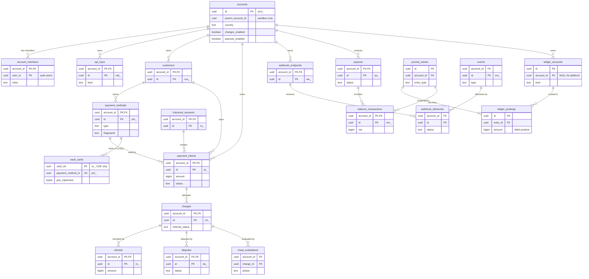

# Data model: Stripe

データモデルの正本。規約、置き場所、全体の ER 図、横断の不変条件、領域ごとのテーブルの定義をここと [data-model/](data-model/) に置く。

- **列・制約・索引の正本は、このファイルと `data-model/` の各ファイル** である。領域の文書（[payments.md](payments.md) など）は振る舞いの正本で、テーブルは要点だけを書く。両者が食い違ったら、このデータモデルに合わせて領域の文書を直す。
- 実装の変更（開発リポジトリの `changes/`）でマイグレーションを書くときは、同じ PR でここを更新する。
- 方針の元は [ADR-0002](../decisions/0002-account-tenancy.md)（テナント）、[ADR-0003](../decisions/0003-double-entry-ledger.md)（台帳）、[ADR-0004](../decisions/0004-idempotency.md)（冪等）、[ADR-0005](../decisions/0005-pci-scope-segmentation.md)（CDE）、[ADR-0024](../decisions/0024-data-retention-and-deletion.md)（保持）。
- 行数・容量の「S1 の量」は、[capacity.md](capacity.md) の 1 節からの **初期見積もり** である。E10 の負荷試験で置き換える。

## 1. ファイルの構成

| ファイル | 領域 | テーブルの数 |
| --- | --- | --- |
| [data-model/accounts-and-keys.md](data-model/accounts-and-keys.md) | アカウント、ダッシュボードの利用者、API キー | 13 |
| [data-model/payments.md](data-model/payments.md) | PaymentIntent、Charge、Refund、SetupIntent、コネクタの要求と通知 | 8 |
| [data-model/payment-methods.md](data-model/payment-methods.md) | Customer、PaymentMethod、銀行振込の口座と現金残高、返金先の口座 | 5 |
| [data-model/disputes.md](data-model/disputes.md) | Dispute、証拠、早期の不正警告、File | 4 |
| [data-model/ledger.md](data-model/ledger.md) | 台帳、残高、BalanceTransaction、手数料、リザーブ | 13 |
| [data-model/payouts-and-reconciliation.md](data-model/payouts-and-reconciliation.md) | 入金、入金先、銀行への依頼、精算・明細、照合、会計への出力 | 11 |
| [data-model/card-vault.md](data-model/card-vault.md) | CDE の Vault DB | 4 |
| [data-model/events-and-webhooks.md](data-model/events-and-webhooks.md) | outbox、Event、Webhook | 7 |
| [data-model/checkout.md](data-model/checkout.md) | Checkout Session、ブランディング、コンビニの払込票 | 3 |
| [data-model/fraud.md](data-model/fraud.md) | ルール、リスト、評価、レビュー | 7 |
| [data-model/onboarding.md](data-model/onboarding.md) | 審査、capability、本人確認、リザーブの計画 | 6 |
| [data-model/audit-and-operations.md](data-model/audit-and-operations.md) | 公開 API の冪等キー、監査、要求のログ、レート制限の上書き、影の実行、レポート、ダッシュボードの設定 | 8 |
| [data-model/stores.md](data-model/stores.md) | DB 以外の置き場所：Valkey のキー、S3 の配置、outbox・Event・Webhook・SQS の本文、仕訳の種類と冪等キー | — |

合計 89 テーブル。ER 図は領域ごとに 12 個と、下の 4 節の全体図 1 個。

## 2. 置き場所

| 置き場所 | 中身 | 環境の分け方 |
| --- | --- | --- |
| 本体の Aurora PostgreSQL 18（live のクラスタ） | 本番のテナントのデータ。`auth` スキーマ（利用者とセッション）、`account_members` などのダッシュボードの権限もここだけに置く | クラスタ（[ADR-0002](../decisions/0002-account-tenancy.md)） |
| 本体の Aurora PostgreSQL 18（test のクラスタ） | サンドボックス（テスト環境）のテナントのデータ。サンドボックスは独立した `acct_`（`parent_account_id` で本番のアカウントを指す。[api.md](api.md) の 11 節） | 同上 |
| Vault DB（cde-live・cde-test の Aurora PostgreSQL） | 暗号化した PAN、表示用の情報、指紋、`pm_` との対応（[data-model/card-vault.md](data-model/card-vault.md)）。本体のロールは接続できない | CDE のアカウント（[ADR-0029](../decisions/0029-multi-account-and-cde-layout.md)） |
| CDE の ElastiCache | CVC の一時保管（TTL 30 分、永続化なし） | 同上 |
| 本体の ElastiCache（Valkey） | レート制限の計数、不正検知の速度の集計、Webhook の同時送信の計数、キーのキャッシュの無効化の通知。**正本を置かない**（失っても決済は続く） | キーに環境を含める |
| S3（本体のアカウント） | File（Dispute の証拠、ロゴ）、本人確認の書類、精算ファイル・銀行の明細の原本、台帳の古いパーティション（Parquet・Iceberg）、レポート、会計への出力 | バケットのパスに環境を含める |
| S3（log-archive のアカウント） | 監査のアーカイブ（本体・CDE）、CloudTrail、ログ（[ADR-0023](../decisions/0023-audit-log.md)） | 同上 |
| SQS | outbox の中継、Webhook の配信、コネクタの結果（CDE → 本体の `connector-results`） | キューを環境ごとに分ける |
| 検索の索引 | 検索 API の索引（E11。実装は PoC で決める。[api.md](api.md) の 5.3 節） | — |

- 本文の置き場所ごとのキー・パス・本文の形は [data-model/stores.md](data-model/stores.md) にある。
- S2 では台帳とそれを同じトランザクションで書く表を `account_id` のハッシュでシャードに分け、Webhook の配信の表を配信専用のクラスタに移す（8 節）。

## 3. 規約

### 3.1 ID と接頭辞

- DB の ID は `uuid` 型の **UUIDv7**。PostgreSQL 18 の組み込みの `uuidv7()` で作る。文字列の ID を列に持たない（[api.md](api.md) の 3.3 節）。
- API の ID は `<接頭辞>_<UUID の base62、22 文字>`。接頭辞はテーブルから決まる。接頭辞が違う ID は、DB を引かずに 404 を返す。
- **`created_at` は ID の時刻と同じ値にする。** 挿入のトリガー `set_created_at_from_id()` が `uuid_extract_timestamp(id)` を入れる。ID だけから日ごと・月ごとのパーティションを絞れる。例外は `ledger_postings`（仕訳と同じ `created_at`。[data-model/ledger.md](data-model/ledger.md)）と `settlement_lines`（ファイルの取り込みの時刻。[data-model/payouts-and-reconciliation.md](data-model/payouts-and-reconciliation.md)）。
- オブジェクトの接頭辞は本家に合わせる（秘密ではないため。[README.md](README.md) の 6 節の決定）。キー・秘密の接頭辞だけを `<brand>_` 付きにする（リポジトリ共通の [ADR-0006](../../../../docs/decisions/0006-brand-neutral-identifiers.md)）。

| 接頭辞 | 種類 | テーブル | 接頭辞 | 種類 | テーブル |
| --- | --- | --- | --- | --- | --- |
| `acct_` | アカウント | `accounts` | `du_` | Dispute | `disputes` |
| `cus_` | Customer | `customers` | `issfr_` | 早期の不正警告 | `early_fraud_warnings` |
| `pm_` | PaymentMethod | `payment_methods` | `file_` | File | `files` |
| `pi_` | PaymentIntent | `payment_intents` | `txn_` | BalanceTransaction | `balance_transactions` |
| `ch_` | Charge（確定の試行） | `charges` | `po_` | Payout | `payouts` |
| `re_` | Refund | `refunds` | `ba_` | 入金先の口座 | `bank_accounts` |
| `seti_` | SetupIntent | `setup_intents` | `evt_` | Event | `events` |
| `setatt_` | SetupAttempt | `setup_attempts` | `we_` | Webhook のエンドポイント | `webhook_endpoints` |
| `ccsbtxn_` | 現金残高の取引 | `cash_balance_transactions` | `cs_` | Checkout のセッション | `checkout_sessions` |
| `prv_` | レビュー | `reviews` | `rsl_` | 不正検知のリスト | `fraud_lists` |
| `frr_` | レポートの実行 | `report_runs` | `rak_` | API キーの ID（キーの値とは別） | `api_keys` |
| `req_` | 要求の ID | `api_request_logs` | `ci_` | 使い捨ての `card_input`（CDE が発行） | `vault_cards` |

| キー・秘密の形 | 用途 |
| --- | --- |
| `<brand>_{pk\|sk\|rk}_{live\|test}_{本体}` | API キー（[auth-and-keys.md](auth-and-keys.md) の 5.2 節） |
| `<brand>_whsec_{32 バイト}` | Webhook の署名の秘密 |
| `pi_..._secret_...`、`cs_..._secret_...`、`seti_..._secret_...` | `client_secret`（DB にはハッシュだけ） |
| `vc_` ＋ 128 bit | Vault の `card_ref`。**CDE の外に出さない** |

- 公開しない内部の行（仕訳、口座、照合など）は接頭辞を持たない。ログと画面には UUID をそのまま出す。

### 3.2 テナントと RLS

- **テナントは加盟店のアカウント。** テナントテーブルは先頭の列に `account_id uuid NOT NULL` を持ち、主キーを `(account_id, id)` にする（[ADR-0002](../decisions/0002-account-tenancy.md)）。
- **外部キーは `account_id` を含む複合キーにする。** 別の加盟店の行を指す行を DB が拒否する。
- **索引は `account_id` を先頭に置く。** `(account_id, id DESC)` がそのまま一覧のカーソルになる（[api.md](api.md) の 5.1 節）。
- 全テナントテーブルに次の方針を張る。`current_setting` の `missing_ok` を使わないので、コンテキストがなければ問い合わせ自体が失敗する（安全側）。

```sql
ALTER TABLE <t> ENABLE ROW LEVEL SECURITY;
ALTER TABLE <t> FORCE ROW LEVEL SECURITY;
CREATE POLICY tenant_isolation ON <t>
  USING      (account_id = current_setting('app.account_id')::uuid)
  WITH CHECK (account_id = current_setting('app.account_id')::uuid);
```

- トランザクションごとに `SET LOCAL app.account_id` を設定する。主体ごとの決め方は [auth-and-keys.md](auth-and-keys.md) の 8 節。
- 子のテーブル（`webhook_delivery_attempts`、`ledger_postings` など）も `account_id` を持ち、同じ方針を張る。親を結合しないと絞れない RLS は作らない。

DB ロール：

| ロール | 権限 | 使う処理 |
| --- | --- | --- |
| `migrator` | 所有者。DDL | マイグレーション |
| `app` | テナントテーブルの読み書き（RLS の対象。`BYPASSRLS` なし）。台帳・監査の表は `INSERT`・`SELECT` だけ | api、dashboard、checkout、workers |
| `relay` | `BYPASSRLS`。ただし権限は `outbox` の `SELECT`・`DELETE` だけ | outbox の中継 |
| `sweeper` | `BYPASSRLS`。期限の掃除の対象の表の `account_id`・`id`・状態・期限の列の `SELECT` だけ。見つけた `(account_id, id)` を SQS に積み、処理は `app` で行う | オーソリの失効、3DS の放棄、コンビニ・Session の期限、結果不明の照会、保留した返金、リザーブの解放、Webhook の再試行の予定 |
| `payout` | `app` と同じ RLS の対象。加えて `payout_batches` の読み書き | 入金の締めと依頼 |
| `recon` | `BYPASSRLS`。照合・会計の表と台帳の読み取り、照合の仕訳の追記。操作は `platform_audit_events` に残す | 照合、会計への出力、日次の検査 |
| `auth` | `auth` スキーマの読み書き。`SECURITY DEFINER` の `auth_resolve_api_key()` の実行 | 認証のミドルウェア |

### 3.3 RLS の例外

RLS を掛けない（テナントの外の）テーブルは次だけ。**この表が一覧の正本** で、[security.md](security.md) と [ADR-0014](../decisions/0014-connector-inbox.md) はここを指す。足すときは、本書の更新か ADR で決める。

| テーブル | 理由 | 読み書きできる主体 |
| --- | --- | --- |
| `auth.users`、`auth.auth_identities`、`auth.sessions`、`auth.passkeys`、`auth.two_factors`、`auth.verifications` | 認証はテナントの外（[auth-and-keys.md](auth-and-keys.md) の 1 節） | `auth` |
| `connector_inbox` | 受けた時点では加盟店が分からない（ADR-0014） | 受信口（INSERT）と反映のワーカー |
| `platform_fraud_rules`、`platform_fraud_list_items` | プラットフォームの判断 | 社内の管理画面、評価（読み取り） |
| `platform_audit_events` | プラットフォームの監査 | 追記は各処理、読み取りは監査のロール |
| `business_calendars`、`fx_quotes` | 全加盟店に共通のマスタ | 読み取り（`app`）、更新は Ops |
| `fee_schedules` の既定の行（`account_id IS NULL`）、`ledger_accounts` のプラットフォームの口座（`account_id IS NULL`） | 全加盟店に共通。行ごとの方針で `account_id IS NULL` の行を読み取りだけ許す | `app`（読み取り） |
| `payout_batches`、`settlement_files`、`settlement_lines`、`bank_statements`、`bank_statement_lines`、`recon_matches`、`recon_breaks`、`gl_exports` | 複数の加盟店にまたがる | `recon`、`payout`（`payout_batches` だけ） |
| `shadow_results` | リリースの比較（加盟店をまたいで集計する） | 影の実行のワーカー、QA |

- API キーの行の検索は RLS の前に要るので、`SECURITY DEFINER` の関数 `auth_resolve_api_key(key_id)` だけで行う（[auth-and-keys.md](auth-and-keys.md) の 8 節）。
- RLS の前に行を引く必要がある処理は、`SECURITY DEFINER` の関数だけで行い、`account_id` と ID だけを返す。一覧：`auth_resolve_api_key`、`auth_list_member_accounts`、`auth_resolve_invitation`（[data-model/accounts-and-keys.md](data-model/accounts-and-keys.md)）、`resolve_by_connector_ref`、`resolve_by_acquirer_txn`（[data-model/payments.md](data-model/payments.md)）、`resolve_virtual_account`、`resolve_refund_input`（[data-model/payment-methods.md](data-model/payment-methods.md)）、`resolve_konbini_voucher`（[data-model/checkout.md](data-model/checkout.md)）。足すときは本書を更新する。
- `fee_schedules` と `ledger_accounts` は RLS を掛けたうえで、方針を 2 つにする：`account_id = 現在のアカウント`（読み書き）と、`account_id IS NULL`（読み取りだけ）。

### 3.4 テスト環境と本番環境

- 環境は **クラスタで分ける**（ADR-0002）。テナントテーブルに `livemode` の列を持たない。API の応答の `livemode` は、接続したクラスタから決める（live なら `true`）。
- Vault DB も cde-live・cde-test で別のクラスタなので、`livemode` の列を持たない。
- ADR-0014 の受信箱の一意制約 `(connector, livemode, 通知の ID)` の `livemode` は、クラスタで表す（受信箱は環境ごとのクラスタにある）。
- Valkey・S3・SQS は、キー・パス・キューの名前に環境（`live` / `test`）を含める（[data-model/stores.md](data-model/stores.md)）。

### 3.5 時刻

- 時刻は `timestamptz`、UTC で保存する。API は Unix 秒で返す。
- 日付は `date` 型で、JST（加盟店の暦）の日付を入れる。列の名前は `_on`（`available_on`、`arrival_on` など）。API の `available_on`・`arrival_date` は、その日の JST 0:00 の Unix 秒で返す（[ledger.md](ledger.md) の 5.1 節）。
- 会計の日時 `effective_at` は `created_at` より前にしない（締めた月を書き換えない。[payouts-and-reconciliation.md](payouts-and-reconciliation.md) の 7 節）。

### 3.6 金額と通貨

- 金額は **通貨の最小単位の `bigint`** と、ISO 4217 の小文字の通貨コード（`text`、`CHECK (currency ~ '^[a-z]{3}$')`）の組で持つ（[ADR-0001](../decisions/0001-platform-and-stack.md)）。JPY は円、USD はセント。
- `numeric`・浮動小数点で金額を持たない。例外は換算のレート（`exchange_rate numeric`）と料率（`rate_bps integer`）。
- 金額の列には符号の規則を CHECK で書く。状態のテーブルの金額は正（`amount > 0`）。台帳の明細は **借方が正、貸方が負**、0 は禁止（[ledger.md](ledger.md) の 2 節）。BalanceTransaction の `amount` は加盟店から見た増減の符号。
- MVP で受け付ける通貨は `jpy` だけ（[payments.md](payments.md) の 12 節）。列は通貨を持ち、S2 で広げる。

### 3.7 冪等

[ADR-0004](../decisions/0004-idempotency.md) の 3 層を、次のテーブルで守る。

| 層 | キー | テーブル・制約 |
| --- | --- | --- |
| API | `Idempotency-Key`（アカウント × 環境 × キー） | `idempotency_keys`。パーティションをまたぐ一意は、`pg_advisory_xact_lock(hashtextextended(account_id::text \|\| key, 0))` で直列にし、直近 48 時間のパーティションを引いてから挿入する（[data-model/audit-and-operations.md](data-model/audit-and-operations.md)） |
| 内部 | 操作から決まる ID（例：`capture:{charge_id}`） | 仕訳は `ledger_entry_keys` の主キー。Event は `events` の `idempotency_source`。遷移は遷移関数が「同じ結果への遷移は何もしない」 |
| コネクタ | 参照番号 | `charges`・`refunds` の `UNIQUE (connector, connector_reference)`、`payout_batches.bank_request_ref` の一意 |

- 冪等キーの形の一覧は [data-model/stores.md](data-model/stores.md) の 5 節。

### 3.8 論理削除と個人情報の除去

- **お金の記録は消さない。** 決済・返金・Dispute・入金・台帳・BalanceTransaction の行は、保持期間の間は物理削除しない。
- 論理削除を持つのは `customers.deleted_at`（本家の `deleted: true`）、`payment_methods.detached_at`、`webhook_endpoints.deleted_at`、`api_keys.expired_at` だけ。論理削除した行は一覧から外し、ID での取得は本家と同じ応答を返す。
- **個人情報の除去**（[ADR-0024](../decisions/0024-data-retention-and-deletion.md)）：期限を過ぎた取引の行は、個人情報の列を `NULL` か空にし、`redacted_at` を入れる。金額・ID・日付は残す。個人情報の列はマイグレーションの注記（下の 3.9 節）で分かる。
- パーティションで消す表（冪等キー、Event、配信の試行、要求のログなど）は `DROP` で消す（3.11 節）。

### 3.9 命名と型

- テーブルは英語の複数形の `snake_case`。列は `snake_case`。外部キーは `<単数形>_id`、時刻は `_at`、日付は `_on`、真偽は `is_` か状態の形容詞（`attached`）。
- 状態は `text` と `CHECK (status IN (...))` で持つ。PostgreSQL の列挙型は使わない（値の追加でロックを取らないため）。値は本家の API の値をそのまま使う。
- 本家の API の入れ子のオブジェクトで、検索しないもの（`billing_details`、`next_action`、`evidence` など）は `jsonb` に持つ。`jsonb` の形は `packages/contract` の Zod スキーマで検証してから書く。
- `metadata` は `jsonb NOT NULL DEFAULT '{}'`。上限（キー 50 個、キー 40 文字、値 500 文字）は CHECK と Zod の両方で守る（[api.md](api.md) の 4.3 節）。
- 個人情報の列には、マイグレーションで `COMMENT ON COLUMN ... IS 'pii:<分類>;retention:<区分>'` を付ける。付いていなければ CI の lint が失敗する（ADR-0024 の Confirmation）。本書の列の表では「PII」と書く。

### 3.10 暗号化

| 対象 | 方式 | 鍵 |
| --- | --- | --- |
| Aurora・スナップショット・S3・SQS | 保存時の暗号化 | 本体の `db`・`backup`・`files`・`queue`（[security.md](security.md) の 5 節） |
| 本人確認の書類（S3） | 保存時の暗号化。閲覧は審査担当のロールだけ | `kyc` |
| Webhook の署名の秘密（`webhook_endpoint_secrets.ciphertext`） | 列の暗号化（アプリが KMS で暗号化） | `webhook-secrets` |
| サンドボックスの API キーの秘密（`api_keys.secret_ciphertext`） | 列の暗号化 | `secrets` |
| 銀行の口座番号・名義（`bank_accounts`、`refund_bank_details`） | 列の暗号化。検索は下 4 桁と HMAC で行う | `bank-accounts`（2026-09-28 に追加） |
| 本番の API キーの秘密 | SHA-256 のハッシュだけ（復号できる形で持たない） | — |
| `client_secret` | SHA-256 のハッシュだけ | — |
| PAN（Vault DB） | AWS Encryption SDK でエンベロープ暗号化（AES-256-GCM） | `cde-pan`（[ADR-0019](../decisions/0019-vault-encryption-and-key-hierarchy.md)） |
| CVC（CDE の ElastiCache） | 列の暗号化、TTL 30 分 | `cde-sad` |
| 指紋 | KMS の HMAC | `cde-fp` |

- 列の暗号化の値は、`bytea` に AWS Encryption SDK のメッセージの形のまま入れる（包んだデータキーを含む）。

### 3.11 パーティションと保持

保持の正本は [security.md](security.md) の 13 節。法定の期間（取引 7 年、台帳 10 年、本人確認 7 年、監査のアーカイブ 7 年）は **法務の確認待ち**（[intent.md](../intent.md) の L6）。

| テーブル | パーティション | DB に置く期間 | その後 |
| --- | --- | --- | --- |
| `journal_entries`、`ledger_postings` | `created_at` の月 | 13 か月 | S3 の Parquet（Iceberg、Object Lock）に移し、10 年まで残す |
| `balance_transactions` | なし（S1）。S2 で `created_at` の月 | 7 年 | 個人情報を持たない。7 年の後に S3 へ |
| `events` | `created_on`（ID の時刻の日付）の日 | 31 日 | `event_summaries` に要約を写してから `DROP` |
| `webhook_deliveries` | `event_created_on` の日 | 31 日 | `DROP` |
| `event_summaries` | `created_at` の月 | 13 か月 | `DROP` |
| `outbox` | `created_at` の時間 | 中継の済んだ時間のパーティションを 24 時間後に `DROP` | — |
| `idempotency_keys` | `created_at` の日 | 48 時間 | `DROP` |
| `webhook_delivery_attempts` | `attempted_at` の日 | 15 日 | `DROP` |
| `api_request_logs` | `created_at` の日 | 30 日 | `DROP` |
| `connector_inbox` | `received_at` の月 | 13 か月 | `DROP` |
| `connector_requests` | `created_at` の月 | 13 か月 | S3 の Parquet に移し、7 年まで残す |
| `fraud_evaluations` | `evaluated_at` の日 | 2 年 | 個人情報の属性（メール、IP）を消す |
| `audit_events`、`platform_audit_events` | `created_at` の月 | 1 年 | アーカイブ（log-archive）に 7 年 |
| `settlement_lines`、`bank_statement_lines` | `created_at` の月 | 13 か月 | 原本は S3 に 10 年（[infrastructure.md](infrastructure.md) の 5 節） |
| `shadow_results` | `created_at` の日 | 90 日 | `DROP` |

- パーティションは pg_partman で先に 14 個（日）・3 個（月）を作っておく。
- 取引の記録（決済・返金・Dispute・入金）は年度の終わりから 7 年で個人情報を除く（3.8 節）。

### 3.12 CDE の境界

| データ | 置き場所 | 本体に来るか |
| --- | --- | --- |
| PAN | Vault DB（暗号化） | **来ない** |
| CVC | CDE の ElastiCache（最初のオーソリまで） | **来ない** |
| `card_ref`（`vc_`） | Vault DB | **来ない** |
| DEK・鍵 | KMS（CDE の鍵） | **来ない** |
| ネットワークの取引 ID（MIT 用） | Vault DB | **来ない**（connector-gateway が使う） |
| `card_input`（`ci_`） | Vault DB のハッシュ | 紐づけの 1 回だけ本体を通る（唯一の例外。[ADR-0029](../decisions/0029-multi-account-and-cde-layout.md) の注記） |
| `pm_`、`account_id` | 両方 | 境界を越える識別子。本体 → CDE の要求で渡す |
| ブランド、BIN（6 桁）、下 4 桁、有効期限、funding、発行国 | 両方 | 紐づけの応答で来る（`payment_methods.card_display`） |
| 加盟店向けの指紋、内部向けの指紋 | 両方 | 紐づけの応答で来る（`payment_methods.fingerprint`・`fingerprint_internal`）。内部向けは加盟店に出さない |
| 公開可能キーの ID と `account_id` の対応 | 両方 | 本体 → CDE へ同期する（`vault_publishable_keys`） |
| コネクタの結果、カード番号を除いた通知 | 本体 | CDE → 本体の SQS `connector-results` |

- 本体の DB・ログ・メッセージに PAN の形（Luhn を満たす 13〜19 桁）が出ないことを、CI と本番の走査で確かめる（ADR-0005 の Confirmation）。`metadata` と `jsonb` の列も走査の対象にする。
- 本体に指紋と BIN・下 4 桁を置く扱いは、QSA に確認する（[card-vault.md](card-vault.md) の 4 節。持ち越し）。

## 4. 全体の ER 図

領域をまたぐ主な関係だけを描く。列の詳細は各領域の図にある。`vault_cards` は CDE の別のクラスタにあり、DB の外部キーはない（`payment_method_id` の値で対応する）。



## 5. 横断の不変条件

| 不変条件 | 守り方（DB） | 根拠 |
| --- | --- | --- |
| **複式の釣り合い**：仕訳ごと・通貨ごとに明細の合計が 0。明細は 2 行以上、0 の行はない、明細の通貨と口座の通貨が一致する | コミット時の遅延制約のトリガー `ledger_check_entry_balanced()`。`CHECK (amount <> 0)` | [ADR-0003](../decisions/0003-double-entry-ledger.md)、[data-model/ledger.md](data-model/ledger.md) |
| **台帳は追記のみ**：`journal_entries`・`ledger_postings`・`ledger_entry_keys` を更新・削除しない。誤りは `reverses_entry_id` の逆の仕訳で直す | `app` から `UPDATE`・`DELETE` の権限を外す。拒否のトリガー。マイグレーションの CI での拒否 | ADR-0003、[ADR-0032](../decisions/0032-release-safety-for-money-moving-code.md)、[delivery.md](delivery.md) の 5.3 節 |
| **1 つの仕訳は 1 つの加盟店**：プラットフォームの口座への明細も、仕訳の `account_id` を持つ | 遅延制約のトリガーで、明細の `account_id` と仕訳の `account_id` の一致を確かめる | [ADR-0015](../decisions/0015-chart-of-accounts-and-balance-transactions.md)、[ADR-0016](../decisions/0016-hot-accounts-and-ledger-sharding.md) |
| **状態の遷移と仕訳は同じトランザクション**：状態のテーブル・仕訳・BalanceTransaction・`events`・`outbox` を 1 つで書く | 遷移関数（1 か所）。lint で `payment_intents.status` の直接の UPDATE を禁止 | ADR-0003、[ADR-0010](../decisions/0010-payment-intent-state-machine.md) |
| **残高は仕訳から求める**：集計（スロット・スナップショット・日次の集計）は仕訳と同じトランザクションか日次のジョブで作り、日次で再計算と突き合わせる | 日次の検査（[ledger.md](ledger.md) の 4.2 節） | ADR-0003、ADR-0016 |
| **BalanceTransaction は仕訳の射影**：`status`・`availability_entry_id`・`payout_id` 以外を変えない。加盟店・通貨ごとの `net` の合計 ＝ `merchant_*` の残高（符号反転） | 列ごとの `UPDATE` の権限。日次の検査 | ADR-0015 |
| **3 層の冪等**：同じ要求・操作・参照番号で、お金は 1 回しか動かない | 3.7 節の一意制約と advisory lock | [ADR-0004](../decisions/0004-idempotency.md) |
| **成功するオーソリは 1 つの PaymentIntent に高々 1 回** | `charges` の部分一意索引 2 つ：`internal_status IN ('authorized','captured','partially_refunded','refunded')` と `internal_status IN ('pending_send','sent','unknown')` をそれぞれ `(account_id, payment_intent_id)` で一意 | ADR-0010、[ADR-0011](../decisions/0011-connector-abstraction-and-unknown-outcome.md) |
| **キャプチャは 1 回だけ**：1 つの Charge にキャプチャの仕訳はちょうど 1 つ | 仕訳の冪等キー `capture:{charge_id}`（`ledger_entry_keys` の主キー）。`charges.captured_at` は 1 回だけ設定（トリガーで `NULL` 以外への上書きを拒否） | ADR-0010、[payments.md](payments.md) の 3.2 節 |
| **返金の合計 ≦ キャプチャ済みの額** | Charge の行を `FOR UPDATE` で取ってから比べる。`charges.amount_refunded <= amount_captured` の CHECK | [payments.md](payments.md) の 10.1 節 |
| **入金は同じ残高を 2 回使わない** | 入金の作成と同じトランザクションで `merchant_available` から引く。自動入金の BT は `payout_id` を 1 回だけ設定 | [ADR-0018](../decisions/0018-payout-execution-via-banking-partner.md) |
| **Event は遷移 1 つにちょうど 1 つ** | 同じトランザクションで書く。`events` の `(account_id, idempotency_source, created_on)` の一意（同じ日の中）と、遷移関数の冪等 | [ADR-0026](../decisions/0026-snapshot-event-model.md) |
| **テナントの分離** | 3.2 節の RLS と複合の外部キー | ADR-0002 |
| **CDE の境界**：本体に PAN・CVC・`card_ref` の列を作らない。境界を越える識別子は `pm_` だけ（例外は `card_input`） | 本体のスキーマの lint（列名と型の許可リスト）、PAN の形の走査 | [ADR-0005](../decisions/0005-pci-scope-segmentation.md)、[ADR-0029](../decisions/0029-multi-account-and-cde-layout.md) |
| **監査は追記のみ** | `audit_events`・`platform_audit_events` に `app` は `INSERT`・`SELECT` だけ | [ADR-0023](../decisions/0023-audit-log.md) |

## 6. 段階ごとの変化

| 段階 | 変化 |
| --- | --- |
| S1 | live・test の 2 クラスタ。台帳・状態・Event・Webhook の配信を同じクラスタに置く |
| S2 | 台帳（`journal_entries`、`ledger_postings`、`ledger_entry_keys`、`ledger_balance_slots`、`balance_transactions`）と、同じトランザクションで書く状態のテーブル（`payment_intents`、`charges`、`refunds`、`payouts`、`disputes`、`customers`、`cash_balance_transactions` ほか、決済を書くときに同じトランザクションで触る全テナントテーブル）を `account_id` のハッシュで同じシャードに置く（仮想のシャード 1,024 → 物理のクラスタ。[ADR-0016](../decisions/0016-hot-accounts-and-ledger-sharding.md)）。プラットフォームの口座はシャードごとに持つ。`webhook_deliveries`・`webhook_delivery_attempts` を配信専用のクラスタへ移す（`events` は本体に残す）。`balance_transactions` を月ごとのパーティションにする |
| S3 | 加盟店をセルに固定し、テナントのデータはセルの中に閉じる。セルの外（Global）に、キー → アカウント → セルの対応表と、ダッシュボードのログインとセッション（`auth` スキーマ）を置く（[ADR-0031](../decisions/0031-active-active-cells.md)）。対応表の置き場所の製品は S3 の着手時に決める |

S3 の対応表の最小の形（Global。テナントの外）：

| テーブル | 列 |
| --- | --- |
| `account_cells` | `account_id`（PK）、`environment`（`live` / `test`）、`cell_id`、`moved_at` |
| `api_key_routes` | `key_id`（PK、`rak_`）、`account_id`、`environment`、`cell_id` |

## 7. 持ち越し

| 項目 | いつ・どう決めるか |
| --- | --- |
| 行数・容量の見積もりと、パーティションの粒度（日・月）の見直し | E10 の負荷試験 |
| 本体に指紋・BIN・下 4 桁を置く扱い、`vault_publishable_keys` の同期の扱い | E10 の QSA の事前相談 |
| 検索 API の索引の置き場所と列 | E11 の PoC（[api.md](api.md) の 5.3 節） |
| 法定の保存期間（3.11 節） | 法務の確認（[intent.md](../intent.md) の L6） |
| 消費税の口座（`tax_payable`）と `fee_details` の `tax` | 法務・税理士の確認（L8） |
| 顧客の現金残高を長く残したときの扱い（`customer_cash_balance` の移し替え） | 法務の確認（L1） |
| S3 の対応表の置き場所の製品 | S3 の着手時（ADR-0031） |
