# Data model: アカウントと API キー

加盟店のアカウント、ダッシュボードの利用者とメンバー、API キーとアクセスポリシー。振る舞いは [auth-and-keys.md](../auth-and-keys.md)、テナントの分け方は [ADR-0002](../../decisions/0002-account-tenancy.md)、キーは [ADR-0008](../../decisions/0008-api-keys-and-dashboard-access.md) にある。規約は [data-model.md](../data-model.md) の 3 節。

## 1. ER 図

`auth` スキーマは live のクラスタだけにある（RLS の外）。`accounts`・`api_keys`・`access_policies` は live・test の両方のクラスタにある。

```mermaid
erDiagram
    auth_users ||--o{ auth_identities : "signs in with"
    auth_users ||--o{ auth_sessions : "has"
    auth_users ||--o{ auth_passkeys : "registers"
    auth_users ||--o{ auth_two_factors : "enrolls"
    auth_users ||--o{ account_members : "belongs to"
    accounts ||--o{ account_members : "has"
    accounts ||--|{ account_owners : "owned by"
    auth_users ||--o{ account_owners : "owns"
    accounts ||--o{ invitations : "invites"
    accounts ||--o{ sandbox_access : "grants"
    accounts ||--o{ api_keys : "issues"
    access_policies ||--o{ api_keys : "restricts"
    accounts ||--o{ access_policies : "defines"
    api_keys ||--o{ api_keys : "rolled into"

    auth_users {
        uuid id PK
        text email UK "PII"
        boolean email_verified
        text name "PII"
    }
    auth_identities {
        uuid id PK
        uuid user_id FK
        text provider_id "otp google"
        text provider_account_id
    }
    auth_sessions {
        uuid id PK
        uuid user_id FK
        text token_hash UK
        uuid active_account_id
        jsonb auth_context "amr"
        timestamptz expires_at
    }
    auth_passkeys {
        uuid id PK
        uuid user_id FK
        text credential_id UK
        bytea public_key
    }
    auth_two_factors {
        uuid id PK
        uuid user_id FK
        bytea totp_secret_ciphertext
    }
    accounts {
        uuid id PK "acct_"
        uuid parent_account_id "sandbox to live"
        text business_type
        text country
        text default_api_version
        boolean charges_enabled
        boolean payouts_enabled
        jsonb requirements
    }
    account_members {
        uuid account_id PK, FK
        uuid user_id PK, FK
        text roles "array"
        timestamptz deactivated_at
    }
    account_owners {
        uuid account_id PK, FK
        uuid user_id FK
    }
    invitations {
        uuid account_id PK, FK
        uuid id PK
        text email "PII"
        text token_hash UK
        timestamptz expires_at
    }
    sandbox_access {
        uuid account_id PK, FK
        uuid sandbox_account_id PK
        uuid user_id PK, FK
    }
    api_keys {
        uuid account_id PK, FK
        uuid id PK "rak_"
        text kind "publishable secret restricted"
        text secret_hash
        uuid access_policy_id FK
        timestamptz expires_at
    }
    access_policies {
        uuid account_id PK, FK
        uuid id PK
        text ip_ranges "cidr array"
    }
```

## 2. テーブル

### 2.1 `auth.users`

ダッシュボードの利用者。Better Auth の `user` モデル。定義元：[auth-and-keys.md](../auth-and-keys.md) の 2.2 節。

| 列 | 型 | NULL | 既定 | 説明 |
| --- | --- | --- | --- | --- |
| `id` | `uuid` | NOT NULL | `uuidv7()` | 利用者の ID |
| `email` | `text` | NOT NULL | — | 小文字に正規化したメールアドレス。PII |
| `email_verified` | `boolean` | NOT NULL | `false` | 確認済みか |
| `name` | `text` | NULL | — | 表示名。PII |
| `image` | `text` | NULL | — | アイコンの URL |
| `created_at` | `timestamptz` | NOT NULL | ID の時刻（[data-model.md](../data-model.md) の 3.1 節） | |
| `updated_at` | `timestamptz` | NOT NULL | `now()` | |

- キー：PK `(id)`。UK `(email)`。
- 索引：`(email)` の UK — ログインで利用者を引く。
- テナント・RLS：テナントの外（[data-model.md](../data-model.md) の 3.3 節）。`auth` ロールだけ。
- パーティション：なし。
- 保持：アカウントの終了・利用者の削除から 30 日で個人情報を消す（[security.md](../security.md) の 13 節）。
- S1 の量：約 3 万行（加盟店 1 万 × 平均 3 人）。

### 2.2 `auth.auth_identities`

ログインの手段（メールの OTP、Google）。Better Auth の `account` モデルを、加盟店のアカウントと紛らわしいので改名したもの。

| 列 | 型 | NULL | 既定 | 説明 |
| --- | --- | --- | --- | --- |
| `id` | `uuid` | NOT NULL | `uuidv7()` | |
| `user_id` | `uuid` | NOT NULL | — | → `auth.users` |
| `provider_id` | `text` | NOT NULL | — | `email_otp`・`google` |
| `provider_account_id` | `text` | NOT NULL | — | 提供者の側の ID（Google の `sub`） |
| `created_at`・`updated_at` | `timestamptz` | NOT NULL | — | |

- キー：PK `(id)`。UK `(provider_id, provider_account_id)` — ログインで利用者を引く。FK `user_id` → `auth.users(id)` `ON DELETE CASCADE`。
- 索引：`(user_id)` — 利用者の手段の一覧。
- テナント・RLS：テナントの外。保持：`auth.users` と同じ。S1 の量：約 4 万行。
- パスワードの列は持たない（[auth-and-keys.md](../auth-and-keys.md) の 3.1 節）。

### 2.3 `auth.sessions`

ダッシュボードのセッション。Better Auth の `session` モデル（`storeSessionInDatabase`）。

| 列 | 型 | NULL | 既定 | 説明 |
| --- | --- | --- | --- | --- |
| `id` | `uuid` | NOT NULL | `uuidv7()` | |
| `user_id` | `uuid` | NOT NULL | — | → `auth.users` |
| `token_hash` | `text` | NOT NULL | — | Cookie のトークンの SHA-256 |
| `active_account_id` | `uuid` | NULL | — | 選んでいるアカウント（[dashboard.md](../dashboard.md) の 2.1 節）。live の `acct_` |
| `auth_context` | `jsonb` | NOT NULL | `'{}'` | `amr`（`otp`・`oidc`・`passkey`・`totp`・`backup_code`）と、2 要素目を通した時刻 `mfa_verified_at` |
| `ip_address` | `inet` | NULL | — | PII |
| `user_agent` | `text` | NULL | — | |
| `last_active_at` | `timestamptz` | NOT NULL | `now()` | アイドルタイムアウト（12 時間）の判定 |
| `expires_at` | `timestamptz` | NOT NULL | — | 絶対タイムアウト（作成から 7 日） |
| `revoked_at` | `timestamptz` | NULL | — | 取り消し |
| `created_at` | `timestamptz` | NOT NULL | — | |

- キー：PK `(id)`。UK `(token_hash)` — 要求ごとのセッションの検証。FK `user_id` → `auth.users(id)`。
- 索引：`(user_id, expires_at)` — セッションの一覧と一括の取り消し。`(expires_at)` — 期限切れの削除。
- CHECK：`expires_at <= created_at + interval '7 days'`。
- 保持：期限切れ・取り消しから 30 日で削除。S1 の量：約 5 万行。

### 2.4 `auth.passkeys`

WebAuthn の資格情報。

| 列 | 型 | NULL | 既定 | 説明 |
| --- | --- | --- | --- | --- |
| `id` | `uuid` | NOT NULL | `uuidv7()` | |
| `user_id` | `uuid` | NOT NULL | — | → `auth.users` |
| `name` | `text` | NULL | — | 利用者が付けた名前 |
| `credential_id` | `text` | NOT NULL | — | base64url |
| `public_key` | `bytea` | NOT NULL | — | |
| `counter` | `bigint` | NOT NULL | `0` | 署名の回数 |
| `device_type` | `text` | NOT NULL | — | `singleDevice`・`multiDevice` |
| `backed_up` | `boolean` | NOT NULL | — | |
| `transports` | `text` | NULL | — | |
| `created_at` | `timestamptz` | NOT NULL | — | |

- キー：PK `(id)`。UK `(credential_id)` — 認証の応答から資格情報を引く。FK `user_id` → `auth.users(id)`。
- 索引：`(user_id)`。保持：利用者と同じ。S1 の量：約 3 万行。

### 2.5 `auth.two_factors`

TOTP とバックアップコード。Better Auth の `twoFactor` モデル。

| 列 | 型 | NULL | 既定 | 説明 |
| --- | --- | --- | --- | --- |
| `id` | `uuid` | NOT NULL | `uuidv7()` | |
| `user_id` | `uuid` | NOT NULL | — | → `auth.users` |
| `totp_secret_ciphertext` | `bytea` | NOT NULL | — | TOTP の秘密。KMS の `secrets` で暗号化 |
| `backup_code_hashes` | `text[]` | NOT NULL | — | 10 個のバックアップコードのハッシュ。使ったものは消す |
| `created_at` | `timestamptz` | NOT NULL | — | |

- キー：PK `(id)`。UK `(user_id)`。保持：利用者と同じ。S1 の量：約 3 万行。

### 2.6 `auth.verifications`

メールの OTP と、招待の受け取りなどの一時的な確認の値。Better Auth の `verification` モデル。

| 列 | 型 | NULL | 既定 | 説明 |
| --- | --- | --- | --- | --- |
| `id` | `uuid` | NOT NULL | `uuidv7()` | |
| `identifier` | `text` | NOT NULL | — | メールアドレスと用途。PII |
| `value_hash` | `text` | NOT NULL | — | OTP のハッシュ（6 桁、10 分、5 回まで） |
| `attempts` | `smallint` | NOT NULL | `0` | 試行の回数 |
| `expires_at` | `timestamptz` | NOT NULL | — | |
| `created_at` | `timestamptz` | NOT NULL | — | |

- キー：PK `(id)`。索引：`(identifier, expires_at)` — OTP の検証。
- CHECK：`attempts <= 5`。保持：期限の 1 日後に削除。S1 の量：数千行。

### 2.7 `accounts`

加盟店のアカウント。テナントの根。定義元：[auth-and-keys.md](../auth-and-keys.md) の 2.2 節、[merchant-onboarding.md](../merchant-onboarding.md) の 5 節、[api.md](../api.md) の 6.3・11 節。

| 列 | 型 | NULL | 既定 | 説明 |
| --- | --- | --- | --- | --- |
| `id` | `uuid` | NOT NULL | `uuidv7()` | `acct_` |
| `parent_account_id` | `uuid` | NULL | — | サンドボックスのとき、本番のアカウント（live のクラスタの `acct_`）。live のクラスタでは常に NULL |
| `business_type` | `text` | NULL | — | `individual`・`company`。登録の途中は NULL |
| `country` | `text` | NOT NULL | `'JP'` | ISO 3166-1 |
| `default_currency` | `text` | NOT NULL | `'jpy'` | |
| `default_api_version` | `text` | NULL | — | 最初の API の要求で固定する（[ADR-0007](../../decisions/0007-date-based-api-versions.md)） |
| `api_version_upgraded_at` | `timestamptz` | NULL | — | 版を上げた時刻。72 時間は戻せる |
| `previous_api_version` | `text` | NULL | — | 戻すときの版 |
| `charges_enabled` | `boolean` | NOT NULL | `false` | 本番の決済ができるか。テストのクラスタでは常に `true` |
| `payouts_enabled` | `boolean` | NOT NULL | `false` | |
| `disabled_reason` | `text` | NULL | — | `requirements.past_due`・`rejected.fraud` など本家の値（[merchant-onboarding.md](../merchant-onboarding.md) の 8 節） |
| `requirements` | `jsonb` | NOT NULL | `'{}'` | `currently_due`・`eventually_due`・`past_due`・`pending_verification`・`errors` |
| `current_deadline` | `timestamptz` | NULL | — | `currently_due` の期限 |
| `business_profile` | `jsonb` | NOT NULL | `'{}'` | 商号・屋号、URL、MCC、問い合わせ先。PII（個人事業主の氏名を含みうる） |
| `settings` | `jsonb` | NOT NULL | `'{}'` | `statement_descriptor`、タイムゾーン（既定 `Asia/Tokyo`）、有効にした決済手段、EFW の自動返金など |
| `status` | `text` | NOT NULL | `'active'` | `active`・`closing`・`closed` |
| `closed_at` | `timestamptz` | NULL | — | 終了の手続きが済んだ時刻 |
| `created_at`・`updated_at` | `timestamptz` | NOT NULL | — | |

- キー：PK `(id)`。他のテナントテーブルは `account_id` → `accounts(id)` の外部キーを持つ。
- 索引：`(parent_account_id)` — 本番のアカウントからサンドボックスを引く（test のクラスタ）。`(current_deadline) WHERE current_deadline IS NOT NULL` — 期限の判定のジョブ。
- CHECK：`status IN (...)`、`business_type IN ('individual','company')`。
- テナント・RLS：`USING (id = current_setting('app.account_id')::uuid)`。
- 保持：終了の後も取引の記録と同じ期間（7 年）残す。`business_profile` の個人情報は期限で除く。
- S1 の量：live 1 万行、test 1 万行。

### 2.8 `account_members`

ダッシュボードのメンバーとロール。live のクラスタだけ（サンドボックスでも同じ行を見る）。

| 列 | 型 | NULL | 既定 | 説明 |
| --- | --- | --- | --- | --- |
| `account_id` | `uuid` | NOT NULL | — | live の `acct_` |
| `user_id` | `uuid` | NOT NULL | — | → `auth.users` |
| `roles` | `text[]` | NOT NULL | — | `super_admin`・`admin`・`iam_admin`・`developer`・`analyst`・`dispute_analyst`・`refund_analyst`・`support_specialist`・`view_only`。複数は和 |
| `invited_by_user_id` | `uuid` | NULL | — | 招待した人 |
| `joined_at` | `timestamptz` | NOT NULL | `now()` | |
| `deactivated_at` | `timestamptz` | NULL | — | 削除（行は監査のために残す） |

- キー：PK `(account_id, user_id)`。FK `account_id` → `accounts(id)`、`user_id` → `auth.users(id)`。
- 索引：`(user_id) WHERE deactivated_at IS NULL` — 利用者が入れるアカウントの一覧。RLS の前に要るので `SECURITY DEFINER` の `auth_list_member_accounts(user_id)` だけで引く。
- CHECK：`cardinality(roles) >= 1`、各値がロールの一覧に含まれる。
- テナント・RLS：テナントテーブル。保持：アカウントの終了から 30 日で行を消す。S1 の量：約 3 万行。

### 2.9 `account_owners`

アカウントの所有者（1 アカウントに 1 行）。

| 列 | 型 | NULL | 既定 | 説明 |
| --- | --- | --- | --- | --- |
| `account_id` | `uuid` | NOT NULL | — | |
| `user_id` | `uuid` | NOT NULL | — | 所有者。`account_members` に有効な行があること |
| `transferred_at` | `timestamptz` | NULL | — | 最後の移転 |

- キー：PK `(account_id)`。FK `(account_id, user_id)` → `account_members(account_id, user_id)`。
- テナント・RLS：テナントテーブル。S1 の量：1 万行。

### 2.10 `invitations`

メンバーの招待。

| 列 | 型 | NULL | 既定 | 説明 |
| --- | --- | --- | --- | --- |
| `account_id` | `uuid` | NOT NULL | — | |
| `id` | `uuid` | NOT NULL | `uuidv7()` | |
| `email` | `text` | NOT NULL | — | 招待先。PII |
| `roles` | `text[]` | NOT NULL | — | 付与するロール（招待者より強いロールは付与できない） |
| `token_hash` | `text` | NOT NULL | — | 招待のリンクのトークンの SHA-256 |
| `invited_by_user_id` | `uuid` | NOT NULL | — | |
| `expires_at` | `timestamptz` | NOT NULL | — | 作成から 7 日 |
| `accepted_at`・`revoked_at` | `timestamptz` | NULL | — | |
| `created_at` | `timestamptz` | NOT NULL | — | |

- キー：PK `(account_id, id)`。UK `(token_hash)` — 招待の受け取り。RLS の前に要るので `SECURITY DEFINER` の `auth_resolve_invitation(token_hash)` で引く。
- 索引：`(account_id, email) WHERE accepted_at IS NULL AND revoked_at IS NULL` — 同じ人への重複の招待を防ぐ（UNIQUE）。
- 保持：受け取り・期限切れから 90 日で削除。S1 の量：数千行。

### 2.11 `sandbox_access`

追加のサンドボックスに入れる利用者（E11）。MVP では行を作らない。

| 列 | 型 | NULL | 既定 | 説明 |
| --- | --- | --- | --- | --- |
| `account_id` | `uuid` | NOT NULL | — | 本番のアカウント |
| `sandbox_account_id` | `uuid` | NOT NULL | — | test のクラスタの `acct_`（別のクラスタなので FK なし） |
| `user_id` | `uuid` | NOT NULL | — | |
| `created_at` | `timestamptz` | NOT NULL | — | |

- キー：PK `(account_id, sandbox_account_id, user_id)`。FK `(account_id, user_id)` → `account_members`。
- S1 の量：0。

### 2.12 `api_keys`

API キー。live・test の各クラスタのテナントテーブル。定義元：[auth-and-keys.md](../auth-and-keys.md) の 5.2 節。

| 列 | 型 | NULL | 既定 | 説明 |
| --- | --- | --- | --- | --- |
| `account_id` | `uuid` | NOT NULL | — | |
| `id` | `uuid` | NOT NULL | `uuidv7()` | `rak_`。キーの値の前半 |
| `kind` | `text` | NOT NULL | — | `publishable`・`secret`・`restricted` |
| `name`・`note` | `text` | NULL | — | |
| `publishable_secret` | `text` | NULL | — | 公開可能キーの秘密の部分（公開してよいのでそのまま） |
| `secret_hash` | `bytea` | NULL | — | 秘密の SHA-256。live の `secret`・`restricted` |
| `secret_ciphertext` | `bytea` | NULL | — | test の `secret`・`restricted` だけ。KMS の `secrets` で暗号化 |
| `permissions` | `jsonb` | NULL | — | `restricted` だけ。`{"payment_intents": "write", ...}` |
| `access_policy_id` | `uuid` | NULL | — | → `access_policies` |
| `created_by_user_id` | `uuid` | NULL | — | 自動で作ったキーは NULL |
| `expires_at` | `timestamptz` | NULL | — | ローテーションの猶予の終わり |
| `expired_at` | `timestamptz` | NULL | — | 期限切れにした時刻（論理削除） |
| `last_used_at` | `timestamptz` | NULL | — | 1 分に 1 回までまとめて書く |
| `last_money_movement_at` | `timestamptz` | NULL | — | 入金の作成・入金先の更新に最後に使った時刻（180 日の判定） |
| `money_movement_restricted_at` | `timestamptz` | NULL | — | 使われないキーの制限 |
| `rolled_from_key_id` | `uuid` | NULL | — | ローテーションの元のキー |
| `revealed_at` | `timestamptz` | NULL | — | live の秘密を 1 回だけ表示した時刻 |
| `created_at` | `timestamptz` | NOT NULL | — | |

- キー：PK `(account_id, id)`。FK `(account_id, access_policy_id)` → `access_policies`、`(account_id, rolled_from_key_id)` → `api_keys`。
- 索引：`(id)` の UK — `auth_resolve_api_key(key_id)` がキーの値から行を引く（RLS の前）。`(account_id, created_at DESC)` — 一覧。`(expires_at) WHERE expired_at IS NULL AND expires_at IS NOT NULL` — 期限切れのジョブ。
- CHECK：`kind IN (...)`。`(kind = 'publishable') = (publishable_secret IS NOT NULL)`。`kind <> 'restricted' OR permissions IS NOT NULL`。`secret_hash` と `secret_ciphertext` のどちらか一方（公開可能キーは両方 NULL）。
- テナント・RLS：テナントテーブル。live のクラスタでは `secret_ciphertext` を CHECK で NULL に固定する（本番の秘密を復号できる形で持たない）。
- 保持：期限切れから 1 年は残し（監査の突き合わせ）、その後に削除。S1 の量：約 5 万行。

### 2.13 `access_policies`

API キーの IP の制限。

| 列 | 型 | NULL | 既定 | 説明 |
| --- | --- | --- | --- | --- |
| `account_id` | `uuid` | NOT NULL | — | |
| `id` | `uuid` | NOT NULL | `uuidv7()` | |
| `name` | `text` | NOT NULL | — | |
| `ip_ranges` | `cidr[]` | NOT NULL | — | IPv4 と CIDR、50 件まで |
| `created_by_user_id` | `uuid` | NOT NULL | — | |
| `created_at`・`updated_at` | `timestamptz` | NOT NULL | — | |

- キー：PK `(account_id, id)`。CHECK：`cardinality(ip_ranges) BETWEEN 1 AND 50`、すべて `family() = 4`。
- 変更は付いているすべてのキーに即時に効く（キーの検証のキャッシュを Valkey の pub/sub で消す。[stores.md](stores.md) の 1 節）。
- S1 の量：数千行。
