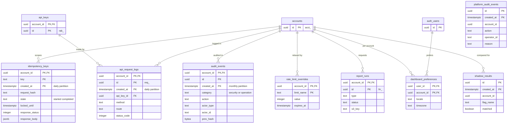

# Data model: 公開 API・監査・運用

公開 API の冪等キー、監査（加盟店・プラットフォーム）、要求のログ、レート制限の上書き、影の実行の比較、レポートの実行、ダッシュボードの設定。振る舞いは [api.md](../api.md)（冪等）、[ADR-0023](../../decisions/0023-audit-log.md)・[security.md](../security.md) の 6 節（監査）、[auth-and-keys.md](../auth-and-keys.md) の 9 節（セキュリティの履歴と要求のログ）、[rate-limiting.md](../rate-limiting.md) の 6 節、[delivery.md](../delivery.md) の 5.2 節、[dashboard.md](../dashboard.md) の 13 節にある。規約は [data-model.md](../data-model.md) の 3 節。

## 1. ER 図

## 2. テーブル

### 2.1 `idempotency_keys`

公開 API の冪等（[ADR-0004](../../decisions/0004-idempotency.md) の API の層）。定義元：[api.md](../api.md) の 7.2・7.3 節。

| 列 | 型 | NULL | 既定 | 説明 |
| --- | --- | --- | --- | --- |
| `account_id` | `uuid` | NOT NULL | — | |
| `key` | `text` | NOT NULL | — | `Idempotency-Key`（255 文字まで） |
| `created_at` | `timestamptz` | NOT NULL | `now()` | パーティションの鍵 |
| `request_method`・`request_path` | `text` | NOT NULL | — | |
| `request_hash` | `bytea` | NOT NULL | — | メソッド・パス・正規化した本文の SHA-256（版を含めない） |
| `api_version` | `text` | NOT NULL | — | 最初の要求の版 |
| `state` | `text` | NOT NULL | `'started'` | `started`・`completed` |
| `locked_until` | `timestamptz` | NOT NULL | — | 今 ＋ 60 秒 |
| `response_status` | `integer` | NULL | — | |
| `response_body` | `jsonb` | NULL | — | 500 も保存する |
| `resource_id` | `uuid` | NULL | — | 作ったオブジェクト |

- キー：PK `(account_id, key, created_at)`。**パーティションをまたぐ一意**：挿入の前に `pg_advisory_xact_lock(hashtextextended(account_id::text || key, 0))` を取り、直近 48 時間のパーティションに同じ `(account_id, key)` がないことを確かめてから `INSERT` する。行があれば [api.md](../api.md) の 7.3 節の決定表に従う。
- 索引：PK が `(account_id, key)` の検索を兼ねる。
- CHECK：`length(key) <= 255`、`state IN (...)`、`state <> 'completed' OR response_status IS NOT NULL`。
- パーティション：`created_at` の日。48 時間より古いものを `DROP`。
- S1 の量：1 日 約 2,500 万行（書き込みの要求）。

### 2.2 `audit_events`

加盟店の監査（追記のみ）。**セキュリティの履歴（`security_events`）はこの表の `category = 'security'` の行** で、ダッシュボードとの API はビュー `security_events` を読む（2026-09-28 に決定）。定義元：[ADR-0023](../../decisions/0023-audit-log.md)、[security.md](../security.md) の 6 節、[auth-and-keys.md](../auth-and-keys.md) の 9.1 節。

| 列 | 型 | NULL | 既定 | 説明 |
| --- | --- | --- | --- | --- |
| `account_id` | `uuid` | NOT NULL | — | |
| `id` | `uuid` | NOT NULL | `uuidv7()` | |
| `created_at` | `timestamptz` | NOT NULL | — | パーティションの鍵 |
| `category` | `text` | NOT NULL | — | `security`（ログイン、MFA、メンバー、API キー、アクセスポリシー、入金先の口座、既定の版）・`operation`（返金、Dispute の提出、不正のルール、Webhook の送信先、エクスポート、運用者の閲覧） |
| `action` | `text` | NOT NULL | — | `api_key.created`・`login.succeeded` など |
| `actor_type` | `text` | NOT NULL | — | `user`・`api_key`・`operator`・`system` |
| `actor_id` | `text` | NULL | — | `user_id`・`rak_`・社内の担当者 |
| `ip_address` | `inet` | NULL | — | PII |
| `user_agent` | `text` | NULL | — | |
| `target_type`・`target_id` | `text` | NULL | — | |
| `changes` | `jsonb` | NULL | — | 変更の前後（秘密の値・カード番号・書類の中身を含めない） |
| `request_id` | `uuid` | NULL | — | |
| `prev_hash` | `bytea` | NULL | — | エクスポーターが付ける加盟店ごとのハッシュの連鎖（アーカイブ側で検証） |

- キー：PK `(account_id, id, created_at)`。
- 索引：`(account_id, created_at DESC)`、`(account_id, category, created_at DESC)` — セキュリティの履歴。
- 更新：`app` は `INSERT`・`SELECT` だけ。拒否のトリガー。
- 利用者のログイン（テナントの外の操作）は、その利用者が有効なメンバーであるすべてのアカウントに 1 行ずつ書く。
- パーティション：`created_at` の月。DB に 1 年、アーカイブ（log-archive、Object Lock）に 7 年。
- S1 の量：1 日 約 50 万行（返金を含む）。

### 2.3 `platform_audit_events`

プラットフォームの監査（RLS の例外、追記のみ）。審査の判断、リザーブ、拒否・終了、プラットフォームのルール、break-glass、書類の閲覧、消去のジョブの件数、`recon` の操作。

| 列 | 型 | NULL | 既定 | 説明 |
| --- | --- | --- | --- | --- |
| `id` | `uuid` | NOT NULL | `uuidv7()` | |
| `created_at` | `timestamptz` | NOT NULL | — | |
| `account_id` | `uuid` | NULL | — | 対象の加盟店（全体の操作は NULL） |
| `action` | `text` | NOT NULL | — | |
| `operator_id` | `text` | NULL | — | 社内の担当者（SSO の主体）。ジョブは NULL |
| `approver_id` | `text` | NULL | — | 2 人の承認 |
| `reason` | `text` | NULL | — | 判断・閲覧の理由 |
| `target_type`・`target_id` | `text` | NULL | — | |
| `details` | `jsonb` | NOT NULL | `'{}'` | |

- キー：PK `(id, created_at)`。索引：`(account_id, created_at DESC)`、`(action, created_at DESC)`。
- パーティション：`created_at` の月。DB に 1 年、アーカイブに 7 年。S1 の量：1 日 数万行。

### 2.4 `api_request_logs`

要求のログ（メタデータだけ。本文を持たない）。定義元：[auth-and-keys.md](../auth-and-keys.md) の 9.2 節、[api.md](../api.md) の 12 節。api のタスクから SQS にまとめて送り、Worker が一括で書く。

| 列 | 型 | NULL | 既定 | 説明 |
| --- | --- | --- | --- | --- |
| `account_id` | `uuid` | NOT NULL | — | |
| `id` | `uuid` | NOT NULL | — | `req_`（`Request-Id`） |
| `created_at` | `timestamptz` | NOT NULL | — | |
| `api_key_id` | `uuid` | NULL | — | ダッシュボードの要求は NULL |
| `user_id` | `uuid` | NULL | — | ダッシュボードの要求 |
| `method` | `text` | NOT NULL | — | |
| `route` | `text` | NOT NULL | — | ルートの型（`/v1/payment_intents/{id}`） |
| `object_id` | `uuid` | NULL | — | パスのオブジェクト |
| `status_code` | `integer` | NOT NULL | — | |
| `error_code` | `text` | NULL | — | |
| `api_version` | `text` | NOT NULL | — | |
| `idempotency_key_present`・`idempotent_replayed` | `boolean` | NOT NULL | — | |
| `duration_ms` | `integer` | NOT NULL | — | |
| `source_ip` | `inet` | NULL | — | PII |
| `origin` | `text` | NULL | — | 公開可能キーの要求のオリジン |

- キー：PK `(account_id, id, created_at)`。索引：`(account_id, created_at DESC)`、`(account_id, api_key_id, created_at DESC)`。
- パーティション：`created_at` の日。30 日で `DROP`。
- S1 の量：1 日 約 4,000 万行。

### 2.5 `rate_limit_overrides`

アカウント × 環境のレート制限の上書き（環境はクラスタで分かれる）。定義元：[rate-limiting.md](../rate-limiting.md) の 6 節。

| 列 | 型 | NULL | 既定 | 説明 |
| --- | --- | --- | --- | --- |
| `account_id` | `uuid` | NOT NULL | — | |
| `limit_name` | `text` | NOT NULL | — | `global-rate`・`endpoint-rate:<操作>`・`global-concurrency` など |
| `value` | `integer` | NOT NULL | — | |
| `reason` | `text` | NOT NULL | — | |
| `approved_by` | `text` | NOT NULL | — | Ops |
| `expires_at` | `timestamptz` | NULL | — | |
| `created_at` | `timestamptz` | NOT NULL | — | |

- キー：PK `(account_id, limit_name)`。変更は `platform_audit_events` に残す。S1 の量：数百行。

### 2.6 `shadow_results`

影の実行の比較（RLS の例外）。定義元：[delivery.md](../delivery.md) の 5.2 節。

| 列 | 型 | NULL | 既定 | 説明 |
| --- | --- | --- | --- | --- |
| `id` | `uuid` | NOT NULL | `uuidv7()` | |
| `created_at` | `timestamptz` | NOT NULL | — | |
| `account_id` | `uuid` | NOT NULL | — | |
| `flag_name` | `text` | NOT NULL | — | |
| `subject_type`・`subject_id` | `text`・`uuid` | NOT NULL | — | 比べた操作の対象 |
| `old_result`・`new_result` | `jsonb` | NOT NULL | — | 仕訳の明細、手数料、Payout の額、遷移 |
| `matched` | `boolean` | NOT NULL | — | |
| `explanation` | `text` | NULL | — | 差の理由（1 件ずつ付ける） |

- キー：PK `(id, created_at)`。索引：`(flag_name, matched, created_at)`。
- パーティション：`created_at` の日。90 日で `DROP`。

### 2.7 `report_runs`

レポートの実行。定義元：[dashboard.md](../dashboard.md) の 13 節、[payouts-and-reconciliation.md](../payouts-and-reconciliation.md) の 6 節。

| 列 | 型 | NULL | 既定 | 説明 |
| --- | --- | --- | --- | --- |
| `account_id` | `uuid` | NOT NULL | — | |
| `id` | `uuid` | NOT NULL | `uuidv7()` | `frr_` |
| `type` | `text` | NOT NULL | — | `balance.summary.2`・`payout_reconciliation.itemized.*` など |
| `parameters` | `jsonb` | NOT NULL | — | 期間、タイムゾーン、列 |
| `status` | `text` | NOT NULL | `'pending'` | `pending`・`succeeded`・`failed` |
| `row_count` | `bigint` | NULL | — | |
| `s3_key` | `text` | NULL | — | |
| `expires_at` | `timestamptz` | NULL | — | ダウンロードの期限 |
| `requested_by` | `text` | NOT NULL | — | 利用者か `rak_` |
| `created_at`・`completed_at` | `timestamptz` | — | — | |

- キー：PK `(account_id, id)`。索引：`(account_id, id DESC)`。
- 保持：90 日（ファイルは `expires_at` で消す）。S1 の量：1 日 数千行。

### 2.8 `dashboard_preferences`

ダッシュボードの利用者 × アカウントの設定（live のクラスタ）。

| 列 | 型 | NULL | 既定 | 説明 |
| --- | --- | --- | --- | --- |
| `user_id` | `uuid` | NOT NULL | — | |
| `account_id` | `uuid` | NOT NULL | — | |
| `locale` | `text` | NOT NULL | `'ja'` | |
| `timezone` | `text` | NOT NULL | `'Asia/Tokyo'` | |
| `saved_filters` | `jsonb` | NOT NULL | `'{}'` | |
| `updated_at` | `timestamptz` | NOT NULL | — | |

- キー：PK `(account_id, user_id)`。FK `(account_id, user_id)` → `account_members`。S1 の量：約 3 万行。
