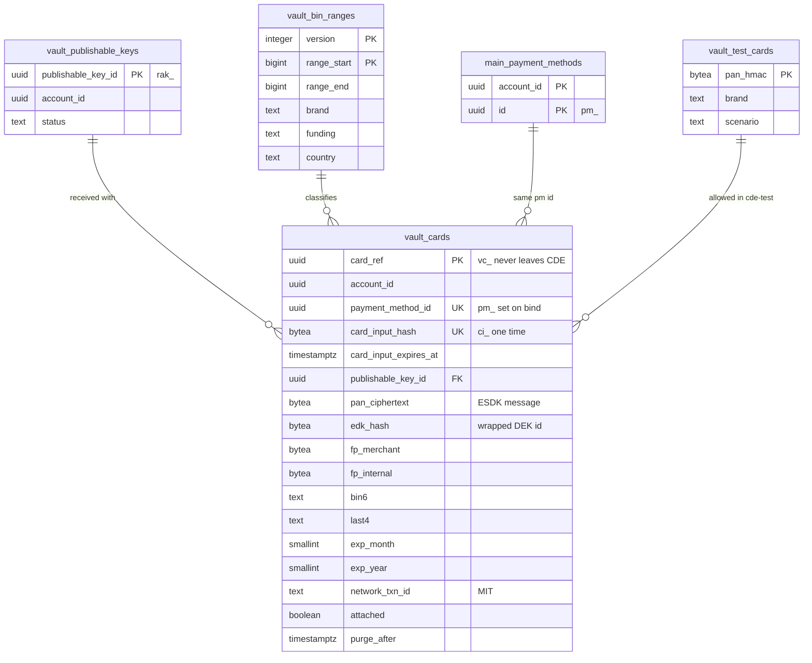

# Data model: Vault（CDE）

CDE（cde-live・cde-test のアカウント）の Vault DB。暗号化した PAN、表示用の情報、指紋、`pm_` との対応、公開可能キーの写し、BIN の表、テスト用のカード番号の表。振る舞いは [card-vault.md](../card-vault.md)、方針は [ADR-0005](../../decisions/0005-pci-scope-segmentation.md)（CDE）、[ADR-0019](../../decisions/0019-vault-encryption-and-key-hierarchy.md)（暗号化と鍵）、[ADR-0024](../../decisions/0024-data-retention-and-deletion.md)（保持）、[ADR-0029](../../decisions/0029-multi-account-and-cde-layout.md)（アカウントと境界）にある。規約は [data-model.md](../data-model.md) の 3 節。

## 1. 前提

- Vault DB は本体の DB と **別のクラスタ**（CDE のアカウントの Aurora PostgreSQL）。本体のロールは接続できない。本体の表への外部キーはない。
- cde-live と cde-test は別のクラスタなので、`livemode` の列を持たない（[data-model.md](../data-model.md) の 3.4 節）。
- RLS は使わない。`account_id` と `payment_method_id` の組の一致を、vault-core と connector-gateway が要求ごとに確かめる（[card-vault.md](../card-vault.md) の 3.2 節）。
- DB ロールはサービスごとに分ける。

| ロール | 権限 |
| --- | --- |
| `vault_ingest` | `vault_cards` の `INSERT`（`payment_method_id` なし）、`vault_publishable_keys`・`vault_bin_ranges`・`vault_test_cards` の `SELECT` |
| `vault_core` | `vault_cards` の表示用の列の `SELECT` と、`payment_method_id`・`bound_at`・`card_input_used_at`・`attached`・`purge_after` の `UPDATE`。`vault_publishable_keys` の読み書き。**`pan_ciphertext` の列を読めない**（列の権限） |
| `connector_gateway` | `vault_cards` の `SELECT`（`pan_ciphertext` を含む）と、`last_used_at`・`network_txn_id` の `UPDATE` |
| `vault_purger` | `vault_cards` の `DELETE` と、期限の列の `SELECT` だけ。鍵を使えない |
| `vault_loader` | `vault_bin_ranges`・`vault_test_cards` の読み書き（取り込みのジョブ） |

- CVC は DB に置かない。CDE の ElastiCache に TTL 30 分で置く（[stores.md](stores.md) の 1.2 節）。
- CDE の監査（復号、消去、JIT）は DB に置かず、Firehose で log-archive へ送る（[ADR-0023](../../decisions/0023-audit-log.md)）。

## 2. ER 図

`main_payment_methods` は本体の `payment_methods`（別のクラスタ）で、値の対応だけを示す。

## 3. テーブル

### 3.1 `vault_cards`

暗号化した PAN と、`pm_` との対応。定義元：[card-vault.md](../card-vault.md) の 3・4・6 節。

| 列 | 型 | NULL | 既定 | 説明 |
| --- | --- | --- | --- | --- |
| `card_ref` | `uuid` | NOT NULL | `gen_random_uuid()` | `vc_`。PAN から導かないランダムな値（UUIDv4）。CDE の外に出さない |
| `account_id` | `uuid` | NOT NULL | — | 受け取りのときに公開可能キーから決めた加盟店（`vault_publishable_keys`） |
| `payment_method_id` | `uuid` | NULL | — | 本体の `pm_`。紐づけ（`bind_card_input`）で設定 |
| `card_input_hash` | `bytea` | NOT NULL | — | `card_input`（`ci_` ＋ 128 bit）の SHA-256 |
| `card_input_expires_at` | `timestamptz` | NOT NULL | — | 作成から 30 分 |
| `card_input_used_at` | `timestamptz` | NULL | — | 紐づけで設定。以後は無効 |
| `publishable_key_id` | `uuid` | NOT NULL | — | 受け取ったときの公開可能キー |
| `pan_ciphertext` | `bytea` | NOT NULL | — | AWS Encryption SDK のメッセージ（AES-256-GCM。`cde-pan` で包んだ DEK を含む） |
| `edk_hash` | `bytea` | NOT NULL | — | メッセージの包んだ DEK の SHA-256。DEK の漏洩の疑いで、その DEK の行を探す |
| `cmk_key_id` | `text` | NOT NULL | — | 包んだ CMK の ID（`ReEncrypt` の対象の特定） |
| `fp_merchant` | `bytea` | NOT NULL | — | 加盟店向けの指紋 `HMAC(cde-fp, account_id ‖ PAN)` |
| `fp_internal` | `bytea` | NOT NULL | — | 内部向けの指紋 `HMAC(cde-fp, PAN)` |
| `fp_key_version` | `smallint` | NOT NULL | — | `cde-fp` の鍵の世代（2 年ごとの入れ替え） |
| `brand` | `text` | NOT NULL | — | |
| `bin6` | `text` | NOT NULL | — | 先頭 6 桁 |
| `last4` | `text` | NOT NULL | — | |
| `exp_month`・`exp_year` | `smallint` | NOT NULL | — | |
| `funding`・`country` | `text` | NOT NULL | — | BIN の表から |
| `network_txn_id` | `text` | NULL | — | MIT に使うネットワークの取引 ID（SetupIntent・`setup_future_usage` の成功で保存） |
| `attached` | `boolean` | NOT NULL | `false` | Customer に保存済み（本体の attach・detach を vault-core が受ける） |
| `created_at` | `timestamptz` | NOT NULL | `now()` | |
| `bound_at` | `timestamptz` | NULL | — | |
| `last_used_at` | `timestamptz` | NULL | — | 最後のオーソリ |
| `purge_after` | `timestamptz` | NOT NULL | — | 消去の予定（下の表で計算し、状態が変わるたびに更新） |

- キー：PK `(card_ref)`。UK `(card_input_hash)`、`(payment_method_id)`（NULL を除く）。
- 索引：`(purge_after)` — 消去のジョブ。`(edk_hash)` — DEK の再暗号化。`(fp_key_version)` — 指紋の計算し直し。
- CHECK：`bin6 ~ '^[0-9]{6}$'`、`last4 ~ '^[0-9]{4}$'`、`exp_month BETWEEN 1 AND 12`、`payment_method_id IS NULL OR bound_at IS NOT NULL`。
- **PAN・CVC を平文で持つ列はない。** PAN の平文は connector-gateway のプロセスのメモリの中だけに現れる。
- 保持（`purge_after` の計算。[card-vault.md](../card-vault.md) の 6 節）：

  | 状態 | `purge_after` |
  | --- | --- |
  | 紐づけが済んでいない | `created_at` ＋ 1 時間 |
  | 紐づけ済み、Customer に保存していない | `last_used_at`（なければ `bound_at`）＋ 30 日 |
  | Customer に保存した | 無期限（外す・Customer の削除で `now()` ＋ 24 時間） |
  | 有効期限を過ぎ、13 か月使われていない | 月次のジョブが `now()` にする |
  | 加盟店のアカウントの終了 | 終了の手続きの完了 ＋ 30 日 |

- 消去は物理削除。バックアップは 35 日の PITR だけ（長期のスナップショットを取らない）。
- S1 の量：1 日 約 950 万行の追加。保存しないカードは 30 日で消えるので、常時 約 3 億行 ＋ 保存したカード。

### 3.2 `vault_publishable_keys`

公開可能キーと加盟店の対応の写し（2026-09-28 に定義）。本体が公開可能キーの作成・ローテーション・期限切れのたびに、PrivateLink で vault-core の `sync_publishable_key` を呼んで書く（本体 → CDE の向き。[ADR-0029](../../decisions/0029-multi-account-and-cde-layout.md)）。

| 列 | 型 | NULL | 既定 | 説明 |
| --- | --- | --- | --- | --- |
| `publishable_key_id` | `uuid` | NOT NULL | — | 本体の `api_keys.id`（`rak_`） |
| `account_id` | `uuid` | NOT NULL | — | |
| `status` | `text` | NOT NULL | — | `active`・`expired` |
| `expires_at` | `timestamptz` | NULL | — | ローテーションの猶予の終わり |
| `synced_at` | `timestamptz` | NOT NULL | — | |

- キー：PK `(publishable_key_id)`。
- 使い道：vault-ingest が受け取りのときに加盟店を決め、加盟店向けの指紋を計算する。知らない・期限切れのキーの要求は、暗号化の前に拒否する（カードテスティングの入口を狭める）。
- 公開可能キーは公開してよい値で、秘密の部分は同期しない（ID と加盟店だけ）。
- S1 の量：約 3 万行。

### 3.3 `vault_bin_ranges`

BIN の表（ブランド・funding・発行国）。コネクタかカードブランドの提供する表を、CDE の中で定期的に取り込む。定義元：[payment-methods.md](../payment-methods.md) の 2.2 節。

| 列 | 型 | NULL | 既定 | 説明 |
| --- | --- | --- | --- | --- |
| `version` | `integer` | NOT NULL | — | 取り込みのバージョン。切り替えはバージョンの単位で行う |
| `range_start`・`range_end` | `bigint` | NOT NULL | — | BIN の範囲（桁を揃えた数値） |
| `pan_length` | `smallint` | NULL | — | |
| `brand` | `text` | NOT NULL | — | |
| `funding` | `text` | NOT NULL | — | `credit`・`debit`・`prepaid`・`unknown` |
| `country` | `text` | NULL | — | |
| `three_ds_supported` | `boolean` | NULL | — | |
| `source` | `text` | NOT NULL | — | 取得元 |
| `loaded_at` | `timestamptz` | NOT NULL | — | |

- キー：PK `(version, range_start)`。索引：`(version, range_start, range_end)` の GiST（範囲の検索）。
- 保持：直近 3 バージョン。S1 の量：数十万行。

### 3.4 `vault_test_cards`

テスト用のカード番号の表（cde-live・cde-test の両方）。cde-test はこの表にない番号を保存もログもせずに拒否し、cde-live はこの表にある番号を `testmode_decline` にする（[card-vault.md](../card-vault.md) の 3.1 節、[api.md](../api.md) の 11.2 節）。

| 列 | 型 | NULL | 既定 | 説明 |
| --- | --- | --- | --- | --- |
| `pan_hmac` | `bytea` | NOT NULL | — | `HMAC(cde-fp, PAN)`。平文の番号は持たない |
| `brand` | `text` | NOT NULL | — | |
| `last4` | `text` | NOT NULL | — | |
| `scenario` | `text` | NOT NULL | — | `approve`・`decline_generic`・`insufficient_funds`・`three_ds_required`・`unknown_outcome_found` など（[payment-methods.md](../payment-methods.md) の 4.1 節） |
| `origin` | `text` | NOT NULL | — | `brand_test`（本家の表と同じ番号）・`system`（本システムに固有の番号） |
| `loaded_at` | `timestamptz` | NOT NULL | — | |

- キー：PK `(pan_hmac)`。
- `cde-fp` の入れ替えのときは、リポジトリの番号の一覧から計算し直す。S1 の量：数百行。
