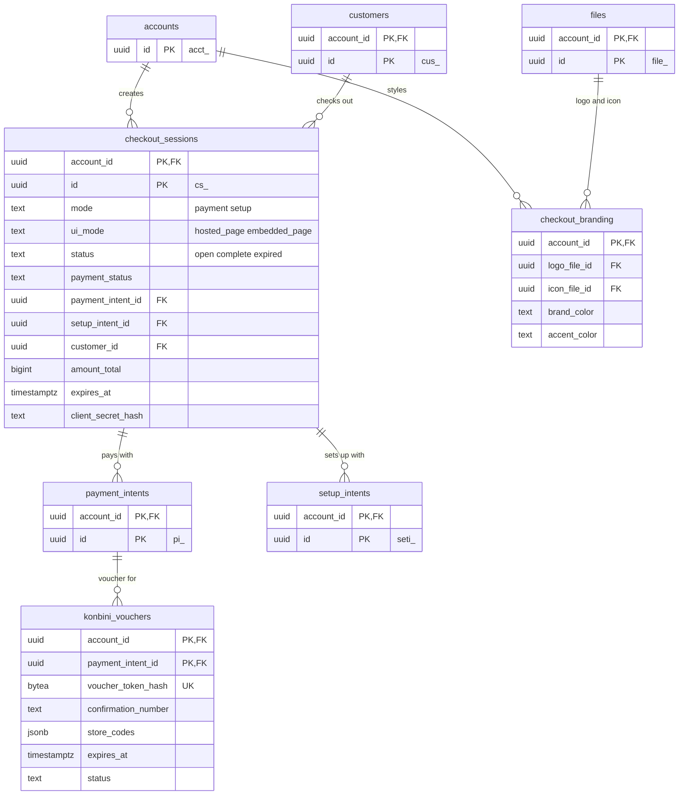

# Data model: Checkout

ホスト型・埋め込み型の決済ページの Session、決済ページの見た目の設定、コンビニ払いの払込票。振る舞いは [checkout.md](../checkout.md)、分離の方針は [ADR-0027](../../decisions/0027-checkout-and-elements-isolation.md) にある。カード番号は Checkout のテーブルに入らない（カード欄は CDE の iframe。[card-vault.md](../card-vault.md)）。規約は [data-model.md](../data-model.md) の 3 節。

## 1. ER 図

## 2. テーブル

### 2.1 `checkout_sessions`

Checkout Session。定義元：[checkout.md](../checkout.md) の 3.1・15 節。

| 列 | 型 | NULL | 既定 | 説明 |
| --- | --- | --- | --- | --- |
| `account_id` | `uuid` | NOT NULL | — | |
| `id` | `uuid` | NOT NULL | `uuidv7()` | `cs_` |
| `mode` | `text` | NOT NULL | — | `payment`・`setup` |
| `ui_mode` | `text` | NOT NULL | `'hosted_page'` | `hosted_page`・`embedded_page` |
| `status` | `text` | NOT NULL | `'open'` | `open`・`complete`・`expired` |
| `payment_status` | `text` | NOT NULL | `'unpaid'` | `paid`・`unpaid`・`no_payment_required` |
| `payment_intent_id` | `uuid` | NULL | — | `mode = payment` のとき、Session の作成で作る |
| `setup_intent_id` | `uuid` | NULL | — | `mode = setup` のとき |
| `customer_id` | `uuid` | NULL | — | 銀行振込には必須 |
| `customer_email` | `text` | NULL | — | PII |
| `line_items` | `jsonb` | NOT NULL | `'[]'` | 表示用の品目（名前、数量、単価） |
| `amount_total` | `bigint` | NULL | — | `mode = payment` のとき |
| `currency` | `text` | NULL | — | |
| `payment_method_types` | `text[]` | NOT NULL | — | ダッシュボードで有効にしたものから絞った結果 |
| `locale` | `text` | NOT NULL | `'auto'` | `ja`・`en`・`auto` |
| `success_url`・`cancel_url` | `text` | NULL | — | `hosted_page` |
| `return_url` | `text` | NULL | — | `embedded_page`。オリジンを埋め込みの許可に使う |
| `client_secret_hash` | `bytea` | NOT NULL | — | |
| `url_token_hash` | `bytea` | NULL | — | ホスト型の URL の秘密の断片のハッシュ（Session の表示用の情報の認可） |
| `expires_at` | `timestamptz` | NOT NULL | — | 作成から 30 分〜24 時間（既定 24 時間） |
| `completed_at` | `timestamptz` | NULL | — | |
| `metadata` | `jsonb` | NOT NULL | `'{}'` | |
| `created_at`・`updated_at` | `timestamptz` | NOT NULL | — | |
| `redacted_at` | `timestamptz` | NULL | — | |

- キー：PK `(account_id, id)`。FK `(account_id, payment_intent_id)` → `payment_intents`、`(account_id, setup_intent_id)` → `setup_intents`、`(account_id, customer_id)` → `customers`。UK `(account_id, payment_intent_id)`（1 つの PaymentIntent は 1 つの Session だけ）。
- 索引：`(account_id, id DESC)` — 一覧。`(expires_at) WHERE status = 'open'` — 期限切れのジョブ（`sweeper`。`checkout.session.expired` を出す）。
- CHECK：`(mode = 'payment') = (payment_intent_id IS NOT NULL)`、`(mode = 'setup') = (setup_intent_id IS NOT NULL)`、`expires_at BETWEEN created_at + interval '30 minutes' AND created_at + interval '24 hours'`。
- 公開可能キーでの読み取り（決済ページ）は、`client_secret` か URL の秘密の断片のハッシュが一致したときだけ許す。
- 保持：7 年。S1 の量：1 日 約 500 万行（決済ページの表示は確定の 1.5 倍程度で、その一部が Session を作る）。

### 2.2 `checkout_branding`

決済ページの見た目（環境ごと）。定義元：[checkout.md](../checkout.md) の 10・15 節。

| 列 | 型 | NULL | 既定 | 説明 |
| --- | --- | --- | --- | --- |
| `account_id` | `uuid` | NOT NULL | — | |
| `logo_file_id`・`icon_file_id` | `uuid` | NULL | — | → `files`（`purpose = business_logo`・`business_icon`） |
| `brand_color`・`accent_color` | `text` | NULL | — | `#RRGGBB` |
| `font` | `text` | NULL | — | 決めた一覧の中から |
| `shape` | `text` | NULL | — | `rounded`・`sharp`・`pill` |
| `updated_at` | `timestamptz` | NOT NULL | — | |

- キー：PK `(account_id)`。FK `(account_id, logo_file_id)`・`(account_id, icon_file_id)` → `files`。
- CHECK：`brand_color ~ '^#[0-9a-fA-F]{6}$'`。S1 の量：約 2 万行。

### 2.3 `konbini_vouchers`

コンビニ払いの払込票（支払い番号）。払込票のページ（`payments.<domain>`）の ID と、店舗ごとの番号を持つ。定義元：[payment-methods.md](../payment-methods.md) の 5.2 節、[checkout.md](../checkout.md) の 7.1・15 節。

| 列 | 型 | NULL | 既定 | 説明 |
| --- | --- | --- | --- | --- |
| `account_id` | `uuid` | NOT NULL | — | |
| `payment_intent_id` | `uuid` | NOT NULL | — | |
| `charge_id` | `uuid` | NOT NULL | — | 発行の試行 |
| `voucher_token_hash` | `bytea` | NOT NULL | — | `hosted_voucher_url` のトークンのハッシュ |
| `connector` | `text` | NOT NULL | — | 収納代行 |
| `connector_voucher_ref` | `text` | NOT NULL | — | 収納代行の側の番号 |
| `confirmation_number` | `text` | NOT NULL | — | 10〜11 桁 |
| `store_codes` | `jsonb` | NOT NULL | — | 店舗のチェーンごとの `payment_code`（`{"familymart": {"payment_code": "..."}, ...}`） |
| `expires_at` | `timestamptz` | NOT NULL | — | 支払い期限 |
| `status` | `text` | NOT NULL | `'issued'` | `issued`・`paid`・`expired`・`canceled` |
| `created_at`・`updated_at` | `timestamptz` | NOT NULL | — | |

- キー：PK `(account_id, payment_intent_id)`（有効な払込票は PaymentIntent に 1 つ。更新で取り消したら行を置き換える）。UK `(voucher_token_hash)` — 払込票のページの表示（RLS の前に要るので `SECURITY DEFINER` の `resolve_konbini_voucher(token_hash)`）。UK `(connector, connector_voucher_ref)`。
- 索引：`(expires_at) WHERE status = 'issued'` — 期限＋猶予の後の失効（`sweeper`）。
- 保持：7 年。S1 の量：1 日 数万行。
