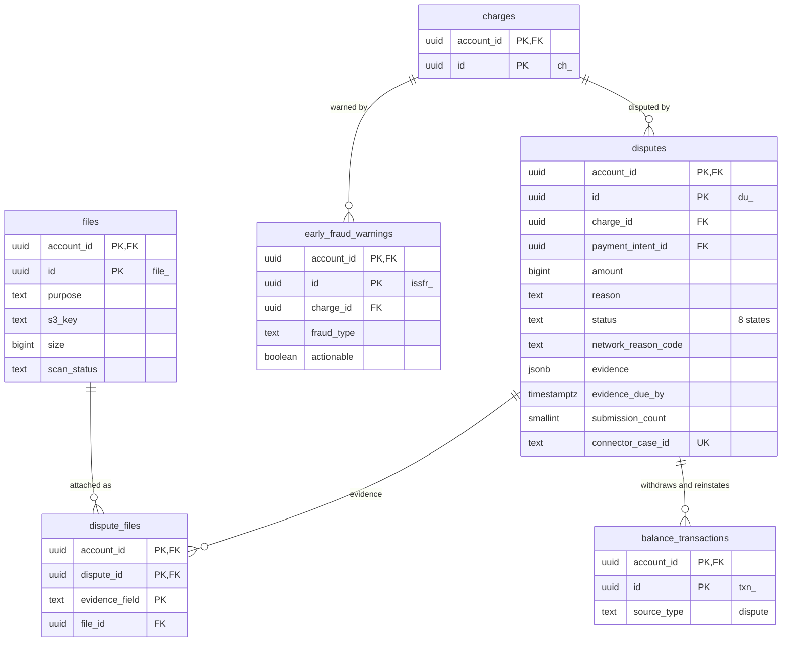

# Data model: Dispute

チャージバックと照会（Dispute）、証拠の添付、早期の不正警告（EFW）、ファイル。振る舞いは [disputes.md](../disputes.md)、通知の取り込みは [ADR-0014](../../decisions/0014-connector-inbox.md) にある。規約は [data-model.md](../data-model.md) の 3 節。

## 1. ER 図

## 2. テーブル

### 2.1 `disputes`

1 件の照会またはチャージバック。定義元：[disputes.md](../disputes.md) の 2・3・6 節。

| 列 | 型 | NULL | 既定 | 説明 |
| --- | --- | --- | --- | --- |
| `account_id` | `uuid` | NOT NULL | — | |
| `id` | `uuid` | NOT NULL | `uuidv7()` | `du_` |
| `charge_id` | `uuid` | NOT NULL | — | |
| `payment_intent_id` | `uuid` | NOT NULL | — | |
| `amount` | `bigint` | NOT NULL | — | 通知の額（元の支払いと違うことがある） |
| `currency` | `text` | NOT NULL | — | |
| `reason` | `text` | NOT NULL | — | `fraudulent`・`duplicate`・`product_not_received`・`product_unacceptable`・`subscription_canceled`・`credit_not_processed`・`unrecognized`・`general` など |
| `network_reason_code` | `text` | NULL | — | ブランドの理由コード（例：Visa 10.4） |
| `status` | `text` | NOT NULL | — | `warning_needs_response`・`warning_under_review`・`warning_closed`・`needs_response`・`under_review`・`won`・`lost`・`prevented` |
| `evidence` | `jsonb` | NOT NULL | `'{}'` | 本家の `evidence` の文字列の項目（ファイルの項目は `dispute_files`）。PII を含みうる |
| `evidence_due_by` | `timestamptz` | NULL | — | 加盟店への期限（アクワイアラの期限 − `dispute.submission_buffer`） |
| `evidence_past_due` | `boolean` | NOT NULL | `false` | |
| `submission_count` | `smallint` | NOT NULL | `0` | 提出は 1 回だけ |
| `submitted_at` | `timestamptz` | NULL | — | |
| `submission_reference` | `text` | NULL | — | 提出の送信の参照番号（再送で同じ値。[ADR-0004](../../decisions/0004-idempotency.md)） |
| `submission_package_file_id` | `uuid` | NULL | — | 送った形（PDF にまとめたもの）の File |
| `is_charge_refundable` | `boolean` | NOT NULL | — | 進行中のチャージバックでは `false` |
| `connector` | `text` | NOT NULL | — | |
| `connector_case_id` | `text` | NOT NULL | — | アクワイアラのケースの番号 |
| `withdrawal_entry_id`・`reinstatement_entry_id` | `uuid` | NULL | — | 引き落とし・戻しの仕訳 |
| `closed_at` | `timestamptz` | NULL | — | |
| `metadata` | `jsonb` | NOT NULL | `'{}'` | |
| `created_at`・`updated_at` | `timestamptz` | NOT NULL | — | |
| `redacted_at` | `timestamptz` | NULL | — | |

- キー：PK `(account_id, id)`。UK `(connector, connector_case_id)` — 通知の特定と重複の防止。FK `(account_id, charge_id)` → `charges`、`(account_id, payment_intent_id)` → `payment_intents`、`(account_id, submission_package_file_id)` → `files`。
- 索引：`(account_id, id DESC)` — 一覧。`(account_id, charge_id)` — 支払いの Dispute（返金の可否の判定）。`(evidence_due_by) WHERE status IN ('needs_response','warning_needs_response')` — 期限の通知と期限切れ（`sweeper`）。
- CHECK：`amount > 0`、`status IN (...)`、`submission_count <= 1`、`status NOT IN ('won','lost','warning_closed','prevented') OR closed_at IS NOT NULL`。
- お金：引き落としは `needs_response` の作成と同じトランザクションで、Dispute の額と手数料の仕訳（`dispute_withdrawal`）と BT（`adjustment`、`reporting_category = dispute`）を書く。戻しは `won` で書く（[stores.md](stores.md) の 5 節）。
- 保持：7 年。S1 の量：1 日 数千行（決済の 0.05% 程度）。

### 2.2 `dispute_files`

証拠のファイルの項目（`receipt`、`shipping_documentation`、`customer_communication`、`uncategorized_file` など）と File の対応。

| 列 | 型 | NULL | 既定 | 説明 |
| --- | --- | --- | --- | --- |
| `account_id` | `uuid` | NOT NULL | — | |
| `dispute_id` | `uuid` | NOT NULL | — | |
| `evidence_field` | `text` | NOT NULL | — | 本家の `evidence` のファイルの項目の名前 |
| `file_id` | `uuid` | NOT NULL | — | |
| `created_at` | `timestamptz` | NOT NULL | — | |

- キー：PK `(account_id, dispute_id, evidence_field)`（1 種類の証拠に 1 ファイル）。FK `(account_id, dispute_id)` → `disputes`、`(account_id, file_id)` → `files`。
- 提出の後（`submission_count = 1`）の変更はトリガーで拒否する。
- 合計 4.5 MB・Mastercard は 19 ページの上限は、提出の検証で確かめる（DB では守らない）。S1 の量：1 日 数千行。

### 2.3 `files`

加盟店が上げたファイル（Dispute の証拠、ロゴ・アイコン）。本体は S3 に置く。定義元：[disputes.md](../disputes.md) の 6.2 節、[checkout.md](../checkout.md) の 15 節。

| 列 | 型 | NULL | 既定 | 説明 |
| --- | --- | --- | --- | --- |
| `account_id` | `uuid` | NOT NULL | — | |
| `id` | `uuid` | NOT NULL | `uuidv7()` | `file_` |
| `purpose` | `text` | NOT NULL | — | `dispute_evidence`・`business_logo`・`business_icon`・`dispute_submission_package` |
| `filename` | `text` | NULL | — | |
| `content_type` | `text` | NOT NULL | — | `application/pdf`・`image/jpeg`・`image/png` |
| `size` | `bigint` | NOT NULL | — | バイト |
| `s3_key` | `text` | NOT NULL | — | [stores.md](stores.md) の 2 節の配置 |
| `sha256` | `bytea` | NOT NULL | — | |
| `scan_status` | `text` | NOT NULL | `'pending'` | `pending`・`clean`・`infected`（GuardDuty Malware Protection for S3） |
| `expires_at` | `timestamptz` | NULL | — | |
| `created_at` | `timestamptz` | NOT NULL | — | |

- キー：PK `(account_id, id)`。UK `(s3_key)`。
- 索引：`(account_id, purpose, id DESC)` — 一覧。
- CHECK：`purpose IN (...)`、`size > 0`、`content_type IN (...)`。`scan_status <> 'clean'` のファイルは証拠に使えない（提出の検証）。
- 保持：Dispute の証拠は Dispute と同じ 7 年。ロゴはブランディングを外してから 30 日。S1 の量：1 日 1 万行程度。

### 2.4 `early_fraud_warnings`

カード発行会社の不正の疑いの報告（TC40・SAFE 相当）。お金は動かさない。定義元：[disputes.md](../disputes.md) の 7 節。

| 列 | 型 | NULL | 既定 | 説明 |
| --- | --- | --- | --- | --- |
| `account_id` | `uuid` | NOT NULL | — | |
| `id` | `uuid` | NOT NULL | `uuidv7()` | `issfr_` |
| `charge_id` | `uuid` | NOT NULL | — | |
| `payment_intent_id` | `uuid` | NOT NULL | — | |
| `fraud_type` | `text` | NOT NULL | — | `made_with_stolen_card`・`unauthorized_use_of_card`・`misc` など本家の値 |
| `actionable` | `boolean` | NOT NULL | — | まだ Dispute がなく全額返金されていない |
| `connector` | `text` | NOT NULL | — | |
| `connector_warning_id` | `text` | NOT NULL | — | |
| `auto_refund_id` | `uuid` | NULL | — | 加盟店の設定で自動で返金したとき |
| `created_at` | `timestamptz` | NOT NULL | — | |

- キー：PK `(account_id, id)`。UK `(connector, connector_warning_id)`。FK `(account_id, charge_id)` → `charges`。
- 索引：`(account_id, id DESC)`、`(account_id, charge_id)`。
- `actionable` は Dispute・返金の作成と同じトランザクションで `false` にする（この列だけ更新できる）。
- 保持：7 年。S1 の量：1 日 数千行。
