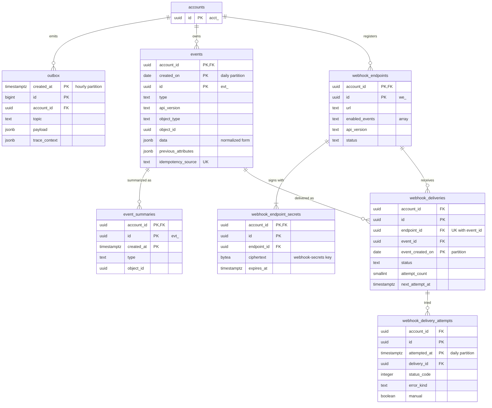

# Data model: Event と Webhook

outbox、Event、Event の要約、Webhook のエンドポイント・署名の秘密・配信・試行。振る舞いは [events-and-webhooks.md](../events-and-webhooks.md)、Event の形は [ADR-0026](../../decisions/0026-snapshot-event-model.md)、署名と配信は [ADR-0025](../../decisions/0025-webhook-signing-and-isolated-delivery.md) にある。本文の形（outbox の行、Event の JSON、Webhook の HTTP、SQS のメッセージ）は [stores.md](stores.md) の 3・4 節。規約は [data-model.md](../data-model.md) の 3 節。

## 1. ER 図

## 2. テーブル

### 2.1 `outbox`

状態を変えたトランザクションと同じトランザクションで書く、非同期の処理の依頼（transactional outbox）。relay が SQS へ中継して消す。定義元：[events-and-webhooks.md](../events-and-webhooks.md) の 2・3.2 節、[observability.md](../observability.md) の 2 節。

| 列 | 型 | NULL | 既定 | 説明 |
| --- | --- | --- | --- | --- |
| `created_at` | `timestamptz` | NOT NULL | `now()` | パーティションの鍵 |
| `id` | `bigint` | NOT NULL | identity | 中継の順 |
| `account_id` | `uuid` | NOT NULL | — | |
| `topic` | `text` | NOT NULL | — | `event.created`（Webhook の振り分けと速度の集計）・`capture.requested`（`automatic_async`）・`refund.send`・`search.index`・`shadow.compare` など。一覧は [stores.md](stores.md) の 3 節 |
| `payload` | `jsonb` | NOT NULL | — | topic ごとの Zod スキーマ。**カード番号・秘密を含めない** |
| `trace_context` | `jsonb` | NULL | — | W3C の `traceparent`・`tracestate` |

- キー：PK `(created_at, id)`。
- 索引：`(created_at, id)` の PK — relay が古い順に読む（`FOR UPDATE SKIP LOCKED`）。
- テナント・RLS：テナントの方針（書く側は `app`）。`relay` ロールは `BYPASSRLS` を持つが、権限は `outbox` の `SELECT`・`DELETE` だけ。
- パーティション：`created_at` の時間。relay が行を消し、空になって 24 時間たったパーティションを `DROP` する（[capacity.md](../capacity.md) の 3.1 節）。
- 監視：最古の行が 30 秒を超えたら呼び出し（`relay-backlog.md`）。
- S1 の量：ピーク 約 2,000 行/秒（Event 1,500 ＋ その他）。常時の行数は数千行。

### 2.2 `events`

Event（作成の時点のスナップショット、不変）。定義元：[events-and-webhooks.md](../events-and-webhooks.md) の 3・13 節。

| 列 | 型 | NULL | 既定 | 説明 |
| --- | --- | --- | --- | --- |
| `account_id` | `uuid` | NOT NULL | — | |
| `created_on` | `date` | NOT NULL | — | ID の時刻の UTC の日付。パーティションの鍵 |
| `id` | `uuid` | NOT NULL | `uuidv7()` | `evt_` |
| `created_at` | `timestamptz` | NOT NULL | — | ID の時刻 |
| `type` | `text` | NOT NULL | — | `payment_intent.succeeded` など（[events-and-webhooks.md](../events-and-webhooks.md) の 3.3 節） |
| `api_version` | `text` | NOT NULL | — | 作成の時点のアカウントの既定のバージョン |
| `object_type` | `text` | NOT NULL | — | `payment_intent` など |
| `object_id` | `uuid` | NOT NULL | — | |
| `data` | `jsonb` | NOT NULL | — | リソースの正規形（内部の最新の型）。バージョンごとの描画は保存しない。lz4 で圧縮 |
| `previous_attributes` | `jsonb` | NULL | — | |
| `request_id` | `uuid` | NULL | — | Event を起こした API の要求（`req_`）。自動の処理は NULL |
| `idempotency_key` | `text` | NULL | — | その要求の `Idempotency-Key`（Event の `request.idempotency_key`） |
| `idempotency_source` | `text` | NOT NULL | — | Event を作った内部の操作 ID（[ADR-0004](../../decisions/0004-idempotency.md) の内部の層） |

- キー：PK `(account_id, id, created_on)`。UK `(account_id, idempotency_source, created_on)`。同じ操作から 2 つの Event を作らないことは、主に遷移関数の冪等（同じ結果への遷移は何もしない）で守り、DB の一意は同じ日の中の二重の書き込みを止める。
- 索引：`(account_id, created_on, id DESC)` — 一覧（`created`・`type` で絞り込み）。`(account_id, type, id DESC)` — `type=`。`(account_id, object_id)` — オブジェクトの Event。
- 取得：`GET /v1/events/{id}` は ID の時刻から `created_on` を求めてパーティションを絞る。
- 更新：なし（不変）。`pending_webhooks` は `webhook_deliveries` から求める。
- パーティション：`created_on` の日。31 日を過ぎたら、`event_summaries` に写してから `DROP`。
- S1 の量：1 日 約 2,600 万行（平均 300 件/秒）、1 行 2〜4 KB。31 日で数 TB（[capacity.md](../capacity.md)）。

### 2.3 `event_summaries`

31 日を過ぎた Event の要約。ダッシュボードで 13 か月見せる。

| 列 | 型 | NULL | 既定 | 説明 |
| --- | --- | --- | --- | --- |
| `account_id` | `uuid` | NOT NULL | — | |
| `id` | `uuid` | NOT NULL | — | `evt_` |
| `created_at` | `timestamptz` | NOT NULL | — | パーティションの鍵 |
| `type` | `text` | NOT NULL | — | |
| `object_id` | `uuid` | NOT NULL | — | `data.object.id` |
| `request_id` | `uuid` | NULL | — | |

- キー：PK `(account_id, id, created_at)`。索引：`(account_id, created_at DESC)`、`(account_id, object_id)`。
- パーティション：`created_at` の月。13 か月で `DROP`。S1 の量：1 日 約 2,600 万行、1 行 100 B 程度。

### 2.4 `webhook_endpoints`

Webhook の送信先。定義元：[events-and-webhooks.md](../events-and-webhooks.md) の 4 節。

| 列 | 型 | NULL | 既定 | 説明 |
| --- | --- | --- | --- | --- |
| `account_id` | `uuid` | NOT NULL | — | |
| `id` | `uuid` | NOT NULL | `uuidv7()` | `we_` |
| `url` | `text` | NOT NULL | — | `https`、ポート 443 |
| `enabled_events` | `text[]` | NOT NULL | — | `{"*"}` はすべて |
| `api_version` | `text` | NULL | — | NULL はアカウントの既定（Event のバージョン） |
| `status` | `text` | NOT NULL | `'enabled'` | `enabled`・`disabled` |
| `disabled_reason` | `text` | NULL | — | `manual`・`auto_failing`（3 日失敗が続いた） |
| `failing_since` | `timestamptz` | NULL | — | 成功のないまま失敗が続いた最初の時刻 |
| `last_failure_notified_at` | `timestamptz` | NULL | — | 失敗の通知は 24 時間に 1 回まで |
| `description` | `text` | NULL | — | |
| `metadata` | `jsonb` | NOT NULL | `'{}'` | |
| `deleted_at` | `timestamptz` | NULL | — | |
| `created_at`・`updated_at` | `timestamptz` | NOT NULL | — | |

- キー：PK `(account_id, id)`。
- 索引：`(account_id) WHERE status = 'enabled' AND deleted_at IS NULL` — webhook-router が Event ごとに対象を引く（アカウントごとに最大 16 件なので、`enabled_events` の照合はアプリで行う）。
- CHECK：`url LIKE 'https://%'`、`status IN (...)`、`cardinality(enabled_events) >= 1`。
- 上限（アカウント・環境ごとに 16 個、異なるバージョンは 3 種類）は、作成のときに `accounts` の行を `FOR UPDATE` で取ってから数えて守る。
- S1 の量：約 2 万行。

### 2.5 `webhook_endpoint_secrets`

署名の秘密（入れ替えの間は 2 行）。定義元：[events-and-webhooks.md](../events-and-webhooks.md) の 7.3 節。

| 列 | 型 | NULL | 既定 | 説明 |
| --- | --- | --- | --- | --- |
| `account_id` | `uuid` | NOT NULL | — | |
| `id` | `uuid` | NOT NULL | `uuidv7()` | |
| `endpoint_id` | `uuid` | NOT NULL | — | |
| `ciphertext` | `bytea` | NOT NULL | — | `<brand>_whsec_` の秘密。KMS の `webhook-secrets` で暗号化。復号できるのは webhook-sender と再表示の処理だけ |
| `created_at` | `timestamptz` | NOT NULL | — | |
| `expires_at` | `timestamptz` | NULL | — | 入れ替えた旧い秘密の失効（すぐ、または最大 24 時間） |

- キー：PK `(account_id, id)`。FK `(account_id, endpoint_id)` → `webhook_endpoints`。
- 索引：`(account_id, endpoint_id, created_at DESC)` — 送信のときに有効な秘密（最大 2 つ）を引く。
- 保持：失効から 7 日で削除。S1 の量：約 2 万行。

### 2.6 `webhook_deliveries`

エンドポイント × Event の配信。定義元：[events-and-webhooks.md](../events-and-webhooks.md) の 2・5 節。

| 列 | 型 | NULL | 既定 | 説明 |
| --- | --- | --- | --- | --- |
| `account_id` | `uuid` | NOT NULL | — | |
| `id` | `uuid` | NOT NULL | `uuidv7()` | |
| `endpoint_id` | `uuid` | NOT NULL | — | |
| `event_id` | `uuid` | NOT NULL | — | |
| `event_created_on` | `date` | NOT NULL | — | Event のパーティション。配信のパーティションの鍵 |
| `status` | `text` | NOT NULL | `'pending'` | `pending`・`delivered`・`failed`・`abandoned` |
| `attempt_count` | `smallint` | NOT NULL | `0` | |
| `next_attempt_at` | `timestamptz` | NULL | — | 再試行の予定（SQS の遅延の上限 15 分を超える間隔のため DB に置く） |
| `first_attempted_at`・`delivered_at` | `timestamptz` | NULL | — | NFR-006 の測定 |
| `last_status_code` | `integer` | NULL | — | |
| `last_error_kind` | `text` | NULL | — | `connect`・`tls`・`timeout`・`http_status` |
| `created_at`・`updated_at` | `timestamptz` | NOT NULL | — | |

- キー：PK `(account_id, id, event_created_on)`。UK `(endpoint_id, event_id, event_created_on)` — webhook-router の `INSERT ... ON CONFLICT DO NOTHING`（同じ Event は常に同じ `event_created_on` なので、パーティションをまたがない）。
- 索引：`(next_attempt_at) WHERE status = 'pending'` — webhook-scheduler（advisory lock で 1 台。`sweeper` と同じく `BYPASSRLS` の読み取りだけのロール）。`(account_id, endpoint_id, id DESC)` — 配信の一覧。`(account_id, event_id)` — `pending_webhooks` と `delivery_success` の絞り込み。
- パーティション：`event_created_on` の日。Event と同じ 31 日で `DROP`。
- S2：配信専用のクラスタへ移す（`events` への外部キーは張らない）。
- S1 の量：1 日 約 2,300 万行。

### 2.7 `webhook_delivery_attempts`

試行ごとの記録（ダッシュボードの配信ログ）。定義元：[events-and-webhooks.md](../events-and-webhooks.md) の 8 節。

| 列 | 型 | NULL | 既定 | 説明 |
| --- | --- | --- | --- | --- |
| `account_id` | `uuid` | NOT NULL | — | |
| `id` | `uuid` | NOT NULL | `uuidv7()` | |
| `attempted_at` | `timestamptz` | NOT NULL | — | ID の時刻。パーティションの鍵 |
| `delivery_id` | `uuid` | NOT NULL | — | |
| `endpoint_id`・`event_id` | `uuid` | NOT NULL | — | 一覧のため重ねて持つ |
| `status_code` | `integer` | NULL | — | |
| `error_kind` | `text` | NULL | — | |
| `duration_ms` | `integer` | NULL | — | |
| `response_excerpt` | `text` | NULL | — | 応答の本文の先頭 4 KB（バイナリは保存しない） |
| `manual` | `boolean` | NOT NULL | `false` | 手動の再送 |

- キー：PK `(account_id, id, attempted_at)`。
- 索引：`(account_id, delivery_id, attempted_at DESC)`、`(account_id, endpoint_id, attempted_at DESC)` — 成功率と応答時間の集計。
- CHECK：`octet_length(response_excerpt) <= 4096`。
- パーティション：`attempted_at` の日。15 日で `DROP`。
- S1 の量：1 日 約 2,500 万行。
