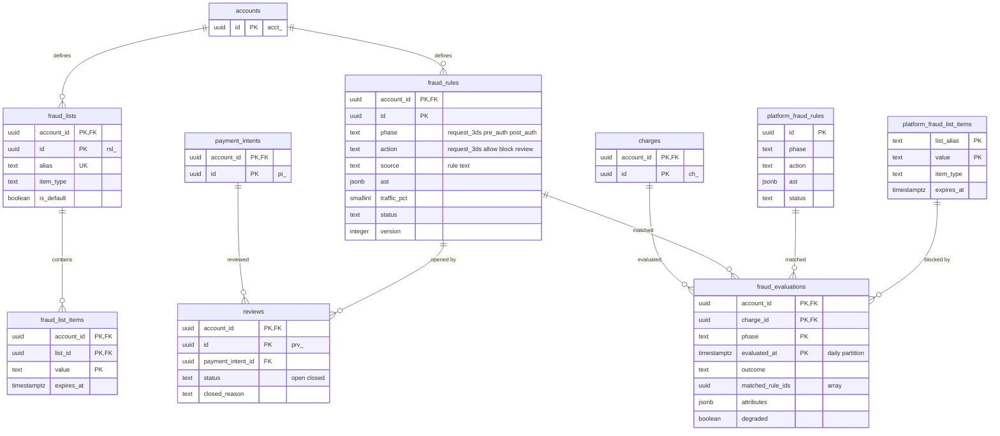

# Data model: 不正検知

ルール、リスト、評価の記録、レビュー、プラットフォームのルールとブロックリスト。振る舞いは [fraud.md](../fraud.md)、方針は [ADR-0021](../../decisions/0021-fraud-rules-engine.md) にある。速度の集計は Valkey に置く（[stores.md](stores.md) の 1 節）。規約は [data-model.md](../data-model.md) の 3 節。

- 加盟店のルールとリストはテナントテーブル（`account_id NOT NULL`）。プラットフォームのルールとブロックリストは別のテーブル（`platform_fraud_rules`・`platform_fraud_list_items`、RLS の例外）に置き、テナントテーブルに `account_id IS NULL` の行を作らない。
- 評価は Payments のプロセスの中で行い、ルールとリストは加盟店ごとに版つきでキャッシュする（最大 10 秒の遅れ）。

## 1. ER 図

## 2. テーブル

### 2.1 `fraud_rules`

加盟店のルール（版で持つ）。定義元：[fraud.md](../fraud.md) の 3・4.3 節。

| 列 | 型 | NULL | 既定 | 説明 |
| --- | --- | --- | --- | --- |
| `account_id` | `uuid` | NOT NULL | — | |
| `id` | `uuid` | NOT NULL | `uuidv7()` | |
| `phase` | `text` | NOT NULL | — | `request_3ds`（段 1）・`pre_auth`（段 2）・`post_auth`（段 3） |
| `action` | `text` | NOT NULL | — | `request_3ds`・`allow`・`block`・`review` |
| `source` | `text` | NOT NULL | — | ルールの文（`Block if ...`） |
| `ast` | `jsonb` | NOT NULL | — | 保存時に構文解析と型の検査をした結果 |
| `traffic_pct` | `smallint` | NOT NULL | `100` | 0 は影の評価 |
| `status` | `text` | NOT NULL | `'active'` | `active`・`disabled` |
| `version` | `integer` | NOT NULL | `1` | 楽観ロック |
| `created_by` | `uuid` | NULL | — | 作った利用者（API キーなら NULL） |
| `created_at`・`updated_at` | `timestamptz` | NOT NULL | — | |

- キー：PK `(account_id, id)`。索引：`(account_id) WHERE status = 'active'`（評価のキャッシュの読み込み）。
- CHECK：`traffic_pct BETWEEN 0 AND 100`、`phase` と `action` の組（`request_3ds` の段は `request_3ds` だけ）。
- 上限：加盟店ごとに 200 件（作成のときに数える）。変更は監査ログに残す。S1 の量：数万行。

### 2.2 `fraud_lists`

加盟店のリスト（既定のリストと独自のリスト）。

| 列 | 型 | NULL | 既定 | 説明 |
| --- | --- | --- | --- | --- |
| `account_id` | `uuid` | NOT NULL | — | |
| `id` | `uuid` | NOT NULL | `uuidv7()` | `rsl_` |
| `alias` | `text` | NOT NULL | — | ルールで使う名前（`@blocked_cards`） |
| `name` | `text` | NOT NULL | — | |
| `item_type` | `text` | NOT NULL | — | `card_fingerprint`・`card_bin`・`card_country`・`email`・`email_domain`・`ip_address`・`ip_country`・`customer_id`・`string` |
| `list_kind` | `text` | NOT NULL | — | `block`・`allow`・`custom` |
| `is_default` | `boolean` | NOT NULL | `false` | 既定のリスト（消せない） |
| `version` | `bigint` | NOT NULL | `1` | 項目の変更で増やす（キャッシュの無効化） |
| `created_at`・`updated_at` | `timestamptz` | NOT NULL | — | |

- キー：PK `(account_id, id)`。UK `(account_id, alias)`。S1 の量：約 20 万行。

### 2.3 `fraud_list_items`

リストの項目。

| 列 | 型 | NULL | 既定 | 説明 |
| --- | --- | --- | --- | --- |
| `account_id` | `uuid` | NOT NULL | — | |
| `list_id` | `uuid` | NOT NULL | — | |
| `value` | `text` | NOT NULL | — | 正規化した値（メールは小文字）。PII（メール・IP） |
| `expires_at` | `timestamptz` | NULL | — | 指紋の許可リストは最長 30 日 |
| `created_by` | `uuid` | NULL | — | |
| `created_reason` | `text` | NULL | — | `manual`・`refunded_as_fraud`・`efw_auto_refund` |
| `created_at` | `timestamptz` | NOT NULL | — | |

- キー：PK `(account_id, list_id, value)`。FK `(account_id, list_id)` → `fraud_lists`。
- 索引：`(expires_at) WHERE expires_at IS NOT NULL` — 失効のジョブ。
- 上限：リスト 1 つあたり 5 万件。S1 の量：数百万行。

### 2.4 `fraud_evaluations`

評価の記録（段 2・段 3）。ルールの試験（過去 90 日）と Dispute の分析に使う。定義元：[fraud.md](../fraud.md) の 2・3.4・4.4 節。

| 列 | 型 | NULL | 既定 | 説明 |
| --- | --- | --- | --- | --- |
| `account_id` | `uuid` | NOT NULL | — | |
| `charge_id` | `uuid` | NOT NULL | — | 決済の試行（冪等キー） |
| `phase` | `text` | NOT NULL | — | `pre_auth`・`post_auth` |
| `evaluated_at` | `timestamptz` | NOT NULL | — | パーティションの鍵（Charge の ID の時刻と同じ値にする） |
| `outcome` | `text` | NOT NULL | — | `allow`・`block`・`review`・`none` |
| `matched_rule_ids` | `uuid[]` | NOT NULL | `'{}'` | 合致した加盟店のルール（影の評価を含む） |
| `matched_platform_rule_ids` | `uuid[]` | NOT NULL | `'{}'` | |
| `attributes` | `jsonb` | NOT NULL | — | 評価に使った属性のスナップショット（PAN・CVC を含まない。メール・IP は PII） |
| `risk_score` | `smallint` | NULL | — | 外部のサービス |
| `risk_level` | `text` | NULL | — | |
| `degraded` | `boolean` | NOT NULL | `false` | Valkey・外部のサービスの障害で欠損した属性がある |

- キー：PK `(account_id, charge_id, phase, evaluated_at)`（Charge の ID の時刻と同じ値なので、同じ試行・段の 2 回目は衝突する）。
- 索引：`(account_id, evaluated_at)` — ルールの試験。
- パーティション：`evaluated_at` の日。2 年を過ぎたパーティションは `attributes` から PII の属性を消す（[security.md](../security.md) の 13 節）。
- S1 の量：1 日 約 1,800 万行。

### 2.5 `reviews`

レビューのキュー。定義元：[fraud.md](../fraud.md) の 8 節。

| 列 | 型 | NULL | 既定 | 説明 |
| --- | --- | --- | --- | --- |
| `account_id` | `uuid` | NOT NULL | — | |
| `id` | `uuid` | NOT NULL | `uuidv7()` | `prv_` |
| `payment_intent_id` | `uuid` | NOT NULL | — | |
| `charge_id` | `uuid` | NOT NULL | — | |
| `opened_reason` | `text` | NOT NULL | — | `rule`・`manual`・`degraded_evaluation` |
| `rule_id` | `uuid` | NULL | — | |
| `status` | `text` | NOT NULL | `'open'` | `open`・`closed` |
| `closed_reason` | `text` | NULL | — | `approved`・`refunded`・`refunded_as_fraud`・`disputed` |
| `assigned_to` | `uuid` | NULL | — | 利用者 |
| `opened_at`・`closed_at` | `timestamptz` | — | — | |

- キー：PK `(account_id, id)`。FK `(account_id, payment_intent_id)` → `payment_intents`。部分 UK `(account_id, payment_intent_id) WHERE status = 'open'`。
- 索引：`(account_id, opened_at DESC) WHERE status = 'open'` — キュー。
- 保持：7 年。S1 の量：1 日 数万行。

### 2.6 `platform_fraud_rules`

プラットフォームのルール（RLS の例外）。社内のリスクの担当が作り、加盟店は上書きできない。

| 列 | 型 | NULL | 既定 | 説明 |
| --- | --- | --- | --- | --- |
| `id` | `uuid` | NOT NULL | `uuidv7()` | |
| `phase`・`action`・`source` | `text` | NOT NULL | — | `fraud_rules` と同じ |
| `ast` | `jsonb` | NOT NULL | — | 内部向けの指紋（`fingerprint_internal`）を属性に使える |
| `scope_account_id` | `uuid` | NULL | — | 特定の加盟店だけに当てる一時的なルール（カードテスティングの急増） |
| `tier` | `text` | NOT NULL | — | `platform`（上書き不可）・`default`（加盟店が無効にできる） |
| `status` | `text` | NOT NULL | — | |
| `expires_at` | `timestamptz` | NULL | — | |
| `version` | `integer` | NOT NULL | `1` | |
| `created_by` | `text` | NOT NULL | — | 社内の担当者 |
| `created_at`・`updated_at` | `timestamptz` | NOT NULL | — | |

- キー：PK `(id)`。変更は `platform_audit_events` に残す。S1 の量：数百行。

### 2.7 `platform_fraud_list_items`

プラットフォームのブロックリスト（RLS の例外。2026-09-28 に定義）。Valkey の障害でも効くよう、Payments のプロセスにキャッシュする。

| 列 | 型 | NULL | 既定 | 説明 |
| --- | --- | --- | --- | --- |
| `list_alias` | `text` | NOT NULL | — | `@platform_blocked_cards` など |
| `value` | `text` | NOT NULL | — | 内部向けの指紋、BIN、国、IP など |
| `item_type` | `text` | NOT NULL | — | |
| `reason` | `text` | NOT NULL | — | `reported_fraud`・`sanctions` など |
| `expires_at` | `timestamptz` | NULL | — | |
| `created_by` | `text` | NOT NULL | — | |
| `created_at` | `timestamptz` | NOT NULL | — | |

- キー：PK `(list_alias, value)`。S1 の量：数百万行。
