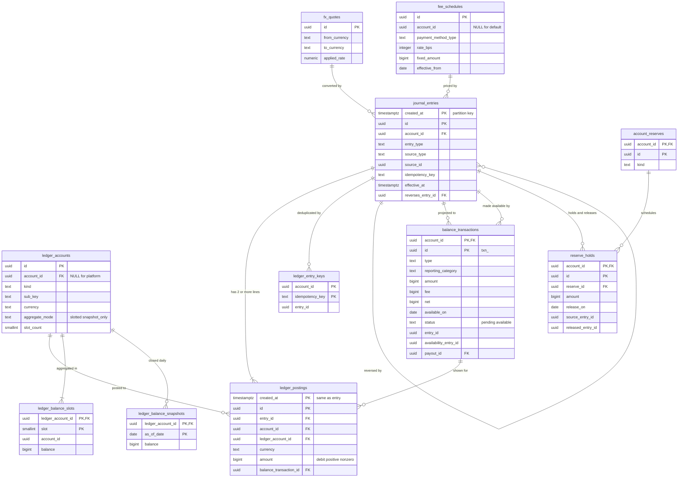

# Data model: 台帳

複式簿記の台帳、口座、残高の集計、BalanceTransaction、手数料、通貨の換算、リザーブ、営業日。振る舞いは [ledger.md](../ledger.md)、方針は [ADR-0003](../../decisions/0003-double-entry-ledger.md)（追記のみの複式簿記）、[ADR-0015](../../decisions/0015-chart-of-accounts-and-balance-transactions.md)（勘定体系と BT）、[ADR-0016](../../decisions/0016-hot-accounts-and-ledger-sharding.md)（スロットとシャード）にある。仕訳の種類・明細の型・冪等キーの一覧は [stores.md](stores.md) の 5 節。規約は [data-model.md](../data-model.md) の 3 節。

## 1. ER 図

`balance_source_type_slots`・`balance_daily_summaries`・`business_calendars` は、仕訳・BT から作る集計とマスタなので図から省いた（3.9〜3.11 節、3.13 節）。

## 2. 制約の実装

| 制約 | 実装 |
| --- | --- |
| 仕訳ごと・通貨ごとの釣り合い、2 行以上、0 の行がない、明細の通貨 ＝ 口座の通貨、明細の `account_id` ＝ 仕訳の `account_id`、明細の `created_at` ＝ 仕訳の `created_at` | `ledger_postings` の `AFTER INSERT` の制約トリガー `ledger_check_entry_balanced()`（`DEFERRABLE INITIALLY DEFERRED`）。コミット時に、そのトランザクションで書いた仕訳ごとに検査し、満たさなければ例外でコミットを失敗させる |
| 追記のみ | `app`・`recon` から `journal_entries`・`ledger_postings`・`ledger_entry_keys` の `UPDATE`・`DELETE` を外す。`BEFORE UPDATE OR DELETE` のトリガーで例外（`migrator` のパーティションの付け外しは `DETACH` で行い、行を消さない） |
| 仕訳の冪等 | `ledger_entry_keys` の主キー。仕訳を書く関数 `ledger_post(entry, postings[])` が、先にキーを `INSERT ... ON CONFLICT DO NOTHING` し、衝突したら既存の `entry_id` を返す |
| 集計の更新 | `ledger_post` が、`slotted` の口座の明細ごとに `ledger_balance_slots` の 1 行（スロットは `hash(entry_id) mod slot_count`）を加算する。同じトランザクション |
| BT の不変 | `balance_transactions` の `UPDATE` の権限を `status`・`availability_entry_id`・`payout_id` の列だけに与える |

- 仕訳は `ledger_post` だけで書く。アプリから `journal_entries` に直接 `INSERT` しない（lint）。
- 明細の `created_at` は、仕訳の `created_at` と同じ値にする（ID の時刻ではない。[data-model.md](../data-model.md) の 3.1 節の例外）。仕訳と明細が同じ月のパーティションに入り、検査が 1 つのパーティションで済む。
- `ledger_postings` から `journal_entries` への外部キーは張らない（両方がパーティションの表で、書き込みが多い）。存在と一致は上の制約トリガーで確かめる。`ledger_account_id` → `ledger_accounts(id)` の外部キーは張る。

## 3. テーブル

### 3.1 `ledger_accounts`

台帳の口座。「持ち主 × 種類 × 小分類 × 通貨」で 1 つ。定義元：[ledger.md](../ledger.md) の 2・3 節。

| 列 | 型 | NULL | 既定 | 説明 |
| --- | --- | --- | --- | --- |
| `id` | `uuid` | NOT NULL | `uuidv7()` | |
| `account_id` | `uuid` | NULL | — | 持ち主の加盟店。プラットフォームの口座は NULL |
| `kind` | `text` | NOT NULL | — | `merchant_pending`・`merchant_available`・`merchant_reserved`・`connector_receivable`・`bank_cash`・`payouts_in_transit`・`refunds_payable`・`customer_cash_balance`・`fee_revenue`・`fx_revenue`・`processing_cost`・`fx_position`・`fx_gain_loss`・`loss_write_off`・`suspense` |
| `sub_key` | `text` | NOT NULL | `''` | 小分類（`connector_receivable` のコネクタ、`bank_cash` の銀行口座、`suspense` の出どころ、`fx_position` の通貨） |
| `currency` | `text` | NOT NULL | — | |
| `aggregate_mode` | `text` | NOT NULL | — | `slotted`（加盟店の口座）・`snapshot_only`（プラットフォームの口座） |
| `slot_count` | `smallint` | NOT NULL | `1` | 増やすだけで減らさない（最大 64） |
| `created_at` | `timestamptz` | NOT NULL | — | |

- キー：PK `(id)`。UK `(account_id, kind, sub_key, currency) NULLS NOT DISTINCT`。
- CHECK：`kind IN (...)`。`(kind LIKE 'merchant_%') = (account_id IS NOT NULL)`。`(aggregate_mode = 'slotted') = (account_id IS NOT NULL)`。`slot_count BETWEEN 1 AND 64`。
- 更新：`slot_count` の増加だけ（Ops。新しいスロットの行を 0 で足す）。
- テナント・RLS：加盟店の口座はテナントの方針。プラットフォームの口座（`account_id IS NULL`）は読み取りだけの方針（[data-model.md](../data-model.md) の 3.3 節）。
- S2：プラットフォームの口座はシャードごとに持つ（各シャードのクラスタに行がある）。
- 保持：10 年。S1 の量：約 3 万行（加盟店 1 万 × 3 種類 ＋ プラットフォーム）。

### 3.2 `journal_entries`

仕訳（追記のみ）。1 つの仕訳は 1 つの加盟店に属する。

| 列 | 型 | NULL | 既定 | 説明 |
| --- | --- | --- | --- | --- |
| `created_at` | `timestamptz` | NOT NULL | — | ID の時刻。パーティションの鍵 |
| `id` | `uuid` | NOT NULL | `uuidv7()` | |
| `account_id` | `uuid` | NOT NULL | — | 業務上の持ち主の加盟店 |
| `entry_type` | `text` | NOT NULL | — | 仕訳の種類（[stores.md](stores.md) の 5 節） |
| `source_type` | `text` | NOT NULL | — | `charge`・`refund`・`dispute`・`payout`・`cash_balance_transaction`・`reserve_hold`・`settlement_line`・`bank_statement_line`・`recon_break`・`correction` など |
| `source_id` | `uuid` | NULL | — | 元のオブジェクト。日次の一括の仕訳は NULL |
| `idempotency_key` | `text` | NOT NULL | — | 内部の冪等キー |
| `effective_at` | `timestamptz` | NOT NULL | — | 会計上の日時 |
| `reverses_entry_id` | `uuid` | NULL | — | 取り消しの仕訳なら元の仕訳 |
| `fx_quote_id` | `uuid` | NULL | — | 換算があれば（S2） |
| `metadata` | `jsonb` | NOT NULL | `'{}'` | 適用した料金表のバージョン（`fee_schedule_id`）、訂正の ID と承認者など |

- キー：PK `(created_at, id)`。仕訳の冪等は `ledger_entry_keys`。
- 索引：`(account_id, created_at)` — 加盟店ごとの読み取りと再計算。`(account_id, source_type, source_id)` — オブジェクトからの追跡（`source_id` は UUIDv7 なので、時刻からパーティションを絞れる）。`(reverses_entry_id) WHERE reverses_entry_id IS NOT NULL`。
- CHECK：`effective_at >= created_at`（締めた期間を書き換えない）。`entry_type IN (...)`。
- テナント・RLS：テナントの方針。照合・会計は `recon`。
- パーティション：`created_at` の月。13 か月より古いものは S3 の Parquet（Iceberg、Object Lock）に移して `DETACH`、10 年まで残す（[ledger.md](../ledger.md) の 3 節）。
- S1 の量：1 日 約 1,000 万行（確定・返金・Dispute・移動・入金）。

### 3.3 `ledger_postings`

仕訳の明細（追記のみ）。

| 列 | 型 | NULL | 既定 | 説明 |
| --- | --- | --- | --- | --- |
| `created_at` | `timestamptz` | NOT NULL | — | 仕訳の `created_at` と同じ |
| `id` | `uuid` | NOT NULL | `uuidv7()` | |
| `entry_id` | `uuid` | NOT NULL | — | 仕訳 |
| `account_id` | `uuid` | NOT NULL | — | 仕訳の `account_id` と同じ（プラットフォームの口座への行も） |
| `ledger_account_id` | `uuid` | NOT NULL | — | → `ledger_accounts` |
| `currency` | `text` | NOT NULL | — | 口座の通貨と同じ |
| `amount` | `bigint` | NOT NULL | — | 借方が正、貸方が負 |
| `balance_transaction_id` | `uuid` | NULL | — | 加盟店の口座の行だけ。どの BT の行か |

- キー：PK `(created_at, id)`。FK `ledger_account_id` → `ledger_accounts(id)`。
- 索引：`(entry_id)`（パーティションごと）— 制約トリガーと仕訳の表示。`(ledger_account_id, created_at)` — 日次のスナップショット（口座 × 日の合計）。`(account_id, created_at)` — 加盟店の再計算。
- CHECK：`amount <> 0`。
- テナント・RLS：テナントの方針。
- パーティション：`created_at` の月（仕訳と同じ扱い）。
- S1 の量：1 日 約 4,000 万行（1 仕訳あたり平均 4 行。[capacity.md](../capacity.md) の 1 節の「仕訳の行 1 日 約 5,000 万行」は仕訳を含む）。

### 3.4 `ledger_entry_keys`

仕訳の冪等キー（パーティションなし。パーティションをまたぐ一意を張るため）。

| 列 | 型 | NULL | 既定 | 説明 |
| --- | --- | --- | --- | --- |
| `account_id` | `uuid` | NOT NULL | — | |
| `idempotency_key` | `text` | NOT NULL | — | 例：`capture:{charge_id}` |
| `entry_id` | `uuid` | NOT NULL | — | |
| `entry_created_at` | `timestamptz` | NOT NULL | — | 仕訳を引くためのパーティションの鍵 |

- キー：PK `(account_id, idempotency_key)`。
- 保持：13 か月。それより古いキーは月次のバッチで消す。13 か月を過ぎた操作の再実行は、元の記録（照合の `recon_matches` など）の一意で止める。
- S1 の量：1 日 約 1,000 万行、13 か月で 約 40 億行（**要確認**：E10 の負荷試験で大きさと索引の効率を確かめる。S2 のシャードで分かれる）。

### 3.5 `ledger_balance_slots`

`slotted` の口座の残高の集計。仕訳と同じトランザクションで 1 行だけ加算する。

| 列 | 型 | NULL | 既定 | 説明 |
| --- | --- | --- | --- | --- |
| `ledger_account_id` | `uuid` | NOT NULL | — | |
| `slot` | `smallint` | NOT NULL | — | `0 .. slot_count-1` |
| `account_id` | `uuid` | NOT NULL | — | RLS 用 |
| `balance` | `bigint` | NOT NULL | `0` | 借方が正の合計。加盟店に見せるときは符号を反転 |
| `last_posting_at` | `timestamptz` | NULL | — | |

- キー：PK `(ledger_account_id, slot)`。FK `ledger_account_id` → `ledger_accounts(id)`。
- 読み取り：残高は全スロットの合計。入金と返金の作成のときだけ全スロットを `FOR UPDATE` で読む（ADR-0016）。
- 設定：`fillfactor = 50`、`autovacuum_vacuum_scale_factor = 0.005`（[capacity.md](../capacity.md) の 3.1 節）。
- 日次の検査：スロットの合計 ＝ 前日のスナップショット ＋ 締め以降の明細の合計。ずれたらスロットだけを直す（仕訳は変えない）。
- S1 の量：約 3 万行（加盟店の口座 × スロット）。

### 3.6 `ledger_balance_snapshots`

口座ごとの日次の残高（JST 0:00 の締め）。定義元：[ledger.md](../ledger.md) の 4.2 節。

| 列 | 型 | NULL | 既定 | 説明 |
| --- | --- | --- | --- | --- |
| `ledger_account_id` | `uuid` | NOT NULL | — | |
| `as_of_date` | `date` | NOT NULL | — | 締めの日（その日の終わりの残高） |
| `account_id` | `uuid` | NULL | — | プラットフォームの口座は NULL |
| `balance` | `bigint` | NOT NULL | — | 前日のスナップショット ＋ その日の明細の合計 |
| `posting_count` | `bigint` | NOT NULL | — | |
| `created_at` | `timestamptz` | NOT NULL | — | |

- キー：PK `(ledger_account_id, as_of_date)`。
- 書き込み：日次のジョブ（`recon`、reader で計算して writer に書く）だけ。追記のみ。
- 検査：通貨ごとに、全口座の `balance` の合計が 0（シャードごと、全体）。
- 保持：10 年。S1 の量：1 日 約 3 万行。

### 3.7 `balance_transactions`

加盟店に見せる残高の取引。仕訳の射影で、仕訳と同じトランザクションで作る。定義元：[ledger.md](../ledger.md) の 6 節、[ADR-0015](../../decisions/0015-chart-of-accounts-and-balance-transactions.md)。

| 列 | 型 | NULL | 既定 | 説明 |
| --- | --- | --- | --- | --- |
| `account_id` | `uuid` | NOT NULL | — | |
| `id` | `uuid` | NOT NULL | `uuidv7()` | `txn_` |
| `currency` | `text` | NOT NULL | — | 加盟店の残高の通貨（MVP は `jpy`） |
| `type` | `text` | NOT NULL | — | `charge`・`payment`・`refund`・`payment_refund`・`refund_failure`・`adjustment`・`payout`・`payout_failure`・`payout_cancel`・`reserve_hold`・`reserve_release`・`<brand>_fee`・`<brand>_fx_fee` |
| `reporting_category` | `text` | NOT NULL | — | `charge`・`refund`・`dispute`・`dispute_reversal`・`payout`・`payout_reversal`・`fee`・`risk_reserved_funds` など（仕訳の種類からの固定の対応表） |
| `amount` | `bigint` | NOT NULL | — | 総額。加盟店の残高が増えると正 |
| `fee` | `bigint` | NOT NULL | `0` | |
| `net` | `bigint` | NOT NULL | — | `amount - fee` |
| `fee_details` | `jsonb` | NOT NULL | `'[]'` | `[{type: <brand>_fee, amount, currency, description}]` |
| `exchange_rate` | `numeric` | NULL | — | 換算がなければ NULL |
| `source_type` | `text` | NOT NULL | — | `charge`・`refund`・`dispute`・`payout`・`reserve_hold` など |
| `source_id` | `uuid` | NULL | — | |
| `source_group` | `text` | NOT NULL | — | Balance の `source_types` の分類。MVP は `card`・`bank_account` |
| `entry_id` | `uuid` | NOT NULL | — | 元の仕訳 |
| `available_on` | `date` | NOT NULL | — | 確定のときに決めて固定する（JST の日付） |
| `status` | `text` | NOT NULL | — | `pending`・`available` |
| `availability_entry_id` | `uuid` | NULL | — | 利用可能への一括の仕訳 |
| `payout_id` | `uuid` | NULL | — | 自動入金に含まれたら設定 |
| `created_at` | `timestamptz` | NOT NULL | — | |

- キー：PK `(account_id, id)`。FK `(account_id, payout_id)` → `payouts`。
- 索引：`(account_id, id DESC)` — 一覧。`(account_id, payout_id, id DESC) WHERE payout_id IS NOT NULL` — `payout=` の絞り込み。`(account_id, source_type, source_id)` — `source=` とオブジェクトの `balance_transaction`。`(account_id, type, id DESC)` — `type=`。`(account_id, currency, available_on) WHERE status = 'pending'` — 利用可能への移動のジョブ。`(account_id, currency, id) WHERE status = 'available' AND payout_id IS NULL AND type NOT IN ('payout','payout_failure','payout_cancel')` — 自動入金に含める BT。
- CHECK：`net = amount - fee`、`fee >= 0`、`status IN ('pending','available')`、`exchange_rate IS NULL OR exchange_rate > 0`。
- 更新：`status`・`availability_entry_id`・`payout_id` の列だけ（列の権限）。
- テナント・RLS：テナントの方針。
- パーティション：S1 はなし。S2 で `created_at` の月（そのとき PK を `(account_id, created_at, id)` にする）。
- 保持：7 年。個人情報を持たない。
- S1 の量：1 日 約 1,000 万行。

### 3.8 `reserve_holds`

リザーブの保留と解放の予定。仕訳は `reserve_hold`・`reserve_release`。定義元：[ledger.md](../ledger.md) の 4.4 節、[merchant-onboarding.md](../merchant-onboarding.md) の 7 節。

| 列 | 型 | NULL | 既定 | 説明 |
| --- | --- | --- | --- | --- |
| `account_id` | `uuid` | NOT NULL | — | |
| `id` | `uuid` | NOT NULL | `uuidv7()` | |
| `reserve_id` | `uuid` | NOT NULL | — | → `account_reserves`（計画） |
| `currency` | `text` | NOT NULL | — | |
| `amount` | `bigint` | NOT NULL | — | |
| `release_on` | `date` | NOT NULL | — | 解放の予定日 |
| `source_entry_id` | `uuid` | NOT NULL | — | 保留の仕訳 |
| `source_balance_transaction_id` | `uuid` | NULL | — | ローリングのとき、元の決済の BT |
| `released_entry_id` | `uuid` | NULL | — | 解放の仕訳 |
| `released_reason` | `text` | NULL | — | `scheduled`・`applied_to_refund`・`applied_to_dispute`・`manual` |
| `released_at` | `timestamptz` | NULL | — | |
| `created_at` | `timestamptz` | NOT NULL | — | |

- キー：PK `(account_id, id)`。FK `(account_id, reserve_id)` → `account_reserves`。
- 索引：`(release_on) WHERE released_entry_id IS NULL` — 解放の日次のジョブ（`sweeper`）。`(account_id, source_balance_transaction_id)` — 返金・Dispute のときに先に解放するリザーブを探す。
- CHECK：`amount > 0`。`released_entry_id` は 1 回だけ設定する（トリガー）。
- 解放のジョブの冪等キーは `reserve_release:{reserve_hold_id}`。S1 の量：ローリングのリザーブを持つ加盟店の数に比例（数十万行）。

### 3.9 `balance_source_type_slots`

Balance API の `source_types` の小さな集計（加盟店 × 通貨 × 残高の種類 × 分類）。BT の作成と利用可能への移動と同じトランザクションで加算する。定義元：[ledger.md](../ledger.md) の 4.3 節。

| 列 | 型 | NULL | 既定 | 説明 |
| --- | --- | --- | --- | --- |
| `account_id` | `uuid` | NOT NULL | — | |
| `currency` | `text` | NOT NULL | — | |
| `balance_kind` | `text` | NOT NULL | — | `pending`・`available` |
| `source_group` | `text` | NOT NULL | — | `card`・`bank_account` |
| `slot` | `smallint` | NOT NULL | — | `merchant_pending` の口座と同じスロットの数 |
| `amount` | `bigint` | NOT NULL | `0` | 加盟店から見た符号 |

- キー：PK `(account_id, currency, balance_kind, source_group, slot)`。
- 日次の検査：分類の合計 ＝ Balance の `available`・`pending`。S1 の量：約 4 万行。

### 3.10 `balance_daily_summaries`

加盟店 × 通貨 × 日 × `reporting_category` の集計。ダッシュボードのホームとレポートが読む。定義元：[ledger.md](../ledger.md) の 4.2 節、[dashboard.md](../dashboard.md) の 14 節。

| 列 | 型 | NULL | 既定 | 説明 |
| --- | --- | --- | --- | --- |
| `account_id` | `uuid` | NOT NULL | — | |
| `currency` | `text` | NOT NULL | — | |
| `summary_on` | `date` | NOT NULL | — | 加盟店のタイムゾーンの日付 |
| `reporting_category` | `text` | NOT NULL | — | |
| `count` | `bigint` | NOT NULL | — | |
| `gross`・`fee`・`net` | `bigint` | NOT NULL | — | |
| `created_at` | `timestamptz` | NOT NULL | — | |

- キー：PK `(account_id, currency, summary_on, reporting_category)`。
- 書き込み：日次のジョブ（翌日 12:00 までに揃える）。同じ日を作り直すときは置き換える（集計なので追記のみにしない）。
- 保持：7 年。S1 の量：1 日 約 5 万行。

### 3.11 `fee_schedules`

料金表（バージョンで持つ。追記のみ）。定義元：[ledger.md](../ledger.md) の 7 節。

| 列 | 型 | NULL | 既定 | 説明 |
| --- | --- | --- | --- | --- |
| `id` | `uuid` | NOT NULL | `uuidv7()` | |
| `account_id` | `uuid` | NULL | — | 個別の料金の加盟店。既定の行は NULL |
| `fee_kind` | `text` | NOT NULL | — | `payment`・`dispute`・`fx` |
| `payment_method_type` | `text` | NOT NULL | `'*'` | `card`・`konbini`・`customer_balance`・`*` |
| `card_region` | `text` | NOT NULL | `'*'` | `domestic`・`international`・`*` |
| `rate_bps` | `integer` | NOT NULL | `0` | 例：3.6% は `360` |
| `fixed_amount` | `bigint` | NOT NULL | `0` | 例：Dispute は `1500` |
| `min_amount` | `bigint` | NOT NULL | `0` | 例：コンビニは `120` |
| `currency` | `text` | NOT NULL | — | |
| `effective_from` | `timestamptz` | NOT NULL | — | |
| `created_by` | `text` | NOT NULL | — | 社内の担当者 |
| `created_at` | `timestamptz` | NOT NULL | — | |

- キー：PK `(id)`。UK `(account_id, fee_kind, payment_method_type, card_region, currency, effective_from) NULLS NOT DISTINCT`。
- 索引：`(account_id, fee_kind, payment_method_type, currency, effective_from DESC)` — 決済の時点で有効なバージョンを引く（加盟店の行を先に、なければ既定の行）。
- CHECK：`rate_bps BETWEEN 0 AND 10000`、`fixed_amount >= 0`、`min_amount >= 0`。
- 更新：追記のみ。適用したバージョンの `id` を仕訳の `metadata.fee_schedule_id` に残す。
- テナント・RLS：`account_id IS NULL` の行は読み取りだけ（[data-model.md](../data-model.md) の 3.3 節）。S1 の量：数百行。

### 3.12 `fx_quotes`

換算のレート（S2。MVP は JPY だけなので使わない）。定義元：[ledger.md](../ledger.md) の 10 節。

| 列 | 型 | NULL | 既定 | 説明 |
| --- | --- | --- | --- | --- |
| `id` | `uuid` | NOT NULL | `uuidv7()` | |
| `from_currency`・`to_currency` | `text` | NOT NULL | — | |
| `mid_rate` | `numeric` | NOT NULL | — | 提供元の仲値 |
| `applied_rate` | `numeric` | NOT NULL | — | BT の `exchange_rate` に入れる値 |
| `source` | `text` | NOT NULL | — | レートの提供元 |
| `fetched_at` | `timestamptz` | NOT NULL | — | |

- キー：PK `(id)`。索引：`(from_currency, to_currency, fetched_at DESC)`。
- テナント・RLS：共通のマスタ（読み取りだけ）。保持：10 年。

### 3.13 `business_calendars`

営業日の表（日本の銀行の休業日）。Ops が年に 1 回更新する。定義元：[ledger.md](../ledger.md) の 5.1 節。

| 列 | 型 | NULL | 既定 | 説明 |
| --- | --- | --- | --- | --- |
| `country` | `text` | NOT NULL | — | `JP` |
| `date` | `date` | NOT NULL | — | |
| `is_business_day` | `boolean` | NOT NULL | — | 土日、祝日、12/31〜1/3 は `false` |
| `note` | `text` | NULL | — | 祝日の名前など |

- キー：PK `(country, date)`。テナント・RLS：共通のマスタ。
- 翌年の表がないまま年を越えそうなら、12 月 1 日にアラートを出す。S1 の量：1 年 365 行。
