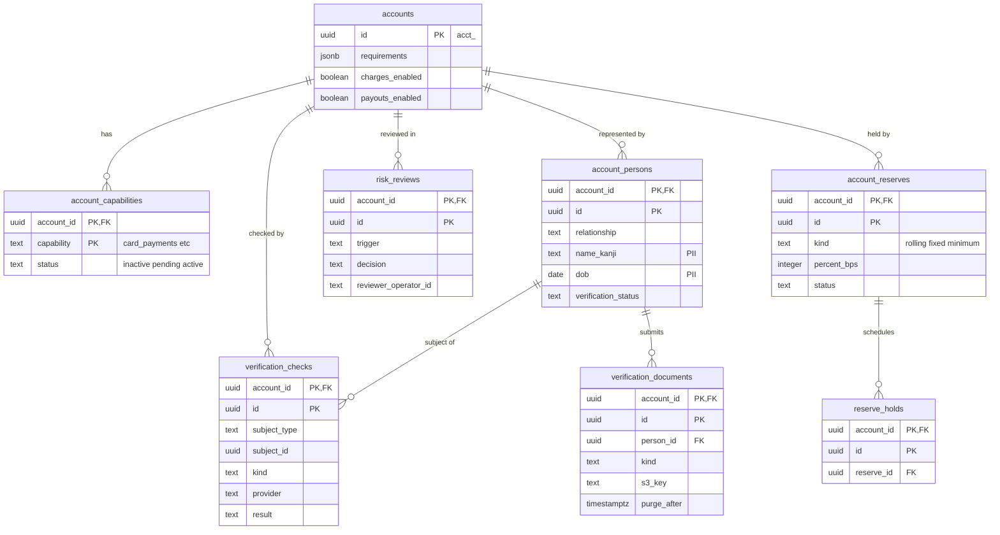

# Data model: 加盟店の審査

capability、代表者・実質的支配者、本人確認と照合の結果、書類、リスクの審査、リザーブの計画。`accounts` の `requirements`・`charges_enabled` などは [accounts-and-keys.md](accounts-and-keys.md) の 2.7 節にある。振る舞いは [merchant-onboarding.md](../merchant-onboarding.md)、方針は [ADR-0022](../../decisions/0022-merchant-onboarding-and-kyc.md) にある。規約は [data-model.md](../data-model.md) の 3 節。

> 法務の確認待ち（[intent.md](../../intent.md) の L2・L3・L6・L7）：確認する項目、記録の保存期間、拒否の後の留保の期間は、結論で変わりうる。

## 1. ER 図

## 2. テーブル

### 2.1 `account_capabilities`

決済の capability の状態。定義元：[merchant-onboarding.md](../merchant-onboarding.md) の 5 節。

| 列 | 型 | NULL | 既定 | 説明 |
| --- | --- | --- | --- | --- |
| `account_id` | `uuid` | NOT NULL | — | |
| `capability` | `text` | NOT NULL | — | `card_payments`・`konbini_payments`・`jp_bank_transfer_payments` |
| `status` | `text` | NOT NULL | `'inactive'` | `inactive`・`pending`・`active` |
| `requested_at` | `timestamptz` | NULL | — | |
| `status_changed_at` | `timestamptz` | NOT NULL | — | |
| `disabled_reason` | `text` | NULL | — | |

- キー：PK `(account_id, capability)`。
- 更新：`evaluateAccountCapabilities` だけが変え、同じトランザクションで `accounts.charges_enabled` と `account.updated` の Event を書く。S1 の量：約 3 万行。

### 2.2 `account_persons`

代表者・実質的支配者・取引担当者・個人事業主本人。

| 列 | 型 | NULL | 既定 | 説明 |
| --- | --- | --- | --- | --- |
| `account_id` | `uuid` | NOT NULL | — | |
| `id` | `uuid` | NOT NULL | `uuidv7()` | |
| `relationship` | `text[]` | NOT NULL | — | `representative`・`owner`・`representative_agent`・`individual` |
| `name_kanji`・`name_kana` | `text` | NOT NULL | — | PII |
| `dob` | `date` | NULL | — | PII |
| `address_kanji`・`address_kana` | `jsonb` | NULL | — | PII |
| `phone`・`email` | `text` | NULL | — | PII |
| `title` | `text` | NULL | — | 役職 |
| `ownership_percent` | `numeric` | NULL | — | 実質的支配者の議決権の割合 |
| `verification_status` | `text` | NOT NULL | `'unverified'` | `unverified`・`pending`・`verified` |
| `created_at`・`updated_at` | `timestamptz` | NOT NULL | — | |
| `redacted_at` | `timestamptz` | NULL | — | |

- キー：PK `(account_id, id)`。
- 保持：取引の終了から 7 年、その後に個人情報を除く。S1 の量：約 3 万行。

### 2.3 `verification_checks`

eKYC、法人番号、反社・制裁・PEP、口座の名義、URL の照合の結果の要約。提供者の生の応答（顔写真など）を持たない。

| 列 | 型 | NULL | 既定 | 説明 |
| --- | --- | --- | --- | --- |
| `account_id` | `uuid` | NOT NULL | — | |
| `id` | `uuid` | NOT NULL | `uuidv7()` | |
| `subject_type` | `text` | NOT NULL | — | `account`・`person`・`bank_account` |
| `subject_id` | `uuid` | NOT NULL | — | |
| `kind` | `text` | NOT NULL | — | `ekyc`・`corporate_number`・`antisocial`・`sanctions`・`pep`・`bank_account_name`・`website` |
| `provider` | `text` | NOT NULL | — | |
| `provider_ref` | `text` | NULL | — | 提供者の側の ID |
| `result` | `text` | NOT NULL | — | `pending`・`passed`・`failed`・`needs_review` |
| `reason_code` | `text` | NULL | — | `requirements.errors[].code` に写す値 |
| `summary` | `jsonb` | NOT NULL | `'{}'` | 一致の度合いなどの要約 |
| `checked_at` | `timestamptz` | NULL | — | |
| `created_at` | `timestamptz` | NOT NULL | — | |

- キー：PK `(account_id, id)`。UK `(provider, provider_ref)`（結果の Webhook の重複の除去）。
- 索引：`(account_id, subject_id, kind, created_at DESC)` — 最新の結果。`(result, created_at) WHERE result = 'pending'` — ポーリング（`sweeper`）。
- 保持：取引の終了から 7 年。S1 の量：約 10 万行＋リストの更新ごとの照合し直し。

### 2.4 `verification_documents`

本人確認の書類。画像は S3（KMS の `kyc`）に置き、DB には鍵と要約だけを置く。

| 列 | 型 | NULL | 既定 | 説明 |
| --- | --- | --- | --- | --- |
| `account_id` | `uuid` | NOT NULL | — | |
| `id` | `uuid` | NOT NULL | `uuidv7()` | |
| `person_id` | `uuid` | NULL | — | 法人の書類は NULL |
| `kind` | `text` | NOT NULL | — | `identity_document`・`registration_certificate`・`additional_verification` など |
| `s3_key` | `text` | NOT NULL | — | |
| `sha256` | `bytea` | NOT NULL | — | |
| `uploaded_at` | `timestamptz` | NOT NULL | — | |
| `purge_after` | `timestamptz` | NULL | — | 取引の終了 ＋ 7 年 |

- キー：PK `(account_id, id)`。FK `(account_id, person_id)` → `account_persons`。
- 閲覧は審査担当のロールだけで、理由を付けて `platform_audit_events` に残す。S1 の量：約 3 万行。

### 2.5 `risk_reviews`

リスクの審査（登録時と継続的な監視）。判断は人が行う。

| 列 | 型 | NULL | 既定 | 説明 |
| --- | --- | --- | --- | --- |
| `account_id` | `uuid` | NOT NULL | — | |
| `id` | `uuid` | NOT NULL | `uuidv7()` | |
| `trigger` | `text` | NOT NULL | — | `onboarding`・`dispute_rate`・`refund_rate`・`volume_spike`・`sanctions_match`・`business_change`・`appeal` |
| `decision` | `text` | NULL | — | `approved`・`rejected`・`reserve`・`request_info`・`no_action` |
| `reason` | `text` | NULL | — | |
| `reviewer_operator_id` | `text` | NULL | — | 社内の担当者（SSO の主体） |
| `approver_operator_id` | `text` | NULL | — | 拒否・終了の上位者の承認 |
| `status` | `text` | NOT NULL | `'open'` | `open`・`decided` |
| `created_at` | `timestamptz` | NOT NULL | — | |
| `decided_at` | `timestamptz` | NULL | — | |

- キー：PK `(account_id, id)`。索引：`(status, created_at) WHERE status = 'open'` — 社内の審査のキュー（社内の管理画面、`BYPASSRLS` の審査のロール）。
- 判断は `platform_audit_events` にも残す。保持：7 年。S1 の量：数万行。

### 2.6 `account_reserves`

リスクの担当が設定するリザーブの計画。台帳の保留と解放は `reserve_holds`（[ledger.md](ledger.md) の 3.8 節）。

| 列 | 型 | NULL | 既定 | 説明 |
| --- | --- | --- | --- | --- |
| `account_id` | `uuid` | NOT NULL | — | |
| `id` | `uuid` | NOT NULL | `uuidv7()` | |
| `kind` | `text` | NOT NULL | — | `rolling`・`fixed`・`minimum_balance` |
| `currency` | `text` | NOT NULL | `'jpy'` | |
| `percent_bps` | `integer` | NULL | — | ローリングの割合 |
| `window_days` | `smallint` | NULL | — | ローリングの期間 |
| `fixed_amount` | `bigint` | NULL | — | 固定・最低残高の額 |
| `release_at` | `timestamptz` | NULL | — | 固定の解放日 |
| `status` | `text` | NOT NULL | `'active'` | `active`・`ended` |
| `reason` | `text` | NOT NULL | — | 加盟店に知らせる理由 |
| `risk_review_id` | `uuid` | NULL | — | |
| `created_at`・`ended_at` | `timestamptz` | — | — | |

- キー：PK `(account_id, id)`。部分 UK `(account_id, currency, kind) WHERE status = 'active'`。
- CHECK：`kind <> 'rolling' OR (percent_bps BETWEEN 1 AND 10000 AND window_days > 0)`。
- 設定・変更は `platform_audit_events` に残し、加盟店に Event とメールで知らせる。S1 の量：数百行。
