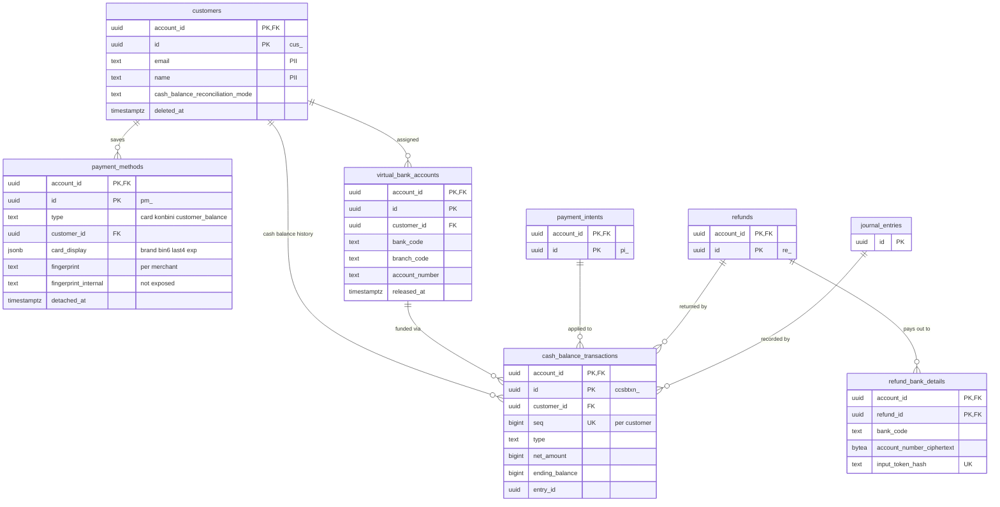

# Data model: 決済手段

Customer、PaymentMethod、銀行振込の振込先（バーチャル口座）と現金残高の取引、コンビニ払い・銀行振込の返金先の口座。振る舞いは [payment-methods.md](../payment-methods.md)、銀行振込とコンビニ払いは [ADR-0013](../../decisions/0013-japan-async-payment-methods.md)、カード番号の保管は [card-vault.md](card-vault.md) にある。規約は [data-model.md](../data-model.md) の 3 節。

## 1. ER 図

## 2. テーブル

### 2.1 `customers`

加盟店の顧客。定義元：[payment-methods.md](../payment-methods.md) の 2.3・6 節。

| 列 | 型 | NULL | 既定 | 説明 |
| --- | --- | --- | --- | --- |
| `account_id` | `uuid` | NOT NULL | — | |
| `id` | `uuid` | NOT NULL | `uuidv7()` | `cus_` |
| `email` | `text` | NULL | — | PII |
| `name` | `text` | NULL | — | PII |
| `phone` | `text` | NULL | — | PII |
| `address` | `jsonb` | NULL | — | PII |
| `description` | `text` | NULL | — | |
| `cash_balance_reconciliation_mode` | `text` | NOT NULL | `'automatic'` | 銀行振込の充当：`automatic`・`manual` |
| `cash_balance_seq` | `bigint` | NOT NULL | `0` | 最後の `cash_balance_transactions.seq`（行ロックで直列にする） |
| `metadata` | `jsonb` | NOT NULL | `'{}'` | |
| `deleted_at` | `timestamptz` | NULL | — | 論理削除（本家の `deleted: true`） |
| `created_at`・`updated_at` | `timestamptz` | NOT NULL | — | |
| `redacted_at` | `timestamptz` | NULL | — | |

- キー：PK `(account_id, id)`。
- 索引：`(account_id, id DESC) WHERE deleted_at IS NULL` — 一覧。`(account_id, lower(email)) WHERE deleted_at IS NULL` — `email=` の絞り込み。
- 削除：`deleted_at` を入れ、同じトランザクションで個人情報の列を消し、付いている PaymentMethod を外して Vault に `delete_card` を送る（[ADR-0024](../../decisions/0024-data-retention-and-deletion.md)）。現金残高が 0 でない Customer は削除できない（本家と同じ振る舞いに寄せ、400 を返す）。
- 保持：加盟店が消すまで。S1 の量：累計 約 5,000 万行（初期見積もり）。

### 2.2 `payment_methods`

決済手段。カードは Vault のトークンへの参照（`pm_` の値そのもの）と表示用の情報だけを持つ。定義元：[payment-methods.md](../payment-methods.md) の 2 節、[card-vault.md](../card-vault.md) の 3.1 節。

| 列 | 型 | NULL | 既定 | 説明 |
| --- | --- | --- | --- | --- |
| `account_id` | `uuid` | NOT NULL | — | |
| `id` | `uuid` | NOT NULL | `uuidv7()` | `pm_`。本体が採番し、Vault の `vault_cards.payment_method_id` と同じ値 |
| `type` | `text` | NOT NULL | — | `card`・`konbini`・`customer_balance` |
| `customer_id` | `uuid` | NULL | — | 付けた Customer |
| `billing_details` | `jsonb` | NOT NULL | `'{}'` | 氏名、メール、電話、住所。PII |
| `card_display` | `jsonb` | NULL | — | `brand`・`bin6`・`last4`・`exp_month`・`exp_year`・`funding`・`country`・`three_d_secure_usage`。`bin6` は API に出さない（不正検知の `card_bin` だけに使う） |
| `card_checks` | `jsonb` | NULL | — | 最初のオーソリの `cvc_check`・`address_postal_code_check` |
| `fingerprint` | `text` | NULL | — | 加盟店向けの指紋（`HMAC(cde-fp, account_id ‖ PAN)` の切り詰め） |
| `fingerprint_internal` | `text` | NULL | — | 内部向けの指紋（`HMAC(cde-fp, PAN)`）。プラットフォームの不正検知だけが使い、API・Event・ダッシュボードに出さない |
| `attached_at` | `timestamptz` | NULL | — | Customer に付けた時刻 |
| `detached_at` | `timestamptz` | NULL | — | 外した時刻（論理削除） |
| `last_used_at` | `timestamptz` | NULL | — | |
| `metadata` | `jsonb` | NOT NULL | `'{}'` | |
| `created_at`・`updated_at` | `timestamptz` | NOT NULL | — | |
| `redacted_at` | `timestamptz` | NULL | — | |

- キー：PK `(account_id, id)`。FK `(account_id, customer_id)` → `customers`。
- 索引：`(account_id, customer_id, id DESC) WHERE detached_at IS NULL` — Customer の決済手段の一覧。`(account_id, fingerprint)` — 重複したカードの検出。
- CHECK：`type IN (...)`。`type <> 'card' OR (card_display IS NOT NULL AND fingerprint IS NOT NULL AND fingerprint_internal IS NOT NULL)`。`type <> 'customer_balance' OR customer_id IS NOT NULL`。
- **カード番号・CVC・`card_ref` の列を作らない**（スキーマの lint。[data-model.md](../data-model.md) の 3.12 節）。
- 外す・Customer の削除：`detached_at` を入れ、Vault に `delete_card` を送る。付けた・外したことは Vault の `attached` にも送る（[card-vault.md](card-vault.md)）。
- 保持：Vault の行が消えた後も、取引の記録から参照されるので 7 年残す。その後は `billing_details` を除く。
- S1 の量：1 日 約 950 万行（カードの受け取り 550 件/秒のピーク）。累計は数十億行になるので、S2 のシャードの対象にする。

### 2.3 `virtual_bank_accounts`

銀行振込の振込先（Customer ごとに 1 つ）。定義元：[payment-methods.md](../payment-methods.md) の 6.1 節。

| 列 | 型 | NULL | 既定 | 説明 |
| --- | --- | --- | --- | --- |
| `account_id` | `uuid` | NOT NULL | — | |
| `id` | `uuid` | NOT NULL | `uuidv7()` | |
| `customer_id` | `uuid` | NOT NULL | — | |
| `bank_code` | `text` | NOT NULL | — | 金融機関コード（4 桁） |
| `bank_name` | `text` | NOT NULL | — | |
| `branch_code` | `text` | NOT NULL | — | 支店コード（3 桁） |
| `branch_name` | `text` | NOT NULL | — | |
| `account_type` | `text` | NOT NULL | `'futsu'` | `futsu`（普通）・`toza`（当座） |
| `account_number` | `text` | NOT NULL | — | 7 桁。自社の収納用の口座の番号なので暗号化しない |
| `account_holder_name` | `text` | NOT NULL | — | 運営会社の収納用の名義（法務の確認待ち。[intent.md](../../intent.md) の L1） |
| `allocated_at` | `timestamptz` | NOT NULL | — | |
| `released_at` | `timestamptz` | NULL | — | Customer の削除で外した時刻 |
| `reusable_after` | `timestamptz` | NULL | — | `released_at` ＋ 13 か月（仮の値） |

- キー：PK `(account_id, id)`。FK `(account_id, customer_id)` → `customers`。
- 一意：`UNIQUE (bank_code, branch_code, account_number) WHERE released_at IS NULL`（加盟店をまたいだ一意。RLS と関係なく DB が守る）。`UNIQUE (account_id, customer_id) WHERE released_at IS NULL`（Customer に 1 つ）。
- 着金の特定：`SECURITY DEFINER` の `resolve_virtual_account(bank_code, branch_code, account_number)` が `(account_id, customer_id)` を返す。割り当てのない口座への着金は照合の保留に回す（[payouts-and-reconciliation.md](payouts-and-reconciliation.md) の `recon_breaks`）。
- 再割り当て：口座の番号のプールからの割り当ては、`reusable_after` を過ぎた番号だけを候補にする。
- 保持：7 年。S1 の量：数十万行。

### 2.4 `cash_balance_transactions`

顧客の現金残高の取引（追記のみ）。本家の CustomerCashBalanceTransaction に当たる。台帳の `customer_cash_balance` の口座の、Customer ごとの内訳の射影。定義元：[payment-methods.md](../payment-methods.md) の 6.2・6.4 節。

| 列 | 型 | NULL | 既定 | 説明 |
| --- | --- | --- | --- | --- |
| `account_id` | `uuid` | NOT NULL | — | |
| `id` | `uuid` | NOT NULL | `uuidv7()` | `ccsbtxn_` |
| `customer_id` | `uuid` | NOT NULL | — | |
| `seq` | `bigint` | NOT NULL | — | Customer ごとの連番（`customers.cash_balance_seq` を行ロックで進める） |
| `type` | `text` | NOT NULL | — | `funded`・`applied_to_payment`・`unapplied_from_payment`・`refunded_from_payment`・`return_initiated`・`return_canceled` |
| `currency` | `text` | NOT NULL | `'jpy'` | |
| `net_amount` | `bigint` | NOT NULL | — | 現金残高の増減（増えると正） |
| `ending_balance` | `bigint` | NOT NULL | — | この取引の後の残高 |
| `payment_intent_id` | `uuid` | NULL | — | 充当・戻しの対象 |
| `refund_id` | `uuid` | NULL | — | 返金の対象 |
| `virtual_bank_account_id` | `uuid` | NULL | — | 着金した口座（`funded`） |
| `funded` | `jsonb` | NULL | — | 振込人の名義・銀行・支店（`funded`）。PII |
| `entry_id` | `uuid` | NOT NULL | — | 元の仕訳 |
| `created_at` | `timestamptz` | NOT NULL | — | |
| `redacted_at` | `timestamptz` | NULL | — | |

- キー：PK `(account_id, id)`。UK `(account_id, customer_id, seq)`。FK `(account_id, customer_id)` → `customers`。
- 索引：`(account_id, customer_id, seq DESC)` — 一覧と、最新の残高の読み取り（先頭の 1 行）。
- CHECK：`net_amount <> 0`、`ending_balance >= 0`、`type IN (...)`。
- 更新：追記のみ。**Customer の現金残高は最新の行の `ending_balance`**。残高の列を別に持たない（[ADR-0003](../../decisions/0003-double-entry-ledger.md)）。
- 日次の検査：加盟店・通貨ごとに、全 Customer の最新の `ending_balance` の合計 ＝ その加盟店の仕訳の `customer_cash_balance` の口座の行の合計（符号反転）。
- 保持：7 年。S1 の量：1 日 数万行。

### 2.5 `refund_bank_details`

コンビニ払い・銀行振込の返金で、顧客の口座へ振り込むための口座情報（2026-09-28 に定義）。定義元：[payment-methods.md](../payment-methods.md) の 5.3・6.4 節。

| 列 | 型 | NULL | 既定 | 説明 |
| --- | --- | --- | --- | --- |
| `account_id` | `uuid` | NOT NULL | — | |
| `refund_id` | `uuid` | NOT NULL | — | |
| `source` | `text` | NOT NULL | — | `customer_input`（顧客が入力）・`transfer_statement`（銀行振込の明細の振込人） |
| `input_token_hash` | `bytea` | NULL | — | 入力のリンクのトークンの SHA-256 |
| `input_expires_at` | `timestamptz` | NULL | — | 入力の期限（作成から 45 日） |
| `bank_code`・`branch_code` | `text` | NULL | — | 入力の後に入る |
| `account_type` | `text` | NULL | — | `futsu`・`toza` |
| `account_number_ciphertext` | `bytea` | NULL | — | KMS の `bank-accounts` で暗号化。PII |
| `account_number_last4` | `text` | NULL | — | 画面の表示用 |
| `account_holder_name_ciphertext` | `bytea` | NULL | — | カナの名義。PII |
| `collected_at` | `timestamptz` | NULL | — | |
| `returned_count` | `smallint` | NOT NULL | `0` | 組み戻しの回数 |
| `purge_after` | `timestamptz` | NULL | — | 返金の完了から 90 日 |
| `created_at`・`updated_at` | `timestamptz` | NOT NULL | — | |

- キー：PK `(account_id, refund_id)`。UK `(input_token_hash)`。FK `(account_id, refund_id)` → `refunds`。
- 入力のページ（`payments.<domain>`）はトークンで行を引く。RLS の前に要るので `SECURITY DEFINER` の `resolve_refund_input(token_hash)` を使う。
- 組み戻しで入力し直すときは、口座の列を消してトークンを作り直す。
- 保持：`purge_after` で口座の列を消す（[security.md](../security.md) の 13 節）。S1 の量：1 日 数千行。
