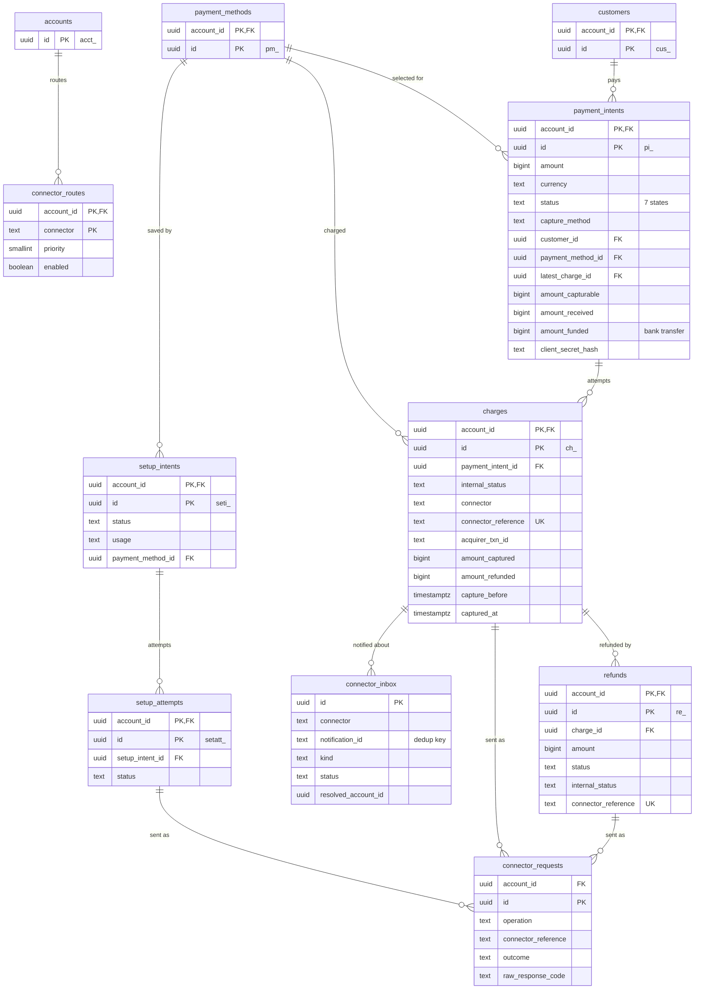

# Data model: 決済

PaymentIntent、Charge（確定の試行）、Refund、SetupIntent、コネクタへの要求の記録、コネクタからの通知の受信箱、コネクタの振り分け。振る舞いは [payments.md](../payments.md)、状態遷移は [ADR-0010](../../decisions/0010-payment-intent-state-machine.md)、結果不明は [ADR-0011](../../decisions/0011-connector-abstraction-and-unknown-outcome.md)、受信箱は [ADR-0014](../../decisions/0014-connector-inbox.md) にある。規約は [data-model.md](../data-model.md) の 3 節。

## 1. ER 図

## 2. テナントをまたぐ処理

決済のテーブルはすべてテナントテーブル。加盟店をまたいで行を探す処理は次の 2 つの方法だけで行う。

| 処理 | 方法 |
| --- | --- |
| 通知から Charge・Refund を特定する（受信箱の反映） | `SECURITY DEFINER` の関数 `resolve_by_connector_ref(connector, connector_reference)`・`resolve_by_acquirer_txn(connector, acquirer_txn_id)` が `(account_id, 種類, id)` だけを返す。その後 `SET LOCAL app.account_id` して読む |
| 期限の掃除（オーソリの失効、3DS の放棄、コンビニの期限切れ、結果不明の照会、残高の不足で保留した返金） | `sweeper` ロール（`BYPASSRLS`、対象の表の `account_id`・`id`・状態・期限の列の `SELECT` だけ）が候補を探し、`(account_id, id)` を SQS に積む。処理は `app` ロールで加盟店ごとに行う |

## 3. テーブル

### 3.1 `payment_intents`

1 回の支払いの意図。定義元：[payments.md](../payments.md) の 2・3 節。

| 列 | 型 | NULL | 既定 | 説明 |
| --- | --- | --- | --- | --- |
| `account_id` | `uuid` | NOT NULL | — | |
| `id` | `uuid` | NOT NULL | `uuidv7()` | `pi_` |
| `amount` | `bigint` | NOT NULL | — | 最小単位 |
| `currency` | `text` | NOT NULL | — | MVP は `jpy` |
| `status` | `text` | NOT NULL | — | `requires_payment_method`・`requires_confirmation`・`requires_action`・`processing`・`requires_capture`・`succeeded`・`canceled` |
| `capture_method` | `text` | NOT NULL | 版で決まる | `automatic`・`automatic_async`・`manual` |
| `confirmation_method` | `text` | NOT NULL | `'automatic'` | MVP は `automatic` だけ |
| `customer_id` | `uuid` | NULL | — | → `customers` |
| `payment_method_id` | `uuid` | NULL | — | → `payment_methods` |
| `payment_method_types` | `text[]` | NOT NULL | — | `card`・`konbini`・`customer_balance` |
| `payment_method_options` | `jsonb` | NOT NULL | `'{}'` | `card.request_three_d_secure`、`konbini.expires_after_days`・`expires_at`・`product_description`・`confirmation_number`、`customer_balance.bank_transfer` |
| `setup_future_usage` | `text` | NULL | — | `on_session`・`off_session` |
| `latest_charge_id` | `uuid` | NULL | — | → `charges`（最新の試行） |
| `amount_capturable` | `bigint` | NOT NULL | `0` | |
| `amount_received` | `bigint` | NOT NULL | `0` | |
| `amount_funded` | `bigint` | NOT NULL | `0` | 銀行振込で現金残高から充てた額。`amount_remaining = amount - amount_funded` |
| `client_secret_hash` | `bytea` | NOT NULL | — | `client_secret` の秘密の部分の SHA-256 |
| `next_action` | `jsonb` | NULL | — | `use_<brand>_sdk`・`redirect_to_url`・`konbini_display_details`・`display_bank_transfer_instructions` |
| `last_payment_error` | `jsonb` | NULL | — | `code`・`decline_code`・`message`・`payment_method` |
| `cancellation_reason` | `text` | NULL | — | 本家の値 |
| `canceled_at` | `timestamptz` | NULL | — | |
| `processing_since` | `timestamptz` | NULL | — | `processing` に入った時刻。24 時間の監視 |
| `description` | `text` | NULL | — | |
| `statement_descriptor` | `text` | NULL | — | |
| `receipt_email` | `text` | NULL | — | PII |
| `shipping` | `jsonb` | NULL | — | 配送先。PII |
| `review_id` | `uuid` | NULL | — | → `reviews`（開いているレビュー） |
| `metadata` | `jsonb` | NOT NULL | `'{}'` | |
| `created_at`・`updated_at` | `timestamptz` | NOT NULL | — | |
| `redacted_at` | `timestamptz` | NULL | — | 個人情報を除いた時刻 |

- キー：PK `(account_id, id)`。FK `(account_id, customer_id)` → `customers`、`(account_id, payment_method_id)` → `payment_methods`、`(account_id, latest_charge_id)` → `charges`（`DEFERRABLE`）。
- 索引：`(account_id, id DESC)` — 一覧。`(account_id, customer_id, id DESC)` — `customer=` の絞り込み。`(processing_since) WHERE status = 'processing'` — 結果不明の監視（`sweeper`）。`(account_id, updated_at) WHERE status = 'requires_action'` — 3DS の放棄とコンビニの期限（`sweeper`）。
- CHECK：`amount > 0`、`amount_received <= amount`、`amount_capturable <= amount`、`amount_funded <= amount`、`status IN (...)`、`capture_method IN (...)`、`status <> 'canceled' OR canceled_at IS NOT NULL`。
- 更新：`status` は遷移関数だけが変える（lint）。`fillfactor = 80`（[capacity.md](../capacity.md) の 3.1 節）。
- 保持：年度の終わりから 7 年。その後は `receipt_email`・`shipping`・`metadata` を除く。
- S1 の量：1 日 約 1,000 万行（作成 600 件/秒のピーク）。年 36 億行。S2 でシャードに分ける。

### 3.2 `charges`

確定 1 回ごとの試行。API では読み取りだけ（`latest_charge`）。定義元：[payments.md](../payments.md) の 2・5・7 節。

| 列 | 型 | NULL | 既定 | 説明 |
| --- | --- | --- | --- | --- |
| `account_id` | `uuid` | NOT NULL | — | |
| `id` | `uuid` | NOT NULL | `uuidv7()` | `ch_` |
| `payment_intent_id` | `uuid` | NOT NULL | — | |
| `payment_method_id` | `uuid` | NOT NULL | — | |
| `amount` | `bigint` | NOT NULL | — | オーソリを求めた額 |
| `currency` | `text` | NOT NULL | — | |
| `internal_status` | `text` | NOT NULL | `'pending_send'` | `pending_send`・`sent`・`unknown`・`failed_before_send`・`authorized`・`declined`・`reversed`・`captured`・`partially_refunded`・`refunded`（[payments.md](../payments.md) の 7.2 節） |
| `status` | `text` | NOT NULL | `'pending'` | API の値：`pending`・`succeeded`・`failed` |
| `connector` | `text` | NOT NULL | — | 送ったコネクタ |
| `connector_reference` | `text` | NOT NULL | — | 参照番号。Charge の ID から決める |
| `acquirer_txn_id` | `text` | NULL | — | アクワイアラの取引 ID |
| `authorization_code` | `text` | NULL | — | 承認番号 |
| `is_off_session` | `boolean` | NOT NULL | `false` | MIT か |
| `amount_captured` | `bigint` | NOT NULL | `0` | |
| `amount_refunded` | `bigint` | NOT NULL | `0` | `failed`・`canceled` を除く返金の合計 |
| `capture_before` | `timestamptz` | NULL | — | オーソリの有効期限 |
| `captured_at` | `timestamptz` | NULL | — | 1 回だけ設定する |
| `balance_transaction_id` | `uuid` | NULL | — | キャプチャの BT |
| `three_d_secure` | `jsonb` | NULL | — | 結果、流れ（frictionless / challenge）、ECI、版 |
| `payment_method_details` | `jsonb` | NOT NULL | — | 試行の時点の `card_display` と `checks`（`cvc_check` など） |
| `outcome` | `jsonb` | NULL | — | `network_status`・`type`（`authorized`・`issuer_declined`・`blocked`）・`reason`・`risk_level`・`rule` |
| `failure_code`・`decline_code`・`network_decline_code` | `text` | NULL | — | 正規化した拒否コードと生のコード |
| `failure_message` | `text` | NULL | — | |
| `billing_details` | `jsonb` | NULL | — | 試行の時点の写し。PII |
| `client_ip` | `inet` | NULL | — | 顧客の IP（Dispute の証拠）。PII |
| `disputed` | `boolean` | NOT NULL | `false` | |
| `created_at`・`updated_at` | `timestamptz` | NOT NULL | — | |
| `redacted_at` | `timestamptz` | NULL | — | |

- キー：PK `(account_id, id)`。UK `(connector, connector_reference)` — コネクタの層の冪等と通知の特定。FK `(account_id, payment_intent_id)` → `payment_intents`、`(account_id, payment_method_id)` → `payment_methods`。
- 部分一意索引（二重オーソリの防止。[data-model.md](../data-model.md) の 5 節）：
  - `UNIQUE (account_id, payment_intent_id) WHERE internal_status IN ('authorized','captured','partially_refunded','refunded')`
  - `UNIQUE (account_id, payment_intent_id) WHERE internal_status IN ('pending_send','sent','unknown')`
- 索引：`(account_id, payment_intent_id, id DESC)` — PaymentIntent の試行の一覧。`(connector, acquirer_txn_id)` — 通知の特定（`resolve_by_acquirer_txn`）。`(capture_before) WHERE internal_status = 'authorized'` — オーソリの失効（`sweeper`）。`(updated_at) WHERE internal_status = 'unknown'` — 回復のジョブ。
- CHECK：`amount > 0`、`amount_captured <= amount`、`amount_refunded <= amount_captured`、`internal_status IN (...)`。`captured_at` は `NULL` 以外への上書きをトリガーで拒否する。
- 保持：7 年。その後は `billing_details`・`client_ip` を除く。
- S1 の量：1 日 約 1,000 万行（確定＋再試行）。

### 3.3 `refunds`

返金。定義元：[payments.md](../payments.md) の 10 節、[payment-methods.md](../payment-methods.md) の 5.3・6.4 節。

| 列 | 型 | NULL | 既定 | 説明 |
| --- | --- | --- | --- | --- |
| `account_id` | `uuid` | NOT NULL | — | |
| `id` | `uuid` | NOT NULL | `uuidv7()` | `re_` |
| `charge_id` | `uuid` | NOT NULL | — | |
| `payment_intent_id` | `uuid` | NOT NULL | — | |
| `amount` | `bigint` | NOT NULL | — | |
| `currency` | `text` | NOT NULL | — | |
| `status` | `text` | NOT NULL | — | `pending`・`requires_action`・`succeeded`・`failed`・`canceled` |
| `internal_status` | `text` | NOT NULL | — | `awaiting_balance`（残高の不足で保留）・`queued`・`sent`・`unknown`・`accepted`・`rejected`・`transfer_pending`（口座への振込待ち）・`returned`（組み戻し） |
| `destination_type` | `text` | NOT NULL | — | `card`・`bank_account`（コンビニ・銀行振込の口座への振込）・`customer_cash_balance` |
| `reason` | `text` | NULL | — | `duplicate`・`fraudulent`・`requested_by_customer`・`expired_uncaptured_charge` |
| `failure_reason` | `text` | NULL | — | `declined`・`expired_or_canceled_card`・`insufficient_funds`・`lost_or_stolen_card`・`merchant_request`・`charge_for_pending_refund_disputed`・`unknown` |
| `connector` | `text` | NULL | — | 送った先（カードはオーソリのコネクタ、口座は返金用の銀行） |
| `connector_reference` | `text` | NULL | — | 返金の参照番号 |
| `balance_transaction_id` | `uuid` | NULL | — | 作成の BT（仕訳を書いた後） |
| `failure_balance_transaction_id` | `uuid` | NULL | — | 失敗の BT |
| `balance_hold_until` | `timestamptz` | NULL | — | 残高の不足で保留する期限（既定 30 日） |
| `instructions_email` | `text` | NULL | — | 口座情報の入力の依頼先。PII |
| `next_action` | `jsonb` | NULL | — | 口座情報の入力の依頼 |
| `metadata` | `jsonb` | NOT NULL | `'{}'` | |
| `created_at`・`updated_at` | `timestamptz` | NOT NULL | — | |
| `redacted_at` | `timestamptz` | NULL | — | |

- キー：PK `(account_id, id)`。UK `(connector, connector_reference)`（両方が NOT NULL のとき）。FK `(account_id, charge_id)` → `charges`、`(account_id, payment_intent_id)` → `payment_intents`。
- 索引：`(account_id, id DESC)` — 一覧。`(account_id, charge_id)` — 返金の合計。`(account_id, created_at) WHERE internal_status = 'awaiting_balance'` — 残高が増えた後に古い順に確かめ直す。`(updated_at) WHERE status = 'requires_action'` — 45 日の失効（`sweeper`）。
- CHECK：`amount > 0`、`status IN (...)`、`destination_type IN (...)`。
- 返金の合計がキャプチャ済みの額を超えないことは、`charges` の行を `FOR UPDATE` で取ってから `charges.amount_refunded` を加算して守る。
- 保持：7 年。S1 の量：1 日 約 45 万行。

### 3.4 `setup_intents`

課金せずに決済手段を保存する意図。定義元：[payments.md](../payments.md) の 11 節。

| 列 | 型 | NULL | 既定 | 説明 |
| --- | --- | --- | --- | --- |
| `account_id` | `uuid` | NOT NULL | — | |
| `id` | `uuid` | NOT NULL | `uuidv7()` | `seti_` |
| `status` | `text` | NOT NULL | — | `requires_payment_method`・`requires_confirmation`・`requires_action`・`processing`・`succeeded`・`canceled` |
| `usage` | `text` | NOT NULL | `'off_session'` | `off_session`・`on_session` |
| `customer_id` | `uuid` | NULL | — | |
| `payment_method_id` | `uuid` | NULL | — | |
| `payment_method_types` | `text[]` | NOT NULL | `'{card}'` | MVP は `card` だけ |
| `latest_attempt_id` | `uuid` | NULL | — | → `setup_attempts` |
| `client_secret_hash` | `bytea` | NOT NULL | — | |
| `next_action` | `jsonb` | NULL | — | |
| `last_setup_error` | `jsonb` | NULL | — | |
| `cancellation_reason` | `text` | NULL | — | `abandoned`・`requested_by_customer`・`duplicate` |
| `description` | `text` | NULL | — | |
| `metadata` | `jsonb` | NOT NULL | `'{}'` | |
| `created_at`・`updated_at` | `timestamptz` | NOT NULL | — | |

- キー：PK `(account_id, id)`。FK は `payment_intents` と同じ形。
- 索引：`(account_id, id DESC)`、`(account_id, customer_id, id DESC)`。
- 保持：7 年。S1 の量：1 日 約 10 万行。

### 3.5 `setup_attempts`

SetupIntent の確定 1 回ごとの試行。

| 列 | 型 | NULL | 既定 | 説明 |
| --- | --- | --- | --- | --- |
| `account_id` | `uuid` | NOT NULL | — | |
| `id` | `uuid` | NOT NULL | `uuidv7()` | `setatt_` |
| `setup_intent_id` | `uuid` | NOT NULL | — | |
| `payment_method_id` | `uuid` | NOT NULL | — | |
| `status` | `text` | NOT NULL | — | `requires_confirmation`・`requires_action`・`processing`・`succeeded`・`failed`・`abandoned` |
| `connector` | `text` | NOT NULL | — | |
| `connector_reference` | `text` | NOT NULL | — | 口座確認の参照番号 |
| `three_d_secure` | `jsonb` | NULL | — | |
| `setup_error` | `jsonb` | NULL | — | |
| `created_at`・`updated_at` | `timestamptz` | NOT NULL | — | |

- キー：PK `(account_id, id)`。UK `(connector, connector_reference)`。FK `(account_id, setup_intent_id)` → `setup_intents`。
- 索引：`(account_id, setup_intent_id, id DESC)`。
- 部分一意：`UNIQUE (account_id, setup_intent_id) WHERE status IN ('processing','requires_action')`（同時に進む試行は 1 つ）。
- 保持：7 年。S1 の量：1 日 約 10 万行。
- MIT のためのネットワークの取引 ID は本体に持たない。CDE の `vault_cards.network_txn_id` に置く（[card-vault.md](card-vault.md)）。

### 3.6 `connector_requests`

コネクタへの要求と応答の記録（追記のみ）。結果不明の調査と照合に使う。カード番号を含めない。定義元：[payments.md](../payments.md) の 7.2 節。

| 列 | 型 | NULL | 既定 | 説明 |
| --- | --- | --- | --- | --- |
| `account_id` | `uuid` | NOT NULL | — | |
| `id` | `uuid` | NOT NULL | `uuidv7()` | |
| `charge_id`・`refund_id`・`setup_attempt_id`・`dispute_id`・`payment_intent_id` | `uuid` | NULL | — | 対象（どれか 1 つ以上） |
| `operation` | `text` | NOT NULL | — | `authorize`・`capture`・`void`・`refund`・`inquire`・`verify`・`authenticate_start`・`authenticate_result`・`issue_voucher`・`cancel_voucher`・`allocate_virtual_account`・`payout_refund`・`submit_evidence` |
| `connector` | `text` | NOT NULL | — | |
| `connector_reference` | `text` | NOT NULL | — | |
| `attempt` | `smallint` | NOT NULL | `1` | 同じ参照番号の何回目か |
| `sent_at` | `timestamptz` | NULL | — | 送信を始めた時刻（送る前の失敗は NULL） |
| `responded_at` | `timestamptz` | NULL | — | |
| `outcome` | `text` | NOT NULL | — | `approved`・`declined`・`failed_before_send`・`unknown`・`found`・`not_found`・`unavailable`・`accepted`・`rejected` |
| `raw_response_code` | `text` | NULL | — | コネクタの生のコード |
| `normalized_code` | `text` | NULL | — | 本家に寄せたコード |
| `error_kind` | `text` | NULL | — | `timeout`・`connection_reset`・`http_5xx`・`parse_error`・`breaker_open` など |
| `duration_ms` | `integer` | NULL | — | |
| `created_at` | `timestamptz` | NOT NULL | — | |

- キー：PK `(account_id, id, created_at)`（パーティションの鍵を含める）。
- 索引：`(connector, connector_reference, created_at)` — 参照番号での調査。`(account_id, charge_id, created_at)` — 試行ごとの履歴。
- CHECK：`num_nonnulls(charge_id, refund_id, setup_attempt_id, dispute_id, payment_intent_id) >= 1`。
- 更新：追記のみ（`app` に `UPDATE`・`DELETE` を与えない）。
- パーティション：`created_at` の月。13 か月を DB に置き、その後 S3 の Parquet に移して 7 年まで残す。
- S1 の量：1 日 約 1,200 万行。

### 3.7 `connector_inbox`

コネクタからの通知の受信箱（RLS の例外）。定義元：[ADR-0014](../../decisions/0014-connector-inbox.md)。

| 列 | 型 | NULL | 既定 | 説明 |
| --- | --- | --- | --- | --- |
| `id` | `uuid` | NOT NULL | `uuidv7()` | |
| `connector` | `text` | NOT NULL | — | 決済代行・収納代行・銀行の識別子 |
| `notification_id` | `text` | NOT NULL | — | 通知の ID。ないコネクタは本文の SHA-256 |
| `kind` | `text` | NOT NULL | — | `authorization`・`capture`・`refund`・`three_ds`・`konbini_paid`・`konbini_confirmed`・`konbini_paid_canceled`・`konbini_expired`・`bank_transfer_credit`・`refund_transfer`・`dispute`・`early_fraud_warning` |
| `received_via` | `text` | NOT NULL | — | `webhook`・`file`・`sqs`（CDE の `connector-results`）・`inquiry` |
| `payload` | `jsonb` | NOT NULL | — | 正規化の前の通知（カード番号を除いたもの） |
| `source_s3_key` | `text` | NULL | — | ファイルで届いたときの原本 |
| `status` | `text` | NOT NULL | `'pending'` | `pending`・`held_out_of_order`・`held_unmatched`・`applied`・`ignored`・`escalated` |
| `attempts` | `smallint` | NOT NULL | `0` | 反映の試行の回数 |
| `next_attempt_at` | `timestamptz` | NULL | — | 保留の再試行 |
| `resolved_account_id` | `uuid` | NULL | — | 特定した加盟店 |
| `target_type`・`target_id` | `text`・`uuid` | NULL | — | 反映先（`charge`・`refund`・`dispute`・`customer` など） |
| `applied_at` | `timestamptz` | NULL | — | |
| `last_error` | `text` | NULL | — | |
| `received_at` | `timestamptz` | NOT NULL | — | ID の時刻 |

- キー：PK `(id, received_at)`。**重複の除去**：`(connector, notification_id)` の一意はパーティションをまたいで張れないので、受信口が `pg_advisory_xact_lock(hashtextextended(connector || ':' || notification_id, 0))` を取り、直近 2 か月のパーティションに同じ組がないことを確かめてから挿入する。パーティションの中では `UNIQUE (connector, notification_id, received_at)`。
- 環境（ADR-0014 の `livemode`）はクラスタで分かれる（[data-model.md](../data-model.md) の 3.4 節）。
- 索引：`(connector, notification_id)` — 重複の確認。`(status, next_attempt_at) WHERE status IN ('pending','held_out_of_order','held_unmatched')` — 反映と保留のワーカー、24 時間の監視。
- テナント・RLS：例外。書けるのは受信口と反映のワーカーだけ。
- パーティション：`received_at` の月。13 か月で `DROP`。
- S1 の量：1 日 約 300 万行（3DS の結果、コンビニ・銀行振込、Dispute、非同期のキャプチャ・返金の結果）。

### 3.8 `connector_routes`

加盟店ごとの使えるコネクタと優先順。定義元：[payments.md](../payments.md) の 8.2 節。コネクタの能力はコードの表に持ち、DB に置かない。

| 列 | 型 | NULL | 既定 | 説明 |
| --- | --- | --- | --- | --- |
| `account_id` | `uuid` | NOT NULL | — | |
| `connector` | `text` | NOT NULL | — | |
| `payment_method_type` | `text` | NOT NULL | — | `card`・`konbini`・`customer_balance` |
| `priority` | `smallint` | NOT NULL | — | 小さいほど先 |
| `enabled` | `boolean` | NOT NULL | `true` | |
| `merchant_ref` | `text` | NULL | — | コネクタの側の加盟店の番号（アクワイアラの登録の結果） |
| `updated_at` | `timestamptz` | NOT NULL | — | |

- キー：PK `(account_id, payment_method_type, connector)`。UK `(account_id, payment_method_type, priority)`。
- 変更は Ops と審査の処理だけが行い、`platform_audit_events` に残す。S1 の量：約 3 万行。
