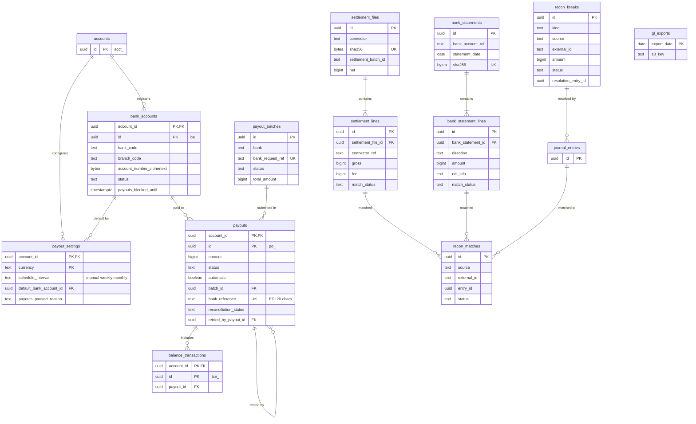

# Data model: 入金と照合

入金のスケジュール、入金先の口座、Payout、銀行への依頼のバッチ、決済代行の精算ファイル、銀行の明細、照合の結果とブレイク、会計への出力。振る舞いは [payouts-and-reconciliation.md](../payouts-and-reconciliation.md)、入金の実行は [ADR-0018](../../decisions/0018-payout-execution-via-banking-partner.md)、照合は [ADR-0017](../../decisions/0017-three-way-reconciliation-with-suspense.md) にある。規約は [data-model.md](../data-model.md) の 3 節。

- **テナントテーブル**：`payout_settings`、`bank_accounts`、`payouts`。
- **プラットフォームのテーブル（RLS の例外）**：`payout_batches`、`settlement_files`、`settlement_lines`、`bank_statements`、`bank_statement_lines`、`recon_matches`、`recon_breaks`、`gl_exports`。複数の加盟店にまたがるので `account_id` を持たないか、NULL を許す。読み書きは `recon`（`payout_batches` は `payout` も）だけ（[data-model.md](../data-model.md) の 3.3 節）。

> 法務の確認待ち（[intent.md](../../intent.md) の L1）：口座の名義・用途、預かり金の分別管理は、確認の結果で列が増えうる。

## 1. ER 図

## 2. テーブル

### 2.1 `payout_settings`

入金のスケジュール。定義元：[payouts-and-reconciliation.md](../payouts-and-reconciliation.md) の 2 節。

| 列 | 型 | NULL | 既定 | 説明 |
| --- | --- | --- | --- | --- |
| `account_id` | `uuid` | NOT NULL | — | |
| `currency` | `text` | NOT NULL | `'jpy'` | |
| `schedule_interval` | `text` | NOT NULL | `'manual'` | `manual`・`weekly`・`monthly`（日次は持たない） |
| `weekly_anchor` | `text` | NULL | — | `monday`〜`friday` |
| `monthly_anchor` | `smallint` | NULL | — | 1〜31 |
| `settlement_delay_days` | `smallint` | NOT NULL | `4` | 営業日。初回の入金までは 7 暦日（`first_payout_completed_at` で判定） |
| `first_payout_completed_at` | `timestamptz` | NULL | — | |
| `default_bank_account_id` | `uuid` | NULL | — | |
| `minimum_amount` | `bigint` | NOT NULL | `1` | 最低入金額（本家の日本は 1 円） |
| `payouts_paused_reason` | `text` | NULL | — | `bank_account_invalid`・`negative_balance`・`risk_hold`・`bank_account_changed` |
| `updated_at` | `timestamptz` | NOT NULL | — | |

- キー：PK `(account_id, currency)`。FK `(account_id, default_bank_account_id)` → `bank_accounts`。
- CHECK：`schedule_interval <> 'weekly' OR weekly_anchor IS NOT NULL`、`schedule_interval <> 'monthly' OR monthly_anchor BETWEEN 1 AND 31`。
- 索引：`(schedule_interval, weekly_anchor, monthly_anchor) WHERE payouts_paused_reason IS NULL` — その日が支払日の加盟店を選ぶ（`sweeper`）。
- 変更は重要な操作（再認証、監査。[auth-and-keys.md](../auth-and-keys.md) の 3.4 節）。S1 の量：1 万行。

### 2.2 `bank_accounts`

加盟店の入金先の口座。定義元：[payouts-and-reconciliation.md](../payouts-and-reconciliation.md) の 2・8 節、[merchant-onboarding.md](../merchant-onboarding.md) の 5 節。

| 列 | 型 | NULL | 既定 | 説明 |
| --- | --- | --- | --- | --- |
| `account_id` | `uuid` | NOT NULL | — | |
| `id` | `uuid` | NOT NULL | `uuidv7()` | `ba_` |
| `currency` | `text` | NOT NULL | `'jpy'` | |
| `bank_code`・`bank_name` | `text` | NOT NULL | — | |
| `branch_code`・`branch_name` | `text` | NOT NULL | — | |
| `account_type` | `text` | NOT NULL | — | `futsu`・`toza` |
| `account_number_ciphertext` | `bytea` | NOT NULL | — | KMS の `bank-accounts` で暗号化 |
| `account_number_last4` | `text` | NOT NULL | — | 表示用 |
| `account_number_hmac` | `bytea` | NOT NULL | — | 同じ口座の検出（加盟店をまたぐ不正の監視） |
| `account_holder_name_ciphertext` | `bytea` | NOT NULL | — | 全銀の使用文字に正規化したカナの名義。個人事業主は PII |
| `status` | `text` | NOT NULL | `'new'` | `new`・`verified`（名義を照合済み）・`verification_failed`・`errored`（振込の失敗で使えない） |
| `name_verified_at` | `timestamptz` | NULL | — | |
| `payouts_blocked_until` | `timestamptz` | NULL | — | 追加・変更から 3 日は入金しない |
| `deleted_at` | `timestamptz` | NULL | — | |
| `created_at`・`updated_at` | `timestamptz` | NOT NULL | — | |

- キー：PK `(account_id, id)`。
- 索引：`(account_id) WHERE deleted_at IS NULL`、`(account_number_hmac)` — 同じ口座を登録した別の加盟店の検出（`recon` のロールの監視だけ）。
- CHECK：`account_type IN ('futsu','toza')`、`bank_code ~ '^[0-9]{4}$'`、`branch_code ~ '^[0-9]{3}$'`。
- 保持：取引の終了から 7 年（入金の記録の相手先）。S1 の量：約 1.2 万行。

### 2.3 `payouts`

加盟店への入金。定義元：[payouts-and-reconciliation.md](../payouts-and-reconciliation.md) の 3・4 節。

| 列 | 型 | NULL | 既定 | 説明 |
| --- | --- | --- | --- | --- |
| `account_id` | `uuid` | NOT NULL | — | |
| `id` | `uuid` | NOT NULL | `uuidv7()` | `po_` |
| `amount` | `bigint` | NOT NULL | — | |
| `currency` | `text` | NOT NULL | — | |
| `status` | `text` | NOT NULL | `'pending'` | `pending`・`in_transit`・`paid`・`failed`・`canceled` |
| `automatic` | `boolean` | NOT NULL | — | 自動入金か |
| `method` | `text` | NOT NULL | `'standard'` | 即時入金は範囲外 |
| `bank_account_id` | `uuid` | NOT NULL | — | |
| `batch_id` | `uuid` | NULL | — | → `payout_batches`（締めで設定） |
| `bank_reference` | `text` | NOT NULL | — | 全銀の EDI 情報に載せる 20 文字以内の ID |
| `arrival_on` | `date` | NULL | — | 着金の見込み日（API の `arrival_date`） |
| `statement_descriptor` | `text` | NULL | — | 振込の依頼人名 |
| `description` | `text` | NULL | — | |
| `reconciliation_status` | `text` | NOT NULL | — | `completed`（自動）・`not_applicable`（手動） |
| `create_entry_id` | `uuid` | NOT NULL | — | 作成の仕訳 |
| `balance_transaction_id` | `uuid` | NOT NULL | — | `payout` の BT |
| `failure_code`・`failure_message` | `text` | NULL | — | `account_closed`・`no_account`・`invalid_account_number`・`incorrect_account_holder_name`・`incorrect_account_type` など |
| `failure_balance_transaction_id` | `uuid` | NULL | — | |
| `retried_by_payout_id` | `uuid` | NULL | — | 失敗した自動入金の BT を含め直した入金 |
| `paid_at`・`failed_at`・`canceled_at` | `timestamptz` | NULL | — | |
| `metadata` | `jsonb` | NOT NULL | `'{}'` | |
| `created_at`・`updated_at` | `timestamptz` | NOT NULL | — | |

- キー：PK `(account_id, id)`。UK `(bank_reference)`（銀行の明細から入金を特定する）。FK `(account_id, bank_account_id)` → `bank_accounts`、`batch_id` → `payout_batches(id)`、`(account_id, retried_by_payout_id)` → `payouts`。
- 索引：`(account_id, id DESC)` — 一覧。`(status, created_at) WHERE status = 'pending' AND batch_id IS NULL` — 締め（`payout`）。`(arrival_on) WHERE status = 'in_transit'` — 予定の着金日を 2 営業日過ぎた入金のアラート。`(batch_id)`。
- CHECK：`amount > 0`、`status IN (...)`、`automatic = (reconciliation_status = 'completed')`、`length(bank_reference) <= 20`。
- 自動入金の冪等キーは `payout:auto:{account_id}:{currency}:{date}`（[stores.md](stores.md) の 5 節）。
- 保持：7 年。S1 の量：1 日 数千行（週次・月次・手動）。

### 2.4 `payout_batches`

銀行への振込の依頼の単位（プラットフォーム）。定義元：[payouts-and-reconciliation.md](../payouts-and-reconciliation.md) の 4.2 節。

| 列 | 型 | NULL | 既定 | 説明 |
| --- | --- | --- | --- | --- |
| `id` | `uuid` | NOT NULL | `uuidv7()` | |
| `bank` | `text` | NOT NULL | — | 提携銀行 |
| `source_account_ref` | `text` | NOT NULL | — | 払出口座（台帳の `bank_cash:{sub_key}` と同じ値） |
| `method` | `text` | NOT NULL | — | `api`・`zengin_file` |
| `bank_request_ref` | `text` | NOT NULL | — | 依頼の前に採番する。再送で同じ値 |
| `status` | `text` | NOT NULL | `'open'` | `open`・`submitted`・`accepted`・`completed`・`unknown`・`rejected` |
| `payout_count` | `integer` | NOT NULL | — | |
| `total_amount` | `bigint` | NOT NULL | — | |
| `currency` | `text` | NOT NULL | `'jpy'` | |
| `cutoff_at` | `timestamptz` | NOT NULL | — | 締めの時刻 |
| `zengin_file_s3_key` | `text` | NULL | — | 予備の手段のファイル |
| `submitted_at`・`accepted_at`・`completed_at` | `timestamptz` | NULL | — | |
| `created_at` | `timestamptz` | NOT NULL | — | |

- キー：PK `(id)`。UK `(bank, bank_request_ref)`。
- 索引：`(status, submitted_at) WHERE status IN ('submitted','unknown')` — 結果照会。
- 結果が `unknown` のときは再依頼せず照会する（ADR-0018）。S1 の量：1 日 数件〜数十件。

### 2.5 `settlement_files`

決済代行・収納代行の精算ファイル（原本は S3、Object Lock）。定義元：[payouts-and-reconciliation.md](../payouts-and-reconciliation.md) の 5.2 節。

| 列 | 型 | NULL | 既定 | 説明 |
| --- | --- | --- | --- | --- |
| `id` | `uuid` | NOT NULL | `uuidv7()` | |
| `connector` | `text` | NOT NULL | — | |
| `received_via` | `text` | NOT NULL | — | `sftp`・`api` |
| `filename` | `text` | NOT NULL | — | |
| `s3_key` | `text` | NOT NULL | — | |
| `sha256` | `bytea` | NOT NULL | — | 同じファイルの 2 回目の取り込みを無視する |
| `settlement_batch_id` | `text` | NOT NULL | — | 決済代行の精算のバッチの番号 |
| `period_start`・`period_end` | `date` | NOT NULL | — | |
| `value_date` | `date` | NOT NULL | — | 入金予定日 |
| `gross`・`fee`・`net` | `bigint` | NOT NULL | — | ファイルの合計 |
| `currency` | `text` | NOT NULL | — | |
| `line_count` | `integer` | NOT NULL | — | |
| `status` | `text` | NOT NULL | `'imported'` | `imported`・`matching`・`matched`・`has_breaks` |
| `imported_at` | `timestamptz` | NOT NULL | — | |

- キー：PK `(id)`。UK `(sha256)`、`(connector, settlement_batch_id)`。
- 保持：行は 10 年。原本は S3 に 10 年（[infrastructure.md](../infrastructure.md) の 5 節）。S1 の量：1 日 数件。

### 2.6 `settlement_lines`

精算ファイルの明細（共通の形）。

| 列 | 型 | NULL | 既定 | 説明 |
| --- | --- | --- | --- | --- |
| `id` | `uuid` | NOT NULL | `uuidv7()` | |
| `settlement_file_id` | `uuid` | NOT NULL | — | |
| `line_no` | `integer` | NOT NULL | — | ファイルの中の行番号 |
| `connector` | `text` | NOT NULL | — | |
| `settlement_batch_id` | `text` | NOT NULL | — | |
| `connector_ref` | `text` | NULL | — | 参照番号（`charges`・`refunds` の `connector_reference`） |
| `line_type` | `text` | NOT NULL | — | `charge`・`refund`・`dispute`・`dispute_reversal`・`fee`・`adjustment`・`konbini_payment` |
| `gross`・`fee`・`net` | `bigint` | NOT NULL | — | |
| `currency` | `text` | NOT NULL | — | |
| `transaction_date`・`value_date` | `date` | NOT NULL | — | |
| `raw` | `jsonb` | NOT NULL | — | 元の行（カード番号は含まない。含む形式なら CDE の中で除いてから渡す） |
| `match_status` | `text` | NOT NULL | `'unmatched'` | `unmatched`・`matched`・`within_tolerance`・`break` |
| `created_at` | `timestamptz` | NOT NULL | — | |

- キー：PK `(id, created_at)`。UK `(settlement_file_id, line_no, created_at)`。`created_at` はファイルの `imported_at` と同じ値にする（ID の時刻ではない。[data-model.md](../data-model.md) の 3.1 節の例外）。1 つのファイルの行が同じパーティションに入り、UK がファイル全体で効く。
- 索引：`(connector, connector_ref)` — 台帳の行との対応。`(match_status) WHERE match_status IN ('unmatched','break')`。
- パーティション：`created_at` の月。13 か月を DB に置き、その後 `DROP`（原本は S3 に 10 年）。
- S1 の量：1 日 約 1,000 万行（1 ファイル 数百万行。[capacity.md](../capacity.md) の 2 節）。

### 2.7 `bank_statements`

銀行の入出金明細（1 口座 × 1 回の取り込み）。定義元：[payouts-and-reconciliation.md](../payouts-and-reconciliation.md) の 5.2 節。

| 列 | 型 | NULL | 既定 | 説明 |
| --- | --- | --- | --- | --- |
| `id` | `uuid` | NOT NULL | `uuidv7()` | |
| `bank` | `text` | NOT NULL | — | |
| `bank_account_ref` | `text` | NOT NULL | — | 自社の口座（台帳の `bank_cash:{sub_key}`） |
| `source` | `text` | NOT NULL | — | `api`・`zengin_file` |
| `statement_date` | `date` | NOT NULL | — | |
| `sequence` | `smallint` | NOT NULL | — | 同じ日の何回目の取り込みか |
| `s3_key` | `text` | NOT NULL | — | 原本 |
| `sha256` | `bytea` | NOT NULL | — | |
| `opening_balance`・`closing_balance` | `bigint` | NOT NULL | — | 銀行の残高（台帳の `bank_cash` と日次で突き合わせる） |
| `currency` | `text` | NOT NULL | `'jpy'` | |
| `imported_at` | `timestamptz` | NOT NULL | — | |

- キー：PK `(id)`。UK `(sha256)`、`(bank_account_ref, statement_date, sequence)`。S1 の量：1 日 数十行。

### 2.8 `bank_statement_lines`

明細の行。精算の着金、顧客の銀行振込、入金の出金と返却を含む。

| 列 | 型 | NULL | 既定 | 説明 |
| --- | --- | --- | --- | --- |
| `id` | `uuid` | NOT NULL | `uuidv7()` | |
| `bank_statement_id` | `uuid` | NOT NULL | — | |
| `bank` | `text` | NOT NULL | — | |
| `bank_account_ref` | `text` | NOT NULL | — | 入金のあった口座（振込専用口座なら、その番号） |
| `bank_txn_ref` | `text` | NOT NULL | — | 銀行の取引の番号（ないときは内容のハッシュ） |
| `direction` | `text` | NOT NULL | — | `credit`・`debit` |
| `amount` | `bigint` | NOT NULL | — | 正の値 |
| `value_date` | `date` | NOT NULL | — | |
| `remitter_code` | `text` | NULL | — | 振込依頼人コード |
| `remitter_name` | `text` | NULL | — | 振込依頼人名。顧客の銀行振込では PII |
| `edi_info` | `text` | NULL | — | EDI 情報（入金の `bank_reference`） |
| `raw` | `jsonb` | NOT NULL | — | |
| `match_status` | `text` | NOT NULL | `'unmatched'` | `unmatched`・`matched`・`suspense`・`break` |
| `matched_kind` | `text` | NULL | — | `settlement`・`customer_transfer`・`payout`・`payout_return`・`refund_transfer` |
| `created_at` | `timestamptz` | NOT NULL | — | |
| `redacted_at` | `timestamptz` | NULL | — | |

- キー：PK `(id, created_at)`。重複の除去は `(bank, bank_txn_ref)` で、受信箱と同じく advisory lock と直近 2 か月のパーティションの確認で行う（[payments.md](payments.md) の 3.7 節）。
- 索引：`(bank, bank_txn_ref)`、`(edi_info) WHERE edi_info IS NOT NULL` — 入金の特定、`(match_status) WHERE match_status <> 'matched'`。
- パーティション：`created_at` の月。13 か月を DB に置き、原本は S3 に 10 年。
- 保持：顧客の銀行振込の `remitter_name` は 7 年で除く。S1 の量：1 日 数万行。

### 2.9 `recon_matches`

照合の結果（外部の記録 × 台帳の仕訳）。定義元：[payouts-and-reconciliation.md](../payouts-and-reconciliation.md) の 5.3 節。

| 列 | 型 | NULL | 既定 | 説明 |
| --- | --- | --- | --- | --- |
| `id` | `uuid` | NOT NULL | `uuidv7()` | |
| `source` | `text` | NOT NULL | — | `settlement_line`・`bank_statement_line`・`payout_batch` |
| `external_id` | `uuid` | NOT NULL | — | 外部の記録の行の ID |
| `account_id` | `uuid` | NULL | — | 対応した加盟店（精算の着金など加盟店をまたぐものは NULL） |
| `target_type` | `text` | NOT NULL | — | `charge`・`refund`・`dispute`・`payout`・`settlement_file`・`customer`・`journal_entry` |
| `target_id` | `uuid` | NOT NULL | — | |
| `entry_id` | `uuid` | NULL | — | 照合で書いた仕訳（着金、差額の計上） |
| `status` | `text` | NOT NULL | — | `matched`・`within_tolerance` |
| `diff_amount` | `bigint` | NOT NULL | `0` | 許容の範囲の差（`processing_cost` に計上した額） |
| `created_at` | `timestamptz` | NOT NULL | — | |

- キー：PK `(id)`。UK `(source, external_id, target_type, target_id)` — 照合の再実行で同じ結果にする（仕訳の冪等キー `recon:{source}:{external_id}` と対）。
- 索引：`(target_type, target_id)` — 決済からの照合の状態の確認。
- 保持：10 年（13 か月より古いものは S3 に移す）。S1 の量：1 日 約 1,000 万行。

### 2.10 `recon_breaks`

説明のつかない差（ブレイク）。定義元：[payouts-and-reconciliation.md](../payouts-and-reconciliation.md) の 5.4 節。

| 列 | 型 | NULL | 既定 | 説明 |
| --- | --- | --- | --- | --- |
| `id` | `uuid` | NOT NULL | `uuidv7()` | |
| `kind` | `text` | NOT NULL | — | `amount_mismatch`・`missing_in_ledger`・`missing_in_file`・`unidentified_credit`・`unmatched_payout_return`・`konbini_paid_canceled` |
| `source` | `text` | NOT NULL | — | |
| `external_id` | `uuid` | NULL | — | |
| `account_id` | `uuid` | NULL | — | 分かれば加盟店 |
| `amount` | `bigint` | NOT NULL | — | |
| `currency` | `text` | NOT NULL | — | |
| `detected_at` | `timestamptz` | NOT NULL | — | |
| `due_at` | `timestamptz` | NOT NULL | — | 検知から T+2 営業日 |
| `age_business_days` | `smallint` | NOT NULL | `0` | 日次のジョブが更新する |
| `status` | `text` | NOT NULL | `'open'` | `open`・`investigating`・`resolved`・`written_off` |
| `owner` | `text` | NULL | — | 担当者 |
| `suspense_entry_id` | `uuid` | NULL | — | 仮勘定への計上の仕訳 |
| `resolution` | `text` | NULL | — | |
| `resolution_entry_id` | `uuid` | NULL | — | 解消・償却の仕訳 |
| `approvals` | `jsonb` | NOT NULL | `'[]'` | 加盟店の残高を動かす解消と償却の 2 人の承認（担当者と承認者、時刻） |
| `resolved_at` | `timestamptz` | NULL | — | |

- キー：PK `(id)`。UK `(source, external_id, kind) NULLS NOT DISTINCT`。
- 索引：`(status, due_at) WHERE status IN ('open','investigating')` — 期限のアラートと一覧。
- CHECK：`status NOT IN ('resolved','written_off') OR resolution_entry_id IS NOT NULL OR amount = 0`。`status <> 'written_off' OR jsonb_array_length(approvals) >= 2`。
- 保持：10 年。S1 の量：1 日 0〜数十行（目標は T+2 で 0 件）。

### 2.11 `gl_exports`

会計への出力（日次の仕訳の CSV）。定義元：[payouts-and-reconciliation.md](../payouts-and-reconciliation.md) の 7 節。

| 列 | 型 | NULL | 既定 | 説明 |
| --- | --- | --- | --- | --- |
| `export_date` | `date` | NOT NULL | — | 対象の日（JST） |
| `s3_key` | `text` | NOT NULL | — | |
| `sha256` | `bytea` | NOT NULL | — | |
| `entry_created_from`・`entry_created_to` | `timestamptz` | NOT NULL | — | 仕訳の範囲（`created_at`。UUIDv7 なので ID の範囲と同じ） |
| `row_count` | `integer` | NOT NULL | — | |
| `status` | `text` | NOT NULL | — | `generated`・`delivered`・`superseded` |
| `created_at` | `timestamptz` | NOT NULL | — | |

- キー：PK `(export_date)`。作り直すときは古い行を `superseded` にして S3 のキーを変える（締めた月は作り直さない）。
- 保持：10 年。S1 の量：1 日 1 行。
