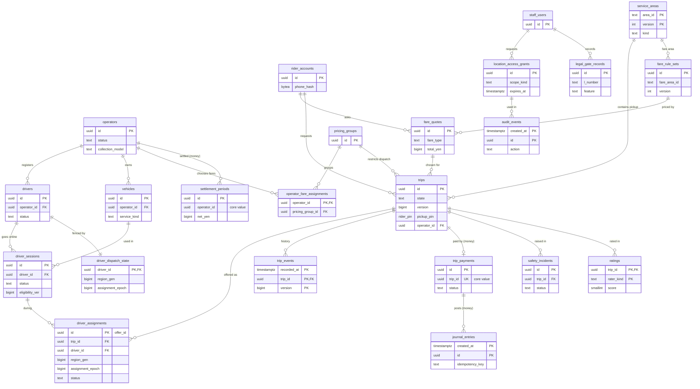

# Data model: Uber

データモデルの正本。規約、置き場所、全体の ER 図、横断の不変条件、位置を持つ置き場所の一覧をここに置き、領域ごとのテーブルの定義を [data-model/](data-model/) に置く。

- **列・制約・索引・保持の正本は、このファイルと `data-model/` の各ファイル** である。領域の文書（[trips-lifecycle.md](trips-lifecycle.md) など）は振る舞いの正本で、表は要点と提案だけを書く。両者が食い違ったら、このデータモデルに合わせて領域の文書を直す（直した箇所は 8 節）。
- 保持の期間の値の正本は [security.md](security.md) の 7.2 節（Terraform・削除のジョブの値をそこから生成する。[ADR-0036](../decisions/0036-location-privacy-keys-retention-and-audited-access.md)）。この文書の各表の「保持」は、その値を表ごとに引いたもの。
- 実装の変更（開発リポジトリの `changes/`）でマイグレーションを書くときは、同じ PR でここを更新する。
- 方針の元は [ADR-0003](../decisions/0003-trip-state-and-single-assignment.md)・[ADR-0021](../decisions/0021-trip-transition-function-and-assignment-fencing.md)（乗車と割り当て）、[ADR-0002](../decisions/0002-hex-grid-geospatial-model.md)（格子）、[ADR-0022](../decisions/0022-trip-outbox-and-offline-continuation.md)（outbox）、[ADR-0025](../decisions/0025-ledger-settlement-and-reconciliation.md)（台帳）、[ADR-0036](../decisions/0036-location-privacy-keys-retention-and-audited-access.md)（位置と鍵と保持）、[ADR-0038](../decisions/0038-compute-on-fargate-and-data-stores.md)（ストア）、[ADR-0039](../decisions/0039-city-cells-and-osaka-warm-standby.md)（都市のセルと世代）、[ADR-0043](../decisions/0043-flag-taxonomy-legal-gates-and-safety-defaults.md)（法務の関門）。
- 行数の「S1 の量」は、[capacity.md](capacity.md) の 1 節（受け付け 30 件/秒、成立 約 3〜6 件/秒、オンライン 1 万台）からの **初期見積もり** である。E12 の `load-test-suite` で置き換える。

## 1. ファイルの構成

| ファイル | 領域 | テーブルの数 | ER 図 |
| --- | --- | --- | --- |
| [data-model/supply.md](data-model/supply.md) | 事業者・営業所・車両・ドライバー・書類・保険・事業者の利用者、出庫のセッション・点呼・端末の完全性、日本版ライドシェアの運行枠 | 18 | 2 |
| [data-model/trips.md](data-model/trips.md) | 乗車、割り当て（オファー）、区間、遷移の記録、冪等、タイマー、outbox、食い違い、乗降の提供者の内容、ETA、軌跡の索引、ナビ、断った需要、商品と車両 | 15 | 1 |
| [data-model/pricing.md](data-model/pricing.md) | 運賃ブロック、バージョンつきの運賃の規則、事業者の割り当てと価格の群、料金の規則、見積もり、推計走行距離、変動運賃の水準、メーターの額 | 15 | 1 |
| [data-model/payments.md](data-model/payments.md) | 決済の方法、支払いと PSP の操作、Webhook、訂正と返金、未払い、台帳、振込先・締め・振込、照合（Aurora `money`） | 16 | 2 |
| [data-model/maps-and-areas.md](data-model/maps-and-areas.md) | 区域の多角形と格子の写し、乗降の地点、地図の上書きと誤りの候補、保存した場所 | 6 | 1 |
| [data-model/safety-and-communications.md](data-model/safety-and-communications.md) | 共有、緊急の通報と位置、報告、書き出し、顔の照合、評価、拒否の組、PIN、番号の中継、メッセージ、不正 | 15 | 1 |
| [data-model/operations-and-governance.md](data-model/operations-and-governance.md) | 社内の担当とロール、一時の権限（位置・位置以外）、変更の要求、自動の返金の規則、問い合わせ、監査ログ、リーガルホールド、法務の結論の記録 | 11 | 1 |
| [data-model/identity-and-notifications.md](data-model/identity-and-notifications.md) | 乗客のアカウント、セッション、パスキー、招待、プッシュの端末、ワンタイムコード、SMS の記録 | 9 | 1 |
| [data-model/stores.md](data-model/stores.md) | DB 以外：Kinesis の記録、S3 の配置、DynamoDB のリース、Valkey のキー、SNS・SQS、常時の接続の封筒、outbox の事象の本文、AppConfig、端末 | — | — |

合計 105 テーブル（`outbox_events` は `core` と `money` に同じ形で置き、1 つに数えた）。ER 図は領域ごとに 10 個と、下の 4 節の全体図 1 個。

## 2. 置き場所

| 置き場所 | 中身 | 正本か | 定義 |
| --- | --- | --- | --- |
| Aurora PostgreSQL 18 `core`（PostGIS） | 乗車・割り当て・タイマー・outbox、供給、運賃の規則と見積もり、区域と乗降の地点、安全・評価・連絡、認証・通知の端末、監査ログ、法務の記録、社内の運用 | 正本 | 1 節の `data-model/` のうち payments 以外 |
| Aurora PostgreSQL 18 `money` | 支払い、PSP の操作、訂正と返金、台帳、振込先・締め・振込、照合、`money` の outbox | 正本 | [data-model/payments.md](data-model/payments.md) |
| Kinesis Data Streams `loc-<city>` | 検証済みの位置の流れ（24 時間） | 正本ではない（失ってよい流れ） | [data-model/stores.md](data-model/stores.md) の 1 節 |
| DynamoDB `geo_shard_leases`（リージョンごと） | 索引の分割と配車の区域のリース | リースの正本（正しさの前提ではない） | stores の 3 節 |
| S3 | 位置の生の点・軌跡・集計、配車の判断の記録、タイル・OSM・ETA の表、書類・顔の画像、書き出し、明細・照合の原本・台帳の古い分、監査の写し、特徴量（S2） | 種類ごと（stores の 2 節） | stores の 2 節 |
| geo-index のメモリ | オンラインのドライバーの最新の位置と状態（`DriverEntry`） | 正本ではない（35 秒で作り直す） | [geospatial-index.md](geospatial-index.md) の 4 節 |
| Valkey `rt` | 常時の接続の Stream・`seq`・登録表・Pub/Sub | 正本ではない（API の読み直しが正本） | stores の 4.1 節 |
| Valkey `cache` | レート制限、需給の集計、見積もりのキャッシュ、受け入れの上限の数、特徴量（S2） | 正本ではない | stores の 4.2 節 |
| SNS・SQS | outbox の事象の配信、プッシュの要求、安全の通報の受信 | 正本ではない（outbox から作り直せる） | stores の 5 節 |
| AppConfig | フラグ（release・ops・legal）、配車の設定、`client_policy`、`nav_handoff_targets`、`region_gen`、`ops.region.writable`、容量、`ops_policies` | 設定の正本 | stores の 8 節 |
| 開発リポジトリ | `proto/`（契約）、`vectors/trip-app/`・`vectors/eligibility/`、`features/`（S2） | 定義の正本 | stores の 9 節 |
| 端末（SQLite、Keychain・Keystore） | journal、送り直しの位置、最新の乗車の要約、トークン、最後に得た住所 | 正本ではない（復元の材料） | stores の 9 節 |

- **`core` と `money` をまたぐトランザクションを書かない。** つなぐのは outbox の事象だけ。`money` の表は `trip_id`・`rider_id`・`operator_id` を値として持ち、`core` を外部キーで指さない（[ADR-0038](../decisions/0038-compute-on-fargate-and-data-stores.md)）。整合は日次の照合で確かめる。
- Trips と供給は同じ `core` に置く。提案の検査が供給の判定の表を同じトランザクションで読むため。

## 3. 規約

### 3.1 ID

- DB の ID は `uuid` 型の **UUIDv7**（PostgreSQL 18 の `uuidv7()`）。API にも UUID の文字列のまま出す（本家の接頭辞は使わない。リポジトリ共通の [ADR-0006](../../../../docs/decisions/0006-brand-neutral-identifiers.md)）。
- 例外：
  - 読める ID を鍵にする表：`service_areas.area_id`（`<kind>:<slug>`）、`pickup_points.point_id`、`fare_blocks.id`、`city_id`（`tokyo` など）。
  - 順序が要る内部の表：`outbox_events.id`・`trip_timers.id`・`supply_timers.id` は `bigint` の identity。
  - 格子のセル（3.2 節）は `bigint`。
- **外に出す推測されてはいけない値** は、ID と分けて乱数で作り、DB にはハッシュだけを置く：共有のトークン（128 ビット、`token_sha256`）、招待のコード（`code_hash`）、更新トークン（`refresh_token_sha256`）。見積もりの ID は UUIDv7 のままで、乗客の ID と組で確かめる（[pricing-and-fares.md](pricing-and-fares.md) の 10 節）。
- 外部の参照は `_ref`（`psp_ref`・`place_ref`・`reason_ref`・`ticket_ref`）。

### 3.2 格子のセルの ID（`geogrid`）

形の正本は [geospatial-index.md](geospatial-index.md) の 2.1 節と [ADR-0002](../decisions/0002-hex-grid-geospatial-model.md)。

- 64 ビット。最上位の 1 ビットは 0、次の 3 ビットがレベル、残りの 60 ビットが軸座標 `q`・`r`（30 ビットずつ、2 の補数）。PostgreSQL の `bigint` に正の値で入る。文字列は 16 桁の 16 進数。
- レベルの値：

| レベル | 名前 | 3 ビットの値 | 列の名前 | CHECK | 主な使い道 |
| --- | --- | --- | --- | --- | --- |
| 6 | `metro` | 0 | `metro_cell` | `(x >> 60) = 0` | 索引の分割（S2）、都市の判定 |
| 7 | `district` | 1 | `district_cell` | `(x >> 60) = 1` | 需給の集計、ETA の偏りの表、提供者へ送る近くの位置 |
| 8 | `block` | 2 | `block_cell` | `(x >> 60) = 2` | ログ・メトリクスの丸め、需要の予測、断った需要 |
| 9 | `street` | 3 | `street_cell` | `(x >> 60) = 3` | 索引のキー、区域の写し、乗車の要約の丸め、事業者の履歴の丸め |
| 10 | `spot` | 4 | `spot_cell` | `(x >> 60) = 4` | 配車の判断の記録、見積もりのキャッシュ、乗降の地点 |

- 列の名前は `<レベル>_cell` にし、1 つの列に複数のレベルを入れない。レベルの CHECK を必ず付ける。
- DB の中でセルを計算しない（投影と六角形の丸めは Go の `geogrid` だけ）。PostGIS で確かめるときは `geogrid.Boundary` を GeoJSON で渡す（[maps-and-geodata.md](maps-and-geodata.md) の 9.3 節）。
- H3 など本家の実装のセルの ID を列に持たない（リポジトリ共通の [ADR-0007](../../../../docs/decisions/0007-no-reuse-of-original-implementation.md)）。

### 3.3 テナント（事業者）と RLS

- **テナントはタクシー事業者。** 事業者のデータの表は `operator_id uuid` を持ち、RLS で事業者ごとに分ける（[supply-and-operators.md](supply-and-operators.md) の 3・9 節）。子の表も親を結合せずに絞れるよう、自分で `operator_id` を持つ。
- ドライバー・車両・セッション・割り当ては、`(id, operator_id)` の複合の外部キーで同じ事業者の行だけを指す。別の事業者の車両でのセッションを DB が拒否する。
- 方針（事業者の管理画面の API は `operator_api` のロールで接続し、トランザクションごとに `SET LOCAL app.operator_id` を設定する）：

```sql
ALTER TABLE <t> ENABLE ROW LEVEL SECURITY;
ALTER TABLE <t> FORCE ROW LEVEL SECURITY;
CREATE POLICY operator_isolation ON <t> TO operator_api
  USING      (operator_id = current_setting('app.operator_id')::uuid)
  WITH CHECK (operator_id = current_setting('app.operator_id')::uuid);
CREATE POLICY platform_services ON <t> TO trips_svc, supply_svc, pricing_svc, payments_svc
  USING (true) WITH CHECK (true);
CREATE POLICY ops_audited_read ON <t> FOR SELECT TO ops_api
  USING (current_setting('app.audit_event_id') IS NOT NULL);
```

- `current_setting` の `missing_ok` を使わない。設定がなければ問い合わせ自体が失敗する（安全側）。
- 社内の運用（`ops_api`）が事業者をまたいで読むのは、同じトランザクションで先に `audit_events` を書き、その ID を `app.audit_event_id` に入れたときだけ（理由と監査つき。supply の 3 節）。

RLS を掛ける表（`operator_id` を持つ表）：

| クラスタ | 表 |
| --- | --- |
| `core` | 供給のすべての表（[data-model/supply.md](data-model/supply.md)。`operators` は `id`、`documents` は `operator_id IS NULL` の行を事業者に見せない）、`trips`（`operator_id`。ピンはビュー `operator_trip_rows` で丸める）、`driver_assignments`、`meter_readings`、`fare_level_records`、`operator_fare_assignments`、`pickup_fee_rules`、`dynamic_fare_policies`、`cancellation_fee_rules`、`fare_rule_sets`（`operator_id IS NULL OR operator_id = 現在の事業者` を読み取りだけ）、`safety_incidents`（要約の列だけ）、`incident_packets`、`driver_identity_checks`、`driver_invitations`、`driver_app_sessions`、`operator_user_sessions`、`audit_events`（`org_id`） |
| `money` | `trip_payments`、`fare_adjustments`、`ledger_accounts`、`journal_entries`、`ledger_postings`、`settlement_periods`、`operator_payouts`、`operator_bank_accounts` |

RLS を掛けない表と理由（この表が一覧の正本。足すときはこの文書を更新する）：

| 表 | 理由 | 読み書きできる主体 |
| --- | --- | --- |
| 乗車の子の表（`trip_segments`・`trip_events`・`trip_commands`・`trip_timers`・`trip_conflicts`・`trip_place_refs`・`trip_eta_snapshots`・`trip_trails`・`trip_nav_events`）、`driver_dispatch_state`、`outbox_events` | `operator_api` に権限を与えない。事業者は `operator_trip_rows` のビューだけで乗車を読む | `trips_svc`、`relay`（outbox）、`ops_api`（読み取り） |
| 区域・地図・運賃の共通の表（`service_areas`・`service_area_cells`・`pickup_points`・`map_overrides`・`map_error_candidates`・`fare_blocks`・`fare_block_members`・`pricing_groups`・`platform_fee_rules`・`upfront_suspensions`・`product_vehicle_map`） | 全事業者に共通のマスタ | 各サービス（読み取り）、書き込みは変更の要求の適用だけ |
| 乗客の表（`rider_accounts`・`rider_sessions`・`rider_saved_places`・`fare_quotes`・`fare_distance_quotes`・`fare_shadow_diffs`・`rider_payment_methods`・`rider_receivables`） | 乗客は事業者のテナントではない。乗客の API は `rider_id` の一致で読む | 乗客の API、各サービス |
| 認証と通知（`passkeys`・`device_push_tokens`・`otp_challenges`・`sms_messages`・`trip_messages`） | `operator_api` に権限を与えない | `auth_svc`、通知のサービス |
| 安全の表（`share_links`・`safety_incident_locations`・`safety_reports`・`ratings`・`rating_aggregates`・`safety_pair_blocks`・`trip_pins`・`call_sessions`・`call_logs`・`fraud_scores`・`fraud_actions`） | 事業者に直接の権限を与えない（評価の要約と書き出しは API が作る） | `safety_svc`、`ops_api`（一時の権限と監査） |
| 運用と法務（`staff_users`・`staff_role_grants`・`jit_grants`・`location_access_grants`・`change_requests`・`auto_refund_rules`・`support_tickets`・`support_ticket_messages`・`legal_holds`・`legal_gate_records`） | この基盤の中の表 | `ops_api` |
| `psp_webhook_inbox`、`psp_operations`、`ledger_entry_keys`、`recon_imports`・`recon_lines`・`recon_breaks` | 受けた時点で事業者が分からない、または複数の事業者にまたがる | `payments_svc`、`recon` |

DB のロール：

| ロール | クラスタ | 権限 |
| --- | --- | --- |
| `migrator` | 両方 | 所有者。DDL |
| `trips_svc` | `core` | 乗車の表の読み書き（`trips.state` などの状態の列を更新できる唯一のロール）、供給・運賃・区域の表の読み取り、outbox への `INSERT` |
| `supply_svc` | `core` | 供給の表の読み書き、outbox への `INSERT` |
| `pricing_svc` | `core` | 運賃の表の読み書き（承認の後の規則は更新できない） |
| `maps_svc` | `core` | 区域・地図の表と `trip_place_refs` の読み書き |
| `safety_svc` | `core` | 安全の表の読み書き |
| `auth_svc` | `core` | 認証の表の読み書き |
| `notify_svc` | `core` | `device_push_tokens`・`sms_messages`・`trip_messages` の読み書き |
| `operator_api` | 両方 | RLS の対象（`BYPASSRLS` なし）。3.3 節の表だけ |
| `ops_api` | 両方 | 読み取り（監査つき）、`change_requests`・`jit_grants`・`location_access_grants`・`support_*`・`audit_events` への書き込み。他の領域の表には書かない（適用は各領域の API） |
| `trail_viewer` | `core` | `trip_trails`・`location_access_grants`・`safety_incident_locations` の読み取り、`audit_events` への `INSERT`。`location` の鍵を使える唯一の人の窓口 |
| `relay` | 両方 | `outbox_events` の `SELECT`・`UPDATE (published_at)`・`DELETE` だけ |
| `retention_job` | 両方 | 保持の期限の削除と個人の情報の除去（`legal_holds` を必ず引く） |
| `payments_svc` | `money` | 支払い・台帳・精算の読み書き（台帳は `INSERT`・`SELECT` だけ） |
| `recon` | `money` | 照合の表の読み書き、台帳の読み取りと照合の仕訳の `INSERT` |

### 3.4 都市と分割

- 乗車の `city_id` は、乗車地の `metro` のセルから決め、乗車の間は変えない（[ADR-0039](../decisions/0039-city-cells-and-osaka-warm-standby.md)）。
- **都市のセル**＝{Kinesis `loc-<city>`、geo-index の分割、dispatch の区域、AppConfig `dispatch/<zone>`}。Aurora は S1・S2 でリージョンで 1 つ（`core`・`money`）で、都市で分けない。S3 の段階で `city_id` を鍵に Aurora のシャードを都市のまとまりのセルに入れることを検討する（7 節）。
- 事業者の分離は RLS（3.3 節）で、DB を分けない。

### 3.5 区域の参照

- **区域は `service_areas` だけが持つ。** 営業区域・交通圏・日本版ライドシェアの区域・運賃の区域・待機場・空港の多角形の唯一の正本（[maps-and-geodata.md](maps-and-geodata.md) の 9 節）。他の領域は多角形の写しを持たない。
- 区域を指す列は `service_areas.area_id`（`text`）を持ち、名前を `*area_id` で終える（`service_area_id`、`fare_area_id`、`pickup_area_ids`）。バージョンを固定して指すときは `<area_id>@<version>` の文字列（`trips.pickup_area_ids`）。
- 区域はバージョンつきで PK が `(area_id, version)` なので、外部キーを張れない。参照する列には制約トリガー `check_area_ref(column, allowed_kinds[])` を付け、`area_id` のバージョンが 1 つ以上あり、`kind` が許した種類であることを確かめる。
- 判定は `Contains`（`street` の写しで絞り、境目は多角形で確かめる）だけ。運賃や営業区域の最終の判定にセルだけを使うコードを差し戻す（ADR-0002 の Confirmation）。

### 3.6 時刻

- 時刻は `timestamptz`、UTC で保存する。列の名前は `_at`。
- 日付は `date` で、Asia/Tokyo の日付を入れる。列の名前は `_on`（`expires_on`、`week_start_on`）か期間の `_from`・`_to`。
- 地域の時刻で評価する規則（運賃の時間帯、深夜の割増、運行枠、書類の期限の 0 時）は、`jsonb` の中の `"HH:MM"`（日をまたぐ枠は `"29:59"` のように 24 時より後）で持ち、計算は時刻を引数に取る純粋な関数で行う（[ADR-0001](../decisions/0001-platform-and-stack.md)）。
- 長さは単位を名前に付ける：`_s`（秒）、`_ms`（ミリ秒）、`_m`（メートル）。
- 乗車の遷移は、発生の時刻（`occurred_at`、セッションの基準点から求める）と記録の時刻（`recorded_at`）の両方を持つ。遷移の判定の時刻は DB の `clock_timestamp()` を 1 回読んだ値。

### 3.7 金額

- **金額は円の整数（`bigint`）。** 列の名前は `_yen`（例外は台帳の `ledger_postings.amount`）。`numeric`・浮動小数点で金額を持たない（[ADR-0001](../decisions/0001-platform-and-stack.md)、[ADR-0018](../decisions/0018-versioned-fare-rules-and-integer-yen.md)）。
- 状態の表の金額は 0 以上（`CHECK (x_yen >= 0)`）。向きは種類の列で表す（`fare_adjustments.kind`）。台帳の明細だけが符号を持ち、**借方が正、貸方が負**、0 は禁止。
- 係数・率・倍率は整数：`_centi`（百分の一。平準化係数 1.21 → 121）、`_pct`（百分率。倍率 50〜150）、`_bps`（基準点。手数料）。途中の計算は `{ num, den }` の有理数で行い、丸めは公示が定める段でだけ 1 回行う。
- 事前確定・変動運賃の総額は 10 円単位（`CHECK (total_yen % 10 = 0)`）。
- 通貨の列を持たない（日本だけで動く。[intent.md](../intent.md)）。

### 3.8 位置の列

- 位置は `lat_e7`・`lng_e7`（`integer`、度 × 10⁷）。乗降のピンは型 `rider_pin`（`geo_pin` の上の、`origin = 'rider_confirmed_pin'` だけを許すドメイン。[data-model/trips.md](data-model/trips.md) の 2 節）。**提供者の座標を持つ列を作らない**（PROP-MAP-004）。
- 正確な位置を持つ表は、6 節の一覧に載せ、保持の期間と鍵を security の 5.3・7.2 節に従わせる。新しい置き場所を足すときは、6 節と [quality.md](../quality.md) の位置の漏洩の経路の表に行を足す。
- 列の説明の印：◎＝正確な位置、○＝丸めたセルだけ。
- ログ・メトリクス・トレース・監査ログ・`jsonb` の自由な列に緯度経度を書かない。書くのは `block` のセルまで（[ADR-0010](../decisions/0010-location-trails-map-matching-and-retention.md)）。

### 3.9 論理削除と個人の情報の除去

- **お金と乗車の記録は、保持の期間の間は物理削除しない。** 支払い・台帳・精算・乗車・割り当て・遷移の行。
- 登録の表は `status` で終わりを表す（`offboarded`・`retired`・`terminated`・`closed`・`disabled`）。`deleted_at` の論理削除を持つのは `rider_accounts` だけ（アカウントの削除）。
- 取り消しは `revoked_at`（`share_links`・`driver_attestations`・`legal_gate_records`・`jit_grants` など）。記録を消さずに効力だけを止める。
- **個人の情報の除去**：保持の期限の後、個人の情報の列を NULL にして `redacted_at` を入れる。ID・金額・日時は残す（`trips` は `rider_id` とピンを NULL にし `street` のセルだけを残す。`drivers` は電話番号と表示名）。
- アカウントの削除は 30 日の猶予の後、ログインの情報・電話番号・保存した場所・端末のトークンを消す。乗車・運賃・台帳は ID を残したまま、上の期間まで持つ（[security.md](security.md) の 7.2 節）。
- 削除のジョブは消す前に `legal_holds` を引く。削除は東京と大阪の両方で行う（S3 のバージョンを指定した削除は複製で伝わらない）。

### 3.10 命名と型

- テーブルは英語の複数形の `snake_case`。列は `snake_case`。外部キーは `<単数形>_id`。
- 状態は `text` と `CHECK (status IN (...))`。PostgreSQL の列挙型は使わない（値の追加でロックを取らないため）。状態の値は小文字の `snake_case`（Protocol Buffers の列挙は大文字で、境で変換する）。
- ハッシュ：電話番号・免許証の番号・PIN・コードなど推測できる値は、必ず鍵つき（HMAC-SHA256、`pii` の鍵）にし、列の名前は `_hash` か `_hmac`。乱数のトークンは鍵なしの `_sha256`。
- 列の暗号化の値は `bytea` に AWS Encryption SDK のメッセージの形で入れ、列の名前は `_enc`。
- 検索しない入れ子の値は `jsonb`（Zod・Protocol Buffers の型で検証してから書く）。本家の名前・ブランドを表・列・キー・バケットの名前に使わない（`<brand>` と書く）。
- 個人の情報の列には、マイグレーションで `COMMENT ON COLUMN ... IS 'pii:<分類>;retention:<区分>'` を付け、付いていなければ CI の lint が失敗する（security の 7.2 節の表からの生成と突き合わせる）。

### 3.11 暗号化と鍵

鍵は 6 種類（`location`・`pii`・`biometric`・`money`・`audit`・`app`）。東京で作り大阪にレプリカを置くマルチリージョンの鍵（[ADR-0036](../decisions/0036-location-privacy-keys-retention-and-audited-access.md)、[security.md](security.md) の 6.2 節）。

| 鍵 | 対象 | 使える役割 |
| --- | --- | --- |
| `location` | Kinesis `loc-<city>`、S3 `loc-raw/`・`trip-trails/`・`dispatch-decisions/`・`incident-packets/`、`safety_incident_locations.point_enc`（列の暗号化） | 位置のパイプライン（loc-ingest、Firehose、trail-builder、配車の記録の書き手）、`trail_viewer`、安全の書き出し |
| `pii` | 電話番号・保険の番号の列（`phone_e164_enc`・`policy_no_enc`）、S3 `supply-documents/`、HMAC の鍵（電話番号・端末・カードの指紋・免許証の番号） | 各サービス（列の復号は必要な操作だけ） |
| `biometric` | S3 `face-checks/`（顔の画像） | 照合のサービス、安全の担当の監査つきの確認 |
| `money` | Aurora `money` のストレージ、`operator_bank_accounts` の列、S3 `settlement-statements/`・`recon-raw/`・`ledger-archive/` | Payments、照合 |
| `audit` | log-archive の S3（`audit/`、アプリのログ） | 監査の担当（読み取り） |
| `app` | Aurora `core` のストレージ（`audit_events` を含む）、Valkey、SQS、DynamoDB、S3 のその他 | 各サービス |

- Aurora のストレージの暗号化はクラスタごとなので、`core` の表（`audit_events` を含む）は `app` の鍵で守られる。`audit_events` は位置・電話番号・名前を持たず、改ざんできない保管は log-archive の写し（`audit` の鍵、Object Lock）が担う。
- `TripSnapshot` の署名の鍵（Ed25519、KMS の非対称の鍵）は Trips のサービスだけが署名できる。DB には置かない。

### 3.12 パーティションと保持

保持の正本は [security.md](security.md) の 7.2 節。「L4」「L7」などの印は、既定案で **法務の確認待ち**（[intent.md](../intent.md)）。

| 表 | パーティション | DB に置く期間 | その後 |
| --- | --- | --- | --- |
| `trips`、`driver_assignments`、`trip_segments`、`fare_quotes`（依頼に使ったもの）、`fare_distance_quotes`、`meter_readings`、`fare_level_records`、`trip_eta_snapshots`、`trip_nav_events`、`ratings`、`driver_sessions`、`roll_call_records` | なし（S1） | 乗車の終わりから 7 年（L4） | ID の切り離しとピンの丸め、その後削除 |
| `trip_events` | `recorded_at` の月 | 7 年（L4） | 位置の列を NULL、その後 `DROP` |
| `fare_quotes`（依頼に使わなかったもの） | なし | 90 日 | 削除 |
| `trip_commands` | なし | 30 日 | 削除 |
| `trip_timers`・`supply_timers` | なし | 終わりの後 7 日 | 削除 |
| `outbox_events` | なし | 配信の後 3 日 | 削除 |
| `trip_place_refs` | なし | 提供者の条件の期間（L3） | 削除 |
| `trip_trails` | なし | 1 年（L4） | 削除（S3 も） |
| `journal_entries`、`ledger_postings` | `created_at` の月 | 13 か月 | S3 `ledger-archive/`（Object Lock）で 10 年 |
| 支払い・訂正・未払い・精算・照合の表、`ledger_entry_keys` | なし | 10 年（想定。法務） | 削除 |
| `psp_webhook_inbox` | なし | 13 か月 | 削除 |
| `audit_events` | `created_at` の月 | 1 年 | log-archive で 7 年 |
| `jit_grants`、`location_access_grants`、`fraud_actions` | なし | 1 年 | 監査ログの写しで 7 年 |
| `change_requests` | なし | 7 年 | 削除 |
| `safety_incidents`、`safety_incident_locations`、`safety_reports`、`incident_packets` | なし | 3 年（L7） | 削除 |
| `support_tickets`・`support_ticket_messages` | なし | 3 年（L4・L7） | 削除 |
| `call_sessions`・`call_logs`、`sms_messages` | なし | 90 日 | 削除 |
| `trip_messages` | なし | 乗車の終わりから 30 日（L4・L7） | 削除 |
| `otp_challenges` | なし | 24 時間 | 削除 |
| `device_integrity_checks`、`driver_identity_checks`（画像は 30 日）、`fraud_scores` | なし | 1 年（L4） | 削除 |
| `documents` と S3 の画像 | なし | 登録の解除から 3 年（L4） | 削除 |
| `demand_rejections`、`map_error_candidates` | なし | 2 年 | 削除 |
| `fare_shadow_diffs` | なし | 30 日 | 削除 |
| 規則・区域・法務の記録（`fare_rule_sets` ほか、`service_areas`、`legal_gate_records`） | なし | 消さない | — |

- パーティションは pg_partman で先に 3 個（月）を作っておく。
- バックアップ（最大 35 日）を、どの削除でも最終の期限にする。

### 3.13 冪等

| 層 | キー | 表・制約 |
| --- | --- | --- |
| アプリ → Trips | `command_id`（送り手の UUID）、作成は `(rider_id, client_request_id)` | `trip_commands` の PK、`trips` の UK |
| 事象の購読 | `outbox_events.event_id` | Trips は `command_id` として `trip_commands`。他の購読する側はバージョン（stores の 7 節）で古い事象を捨てる |
| PSP | `trip:{trip_id}:{kind}:{seq}` | `psp_operations.idempotency_key` の UK と部分一意索引 |
| 台帳 | `capture:{trip_id}`・`fee:{trip_id}`・`refund:{trip_id}:{seq}`・`payout:{payout_id}:create`・`recon:{source}:{external_id}` | `ledger_entry_keys` の PK |
| 振込 | `payout:{settlement_period_id}` | `operator_payouts.idempotency_key` |
| 変更の要求の適用 | `change_requests.idempotency_key` | 各領域の API が同じキーで冪等 |
| 位置 | `(driver_session_id, sample_seq)` | 読み手（索引・`loc-raw/` の詰め直し） |
| 常時の接続 | 受け手ごとの `seq`、`dedupe_key` | Valkey（正本ではない） |
| 取り込み | `(psp, event_id)`、`(source, external_file_id)`、`(operator_id, external_ref)` | `psp_webhook_inbox`、`recon_imports`、`roll_call_records` |

## 4. 全体の ER 図

領域をまたぐ主な関係だけを描く。列の詳細は各領域の図にある。`trip_payments` と `journal_entries` は Aurora `money` にあり、`core` の表への外部キーはない（値で対応する）。



## 5. 横断の不変条件

| 不変条件 | 守り方（DB とストア） | 根拠 |
| --- | --- | --- |
| **二重の割り当てがない**：どの時点でも、ドライバーごと・乗車ごとの有効な割り当ては高々 1 つ | ① 遷移関数 `apply` だけが書く（`trips_svc` のロールだけが状態の列を更新できる）。② ロックは乗車 → `driver_dispatch_state` の順。③ 提案・受諾・ドライバーの操作の `(region_gen, assignment_epoch)` を `driver_dispatch_state` と辞書順で比べ、一致しなければ拒否。epoch は作成と解放で増やし、世代が上がっても 0 に戻さない。辞書順で小さくする更新はトリガーで拒否。④ 最後の砦：`driver_assignments` の部分一意索引 `one_active_assignment_per_driver`・`one_active_assignment_per_trip`。⑤ 1 分ごとの検査（1 件で SEV1） | [ADR-0003](../decisions/0003-trip-state-and-single-assignment.md)、[ADR-0021](../decisions/0021-trip-transition-function-and-assignment-fencing.md)、[ADR-0039](../decisions/0039-city-cells-and-osaka-warm-standby.md)、[data-model/trips.md](data-model/trips.md) の 3.2・3.3 節 |
| **索引は正本ではない**：索引・リース・Valkey の内容だけで割り当てを確定しない | 提案は必ず Trips の上の検査を通る。索引の写しが古い・二重でも、拒否（`EPOCH_MISMATCH`・`NOT_ELIGIBLE`）になるだけ | [ADR-0002](../decisions/0002-hex-grid-geospatial-model.md)、[ADR-0011](../decisions/0011-geo-index-sharding-lease-and-rebuild.md) |
| **乗客ごとの有効な乗車は 1 つ** | `trips` の部分一意索引 `one_active_trip_per_rider` | [ADR-0021](../decisions/0021-trip-transition-function-and-assignment-fencing.md) |
| **終端の状態を戻さない** | `decide` の表と、遅れた操作は `trip_conflicts` へ（状態を変えない） | [ADR-0022](../decisions/0022-trip-outbox-and-offline-continuation.md) |
| **1 人のドライバー・1 台の車両に 1 つのオンラインのセッション**、日本版ライドシェアの台数 ≦ `L(t)` | `driver_sessions` の部分一意索引 2 つ。出庫のトランザクションで `rideshare_capacity` の行を `FOR UPDATE` し、数えてから作る | [ADR-0026](../decisions/0026-supply-registry-and-document-verification.md)、[ADR-0027](../decisions/0027-rideshare-operating-windows.md) |
| **二重の請求がない**：乗車ごとに与信の成功は高々 1 回、売上の確定は高々 1 回、追加の請求は訂正の番号ごとに高々 1 回。結果不明の間は次を送らない | `trip_payments.trip_id` の UK。`psp_operations` の `idempotency_key` の UK と部分一意索引 3 つ（`one_inflight_op_per_payment`・`one_success_per_kind_seq`・`one_capture_per_payment`）。台帳の `ledger_entry_keys`。`refunded_yen <= captured_yen + additional_charged_yen` の CHECK | [ADR-0023](../decisions/0023-psp-authorize-at-request-capture-at-end.md)、[data-model/payments.md](data-model/payments.md) の 2.2・2.3 節 |
| **台帳が釣り合う**：仕訳ごとに明細は 2 行以上で合計が 0、0 の行はない。全口座の残高の合計は 0 | コミットの時の遅延制約のトリガー `ledger_check_entry_balanced()`、`CHECK (amount <> 0)`。日次に残高を仕訳から計算し直して突き合わせる | [ADR-0025](../decisions/0025-ledger-settlement-and-reconciliation.md)、PROP-PAY-003 |
| **台帳は追記のみ**：誤りは逆の仕訳で直す | `payments_svc`・`recon` に `UPDATE`・`DELETE` の権限を与えない。拒否のトリガー | ADR-0025 |
| **お金の状態と仕訳は同じトランザクション**、`core` と `money` をまたがない | 支払いの状態の更新・仕訳・`money` の outbox を 1 つで書く。`core` との間は outbox の事象と日次の照合 | ADR-0025、[ADR-0038](../decisions/0038-compute-on-fargate-and-data-stores.md) |
| **事業者への精算の合計 ＝ 受け取った額 − 手数料 − 事業者の負担の返金** | `operator_payable:{operator_id}` の口座の残高で振り込む。同じ締めを 2 回払わない部分一意索引。3 者照合 | ADR-0025、PROP-PAY-004 |
| **位置のプライバシー**：正確な位置は乗車の相手に、その乗車の間だけ。例外は乗車の共有と事業者の稼働の地図の 2 つだけで、どちらも `legal.l4.*` の裏 | 正確な位置を持つ置き場所を 6 節に限る。`operator_api` は乗降のピンの列の権限を持たず、ビュー `operator_trip_rows` が乗車の間だけピンを返す。`offer.created` だけが乗車地の正確な値を運び、`rt-fanout` だけが購読する。`DriverLocation` は保存しない。人が軌跡を見るのは `location_access_grants`（理由・1 対象・30 分）と `trail_viewer` の窓口だけで、`audit_events` を先に書く。共有・稼働の地図は保存せず、legal のフラグと `legal_gate_records` の範囲だけで動く | NFR-009、[ADR-0036](../decisions/0036-location-privacy-keys-retention-and-audited-access.md)、[ADR-0043](../decisions/0043-flag-taxonomy-legal-gates-and-safety-defaults.md)、[ADR-0012](../decisions/0012-geo-index-nearby-query-api.md) |
| **乗降の座標は乗客が確かめたピンだけ** | ドメイン型 `rider_pin`。提供者の内容は `trip_place_refs`（期限つき）だけ | [ADR-0034](../decisions/0034-geocoding-provider-and-pickup-points.md)、PROP-MAP-004 |
| **白タクの経路がない**：事業者に属さないドライバー、審査の済まない事業者のドライバーは出庫できない | `drivers.operator_id NOT NULL` と `(id, operator_id)` の複合の外部キー（車両・セッション・割り当て・招待）。ドライバーのアプリのトークンのロールに供給の表への `INSERT` の権限がない。招待は事業者だけが作る。出庫の判定（DT-SUP-002）で事業者の `status = active` とライドシェアの許可（`operator_authorizations`）を確かめる。`trips` の CHECK で日本版ライドシェアの乗車は承諾・事前確定・アプリの決済・降車地ありに限る | [intent.md](../intent.md)、[ADR-0026](../decisions/0026-supply-registry-and-document-verification.md)、PROP-SUP-005 |
| **法務の確認待ちの経路は記録の範囲の外で動かない** | legal のフラグの本番の値は、AppConfig の検証の関数が `legal_gate_records` の範囲（L 番号・事業者・交通圏・機能・期間）と突き合わせる。記録は `legal_counsel` だけが作り、消さない | [ADR-0043](../decisions/0043-flag-taxonomy-legal-gates-and-safety-defaults.md) |
| **運賃の規則は承認の後に変わらない** | `fare_rule_immutable` のトリガー、2 人の承認の CHECK、有効期間の排他制約。見積もりと乗車がバージョンを指す | [ADR-0018](../decisions/0018-versioned-fare-rules-and-integer-yen.md)、PROP-FARE-006 |
| **書き手と承認者は別の人。エージェントは承認しない** | `change_requests` の CHECK（`approver_id <> author_id`、`author_kind = agent` の行は承認に進まない） | [ADR-0032](../decisions/0032-ops-console-roles-limits-change-requests-and-audit.md)、PROP-OPS-001 |
| **監査ログは操作と同じトランザクション、追記のみ** | `audit_events` に全ロールが `INSERT`・`SELECT` だけ。同じトランザクションで outbox に書き、log-archive の Object Lock へ | [ADR-0036](../decisions/0036-location-privacy-keys-retention-and-audited-access.md) |
| **区域は `service_areas` だけ** | 区域を指す列は `*area_id` と `check_area_ref` のトリガー。多角形の写しの列を他の表に作らない | [ADR-0033](../decisions/0033-osm-import-and-service-area-polygons.md) |

## 6. 位置を持つ置き場所の一覧

NFR-009 と [security.md](security.md) の 5・7 節の守りを、置き場所ごとに引けるようにした一覧。**正確な位置を持つ新しい置き場所を足すときは、この表に行を足し、[quality.md](../quality.md) の位置の漏洩の経路の表にも行を足す。**

| 置き場所 | 粒度 | 誰の位置 | 保持 | 読める人・経路 |
| --- | --- | --- | --- | --- |
| Kinesis `loc-<city>` | 正確 | ドライバー | 24 時間 | 索引、trail-builder、trip-location-fanout、Firehose（`location` の鍵の役割） |
| geo-index のメモリ | 正確 | ドライバー | 最長 10 分（正本ではない） | `FindNearby`（dispatch・ETA）、`GetDriverLocation`（Trips・ETA・share-service・safety-monitor）、`SupplyPreview` は `street` の中心だけ |
| S3 `loc-raw/` | 正確 | ドライバー | 30 日 | パイプラインの役割だけ。分析は HMAC の写し |
| S3 `trip-trails/`、`trip_trails` | 正確 | ドライバー（乗車の区間） | 1 年 | `trail-viewer` の窓口（`location_access_grants`、監査 100%） |
| `trips` の乗降のピン、`trip_segments`・`trip_events` の操作の位置、`trip_conflicts.command` | 正確 | 乗客が確かめた地点、ドライバーの操作の地点 | 乗車の記録の期間（既定 7 年、L4） | 乗車の相手（乗車の間）、事業者（乗車の間。乗車の後は `street`。ビュー `operator_trip_rows`）、運用（`street`。正確な値は一時の権限） |
| `rider_saved_places` | 正確 | 乗客が保存した地点 | アカウントの削除まで | 本人だけ |
| `safety_incident_locations` | 正確（列の暗号化） | 緊急の入口を押した人 | 既定 3 年（L7） | 安全の担当（インシデントの ID の許可、監査） |
| S3 `incident-packets/` | 正確（軌跡を含む） | 乗車の相手 | インシデントと同じ（L7） | 安全の担当、渡した先の事業者 |
| SNS・SQS の `offer.created` | 正確（乗車地） | 乗客の乗車地 | SQS の保持（既定 4 日。処理で消える） | `rt-fanout` だけ（購読のフィルター） |
| Valkey `rt` の Stream | オファーの乗車地は正確、`TripSnapshot` は `street` | 乗客の乗車地 | オファーの期限・30 分 | 割り当てのドライバーの接続だけ |
| `DriverLocation`（一時のメッセージ） | 正確 | ドライバー | 保存しない | 有効な割り当ての乗客の接続だけ（PROP-RT-003） |
| 乗車の共有のページ | 正確（車の位置） | ドライバー | 保存しない（乗車の終わりで止める） | 共有のトークンを持つ人。**NFR-009 の例外 1**、`legal.l4.share_trip` の裏 |
| 事業者の稼働の地図 | 正確（自社の車） | ドライバー | 保存しない | 事業者の運行管理の役割（監査）。**NFR-009 の例外 2**、`legal.l4.operator_fleet_map` の裏 |
| S3 `dispatch-decisions/` | `spot` | 乗客の乗降・ドライバー | 180 日 | 配車の担当、再生の仕組み |
| `fare_quotes`・`demand_rejections`・`map_error_candidates`・`pickup_points` の実績の候補 | `spot`・`block`・`street`、ID なし（見積もりは乗客の ID つきで `spot`） | 乗客の依頼・集計 | 見積もりは乗車の記録と同じ、集計は 2 年 | 運用・Pricing |
| S3 `speed-samples/`・`supply-heat/`、Valkey `supply:*`、特徴量 | `district`〜`spot`、ID なし（特徴量は HMAC の ID） | 集計 | 2 年まで（特徴量は元のデータの保持まで） | 運用・分析・ETA |
| 端末の `trip_journal`・`location_backlog` | 正確 | 本人（ドライバー） | 確定まで・24 時間 | 端末だけ（暗号化） |
| ログ・メトリクス・トレース | `block` まで | — | 30 日・1 年 | 緯度経度は 0 件（検査で 1 件で呼び出し） |

## 7. 段階ごとの変化

| 段階 | 変化 |
| --- | --- |
| S1 | 東京の 1 都市。Aurora `core`・`money` の 2 クラスタ、Kinesis `loc-tokyo`、索引の 1 分割、配車の 1 区域 |
| S2 | 都市ごとの Kinesis と索引の分割（`geo_shard_map` と halo）、配車の区域を `metro` のセルの集まりで分ける。`trips` の大きさ（7 年で 約 15 億行）への対応を決める（9 節）。特徴量のストア（S3 Iceberg と Valkey）と `feature-logs/` |
| S3 | 都市のまとまりのセルに Aurora のシャード（`city_id` を鍵）を含め、関西のセルの主を大阪に置く active-active を検討する（[ADR-0039](../decisions/0039-city-cells-and-osaka-warm-standby.md)） |

## 8. 領域の文書との対応（2026-09-28 に直した箇所）

データモデルを正本にするにあたり、名前と列の食い違いを次のとおりデータモデルに揃え、領域の文書を小さく直した。

| # | 食い違い | 決めたこと | 直した文書 |
| --- | --- | --- | --- |
| 1 | 運賃の規則の `vehicle_class`（普通車・大型車・特定大型車）と、配車の `VehicleClass`（標準・大型・UD・プレミアム）が同じ名前で別の意味 | 運賃の車種の区分を **`fare_vehicle_class`** に改め、`vehicles` に 2 つの列を持つ | [pricing-and-fares.md](pricing-and-fares.md) の 4.1 節 |
| 2 | 自動の休憩の列を dispatch が `driver_sessions.paused_by_system` と書いていた | supply の **`paused_by_system_at`** に揃えた（状態の名前としての「`paused_by_system`」はそのまま） | [dispatch-and-matching.md](dispatch-and-matching.md) の 15 節 |
| 3 | 精算の `statement_doc_id`・`fee_invoice_doc_id` が `core` の `documents` を指すように読めた（クラスタが別） | S3 のキーを持つ **`statement_s3_key`・`fee_invoice_s3_key`** にした | [payments-and-payouts.md](payments-and-payouts.md) の 11.1 節 |
| 4 | 乗降の地点と区域の `approved_by` が `text[]`、`allowed_services` が大文字 | `uuid[]`（`staff_users`）と小文字の `taxi`・`rideshare` に揃えた | [maps-and-geodata.md](maps-and-geodata.md) の 8.1・9.2 節 |
| 5 | `legal_gate_records` を作る法務の担当のロールが、運用のロールの一覧になかった | **`legal_counsel`** を足した | [support-and-operations-tools.md](support-and-operations-tools.md) の 2.1 節 |
| 6 | security の 6.2 節は `audit_events` を `audit` の鍵としていたが、Aurora の暗号化はクラスタごと | `core` の `audit_events` は `app`、log-archive の写しが `audit` と書き分けた | [security.md](security.md) の 6.2 節 |
| 7 | 保持の期間がなかった表（端末の完全性・顔の照合の結果、Webhook の受信箱、安全の報告、変更の要求、問い合わせ、不正の点数、乗車の記録に準ずる表） | 既定を置いた（法務の確認待ちの印つき） | [security.md](security.md) の 7.2 節 |
| 8 | データモデルが「索引」で、列の正本が領域の文書にあった | 列の正本をこの文書と `data-model/` にした | [README.md](README.md) の 7・8 節、[docs/README.md](../README.md)、[runbooks/README.md](../runbooks/README.md) |
| 9 | 安全の提案の表の列（`safety_incident_locations` の `lat_e7`・`lng_e7`、`safety_pair_blocks.source`、`rating_aggregates.count`、`driver_identity_checks.session_id`・`score`） | 列の暗号化の `point_enc`、複数の出どころの `sources`、`rating_count`、`driver_session_id`・`score_bp` にした | [safety-and-trust.md](safety-and-trust.md) の 16 節 |
| 10 | `fare_level_records.week`、`demand_rejections` の 1 件ずつの行 | `week_start_on`（`date`）、1 分ごとの集計の行（10.2 節の 11） | [pricing-and-fares.md](pricing-and-fares.md) の 14 節、[capacity.md](capacity.md) の 11 節 |
| 11 | `vehicles.vehicle_class` の意味が 1 と同じく 2 通りに読めた | `vehicle_class`（配車）と `fare_vehicle_class`（運賃）の 2 列 | [supply-and-operators.md](supply-and-operators.md) の 3 節 |
| 12 | 位置の置き場所の一覧の節の番号が変わった（9 節 → 6 節） | 参照を直した | [quality.md](../quality.md) の関門の表、[README.md](README.md) の 7 節 |

## 9. 持ち越し

| 項目 | いつ・どう決めるか |
| --- | --- |
| `trips` の大きさ（7 年で 約 15 億行）。部分一意索引 `one_active_trip_per_rider` があるのでパーティションにできない。終わった乗車を別の表へ移すか、有効な乗車の小さな表で一意を守るか | S2 の前（E14）。E12 の負荷試験の量で |
| `geo_shard_map` の置き場所（DynamoDB か Aurora） | E14 の前（[geospatial-index.md](geospatial-index.md) の 5.1 節） |
| オンラインの特徴量を置く Valkey のクラスタ | E13 の前（[ml-platform.md](ml-platform.md)） |
| 保持の期間の既定（3.12 節の L3・L4・L7 の印の行） | 法務の確認（[intent.md](../intent.md) の L3・L4・L7）。結論で security の 7.2 節を直し、生成し直す |
| 帳簿の保存の期間（10 年の想定） | 法務と税理士 |
| 同じ人が 2 つの事業者に属することを許すか（`driver_licenses.license_no_hash` を一意にするか） | E2（L5） |
| Better Auth の表と、3 節の認証の表の名前の対応 | E1 の `auth-rider-otp` |
| PSP・住所の検索・番号の中継・顔の照合の提供者のコード（`provider`・`psp` の列の値） | 各 PoC の選定 |
| 行数の見積もり（各表の「S1 の量」） | E12 の `load-test-suite` |

## 10. 決めたこと

### 10.1 統合の工程（2026-09-27）

| # | 論点 | 決定 |
| --- | --- | --- |
| 1 | `trip_offers` の列を dispatch と trips の両方が提案していた | **`trip_offers` の表は作らない。** オファーは `driver_assignments` の行（`offer_id` ＝ `id`）で、dispatch の提案の列（`decision_id`、`pickup_eta_s`、`eta_source`、`decline_reason`）と、オファーの配信の列（`offer_expires_at`、`delivered_at`、`delivery_channel`、`shown_elapsed_ms`）をこの表に足した。結果は `status` で表す。observability・ADR-0040 の `trip_offers.decision_id` を `driver_assignments.decision_id` に直した |
| 2 | `driver_sessions` の列を location・dispatch・supply が足している | supply の 4.2 節の定義に取り込み済み（`anchor_*`、`location_untrusted`、`paused_by_system_at`）を確かめた |
| 3 | `fare_distance_quotes` の持ち主（eta か pricing か） | **持ち主は Pricing。** `fare_quotes.distance_quote_id` から指す。表示用の線（`polyline_expires_at`）だけ提供者の条件の期間で消す |
| 4 | 区域の多角形と区域の ID の持ち方が領域ごとに違った | **`service_areas` を唯一の正本にし、区域を指す列はすべて `service_areas.area_id` を持ち、名前を `*area_id` で終える**（3.5 節）。`fare_region_id` を `fare_area_id` に改めた |
| 5 | 乗降の提供者の内容が `trips` に入っていた（`place_ref`） | `trips` には乗客が確かめたピンだけを置き、提供者の内容は `trip_place_refs` に分けて提供者ごとの期限で消す（ADR-0034、PROP-MAP-004） |
| 6 | 位置の置き場所が領域ごとに散っていた | 6 節の一覧にまとめた。Valkey に最新の位置の写しを置く案は採らない（ADR-0011） |
| 7 | 顔の画像の鍵（safety は専用、security は `pii`） | **専用の `biometric` の鍵**（6 種類目） |
| 8 | `assignment_epoch` の比較に `region_gen` を入れる（ADR-0039） | `driver_dispatch_state`・`driver_assignments` に `region_gen` を持ち、比較は `(region_gen, assignment_epoch)` |
| 9 | `region.writable` と `ops.region.writable` の 2 つの名前 | `ops.region.writable` に揃えた |
| 10 | 乗車の記録の保持の期間 | 既定 7 年（乗車の終わりから。期限の後は乗客の ID を切り離す）。法務の確認待ち（L4） |
| 11 | `feature-logs/` と特徴量の保持の期間 | 既定 90 日。法務の確認待ち（L4） |

### 10.2 データモデルの完成（2026-09-28、推奨案で確定）

PM の方針（判断が要るところは推奨案でよい）により、次のとおり決めた。アーキテクチャの決定（ADR）は変えていない。

| # | 論点 | 決定 | 理由 |
| --- | --- | --- | --- |
| 1 | 構成 | 列の正本をこの文書と `data-model/` の 9 つのファイルにした（Stripe・Slack の題材と同じ形） | 1,500 行を超えるため、領域ごとに分けた |
| 2 | 乗降のピンの型 | 複合型 `geo_pin` とドメイン `rider_pin`（`origin = rider_confirmed_pin` だけ）。列の名前は `pickup_pin`・`dropoff_pin` のまま | PROP-MAP-004 を型で守る |
| 3 | 乗車のバージョンの列の名前 | 表の列は `trips.version`、事象と契約のフィールドは `trip_version` | trips-lifecycle の 14 節の表の定義に合わせた |
| 4 | 事業者の RLS の鍵を乗車に持つ | `trips.operator_id`（受諾で入れる）を足し、事業者はビュー `operator_trip_rows` で読む | 事業者の管理画面の乗車の履歴を RLS で閉じ、乗車の後はピンを丸めるため |
| 5 | 価格の群の実体 | 最小の表 `pricing_groups` を足した。群は割り当てのトリガーが署名から作る | pricing の 5.3 節の `pricing_group_id` の参照先がなかった |
| 6 | 振込先の口座の実体 | `money` に `operator_bank_accounts` を足した（`money` の鍵で列の暗号化） | payments の 11・14 節の `bank_account_id` の参照先がなかった |
| 7 | 照合の行 | `recon_lines` を足した | ファイルの行ごとの突き合わせの単位が要る（Stripe の題材の `settlement_lines` と同じ役割） |
| 8 | 商品と車両の対応 | `core` のバージョンつきの表 `product_vehicle_map` にした | 配車（Go）と Trips の確かめ直し（TypeScript）が同じバージョンを読むため（DT-DISP-001） |
| 9 | `money` の outbox | `money` にも `outbox_events` を同じ形で置き、SNS `payments-events` へ中継する | 与信の結果を Trips に返し、クラスタをまたぐトランザクションを書かないため |
| 10 | オファーの乗車地の運び方 | `driver.assignment_changed` から位置を外し、乗車地を運ぶ `offer.created` を別の事象にして `rt-fanout` だけに流す | 分析などの購読する側のキューに正確な位置を流さないため（NFR-009） |
| 11 | 断った需要の持ち方 | `demand_rejections` は都市 × 分 × `block` × 理由の集計の行（API のタスクが 10 秒ごとに足す） | 嵐の日の 1 件ずつの書き込みで `core` を詰まらせないため（capacity の 4 節の「または S3 の集計」を Aurora の集計に決めた） |
| 12 | 区域の参照の守り | 外部キーの代わりに制約トリガー `check_area_ref` | 区域はバージョンつきで PK が `(area_id, version)` のため |
| 13 | 法務の記録の範囲の NULL | `legal_gate_records.operator_id`・`fare_area_id` の NULL は「すべて」 | 乗車の共有など、事業者に依らない結論を 1 行で記録するため。範囲を狭めるときは行を分ける |
| 14 | 鍵の書き分け | `core` の `audit_events` は `app`、写しが `audit` | Aurora の暗号化はクラスタごとのため |
| 15 | S3 の接頭辞 | `face-checks/`・`incident-packets/`・`recon-raw/`・`ledger-archive/`・`demand-forecasts/` を決めた | 領域の文書が接頭辞を決めていなかった |
| 16 | 保持の既定の追加 | 8 節の 7 のとおり | 表ごとの保持を欠かさないため。法務の確認待ちの印を付けた |
