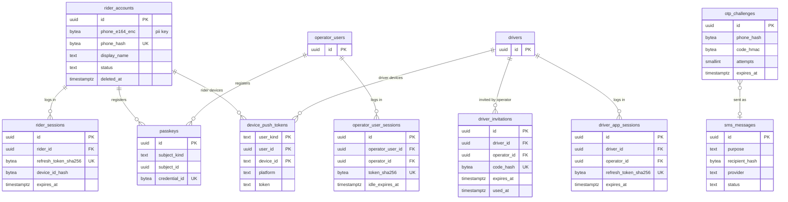

# Data model: 利用者・認証・通知の端末

乗客のアカウント、乗客・ドライバー・事業者の利用者のセッション、パスキー、ドライバーの招待、プッシュの端末のトークン、ワンタイムコード、SMS の記録。振る舞いの正本は [security.md](../security.md) の 4 節・[notifications-and-realtime-push.md](../notifications-and-realtime-push.md) の 7・8 節、決定は [ADR-0037](../../decisions/0037-authentication-device-integrity-and-fraud-response.md)・[ADR-0031](../../decisions/0031-per-stream-sequence-redelivery-push-and-sms.md)。認証の部品は Better Auth を土台にし、電話番号のワンタイムコードとドライバーの出庫のセッションを自前で足す（security の 4 節）。下の表は、この基盤が持つ形で書く（Better Auth の表の名前との対応は E1 の `auth-rider-otp` で決める）。規約は [data-model.md](../data-model.md) の 3 節。

- 置き場所はすべて Aurora `core`。
- 利用者の種類（乗客・ドライバー・事業者・運用）ごとに、発行者・鍵・セッションの表を分ける。運用の担当は IAM Identity Center で、この表に持たない（`staff_users` だけ）。
- 電話番号は列の暗号化（`pii`）と HMAC の組で持つ。検索は HMAC で完全一致だけ。

## 1. ER 図

## 2. テーブル

### 2.1 `rider_accounts`

乗客のアカウント。定義元：security の 4・7.2 節。

| 列 | 型 | NULL | 既定 | 説明 |
| --- | --- | --- | --- | --- |
| `id` | `uuid` | NOT NULL | `uuidv7()` | |
| `phone_e164_enc` | `bytea` | NULL | — | 電話番号。列の暗号化（`pii`）。削除の後は NULL |
| `phone_hash` | `bytea` | NULL | — | 電話番号の HMAC（ログイン・乗車の調べの検索）。削除の後は NULL |
| `display_name` | `text` | NULL | — | 乗客が決めた表示名（ドライバーと共有のページに出す） |
| `status` | `text` | NOT NULL | `'active'` | `active`・`restricted`（運用の利用の制限）・`deletion_pending`・`deleted` |
| `restriction_reason` | `text` | NULL | — | |
| `created_at`・`updated_at` | `timestamptz` | NOT NULL | `now()` | |
| `deletion_requested_at` | `timestamptz` | NULL | — | 30 日の猶予の始まり |
| `deleted_at` | `timestamptz` | NULL | — | 個人の情報を消した時刻（行は残し、乗車・支払いの記録が指す） |

- キー：PK `(id)`。部分一意：`UNIQUE (phone_hash) WHERE status <> 'deleted'`。
- CHECK：`status <> 'deleted' OR (phone_e164_enc IS NULL AND phone_hash IS NULL AND display_name IS NULL AND deleted_at IS NOT NULL)`、`status = 'deleted' OR phone_hash IS NOT NULL`。
- 削除：猶予の後、ログインの情報・電話番号・保存した場所・端末のトークンを消す（security の 7.2 節）。東京と大阪の両方で行う。
- 保持：個人の情報は削除まで。行（ID）は乗車の記録の期間（7 年）まで残し、その後の乗車の行の ID の切り離しと合わせて消す。S1 の量：約 200 万行。

### 2.2 `rider_sessions`

乗客のセッション（アクセス 10 分、更新 30 日。更新のたびに入れ替え、端末に結びつける）。

| 列 | 型 | NULL | 既定 | 説明 |
| --- | --- | --- | --- | --- |
| `id` | `uuid` | NOT NULL | `uuidv7()` | |
| `rider_id` | `uuid` | NOT NULL | — | |
| `device_id_hash` | `bytea` | NOT NULL | — | 端末の識別子の HMAC |
| `refresh_token_sha256` | `bytea` | NOT NULL | — | 今の更新トークンのハッシュ |
| `previous_token_sha256` | `bytea` | NULL | — | 1 つ前のトークン（使い回しの検知で全セッションを取り消す） |
| `created_at` | `timestamptz` | NOT NULL | `now()` | |
| `last_used_at` | `timestamptz` | NOT NULL | `now()` | |
| `expires_at` | `timestamptz` | NOT NULL | — | 最後の更新 ＋ 30 日 |
| `revoked_at` | `timestamptz` | NULL | — | |

- キー：PK `(id)`。UK `(refresh_token_sha256)`。索引：`(rider_id) WHERE revoked_at IS NULL`、`(expires_at)`。
- 保持：期限か取り消しの後 30 日で消す。S1 の量：約 300 万行。

### 2.3 `passkeys`

パスキー（乗客は任意、事業者の利用者はパスキーか TOTP が必須）。

| 列 | 型 | NULL | 既定 | 説明 |
| --- | --- | --- | --- | --- |
| `id` | `uuid` | NOT NULL | `uuidv7()` | |
| `subject_kind` | `text` | NOT NULL | — | `rider`・`operator_user` |
| `subject_id` | `uuid` | NOT NULL | — | |
| `credential_id` | `bytea` | NOT NULL | — | |
| `public_key` | `bytea` | NOT NULL | — | |
| `sign_count` | `bigint` | NOT NULL | `0` | |
| `created_at` | `timestamptz` | NOT NULL | `now()` | |
| `last_used_at` | `timestamptz` | NULL | — | |

- キー：PK `(id)`。UK `(credential_id)`。索引：`(subject_kind, subject_id)`。
- `operator_id` を持たないので RLS を掛けない。`operator_api` はこの表に権限を持たず、認証（`auth_svc`）だけが読み書きする（[data-model.md](../data-model.md) の 3.3 節）。
- 保持：主体の削除か利用者の取り消しまで。S1 の量：数十万行。

### 2.4 `driver_invitations`

事業者が出すドライバーの招待のコード（ドライバーのアプリの有効化）。**ドライバーが自分で登録する経路はない。**

| 列 | 型 | NULL | 既定 | 説明 |
| --- | --- | --- | --- | --- |
| `id` | `uuid` | NOT NULL | `uuidv7()` | |
| `operator_id` | `uuid` | NOT NULL | — | |
| `driver_id` | `uuid` | NOT NULL | — | 事業者が先に登録したドライバー |
| `code_hash` | `bytea` | NOT NULL | — | 招待のコードの HMAC |
| `created_by` | `uuid` | NOT NULL | — | → `operator_users` |
| `created_at` | `timestamptz` | NOT NULL | `now()` | |
| `expires_at` | `timestamptz` | NOT NULL | — | 既定 72 時間 |
| `used_at` | `timestamptz` | NULL | — | |

- キー：PK `(id)`。UK `(code_hash)`。FK `(driver_id, operator_id)` → `drivers`。部分一意：`UNIQUE (driver_id) WHERE used_at IS NULL`（有効な招待は 1 つ）。
- RLS：`operator_id`。保持：使うか期限の後 90 日。S1 の量：数万行。

### 2.5 `driver_app_sessions`

ドライバーのアプリのセッション（更新 30 日）。出庫ごとのアクセス（10 分、`driver_session_id` に結びつける）はトークンの中に持ち、表に持たない。

| 列 | 型 | NULL | 既定 | 説明 |
| --- | --- | --- | --- | --- |
| `id` | `uuid` | NOT NULL | `uuidv7()` | |
| `driver_id` | `uuid` | NOT NULL | — | |
| `operator_id` | `uuid` | NOT NULL | — | |
| `device_id_hash` | `bytea` | NOT NULL | — | |
| `refresh_token_sha256` | `bytea` | NOT NULL | — | |
| `previous_token_sha256` | `bytea` | NULL | — | |
| `created_at`・`last_used_at` | `timestamptz` | NOT NULL | `now()` | |
| `expires_at` | `timestamptz` | NOT NULL | — | |
| `revoked_at` | `timestamptz` | NULL | — | ドライバーの停止で取り消す |

- キー：PK `(id)`。UK `(refresh_token_sha256)`。FK `(driver_id, operator_id)` → `drivers`。部分一意：`UNIQUE (driver_id) WHERE revoked_at IS NULL`（1 台の端末。新しいログインで古い方を取り消す）。
- 保持：期限か取り消しの後 30 日。S1 の量：約 2 万行。

### 2.6 `operator_user_sessions`

事業者の管理画面のセッション（アイドル 12 時間、最長 7 日）。

| 列 | 型 | NULL | 既定 | 説明 |
| --- | --- | --- | --- | --- |
| `id` | `uuid` | NOT NULL | `uuidv7()` | |
| `operator_user_id` | `uuid` | NOT NULL | — | |
| `operator_id` | `uuid` | NOT NULL | — | RLS の設定（`app.operator_id`）の元 |
| `token_sha256` | `bytea` | NOT NULL | — | |
| `mfa_method` | `text` | NOT NULL | — | `passkey`・`totp`・`saml` |
| `created_at` | `timestamptz` | NOT NULL | `now()` | |
| `idle_expires_at` | `timestamptz` | NOT NULL | — | |
| `expires_at` | `timestamptz` | NOT NULL | — | 作成 ＋ 7 日 |
| `revoked_at` | `timestamptz` | NULL | — | |

- キー：PK `(id)`。UK `(token_sha256)`。FK `(operator_user_id, operator_id)` → `operator_users (id, operator_id)`。
- 保持：期限の後 30 日。S1 の量：数千行。

### 2.7 `device_push_tokens`

APNs・FCM の端末のトークン。定義元：notifications の 7.3・15 節。

| 列 | 型 | NULL | 既定 | 説明 |
| --- | --- | --- | --- | --- |
| `user_kind` | `text` | NOT NULL | — | `rider`・`driver` |
| `user_id` | `uuid` | NOT NULL | — | |
| `device_id` | `text` | NOT NULL | — | 端末ごとに固定（アプリが作る乱数） |
| `platform` | `text` | NOT NULL | — | `apns`・`fcm` |
| `token` | `text` | NOT NULL | — | |
| `app_version` | `text` | NOT NULL | — | |
| `updated_at` | `timestamptz` | NOT NULL | `now()` | |

- キー：PK `(user_kind, user_id, device_id)`。UK `(platform, token)`。
- 削除：ログアウト、APNs の 410、FCM の `UNREGISTERED`、アカウントの削除で消す。S1 の量：約 250 万行。

### 2.8 `otp_challenges`

ワンタイムコード（6 桁、期限 5 分、5 回まで）。定義元：notifications の 8.2 節。

| 列 | 型 | NULL | 既定 | 説明 |
| --- | --- | --- | --- | --- |
| `id` | `uuid` | NOT NULL | `uuidv7()` | |
| `phone_hash` | `bytea` | NOT NULL | — | |
| `purpose` | `text` | NOT NULL | — | `rider_login`・`driver_login`・`phone_change` |
| `code_hmac` | `bytea` | NOT NULL | — | 平文を持たない |
| `attempts` | `smallint` | NOT NULL | `0` | |
| `created_at` | `timestamptz` | NOT NULL | `now()` | |
| `expires_at` | `timestamptz` | NOT NULL | — | 作成 ＋ 5 分 |
| `consumed_at` | `timestamptz` | NULL | — | |

- キー：PK `(id)`。索引：`(phone_hash, created_at)` — 1 番号 1 時間 5 回・1 日 10 回の上限の照合（IP の上限は Valkey）。`(created_at)` — 削除。
- CHECK：`attempts BETWEEN 0 AND 5`。
- 保持：24 時間。S1 の量：1 日 数万行。

### 2.9 `sms_messages`

SMS の送信の記録（**本文を持たない**）。定義元：notifications の 8 節。

| 列 | 型 | NULL | 既定 | 説明 |
| --- | --- | --- | --- | --- |
| `id` | `uuid` | NOT NULL | `uuidv7()` | |
| `purpose` | `text` | NOT NULL | — | `otp`・`arrival_fallback`・`safety_followup` |
| `recipient_hash` | `bytea` | NOT NULL | — | 宛先の番号の HMAC |
| `trip_id` | `uuid` | NULL | — | 到着の代わりの知らせ |
| `otp_challenge_id` | `uuid` | NULL | — | |
| `provider` | `text` | NOT NULL | — | 主・副の提供者のコード |
| `provider_message_ref` | `text` | NULL | — | |
| `status` | `text` | NOT NULL | `'queued'` | `queued`・`sent`・`delivered`・`failed` |
| `sent_at`・`delivered_at` | `timestamptz` | NULL | — | |
| `created_at` | `timestamptz` | NOT NULL | `now()` | |

- キー：PK `(id)`。部分一意：`UNIQUE (trip_id) WHERE purpose = 'arrival_fallback'`（1 乗車 1 回）。索引：`(created_at)`、`(provider, created_at)` — 5 分の失敗の率（切り替えの判定）。
- 保持：90 日。S1 の量：1 日 数万行。
