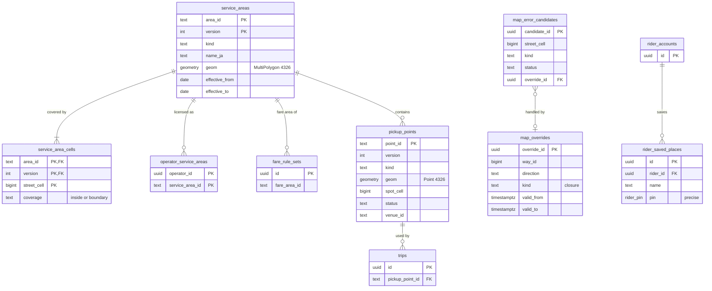

# Data model: 区域と地図

規則の区域の多角形とその格子の写し、乗降の地点、地図の閉鎖の上書き、地図の誤りの候補、乗客が保存した場所。振る舞いの正本は [maps-and-geodata.md](../maps-and-geodata.md)、決定は [ADR-0002](../../decisions/0002-hex-grid-geospatial-model.md)・[ADR-0033](../../decisions/0033-osm-import-and-service-area-polygons.md)・[ADR-0034](../../decisions/0034-geocoding-provider-and-pickup-points.md)。規約は [data-model.md](../data-model.md) の 3 節。格子のセルの ID の形は [data-model.md](../data-model.md) の 3.2 節。

- 置き場所は Aurora `core`（PostGIS）。
- **区域は `service_areas` だけが持つ。** 他の領域は多角形の写しを持たず、`*area_id` の列で指す。判定は `Contains`（`street` の写しで絞り、境目は多角形で確かめる）だけで行う（maps の 9.3 節）。
- OSM の抽出・タイル・ETA の表は S3 に置く（[stores.md](stores.md) の 2 節）。

## 1. ER 図

- 区域はバージョンつきなので、`operator_service_areas`・`fare_rule_sets` などから `service_areas` へ外部キーを張れない（図の関係は論理の参照）。参照は `check_area_ref` のトリガーで確かめる（[data-model.md](../data-model.md) の 3.5 節）。

## 2. テーブル

### 2.1 `service_areas`

規則の区域の多角形。**区域の唯一の正本。** 定義元：maps の 9.1・9.2 節、[ADR-0033](../../decisions/0033-osm-import-and-service-area-polygons.md)。

| 列 | 型 | NULL | 既定 | 説明 |
| --- | --- | --- | --- | --- |
| `area_id` | `text` | NOT NULL | — | `<kind>:<slug>`（例：`kotsuken:tokyo-tokubetsuku-busan`）。バージョンをまたいで変えない |
| `version` | `int` | NOT NULL | — | |
| `kind` | `text` | NOT NULL | — | `eigyo_kuiki`・`kotsuken`・`rideshare_zone`・`fare_zone`・`taxi_pool`・`airport` |
| `name_ja` | `text` | NOT NULL | — | |
| `bureau` | `text` | NULL | — | 運輸局 |
| `member_municipality_codes` | `text[]` | NULL | — | 全国地方公共団体コード |
| `geom` | `geometry(MultiPolygon, 4326)` | NOT NULL | — | 単純化は 5 m 以内 |
| `source` | `text` | NOT NULL | — | `n03_union`・`manual` |
| `source_ref` | `text` | NOT NULL | — | 公示の番号・URL、N03 のバージョン |
| `effective_from` | `date` | NOT NULL | — | |
| `effective_to` | `date` | NULL | — | NULL は現在も有効 |
| `approved_by` | `uuid[]` | NOT NULL | — | 2 人の確認（`staff_users`） |
| `change_request_id` | `uuid` | NULL | — | → `change_requests`（`service_area_polygon`） |
| `created_at` | `timestamptz` | NOT NULL | `now()` | |

- キー：PK `(area_id, version)`。
- 排他：`EXCLUDE USING gist (area_id WITH =, daterange(effective_from, effective_to) WITH &&)`（PROP-MAP-002）。
- 索引：`USING gist (geom)` — PostGIS での突き合わせ（バージョンの作成の検査）。`(kind, effective_from)`。
- CHECK：`area_id LIKE kind || ':%'`、`cardinality(approved_by) >= 2`、`ST_IsValid(geom)`、`effective_to IS NULL OR effective_to > effective_from`。
- 更新：作ったバージョンは書き換えない（`effective_to` を入れるだけ）。変更は新しいバージョンで行う。
- 保持：消さない（乗車の `pickup_area_ids` がバージョンを指すため）。S1 の量：数百行。

### 2.2 `service_area_cells`

区域の `street` のセルの写し（速い判定用）。定義元：maps の 9.2・9.3 節。

| 列 | 型 | NULL | 既定 | 説明 |
| --- | --- | --- | --- | --- |
| `area_id` | `text` | NOT NULL | — | |
| `version` | `int` | NOT NULL | — | |
| `street_cell` | `bigint` | NOT NULL | — | `street` のセル |
| `coverage` | `text` | NOT NULL | — | `inside`（全体が内側）・`boundary`（一部が重なる） |

- キー：PK `(area_id, version, street_cell)`。FK `(area_id, version)` → `service_areas`（`ON DELETE RESTRICT`）。
- CHECK：`(street_cell >> 60) = 3`、`coverage IN ('inside','boundary')`。
- 作り方：`geogrid.Cover(polygon, Street, Overlapping)` と `Full` で作り、同じ写しを PostGIS（`ST_Intersects`・`ST_CoveredBy`）で作り直して一致を確かめ、無作為の 10 万点で多角形の判定と一致してから `service_areas` のバージョンを有効にする（maps の 9.3・10 節）。
- 読み方：配車と API のプロセスは、有効なバージョンの写しと単純化した多角形をメモリに持つ。PostGIS を毎回引かない。
- S1 の量：東京の交通圏で 約 1 万セル × 区域の種類 × バージョン。数十万行。

### 2.3 `pickup_points`

乗降の地点（施設の地点。個人の位置ではない）。定義元：maps の 8.1 節。

| 列 | 型 | NULL | 既定 | 説明 |
| --- | --- | --- | --- | --- |
| `point_id` | `text` | NOT NULL | — | `pp:<slug>` など、読める ID |
| `version` | `int` | NOT NULL | — | |
| `name_ja` | `text` | NOT NULL | — | |
| `kind` | `text` | NOT NULL | — | `roadside`・`hotel_porch`・`station_app_pickup`・`taxi_stand`・`hospital`・`airport`・`venue` |
| `geom` | `geometry(Point, 4326)` | NOT NULL | — | |
| `spot_cell` | `bigint` | NOT NULL | — | `spot` のセル |
| `heading_constraint` | `int` | NULL | — | 車が向くべき向き（度） |
| `allowed_services` | `text[]` | NOT NULL | — | `taxi`・`rideshare` |
| `allowed_hours` | `tstzrange[]` | NULL | — | 空なら終日 |
| `pickup_overhead_s` | `int` | NOT NULL | `30` | ETA の固定の時間（[eta-and-routing.md](../eta-and-routing.md) の 4.5 節） |
| `source` | `text` | NOT NULL | — | `ops`・`facility_agreement`・`learned` |
| `status` | `text` | NOT NULL | — | `active`・`proposed`・`retired` |
| `venue_id` | `text` | NULL | — | 駅・空港など、複数の地点をまとめる施設 |
| `approved_by` | `uuid[]` | NULL | — | 2 人の確認（`staff_users`） |
| `change_request_id` | `uuid` | NULL | — | |
| `updated_at` | `timestamptz` | NOT NULL | `now()` | |

- キー：PK `(point_id)`。現在のバージョンだけを持ち、変更の前後は `change_requests.payload` と `audit_events` に残す（乗車は `point_id` だけを指す）。
- 索引：`USING gist (geom) WHERE status = 'active'` — ピンから 80 m 以内の検索。`(venue_id)`。
- CHECK：`(spot_cell >> 60) = 4`、`heading_constraint BETWEEN 0 AND 359`、`status <> 'active' OR cardinality(approved_by) >= 2`、`allowed_services <@ ARRAY['taxi','rideshare']`。
- 保持：消さない（`retired` にする）。S1 の量：数千行。
- 表記の差：maps の 8.1 節の SQL は `allowed_services` を `TAXI / RIDESHARE` の大文字で書いていた。DB の値は他の表と同じ小文字にする（2026-09-28 に maps を直した）。

### 2.4 `map_overrides`

急ぐ閉鎖（工事・災害・行事）のタイルの上書き。期間を必ず持ち、期限で外す。ODbL の「変えた内容の説明」としてそのまま出せる一覧にする。定義元：maps の 5・6.2 節。

| 列 | 型 | NULL | 既定 | 説明 |
| --- | --- | --- | --- | --- |
| `override_id` | `uuid` | NOT NULL | `uuidv7()` | |
| `way_id` | `bigint` | NOT NULL | — | OSM の way |
| `direction` | `text` | NOT NULL | — | `forward`・`backward`・`both` |
| `kind` | `text` | NOT NULL | `'closure'` | S1 は `closure` だけ |
| `reason` | `text` | NOT NULL | — | |
| `valid_from`・`valid_to` | `timestamptz` | NOT NULL | — | |
| `approved_by` | `uuid[]` | NOT NULL | — | 2 人の確認 |
| `tile_version` | `text` | NULL | — | 反映した臨時のタイルのバージョン |
| `created_by` | `uuid` | NOT NULL | — | |
| `created_at` | `timestamptz` | NOT NULL | `now()` | |

- キー：PK `(override_id)`。索引：`(valid_to)`、`(way_id)`。
- CHECK：`valid_to > valid_from`、`kind = 'closure'`、`cardinality(approved_by) >= 2`。
- 保持：期限の後 90 日（タイルのバージョンの再現と同じ）。S1 の量：数百行。

### 2.5 `map_error_candidates`

地図の誤りの候補（ID を持たない集計から作る）。定義元：maps の 6.1 節。

| 列 | 型 | NULL | 既定 | 説明 |
| --- | --- | --- | --- | --- |
| `candidate_id` | `uuid` | NOT NULL | `uuidv7()` | |
| `street_cell` | `bigint` | NOT NULL | — | 場所（○。`street`） |
| `way_id` | `bigint` | NULL | — | 疑わしい way |
| `kind` | `text` | NOT NULL | — | `missing_road`・`geometry_shift`・`wrong_turn_restriction`・`wrong_oneway`・`entrance_missing`・`closure_reported` |
| `evidence_counts` | `jsonb` | NOT NULL | — | 週ごとの失敗の回数、異なるドライバーの数（ID なし）、通報の数 |
| `week_start_on` | `date` | NOT NULL | — | 集計の週 |
| `status` | `text` | NOT NULL | `'open'` | `open`・`osm_fixed`・`overridden`・`rejected` |
| `osm_changeset` | `bigint` | NULL | — | OSM の本体を直した変更 |
| `override_id` | `uuid` | NULL | — | → `map_overrides` |
| `assigned_to` | `uuid` | NULL | — | 地図の担当 |
| `created_at`・`updated_at` | `timestamptz` | NOT NULL | `now()` | |

- キー：PK `(candidate_id)`。UK `(street_cell, kind, week_start_on)`。
- CHECK：`(street_cell >> 60) = 3`。
- 保持：2 年（ID を持たない集計）。S1 の量：週に 数百行。

### 2.6 `rider_saved_places`

乗客が保存した場所（自宅・職場など）。乗客が確かめたピンと名前だけ。定義元：[rider-and-driver-apps.md](../rider-and-driver-apps.md) の 3.1・14 節、maps の 7.3 節。

| 列 | 型 | NULL | 既定 | 説明 |
| --- | --- | --- | --- | --- |
| `id` | `uuid` | NOT NULL | `uuidv7()` | |
| `rider_id` | `uuid` | NOT NULL | — | |
| `name` | `text` | NOT NULL | — | 乗客が付けた名前 |
| `pin` | `rider_pin` | NOT NULL | — | 正確な位置（◎） |
| `created_at`・`updated_at` | `timestamptz` | NOT NULL | `now()` | |

- キー：PK `(id)`。FK `rider_id` → `rider_accounts`。索引：`(rider_id)`。
- アクセス：本人だけ（乗客の API が `rider_id` の一致で読む）。運用も読まない。
- 保持：アカウントの削除まで（削除の 30 日の猶予の後に消す）。S1 の量：約 200 万行。
