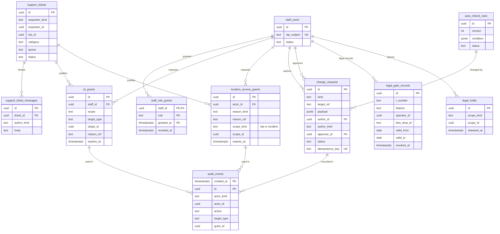

# Data model: 運用・監査・法務の関門

社内の担当とロール、一時の権限（位置と、位置以外）、変更の要求、問い合わせ、自動の返金の規則、監査ログ、リーガルホールド、法務の結論の記録。振る舞いの正本は [support-and-operations-tools.md](../support-and-operations-tools.md)・[security.md](../security.md) の 5・7 節・[delivery.md](../delivery.md) の 6 節、決定は [ADR-0032](../../decisions/0032-ops-console-roles-limits-change-requests-and-audit.md)・[ADR-0036](../../decisions/0036-location-privacy-keys-retention-and-audited-access.md)・[ADR-0043](../../decisions/0043-flag-taxonomy-legal-gates-and-safety-defaults.md)。規約は [data-model.md](../data-model.md) の 3 節。

- 置き場所はすべて Aurora `core`。監査ログの写しは log-archive の S3（Object Lock、`audit` の鍵）。
- **監査ログは操作と同じトランザクションで書く。** 書けなければ閲覧も変更も失敗させる。
- **エージェントは下書きだけ。** `change_requests.author_kind = 'agent'` の行は承認・適用できない。`legal_gate_records` はエージェントも一般の担当も作れない（`legal_counsel` のロールだけ）。

## 1. ER 図

## 2. 社内の担当と権限

### 2.1 `staff_users`・`staff_role_grants`

社内の担当（IAM Identity Center の SSO）とロール。定義元：support の 2.1・14 節。

| 表 | 列 |
| --- | --- |
| `staff_users` | `id uuid` PK、`idp_subject text` UK（SSO の主体）、`display_name text`、`status text`（`active`・`disabled`）、`created_at`、`disabled_at` |
| `staff_role_grants` | `staff_id uuid` FK、`role text`、`granted_by uuid`、`granted_at timestamptz`、`revoked_at timestamptz NULL`、`reason text`。PK `(staff_id, role, granted_at)`。部分一意 `UNIQUE (staff_id, role) WHERE revoked_at IS NULL` |

- `role`：`support_t1`・`support_t2`・`safety_agent`・`safety_lead`・`supply_reviewer`・`finance_ops`・`geodata_editor`・`fare_rule_editor`・`release_manager`・`auditor`・`legal_counsel`。`legal_counsel`（法務の担当）は `legal_gate_records` の作成と取り消し、運賃の規則（L2 の対象）と外部への提供の承認に使う（ADR-0043。2026-09-28 に support の 2.1 節の表に足した）。
- 金額の上限はロールの行に持たない。AppConfig `ops_policies`（ロール × 操作 × 上限）が正本（support の 2.1 節）。
- CHECK：`granted_by <> staff_id`（自分に付けない）。
- 保持：`disabled` の後も消さない（監査ログが指すため）。`display_name` だけ 1 年で除く。S1 の量：数百行。

### 2.2 `jit_grants`

位置**以外**の機微な閲覧の一時の権限（個人の情報の全体、通話の記録、メッセージの本文、報告の本文、書類の画像）。位置は `location_access_grants`。定義元：support の 2.2 節、[ADR-0032](../../decisions/0032-ops-console-roles-limits-change-requests-and-audit.md)。

| 列 | 型 | NULL | 既定 | 説明 |
| --- | --- | --- | --- | --- |
| `id` | `uuid` | NOT NULL | `uuidv7()` | |
| `staff_id` | `uuid` | NOT NULL | — | |
| `scope` | `text` | NOT NULL | — | `pii`・`call_log`・`message`・`report`・`document` |
| `target_type` | `text` | NOT NULL | — | `trip`・`rider`・`driver`・`safety_report`・`document` |
| `target_id` | `uuid` | NOT NULL | — | 1 対象だけ |
| `reason_kind` | `text` | NOT NULL | — | `ticket`・`incident` |
| `reason_ref` | `text` | NOT NULL | — | チケットかインシデントの ID |
| `approved_by` | `uuid` | NULL | — | 報告の本文は `safety_lead` の承認が要る |
| `created_at` | `timestamptz` | NOT NULL | `now()` | |
| `expires_at` | `timestamptz` | NOT NULL | — | 作成 ＋ 30 分 |

- キー：PK `(id)`。索引：`(staff_id, expires_at)` — 使う時の確かめ。`(staff_id, created_at)` — 1 人 1 日の件数の監視。
- CHECK：`expires_at <= created_at + interval '30 minutes'`、`scope <> 'report' OR approved_by IS NOT NULL`、`approved_by IS NULL OR approved_by <> staff_id`。
- 作成は同じトランザクションで `audit_events` を書く。**エージェントには発行しない**（`staff_users` の主体だけ）。
- 保持：監査ログと同じ（Aurora に 1 年。写しは 7 年）。S1 の量：1 日 数千行。

### 2.3 `location_access_grants`

位置の閲覧の許可（軌跡、押した後の位置）。定義元：[security.md](../security.md) の 5.2 節、[ADR-0036](../../decisions/0036-location-privacy-keys-retention-and-audited-access.md)。

| 列 | 型 | NULL | 既定 | 説明 |
| --- | --- | --- | --- | --- |
| `id` | `uuid` | NOT NULL | `uuidv7()` | |
| `actor_id` | `uuid` | NOT NULL | — | → `staff_users` |
| `reason_kind` | `text` | NOT NULL | — | `ticket`・`incident`・`accident` |
| `reason_ref` | `text` | NOT NULL | — | |
| `scope_kind` | `text` | NOT NULL | — | `trip`（1 乗車の区間）・`incident`（1 つのインシデントの追記の位置）・`multi`（複数の乗車・1 人の期間。2 人の承認） |
| `scope_id` | `uuid` | NOT NULL | — | 乗車かインシデントの ID（`multi` は下の `scope_detail`） |
| `scope_detail` | `jsonb` | NULL | — | `multi` の対象の一覧と期間 |
| `external_disclosure` | `boolean` | NOT NULL | `false` | 警察などへの提供（法務の確認待ち（L4・L7）） |
| `approved_by` | `uuid[]` | NOT NULL | `'{}'` | `multi` と外部への提供は法務の担当と運用の責任者の 2 人 |
| `created_at` | `timestamptz` | NOT NULL | `now()` | |
| `expires_at` | `timestamptz` | NOT NULL | — | 作成 ＋ 30 分 |

- キー：PK `(id)`。索引：`(actor_id, expires_at)`、`(scope_kind, scope_id)`。
- CHECK：`expires_at <= created_at + interval '30 minutes'`、`scope_kind <> 'multi' AND NOT external_disclosure OR cardinality(approved_by) >= 2`、`NOT (actor_id = ANY(approved_by))`。
- アクセス：`trail-viewer` の窓口のロールだけが読み、`location` の鍵を使える唯一の人の窓口にする。窓口の呼び出しは、応答の前に `audit_events` を書く。
- 照合：毎日、窓口のアクセスの記録と `audit_events` の件数を突き合わせ、1 件でも違えば SEV2（ADR-0010 の Confirmation）。
- 保持：監査ログと同じ。S1 の量：1 日 数百行。

### 2.4 `change_requests`

お金・規則・データの変更の要求（書き手と承認者を分ける）。定義元：support の 4 節。

| 列 | 型 | NULL | 既定 | 説明 |
| --- | --- | --- | --- | --- |
| `id` | `uuid` | NOT NULL | `uuidv7()` | |
| `kind` | `text` | NOT NULL | — | `fare_adjustment`・`bulk_refund`・`service_area_polygon`・`pickup_point`・`fare_rule_set`・`dynamic_fare_policy`・`client_policy`・`nav_handoff_targets`・`operator_bank_account`・`safety_hold`・`law_enforcement_response`・`auto_refund_rule`・`ops_policy`・`map_override` |
| `target_ref` | `text` | NOT NULL | — | 対象（`trip:<id>`、`area:<area_id>` など） |
| `payload` | `jsonb` | NOT NULL | — | 変更の中身（差分）。位置の値を入れるのは区域・乗降の地点の変更だけ（施設の位置） |
| `preview` | `jsonb` | NULL | — | 適用の前の検査の結果（仕訳の案、無作為の点の判定、影響する端末の数） |
| `author_id` | `uuid` | NOT NULL | — | 人の書き手（エージェントの下書きは、人が引き受けてから `pending` に進む） |
| `author_kind` | `text` | NOT NULL | — | `human`・`agent`・`operator_user` |
| `drafted_by_agent` | `text` | NULL | — | 下書きを作ったエージェントの名前（`author_kind = agent` のとき） |
| `approver_id` | `uuid` | NULL | — | |
| `second_approver_id` | `uuid` | NULL | — | 2 人の承認が要る種類（`bulk_refund`・`law_enforcement_response` など） |
| `status` | `text` | NOT NULL | `'draft'` | `draft`・`pending`・`approved`・`applied`・`rejected`・`expired` |
| `reason` | `text` | NOT NULL | — | |
| `ticket_ref` | `text` | NULL | — | |
| `idempotency_key` | `text` | NOT NULL | — | 適用の冪等 |
| `created_at` | `timestamptz` | NOT NULL | `now()` | |
| `decided_at`・`applied_at` | `timestamptz` | NULL | — | |
| `expires_at` | `timestamptz` | NOT NULL | — | 作成 ＋ 7 日 |

- キー：PK `(id)`。UK `(idempotency_key)`。
- CHECK（PROP-OPS-001）：`approver_id IS NULL OR approver_id <> author_id`、`second_approver_id IS NULL OR second_approver_id NOT IN (author_id, approver_id)`、`author_kind <> 'agent' OR status IN ('draft','rejected','expired')`（エージェントの行は承認に進まない。人が引き受けると `author_kind = human` の新しい行を作る）、`status NOT IN ('approved','applied') OR approver_id IS NOT NULL`。
- 承認の時点でその `kind` のロールを持つことは、`ops_policies` の判定の関数で確かめる（行に持たない）。
- 索引：`(status, created_at) WHERE status IN ('pending','approved')` — 承認の待ちと、承認の後 24 時間の適用の監視。`(target_ref)`。
- 保持：7 年（お金と規則の変更の記録。2026-09-28 に既定を置いた）。S1 の量：1 日 数百行。

### 2.5 `auto_refund_rules`

自動の返金の規則（版つき。S1 はキャンセル料の免除の 1 つだけ、release フラグの裏）。定義元：support の 5 節。

| 列 | 型 | NULL | 既定 | 説明 |
| --- | --- | --- | --- | --- |
| `id` | `uuid` | NOT NULL | `uuidv7()` | |
| `rule_key` | `text` | NOT NULL | — | 例：`late_driver_cancel_fee_waive` |
| `version` | `int` | NOT NULL | — | |
| `condition` | `jsonb` | NOT NULL | — | 例：`{ "late_s_at_least": 300 }` |
| `action` | `text` | NOT NULL | — | `cancel_fee_waive` |
| `release_flag` | `text` | NOT NULL | — | |
| `effective_from`・`effective_to` | `timestamptz` | NOT NULL / NULL | — | |
| `status` | `text` | NOT NULL | `'draft'` | `draft`・`active`・`retired` |
| `change_request_id` | `uuid` | NULL | — | |

- キー：PK `(id)`。UK `(rule_key, version)`。承認の後は書き換えない（運賃の規則と同じトリガー）。S1 の量：数行。

## 3. 問い合わせ

### 3.1 `support_tickets`・`support_ticket_messages`

アプリの中の問い合わせ（S1 は外部の SaaS を使わない）。定義元：support の 6 節。

| 表 | 列 |
| --- | --- |
| `support_tickets` | `id uuid` PK、`requester_kind text`（`rider`・`driver`・`operator_user`）、`requester_id uuid`、`trip_id uuid NULL`、`category text`（`fare`・`cancel_fee`・`lost_item`・`driver_conduct`・`app_bug`・`safety`）、`queue text`（`support_t1`・`support_t2`・`safety_agent`）、`status text`（`open`・`pending_requester`・`resolved`・`reopened`）、`assigned_to uuid NULL`、`created_at`、`first_response_at`、`resolved_at`、`reopened_count smallint` |
| `support_ticket_messages` | `id uuid` PK、`ticket_id uuid` FK、`author_kind text`（`requester`・`staff`・`agent_draft`）、`author_id uuid NULL`、`body text`、`sent_at timestamptz NULL`（エージェントの下書きは担当が確かめて送った時刻）、`created_at` |

- 索引：`(queue, status, created_at)` — 振り分けの一覧。`(trip_id)`。`(requester_kind, requester_id, created_at DESC)`。
- CHECK：`category <> 'safety' OR queue = 'safety_agent'`、`author_kind <> 'agent_draft' OR sent_at IS NULL OR author_id IS NOT NULL`（下書きは人が送る）。
- 本文に位置の値を書かない（丸めた位置の表示は乗車の詳細から引く）。
- 保持：既定 3 年（2026-09-28 に既定を置いた。法務の確認待ち（L4・L7）。[security.md](../security.md) の 7.2 節）。S1 の量：1 日 数千行。

## 4. 監査と法務

### 4.1 `audit_events`

監査ログ（追記のみ）。形は Slack の題材の [ADR-0018](../../../../slack/docs/decisions/0018-audit-log.md) を引き継ぐ。定義元：[security.md](../security.md) の 7.1 節、support の 8 節。

| 列 | 型 | NULL | 既定 | 説明 |
| --- | --- | --- | --- | --- |
| `created_at` | `timestamptz` | NOT NULL | `now()` | パーティションの鍵 |
| `id` | `uuid` | NOT NULL | `uuidv7()` | |
| `actor_kind` | `text` | NOT NULL | — | `rider`・`driver`・`operator_user`・`staff`・`service`・`break_glass` |
| `actor_id` | `uuid` | NULL | — | |
| `actor_role` | `text` | NULL | — | |
| `org_kind` | `text` | NOT NULL | — | `platform`・`operator` |
| `org_id` | `uuid` | NULL | — | 事業者の操作なら `operator_id`（RLS の鍵） |
| `action` | `text` | NOT NULL | — | `trail.view`・`incident_location.view`・`fleet_map.view`・`pii.view`・`refund.create`・`change_request.approve`・`legal_gate_record.create` など（security の 7.1 節の分類） |
| `target_type` | `text` | NOT NULL | — | |
| `target_id` | `text` | NULL | — | |
| `reason_kind`・`reason_ref` | `text` | NULL | — | |
| `grant_id` | `uuid` | NULL | — | `jit_grants` か `location_access_grants` |
| `change_request_id` | `uuid` | NULL | — | |
| `request_id` | `text` | NULL | — | |
| `ip` | `inet` | NULL | — | |
| `device_kind` | `text` | NULL | — | |
| `result` | `text` | NOT NULL | — | `ok`・`denied`・`error` |

- キー：PK `(created_at, id)`。パーティション：`created_at` の月。Aurora に 1 年、その後 `DROP`。
- **位置・電話番号・名前の値を書かない**（列を持たない。`target_id` は ID だけ）。
- 索引：`(org_id, created_at)` — 事業者の `operator_owner` が自社の分を見る（RLS）。`(actor_id, created_at)`、`(action, created_at)`、`(grant_id)`。
- 更新：すべてのロールに `INSERT`・`SELECT` だけ。`auditor` は読み取りだけ。閲覧も監査ログに残す。
- 書き出し：同じトランザクションで `core` の `outbox_events`（`aggregate_type = audit`）に書き、中継が log-archive の S3 `audit/` へ送る（Object Lock、7 年）。
- 保持：Aurora に 1 年、アーカイブに 7 年（既定。法務の確認待ち）。S1 の量：1 日 約 50 万行（事業者の稼働の地図の閲覧は 1 時間に 1 回に間引く）。

### 4.2 `legal_holds`

リーガルホールド（事故・訴訟の対象の削除を止める）。定義元：security の 7.2 節。

| 列 | 型 | NULL | 既定 | 説明 |
| --- | --- | --- | --- | --- |
| `id` | `uuid` | NOT NULL | `uuidv7()` | |
| `scope_kind` | `text` | NOT NULL | — | `trip`・`rider`・`driver`・`incident` |
| `scope_id` | `uuid` | NOT NULL | — | |
| `reason` | `text` | NOT NULL | — | |
| `created_by` | `uuid` | NOT NULL | — | `legal_counsel` |
| `created_at` | `timestamptz` | NOT NULL | `now()` | |
| `released_at` | `timestamptz` | NULL | — | |
| `released_by` | `uuid` | NULL | — | |

- キー：PK `(id)`。索引：`(scope_kind, scope_id) WHERE released_at IS NULL` — 削除のジョブは、消す前に必ずこの索引を引く（S3 の削除も同じ）。
- 使う条件は法務の確認待ち。保持：解除の後、監査ログと同じ。S1 の量：数十行。

### 4.3 `legal_gate_records`

法務の結論の記録（legal のフラグの根拠）。AppConfig の検証の関数が、legal のフラグを本番で true にする配備のたびに、この表の範囲を確かめる。定義元：[delivery.md](../delivery.md) の 6.2 節、[ADR-0043](../../decisions/0043-flag-taxonomy-legal-gates-and-safety-defaults.md)。

| 列 | 型 | NULL | 既定 | 説明 |
| --- | --- | --- | --- | --- |
| `id` | `uuid` | NOT NULL | `uuidv7()` | |
| `l_number` | `text` | NOT NULL | — | `L1`〜`L9`（[intent.md](../../intent.md)） |
| `feature` | `text` | NOT NULL | — | フラグの機能の部分（`share_trip`・`driver_face_check`・`rideshare_dispatch` など） |
| `flag_name` | `text` | NOT NULL | — | 生成列：`'legal.' || lower(l_number) || '.' || feature` |
| `operator_id` | `uuid` | NULL | — | 範囲の事業者。NULL はすべての事業者 |
| `fare_area_id` | `text` | NULL | — | 範囲の交通圏。NULL はすべての交通圏 |
| `summary` | `text` | NOT NULL | — | 結論の要約 |
| `evidence_doc_id` | `uuid` | NOT NULL | — | 根拠の文書（→ `documents`、`owner_type = platform`） |
| `approved_by` | `uuid` | NOT NULL | — | `legal_counsel` |
| `valid_from` | `date` | NOT NULL | — | |
| `valid_to` | `date` | NULL | — | |
| `created_at` | `timestamptz` | NOT NULL | `now()` | |
| `revoked_at` | `timestamptz` | NULL | — | 取り消し（記録は消さない） |
| `revoked_by` | `uuid` | NULL | — | |

- キー：PK `(id)`。
- 索引：`(flag_name, valid_from, valid_to) WHERE revoked_at IS NULL` — 検証の関数の問い合わせ。
- CHECK：`l_number ~ '^L[1-9]$'`、`feature ~ '^[a-z0-9_]+$'`、`valid_to IS NULL OR valid_to > valid_from`、`(revoked_at IS NULL) = (revoked_by IS NULL)`。
- 更新：`INSERT` と `revoked_at`・`revoked_by` の更新だけ。書けるのは `legal_counsel` のロールの操作（運用の API が `staff_role_grants` を確かめる）だけで、エージェントの経路はない。
- 保持：消さない（legal のフラグの根拠として残す。ADR-0043）。S1 の量：数十行。
