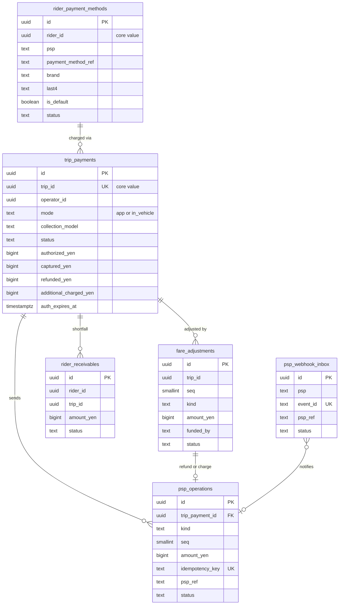
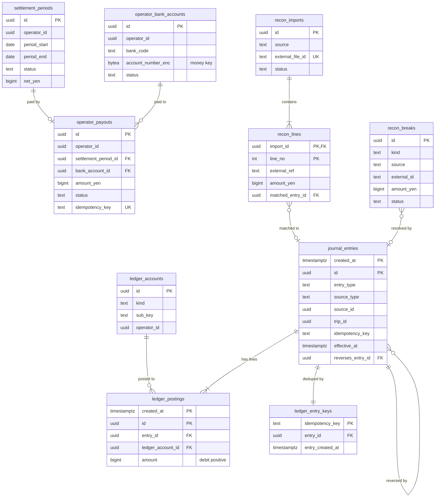

# Data model: 支払い・台帳・精算

乗客の決済の方法、乗車の支払いと PSP の操作、Webhook の受信箱、運賃の訂正と返金、乗客の未払い、複式簿記の台帳、事業者の振込先・締め・振込、照合。振る舞いの正本は [payments-and-payouts.md](../payments-and-payouts.md)、決定は [ADR-0023](../../decisions/0023-psp-authorize-at-request-capture-at-end.md)・[ADR-0024](../../decisions/0024-fare-collection-model.md)・[ADR-0025](../../decisions/0025-ledger-settlement-and-reconciliation.md)。表の形は Stripe の題材の [data-model/ledger.md](../../../../stripe/docs/architecture/data-model/ledger.md)・[data-model/payouts-and-reconciliation.md](../../../../stripe/docs/architecture/data-model/payouts-and-reconciliation.md) を引き継ぐ。規約は [data-model.md](../data-model.md) の 3 節。

- 置き場所はすべて Aurora `money`（ストレージは `money` の鍵）。
- **`core` の表を外部キーで指さない。** `trip_id`・`rider_id`・`operator_id` は値として持ち、整合は outbox の事象と日次の照合で守る（[ADR-0038](../../decisions/0038-compute-on-fargate-and-data-stores.md)）。`money` にも `outbox_events` を置く（形は [trips.md](trips.md) の 3.8 節）。
- **お金が動く状態の更新と仕訳は、同じトランザクションで書く。** 与信はお金を動かさないので仕訳を書かない。
- `operator_id` を持つ表は RLS を掛け、事業者の管理画面（`operator_api`）は自社の明細・振込・訂正だけを読む。

## 1. ER 図

### 1.1 支払い

### 1.2 台帳・精算・照合

## 2. テーブル（支払い）

### 2.1 `rider_payment_methods`

乗客の決済の方法（PSP のトークンと表示用の情報だけ）。定義元：payments の 3・4 節。

| 列 | 型 | NULL | 既定 | 説明 |
| --- | --- | --- | --- | --- |
| `id` | `uuid` | NOT NULL | `uuidv7()` | |
| `rider_id` | `uuid` | NOT NULL | — | `core` の `rider_accounts.id` |
| `psp` | `text` | NOT NULL | — | PSP のコード（選定の後に決める） |
| `psp_customer_ref` | `text` | NOT NULL | — | |
| `payment_method_ref` | `text` | NOT NULL | — | PSP のトークン |
| `brand` | `text` | NOT NULL | — | |
| `last4` | `text` | NOT NULL | — | |
| `exp_month` | `smallint` | NOT NULL | — | |
| `exp_year` | `smallint` | NOT NULL | — | |
| `card_fingerprint_hash` | `bytea` | NULL | — | PSP の指紋の HMAC（不正の兆し。`pii` の鍵の HMAC） |
| `is_default` | `boolean` | NOT NULL | `false` | |
| `status` | `text` | NOT NULL | `'active'` | `active`・`detached`・`expired` |
| `created_at`・`updated_at` | `timestamptz` | NOT NULL | `now()` | |

- キー：PK `(id)`。UK `(psp, payment_method_ref)`。部分一意：`UNIQUE (rider_id) WHERE is_default AND status = 'active'`。
- 索引：`(rider_id)`。`(card_fingerprint_hash)` — 1 枚のカードのアカウントの数の上限（[security.md](../security.md) の 3.5・9 節）。
- CHECK：`last4 ~ '^[0-9]{4}$'`、`exp_month BETWEEN 1 AND 12`。**カードの番号の列を作らない。**
- 保持：`detached` の後、乗車の記録と同じ 7 年（支払いの記録が指すため）。アカウントの削除で `detached` にする。S1 の量：約 300 万行。

### 2.2 `trip_payments`

1 つの乗車に 1 つの支払い。定義元：payments の 5.1 節。

| 列 | 型 | NULL | 既定 | 説明 |
| --- | --- | --- | --- | --- |
| `id` | `uuid` | NOT NULL | `uuidv7()` | |
| `trip_id` | `uuid` | NOT NULL | — | |
| `rider_id` | `uuid` | NOT NULL | — | |
| `operator_id` | `uuid` | NULL | — | 受諾の事業者（与信の時点では未定。`trip.fare_finalized` で入れる） |
| `rider_payment_method_id` | `uuid` | NOT NULL | — | → `rider_payment_methods` |
| `mode` | `text` | NOT NULL | — | `app`・`in_vehicle` |
| `collection_model` | `text` | NULL | — | `agent_collection`・`operator_merchant`（確定の時の事業者の値） |
| `psp` | `text` | NOT NULL | — | |
| `psp_customer_ref` | `text` | NOT NULL | — | |
| `payment_method_ref` | `text` | NOT NULL | — | |
| `status` | `text` | NOT NULL | — | `authorizing`・`authorized`・`captured`・`partially_refunded`・`refunded`・`canceled`・`failed`、`in_vehicle` の支払いは `not_applicable`（キャンセル料と手数料だけが動く） |
| `authorized_yen` | `bigint` | NOT NULL | `0` | |
| `captured_yen` | `bigint` | NOT NULL | `0` | |
| `refunded_yen` | `bigint` | NOT NULL | `0` | |
| `additional_charged_yen` | `bigint` | NOT NULL | `0` | 追加の請求の成功の合計 |
| `overcapture_max_yen` | `bigint` | NULL | — | PSP が示したときだけ |
| `auth_expires_at` | `timestamptz` | NULL | — | |
| `version` | `bigint` | NOT NULL | `1` | |
| `created_at`・`updated_at` | `timestamptz` | NOT NULL | `now()` | |

- キー：PK `(id)`。UK `(trip_id)`（1 乗車 1 支払い）。
- 索引：`(auth_expires_at) WHERE status = 'authorized'` — 期限の 24 時間前の SEV2。`(operator_id, created_at)` — 精算と RLS。
- CHECK：金額は 0 以上、`captured_yen <= greatest(authorized_yen, coalesce(overcapture_max_yen, 0))`、**`refunded_yen <= captured_yen + additional_charged_yen`**（返金の合計の上限。payments の 6 節）、`mode <> 'in_vehicle' OR authorized_yen = 0`。
- 保持：帳簿と同じ 10 年（想定。法務）。S1 の量：1 日 約 60 万行（与信は受け付けの量）。

### 2.3 `psp_operations`

PSP への操作（送る前に記録する）。定義元：payments の 5.1・7 節、[ADR-0023](../../decisions/0023-psp-authorize-at-request-capture-at-end.md)。

| 列 | 型 | NULL | 既定 | 説明 |
| --- | --- | --- | --- | --- |
| `id` | `uuid` | NOT NULL | `uuidv7()` | |
| `trip_payment_id` | `uuid` | NOT NULL | — | |
| `kind` | `text` | NOT NULL | — | `authorize`・`capture`・`cancel`・`refund`・`additional_charge` |
| `seq` | `smallint` | NOT NULL | `1` | 同じ `kind` の中の番号。`authorize`・`capture`・`cancel` は 1 だけ |
| `amount_yen` | `bigint` | NOT NULL | — | |
| `idempotency_key` | `text` | NOT NULL | — | `trip:{trip_id}:{kind}:{seq}`。PSP の冪等キー |
| `fare_adjustment_id` | `uuid` | NULL | — | 返金・追加の請求の元の訂正 |
| `psp_ref` | `text` | NULL | — | |
| `status` | `text` | NOT NULL | `'pending_send'` | `pending_send`・`sent`・`succeeded`・`failed`・`unknown` |
| `error_code` | `text` | NULL | — | |
| `lookup_attempts` | `smallint` | NOT NULL | `0` | 結果不明の照会の回数 |
| `next_lookup_at` | `timestamptz` | NULL | — | 10 秒・1 分・5 分・以後 15 分 |
| `created_at` | `timestamptz` | NOT NULL | `now()` | |
| `sent_at`・`completed_at` | `timestamptz` | NULL | — | |

- キー：PK `(id)`。UK `(idempotency_key)`。部分一意（二重の請求の防止。[data-model.md](../data-model.md) の 5 節）：
  - `one_inflight_op_per_payment ON (trip_payment_id) WHERE status IN ('pending_send','sent','unknown')`
  - `one_success_per_kind_seq ON (trip_payment_id, kind, seq) WHERE status = 'succeeded'`
  - `one_capture_per_payment ON (trip_payment_id) WHERE kind = 'capture' AND status IN ('pending_send','sent','unknown','succeeded')`
- 索引：`(next_lookup_at) WHERE status = 'unknown'` — 照会のジョブ。`(psp_ref)` — Webhook の結びつけ。
- CHECK：`amount_yen >= 0`、`kind NOT IN ('authorize','capture','cancel') OR seq = 1`、`idempotency_key LIKE 'trip:%'`（形はアプリで作る）。
- 保持：10 年。S1 の量：1 日 約 130 万行。

### 2.4 `psp_webhook_inbox`

PSP の Webhook の受信箱。署名を確かめてから保存する。定義元：payments の 7 節。

| 列 | 型 | NULL | 既定 | 説明 |
| --- | --- | --- | --- | --- |
| `id` | `uuid` | NOT NULL | `uuidv7()` | |
| `psp` | `text` | NOT NULL | — | |
| `event_id` | `text` | NOT NULL | — | PSP の事象の ID |
| `event_type` | `text` | NOT NULL | — | |
| `psp_ref` | `text` | NULL | — | |
| `payload` | `bytea` | NOT NULL | — | 受け取った本文（カードの表示用の情報より多くを含めないことを PSP の設定で確かめる） |
| `received_at` | `timestamptz` | NOT NULL | `now()` | |
| `status` | `text` | NOT NULL | `'received'` | `received`・`applied`・`ignored`・`failed` |
| `processed_at` | `timestamptz` | NULL | — | |

- キー：PK `(id)`。UK `(psp, event_id)`（再送の攻撃と重複を弾く）。索引：`(received_at) WHERE status = 'received'`。
- 保持：13 か月（2026-09-28 に既定を置いた。[security.md](../security.md) の 7.2 節）。S1 の量：1 日 約 100 万行。

### 2.5 `fare_adjustments`

運賃の訂正と返金。定義元：payments の 6 節、[support-and-operations-tools.md](../support-and-operations-tools.md) の 5 節。

| 列 | 型 | NULL | 既定 | 説明 |
| --- | --- | --- | --- | --- |
| `id` | `uuid` | NOT NULL | `uuidv7()` | |
| `trip_id` | `uuid` | NOT NULL | — | |
| `trip_payment_id` | `uuid` | NOT NULL | — | |
| `operator_id` | `uuid` | NOT NULL | — | |
| `seq` | `smallint` | NOT NULL | — | 乗車の中の番号 |
| `kind` | `text` | NOT NULL | — | `correction_down`・`correction_up`・`toll_add`・`goodwill_refund`・`cancel_fee_waive` |
| `amount_yen` | `bigint` | NOT NULL | — | 正の値。向きは `kind` で決まる |
| `funded_by` | `text` | NOT NULL | — | `operator`・`platform` |
| `reason_code` | `text` | NOT NULL | — | |
| `note` | `text` | NULL | — | 個人の情報を書かない |
| `ticket_ref` | `text` | NULL | — | |
| `requested_by` | `uuid` | NOT NULL | — | 社内の担当か事業者の利用者（事業者の申請） |
| `requested_by_kind` | `text` | NOT NULL | — | `staff`・`operator_user`・`auto_rule` |
| `approved_by` | `uuid` | NULL | — | |
| `change_request_id` | `uuid` | NULL | — | 上限を超えたとき（`core` の `change_requests`） |
| `auto_refund_rule_id` | `uuid` | NULL | — | 自動の処置のとき |
| `status` | `text` | NOT NULL | `'requested'` | `requested`・`approved`・`applied`・`rejected`・`failed` |
| `created_at` | `timestamptz` | NOT NULL | `now()` | |
| `applied_at` | `timestamptz` | NULL | — | |

- キー：PK `(id)`。UK `(trip_id, seq)`。部分一意：`UNIQUE (trip_id, kind, ticket_ref) WHERE ticket_ref IS NOT NULL AND status <> 'rejected'`（同じチケットで二重に作らない）。
- CHECK：`amount_yen > 0`、`approved_by IS NULL OR approved_by <> requested_by`、`kind <> 'correction_up' OR status <> 'applied' OR approved_by IS NOT NULL`。返金の合計の上限は `trip_payments` の CHECK で守る。
- 索引：`(operator_id, created_at)` — 次の締めの差し引き（RLS）。`(status, created_at) WHERE status IN ('requested','approved')`。
- 保持：10 年。S1 の量：1 日 数千行。

### 2.6 `rider_receivables`

乗客の未払い（追加の請求の失敗）。定義元：payments の 5.3 節。

| 列 | 型 | NULL | 既定 | 説明 |
| --- | --- | --- | --- | --- |
| `id` | `uuid` | NOT NULL | `uuidv7()` | |
| `rider_id` | `uuid` | NOT NULL | — | |
| `trip_id` | `uuid` | NOT NULL | — | |
| `psp_operation_id` | `uuid` | NOT NULL | — | 失敗した追加の請求 |
| `amount_yen` | `bigint` | NOT NULL | — | |
| `status` | `text` | NOT NULL | `'open'` | `open`・`collected`・`written_off` |
| `attempts` | `smallint` | NOT NULL | `1` | 24 時間・72 時間の後に送り直す |
| `next_attempt_at` | `timestamptz` | NULL | — | |
| `created_at` | `timestamptz` | NOT NULL | `now()` | |
| `resolved_at` | `timestamptz` | NULL | — | |

- キー：PK `(id)`。UK `(psp_operation_id)`。部分一意：`UNIQUE (trip_id) WHERE status = 'open'`。
- 索引：`(rider_id) WHERE status = 'open'` — 次の依頼の前の支払いの要求。`(next_attempt_at) WHERE status = 'open'`。
- CHECK：`amount_yen > 0`、`attempts BETWEEN 1 AND 3`。
- 保持：10 年。S1 の量：1 日 数百行。

## 3. テーブル（台帳）

仕訳の例と口座の意味は payments の 8 節。借方が正、貸方が負。

### 3.1 `ledger_accounts`

| 列 | 型 | NULL | 既定 | 説明 |
| --- | --- | --- | --- | --- |
| `id` | `uuid` | NOT NULL | `uuidv7()` | |
| `kind` | `text` | NOT NULL | — | `psp_receivable`・`bank_cash`・`payouts_in_transit`・`rider_receivable`・`operator_payable`・`operator_fee_receivable`・`fee_revenue`・`consumption_tax_payable`・`promotion_expense`・`processing_cost`・`bad_debt_expense`・`suspense` |
| `sub_key` | `text` | NOT NULL | `''` | `psp_receivable`・`processing_cost` は PSP、`bank_cash` は口座（`settlement`・`payout`）、`suspense` は出どころ |
| `operator_id` | `uuid` | NULL | — | `operator_payable`・`operator_fee_receivable` の事業者 |
| `created_at` | `timestamptz` | NOT NULL | `now()` | |

- キー：PK `(id)`。UK `(kind, sub_key, operator_id) NULLS NOT DISTINCT`。
- CHECK：`kind IN (...)`、`(kind IN ('operator_payable','operator_fee_receivable')) = (operator_id IS NOT NULL)`。
- アクセス：事業者は自社の口座の行だけ（RLS）。S1 の量：数百行。

### 3.2 `journal_entries`

仕訳（追記のみ）。

| 列 | 型 | NULL | 既定 | 説明 |
| --- | --- | --- | --- | --- |
| `created_at` | `timestamptz` | NOT NULL | `now()` | パーティションの鍵 |
| `id` | `uuid` | NOT NULL | `uuidv7()` | |
| `entry_type` | `text` | NOT NULL | — | `capture`・`fee`・`additional_charge`・`refund`・`cancellation_fee`・`in_vehicle_fee`・`receivable_collected`・`receivable_written_off`・`psp_settlement`・`payout_created`・`payout_paid`・`payout_returned`・`recon_suspense`・`recon_resolution`・`correction` |
| `source_type` | `text` | NOT NULL | — | `trip_payment`・`psp_operation`・`fare_adjustment`・`rider_receivable`・`operator_payout`・`recon_line`・`recon_break` |
| `source_id` | `uuid` | NULL | — | |
| `trip_id` | `uuid` | NULL | — | 乗車の仕訳 |
| `operator_id` | `uuid` | NULL | — | 事業者の預り金を動かす仕訳 |
| `idempotency_key` | `text` | NOT NULL | — | `capture:{trip_id}`・`fee:{trip_id}`・`refund:{trip_id}:{seq}`・`payout:{payout_id}:create`・`recon:{source}:{external_id}` |
| `effective_at` | `timestamptz` | NOT NULL | — | 会計の日時。締めの判定に使う |
| `reverses_entry_id` | `uuid` | NULL | — | 逆の仕訳なら元の仕訳 |
| `metadata` | `jsonb` | NOT NULL | `'{}'` | 手数料の規則の版（`platform_fee_rule_id`）、訂正の ID、承認者 |

- キー：PK `(created_at, id)`。冪等は `ledger_entry_keys`。
- パーティション：`created_at` の月。13 か月より古いものは S3 の Parquet（Object Lock）に移し、10 年まで残す。
- 索引：`(operator_id, effective_at)` — 締めの集計（RLS）。`(trip_id)` — 乗車からの追跡。`(reverses_entry_id) WHERE reverses_entry_id IS NOT NULL`。
- CHECK：`effective_at >= created_at - interval '1 minute'`（締めた期間を書き換えない）、`entry_type IN (...)`。
- 更新：`payments_svc` と `recon` は `INSERT`・`SELECT` だけ。拒否のトリガーで `UPDATE`・`DELETE` を止める。
- S1 の量：1 日 約 40 万行（確定・手数料・返金・振込。成立の量 × 約 2〜3）。

### 3.3 `ledger_postings`

仕訳の明細（追記のみ）。

| 列 | 型 | NULL | 既定 | 説明 |
| --- | --- | --- | --- | --- |
| `created_at` | `timestamptz` | NOT NULL | — | 仕訳と同じ |
| `id` | `uuid` | NOT NULL | `uuidv7()` | |
| `entry_id` | `uuid` | NOT NULL | — | |
| `ledger_account_id` | `uuid` | NOT NULL | — | → `ledger_accounts` |
| `operator_id` | `uuid` | NULL | — | 口座の事業者（RLS と締めの集計） |
| `amount` | `bigint` | NOT NULL | — | 円。借方が正、貸方が負 |

- キー：PK `(created_at, id)`。FK `ledger_account_id` → `ledger_accounts (id)`。
- パーティション：`created_at` の月（仕訳と同じ扱い）。
- 索引：`(entry_id)`（パーティションごと）— 釣り合いのトリガー。`(ledger_account_id, created_at)` — 残高の日次の集計と締め。
- CHECK：`amount <> 0`。
- 釣り合い：コミットの時の遅延制約のトリガー `ledger_check_entry_balanced()` が、仕訳ごとに明細が 2 行以上で合計が 0 であることを確かめる（[data-model.md](../data-model.md) の 5 節）。
- S1 の量：1 日 約 120 万行。

### 3.4 `ledger_entry_keys`

仕訳の冪等キー（パーティションなし。パーティションをまたぐ一意を張るため）。

| 列 | 型 | NULL | 既定 | 説明 |
| --- | --- | --- | --- | --- |
| `idempotency_key` | `text` | NOT NULL | — | |
| `entry_id` | `uuid` | NOT NULL | — | |
| `entry_created_at` | `timestamptz` | NOT NULL | — | 仕訳のパーティションを引く |

- キー：PK `(idempotency_key)`。
- 保持：10 年（S1 の量が小さいので Stripe の題材と違って消さない。1 日 約 40 万行、10 年で 約 15 億行。S2 で見直す）。

## 4. テーブル（精算・照合）

### 4.1 `operator_bank_accounts`

事業者の振込先の口座。payments の 11・14 節の `bank_account_id` の実体として、統合で最小の形を足した（[data-model.md](../data-model.md) の 10 節）。変更は `change_requests`（`operator_bank_account`）の 2 人の承認。

| 列 | 型 | NULL | 既定 | 説明 |
| --- | --- | --- | --- | --- |
| `id` | `uuid` | NOT NULL | `uuidv7()` | |
| `operator_id` | `uuid` | NOT NULL | — | |
| `bank_code` | `text` | NOT NULL | — | 4 桁 |
| `branch_code` | `text` | NOT NULL | — | 3 桁 |
| `account_type` | `text` | NOT NULL | — | `ordinary`・`current` |
| `account_number_enc` | `bytea` | NOT NULL | — | 列の暗号化（`money`） |
| `account_number_last4` | `text` | NOT NULL | — | 表示用 |
| `holder_name_kana_enc` | `bytea` | NOT NULL | — | 名義（カナ）。列の暗号化（`money`） |
| `status` | `text` | NOT NULL | `'pending_approval'` | `pending_approval`・`active`・`superseded`・`rejected` |
| `change_request_id` | `uuid` | NOT NULL | — | `core` の `change_requests` |
| `approved_by` | `uuid` | NULL | — | `finance_ops` |
| `contact_notified_at` | `timestamptz` | NULL | — | 登録済みの連絡先への通知（変更の後の最初の振込の前に必須） |
| `activated_at` | `timestamptz` | NULL | — | |
| `created_at` | `timestamptz` | NOT NULL | `now()` | |

- キー：PK `(id)`。部分一意：`UNIQUE (operator_id) WHERE status = 'active'`。
- CHECK：`status <> 'active' OR (approved_by IS NOT NULL AND contact_notified_at IS NOT NULL)`、`bank_code ~ '^[0-9]{4}$'`、`branch_code ~ '^[0-9]{3}$'`。
- 保持：`superseded` から 10 年。S1 の量：数十行。

### 4.2 `settlement_periods`

事業者ごとの締め。定義元：payments の 11.1 節。

| 列 | 型 | NULL | 既定 | 説明 |
| --- | --- | --- | --- | --- |
| `id` | `uuid` | NOT NULL | `uuidv7()` | |
| `operator_id` | `uuid` | NOT NULL | — | |
| `period_start`・`period_end` | `date` | NOT NULL | — | Asia/Tokyo の日付。既定は 1〜15 日と 16 日〜月末 |
| `status` | `text` | NOT NULL | `'open'` | `open`・`closed`・`statement_final`・`paid`・`carried_over` |
| `gross_fare_yen` | `bigint` | NULL | — | 締めで入れる |
| `fees_yen`・`refunds_yen`・`adjustments_yen` | `bigint` | NULL | — | |
| `net_yen` | `bigint` | NULL | — | 締めの時点の `operator_payable` の残高（貸方を正で表す。借方なら負で、繰り越し） |
| `statement_s3_key` | `text` | NULL | — | 明細（S3 `settlement-statements/`） |
| `fee_invoice_s3_key` | `text` | NULL | — | 手数料の適格請求書 |
| `payout_id` | `uuid` | NULL | — | → `operator_payouts` |
| `consecutive_debit_count` | `smallint` | NOT NULL | `0` | 借方の連続（2 回で請求書） |
| `closed_at` | `timestamptz` | NULL | — | |

- キー：PK `(id)`。UK `(operator_id, period_start)`。
- 排他：同じ事業者の期間は重ならない（`daterange(period_start, period_end, '[]')`）。
- CHECK：`period_end >= period_start`、`status NOT IN ('statement_final','paid') OR statement_s3_key IS NOT NULL`（明細の確定の後に進む）。
- 保持：10 年。S1 の量：月に 数百行。

### 4.3 `operator_payouts`

事業者への振込。定義元：payments の 11.1 節。

| 列 | 型 | NULL | 既定 | 説明 |
| --- | --- | --- | --- | --- |
| `id` | `uuid` | NOT NULL | `uuidv7()` | |
| `operator_id` | `uuid` | NOT NULL | — | |
| `settlement_period_id` | `uuid` | NOT NULL | — | |
| `bank_account_id` | `uuid` | NOT NULL | — | → `operator_bank_accounts` |
| `amount_yen` | `bigint` | NOT NULL | — | |
| `status` | `text` | NOT NULL | `'created'` | `created`・`submitted`・`paid`・`returned`・`canceled` |
| `bank_ref` | `text` | NULL | — | 銀行の参照番号 |
| `idempotency_key` | `text` | NOT NULL | — | `payout:{settlement_period_id}` |
| `retry_of` | `uuid` | NULL | — | 組戻しの後の送り直しの元 |
| `created_at` | `timestamptz` | NOT NULL | `now()` | |
| `submitted_at`・`paid_at`・`returned_at` | `timestamptz` | NULL | — | |

- キー：PK `(id)`。UK `(idempotency_key)`。部分一意：`UNIQUE (settlement_period_id) WHERE status IN ('created','submitted','paid')`（同じ締めを 2 回払わない）。
- CHECK：`amount_yen > 0`。
- 索引：`(status, created_at) WHERE status IN ('created','submitted')`。
- 保持：10 年。S1 の量：月に 数百行。

### 4.4 `recon_imports`・`recon_lines`

照合の取り込み（PSP の精算のファイル、銀行の明細）と、その行。`recon_lines` は突き合わせの単位として統合で最小の形を足した。定義元：payments の 12 節、Stripe の題材の [ADR-0017](../../../../stripe/docs/decisions/0017-three-way-reconciliation-with-suspense.md)。

| 表 | 列 |
| --- | --- |
| `recon_imports` | `id uuid` PK、`source text`（`psp_settlement`・`bank_statement`）、`external_file_id text`、`s3_key text`、`file_sha256 bytea`、`period_on date`、`line_count int`、`status text`（`imported`・`matched`・`failed`）、`imported_at timestamptz`。UK `(source, external_file_id)`（同じファイルを 2 回取り込まない。PROP-PAY-005） |
| `recon_lines` | `import_id uuid` FK、`line_no int`、`external_ref text`（`psp_ref`・バッチの ID・振込の ID）、`amount_yen bigint`（符号つき）、`fee_yen bigint`、`occurred_on date`、`matched_entry_id uuid`（仕訳）、`status text`（`unmatched`・`matched`・`break`）。PK `(import_id, line_no)`。索引 `(external_ref)` |

- 保持：10 年。原本は S3 に 10 年（Object Lock）。S1 の量：`recon_lines` 1 日 約 20 万行。

### 4.5 `recon_breaks`

説明のつかない差。お金が動いたのに相手が分からないときは、すぐに `suspense:{source}` に計上する。

| 列 | 型 | NULL | 既定 | 説明 |
| --- | --- | --- | --- | --- |
| `id` | `uuid` | NOT NULL | `uuidv7()` | |
| `kind` | `text` | NOT NULL | — | `unmatched_external`・`unmatched_ledger`・`amount_mismatch`・`missing_deposit`・`payout_returned` |
| `source` | `text` | NOT NULL | — | |
| `external_id` | `text` | NOT NULL | — | |
| `amount_yen` | `bigint` | NOT NULL | — | |
| `suspense_entry_id` | `uuid` | NULL | — | 仮勘定への計上 |
| `resolution_entry_id` | `uuid` | NULL | — | 振替の仕訳 |
| `status` | `text` | NOT NULL | `'open'` | `open`・`resolved` |
| `due_on` | `date` | NOT NULL | — | T+2 営業日（NFR-006） |
| `resolved_by`・`approved_by` | `uuid` | NULL | — | 預り金を動かす解消は 2 人 |
| `created_at` | `timestamptz` | NOT NULL | `now()` | |
| `resolved_at` | `timestamptz` | NULL | — | |

- キー：PK `(id)`。UK `(source, external_id, kind)`。索引：`(due_on) WHERE status = 'open'`。
- CHECK：`status <> 'resolved' OR resolution_entry_id IS NOT NULL`、`approved_by IS NULL OR approved_by <> resolved_by`。
- 保持：10 年。S1 の量：1 日 数件〜数十件。

## 5. 書き込みの主体

| 表 | 書く | 読む |
| --- | --- | --- |
| 2 節の表 | `payments_svc`（`fare_adjustments` の作成は運用の API から Payments の API を経る） | `ops_api`（読み取りだけ）、`operator_api`（自社の訂正と申請） |
| 台帳 | `payments_svc`、`recon`（照合の仕訳） | `recon`、`ops_api`（仕訳の一覧） |
| 精算・照合 | `payments_svc`（締め・振込）、`recon` | `operator_api`（自社の締めと振込）、`finance_ops` |
