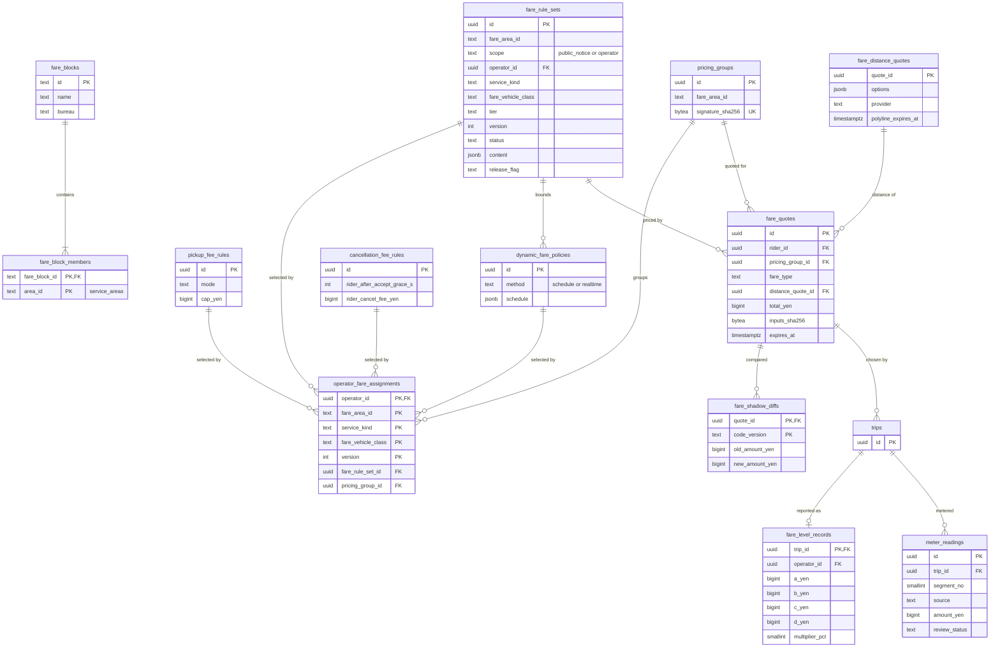

# Data model: 運賃

運賃ブロック、バージョンつきの運賃の規則、事業者の割り当てと価格の群、料金の規則、事前確定運賃の停止、見積もりと推計走行距離、変動運賃の水準、メーターの額、影の計算の差。振る舞いの正本は [pricing-and-fares.md](../pricing-and-fares.md)、決定は [ADR-0018](../../decisions/0018-versioned-fare-rules-and-integer-yen.md)・[ADR-0019](../../decisions/0019-meter-fare-sources.md)・[ADR-0020](../../decisions/0020-dynamic-fares-within-authorized-bands.md)・[ADR-0017](../../decisions/0017-fare-distance-for-pre-fixed-fares.md)。規約は [data-model.md](../data-model.md) の 3 節。

- 置き場所はすべて Aurora `core`。
- 区域の多角形は持たない。`fare_area_id` は `service_areas.area_id`（`kind` が `kotsuken` か `fare_zone`）を指す（[maps-and-areas.md](maps-and-areas.md)）。
- **規則は承認の後に書き換えない。** 誤りは次のバージョンで直す（PROP-FARE-006）。額・率・距離はすべて整数。係数は百分の一の整数（`_centi`）、倍率は百分率の整数（`_pct`）、手数料は基準点（`_bps`）。

## 1. ER 図

`platform_fee_rules`・`upfront_suspensions` は他の表を外部キーで指さないので図から外した。

## 2. 規則の表の共通の列

`fare_rule_sets`・`pickup_fee_rules`・`dynamic_fare_policies`・`cancellation_fee_rules`・`platform_fee_rules` は、次の列と制約を共通に持つ（下の各節では省く）。

| 列 | 型 | NULL | 既定 | 説明 |
| --- | --- | --- | --- | --- |
| `version` | `int` | NOT NULL | — | 同じ鍵の中で単調に増える |
| `effective_from` | `timestamptz` | NOT NULL | — | 地域の時刻（Asia/Tokyo）の 0 時で入れる |
| `effective_to` | `timestamptz` | NULL | — | NULL は終わりなし |
| `status` | `text` | NOT NULL | `'draft'` | `draft`・`approved`・`active`・`retired` |
| `legal_basis` | `text` | NOT NULL | — | 公示・認可の番号と日付、約款の条項 |
| `evidence_doc_id` | `uuid` | NULL | — | → `documents`（事業者の個別の認可は必須） |
| `release_flag` | `text` | NULL | — | 法務の確認待ちの規則の legal のフラグの名前（`legal.l2.dynamic_fare` など） |
| `created_by` | `uuid` | NOT NULL | — | → `staff_users` |
| `approved_by_1`・`approved_by_2` | `uuid` | NULL | — | 2 人の承認（1 人は運用、1 人は Dev か法務の窓口） |
| `approved_at` | `timestamptz` | NULL | — | |
| `change_request_id` | `uuid` | NULL | — | → `change_requests` |
| `created_at` | `timestamptz` | NOT NULL | `now()` | |

- CHECK：`status IN (...)`、`effective_to IS NULL OR effective_to > effective_from`、`status = 'draft' OR (approved_by_1 IS NOT NULL AND approved_by_2 IS NOT NULL AND approved_by_1 <> approved_by_2 AND approved_by_1 <> created_by)`、`release_flag IS NULL OR release_flag LIKE 'legal.%'`。
- トリガー `fare_rule_immutable`：`status <> 'draft'` の行は、`status`（`approved` → `active` → `retired`）と `effective_to`（終わりを入れるだけ）以外の更新と削除を拒否する。
- 排他：同じ鍵の `approved`・`active` の行の有効期間は重ならない（`EXCLUDE USING gist (... WITH =, tstzrange(effective_from, effective_to) WITH &&) WHERE (status IN ('approved','active'))`。`btree_gist` を使う）。
- 保持：消さない（見積もりと乗車がバージョンを指すため。10 年を超えて残す）。

## 3. テーブル

### 3.1 `fare_blocks`・`fare_block_members`

運賃ブロック（全国 101）と、属する交通圏。定義元：pricing の 4.1 節。

| 表 | 列 |
| --- | --- |
| `fare_blocks` | `id text` PK（例：`kanto-tokubetsuku-busan`）、`name text NOT NULL`、`bureau text NOT NULL`（運輸局）、`created_at` |
| `fare_block_members` | `fare_block_id text` FK、`area_id text`（`service_areas.area_id`、`kind = kotsuken`）、PK `(fare_block_id, area_id)`、UK `(area_id)`（交通圏は 1 つのブロックに属する） |

- 区域の参照は `check_area_ref` のトリガー（[data-model.md](../data-model.md) の 3.5 節）。S1 の量：数百行。

### 3.2 `fare_rule_sets`

バージョンつきの運賃の規則。定義元：pricing の 4.1・4.2 節。

| 列 | 型 | NULL | 既定 | 説明 |
| --- | --- | --- | --- | --- |
| `id` | `uuid` | NOT NULL | `uuidv7()` | |
| `fare_area_id` | `text` | NOT NULL | — | 交通圏か運賃の区域 |
| `scope` | `text` | NOT NULL | — | `public_notice`（公示・自動認可）・`operator`（事業者の個別の認可） |
| `operator_id` | `uuid` | NULL | — | `scope = operator` のとき |
| `service_kind` | `text` | NOT NULL | — | `taxi`・`rideshare` |
| `fare_vehicle_class` | `text` | NOT NULL | — | `standard`・`large`・`special_large`（運賃の車種の区分。車両の `fare_vehicle_class`） |
| `tier` | `text` | NOT NULL | — | `A`・`B`・`C`・`lower`・`upper_bound`・`lower_bound` など |
| 共通の列 | | | | 2 節 |
| `content` | `jsonb` | NOT NULL | — | `FareRuleContent`（pricing の 4.2 節）。Zod で検証してから書く。額・距離は整数、係数は `coefficientCenti` |
| `content_sha256` | `bytea` | NOT NULL | — | `content` の正規化した JSON の SHA-256 |

- キー：PK `(id)`。UK `(fare_area_id, scope, operator_id, service_kind, fare_vehicle_class, tier, version) NULLS NOT DISTINCT`。UK `(id, version)`（見積もりからの複合の参照）。
- 排他の鍵：`(fare_area_id, scope, coalesce(operator_id, '00000000-0000-0000-0000-000000000000'), service_kind, fare_vehicle_class, tier)`。
- CHECK：`(scope = 'operator') = (operator_id IS NOT NULL)`、`scope <> 'operator' OR status = 'draft' OR evidence_doc_id IS NOT NULL`。
- 索引：`(fare_area_id, service_kind, fare_vehicle_class, effective_from DESC) WHERE status IN ('approved','active')` — 有効なバージョンの読み込み（プロセスのメモリにバージョンごとに置く）。
- アクセス：事業者は自分の `scope = operator` の行と公示の行を読める（RLS の方針は `operator_id IS NULL OR operator_id = 現在の事業者`）。承認はできない。
- S1 の量：数百〜数千行。

### 3.3 `operator_fare_assignments`

事業者が選んだ運賃と料金の規則の組。組が同じ事業者は同じ価格の群に入る。定義元：pricing の 4.1・5.3 節。

| 列 | 型 | NULL | 既定 | 説明 |
| --- | --- | --- | --- | --- |
| `operator_id` | `uuid` | NOT NULL | — | |
| `fare_area_id` | `text` | NOT NULL | — | |
| `service_kind` | `text` | NOT NULL | — | |
| `fare_vehicle_class` | `text` | NOT NULL | — | |
| `version` | `int` | NOT NULL | — | |
| `fare_rule_set_id` | `uuid` | NOT NULL | — | → `fare_rule_sets`（A 運賃など） |
| `upfront_enabled` | `boolean` | NOT NULL | `false` | 事前確定運賃を出すか（認可が要る） |
| `dynamic_policy_id` | `uuid` | NULL | — | → `dynamic_fare_policies`（変動運賃の認可がある間は必須） |
| `pickup_fee_rule_id` | `uuid` | NOT NULL | — | → `pickup_fee_rules` |
| `cancellation_rule_id` | `uuid` | NOT NULL | — | → `cancellation_fee_rules` |
| `pricing_group_id` | `uuid` | NOT NULL | — | → `pricing_groups`（組から求める） |
| `effective_from` | `timestamptz` | NOT NULL | — | |
| `effective_to` | `timestamptz` | NULL | — | |
| `status` | `text` | NOT NULL | `'draft'` | `draft`・`active`・`retired` |
| `approved_by` | `uuid` | NULL | — | 審査の担当 |
| `created_at` | `timestamptz` | NOT NULL | `now()` | |

- キー：PK `(operator_id, fare_area_id, service_kind, fare_vehicle_class, version)`。
- 排他：同じ `(operator_id, fare_area_id, service_kind, fare_vehicle_class)` の `active` の期間は重ならない。
- CHECK：`service_kind <> 'rideshare' OR upfront_enabled`（日本版ライドシェアは事前確定が必須）。
- トリガー：`pricing_group_id` は、`(fare_rule_set_id, upfront_enabled, dynamic_policy_id, pickup_fee_rule_id, cancellation_rule_id)` の署名から `pricing_groups` を引いて入れる（手で入れない）。
- 索引：`(pricing_group_id) WHERE status = 'active'` — 群から事業者を引く（配車の候補の条件）。
- S1 の量：数百行。

### 3.4 `pricing_groups`

価格の群（同じ額を出す事業者の集まり）。pricing の 5.3 節の `pricing_group_id` の実体として、統合で最小の形を足した（[data-model.md](../data-model.md) の 10 節）。

| 列 | 型 | NULL | 既定 | 説明 |
| --- | --- | --- | --- | --- |
| `id` | `uuid` | NOT NULL | `uuidv7()` | |
| `fare_area_id` | `text` | NOT NULL | — | |
| `service_kind` | `text` | NOT NULL | — | |
| `fare_vehicle_class` | `text` | NOT NULL | — | |
| `signature_sha256` | `bytea` | NOT NULL | — | 割り当ての組（規則のバージョンの ID、事前確定の有無、変動の方針、迎車料金・キャンセル料の規則）の SHA-256 |
| `label_ja` | `text` | NOT NULL | — | 乗客のアプリの選択肢の名前（例：「タクシー」「タクシー（変動運賃の事業者）」） |
| `created_at` | `timestamptz` | NOT NULL | `now()` | |

- キー：PK `(id)`。UK `(fare_area_id, service_kind, fare_vehicle_class, signature_sha256)`。
- 行は割り当てのトリガーが作り、消さない（乗車と見積もりが指すため）。S1 の量：数十行。

### 3.5 `pickup_fee_rules`

迎車料金。定義元：pricing の 2.4・4.3・6.2 節、DT-FARE-003。

| 列 | 型 | NULL | 既定 | 説明 |
| --- | --- | --- | --- | --- |
| `id` | `uuid` | NOT NULL | `uuidv7()` | |
| `operator_id` | `uuid` | NOT NULL | — | |
| `fare_area_id` | `text` | NOT NULL | — | |
| 共通の列 | | | | 2 節 |
| `mode` | `text` | NOT NULL | — | `none`・`fixed`・`distance_tiered`・`dynamic`・`meter_from_dispatch` |
| `fixed_yen` | `bigint` | NULL | — | |
| `tiers` | `jsonb` | NULL | — | `[{ "up_to_m": 1000, "yen": 0 }, ...]` |
| `base_yen` | `bigint` | NULL | — | `dynamic`：基準料金額 |
| `cap_yen` | `bigint` | NULL | — | `dynamic`：1 回の上限（事業者の認可書の額。この基盤で計算しない） |
| `schedule` | `jsonb` | NULL | — | `dynamic`：曜日・時間帯ごとの額 |
| `averaging_period` | `text` | NULL | — | `dynamic`：平均を合わせる期間（`week`・`month`・`quarter`） |

- キー：PK `(id)`。UK `(operator_id, fare_area_id, version)`。
- CHECK：`(mode = 'fixed') = (fixed_yen IS NOT NULL)`、`(mode = 'distance_tiered') = (tiers IS NOT NULL)`、`mode <> 'dynamic' OR (base_yen IS NOT NULL AND cap_yen IS NOT NULL AND schedule IS NOT NULL AND cap_yen >= base_yen)`、`fixed_yen >= 0`。`schedule` の額が `cap_yen` を超えないことは承認の関数で確かめる。
- S1 の量：数百行。

### 3.6 `dynamic_fare_policies`

事前確定型変動運賃の方針。定義元：pricing の 4.3・6.1・6.3 節、[ADR-0020](../../decisions/0020-dynamic-fares-within-authorized-bands.md)。

| 列 | 型 | NULL | 既定 | 説明 |
| --- | --- | --- | --- | --- |
| `id` | `uuid` | NOT NULL | `uuidv7()` | |
| `operator_id` | `uuid` | NOT NULL | — | |
| `fare_area_id` | `text` | NOT NULL | — | |
| 共通の列 | | | | 2 節。`release_flag` は `legal.l2.dynamic_fare`（`realtime` は `legal.l9.dynamic_fare` も） |
| `method` | `text` | NOT NULL | `'schedule'` | `schedule`（S1）・`realtime`（L9 の後） |
| `schedule` | `jsonb` | NOT NULL | — | 曜日・時間帯 → 倍率（百分率の整数 50〜150） |
| `upper_bound_rule_set_id` | `uuid` | NOT NULL | — | 運賃ブロックの上限運賃（C の計算） |
| `lower_bound_rule_set_id` | `uuid` | NOT NULL | — | 下限運賃（D の計算） |
| `level_margin_pct` | `smallint` | NOT NULL | `3` | 水準の守りの余裕 |

- キー：PK `(id)`。UK `(operator_id, fare_area_id, version)`。FK 2 つ → `fare_rule_sets`。
- CHECK：`method IN ('schedule','realtime')`、`level_margin_pct BETWEEN 0 AND 50`。倍率の範囲（50〜150 の整数）は Zod と DT-FARE-005 で確かめる。
- S1 の量：数十行。

### 3.7 `cancellation_fee_rules`

キャンセル料と無断キャンセルの規則。定義元：pricing の 4.3 節、[trips-lifecycle.md](../trips-lifecycle.md) の 7 節。

| 列 | 型 | NULL | 既定 | 説明 |
| --- | --- | --- | --- | --- |
| `id` | `uuid` | NOT NULL | `uuidv7()` | |
| `operator_id` | `uuid` | NOT NULL | — | |
| `fare_area_id` | `text` | NOT NULL | — | |
| 共通の列 | | | | 2 節。キャンセル料の名目は法務の確認待ち（L2・L8） |
| `rider_after_accept_grace_s` | `int` | NOT NULL | `120` | |
| `rider_cancel_fee_yen` | `bigint` | NOT NULL | — | 既定は迎車料金と同額 |
| `no_show_wait_s` | `int` | NOT NULL | `300` | |
| `no_show_fee_yen` | `bigint` | NOT NULL | — | |
| `driver_late_threshold_s` | `int` | NOT NULL | `300` | |

- キー：PK `(id)`。UK `(operator_id, fare_area_id, version)`。CHECK：秒と額は 0 以上。S1 の量：数十行。

### 3.8 `platform_fee_rules`

この基盤の手配料と、事業者から受ける手数料。定義元：pricing の 4.3 節、[payments-and-payouts.md](../payments-and-payouts.md) の 8 節。

| 列 | 型 | NULL | 既定 | 説明 |
| --- | --- | --- | --- | --- |
| `id` | `uuid` | NOT NULL | `uuidv7()` | |
| `fare_area_id` | `text` | NOT NULL | — | |
| `service_kind` | `text` | NOT NULL | — | |
| 共通の列 | | | | 2 節 |
| `rider_fee_yen` | `bigint` | NOT NULL | `0` | 乗客から受ける手配料。L1 の結論まで 0 |
| `operator_fee_bps` | `int` | NOT NULL | — | 事業者から受ける手数料。乗車ごとに `floor(運賃 × bps / 10000)` |

- キー：PK `(id)`。UK `(fare_area_id, service_kind, version)`。
- CHECK：`rider_fee_yen = 0 OR release_flag IS NOT NULL`（L1 の関門）、`operator_fee_bps BETWEEN 0 AND 10000`。
- アクセス：事業者は自分の区域の行を読める（事業者に固有の行はない）。S1 の量：数十行。

### 3.9 `upfront_suspensions`

荒天・イベントで事前確定運賃を止める区域と期間。定義元：pricing の 5.2 節。

| 列 | 型 | NULL | 既定 | 説明 |
| --- | --- | --- | --- | --- |
| `id` | `uuid` | NOT NULL | `uuidv7()` | |
| `fare_area_id` | `text` | NOT NULL | — | |
| `starts_at`・`ends_at` | `timestamptz` | NOT NULL | — | |
| `reason` | `text` | NOT NULL | — | |
| `created_by` | `uuid` | NOT NULL | — | 運用の担当 |
| `created_at` | `timestamptz` | NOT NULL | `now()` | |
| `revoked_at` | `timestamptz` | NULL | — | |

- キー：PK `(id)`。CHECK：`ends_at > starts_at`。索引：`(fare_area_id, starts_at, ends_at) WHERE revoked_at IS NULL`。
- 保持：乗車の記録と同じ 7 年。S1 の量：年に数十行。

### 3.10 `fare_quotes`

見積もり（作ったら変えない）。**正確な位置を持たない**（入力のハッシュと `spot` のセルだけ）。定義元：pricing の 5.6 節。

| 列 | 型 | NULL | 既定 | 説明 |
| --- | --- | --- | --- | --- |
| `id` | `uuid` | NOT NULL | `uuidv7()` | 乗客の ID と組で確かめる（他人の見積もりで依頼できない） |
| `rider_id` | `uuid` | NOT NULL | — | |
| `city_id` | `text` | NOT NULL | — | |
| `pricing_group_id` | `uuid` | NOT NULL | — | |
| `fare_type` | `text` | NOT NULL | — | `meter`・`upfront`・`dynamic_upfront` |
| `route_option` | `text` | NULL | — | `shortest_distance`・`shortest_time` など（事前確定） |
| `toll_road` | `boolean` | NOT NULL | `false` | |
| `distance_quote_id` | `uuid` | NULL | — | → `fare_distance_quotes` |
| `route_option_id` | `text` | NULL | — | `fare_distance_quotes.options` の中の ID |
| `estimated_distance_m` | `int` | NULL | — | |
| `estimated_duration_s` | `int` | NULL | — | |
| `distance_provider` | `text` | NULL | — | |
| `map_version` | `text` | NULL | — | |
| `route_waypoints` | `jsonb` | NULL | — | 主要な経由地点の名前（旅客とドライバーに同じものを示す） |
| `pickup_spot_cell`・`dropoff_spot_cell` | `bigint` | NOT NULL / NULL | — | 入力の `spot` のセル（○。キャッシュの鍵と調べ） |
| `fare_rule_set_id` | `uuid` | NOT NULL | — | |
| `fare_rule_version` | `int` | NOT NULL | — | FK `(fare_rule_set_id, fare_rule_version)` → `fare_rule_sets (id, version)` |
| `pickup_fee_rule_id` | `uuid` | NOT NULL | — | |
| `dynamic_policy_id` | `uuid` | NULL | — | |
| `dynamic_multiplier_pct` | `smallint` | NULL | — | 50〜150 |
| `crosses_surcharge_boundary` | `boolean` | NOT NULL | `false` | 深夜の境をまたぐ |
| `lines` | `jsonb` | NOT NULL | — | 内訳（運賃・割増・割引・迎車料金・手配料・有料道路の目安）。行ごとに整数の円 |
| `total_yen` | `bigint` | NULL | — | 事前確定の総額（メーターは NULL） |
| `range_low_yen`・`range_high_yen` | `bigint` | NULL | — | メーターの目安（100 円単位） |
| `notices_version` | `text` | NULL | — | 示した注意事項のバージョン |
| `inputs_sha256` | `bytea` | NOT NULL | — | 入力の全体（位置を含む）のハッシュ |
| `created_at` | `timestamptz` | NOT NULL | `now()` | |
| `expires_at` | `timestamptz` | NOT NULL | — | 既定 作成 ＋ 5 分 |

- キー：PK `(id)`。FK `rider_id` → `rider_accounts`、`distance_quote_id` → `fare_distance_quotes`、`pricing_group_id` → `pricing_groups`。
- CHECK：`(fare_type = 'meter') = (total_yen IS NULL)`、`fare_type <> 'meter' OR (range_low_yen IS NOT NULL AND range_high_yen >= range_low_yen)`、`total_yen IS NULL OR total_yen % 10 = 0`（事前確定・変動は 10 円単位）、`(fare_type = 'dynamic_upfront') = (dynamic_multiplier_pct IS NOT NULL)`、`dynamic_multiplier_pct BETWEEN 50 AND 150`、`expires_at > created_at`、`((pickup_spot_cell >> 60) = 4)`。
- 索引：`(rider_id, created_at DESC)` — 乗客ごとの流量の制限の照合と調べ。`(created_at)` — 保持。
- 更新：なし（追記のみ）。
- 保持：乗車の記録と同じ 7 年（依頼に使われなかった見積もりは 90 日で消す）。S1 の量：1 日 約 200 万行（見積もり 90 件/秒のピーク）。

### 3.11 `fare_distance_quotes`

推計走行距離の提供者の応答。**持ち主は Pricing**（`fare-distance` が書く）。定義元：[eta-and-routing.md](../eta-and-routing.md) の 7.3・14 節、[ADR-0017](../../decisions/0017-fare-distance-for-pre-fixed-fares.md)。

| 列 | 型 | NULL | 既定 | 説明 |
| --- | --- | --- | --- | --- |
| `quote_id` | `uuid` | NOT NULL | `uuidv7()` | |
| `options` | `jsonb` | NOT NULL | — | `[{ "option_id", "distance_m", "duration_s", "uses_tolls", "major_waypoints": [名前] }]`（2 つ以上） |
| `provider` | `text` | NOT NULL | — | |
| `provider_map_version` | `text` | NOT NULL | — | |
| `chosen_option_id` | `text` | NULL | — | 乗客が選んだ経路 |
| `polylines` | `jsonb` | NULL | — | 表示用の線。提供者の条件の期間だけ |
| `polyline_expires_at` | `timestamptz` | NULL | — | |
| `computed_at` | `timestamptz` | NOT NULL | — | |
| `expires_at` | `timestamptz` | NOT NULL | — | 見積もりに使える期限 |

- キー：PK `(quote_id)`。
- CHECK：`jsonb_array_length(options) >= 2`（候補が 1 つなら事前確定運賃を出さないので行を作らない）、`(polylines IS NULL) OR (polyline_expires_at IS NOT NULL)`。
- 索引：`(polyline_expires_at) WHERE polylines IS NOT NULL` — 線の削除のジョブ。
- 保持：乗車の記録と同じ 7 年。線は `polyline_expires_at` で消す（法務の確認待ち（L3））。S1 の量：1 日 約 100 万行。

### 3.12 `fare_level_records`

変動運賃の乗車ごとの A〜D の額（公示の様式 2）。定義元：pricing の 6.3 節。

| 列 | 型 | NULL | 既定 | 説明 |
| --- | --- | --- | --- | --- |
| `trip_id` | `uuid` | NOT NULL | — | |
| `operator_id` | `uuid` | NOT NULL | — | |
| `fare_area_id` | `text` | NOT NULL | — | |
| `week_start_on` | `date` | NOT NULL | — | 週の始まり（月曜、Asia/Tokyo） |
| `a_yen` | `bigint` | NOT NULL | — | 収受した運賃（割増・割引の後。訂正の後の値） |
| `b_yen` | `bigint` | NOT NULL | — | 割増・割引の前 |
| `c_yen` | `bigint` | NOT NULL | — | 上限運賃で求めた事前確定運賃 |
| `d_yen` | `bigint` | NOT NULL | — | 下限運賃で求めた事前確定運賃 |
| `multiplier_pct` | `smallint` | NOT NULL | — | |
| `recomputed_at` | `timestamptz` | NULL | — | 訂正・返金で A を作り直した時刻 |
| `created_at` | `timestamptz` | NOT NULL | `now()` | |

- キー：PK `(trip_id)`。索引：`(operator_id, fare_area_id, week_start_on)` — 週次の集計と 3 か月の報告。
- CHECK：`d_yen <= c_yen`、`multiplier_pct BETWEEN 50 AND 150`、額は 0 以上。
- アクセス：事業者は自社の行だけ（RLS）。他の事業者の倍率・額を見せない（L9）。
- 保持：乗車の記録と同じ 7 年。S1 の量：変動運賃の事業者の乗車の数（1 日 最大 約 15 万行）。

### 3.13 `meter_readings`

メーターの額と受け取り方。定義元：pricing の 5.4 節、DT-FARE-004、[ADR-0019](../../decisions/0019-meter-fare-sources.md)。

| 列 | 型 | NULL | 既定 | 説明 |
| --- | --- | --- | --- | --- |
| `id` | `uuid` | NOT NULL | `uuidv7()` | |
| `trip_id` | `uuid` | NOT NULL | — | |
| `segment_no` | `smallint` | NOT NULL | — | |
| `operator_id` | `uuid` | NOT NULL | — | |
| `source` | `text` | NOT NULL | — | `integrated_meter`・`certified_soft_meter`・`driver_input` |
| `amount_yen` | `bigint` | NOT NULL | — | メーターの支払の額 |
| `distance_m` | `int` | NULL | — | |
| `duration_s` | `int` | NULL | — | |
| `device_id` | `text` | NULL | — | 機器の ID |
| `raw_seq` | `bigint` | NULL | — | 機器の連番（重複と抜けの検知） |
| `shadow_amount_yen` | `bigint` | NULL | — | 影の計算の額（**請求に使わない**） |
| `review_status` | `text` | NOT NULL | — | `auto_accepted`・`pending_review`・`accepted`・`rejected` |
| `review_reason` | `text` | NULL | — | DT-FARE-004 の行 |
| `photo_doc_id` | `uuid` | NULL | — | メーターの表示の写真（→ `documents`、`doc_type = meter_photo`） |
| `reviewed_by` | `uuid` | NULL | — | |
| `received_at` | `timestamptz` | NOT NULL | `now()` | |

- キー：PK `(id)`。UK `(trip_id, segment_no)`。部分一意：`UNIQUE (device_id, raw_seq) WHERE raw_seq IS NOT NULL`。
- 索引：`(received_at) WHERE review_status = 'pending_review'` — 保留の確認（24 時間以内）。
- CHECK：`amount_yen >= 0`、`source <> 'driver_input' OR shadow_amount_yen IS NOT NULL OR review_status = 'pending_review'`。
- 保持：乗車の記録と同じ 7 年。S1 の量：1 日 約 10 万行（メーターの乗車）。

### 3.14 `fare_shadow_diffs`

運賃の計算の影の実行の差（`fare-replay`）。定義元：[delivery.md](../delivery.md) の 3.2 節。

| 列 | 型 | NULL | 既定 | 説明 |
| --- | --- | --- | --- | --- |
| `quote_id` | `uuid` | NOT NULL | — | → `fare_quotes` |
| `code_version` | `text` | NOT NULL | — | 新しい計算のバージョン |
| `old_amount_yen`・`new_amount_yen` | `bigint` | NOT NULL | — | |
| `created_at` | `timestamptz` | NOT NULL | `now()` | |

- キー：PK `(quote_id, code_version)`。索引：`(created_at)`。
- 保持：30 日。S1 の量：影の実行の間だけ、1 日 最大 約 200 万行。
