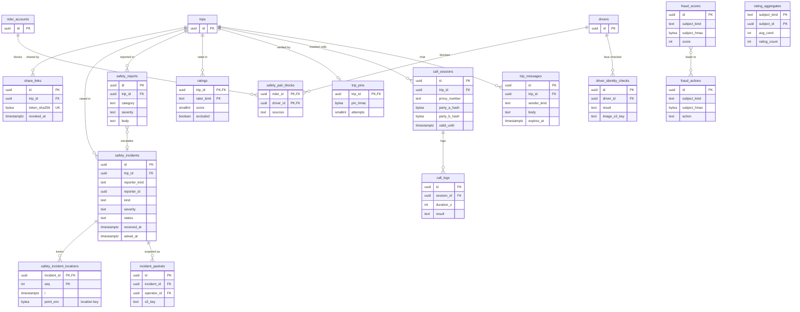

# Data model: 安全・連絡・不正

乗車の共有、緊急の通報と押した後の位置、安全の報告と事業者への書き出し、評価と拒否の組、乗る車の PIN、番号の中継と通話の記録、乗車の中のメッセージ、ドライバーの顔の照合、不正の点数と処置。振る舞いの正本は [safety-and-trust.md](../safety-and-trust.md)・[notifications-and-realtime-push.md](../notifications-and-realtime-push.md)・[security.md](../security.md) の 9 節、決定は [ADR-0028](../../decisions/0028-emergency-share-trip-and-incident-flow.md)・[ADR-0029](../../decisions/0029-masked-communications-identity-and-ratings.md)・[ADR-0036](../../decisions/0036-location-privacy-keys-retention-and-audited-access.md)・[ADR-0037](../../decisions/0037-authentication-device-integrity-and-fraud-response.md)。規約は [data-model.md](../data-model.md) の 3 節。

- 置き場所はすべて Aurora `core`。
- 法務の確認待ちの機能は、行を作る前に legal のフラグで止める：乗車の共有（`legal.l4.share_trip`）、顔の照合（`legal.l4.driver_face_check`）。**緊急の通報の表は、どのフラグにも依らずに書ける。**
- 報告の本文・通話の記録・メッセージの本文の閲覧は、`jit_grants`（位置は `location_access_grants`）の中だけ（[operations-and-governance.md](operations-and-governance.md)）。

## 1. ER 図

## 2. 安全

### 2.1 `share_links`

乗車の共有のリンク（`legal.l4.share_trip` の裏）。トークンはハッシュだけ。定義元：safety の 3 節。

| 列 | 型 | NULL | 既定 | 説明 |
| --- | --- | --- | --- | --- |
| `id` | `uuid` | NOT NULL | `uuidv7()` | |
| `trip_id` | `uuid` | NOT NULL | — | |
| `created_by_kind` | `text` | NOT NULL | — | `rider`・`driver` |
| `created_by` | `uuid` | NOT NULL | — | |
| `token_sha256` | `bytea` | NOT NULL | — | 128 ビットの乱数のトークンの SHA-256 |
| `created_at` | `timestamptz` | NOT NULL | `now()` | |
| `revoked_at` | `timestamptz` | NULL | — | |
| `expires_at` | `timestamptz` | NULL | — | 乗車の終わり ＋ 24 時間（終わった時に入れる） |

- キー：PK `(id)`。UK `(token_sha256)`。索引：`(trip_id)`。
- CHECK：1 乗車に最大 5 本（トリガーで数える）。
- 保持：`expires_at` の後 30 日で消す。**位置を持たない**（ページは `GetDriverLocation` で読み、保存しない）。S1 の量：1 日 数万行。

### 2.2 `safety_incidents`

緊急の通報・異常の検知・重い報告のインシデント。定義元：safety の 4・8・10 節、[ADR-0028](../../decisions/0028-emergency-share-trip-and-incident-flow.md)。

| 列 | 型 | NULL | 既定 | 説明 |
| --- | --- | --- | --- | --- |
| `id` | `uuid` | NOT NULL | `uuidv7()` | `SafetyIncident` の ID |
| `client_incident_id` | `uuid` | NULL | — | 端末が作る。送り直しの冪等 |
| `trip_id` | `uuid` | NULL | — | 乗車の外の押下もありうる |
| `operator_id` | `uuid` | NULL | — | 乗車の事業者（知らせる先） |
| `reporter_kind` | `text` | NOT NULL | — | `rider`・`driver`・`system` |
| `reporter_id` | `uuid` | NULL | — | |
| `kind` | `text` | NOT NULL | — | `emergency_call`・`emergency_ops`・`anomaly_long_stop`・`anomaly_deviation`・`anomaly_signal_loss`・`anomaly_pickup_stall`・`report` |
| `call_target` | `text` | NULL | — | `110`・`119`（`emergency_call`） |
| `severity` | `text` | NOT NULL | — | `S1`〜`S4` |
| `status` | `text` | NOT NULL | `'open'` | `open`・`acked`・`closed` |
| `assigned_to` | `uuid` | NULL | — | 安全の担当 |
| `received_at` | `timestamptz` | NOT NULL | `now()` | |
| `acked_at` | `timestamptz` | NULL | — | NFR-010 の計測（受信から p95 30 秒） |
| `paged_at` | `timestamptz` | NULL | — | 30 秒で当番を呼んだ時刻 |
| `follow_up_at` | `timestamptz` | NULL | — | 20 分後の確かめ |
| `operator_notified_at` | `timestamptz` | NULL | — | 1 時間以内に事業者へ |
| `closed_at` | `timestamptz` | NULL | — | |
| `outcome` | `text` | NULL | — | `mistap`・`resolved`・`police`・`ambulance`・`accident` |
| `device_battery_pct` | `smallint` | NULL | — | |

- キー：PK `(id)`。部分一意：`UNIQUE (reporter_kind, reporter_id, client_incident_id) WHERE client_incident_id IS NOT NULL`。
- 索引：`(received_at) WHERE status = 'open'` — 担当の画面の先頭と、30 秒の呼び出しの判定。`(trip_id)`。`(operator_id, received_at)`（RLS。事業者は自社の乗車のインシデントの要約だけ）。
- CHECK：`(status = 'closed') = (closed_at IS NOT NULL AND outcome IS NOT NULL)`、`(kind = 'emergency_call') = (call_target IS NOT NULL)`。
- **位置の列を持たない。** 押した時と押した後の位置は `safety_incident_locations`。
- 保持：既定 3 年（法務の確認待ち（L7））。S1 の量：1 日 数十〜数百行。

### 2.3 `safety_incident_locations`

押した後 30 分・10 秒ごとの位置（押した人の端末から）。**列の暗号化（`location` の鍵）。** 定義元：safety の 4.1 節、[security.md](../security.md) の 5.3 節。

| 列 | 型 | NULL | 既定 | 説明 |
| --- | --- | --- | --- | --- |
| `incident_id` | `uuid` | NOT NULL | — | |
| `seq` | `int` | NOT NULL | — | 端末の送信の番号（冪等） |
| `t` | `timestamptz` | NOT NULL | — | 位置の時刻 |
| `point_enc` | `bytea` | NOT NULL | — | `lat_e7`・`lng_e7`・精度を AWS Encryption SDK で暗号化した値（◎） |
| `received_at` | `timestamptz` | NOT NULL | `now()` | |

- キー：PK `(incident_id, seq)`。
- アクセス：`safety_svc` が書く。読むのは `trail-viewer` の窓口だけ（インシデントの ID の `location_access_grants` と監査）。`location` の鍵は他のロールに使わせない。
- 保持：インシデントと同じ既定 3 年（法務の確認待ち（L7））。S1 の量：1 件あたり最大 180 行。

### 2.4 `safety_reports`

問題の報告（乗車中の気づかれない報告と、降車の後 30 日まで）。定義元：safety の 8.1 節。

| 列 | 型 | NULL | 既定 | 説明 |
| --- | --- | --- | --- | --- |
| `id` | `uuid` | NOT NULL | `uuidv7()` | |
| `trip_id` | `uuid` | NOT NULL | — | |
| `reporter_kind` | `text` | NOT NULL | — | `rider`・`driver` |
| `reporter_id` | `uuid` | NOT NULL | — | |
| `category` | `text` | NOT NULL | — | `violence`・`sexual_misconduct`・`dangerous_driving`・`discrimination`・`accident`・`intoxication`・`rude`・`route`・`vehicle_condition`・`lost_item`・`fare`・`other` |
| `severity` | `text` | NOT NULL | — | `S1`〜`S4` |
| `during_trip` | `boolean` | NOT NULL | — | 乗車中の報告 |
| `body` | `text` | NULL | — | 本文（安全の担当の限られたロールだけ） |
| `incident_id` | `uuid` | NULL | — | S1・S2 で作ったインシデント |
| `status` | `text` | NOT NULL | `'open'` | `open`・`in_progress`・`closed` |
| `created_at` | `timestamptz` | NOT NULL | `now()` | |
| `closed_at` | `timestamptz` | NULL | — | |

- キー：PK `(id)`。索引：`(severity, created_at) WHERE status <> 'closed'`。`(trip_id)`。
- 更新：S1・S2 の報告は、同じトランザクションで `safety_pair_blocks` に組を入れる（`source = report`）。
- 保持：インシデントと同じ既定 3 年（2026-09-28 に既定を置いた。法務の確認待ち（L7）。[security.md](../security.md) の 7.2 節）。S1 の量：1 日 数百行。

### 2.5 `incident_packets`

事業者へのインシデントの書き出し。定義元：safety の 8.2 節。

| 列 | 型 | NULL | 既定 | 説明 |
| --- | --- | --- | --- | --- |
| `id` | `uuid` | NOT NULL | `uuidv7()` | |
| `incident_id` | `uuid` | NOT NULL | — | |
| `operator_id` | `uuid` | NOT NULL | — | |
| `s3_key` | `text` | NOT NULL | — | S3 `incident-packets/`（`location` の鍵。軌跡を含むため） |
| `footage_preservation_requested` | `boolean` | NOT NULL | `false` | 事業者の映像の保存を依頼したか |
| `created_by` | `uuid` | NOT NULL | — | 安全の担当 |
| `created_at` | `timestamptz` | NOT NULL | `now()` | |
| `delivered_at` | `timestamptz` | NULL | — | 24 時間以内 |

- キー：PK `(id)`。索引：`(operator_id, created_at)`（RLS）。
- 保持：インシデントと同じ（L7）。S1 の量：月に 数十行。

### 2.6 `driver_identity_checks`

ドライバーの顔の照合の結果（`legal.l4.driver_face_check` の裏）。**顔の特徴の値（テンプレート）を持たない。** 画像は S3 に 30 日（`biometric` の鍵）。定義元：safety の 7.2・12 節。

| 列 | 型 | NULL | 既定 | 説明 |
| --- | --- | --- | --- | --- |
| `id` | `uuid` | NOT NULL | `uuidv7()` | |
| `driver_id` | `uuid` | NOT NULL | — | |
| `operator_id` | `uuid` | NOT NULL | — | |
| `driver_session_id` | `uuid` | NULL | — | |
| `check_trigger` | `text` | NOT NULL | — | `first_of_day`・`random` |
| `result` | `text` | NOT NULL | — | `match`・`no_match`・`inconclusive` |
| `score_bp` | `int` | NULL | — | 提供者の点数（1 万分の 1） |
| `provider` | `text` | NOT NULL | — | |
| `checked_at` | `timestamptz` | NOT NULL | `now()` | |
| `image_s3_key` | `text` | NULL | — | 30 日で消し、NULL にする |
| `image_expires_at` | `timestamptz` | NOT NULL | — | 撮影 ＋ 30 日 |

- キー：PK `(id)`。索引：`(driver_id, checked_at DESC)` — 2 回続く不一致の判定と、その日の最初の出庫の判定。`(image_expires_at) WHERE image_s3_key IS NOT NULL`。
- CHECK：`score_bp BETWEEN 0 AND 10000`。
- 保持：結果の行は 1 年（2026-09-28 に既定を置いた。法務の確認待ち（L4））。S1 の量：1 日 約 2 万行。

## 3. 信頼と連絡

### 3.1 `ratings`

双方向の評価（1〜5）。定義元：safety の 7.1 節、[ADR-0029](../../decisions/0029-masked-communications-identity-and-ratings.md)。

| 列 | 型 | NULL | 既定 | 説明 |
| --- | --- | --- | --- | --- |
| `trip_id` | `uuid` | NOT NULL | — | |
| `rater_kind` | `text` | NOT NULL | — | `rider`・`driver` |
| `rater_id` | `uuid` | NOT NULL | — | |
| `ratee_id` | `uuid` | NOT NULL | — | 相手 |
| `score` | `smallint` | NOT NULL | — | 1〜5 |
| `tags` | `text[]` | NOT NULL | `'{}'` | 理由の札 |
| `comment` | `text` | NULL | — | 200 文字まで。ドライバーへの文は事業者と運用だけが読む |
| `excluded` | `boolean` | NOT NULL | `false` | 平均から外す |
| `excluded_reason` | `text` | NULL | — | `platform_fault`・`external_cause` |
| `excluded_by` | `uuid` | NULL | — | |
| `created_at` | `timestamptz` | NOT NULL | `now()` | 降車から 7 日まで |

- キー：PK `(trip_id, rater_kind)`。索引：`(ratee_id, created_at DESC) WHERE NOT excluded` — 直近 100 の平均。
- CHECK：`score BETWEEN 1 AND 5`、`char_length(comment) <= 200`、`excluded = (excluded_reason IS NOT NULL)`。
- 更新：2 以下の評価は、同じトランザクションで `safety_pair_blocks` に組を入れる（`source = rating`）。
- 保持：乗車の記録と同じ 7 年（法務の確認待ち（L4））。S1 の量：1 日 約 20 万行。

### 3.2 `rating_aggregates`

評価の平均（直近の窓）。定義元：safety の 7.1 節。

| 列 | 型 | NULL | 既定 | 説明 |
| --- | --- | --- | --- | --- |
| `subject_kind` | `text` | NOT NULL | — | `driver`・`rider` |
| `subject_id` | `uuid` | NOT NULL | — | |
| `avg_centi` | `int` | NULL | — | 平均 × 100（小数 2 桁）。5 件未満は NULL |
| `rating_count` | `int` | NOT NULL | `0` | 窓の中の件数 |
| `window_size` | `smallint` | NOT NULL | — | ドライバー 100、乗客の注意の判定は 50 |
| `updated_at` | `timestamptz` | NOT NULL | `now()` | |

- キー：PK `(subject_kind, subject_id)`。CHECK：`avg_centi BETWEEN 100 AND 500`、`(rating_count >= 5) = (avg_centi IS NOT NULL)`（5 件未満は出さない）。
- 保持：アカウントとドライバーの行と同じ。S1 の量：約 300 万行。

### 3.3 `safety_pair_blocks`

二度と配車しない乗客とドライバーの組。配車の E7 は組の存在だけを読み、理由を読まない。定義元：safety の 7.1・8.1 節、[security.md](../security.md) の 9 節。

| 列 | 型 | NULL | 既定 | 説明 |
| --- | --- | --- | --- | --- |
| `rider_id` | `uuid` | NOT NULL | — | |
| `driver_id` | `uuid` | NOT NULL | — | |
| `sources` | `text[]` | NOT NULL | — | `rating`・`report`・`manual`・`fraud` |
| `source_refs` | `jsonb` | NOT NULL | `'[]'` | 元の評価・報告・処置の ID |
| `created_at` | `timestamptz` | NOT NULL | `now()` | |
| `updated_at` | `timestamptz` | NOT NULL | `now()` | |

- キー：PK `(rider_id, driver_id)`。索引：`(driver_id)`（配車の除外の写し）。
- 保持：乗客かドライバーの行が消えるまで。S1 の量：数十万行。

### 3.4 `trip_pins`

乗る車の確認の 4 桁の PIN（日本版ライドシェアは必須）。定義元：safety の 5 節。

| 列 | 型 | NULL | 既定 | 説明 |
| --- | --- | --- | --- | --- |
| `trip_id` | `uuid` | NOT NULL | — | |
| `pin_hmac` | `bytea` | NOT NULL | — | PIN の HMAC（平文は乗客のアプリに 1 回返すだけ） |
| `attempts` | `smallint` | NOT NULL | `0` | 3 回違えば乗車を始められない |
| `locked_at` | `timestamptz` | NULL | — | |
| `created_at` | `timestamptz` | NOT NULL | `now()` | |

- キー：PK `(trip_id)`。CHECK：`attempts BETWEEN 0 AND 3`。
- 保持：乗車の終わりで消す。S1 の量：同時に 数千行。

### 3.5 `call_sessions`

番号の中継のセッション。鍵は `(中継の番号, 発信の番号)`。定義元：safety の 6.1 節。

| 列 | 型 | NULL | 既定 | 説明 |
| --- | --- | --- | --- | --- |
| `id` | `uuid` | NOT NULL | `uuidv7()` | |
| `kind` | `text` | NOT NULL | — | `trip`（乗客とドライバー）・`ops`（運用の回線） |
| `trip_id` | `uuid` | NULL | — | |
| `proxy_number` | `text` | NOT NULL | — | 050 の中継の番号（E.164） |
| `party_a_hash` | `bytea` | NOT NULL | — | 乗客（か担当）の番号の HMAC |
| `party_b_hash` | `bytea` | NOT NULL | — | ドライバー（か相手）の番号の HMAC |
| `party_a_last4`・`party_b_last4` | `text` | NOT NULL | — | 表示用 |
| `staff_id` | `uuid` | NULL | — | 運用の回線の担当 |
| `reason_ref` | `text` | NULL | — | 運用の回線のチケット・インシデントの ID（必須） |
| `valid_from` | `timestamptz` | NOT NULL | — | 受諾 |
| `valid_until` | `timestamptz` | NOT NULL | — | 降車・取り消しの 30 分後（終わりで入れ直す） |
| `created_at` | `timestamptz` | NOT NULL | `now()` | |

- キー：PK `(id)`。
- 索引：`(proxy_number, party_a_hash, valid_until)`・`(proxy_number, party_b_hash, valid_until)` — 着信の時の引き当て。`(trip_id)`。
- CHECK：`valid_until > valid_from`、`kind <> 'ops' OR (staff_id IS NOT NULL AND reason_ref IS NOT NULL)`。
- 保持：記録と同じ 90 日。S1 の量：1 日 約 15 万行。

### 3.6 `call_logs`

通話の記録（中身ではなく記録。録音しない）。定義元：safety の 6.1 節。

| 列 | 型 | NULL | 既定 | 説明 |
| --- | --- | --- | --- | --- |
| `id` | `uuid` | NOT NULL | `uuidv7()` | |
| `session_id` | `uuid` | NULL | — | 引き当てできなかった発信は NULL |
| `proxy_number` | `text` | NOT NULL | — | |
| `direction` | `text` | NOT NULL | — | `a_to_b`・`b_to_a` |
| `caller_last4` | `text` | NULL | — | |
| `started_at` | `timestamptz` | NOT NULL | — | |
| `duration_s` | `int` | NOT NULL | `0` | |
| `result` | `text` | NOT NULL | — | `connected`・`no_answer`・`rejected_unregistered`・`rejected_expired`・`failed` |
| `provider_call_ref` | `text` | NULL | — | |

- キー：PK `(id)`。索引：`(session_id)`、`(started_at)`。
- 保持：90 日。S1 の量：1 日 約 5 万行。

### 3.7 `trip_messages`

乗車の中のメッセージ（定型文と 200 文字の文。電話番号・URL は送る前に伏せ字）。持ち主は notifications。定義元：[notifications-and-realtime-push.md](../notifications-and-realtime-push.md) の 11・15 節、safety の 6.2 節。

| 列 | 型 | NULL | 既定 | 説明 |
| --- | --- | --- | --- | --- |
| `id` | `uuid` | NOT NULL | `uuidv7()` | |
| `trip_id` | `uuid` | NOT NULL | — | |
| `sender_kind` | `text` | NOT NULL | — | `rider`・`driver` |
| `sender_id` | `uuid` | NOT NULL | — | |
| `template_id` | `text` | NULL | — | 定型文 |
| `body` | `text` | NULL | — | 伏せ字の後の文 |
| `created_at` | `timestamptz` | NOT NULL | `now()` | |
| `expires_at` | `timestamptz` | NULL | — | 乗車の終わり ＋ 30 日（終わった時に入れる） |

- キー：PK `(id)`。索引：`(trip_id, created_at)`、`(expires_at)`。
- CHECK：`(template_id IS NOT NULL) OR (body IS NOT NULL)`、`char_length(body) <= 200`。
- 保持：乗車の終わりから 30 日（法務の確認待ち（L4・L7））。S1 の量：1 日 約 30 万行。

## 4. 不正

### 4.1 `fraud_scores`

主体ごとの不正の点数。主体の識別子は HMAC だけ。定義元：[security.md](../security.md) の 9・14 節。

| 列 | 型 | NULL | 既定 | 説明 |
| --- | --- | --- | --- | --- |
| `id` | `uuid` | NOT NULL | `uuidv7()` | |
| `subject_kind` | `text` | NOT NULL | — | `driver`・`rider`・`device`・`card_fingerprint` |
| `subject_hmac` | `bytea` | NOT NULL | — | 主体の ID の HMAC（`pii` の鍵の HMAC） |
| `score_window` | `text` | NOT NULL | — | `daily`・`burst_10m` |
| `score` | `int` | NOT NULL | — | 0〜1000 |
| `signals` | `text[]` | NOT NULL | — | 理由のコード（`mock_location`・`integrity_fail`・`jump_rate`・`clock_skew`・`pair_repeat` など） |
| `computed_at` | `timestamptz` | NOT NULL | — | |

- キー：PK `(id)`。UK `(subject_kind, subject_hmac, score_window, computed_at)`。索引：`(score DESC, computed_at) WHERE score >= 700` — 運用の確認の一覧。
- 保持：1 年（2026-09-28 に既定を置いた。[security.md](../security.md) の 7.2 節）。S1 の量：1 日 約 5 万行。

### 4.2 `fraud_actions`

不正の処置（自動は配車の候補・特典から外すまで。停止は人が決める）。定義元：security の 9 節、[ADR-0037](../../decisions/0037-authentication-device-integrity-and-fraud-response.md)。

| 列 | 型 | NULL | 既定 | 説明 |
| --- | --- | --- | --- | --- |
| `id` | `uuid` | NOT NULL | `uuidv7()` | |
| `subject_kind` | `text` | NOT NULL | — | |
| `subject_hmac` | `bytea` | NOT NULL | — | |
| `action` | `text` | NOT NULL | — | 自動：`exclude_from_dispatch`・`block_promo`・`pair_block`・`require_3ds`・`hold_fare`。人：`suspend_requested`・`suspend_released` |
| `by_kind` | `text` | NOT NULL | — | `auto`・`staff` |
| `by_id` | `uuid` | NULL | — | |
| `reason` | `text` | NOT NULL | — | 理由のコードと点数の ID |
| `created_at` | `timestamptz` | NOT NULL | `now()` | |
| `revoked_at` | `timestamptz` | NULL | — | |

- キー：PK `(id)`。
- CHECK：`by_kind = 'staff' OR action IN ('exclude_from_dispatch','block_promo','pair_block','require_3ds','hold_fare')`（自動で停止しない）、`by_kind <> 'staff' OR by_id IS NOT NULL`。
- 保持：監査ログと同じ（Aurora に 1 年、その後は `audit_events` の写しで 7 年）。S1 の量：1 日 数百行。
