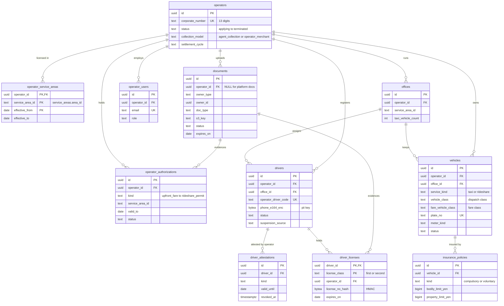
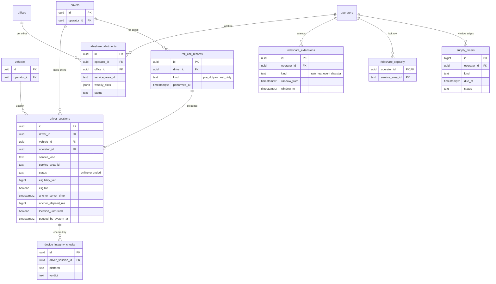

# Data model: 供給と事業者

事業者・営業所・車両・ドライバー・書類・保険・事業者の利用者（登録）と、出庫のセッション・点呼・端末の完全性・日本版ライドシェアの運行枠（稼働）。振る舞いの正本は [supply-and-operators.md](../supply-and-operators.md)、決定は [ADR-0026](../../decisions/0026-supply-registry-and-document-verification.md)・[ADR-0027](../../decisions/0027-rideshare-operating-windows.md)・[ADR-0037](../../decisions/0037-authentication-device-integrity-and-fraud-response.md)。規約は [data-model.md](../data-model.md) の 3 節。

- 置き場所はすべて Aurora `core`。Trips の提案の検査が、同じトランザクションでこの表を読む（[ADR-0038](../../decisions/0038-compute-on-fargate-and-data-stores.md)）。
- **すべての表が `operator_id` を持ち、RLS で事業者ごとに分ける**（[data-model.md](../data-model.md) の 3.3 節）。子の表も親を結合せずに絞れるよう、自分で `operator_id` を持つ。
- **白タクの経路を作らない**：ドライバー・車両・セッションは、事業者の行を指す複合の外部キー `(id, operator_id)` を持つ。ドライバーのアプリの DB ロールは、この領域の表に `INSERT` の権限を持たない（[data-model.md](../data-model.md) の 5 節）。

## 1. ER 図

### 1.1 登録

### 1.2 出庫と運行枠

## 2. テーブル（登録）

### 2.1 `operators`

タクシー事業者。定義元：[supply-and-operators.md](../supply-and-operators.md) の 3・3.1 節。

| 列 | 型 | NULL | 既定 | 説明 |
| --- | --- | --- | --- | --- |
| `id` | `uuid` | NOT NULL | `uuidv7()` | この表では `id` が RLS の `operator_id` に当たる |
| `legal_name` | `text` | NOT NULL | — | 法人名 |
| `corporate_number` | `text` | NOT NULL | — | 法人番号 13 桁 |
| `taxi_business_permit_no` | `text` | NOT NULL | — | 一般乗用旅客自動車運送事業の許可の番号 |
| `invoice_registration_no` | `text` | NULL | — | 適格請求書の登録番号（`T` ＋ 13 桁） |
| `status` | `text` | NOT NULL | `'applying'` | `applying`・`reviewing`・`active`・`suspended`・`terminated` |
| `contract_version` | `text` | NULL | — | 代理受領権の付与を含む契約のバージョン |
| `contract_signed_at` | `timestamptz` | NULL | — | |
| `collection_model` | `text` | NOT NULL | `'agent_collection'` | `agent_collection`・`operator_merchant`（[ADR-0024](../../decisions/0024-fare-collection-model.md)） |
| `settlement_cycle` | `text` | NOT NULL | `'semi_monthly'` | `semi_monthly`・`weekly`・`monthly` |
| `taxi_roll_call_required` | `boolean` | NOT NULL | `false` | タクシーの点呼の記録を出庫の必須にするか（supply の 4.1 節） |
| `created_at`・`updated_at` | `timestamptz` | NOT NULL | `now()` | |

- キー：PK `(id)`。UK `(corporate_number)`。
- CHECK：`status IN (...)`、`corporate_number ~ '^[0-9]{13}$'`、`invoice_registration_no ~ '^T[0-9]{13}$'`、`status <> 'active' OR contract_signed_at IS NOT NULL`。
- 更新：`status` を `active` にするのは、審査の 2 人の承認の後（`change_requests` は使わず、supply の審査の画面で `approved_by` を監査ログに残す）。
- 保持：取引の終了（`terminated`）から帳簿と同じ 10 年（精算の相手のため）。S1 の量：数十行。

### 2.2 `operator_service_areas`

事業者の営業区域。定義元：supply の 3 節。

| 列 | 型 | NULL | 既定 | 説明 |
| --- | --- | --- | --- | --- |
| `operator_id` | `uuid` | NOT NULL | — | → `operators` |
| `service_area_id` | `text` | NOT NULL | — | `service_areas.area_id`（`kind = eigyo_kuiki`、ライドシェアは `rideshare_zone`） |
| `permit_evidence_doc_id` | `uuid` | NULL | — | → `documents` |
| `effective_from` | `date` | NOT NULL | — | |
| `effective_to` | `date` | NULL | — | NULL は現在も有効 |

- キー：PK `(operator_id, service_area_id, effective_from)`。区域はバージョンつきなので外部キーを張れない。区域の参照はトリガー `check_area_ref(area_id, kinds)` で確かめる（[data-model.md](../data-model.md) の 3.5 節）。
- 排他：`EXCLUDE USING gist (operator_id WITH =, service_area_id WITH =, daterange(effective_from, effective_to) WITH &&)`。
- 索引：`(service_area_id)` — 区域から事業者を引く（配車の E4 の写しの作成）。
- S1 の量：数十行。

### 2.3 `operator_authorizations`

事前確定運賃・変動運賃・変動迎車料金の認可と、日本版ライドシェアの許可。定義元：supply の 3・3.1 節、[ADR-0043](../../decisions/0043-flag-taxonomy-legal-gates-and-safety-defaults.md)。

| 列 | 型 | NULL | 既定 | 説明 |
| --- | --- | --- | --- | --- |
| `id` | `uuid` | NOT NULL | `uuidv7()` | |
| `operator_id` | `uuid` | NOT NULL | — | |
| `kind` | `text` | NOT NULL | — | `upfront_fare`・`dynamic_upfront_fare`・`dynamic_pickup_fee`・`rideshare_permit` |
| `service_area_id` | `text` | NOT NULL | — | 認可・許可の区域（交通圏か営業区域） |
| `authorization_no` | `text` | NOT NULL | — | |
| `valid_from`・`valid_to` | `date` | NOT NULL | — | ライドシェアの許可は 2 年 |
| `evidence_doc_id` | `uuid` | NOT NULL | — | → `documents`（写しがなければ承認できない） |
| `status` | `text` | NOT NULL | `'pending_review'` | `pending_review`・`active`・`expired`・`revoked` |
| `approved_by_1`・`approved_by_2` | `uuid` | NULL | — | → `staff_users`（2 人） |
| `created_at`・`updated_at` | `timestamptz` | NOT NULL | `now()` | |

- キー：PK `(id)`。部分一意：`UNIQUE (operator_id, kind, service_area_id) WHERE status = 'active'`。
- CHECK：`valid_to > valid_from`、`status <> 'active' OR (approved_by_1 IS NOT NULL AND approved_by_2 IS NOT NULL AND approved_by_1 <> approved_by_2)`。
- 索引：`(valid_to) WHERE status = 'active'` — 期限の 60・30 日前の通知と、期限切れの日次のジョブ。
- 保持：取引の終了から 10 年。S1 の量：数百行。

### 2.4 `offices`

営業所。定義元：supply の 3 節。

| 列 | 型 | NULL | 既定 | 説明 |
| --- | --- | --- | --- | --- |
| `id` | `uuid` | NOT NULL | `uuidv7()` | |
| `operator_id` | `uuid` | NOT NULL | — | |
| `name` | `text` | NOT NULL | — | |
| `address` | `text` | NOT NULL | — | 事業所の住所（個人の住所ではない） |
| `service_area_id` | `text` | NOT NULL | — | 営業所の営業区域 |
| `operations_managers` | `jsonb` | NOT NULL | `'[]'` | 運行管理者の氏名と資格の番号（個人の情報。事業者と審査の担当だけ） |
| `taxi_vehicle_count` | `int` | NOT NULL | `0` | 事業用自動車の台数（使用可能車両数の上限の判定） |
| `status` | `text` | NOT NULL | `'active'` | `active`・`closed` |
| `created_at`・`updated_at` | `timestamptz` | NOT NULL | `now()` | |

- キー：PK `(id)`。UK `(id, operator_id)`（複合の外部キーの先）。
- CHECK：`taxi_vehicle_count >= 0`。S1 の量：数百行。

### 2.5 `vehicles`

車両。定義元：supply の 3 節、[ADR-0019](../../decisions/0019-meter-fare-sources.md)。

| 列 | 型 | NULL | 既定 | 説明 |
| --- | --- | --- | --- | --- |
| `id` | `uuid` | NOT NULL | `uuidv7()` | |
| `operator_id` | `uuid` | NOT NULL | — | |
| `office_id` | `uuid` | NOT NULL | — | |
| `service_kind` | `text` | NOT NULL | — | `taxi`（事業用）・`rideshare`（自家用） |
| `owner_driver_id` | `uuid` | NULL | — | rideshare：車の持ち主のドライバー |
| `plate_no` | `text` | NOT NULL | — | 車両の番号。乗客とプッシュの文言に出す |
| `vehicle_class` | `text` | NOT NULL | — | 配車の車両の種類：`standard`・`large`・`ud`・`premium`（索引の `VehicleClass`） |
| `fare_vehicle_class` | `text` | NOT NULL | — | 運賃の車種の区分：`standard`（普通車）・`large`（大型車）・`special_large`（特定大型車）。運賃の規則の鍵（[pricing.md](pricing.md)） |
| `seats` | `smallint` | NOT NULL | — | 乗客の席の数 |
| `make_model`・`color` | `text` | NOT NULL | — | |
| `photo_doc_id` | `uuid` | NULL | — | 乗客に見せる車の写真（→ `documents`） |
| `meter_kind` | `text` | NOT NULL | — | `integrated`・`certified_soft`・`none` |
| `meter_device_id` | `text` | NULL | — | |
| `status` | `text` | NOT NULL | `'pending_review'` | `pending_review`・`active`・`suspended`・`retired` |
| `created_at`・`updated_at` | `timestamptz` | NOT NULL | `now()` | |

- キー：PK `(id)`。UK `(id, operator_id)`。UK `(plate_no)`。FK `(office_id, operator_id)` → `offices (id, operator_id)`、`(owner_driver_id, operator_id)` → `drivers (id, operator_id)`。
- CHECK：`service_kind = 'rideshare' OR owner_driver_id IS NULL`、`service_kind <> 'rideshare' OR seats <= 9`（乗車定員 10 人以下＝運転席を除く 9 席以下。車検証の値で審査の担当が確かめる）、`meter_kind = 'none' OR meter_device_id IS NOT NULL`。
- 索引：`(operator_id, status)` — 管理画面の一覧。
- 保持：`retired` から 3 年（書類と同じ。法務の確認待ち（L4））。S1 の量：約 1.5 万行。

### 2.6 `drivers`

ドライバー。**必ず事業者に属する**（`operator_id NOT NULL`）。定義元：supply の 3・3.2 節。

| 列 | 型 | NULL | 既定 | 説明 |
| --- | --- | --- | --- | --- |
| `id` | `uuid` | NOT NULL | `uuidv7()` | |
| `operator_id` | `uuid` | NOT NULL | — | |
| `office_id` | `uuid` | NOT NULL | — | |
| `operator_driver_code` | `text` | NOT NULL | — | 事業者の中の番号（明細に出す） |
| `display_name` | `text` | NOT NULL | — | 乗客に見せる名（姓は出さない） |
| `photo_doc_id` | `uuid` | NULL | — | 顔写真（→ `documents`）。顔の照合の登録の写真 |
| `phone_e164_enc` | `bytea` | NOT NULL | — | 電話番号。列の暗号化（`pii`） |
| `phone_hash` | `bytea` | NOT NULL | — | 電話番号の HMAC（ログイン・番号の中継の照合） |
| `service_kinds` | `text[]` | NOT NULL | — | `taxi`・`rideshare` |
| `status` | `text` | NOT NULL | `'draft'` | `draft`・`pending_review`・`active`・`suspended`・`expired`・`offboarded` |
| `suspension_source` | `text` | NULL | — | `operator`・`platform_safety`（安全の担当の停止は事業者が解除できない） |
| `suspension_reason_code` | `text` | NULL | — | |
| `employment_kind` | `text` | NOT NULL | `'unknown'` | `employee`・`contractor`・`unknown`（L5。この基盤は判断しない） |
| `created_at`・`updated_at` | `timestamptz` | NOT NULL | `now()` | |
| `redacted_at` | `timestamptz` | NULL | — | 登録の解除の後の個人の情報の除去 |

- キー：PK `(id)`。UK `(id, operator_id)`。UK `(operator_id, operator_driver_code)`。FK `(office_id, operator_id)` → `offices`。
- 索引：`(phone_hash)` — ログインと番号の中継の発信の照合（事業者をまたぐので `SECURITY DEFINER` の関数 `resolve_driver_by_phone` だけが引く）。`(operator_id, status)`。
- CHECK：`status IN (...)`、`(status = 'suspended') = (suspension_source IS NOT NULL)`、`service_kinds <@ ARRAY['taxi','rideshare']`、`cardinality(service_kinds) >= 1`。
- 更新：`suspension_source = 'platform_safety'` の行を `operator_api` のロールは更新できない（行の方針）。
- 保持：`offboarded` から 3 年で `phone_e164_enc`・`display_name` を除き `redacted_at` を入れる（法務の確認待ち（L4））。乗車の記録からの参照のため行は残す。S1 の量：約 2 万行。

### 2.7 `driver_licenses`

運転免許。番号は平文で持たない。定義元：supply の 3・3.3 節。

| 列 | 型 | NULL | 既定 | 説明 |
| --- | --- | --- | --- | --- |
| `driver_id` | `uuid` | NOT NULL | — | |
| `license_class` | `text` | NOT NULL | — | `first`・`second` |
| `operator_id` | `uuid` | NOT NULL | — | |
| `license_no_hash` | `bytea` | NOT NULL | — | 免許証の番号の HMAC（重複の登録の検知） |
| `expires_on` | `date` | NOT NULL | — | |
| `novice_until` | `date` | NULL | — | 初心運転者期間の終わり |
| `evidence_doc_id` | `uuid` | NOT NULL | — | → `documents` |
| `verified_at` | `timestamptz` | NULL | — | |
| `verified_by` | `uuid` | NULL | — | → `staff_users` |

- キー：PK `(driver_id, license_class)`。FK `(driver_id, operator_id)` → `drivers`。
- 索引：`(license_no_hash)` — 同じ人の 2 つの事業者への登録の検知（一意にしない。許すかは持ち越し。supply の 13 節）。`(expires_on)` — 期限の通知と日次のジョブ。
- S1 の量：約 2 万行。

### 2.8 `driver_attestations`

事業者の証明（2 年の無事故・無免停、研修、運転者証明、登録運転者）。定義元：supply の 3.3 節。

| 列 | 型 | NULL | 既定 | 説明 |
| --- | --- | --- | --- | --- |
| `id` | `uuid` | NOT NULL | `uuidv7()` | |
| `operator_id` | `uuid` | NOT NULL | — | |
| `driver_id` | `uuid` | NOT NULL | — | |
| `kind` | `text` | NOT NULL | — | `no_accident_2y`・`no_suspension_2y`・`training_done`・`rideshare_certificate_issued`・`vehicle_marking` |
| `attested_by_operator_user` | `uuid` | NOT NULL | — | → `operator_users` |
| `attested_at` | `timestamptz` | NOT NULL | — | |
| `valid_until` | `date` | NULL | — | 無事故・無免停は 1 年ごとの更新（2026-09-28 の決定） |
| `evidence_doc_id` | `uuid` | NULL | — | 運転記録の証明など（任意） |
| `revoked_at` | `timestamptz` | NULL | — | 事故・免停を事業者が知った時点の取り消し |

- キー：PK `(id)`。部分一意：`UNIQUE (driver_id, kind) WHERE revoked_at IS NULL`（有効な証明は種類ごとに 1 つ。更新は古い行を取り消してから足す）。
- CHECK：`kind NOT IN ('no_accident_2y','no_suspension_2y') OR valid_until <= (attested_at::date + 366)`。
- S1 の量：約 5 万行。

### 2.9 `documents`

書類の画像の目録。本体は S3 の `supply-documents/`（`pii` の鍵）。定義元：supply の 3・3.3 節。

| 列 | 型 | NULL | 既定 | 説明 |
| --- | --- | --- | --- | --- |
| `id` | `uuid` | NOT NULL | `uuidv7()` | |
| `operator_id` | `uuid` | NULL | — | 事業者の書類。この基盤の資料（公示・通知の写し）は NULL |
| `owner_type` | `text` | NOT NULL | — | `operator`・`office`・`vehicle`・`driver`・`insurance`・`fare_rule`・`platform` |
| `owner_id` | `uuid` | NULL | — | |
| `doc_type` | `text` | NOT NULL | — | 下の一覧 |
| `reference_no` | `text` | NULL | — | 書類の番号（登録運転者の番号、車検証の番号など）。免許証の番号は入れない |
| `s3_key` | `text` | NOT NULL | — | `supply-documents/<operator_id or platform>/<id>` |
| `sha256` | `bytea` | NOT NULL | — | 画像の SHA-256 |
| `uploaded_by` | `uuid` | NOT NULL | — | 事業者の利用者か社内の担当 |
| `uploaded_at` | `timestamptz` | NOT NULL | `now()` | |
| `status` | `text` | NOT NULL | `'uploaded'` | `uploaded`・`in_review`・`accepted`・`rejected`・`expired`・`revoked` |
| `expires_on` | `date` | NULL | — | |
| `reviewer_id` | `uuid` | NULL | — | → `staff_users` |
| `reviewed_at` | `timestamptz` | NULL | — | |
| `reject_reason` | `text` | NULL | — | |
| `retention_until` | `date` | NULL | — | 登録の解除の日から決める（既定 3 年） |

`doc_type`：`driver_license`・`taxi_driver_registration`・`face_photo`・`vehicle_inspection_cert`・`compulsory_insurance`・`voluntary_insurance`・`rideshare_driver_certificate`・`vehicle_marking`・`vehicle_photo`・`taxi_business_permit`・`upfront_fare_authorization`・`dynamic_fare_authorization`・`rideshare_permit`・`allotment_notice`・`event_request`・`public_notice`・`meter_photo`・`other`。

- キー：PK `(id)`。UK `(s3_key)`。
- 索引：`(status, uploaded_at) WHERE status IN ('uploaded','in_review')` — 審査の待ち行列。`(expires_on) WHERE status = 'accepted'` — 期限の 30・7 日前の通知。`(owner_type, owner_id)`。`(retention_until)` — 削除のジョブ。
- CHECK：`status <> 'accepted' OR reviewer_id IS NOT NULL`。`operator_id IS NOT NULL OR owner_type IN ('platform','fare_rule')`。
- アクセス：閲覧は審査の担当（`supply_reviewer`、`jit_grants` の `document` の範囲）と事業者の管理者だけ。署名つきの URL（5 分）。閲覧ごとに `audit_events`。
- 保持：画像と行は `retention_until`（登録の解除から 3 年。法務の確認待ち（L4））。S1 の量：約 20 万行。

### 2.10 `insurance_policies`

車両の保険。定義元：supply の 3・3.3 節。

| 列 | 型 | NULL | 既定 | 説明 |
| --- | --- | --- | --- | --- |
| `id` | `uuid` | NOT NULL | `uuidv7()` | |
| `operator_id` | `uuid` | NOT NULL | — | |
| `vehicle_id` | `uuid` | NOT NULL | — | |
| `kind` | `text` | NOT NULL | — | `compulsory`（自賠責）・`voluntary`（任意保険か共済） |
| `insurer` | `text` | NOT NULL | — | |
| `policy_no_enc` | `bytea` | NOT NULL | — | 証券の番号。列の暗号化（`pii`） |
| `bodily_limit_yen` | `bigint` | NULL | — | 対人。NULL は無制限 |
| `property_limit_yen` | `bigint` | NULL | — | 対物。NULL は無制限 |
| `valid_from`・`valid_to` | `date` | NOT NULL | — | |
| `evidence_doc_id` | `uuid` | NOT NULL | — | |
| `status` | `text` | NOT NULL | `'pending_review'` | `pending_review`・`active`・`expired`・`rejected` |

- キー：PK `(id)`。FK `(vehicle_id, operator_id)` → `vehicles`。
- 索引：`(vehicle_id, kind, valid_to DESC)` — 出庫の判定。
- 判定の規則（CHECK ではなく DT-SUP-001 の関数）：rideshare の車両の `voluntary` は、`bodily_limit_yen` が NULL か 8,000 万以上、`property_limit_yen` が NULL か 200 万以上。
- S1 の量：約 3 万行。

### 2.11 `operator_users`

事業者の管理画面の利用者。定義元：supply の 5.1 節、[security.md](../security.md) の 4 節。

| 列 | 型 | NULL | 既定 | 説明 |
| --- | --- | --- | --- | --- |
| `id` | `uuid` | NOT NULL | `uuidv7()` | |
| `operator_id` | `uuid` | NOT NULL | — | |
| `email` | `text` | NOT NULL | — | 小文字に正規化 |
| `role` | `text` | NOT NULL | — | `operator_owner`・`operator_admin`・`office_manager`・`finance`・`viewer` |
| `office_ids` | `uuid[]` | NOT NULL | `'{}'` | `office_manager` の担当の営業所 |
| `mfa_enrolled` | `boolean` | NOT NULL | `false` | |
| `saml_subject` | `text` | NULL | — | 大手の事業者の SSO |
| `status` | `text` | NOT NULL | `'invited'` | `invited`・`active`・`disabled` |
| `created_at`・`updated_at` | `timestamptz` | NOT NULL | `now()` | |

- キー：PK `(id)`。UK `(email)`。UK `(id, operator_id)`。
- CHECK：`status <> 'active' OR mfa_enrolled OR saml_subject IS NOT NULL`（多要素か SSO が必須）、`role <> 'office_manager' OR cardinality(office_ids) >= 1`。
- 保持：`disabled` から 1 年（監査ログの行が指すため行は残し、`email` を除く）。S1 の量：数千行。

## 3. テーブル（出庫と運行枠）

### 3.1 `driver_sessions`

出庫（オンライン）から入庫までのセッション。location-ingestion・dispatch が足した列を含む。定義元：supply の 4.2・4.3 節、[location-ingestion.md](../location-ingestion.md) の 4.3・13 節、[dispatch-and-matching.md](../dispatch-and-matching.md) の 8.3 節。

| 列 | 型 | NULL | 既定 | 説明 |
| --- | --- | --- | --- | --- |
| `id` | `uuid` | NOT NULL | `uuidv7()` | `driver_session_id` |
| `driver_id` | `uuid` | NOT NULL | — | |
| `vehicle_id` | `uuid` | NOT NULL | — | |
| `operator_id` | `uuid` | NOT NULL | — | |
| `office_id` | `uuid` | NOT NULL | — | |
| `service_kind` | `text` | NOT NULL | — | `taxi`・`rideshare` |
| `service_area_id` | `text` | NOT NULL | — | 出庫の地点の営業区域 |
| `status` | `text` | NOT NULL | `'online'` | `online`・`ended` |
| `started_at` | `timestamptz` | NOT NULL | `now()` | |
| `ended_at` | `timestamptz` | NULL | — | |
| `end_reason` | `text` | NULL | — | `driver`・`window_closed`・`capacity_reduced`・`suspended`・`timeout`・`device_replaced` |
| `eligibility_ver` | `bigint` | NOT NULL | `1` | 判定が変わるたびに 1 増える |
| `eligible` | `boolean` | NOT NULL | `true` | 新しいオファーを受けてよいか（DT-SUP-002 の結果と、自動の休憩・枠の終わり） |
| `ineligible_reasons` | `text[]` | NOT NULL | `'{}'` | `document_missing:<doc_type>`・`rideshare_window_closed`・`paused_by_system` など |
| `roll_call_record_id` | `uuid` | NULL | — | → `roll_call_records` |
| `anchor_server_time` | `timestamptz` | NOT NULL | — | 時刻の基準点（location-ingestion の 4.3 節） |
| `anchor_elapsed_ms` | `bigint` | NOT NULL | — | 同上 |
| `anchor_rtt_ms` | `int` | NOT NULL | — | 基準点を決めた往復の時間（誤差 ＝ 半分） |
| `location_untrusted` | `boolean` | NOT NULL | `false` | 偽装の兆し・端末の完全性の失敗（location-ingestion の 13 節） |
| `paused_by_system_at` | `timestamptz` | NULL | — | 時間切れ 2 回の自動の休憩（dispatch の 8.3 節）。空車に戻すと NULL |
| `face_check_hold_until` | `timestamptz` | NULL | — | 抜き打ちの顔の照合の間のオファーの停止（5 分。[safety-and-trust.md](../safety-and-trust.md) の 7.2 節） |
| `app_version` | `text` | NOT NULL | — | |
| `device_id_hash` | `bytea` | NOT NULL | — | 端末の識別子の HMAC（`pii` の鍵の HMAC） |

- キー：PK `(id)`。FK `(driver_id, operator_id)` → `drivers`、`(vehicle_id, operator_id)` → `vehicles`、`(office_id, operator_id)` → `offices`。
- 部分一意：`one_online_session_per_driver ON (driver_id) WHERE status = 'online'`、`one_online_session_per_vehicle ON (vehicle_id) WHERE status = 'online'`（[ADR-0026](../../decisions/0026-supply-registry-and-document-verification.md)）。
- 索引：`(operator_id, service_area_id) WHERE status = 'online' AND service_kind = 'rideshare'` — 出庫の時の台数の数え方（6.3 節）と PROP-SUP-001 の 1 分ごとの検査。`(started_at)` — 稼働の報告と保持。`(driver_id, started_at DESC)` — 出庫の履歴。
- CHECK：`(status = 'ended') = (ended_at IS NOT NULL)`、`status <> 'ended' OR end_reason IS NOT NULL`、`eligible = (cardinality(ineligible_reasons) = 0)`。
- 更新：`eligibility_ver` を増やす更新は、同じトランザクションで outbox の `supply.session_changed` を書く（[stores.md](stores.md) の 7 節）。
- 保持：乗車の記録と同じ 7 年（日本版ライドシェアの稼働の記録の元。supply の 6.6 節。法務の確認待ち（L4））。S1 の量：1 日 約 2 万行、7 年で 約 5,000 万行。

### 3.2 `roll_call_records`

点呼の記録（事業者の責任。この基盤は受け取るだけ）。定義元：supply の 4.2 節。

| 列 | 型 | NULL | 既定 | 説明 |
| --- | --- | --- | --- | --- |
| `id` | `uuid` | NOT NULL | `uuidv7()` | |
| `operator_id` | `uuid` | NOT NULL | — | |
| `driver_id` | `uuid` | NOT NULL | — | |
| `office_id` | `uuid` | NOT NULL | — | |
| `kind` | `text` | NOT NULL | — | `pre_duty`・`post_duty` |
| `performed_by` | `text` | NOT NULL | — | 運行管理者の氏名か番号 |
| `performed_at` | `timestamptz` | NOT NULL | — | |
| `method` | `text` | NOT NULL | — | `in_person`・`remote`・`external_system` |
| `alcohol_check_result` | `text` | NOT NULL | — | `negative`・`positive`・`not_performed` |
| `external_ref` | `text` | NULL | — | 事業者の点呼の仕組みの ID |
| `created_at` | `timestamptz` | NOT NULL | `now()` | |

- キー：PK `(id)`。UK `(operator_id, external_ref)`（取り込みの冪等）。FK `(driver_id, operator_id)` → `drivers`。
- 索引：`(driver_id, performed_at DESC)` — 出庫の時の「今日の点呼」（DT-SUP-002 の行 9）。
- 保持：乗車の記録と同じ 7 年（法務の確認待ち（L4））。S1 の量：1 日 約 4 万行。

### 3.3 `device_integrity_checks`

出庫のときの端末の完全性の判定。定義元：[security.md](../security.md) の 4・14 節、[ADR-0037](../../decisions/0037-authentication-device-integrity-and-fraud-response.md)。

| 列 | 型 | NULL | 既定 | 説明 |
| --- | --- | --- | --- | --- |
| `id` | `uuid` | NOT NULL | `uuidv7()` | |
| `operator_id` | `uuid` | NOT NULL | — | |
| `driver_id` | `uuid` | NOT NULL | — | |
| `driver_session_id` | `uuid` | NULL | — | 許可されたときのセッション（拒否なら NULL） |
| `platform` | `text` | NOT NULL | — | `ios`・`android` |
| `verdict` | `text` | NOT NULL | — | `pass`・`fail`・`error` |
| `detail_codes` | `text[]` | NOT NULL | `'{}'` | 提供者の判定の理由のコード |
| `checked_at` | `timestamptz` | NOT NULL | `now()` | |

- キー：PK `(id)`。索引：`(driver_id, checked_at DESC)`。
- 保持：1 年（2026-09-28 に既定を置いた。法務の確認待ち（L4）。[security.md](../security.md) の 7.2 節）。S1 の量：1 日 約 2 万行。

### 3.4 `rideshare_allotments`

日本版ライドシェアの運行枠（営業所ごと）。承認の後は書き換えない。定義元：supply の 6.1 節、[ADR-0027](../../decisions/0027-rideshare-operating-windows.md)。

| 列 | 型 | NULL | 既定 | 説明 |
| --- | --- | --- | --- | --- |
| `id` | `uuid` | NOT NULL | `uuidv7()` | |
| `operator_id` | `uuid` | NOT NULL | — | |
| `office_id` | `uuid` | NOT NULL | — | |
| `service_area_id` | `text` | NOT NULL | — | 営業区域 |
| `source` | `text` | NOT NULL | — | `bureau_published`・`association`・`operator_request`・`municipality`・`council` |
| `notice_ref` | `text` | NOT NULL | — | 通知の番号 |
| `notice_date` | `date` | NOT NULL | — | |
| `evidence_doc_id` | `uuid` | NOT NULL | — | → `documents` |
| `valid_from`・`valid_to` | `date` | NOT NULL | — | 許可の期間の中 |
| `weekly_slots` | `jsonb` | NOT NULL | — | `[{ "weekday": 5, "from": "16:00", "to": "29:59", "vehicles": 10 }]`。時刻は Asia/Tokyo、24 時より後で日をまたぐ |
| `status` | `text` | NOT NULL | `'draft'` | `draft`・`approved`・`active`・`expired`・`void` |
| `approved_by_1`・`approved_by_2` | `uuid` | NULL | — | 審査の担当 2 人 |
| `created_at` | `timestamptz` | NOT NULL | `now()` | |

- キー：PK `(id)`。FK `(office_id, operator_id)` → `offices`。
- CHECK：`valid_to >= valid_from`、承認済みは 2 人が別、`jsonb_typeof(weekly_slots) = 'array'`（中身は Zod で検証）。
- 更新：`approved` の後は `status` だけ（`active`・`expired`・`void`）を変えられる。トリガーで他の列の更新を拒否。
- 索引：`(operator_id, service_area_id, valid_from, valid_to) WHERE status = 'active'` — `L(t)` の計算。
- 保持：許可の期間の後、乗車の記録と同じ 7 年。S1 の量：数百行。

### 3.5 `rideshare_extensions`

雨天・酷暑・イベント・災害の拡大。定義元：supply の 6.5 節。

| 列 | 型 | NULL | 既定 | 説明 |
| --- | --- | --- | --- | --- |
| `id` | `uuid` | NOT NULL | `uuidv7()` | |
| `operator_id` | `uuid` | NOT NULL | — | |
| `service_area_id` | `text` | NOT NULL | — | 12 地域の営業区域だけ（`rain`・`heat`） |
| `kind` | `text` | NOT NULL | — | `rain`・`heat`・`event`・`disaster` |
| `window_from`・`window_to` | `timestamptz` | NOT NULL | — | |
| `vehicles_rule` | `text` | NOT NULL | — | `max_allotted`（雨天・酷暑）・`fixed`（イベント・災害） |
| `fixed_vehicles` | `int` | NULL | — | |
| `evidence` | `jsonb` | NOT NULL | — | 予報の値・確かめた時刻・ページ、要請書の `document_id` |
| `activated_by` | `uuid` | NOT NULL | — | 運行管理者（`operator_users`）か審査の担当 |
| `activated_at` | `timestamptz` | NOT NULL | `now()` | |
| `approved_by` | `uuid` | NULL | — | `event`・`disaster` の審査の担当 |
| `revoked_at` | `timestamptz` | NULL | — | |
| `status` | `text` | NOT NULL | — | `pending_approval`・`active`・`ended`・`revoked` |

- キー：PK `(id)`。
- CHECK：`window_to > window_from`、`(vehicles_rule = 'fixed') = (fixed_vehicles IS NOT NULL)`、`kind IN ('rain','heat') = (vehicles_rule = 'max_allotted')`、`kind NOT IN ('event','disaster') OR status <> 'active' OR approved_by IS NOT NULL`。種類ごとの時間の上限（雨天は最大 4 時間など）は DT-SUP-003 の関数で確かめる（災害の期間は運輸局が決めるので、CHECK で上限を置かない）。
- 索引：`(operator_id, service_area_id, window_from, window_to) WHERE status = 'active'`。
- 保持：7 年（許可の条件の記録）。S1 の量：年に数千行。

### 3.6 `rideshare_capacity`

出庫のトランザクションで `FOR UPDATE` を取るための、事業者 × 営業区域の行。定義元：supply の 6.1・6.3 節。

| 列 | 型 | NULL | 既定 | 説明 |
| --- | --- | --- | --- | --- |
| `operator_id` | `uuid` | NOT NULL | — | |
| `service_area_id` | `text` | NOT NULL | — | |
| `last_limit` | `int` | NOT NULL | `0` | 最後に計算した `L(t)`（表示と監視用。判定は毎回計算する） |
| `updated_at` | `timestamptz` | NOT NULL | `now()` | |

- キー：PK `(operator_id, service_area_id)`。行は運行枠の承認のときに作る。
- S1 の量：数十行。

### 3.7 `supply_timers`

運行枠の境の時刻のタイマー（`trip_timers` と同じ形）。定義元：supply の 6.4 節。

| 列 | 型 | NULL | 既定 | 説明 |
| --- | --- | --- | --- | --- |
| `id` | `bigint` | NOT NULL | identity | |
| `operator_id` | `uuid` | NOT NULL | — | |
| `service_area_id` | `text` | NOT NULL | — | |
| `kind` | `text` | NOT NULL | — | `window_close_notice`（15 分前）・`window_close`・`window_open`・`extension_end`・`document_expiry` |
| `due_at` | `timestamptz` | NOT NULL | — | |
| `status` | `text` | NOT NULL | `'pending'` | `pending`・`fired`・`cancelled` |
| `fired_at` | `timestamptz` | NULL | — | |
| `ref_id` | `uuid` | NULL | — | 元の運行枠・拡大 |

- キー：PK `(id)`。UK `(operator_id, service_area_id, kind, due_at)`（同じ境を 2 回入れない）。
- 索引：`supply_timers_due ON (due_at) WHERE status = 'pending'`。処理は `ORDER BY due_at LIMIT 200 FOR UPDATE SKIP LOCKED`。
- 保持：`fired`・`cancelled` は 7 日で消す。S1 の量：1 日 数千行。

## 4. 書き込みの主体

| 表 | 書く | 読む |
| --- | --- | --- |
| 登録の表（2 節） | `supply_svc`（事業者の管理画面の API は `operator_api` のロールで RLS の下） | `trips_svc`（提案の検査）、`dispatch` の写しの作成、`ops_api`（理由と監査つき） |
| `driver_sessions`・`roll_call_records`・`device_integrity_checks` | `supply_svc` | `trips_svc`、`geo-index` の再構築（reader）、`ops_api` |
| 運行枠の表 | `supply_svc`（承認は社内の担当、拡大の有効化は運行管理者） | `trips_svc`、`dispatch` |
