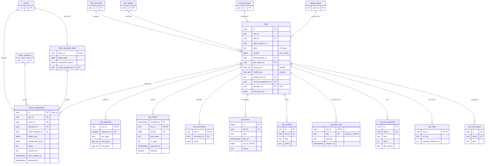

# Data model: 乗車と割り当て

乗車の状態機械、ドライバーの割り当て（オファーを兼ねる）、区間、遷移の記録、冪等、タイマー、outbox、食い違い、乗降の提供者の内容、ETA の記録、軌跡の索引、ナビの記録、断った需要、商品と車両の対応。振る舞いの正本は [trips-lifecycle.md](../trips-lifecycle.md)、決定は [ADR-0003](../../decisions/0003-trip-state-and-single-assignment.md)・[ADR-0021](../../decisions/0021-trip-transition-function-and-assignment-fencing.md)・[ADR-0022](../../decisions/0022-trip-outbox-and-offline-continuation.md)・[ADR-0039](../../decisions/0039-city-cells-and-osaka-warm-standby.md)。規約は [data-model.md](../data-model.md) の 3 節。

- 置き場所はすべて Aurora `core`。
- **状態を変える書き込みは Trips の遷移関数 `apply` だけ。** `trips.state`・`trips.version`・`driver_assignments.status`・`driver_dispatch_state` を更新できる DB のロールは `trips_svc` だけ（[ADR-0021](../../decisions/0021-trip-transition-function-and-assignment-fencing.md)）。
- ロックの順序は、乗車の行 → `driver_dispatch_state` の行。1 つのトランザクションで 2 つの乗車の行をロックしない。

## 1. ER 図



`outbox_events`・`demand_rejections`・`product_vehicle_map` は他の表と外部キーを持たないので図から外した。

## 2. 型

乗降の座標は、乗客が確かめたピンだけを書けるように型で縛る（PROP-MAP-004、[ADR-0034](../../decisions/0034-geocoding-provider-and-pickup-points.md)）。

```sql
CREATE TYPE geo_pin AS (lat_e7 integer, lng_e7 integer, origin text);
CREATE DOMAIN rider_pin AS geo_pin
  CHECK (VALUE IS NULL OR ((VALUE).origin = 'rider_confirmed_pin'
         AND (VALUE).lat_e7 BETWEEN 200000000 AND 460000000
         AND (VALUE).lng_e7 BETWEEN 1220000000 AND 1540000000));
```

- `geo_pin.origin`：`rider_confirmed_pin`（乗客が地図で確かめた点）・`driver_reported`（ドライバーの操作の時の位置）。提供者の座標（`provider`）の値はない。
- 範囲は位置の検証の V1（[location-ingestion.md](../location-ingestion.md) の 5 節）と同じ。

## 3. テーブル

### 3.1 `trips`

乗車の状態機械の正本。定義元：[trips-lifecycle.md](../trips-lifecycle.md) の 3・5.3・14 節、[maps-and-geodata.md](../maps-and-geodata.md) の 7.3 節、[pricing-and-fares.md](../pricing-and-fares.md) の 4.1・5.6 節。

| 列 | 型 | NULL | 既定 | 説明 |
| --- | --- | --- | --- | --- |
| `id` | `uuid` | NOT NULL | `uuidv7()` | |
| `city_id` | `text` | NOT NULL | — | 乗車地の `metro` のセルから決めた都市（S1 は `tokyo`）。乗車の間は変えない |
| `rider_id` | `uuid` | NULL | — | → `rider_accounts`。保持の期限の後に NULL（ID の切り離し） |
| `client_request_id` | `uuid` | NOT NULL | — | 乗客のアプリが作る。作成の冪等 |
| `state` | `text` | NOT NULL | — | `payment_pending`・`requested`・`offered`・`accepted`・`arriving`・`arrived`・`on_trip`・`awaiting_fare`・`completed`・`cancelled_by_rider`・`cancelled_by_driver`・`cancelled_by_system`・`no_driver_found`・`no_show`・`payment_failed` |
| `version` | `bigint` | NOT NULL | `1` | `trip_version`。遷移ごとに 1 増える |
| `service_request` | `text` | NOT NULL | — | `taxi`・`taxi_or_rideshare`・`rideshare` |
| `product_code` | `text` | NOT NULL | `'standard'` | 商品（`standard`・`ud` など。`product_vehicle_map` の鍵） |
| `party_size` | `smallint` | NOT NULL | `1` | 人数（配車の E3） |
| `pricing_group_id` | `uuid` | NOT NULL | — | → `pricing_groups`。配車はこの群の事業者の車だけを候補にする |
| `fare_quote_id` | `uuid` | NOT NULL | — | → `fare_quotes` |
| `fare_type` | `text` | NOT NULL | — | `meter`・`upfront`・`dynamic_upfront` |
| `fare_rule_set_id` | `uuid` | NOT NULL | — | 見積もりに使った規則（再計算と監査） |
| `fare_rule_version` | `int` | NOT NULL | — | 同上 |
| `pickup_pin` | `rider_pin` | NOT NULL | — | 乗客が確かめた乗車地（◎） |
| `dropoff_pin` | `rider_pin` | NULL | — | 同じく降車地。降車地のない依頼（メーター）は NULL（◎） |
| `pickup_street_cell` | `bigint` | NOT NULL | — | `pickup_pin` の `street` のセル（丸めた表示と保持の後） |
| `dropoff_street_cell` | `bigint` | NULL | — | 同上 |
| `pickup_point_id` | `text` | NULL | — | → `pickup_points`（乗降の地点を選んだとき） |
| `pickup_area_ids` | `text[]` | NOT NULL | — | 乗車地を含む区域。要素は `<area_id>@<version>`（作成の時の `Contains`） |
| `dropoff_area_ids` | `text[]` | NOT NULL | `'{}'` | 同上（降車地） |
| `rideshare_consented_at` | `timestamptz` | NULL | — | 日本版ライドシェアの承諾 |
| `upfront_notice_version` | `text` | NULL | — | 事前確定運賃の注意事項のバージョン |
| `upfront_consented_at` | `timestamptz` | NULL | — | 注意事項への同意 |
| `payment_mode` | `text` | NOT NULL | — | `app`・`in_vehicle` |
| `rider_payment_method_id` | `uuid` | NOT NULL | — | `money` の `rider_payment_methods.id`（クラスタが別なので外部キーなし）。車内払いでも登録を必須にする |
| `payment_id` | `uuid` | NULL | — | `money` の `trip_payments.id`（外部キーなし） |
| `current_assignment_id` | `uuid` | NULL | — | → `driver_assignments`（`DEFERRABLE INITIALLY DEFERRED`）。終わった後も最後の割り当てを残す |
| `operator_id` | `uuid` | NULL | — | 最後に受諾した割り当ての事業者（受諾で入れる）。RLS の鍵 |
| `offer_count` | `smallint` | NOT NULL | `0` | オファーの回数（10 回で `no_driver_found`） |
| `authorized_at`・`accepted_at`・`arrived_at`・`started_at`・`dropped_off_at`・`completed_at`・`cancelled_at` | `timestamptz` | NULL | — | 各遷移の発生の時刻 |
| `promised_arrival_at` | `timestamptz` | NULL | — | 受諾の時点の約束の到着（キャンセル料の判定。割り当てにも同じ値） |
| `terminal_reason` | `text` | NULL | — | 取り消しの理由のコードなど |
| `cancellation_fee_yen` | `bigint` | NULL | — | DT-TRIP-002・003 の料金 |
| `final_fare_yen` | `bigint` | NULL | — | 確定の額（`trip.fare_finalized` の額） |
| `restored_at` | `timestamptz` | NULL | — | 大阪への切り替えの後、要約から作り直した乗車（8.5 節） |
| `created_at`・`updated_at` | `timestamptz` | NOT NULL | `now()` | |
| `redacted_at` | `timestamptz` | NULL | — | 保持の期限の後の処理（`rider_id` を NULL、ピンを NULL にして `street` のセルだけ残す） |

- キー：PK `(id)`。UK `(rider_id, client_request_id)`。FK `rider_id` → `rider_accounts`、`fare_quote_id` → `fare_quotes`、`pricing_group_id` → `pricing_groups`、`pickup_point_id` → `pickup_points`、`current_assignment_id` → `driver_assignments`（遅延）、`operator_id` → `operators`。
- 部分一意（[trips-lifecycle.md](../trips-lifecycle.md) の 5.3 節）：
  - `one_active_trip_per_rider ON (rider_id) WHERE state IN ('payment_pending','requested','offered','accepted','arriving','arrived','on_trip')`
- 索引：
  - `(city_id, created_at) WHERE state IN ('requested','offered')` — 配車の未割り当ての依頼の読み直しと、受け入れの上限の数の照合（1 分ごと）。
  - `(operator_id, created_at DESC)` — 事業者の管理画面の乗車の履歴（RLS）。
  - `(rider_id, created_at DESC)` — 乗客の乗車の履歴。
  - `(updated_at) WHERE state = 'awaiting_fare'` — 止まった乗車の監視（`stuck-trips.md`）。
  - `(completed_at) WHERE redacted_at IS NULL` — 保持の削除のジョブ。
- CHECK：
  - `state IN (...)`、`fare_type IN (...)`、`payment_mode IN (...)`、`service_request IN (...)`、`party_size BETWEEN 1 AND 9`。
  - 日本版ライドシェアの条件（DB の最後の守り。[ADR-0014](../../decisions/0014-dispatch-eligibility-and-street-hails.md) の E1）：`service_request = 'taxi' OR (rideshare_consented_at IS NOT NULL AND fare_type <> 'meter' AND payment_mode = 'app' AND dropoff_pin IS NOT NULL)`。
  - 事前確定の同意：`fare_type = 'meter' OR (upfront_notice_version IS NOT NULL AND upfront_consented_at IS NOT NULL)`。
  - `final_fare_yen >= 0`、`cancellation_fee_yen >= 0`、`offer_count BETWEEN 0 AND 10`。
  - `redacted_at IS NOT NULL OR rider_id IS NOT NULL`。
- 更新：`trips_svc` だけ。`version` は `UPDATE ... WHERE id = $1 AND version = $2` の一致を条件に増やす。
- アクセス：`operator_api` は `pickup_pin`・`dropoff_pin` の列の権限を持たず、ビュー `operator_trip_rows` で読む。ビューは状態が `accepted`〜`on_trip` の間だけピンを返し、それ以外は `street` のセルの中心を返す（[supply-and-operators.md](../supply-and-operators.md) の 9 節）。`ops_api` も同じビューで、正確な値は `trail-viewer` の窓口（許可と監査）だけ。
- 保持：乗車の終わりから 7 年（既定。法務の確認待ち（L4）。[security.md](../security.md) の 7.2 節）。期限の後は `rider_id` とピンを NULL にし、`street` のセルだけを残す。
- S1 の量：作成 1 日 約 60 万行（受け付けの量。成立しない依頼を含む）、成立 1 日 約 15 万行。7 年で 約 15 億行。**S1 は分割しない。** 部分一意索引 `one_active_trip_per_rider` はパーティションをまたげないため。S2 の前に、終わった乗車を別の表へ移すか、パーティションと別の一意の仕組みに替えるかを決める（[data-model.md](../data-model.md) の 9 節の持ち越し）。

### 3.2 `driver_dispatch_state`

ドライバーごとの fencing token。定義元：trips-lifecycle の 4.1・4.2 節。

| 列 | 型 | NULL | 既定 | 説明 |
| --- | --- | --- | --- | --- |
| `driver_id` | `uuid` | NOT NULL | — | → `drivers` |
| `region_gen` | `bigint` | NOT NULL | — | 最後に epoch を増やした時の世代（AppConfig の `region_gen`） |
| `assignment_epoch` | `bigint` | NOT NULL | `0` | 作成と解放で 1 増える。世代が上がっても 0 に戻さない |
| `active_assignment_id` | `uuid` | NULL | — | → `driver_assignments`（遅延） |
| `updated_at` | `timestamptz` | NOT NULL | `now()` | |

- キー：PK `(driver_id)`。行がなければ提案のトランザクションで `INSERT ... ON CONFLICT DO NOTHING`（epoch 0）。
- CHECK：`assignment_epoch >= 0`、`region_gen >= 1`。
- トリガー：`(region_gen, assignment_epoch)` を辞書順で小さくする更新を拒否する（PROP-TRIP-002 の DB の守り）。
- 保持：ドライバーの行と同じ。S1 の量：約 2 万行。

### 3.3 `driver_assignments`

割り当てとオファーの記録（`offer_id` ＝ `id`）。`trip_offers` の表は作らない（[data-model.md](../data-model.md) の 10 節）。列の持ち主：◇ Trips、△ 配車の提案、▽ オファーの配信。定義元：trips-lifecycle の 4.1 節、[dispatch-and-matching.md](../dispatch-and-matching.md) の 6.4・8 節、[notifications-and-realtime-push.md](../notifications-and-realtime-push.md) の 5.2 節。

| 列 | 型 | NULL | 既定 | 持ち主 | 説明 |
| --- | --- | --- | --- | --- | --- |
| `id` | `uuid` | NOT NULL | `uuidv7()` | ◇ | `offer_id` として外に出す |
| `trip_id` | `uuid` | NOT NULL | — | ◇ | |
| `driver_id` | `uuid` | NOT NULL | — | ◇ | |
| `vehicle_id` | `uuid` | NOT NULL | — | ◇ | |
| `operator_id` | `uuid` | NOT NULL | — | ◇ | |
| `driver_session_id` | `uuid` | NOT NULL | — | ◇ | |
| `service_kind` | `text` | NOT NULL | — | ◇ | `taxi`・`rideshare` |
| `region_gen` | `bigint` | NOT NULL | — | ◇ | 作成の時の世代 |
| `assignment_epoch` | `bigint` | NOT NULL | — | ◇ | 作成の時の epoch（作成で増やした後の値） |
| `status` | `text` | NOT NULL | `'offered'` | ◇ | 有効：`offered`・`accepted`・`arriving`・`arrived`・`on_trip`。終わり：`declined`・`expired`・`undelivered`・`revoked`・`released`・`driver_cancelled`・`completed`・`no_show` |
| `decision_id` | `text` | NOT NULL | — | △ | `<zone>/<batch_id>`。`DispatchBatchRecord` を引く鍵 |
| `pickup_eta_s` | `int` | NOT NULL | — | △ | 提案の時の迎車の ETA |
| `eta_source` | `text` | NOT NULL | — | △ | `valhalla:<tile_version>`・`fallback` |
| `offer_expires_at` | `timestamptz` | NOT NULL | — | ◇ | 作成 ＋ 16.5 秒（[ADR-0015](../../decisions/0015-offer-protocol-decision-log-and-replay.md)） |
| `delivered_at` | `timestamptz` | NULL | — | ▽ | `OfferDelivered` を記録した時刻 |
| `delivery_channel` | `text` | NULL | — | ▽ | `stream`・`push`・`api` |
| `shown_elapsed_ms` | `int` | NULL | — | ▽ | 端末での受信から表示まで |
| `decline_reason` | `text` | NULL | — | ◇ | `driver`・`street_hail` など |
| `pickup_eta_s_at_accept` | `int` | NULL | — | ◇ | 受諾の時点の ETA（`trip_eta_snapshots` と同じ値） |
| `promised_arrival_at` | `timestamptz` | NULL | — | ◇ | 約束の到着 |
| `created_at` | `timestamptz` | NOT NULL | `now()` | ◇ | |
| `accepted_at`・`ended_at` | `timestamptz` | NULL | — | ◇ | |
| `end_reason` | `text` | NULL | — | ◇ | 解放の理由のコード |

- キー：PK `(id)`。FK `trip_id` → `trips`、`(driver_id, operator_id)` → `drivers (id, operator_id)`、`(vehicle_id, operator_id)` → `vehicles`、`driver_session_id` → `driver_sessions`。
- 部分一意（NFR-005 の最後の砦）：
  - `one_active_assignment_per_driver ON (driver_id) WHERE status IN ('offered','accepted','arriving','arrived','on_trip')`
  - `one_active_assignment_per_trip ON (trip_id) WHERE status IN ('offered','accepted','arriving','arrived','on_trip')`
- 索引：`(trip_id, created_at)` — 試したドライバーの一覧（配車の E7 の除外、提案の検査の 3）。`(decision_id)` — 判断の記録との突き合わせ。`(driver_id, created_at DESC)` — 時間切れの連続、取り消しの回数。`(operator_id, created_at DESC)` — 事業者の画面（RLS）。
- CHECK：`status IN (...)`、`offer_expires_at > created_at`、`status NOT IN ('accepted','arriving','arrived','on_trip','completed','no_show') OR accepted_at IS NOT NULL`、終わりの状態なら `ended_at IS NOT NULL`、`delivery_channel IN ('stream','push','api')`。
- 保持：乗車の記録と同じ 7 年。S1 の量：1 日 約 30 万行（成立の量 × オファーの試み 約 2 回）。

### 3.4 `trip_segments`

区間。事前確定の乗車で旅客の都合で経路を変えたら区間を分ける。定義元：trips-lifecycle の 3.3 節の行 15、[pricing-and-fares.md](../pricing-and-fares.md) の 7 節。

| 列 | 型 | NULL | 既定 | 説明 |
| --- | --- | --- | --- | --- |
| `trip_id` | `uuid` | NOT NULL | — | |
| `segment_no` | `smallint` | NOT NULL | — | 1 から |
| `fare_type` | `text` | NOT NULL | — | `meter`・`upfront`・`dynamic_upfront` |
| `started_at` | `timestamptz` | NOT NULL | — | 発生の時刻 |
| `ended_at` | `timestamptz` | NULL | — | |
| `start_point` | `geo_pin` | NOT NULL | — | ドライバーの操作の時の位置（`origin = driver_reported`）（◎） |
| `end_point` | `geo_pin` | NULL | — | 同上（◎） |
| `meter_reading_id` | `uuid` | NULL | — | → `meter_readings` |

- キー：PK `(trip_id, segment_no)`。CHECK：`segment_no >= 1`、`ended_at IS NULL OR ended_at >= started_at`。
- 保持：乗車の記録と同じ 7 年。期限の後は位置を NULL にする。S1 の量：1 日 約 15 万行。

### 3.5 `trip_events`

遷移の記録（追記のみ）。定義元：trips-lifecycle の 8.3・14 節。

| 列 | 型 | NULL | 既定 | 説明 |
| --- | --- | --- | --- | --- |
| `recorded_at` | `timestamptz` | NOT NULL | `now()` | 記録の時刻。パーティションの鍵 |
| `trip_id` | `uuid` | NOT NULL | — | |
| `version` | `bigint` | NOT NULL | — | 遷移の後の `trip_version` |
| `from_state`・`to_state` | `text` | NOT NULL | — | 状態を変えない事象（タイマーの無効など）は記録しない |
| `event_type` | `text` | NOT NULL | — | 3.2 節の事象の名前 |
| `actor_kind` | `text` | NOT NULL | — | `rider`・`driver`・`dispatch`・`payments`・`pricing`・`timer`・`ops`・`safety` |
| `actor_id` | `uuid` | NULL | — | |
| `command_id` | `uuid` | NULL | — | |
| `assignment_id` | `uuid` | NULL | — | |
| `region_gen`・`assignment_epoch` | `bigint` | NULL | — | 事象の時の値 |
| `occurred_at` | `timestamptz` | NOT NULL | — | 発生の時刻（セッションの基準点から求めた値） |
| `occurred_at_replaced` | `boolean` | NOT NULL | `false` | 発生の時刻を受信の時刻に置き換えた（2 秒以上未来か、前の遷移より前） |
| `journal_seq` | `int` | NULL | — | ドライバーの journal の番号 |
| `lat_e7`・`lng_e7` | `int` | NULL | — | ドライバーの操作（到着・開始・降車）の位置（◎） |
| `restored` | `boolean` | NOT NULL | `false` | 要約から戻した遷移（8.5 節） |
| `detail` | `jsonb` | NOT NULL | `'{}'` | 理由のコード、料金など。位置・名前を入れない |

- キー：PK `(recorded_at, trip_id, version)`。
- パーティション：`recorded_at` の月（pg_partman で先に 3 個）。
- 索引：`(trip_id, version)`（パーティションごと）— 乗車の時系列。`trip_id` は UUIDv7 なので、作成の月からパーティションを絞れる。
- 更新：`trips_svc` は `INSERT`・`SELECT` だけ（追記のみ）。
- 保持：乗車の記録と同じ 7 年。期限の後は位置の列を NULL にする（パーティションごとの一括の更新）。S1 の量：1 日 約 150 万行（遷移のコミット 約 180 件/秒のピーク）。

### 3.6 `trip_commands`

冪等の記録。定義元：trips-lifecycle の 5.2 節。

| 列 | 型 | NULL | 既定 | 説明 |
| --- | --- | --- | --- | --- |
| `trip_id` | `uuid` | NOT NULL | — | |
| `command_id` | `uuid` | NOT NULL | — | 送り手が作る。Payments の事象は outbox の `event_id` |
| `command_type` | `text` | NOT NULL | — | |
| `result` | `jsonb` | NOT NULL | — | 前の応答（`TripSnapshot` を除く） |
| `created_at` | `timestamptz` | NOT NULL | `now()` | |

- キー：PK `(trip_id, command_id)`。索引：`(created_at)` — 30 日の削除。
- 保持：30 日。S1 の量：1 日 約 200 万行、30 日で 約 6,000 万行。

### 3.7 `trip_timers`

時間で動く事象。定義元：trips-lifecycle の 6 節、[ADR-0015](../../decisions/0015-offer-protocol-decision-log-and-replay.md)。

| 列 | 型 | NULL | 既定 | 説明 |
| --- | --- | --- | --- | --- |
| `id` | `bigint` | NOT NULL | identity | |
| `trip_id` | `uuid` | NOT NULL | — | |
| `kind` | `text` | NOT NULL | — | `authorization`・`dispatch_deadline`・`offer_delivery`・`offer_expiry`・`no_show_eligible`・`fare_escalation` |
| `assignment_id` | `uuid` | NULL | — | オファーのタイマーの割り当て |
| `due_at` | `timestamptz` | NOT NULL | — | |
| `set_at_version` | `bigint` | NOT NULL | — | 設定した時の `trip_version` |
| `status` | `text` | NOT NULL | `'pending'` | `pending`・`fired`・`cancelled` |
| `fired_at` | `timestamptz` | NULL | — | |
| `created_at` | `timestamptz` | NOT NULL | `now()` | |

- キー：PK `(id)`。部分一意：`UNIQUE (trip_id, kind) WHERE status = 'pending'`（同じ種類の待ちは 1 つ）。
- 索引：`trip_timers_due ON (due_at) WHERE status = 'pending'`。処理は 200 ms ごとに `ORDER BY due_at LIMIT 200 FOR UPDATE SKIP LOCKED`。
- 保持：`fired`・`cancelled` は 7 日で消す。S1 の量：1 日 約 200 万行。

### 3.8 `outbox_events`

事象の outbox。**`core` と `money` の両方に同じ形で置く**（クラスタをまたぐトランザクションを書かないため）。定義元：trips-lifecycle の 8.1 節、[ADR-0022](../../decisions/0022-trip-outbox-and-offline-continuation.md)、[payments-and-payouts.md](../payments-and-payouts.md) の 5.2 節。事象の種類と本文は [stores.md](stores.md) の 7 節。

| 列 | 型 | NULL | 既定 | 説明 |
| --- | --- | --- | --- | --- |
| `id` | `bigint` | NOT NULL | identity | 中継の順序 |
| `event_id` | `uuid` | NOT NULL | `uuidv7()` | 購読する側の冪等の鍵（Trips では `command_id` に使う） |
| `aggregate_type` | `text` | NOT NULL | — | `core`：`trip`・`driver_assignment`・`driver_session`・`fare_rules`・`audit`・`safety`。`money`：`trip_payment`・`settlement` |
| `aggregate_id` | `uuid` | NOT NULL | — | |
| `event_type` | `text` | NOT NULL | — | [stores.md](stores.md) の 7 節 |
| `payload` | `bytea` | NOT NULL | — | Protocol Buffers |
| `created_at` | `timestamptz` | NOT NULL | `now()` | |
| `published_at` | `timestamptz` | NULL | — | |

- キー：PK `(id)`。UK `(event_id)`。
- 索引：`outbox_unpublished ON (id) WHERE published_at IS NULL` — 中継（`ORDER BY id FOR UPDATE SKIP LOCKED`）。`(published_at)` — 削除。
- 更新：各サービスは `INSERT` だけ。`relay` のロールは `SELECT`・`UPDATE (published_at)`・`DELETE` だけ。
- 保持：配信の後 3 日。未配信の最古の行の経過時間を監視する（2 秒で警告）。S1 の量：1 日 約 500 万行（`core`）。

### 3.9 `trip_conflicts`

遅れて届いた操作と今の状態の食い違い、復元の食い違い。定義元：trips-lifecycle の 8.4・8.5 節、[support-and-operations-tools.md](../support-and-operations-tools.md) の 3.4 節。

| 列 | 型 | NULL | 既定 | 説明 |
| --- | --- | --- | --- | --- |
| `id` | `uuid` | NOT NULL | `uuidv7()` | |
| `trip_id` | `uuid` | NOT NULL | — | |
| `kind` | `text` | NOT NULL | — | `late_after_cancel`・`late_after_no_driver`・`fare_mismatch`・`epoch_released`・`restore_conflict` |
| `command_id` | `uuid` | NULL | — | |
| `command` | `bytea` | NULL | — | 届いた `TripCommand`（位置を含む）（◎） |
| `server_state` | `text` | NOT NULL | — | 届いた時の状態 |
| `server_version` | `bigint` | NOT NULL | — | |
| `status` | `text` | NOT NULL | `'open'` | `open`・`resolved` |
| `resolution` | `text` | NULL | — | `no_change`・`fare_corrected`・`fee_waived`・`completed_by_ops` |
| `resolved_by` | `uuid` | NULL | — | → `staff_users` |
| `resolved_at` | `timestamptz` | NULL | — | |
| `created_at` | `timestamptz` | NOT NULL | `now()` | |

- キー：PK `(id)`。部分一意：`UNIQUE (trip_id, command_id) WHERE command_id IS NOT NULL`。
- 索引：`(created_at) WHERE status = 'open'` — 確認の一覧。
- CHECK：`(status = 'resolved') = (resolution IS NOT NULL AND resolved_by IS NOT NULL)`。
- 保持：乗車の記録と同じ 7 年（期限の後は `command` を消す）。S1 の量：1 日 数十〜数百行。

### 3.10 `trip_place_refs`

乗降の提供者の内容（表示の名前、提供者の ID）。**提供者ごとの期限で消す。** 持ち主は places。定義元：[maps-and-geodata.md](../maps-and-geodata.md) の 7.3 節、[ADR-0034](../../decisions/0034-geocoding-provider-and-pickup-points.md)。

| 列 | 型 | NULL | 既定 | 説明 |
| --- | --- | --- | --- | --- |
| `trip_id` | `uuid` | NOT NULL | — | |
| `leg` | `text` | NOT NULL | — | `pickup`・`dropoff` |
| `provider` | `text` | NOT NULL | — | 提供者のコード（選定の後に決める） |
| `place_ref` | `text` | NOT NULL | — | 提供者の場所の ID |
| `display_name` | `text` | NOT NULL | — | 乗客に見せた名前 |
| `expires_at` | `timestamptz` | NOT NULL | — | 提供者の保存の条件から決める |
| `created_at` | `timestamptz` | NOT NULL | `now()` | |

- キー：PK `(trip_id, leg)`。索引：`(expires_at)` — 削除のジョブ。
- **提供者の座標を持つ列を作らない**（PROP-MAP-004）。
- 保持：`expires_at`（提供者の条件。法務の確認待ち（L3））。S1 の量：1 日 約 100 万行。

### 3.11 `trip_eta_snapshots`

受諾の時点などの ETA と、その出どころのバージョン。定義元：[eta-and-routing.md](../eta-and-routing.md) の 4.2・4.3・6 節。

| 列 | 型 | NULL | 既定 | 説明 |
| --- | --- | --- | --- | --- |
| `id` | `uuid` | NOT NULL | `uuidv7()` | |
| `trip_id` | `uuid` | NOT NULL | — | |
| `kind` | `text` | NOT NULL | — | `pickup_at_accept`・`pickup_update`・`dropoff` |
| `eta_s` | `int` | NOT NULL | — | |
| `eta_source` | `text` | NOT NULL | — | `valhalla:<tile_version>`・`fallback`・`model:<version>` |
| `tile_version` | `text` | NULL | — | |
| `correction_version` | `text` | NULL | — | 偏りの補正の表のバージョン |
| `model_version` | `text` | NULL | — | E13 の ETA の補正のモデル（S2） |
| `computed_at` | `timestamptz` | NOT NULL | — | |

- キー：PK `(id)`。部分一意：`UNIQUE (trip_id) WHERE kind = 'pickup_at_accept'`。索引：`(trip_id, kind, computed_at)`。
- 保持：乗車の記録と同じ 7 年。`pickup_update` は 30 秒ごとに書かず、1 分ごとの間引きにする。S1 の量：1 日 約 500 万行。

### 3.12 `trip_trails`

乗車の軌跡の索引（本体は S3 `trip-trails/`）。定義元：[location-ingestion.md](../location-ingestion.md) の 7・17 節、[ADR-0010](../../decisions/0010-location-trails-map-matching-and-retention.md)。

| 列 | 型 | NULL | 既定 | 説明 |
| --- | --- | --- | --- | --- |
| `trip_id` | `uuid` | NOT NULL | — | |
| `s3_key` | `text` | NOT NULL | — | `trip-trails/<yyyymm>/<trip_id>.pb` |
| `sample_count` | `int` | NOT NULL | — | |
| `matched_distance_m` | `int` | NULL | — | 当てはめた距離（影の計算の入力） |
| `match_quality` | `text` | NOT NULL | — | `good`・`partial`・`failed` |
| `created_at` | `timestamptz` | NOT NULL | `now()` | |
| `expires_at` | `timestamptz` | NOT NULL | — | 作成 ＋ 1 年 |

- キー：PK `(trip_id)`（書き込みは冪等）。索引：`(expires_at)`。
- アクセス：`trail-builder` が書き、`trail-viewer` の窓口が `location_access_grants` を確かめてから読む。
- 保持：1 年（既定。法務の確認待ち（L4））。S1 の量：1 日 約 15 万行。

### 3.13 `trip_nav_events`

ナビの引き継ぎと逸脱。定義元：[rider-and-driver-apps.md](../rider-and-driver-apps.md) の 6.3・6.4・14 節。

| 列 | 型 | NULL | 既定 | 説明 |
| --- | --- | --- | --- | --- |
| `id` | `uuid` | NOT NULL | `uuidv7()` | |
| `trip_id` | `uuid` | NOT NULL | — | |
| `kind` | `text` | NOT NULL | — | `handed_off`・`route_deviation` |
| `target` | `text` | NULL | — | 引き継ぎ先（`nav_handoff_targets` の値） |
| `leg` | `text` | NULL | — | `pickup`・`dropoff` |
| `waypoint_count` | `smallint` | NULL | — | |
| `max_distance_m` | `int` | NULL | — | 逸脱の最大の距離 |
| `duration_s` | `int` | NULL | — | 逸脱の時間 |
| `created_at` | `timestamptz` | NOT NULL | `now()` | |

- キー：PK `(id)`。索引：`(trip_id, created_at)`。
- 保持：乗車の記録と同じ 7 年。S1 の量：1 日 約 30 万行。

### 3.14 `demand_rejections`

受け入れの上限で断った需要。乗客の ID を持たない。1 分ごとの集計で持つ。定義元：[capacity.md](../capacity.md) の 4・11 節、[ADR-0041](../../decisions/0041-load-model-admission-control-and-prescaling.md)。

| 列 | 型 | NULL | 既定 | 説明 |
| --- | --- | --- | --- | --- |
| `city_id` | `text` | NOT NULL | — | |
| `bucket_minute` | `timestamptz` | NOT NULL | — | 分の始まり |
| `block_cell` | `bigint` | NOT NULL | — | 乗車地の `block` のセル（○） |
| `reason` | `text` | NOT NULL | — | `intake_limit`・`ops_reject` |
| `count` | `int` | NOT NULL | — | |

- キー：PK `(city_id, bucket_minute, block_cell, reason)`。API のタスクが 10 秒ごとに手元の数を `INSERT ... ON CONFLICT DO UPDATE SET count = count + excluded.count` で足す（嵐の日の 1 件ずつの書き込みを避ける）。
- CHECK：`(block_cell >> 60) = 2`（`block` のレベル）、`count > 0`。
- 保持：2 年（ID を持たない集計。[security.md](../security.md) の 7.2 節の速度の標本・台数の集計と同じ）。S1 の量：平常は少なく、嵐の日に 1 日 数十万行。

### 3.15 `product_vehicle_map`

商品と車両の種類の対応（バージョンつき）。配車の E2 と Trips の確かめ直しが同じバージョンを読む。定義元：[dispatch-and-matching.md](../dispatch-and-matching.md) の 5 節。

| 列 | 型 | NULL | 既定 | 説明 |
| --- | --- | --- | --- | --- |
| `version` | `int` | NOT NULL | — | |
| `product_code` | `text` | NOT NULL | — | `standard`・`large`・`ud`・`premium` |
| `vehicle_class` | `text` | NOT NULL | — | 使える車両の種類（例：`standard` → `standard`・`large`） |
| `effective_from` | `timestamptz` | NOT NULL | — | |
| `status` | `text` | NOT NULL | `'draft'` | `draft`・`active`・`retired` |

- キー：PK `(version, product_code, vehicle_class)`。有効なバージョンは 1 つ（`UNIQUE (status) WHERE status = 'active'` をバージョンの表に持つ代わりに、`active` の行の `version` がすべて同じことをトリガーで確かめる）。
- 保持：消さない。S1 の量：数十行。
