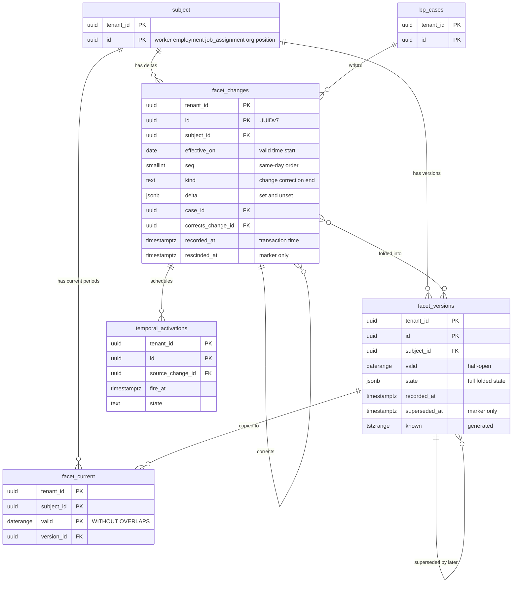

# Data model: Workday

データモデルの正本。規約、置き場所、全体の ER 図、横断の不変条件、統合で決めたことをここに置き、領域ごとのテーブルの定義を [data-model/](data-model/) に置く。

- **列・制約・索引・保存の正本は、このファイルと `data-model/` の各ファイル** である。領域の文書（[core-hr.md](core-hr.md) など）は振る舞いの正本で、テーブルは要点だけを書く。両者が食い違ったら、このデータモデルに合わせて領域の文書を直す。
- 実装の変更（開発リポジトリの `changes/`）でマイグレーションを書くときは、同じ PR でここを更新する。
- 方針の元は、有効日付の 2 軸（[ADR-0002](../decisions/0002-effective-dated-data-model.md)）、3 つのテーブルと畳み込み（[ADR-0006](../decisions/0006-temporal-table-triplet-and-fold.md)）、変更・訂正・取消（[ADR-0007](../decisions/0007-change-correction-rescind-semantics.md)）、共有スキーマと RLS と保管庫（[ADR-0005](../decisions/0005-security-and-my-number.md)）、個人情報の区分（[ADR-0051](../decisions/0051-threat-model-and-pii-classification.md)）、鍵の階層（[ADR-0052](../decisions/0052-kms-key-hierarchy.md)）、保存の期間の規則表（[ADR-0049](../decisions/0049-retention-rules-table-and-legal-hold.md)）。
- 行数・容量の「S1 の量」は、[capacity.md](capacity.md) の 1 節と各領域の文書の規模の節からの **初期見積もり** である。E12 の負荷試験で置き換える。
- 保存の期間の値は、どれも [audit-and-retention.md](audit-and-retention.md) の 5.2 節の規則表の既定（確認待ちの間は長いほう）で、**法務の確認待ち**（[intent.md](../intent.md) の L5 ほか）。ここでは規則表の「データの種類」の名前で書く。

## 1. ファイルの構成

| ファイル | 領域 | テーブル |
| --- | --- | --- |
| [data-model/temporal.md](data-model/temporal.md) | 有効日付の共通の形（差分・バージョン・現在）、facet の一覧、発効の予定 | 3 つの表の型 ＋ 1 |
| [data-model/core-hr.md](data-model/core-hr.md) | 人・雇用・職務の割り当て、個人の情報、報酬、退職、組織（監督組織・会社・コストセンター・事業所）、階層の閉包、ポジション、職務、等級、ロール | 16 ＋ facet 17 |
| [data-model/business-process.md](data-model/business-process.md) | 業務プロセスの定義、案件、ステップ、担当、イベント、タイマー、委任、受信箱、添付 | 10 |
| [data-model/security.md](data-model/security.md) | 権限の方針のバージョン、セキュリティグループ、所属、利用者ごとの権限の表、職務分掌の違反、代理のログイン、サポートの参照の許可 | 8 |
| [data-model/time.md](data-model/time.md) | 打刻、訂正、客観的な記録、勤務の規則とシフト、日の結果、36 協定、締めの期間と集計、打刻機 | 15 ＋ facet 1 |
| [data-model/absence.md](data-model/absence.md) | 休暇の種類、付与の方針、付与と台帳、残り、年 5 日の義務、休暇の申請、管理簿 | 7 ＋ ビュー 1 |
| [data-model/payroll.md](data-model/payroll.md) | 給与のグループと期間、営業日の暦、実行と里程標、入力の固定、束、項目、個別の調整、結果、遡及、並行稼働、移行の期首の値 | 23 ＋ facet 1 |
| [data-model/payroll-jp.md](data-model/payroll-jp.md) | 規則表と行、テナントの規則表、会社の給与の設定、保険者と適用事業所、税・社会保険・雇用保険の facet、住民税の通知、随時改定と定時決定 | 21 ＋ facet 3 |
| [data-model/payments.md](data-model/payments.md) | 支払元の口座、同意、支払の指示、振込ファイル、振込以外の支払い、明細と電子交付、仕訳と出力、納入告知、賃金台帳 | 14 ＋ ビュー 1 |
| [data-model/reporting.md](data-model/reporting.md) | レポートのデータの元・定義・実行・予約、分析用の基盤（S2） | 4 |
| [data-model/identity-and-integrations.md](data-model/identity-and-integrations.md) | ログイン（Better Auth）、SSO、アカウントと人の結び、API の利用者、冪等、Webhook、一括の取り込み、画面の設定と計測 | 15 |
| [data-model/vault.md](data-model/vault.md) | マイナンバーの保管庫（別アカウントの Aurora）と、人事の側の参照 | 12 ＋ 人事の側 2 |
| [data-model/tenancy-and-audit.md](data-model/tenancy-and-audit.md) | テナント、ホスト名、鍵、クラスタの対応、outbox、監査、連鎖のセグメント、保存の規則と保全と削除の実行 | 12 |
| [data-model/stores.md](data-model/stores.md) | DB 以外の置き場所：Valkey のキー、S3 の配置、SQS と outbox の事象、Webhook、取り込み・出力の形式、給与の出力のファイル、IndexedDB、分析用の基盤 | — |

合計 160 テーブル（facet の 3 つの表を除く）と、facet 22 個（物理の表は 66）、ビュー 2 個（`annual_leave_register`、`wage_ledger`。`workers_as_of` などのレポートのデータの元は `report_sources` の定義で持つ）。ER 図は、下の 3.4.2 節の概念の図と 4 節の全体の図、領域ごとの 18 個の、合わせて 20 個。

## 2. 置き場所

| 置き場所 | 中身 | 分け方 |
| --- | --- | --- |
| Aurora PostgreSQL 18（人事。prod。東京が主、大阪は Global Database の二次） | 唯一の正本。facet、業務プロセス、権限、勤怠、休暇、給与の実行と結果、支払、仕訳、レポートの定義、連携、監査（13 か月）、規則表、outbox | テナントは RLS。S2 はテナントの対応表でクラスタを分ける（3.13 節） |
| Aurora PostgreSQL 18（保管庫。vault-prod） | マイナンバーの本体、本人確認、担当者、書類の索引、アクセスの記録、削除の記録（[data-model/vault.md](data-model/vault.md)） | 別の AWS アカウント（[ADR-0054](../decisions/0054-accounts-network-and-vault-boundary.md)）。テナントは RLS |
| ElastiCache（Valkey） | 権限の表のキャッシュ、セッションのキャッシュ、レート制限、1 回限りの取り出しの URL、差分の攻撃の検知の集合、API のアクセストークン。**正本を置かない**（失ってよい） | キーにテナントを含める |
| S3（prod） | 給与の入力の文書・結果の束、明細、振込ファイル（専用の鍵）、レポートの出力、取り込み・出力のファイル、仕訳の出力、添付、SPA の資産 | バケットと接頭辞。テナントの鍵 |
| S3（vault-prod） | 保管庫の書類、本人確認の画像、移行のファイル（Object Lock なし） | `vault-docs` の鍵 |
| S3（log-archive、Object Lock） | 監査のセグメントと日の署名、保管庫の記録、規則表の元のファイル、CloudTrail・Config・アプリのログ | 接頭辞 |
| S3（S2。分析用の基盤） | Apache Iceberg の表（[reporting.md](reporting.md) の 6.2 節） | `tenant_id` でパーティション |
| SQS | outbox の中継、業務プロセスのステップ、一括の子の案件の束、給与の束、結果の取り込み、通知、Webhook の送信、レポートの非同期の実行 | キューを用途ごとに分ける |
| ECR | Payroll Compute のエンジンのイメージ（給与の保存の期間の間消さない） | — |
| ブラウザ IndexedDB | 未送信の打刻（`pending_clock_events`） | 利用者の端末 |

- 全文検索の製品（OpenSearch など）は置かない。人の検索は Aurora の索引で行う（6 節の DM-13）。
- 本文の形（キー、パス、事象、ファイル）は [data-model/stores.md](data-model/stores.md) にある。

## 3. 規約

### 3.1 ID と採番

- DB の ID は `uuid` 型の **UUIDv7**。PostgreSQL 18 の組み込みの `uuidv7()` で作る。例外は、端末が作る打刻の ID（`client_event_id`。端末の UUIDv7、打刻機は UUIDv5）と、内容のアドレス（SHA-256 の `bytea`）。
- 画面・API の ID は UUID をそのまま出す。本家の ID の形や接頭辞を使わない。秘密の形だけ `<brand>_` の接頭辞を持つ（`<brand>_at_`：API のアクセストークン、`<brand>_tk_`：打刻機の鍵。[リポジトリ共通の ADR-0006](../../../../docs/decisions/0006-brand-neutral-identifiers.md)）。
- 業務のコード（社員番号、組織のコード、項目のコード、勘定のコード）は `text` で、テナントの中で一意。形はテナントが決める。システムの項目のコードは `jp.` で始まる（3.3.1 節）。
- 連番が要るところは `bigint` か `int` の列で、テナントの中で採番する（`mn_access_log.seq`、`gl_export_batches.seq`、`audit_segments.seq`）。採番は行ロック（テナントの採番の行）で直列にする。

### 3.2 テナントと RLS

- **テナントテーブルは先頭の列に `tenant_id uuid NOT NULL` を持ち、主キーを `(tenant_id, id)` にする**（[ADR-0005](../decisions/0005-security-and-my-number.md)）。facet の現在の表は `(tenant_id, subject_id, valid WITHOUT OVERLAPS)`。
- **外部キーは `tenant_id` を含む複合キーにする。** 別のテナントの行を指す行を DB が拒む。有効日付の参照は `PERIOD` の外部キー（3.4 節）。
- **索引は `tenant_id` を先頭に置く。** 一覧のカーソルは `(tenant_id, id DESC)` か業務の順（`(tenant_id, employment_id, work_date)` など）。
- 全テナントテーブルに次の方針を張る。`current_setting` の `missing_ok` を使わないので、コンテキストがなければ問い合わせ自体が失敗する（安全側）。

```sql
ALTER TABLE <t> ENABLE ROW LEVEL SECURITY;
ALTER TABLE <t> FORCE ROW LEVEL SECURITY;
CREATE POLICY tenant_isolation ON <t>
  USING      (tenant_id = current_setting('app.tenant_id')::uuid)
  WITH CHECK (tenant_id = current_setting('app.tenant_id')::uuid);
```

- トランザクションごとに `SET LOCAL app.tenant_id` を設定する。値はホスト名から解決したテナントと、セッションのテナントが一致したときだけ設定する（[security.md](security.md) の THR-002）。Payroll Compute は DB に経路がないので設定しない。Loader・Worker は束・メッセージのテナントで設定する。
- 子の表（`bp_steps`、`payroll_result_lines` など）も `tenant_id` を持ち、同じ方針を張る。親を結合しないと絞れない RLS は作らない。
- 保管庫の Aurora も同じ規則（`vault_app` のロール）。

DB のロール（人事の Aurora）：

| ロール | 使うサービス | 権限 |
| --- | --- | --- |
| `migrator` | マイグレーション | 所有者。DDL。`BYPASSRLS`（`pay_items` のシステムの行、`report_sources`、`mn_purposes` を書く） |
| `temporal_owner` | 有効日付の書き込みの関数（`temporal.apply_fold`、`temporal.rebuild_current`） | 差分・バージョンの印の埋め込みと、現在の表の差し替えだけ。関数の方式か専用のロールかは E1 の `temporal-constraints-poc` で決める（8 節） |
| `app` | api、worker、bp-worker、loader | RLS の対象。`BYPASSRLS` なし。有効日付の書き込みの関数の `EXECUTE`。追記のみの表は `INSERT`・`SELECT` だけ |
| `report_app` | report-service（レポートの reader） | 読み取りだけ。RLS の対象。`statement_timeout`（同期 10 秒、非同期 15 分） |
| `scheduler` | bp-worker・worker の予定のジョブ | `BYPASSRLS`。ただし予定の表（`bp_timers`、`temporal_activations`、`webhook_deliveries`、`pay_periods`、`leave_grant_policies` の付与の日、`retention` の候補）の `tenant_id`・`id`・期限・状態の列の `SELECT` だけ。見つけた `(tenant_id, id)` を SQS に積み、処理は `app` で行う |
| `relay` | Relay | `BYPASSRLS`。`outbox` の `SELECT` と `relayed_at` の `UPDATE` だけ |
| `audit_archiver` | audit-archiver | `BYPASSRLS`。`audit_events`・`bp_events` などの `SELECT`、`audit_segments` への `INSERT` |
| `retention_purger` | 保存の期間の削除のジョブ | 追記のみの表の `DELETE`（`retention_executions` の行のあるトランザクションだけ。トリガーで確かめる）。パーティションの `DROP` |
| `platform` | テナントの作成・削除、規則表の公開、課金の集計 | RLS を迂回できる。操作は `platform_audit_events` へ |

保管庫の Aurora のロール：`vault_migrator`（所有者）、`vault_app`（vault-api・vault-docgen。RLS の対象）、`vault_purger`（削除の実行。`mn_deletions` の行のあるトランザクションだけ）。人のロールは DB に入れない（[ADR-0053](../decisions/0053-operator-access-and-vault-break-glass.md)）。

- RLS の前に行を引く処理は、`SECURITY DEFINER` の関数だけで行い、`tenant_id` と ID だけを返す。一覧：`resolve_tenant_by_host(host)`（`tenant_hostnames` はテナントの外なので読むだけ）、`auth_resolve_session(token_hash)`（Better Auth の表）、`resolve_terminal_by_key(key_hash)`（打刻機の鍵）、`resolve_api_client(client_id)`、`tenant_key_for_current()`（`tenant_keys` の現在のテナントの行）。足すときは本書を更新する。

### 3.3 RLS の例外（テナントの外の表）

RLS を掛けない表と、一部だけ例外にする表の全部。**ここにない表は、すべて `tenant_id` と FORCE RLS を持つ。** マイグレーションの CI の許可リストは、この表と一致させる。行の追加は `security:sensitive` で、理由を書く。

| テーブル | 例外の形 | RLS の外に置く理由 | 書ける主体 | 定義 |
| --- | --- | --- | --- | --- |
| `tenants`、`tenant_hostnames`、`tenant_keys`、`tenant_directory`（S2） | 全体 | テナントの解決の前に読む | `platform`。`tenant_keys` の読み取りは `tenant_key_for_current()` だけ | [data-model/tenancy-and-audit.md](data-model/tenancy-and-audit.md) |
| `rule_tables`、`rule_rows_*` | 全体 | 全テナントに共通の規則表 | `platform`（公開の手順。`rules.publish`） | [data-model/payroll-jp.md](data-model/payroll-jp.md) |
| `retention_rules` | 全体 | 全テナントに共通の保存の規則 | `platform` | [data-model/tenancy-and-audit.md](data-model/tenancy-and-audit.md) |
| `report_sources` | 全体 | システムのデータの元の定義 | `migrator` | [data-model/reporting.md](data-model/reporting.md) |
| `platform_audit_events` | 全体 | テナントをまたぐ運用の記録 | `app`・`platform`（追記） | [data-model/tenancy-and-audit.md](data-model/tenancy-and-audit.md) |
| `retention_executions` | 全体 | テナントをまたぐ削除の実行の記録（`tenant_id` の列は持つ） | `retention_purger`、`platform` | 同上 |
| `auth_accounts`、`auth_identities`、`auth_sessions`、`auth_verifications`、`sso_providers`（Better Auth） | 全体 | 3.3.2 節（DM-3） | `app`（`packages/auth` の Better Auth の経路だけ） | [data-model/identity-and-integrations.md](data-model/identity-and-integrations.md) |
| `pay_items` | **部分**（`tenant_id IS NULL` のシステムの行を、全テナントが読むだけ） | 3.3.1 節（DM-2） | システムの行は `migrator`。テナントの行は `app` | [data-model/payroll.md](data-model/payroll.md) |
| `health_insurers` | **部分**（`tenant_id IS NULL` の協会けんぽの都道府県支部の行を、全テナントが読むだけ） | 3.3.1 節と同じ形。健康保険組合はテナントの行 | システムの行は `migrator` | [data-model/payroll-jp.md](data-model/payroll-jp.md) |
| `mn_purposes`（保管庫） | 全体 | システムの目的の表 | `vault_migrator` | [data-model/vault.md](data-model/vault.md) |

- CI は、`tenant_id` のない表、RLS のない表、`tenant_id IS NULL` を含むポリシーを、この表にあるものだけに許す。

#### 3.3.1 システムの行とテナントの行を同じ表に置く（DM-2）

法定の項目（源泉所得税、社会保険料など）はシステムの行（`tenant_id IS NULL`、`owner = 'system'`）、テナントの項目はテナントの行として、同じ表に置く。`health_insurers` も同じ形にする。

```sql
ALTER TABLE pay_items ENABLE ROW LEVEL SECURITY;
ALTER TABLE pay_items FORCE ROW LEVEL SECURITY;
-- Read: own tenant rows + system rows.
CREATE POLICY pay_items_read ON pay_items FOR SELECT
  USING (tenant_id = current_setting('app.tenant_id')::uuid OR tenant_id IS NULL);
-- Write: own tenant rows only. System rows are written by migrator (BYPASSRLS) in migrations.
CREATE POLICY pay_items_write ON pay_items FOR ALL
  USING (tenant_id = current_setting('app.tenant_id')::uuid)
  WITH CHECK (tenant_id = current_setting('app.tenant_id')::uuid);
```

- 別の表（`system_pay_items`）に分けない。項目の依存のグラフ、`pay_item_sets`、結果の行（`payroll_result_lines.item_code`・`item_version`）が、システムとテナントの項目を同じ形で指すため。分けると、参照とバージョンの検査を 2 つの表の和で書くことになる。
- 主キーは `id` だけ（`tenant_id` が空になりうるため）。一意は `UNIQUE NULLS NOT DISTINCT (tenant_id, code, version)`。
- システムの項目のコードは `jp.` の接頭辞を持ち、テナントはこの接頭辞のコードを作れない（`CHECK ((tenant_id IS NULL) = (code LIKE 'jp.%'))`）。テナントの項目がシステムの項目を隠すことはない。
- システムの行の変更は、エンジンのリリース（マイグレーション）で行う。テナントは式を変えられない（[ADR-0027](../decisions/0027-pay-item-graph-and-formula-language.md)）。

#### 3.3.2 Better Auth の表（DM-3）

ログインのアカウント・外部の ID・セッション・SSO の接続の表は、テナントの外に置く。

- **理由**：
  - セッションの読み取りは、要求ごとに、テナントのコンテキストを決める前に行う（セッション → テナント → `SET LOCAL`）。RLS の中に置くと、コンテキストのない読み取りが要る。
  - Better Auth のアダプターは、問い合わせごとに `app.tenant_id` を設定しない。RLS の中に置くには、ライブラリのアダプターを手で直すことになり、バージョンの固定と脆弱性の修正の取り込み（[security.md](security.md) の 9 節）が重くなる。
  - グループの会社を別のテナントにしたとき、同じ人が 1 つのアカウント（パスキー、メール）で複数のテナントに入れる。Slack の題材も同じくアカウントをテナントの外に置いた。
- **補う統制**：
  - これらの表に人事のデータを置かない。`auth_accounts` はログインの識別子（メール、パスキーの資格情報の ID）だけ。人との結びは `worker_accounts`（テナントの中、RLS）。
  - `auth_sessions` と `sso_providers` は `tenant_id` の列を持つ。API は、セッションのテナントとホスト名のテナントが一致しなければ拒む（THR-002）。
  - 読み書きは `packages/auth`（Better Auth の経路）だけ。他のパッケージからこれらの表を読むコードを lint で禁じる。
  - SSO の接続の秘密は、テナントの鍵のエンベロープ暗号化で持つ（[security.md](security.md) の 6 節）。
- テナントの中に置く案は、上の理由で採らない。S3 のセル構成では、表はセルごとに持ち、テナントとアカウントを同じセルに置く（[infrastructure.md](infrastructure.md) の 9 節）。

### 3.4 有効日付

#### 3.4.1 時間を持つ表の 5 つの形

| 形 | 使うもの | 時間の列 | 書き方 | 例 |
| --- | --- | --- | --- | --- |
| A. facet（2 軸） | 人事の事実（人・雇用・職務・組織・ポジション・給与の資格） | `valid daterange`（有効時間）、`recorded_at`・`superseded_at`・`known`（記録時間） | 差分・バージョン・現在の 3 つの表。`packages/temporal` の関数だけが書く（[ADR-0006](../decisions/0006-temporal-table-triplet-and-fold.md)） | `worker_job`、`employment_status`、`worker_social_insurance` |
| B. バージョンの表 | テナントの設定（定義、方針、項目、対応表） | `version int`、`effective_from date` か `valid daterange`、`status`、`activated_at` | バージョンごとに 1 行。有効化した行は書き換えない。直すときは新しいバージョン | `bp_definitions`、`security_policy_versions`、`pay_items`、`work_rules`、`gl_account_maps`、`rule_tables` |
| C. 期間つきの行 | 1 つの主体に対して期間ごとに 1 行を持つ割り当て | `valid daterange` と排他制約 | 行を追記する。前の行の終わりを閉じる `UPDATE` だけを、業務プロセスの完了の関数に許す（`valid` の上限を無限から日付に変える 1 回だけ。トリガーで確かめる） | `security_group_members`、`mn_handlers`、`overtime_agreements`、`terminal_badges`、`worker_accounts` |
| D. 追記の台帳 | 事象の記録（打刻、休暇の動き、結果、仕訳、監査） | 事象の日時（`occurred_at`、`leave_date`）と `recorded_at` | 追記だけ。訂正は逆の行か訂正の行を足す | `time_clock_events`、`leave_ledger_entries`、`payroll_journal_lines`、`audit_events` |
| E. 派生 | 正本から作り直せる表 | 元の表に従う | 元の表と同じトランザクションか、夜間の作り直し | `org_closure`、`security_effective_grants`、`leave_balances` |

- **A の現在の表・C の表の期間の重なりは DB で拒む。** A は `PRIMARY KEY (tenant_id, subject_id, valid WITHOUT OVERLAPS)`、C は `EXCLUDE USING gist (tenant_id WITH =, <主体の列> WITH =, valid WITH &&)`。E1 の PoC で `WITHOUT OVERLAPS` が使えなければ、A も同じ排他制約で代える（[ADR-0002](../decisions/0002-effective-dated-data-model.md)）。どちらも `btree_gist` が要る。
- **期間は半開区間 `[start, end)` の日付。** 空の範囲は持たない（`CHECK (NOT isempty(valid))`）。下限は `CHECK (lower(valid) >= '1900-01-01')`。上限（今日＋3 年）は日で変わるので、アプリの検査で守る（[object-model-and-effective-dating.md](object-model-and-effective-dating.md) の 3.1 節）。
- **日付はテナントの暦の日付**（S1 は `Asia/Tokyo`）。退職日（最後の在籍日）が 3 月 31 日なら、雇用の `valid` の上限は 4 月 1 日。
- **記録時間は DB の時計だけ。** `recorded_at` はロックを取った後の `clock_timestamp()`。書き込みのトランザクションは `transaction_timeout = 5s`。問い合わせの `known_at` は安定の境界（今 − 10 秒）以下に限る（[ADR-0008](../decisions/0008-point-in-time-queries-and-activation-timers.md)）。
- **有効日付の参照は `PERIOD` の外部キー**（`NO ACTION` だけ）。例：`worker_job` の `(tenant_id, org_id, PERIOD valid)` → `organization`。参照先を閉じる前に参照を移す順序は業務プロセスが守る（[core-hr.md](core-hr.md) の 4.4 節）。
- B の表を参照するときは、安定したコード（`work_rule_code`、`process_type`）で指し、計算に使ったバージョンは結果の行にバージョンの ID で残す（`work_day_results.work_rule_version_id`、`bp_cases.definition_id`）。

#### 3.4.2 facet の 3 つの表の概念



- 差分（`facet_changes`）は何を、いつから、どの案件で変えたか。バージョン（`facet_versions`）は畳み込んだ期間と、それを知っていた記録時間。現在（`facet_current`）は `superseded_at IS NULL` のバージョンの写しで、重なりの制約と `PERIOD` の外部キーを持つ。
- 問い合わせは 3 つ：今日の値（現在の表で `valid @> today`）、有効日 D の値（現在の表で `valid @> D`）、有効日 D の時刻 T の知識（バージョンの表で `valid @> D AND known @> T`）。
- 表の名前は `<facet>_changes`・`<facet>_versions`・`<facet>`。列の定義と facet の一覧は [data-model/temporal.md](data-model/temporal.md)。

### 3.5 時刻と日付

- 時刻は `timestamptz`（UTC で保存）。列の名前は `_at`。API は ISO 8601（UTC、ミリ秒まで）で返す。
- 日付は `date`（テナントの暦）。列の名前は `_on`、または業務の名前（`work_date`、`leave_date`、`pay_date`、`grant_date`、`period_start`・`period_end`）。`period_end` は **含む**（締めの期間・給与の期間の末日）。含むか含まないかが紛らわしい列は説明に書く。
- `created_at` は ID の時刻とずれてよい（Stripe の題材のように ID から決めない）。時点の問い合わせの軸は `recorded_at` だけ。
- 月は `date`（月の 1 日）で持つ（`overtime_alerts.month`、`resident_tax_notices.effective_from_month`）。

### 3.6 金額・率・時間・日数

- 金額は **円の `bigint`**（[ADR-0001](../decisions/0001-platform-and-stack.md)）。通貨の列は持たない（MVP は円だけ）。
- 率・中間の値は **10 進の文字列（`text`、小数 10 桁まで）** で持つ（`payroll_result_lines.rate`、規則表の料率）。`numeric` の列は、規則表の料率（`numeric(12,10)`）と日数（`numeric(5,1)`：0.5 日の単位）と数量（`numeric(12,4)`）だけに使い、`double precision` は使わない。計算は `packages/money` の型で行う（[ADR-0027](../decisions/0027-pay-item-graph-and-formula-language.md)）。
- 労働時間は **分の `int`**（[ADR-0022](../decisions/0022-work-schedules-and-work-hour-calculation.md)）。区分ごとの分は `jsonb`（`{"statutory_ot": 30}`）に持ち、キーは [time-and-attendance.md](time-and-attendance.md) の 5.3 節の区分の名前。
- 金額の符号は列ごとに CHECK で書く。仕訳の行は **借方が正、貸方が負**、0 は禁止。給与の結果の行は、支給も控除も正の額で持ち、向きは項目の `kind` で決める（遡及の差だけ負がありうる）。

### 3.7 追記のみ・論理削除・訂正と取消

- **追記のみの表**（アプリのロールに `UPDATE`・`DELETE` を与えず、トリガーでも拒む）：facet の差分とバージョン（取消・置き換えの印の埋め込みを除く）、`bp_events`、`time_clock_events`、`time_clock_corrections`、`leave_grants`、`leave_ledger_entries`、`payroll_results`・`payroll_result_lines`（`finalized` の後）、`payroll_journal_entries`・`payroll_journal_lines`、`wage_payment_consents`、`payslip_delivery_consents`、`payslip_paper_requests`、`audit_events`、`platform_audit_events`、`audit_segments`、保管庫の `mn_access_log`・`mn_deletions`。削除は `retention_purger`（保管庫は `vault_purger`）だけ（[ADR-0049](../decisions/0049-retention-rules-table-and-legal-hold.md)）。
- **論理削除の列（`deleted_at`）は持たない。** 人事の事実は facet の `end` で閉じ、設定はバージョンの `status = 'retired'` で退け、割り当ては期間で閉じる。消えたように見せる必要のあるものだけ、印の列を持つ：`payslips.revoked_at`、`api_clients.revoked_at`、`clock_terminals.revoked_at`、`webhook_endpoints.disabled_at`、`bp_delegations.revoked_at`。
- **訂正と取消を分ける**（[ADR-0007](../decisions/0007-change-correction-rescind-semantics.md)）：

| 操作 | facet の書き方 | 業務プロセス | 他の表での同じ考え方 |
| --- | --- | --- | --- |
| 変更 | `kind = 'change'` の差分を足す | 種類ごと | — |
| 訂正（もともと誤っていた） | 元の差分に `rescinded_at` を埋め、`kind = 'correction'`・`corrects_change_id` の差分を同じトランザクションで足す | 元の案件の子の `correct` の案件 | 打刻は `time_clock_corrections` の `void` と `add`。仕訳は逆仕訳（`reverses_entry_id`）と正しい仕訳。休暇は逆の行（`take_cancel`、`adjust`） |
| 取消（無かったことにする） | 元の差分に `rescinded_at`・`rescinded_by_case_id` を埋める。依存があれば拒む | `rescind` の案件。元の案件は `rescinded` | 給与の実行は `payroll_cancel`（逆仕訳、明細の `revoked_at`） |
| 終わり | `kind = 'end'` の差分（gapped の facet だけ） | 退職、組織の廃止など | — |

- どの操作も、バージョンの `superseded_at` を埋めるのと追記だけで行うので、過去の知識は変わらない（PROP-TEMP-003）。
- **確定した給与は書き換えない。** 誤りは次の実行の遡及の差額（`retro_period` つきの行）か、支払の前なら `payroll_cancel` で直す（[ADR-0004](../decisions/0004-payroll-engine.md)）。

### 3.8 命名と型

- テーブルは英語の複数形の `snake_case`。facet は単数形（`worker_job`、`organization`）で、差分とバージョンの表は `_changes`・`_versions` を付ける。列は `snake_case`。外部キーは `<単数形>_id`、時刻は `_at`、日付は `_on`、真偽は `is_` か形容詞、暗号文は `_ct`、HMAC は `_hmac`、SHA-256 は `_sha256`（`bytea`）、S3 のキーは `s3_key`。
- 状態・種類は `text` と `CHECK (col IN (...))` で持つ。PostgreSQL の列挙型は使わない（値の追加でロックを取らないため）。
- 検索しない入れ子の値は `jsonb` に持ち、`packages/contract` の Zod のスキーマで検証してから書く。`jsonb` に個人番号・口座番号の平文を入れない（書き込みの前の走査で拒む）。
- 本家の内部の名前（クラス、タスク、帳票、連携の製品名）を識別子に使わない（[リポジトリ共通の ADR-0006](../../../../docs/decisions/0006-brand-neutral-identifiers.md)）。一括の取り込みは `bulk_import`、連携の利用者は `integration_users`。

### 3.9 個人情報の区分

- 列ごとに `pii_class`（`P0`〜`P4`）を、マイグレーションの注記 `COMMENT ON COLUMN ... IS 'pii:P2;retention:<データの種類>'` と facet の宣言（`FacetSpec`）で持つ。区分のない列を CI で拒む（[ADR-0051](../decisions/0051-threat-model-and-pii-classification.md)、[security.md](security.md) の 4 節）。
- 本書の列の表の説明に、P2 以上の列は「P2」などと書く。書いていない列は P0 か P1（ID、コード、状態）。
- **P4（個人番号、番号の一部、番号を書いた書類、本人確認の画像）は、保管庫の外のどの列にも置かない。** 人事の側は `mn_ref` と状態だけ（[data-model/vault.md](data-model/vault.md)）。
- P3（要配慮個人情報）は MVP では列を作らない。休職の種類は区分だけで、診断の内容を持たない。

### 3.10 暗号化と KMS

| 対象 | 方式 | 鍵（[security.md](security.md) の 5.2 節） |
| --- | --- | --- |
| Aurora（人事）、スナップショット、SQS、テナントの外の S3 | 保存時の暗号化 | `<brand>-platform-data` |
| テナントの S3 の物体（入力の文書、結果の束、明細、レポート、取り込み・出力、仕訳の出力、添付） | SSE-KMS（バケットキー）。暗号の文脈に `tenant_id` | `<brand>-tenant-<tenant_id>`（S1）。S2 からはセルの鍵とテナントの DEK（[security.md](security.md) の 5.3 節） |
| 口座番号の列（`worker_payment_election` の 3 つの表の `account_number_ct`、`payment_instructions.account_number_ct`） | アプリの側のエンベロープ暗号化（AWS Encryption SDK のメッセージの形の `bytea`）。暗号の文脈に `tenant_id` と行の主体の ID | テナントの鍵 |
| 口座の重複の検知（`account_hmac`）、並行稼働の仮の ID | HMAC-SHA256。鍵は 32 バイトの乱数で、テナントの鍵で包んで `tenant_keys.hmac_key_ct` に置く | テナントの鍵（6 節の DM-12） |
| SSO の接続の秘密（`sso_providers.config_ct`）、Webhook の署名の秘密（`webhook_endpoints.secret_ct`） | エンベロープ暗号化 | テナントの鍵 |
| API の利用者の秘密、打刻機の鍵 | SHA-256 だけ（復号できる形で持たない） | — |
| 振込ファイル（S3） | SSE-KMS | `<brand>-bank-files` |
| 保管庫の番号（`mn_records.number_ciphertext`） | レコードごとの DEK（AES-256-GCM、AAD は `tenant_id ‖ mn_ref`）を `vault-mn` で包む | `vault-mn` |
| 保管庫の重複の検知（`mn_records.dedupe_hmac`） | HMAC。テナントの HMAC の鍵を `vault-hmac` で包んで `mn_tenant_keys` に置く | `vault-hmac` |
| 保管庫の書類・本人確認の画像 | SSE-KMS | `vault-docs` |
| 監査の日の署名 | 非対称の署名 | `<brand>-audit-anchor`（log-archive） |
| 保管庫への操作者の主張 | 非対称の署名（JWT） | `<brand>-hr-vault-assertion` |

- 暗号文の列は差分・バージョン・現在の表のどれでも暗号文のまま持ち、畳み込みで復号しない（[object-model-and-effective-dating.md](object-model-and-effective-dating.md) の 11 節）。画面の末尾 4 桁は、`worker.payment_election` の `view` の判定の後に復号して作る。全桁の復号は振込ファイルの生成（Worker）だけ。
- 鍵はどれもマルチリージョン（主は東京、レプリカは大阪）。

### 3.11 パーティションと保存

保存の正本は [audit-and-retention.md](audit-and-retention.md) の 5.2 節。時間で並ぶ大きな表は月ごとのパーティション（pg_partman で先に 3 か月分を作る）にし、期限の後に `DROP` する。主体で並ぶ表は `retention_purger` が主体ごとに消す。

| テーブル | パーティションの鍵 | Aurora に置く期間 | その後 |
| --- | --- | --- | --- |
| `audit_events` | `recorded_at` の月 | 13 か月 | log-archive のセグメント（監査ログの規則。既定 10 年） |
| `platform_audit_events` | `recorded_at` の月 | 13 か月 | 同上 |
| `bp_events` | `recorded_at` の月 | 案件の対象のデータの種類の期間 | 期限の後に `DROP`（セグメントの扱いは E11 で決める） |
| `time_clock_events` | `occurred_at` の月 | 賃金その他労働関係に関する重要な書類（既定 5 年） | `DROP` |
| `work_day_results` | `work_date` の月 | 同上 | `DROP` |
| `payroll_results`、`payroll_result_lines` | `pay_date` の月 | 給与の入力・結果（既定 7 年） | `DROP`（入力の文書・結果の束は S3 に同じ期間） |
| `webhook_deliveries` | `created_at` の月 | 3 か月 | `DROP` |
| `outbox` | `created_at` の日 | 中継の済んだ日のパーティションを 2 日後に `DROP` | — |
| facet の `_changes`・`_versions` | S1 はなし。S2 で `recorded_at` の月（現在の表は分けない） | 主体のデータの種類 | 退職者の主体ごとに `retention_purger` |

- パーティションの表の一意の制約は、パーティションの鍵を含む（例：`time_clock_events` の冪等は `(tenant_id, employment_id, client_event_id, occurred_at)`。同じ打刻の再送は同じ `occurred_at` を持つ）。
- 保全（`legal_holds`）のある期間・主体は、パーティションごと `DROP` せずに残す。保全の中の行を別の表に移してから `DROP` する案は E11 で決める（8 節）。

### 3.12 冪等

| 層 | キー | 表・制約 |
| --- | --- | --- |
| 公開の API | `Idempotency-Key`（テナント × API の利用者 × キー） | `api_idempotency_keys` の主キー。24 時間 |
| 画面・API の業務プロセスの操作 | `command_id` | `bp_commands` の主キー。30 日 |
| 打刻 | `client_event_id`（端末の UUIDv7、打刻機は UUIDv5） | `time_clock_events` の一意 |
| 一括の取り込みの行 | `(tenant_id, batch_id, row_id)` | `bulk_import_rows` の主キー |
| 給与の結果の取り込み | `(run_id, employment_id)` | `payroll_results` の部分一意 |
| 入力の文書 | SHA-256 | S3 の内容のアドレス、`payroll_inputs.input_hash` |
| 仕訳 | 段から決まる値（`finalize:{run_id}` など） | `payroll_journal_entries` の一意 |
| 年休の付与 | `(employment_id, leave_type_id, grant_date)` | `leave_grants` の一意 |
| 発効の副作用、Webhook | 予定の ID、事象の ID | 受け手が重複を捨てる |

### 3.13 クラスタと段階

| 段階 | 人事の Aurora | 保管庫 | 変わる表 |
| --- | --- | --- | --- |
| S1 | 1 つのクラスタ（writer 1、一般用の reader 1、レポート用の reader 1、給与の入力の固定の時期に reader を足す） | 別アカウントの小さなクラスタ | — |
| S2 | テナントの対応表 `tenant_directory`（テナント → クラスタ）で分ける。大口のテナントを専用のクラスタへ（[ADR-0056](../decisions/0056-stages-cluster-sharding-and-cells.md)） | 同上 | facet の `_changes`・`_versions` を月ごとのパーティションに。テナントの鍵はセルの鍵とテナントの DEK（`tenant_keys.dek_ct`）。レポートを Iceberg へ |
| S3 | セルごとにクラスタ。テナントを 1 つのセルに固定 | セルごと | Global に `tenant_directory`（テナント → セル）と規則表の原本と課金の集計を置き、規則表は各セルへ配る |

- テナントは 1 つのクラスタ（S3 はセル）に閉じる。クラスタをまたぐ結合・外部キーはない。
- テナントの外の表（3.3 節）のうち、規則表（`rule_tables`、`rule_rows_*`、`retention_rules`、`report_sources`、`health_insurers` のシステムの行、`pay_items` のシステムの行）は各クラスタに同じ内容を配る。

## 4. 全体の ER 図

領域をまたぐ主な関係だけを描く。列の詳細は各領域の図にある。facet は現在の表の名前で描く。保管庫は別のクラスタにあり、DB の外部キーはない（`mn_ref` の値で対応する）。

```mermaid
erDiagram
    tenants ||--o{ workers : "owns"
    tenants ||--o{ organizations : "owns"
    workers ||--o{ employments : "employed as"
    workers ||--o{ worker_personal : "has"
    workers ||--o{ mn_links : "refers by mn_ref"
    organizations ||--o{ employments : "company of"
    employments ||--o{ job_assignments : "has"
    employments ||--o{ employment_status : "has"
    employments ||--o{ worker_compensation : "paid by"
    employments ||--o{ worker_payment_election : "paid to"
    job_assignments ||--o{ worker_job : "has"
    positions ||--o{ worker_job : "filled by"
    organizations ||--o{ worker_job : "supervises"
    organizations ||--o{ org_closure : "ancestor of"
    organizations ||--o{ positions : "has"
    bp_definitions ||--o{ bp_cases : "fixes version"
    bp_cases ||--o{ bp_steps : "has"
    bp_cases ||--o{ worker_job_changes : "writes deltas"
    security_policy_versions ||--o{ security_effective_grants : "derives"
    employments ||--o{ time_clock_events : "clocks"
    employments ||--o{ time_period_summaries : "summarized"
    employments ||--o{ leave_ledger_entries : "takes leave"
    pay_groups ||--o{ payroll_runs : "runs"
    payroll_runs ||--o{ payroll_results : "produces"
    employments ||--o{ payroll_results : "paid in"
    payroll_results ||--|{ payroll_result_lines : "has lines"
    rule_tables ||--o{ payroll_runs : "pinned by"
    payroll_results ||--o{ payment_instructions : "paid by"
    bank_files ||--o{ payment_instructions : "contains"
    payroll_runs ||--o{ payroll_journal_entries : "journals"
    payroll_journal_entries ||--|{ payroll_journal_lines : "has lines"
    payroll_results ||--o{ payslips : "shown as"
    mn_links ||--o{ mn_records : "vault record"
    tenants ||--o{ audit_events : "audits"

    tenants {
        uuid id PK
        text slug UK
        text state
        text environment
    }
    workers {
        uuid tenant_id PK
        uuid id PK
    }
    worker_personal {
        uuid tenant_id PK
        uuid subject_id PK "worker"
        daterange valid PK
        text family_name "P2"
        date birth_date "P2"
    }
    employments {
        uuid tenant_id PK
        uuid id PK
        uuid worker_id FK
        uuid company_id FK
        text kind "employee contingent"
        text employee_number UK
    }
    employment_status {
        uuid tenant_id PK
        uuid subject_id PK "employment"
        daterange valid PK
        text status "active on_leave"
    }
    worker_compensation {
        uuid tenant_id PK
        uuid subject_id PK "employment"
        daterange valid PK
        bigint base_amount "P2"
    }
    worker_payment_election {
        uuid tenant_id PK
        uuid subject_id PK "employment"
        daterange valid PK
        jsonb accounts "ct and hmac"
    }
    job_assignments {
        uuid tenant_id PK
        uuid id PK
        uuid employment_id FK
    }
    worker_job {
        uuid tenant_id PK
        uuid subject_id PK "job_assignment"
        daterange valid PK
        uuid position_id FK
        uuid org_id FK
    }
    worker_job_changes {
        uuid tenant_id PK
        uuid id PK
        uuid case_id FK
    }
    organizations {
        uuid tenant_id PK
        uuid id PK
        text kind "supervisory company cost_center location"
    }
    org_closure {
        uuid tenant_id PK
        uuid ancestor_id PK
        uuid descendant_id PK
        daterange valid PK
    }
    positions {
        uuid tenant_id PK
        uuid id PK
    }
    bp_definitions {
        uuid tenant_id PK
        uuid id PK
        text process_type
        int version
    }
    bp_cases {
        uuid tenant_id PK
        uuid id PK
        text state
    }
    bp_steps {
        uuid tenant_id PK
        uuid id PK
    }
    security_policy_versions {
        uuid tenant_id PK
        int version PK
    }
    security_effective_grants {
        uuid tenant_id PK
        uuid worker_id PK
    }
    time_clock_events {
        uuid tenant_id PK
        uuid id PK
        timestamptz occurred_at
    }
    time_period_summaries {
        uuid tenant_id PK
        uuid id PK
        bytea summary_hash
    }
    leave_ledger_entries {
        uuid tenant_id PK
        uuid id PK
        numeric days
    }
    pay_groups {
        uuid tenant_id PK
        uuid id PK
    }
    payroll_runs {
        uuid tenant_id PK
        uuid id PK
        text state
        timestamptz known_at
    }
    rule_tables {
        uuid id PK
        text kind
        daterange valid
    }
    payroll_results {
        uuid tenant_id PK
        uuid id PK
        bytea input_hash
        bigint net "P2"
    }
    payroll_result_lines {
        uuid tenant_id PK
        uuid result_id PK
        int seq PK
        bigint amount "P2"
    }
    payment_instructions {
        uuid tenant_id PK
        uuid id PK
        bytea account_number_ct
    }
    bank_files {
        uuid tenant_id PK
        uuid id PK
        bytea file_sha256
    }
    payroll_journal_entries {
        uuid tenant_id PK
        uuid id PK
    }
    payroll_journal_lines {
        uuid tenant_id PK
        uuid entry_id PK
        int line_no PK
        bigint amount "debit positive"
    }
    payslips {
        uuid tenant_id PK
        uuid id PK
    }
    mn_links {
        uuid tenant_id PK
        uuid mn_ref PK
        text mn_status
    }
    mn_records {
        uuid tenant_id PK
        uuid mn_ref PK "vault cluster"
        bytea number_ciphertext "P4"
    }
    audit_events {
        uuid tenant_id PK
        uuid id PK
        text event_type
    }
```



## 5. 横断の不変条件

| 不変条件 | 守り方（DB とアプリ） | 根拠 |
| --- | --- | --- |
| **同じ主体・同じ facet の有効期間は重ならない**。空の期間はない | 現在の表の `WITHOUT OVERLAPS` の主キー（使えなければ排他制約）。`CHECK (NOT isempty(valid))`。夜間の検査 | [ADR-0002](../decisions/0002-effective-dated-data-model.md)、[ADR-0006](../decisions/0006-temporal-table-triplet-and-fold.md)、PROP-TEMP-001 |
| **過去の知識は変わらない**：任意の（有効日、記録時刻）の問い合わせが、後のどの操作でも同じ結果 | 差分とバージョンは追記のみ（印の埋め込みを除く。トリガー）。`recorded_at` は DB の時計。安定の境界 | [ADR-0007](../decisions/0007-change-correction-rescind-semantics.md)、[ADR-0008](../decisions/0008-point-in-time-queries-and-activation-timers.md)、PROP-TEMP-003 |
| **現在の表 ＝ 生きている差分の畳み込み** | 書き込みは `temporal.apply_fold` だけ。夜間の突き合わせと 1% の抜き取りの参照のモデル | ADR-0006、[ADR-0009](../decisions/0009-temporal-reference-model-testing.md) |
| **coverage**：職務・給与・振込先・主たる職務の期間は雇用の期間の中。ポジションは組織の期間の中 | `PERIOD` の外部キー（`NO ACTION`） | ADR-0006、PROP-TEMP-006、PROP-HR-002 |
| **同じ人・同じ会社の雇用は重ならない** | 同じトランザクションで人の行をロックして検査（`EMPLOYMENT_OVERLAP`）。夜間の検査 | [ADR-0010](../decisions/0010-person-employment-job-assignment-model.md)、PROP-HR-001 |
| **監督組織の階層は循環せず、根は 1 つ。閉包は辺から作り直したものと一致** | 辺の変更と閉包の作り直しを同じトランザクション。循環の検査（`ORG_CYCLE`）。夜間の検査 | [ADR-0011](../decisions/0011-effective-dated-org-hierarchy-closure.md)、PROP-HR-003 |
| **人事のデータは業務プロセスを通してだけ変わる** | facet の差分の `case_id NOT NULL`（→ `bp_cases`）。アプリのロールは facet の表に直接書けない | [ADR-0003](../decisions/0003-business-process-engine.md) |
| **同じ人が、同じ案件で起票と承認をしない** | 承認のたびに `bp_cases.initiated_by`・`initiated_on_behalf_of` と操作者を比べる。職務分掌の規則表 | [ADR-0005](../decisions/0005-security-and-my-number.md)、[ADR-0019](../decisions/0019-segregation-of-duties-checks.md) |
| **案件は起票の日の定義のバージョンに固定される** | `bp_cases.definition_id NOT NULL`。有効化した `bp_definitions` の行は書き換えない（トリガー） | [ADR-0013](../decisions/0013-bp-definition-format-and-versions.md) |
| **確定した給与の結果は書き換わらない**。同じ入力・規則表のバージョン・エンジン・設定のバージョンで 1 円も違わない | `finalized` の後の `payroll_results`・`payroll_result_lines` への `UPDATE`・`DELETE` をトリガーで拒む。結果の行の 4 つのハッシュ。夜間の再現の抜き取り | [ADR-0004](../decisions/0004-payroll-engine.md)、[ADR-0026](../decisions/0026-payroll-run-stages-and-input-snapshot.md) |
| **差引の支給額 ＝ 支給の合計 − 控除の合計**。配分の合計 ＝ 差引の支給額 | 取り込みの検査（Loader）。支払の指示の作成の検査 | PROP-PAY-002、PROP-PMT-001 |
| **仕訳は実行の段ごとに釣り合う**：行の合計が 0、2 行以上、0 の行はない | 遅延制約のトリガー。`CHECK (amount <> 0)`。追記のみ。冪等のキー | [ADR-0037](../decisions/0037-payroll-journal-export.md) |
| **振込ファイルの承認はファイルのバイト列に結ぶ** | `bank_files.file_sha256` と承認の案件。取り出しのときにハッシュを確かめる | [ADR-0035](../decisions/0035-bank-transfer-files.md) |
| **1 つの実行（`regular`）は給与のグループ・期間ごとに 1 つ** | `payroll_runs` の部分一意 `(tenant_id, pay_group_id, pay_period_id) WHERE run_type = 'regular' AND state <> 'cancelled'` | ADR-0026 |
| **規則表の公開したバージョンの有効期間は、種類ごとに重ならない**。取り込んだ人と照合した人は違う | `rule_tables` の排他制約（`status = 'published'`）。`CHECK (verified_by IS NULL OR verified_by <> imported_by)` | [ADR-0030](../decisions/0030-rule-table-ingestion-and-verification.md)、[ADR-0062](../decisions/0062-rule-table-release-calendar.md) |
| **打刻は消えない**。同じ打刻は 1 回だけ | `time_clock_events` は追記のみ。`client_event_id` の一意 | [ADR-0021](../decisions/0021-clock-events-corrections-and-objective-records.md) |
| **年休の付与ごとの残りは負にならない** | 台帳の行の追記の後に動く遅延制約のトリガーで、付与ごとの合計を確かめる。`leave_balances` は台帳の増分 | [ADR-0024](../decisions/0024-annual-leave-grant-ledger.md) |
| **マイナンバーの平文は保管庫の外に出ない** | 人事の側の列は `mn_ref`・`mn_status` だけ。取り込みのファイルと `jsonb` の走査。人の DB のロールに `vault-mn` の `Decrypt` がない | ADR-0005、[ADR-0046](../decisions/0046-purpose-bound-vault-api-and-access-log.md)、[ADR-0053](../decisions/0053-operator-access-and-vault-break-glass.md) |
| **保管庫のすべての操作は記録され、記録は番号を含まない** | 操作と同じトランザクションで `mn_access_log` に追記。テナントごとのハッシュの連鎖 | ADR-0046、[ADR-0048](../decisions/0048-audit-log-hash-chain-and-anchoring.md) |
| **テナントの分離** | 3.2 節の RLS と複合の外部キー。例外は 3.3 節だけ | ADR-0005 |
| **監査ログは追記のみで、改ざんを検知できる** | `audit_events` に `app` は `INSERT`・`SELECT` だけ。セグメントの連鎖と日の署名 | ADR-0048 |
| **保存の期間の削除は、保全があれば行わない** | `retention_purger` のトリガーが `retention_executions` と `legal_holds` を確かめる | ADR-0049 |
| **権限は 1 つの判定を通る** | `security_effective_grants` と閉包を読むのは `packages/authz` だけ（lint）。レポートは同じ `scopeFilter` | [ADR-0017](../decisions/0017-authorization-evaluator.md) |

## 6. 統合で決めたこと（2026-09-28）

各領域の文書の間で見つけた重なりと食い違いを、既定案で決めた。各領域の文書も合わせて直した。DM-1〜DM-7 は索引を作った工程、DM-8〜DM-17 はこのデータモデルを正本にした工程で決めた。

| # | 論点 | 決定 |
| --- | --- | --- |
| DM-1 | `leave_types` の名前が 2 つの領域で別の意味だった（[core-hr.md](core-hr.md) は休職の種類、[absence-and-leave.md](absence-and-leave.md) は休暇の種類） | core-hr の休職の種類を `leave_of_absence_types` に改名した。`leave_types` は休暇の種類だけを指す（[ADR-0025](../decisions/0025-special-leave-and-leave-of-absence-boundary.md) の境界と同じ） |
| DM-2 | `pay_items` がシステムの行（`tenant_id` が空）とテナントの行を同じ表に持つ | 同じ表のまま、3.3 節の表に「部分の例外」として載せ、読み取りだけを `tenant_id IS NULL` まで広げる RLS のポリシーにした（3.3.1 節）。システムの行を書くのは `migrator` だけ。コードの接頭辞でテナントの項目と分ける |
| DM-3 | Better Auth の表をテナントの外に置くか | テナントの外に置く（3.3.2 節）。セッションの読み取りがテナントの解決の前に要ること、ライブラリのアダプターが RLS のコンテキストを設定しないこと、グループの会社の複数のテナントに 1 つのアカウントで入れること。人事のデータを置かず、`tenant_id` の照合と経路の lint で補う |
| DM-4 | `resident_tax_notices`、並行稼働の表、`legacy_*` の保存の期間 | 住民税の通知は 7 年（源泉徴収簿に準じる）、並行稼働の現行の結果・対応表・差は本番の開始から 1 年、切り替えの判定は監査ログと同じ 10 年。[audit-and-retention.md](audit-and-retention.md) の 5.2 節の規則表に行を足した（確認待ちの L5・L11・L42・L52） |
| DM-5 | 退職者を見られる期間（[security-model.md](security-model.md) の DT-SEC-001 の 3 年）と、保存の期間の既定（5 年）が食い違って見えた | 保存と閲覧を分ける。人事の担当は、機微でないドメインを保存の期間（既定 5 年）の間ずっと見られる。機微なドメインは退職から 3 年を過ぎたら、`all` の範囲の権限か `audit` だけで見られる（DT-SEC-001 の #1）。理由は [security-model.md](security-model.md) の 4.2 節 |
| DM-6 | 口座の重複の検知の HMAC（[security.md](security.md) の THR-022）の置き場所 | `worker_payment_election` の口座ごとに `account_hmac` を持つ（[core-hr.md](core-hr.md) の 3.3 節）。鍵は DM-12 |
| DM-7 | 各表の `pii_class` の注記の一覧 | 列の区分の正本はマイグレーションの注記。本書の列の表は P2 以上を説明に書く（3.9 節）。E1 の `migration-ci-guards`（[roadmap.md](../roadmap.md)）で CI の検査と一緒に作る |
| DM-8 | facet の 3 つの表の列の名前が、[ADR-0002](../decisions/0002-effective-dated-data-model.md) の例（`worker_id`、`event_id`、`superseded_by_event_id`）と [object-model-and-effective-dating.md](object-model-and-effective-dating.md) の 4 節（`subject_id`、`case_id`、`superseded_by_case_id`）で違った | 後者に揃えた。主体は facet によらず `subject_id`、元は業務プロセスの案件（`case_id`・`rescinded_by_case_id`・`superseded_by_case_id`）。ADR-0002 に名前の対応の注記を足した |
| DM-9 | 人の中の複数の主体（住所の種類、扶養の親族、緊急連絡先）、組織×ロール、職務・等級の facet の主体の表がなかった。`FacetSpec.subject` の型も足りなかった | 主体の表 `worker_address_subjects`・`dependents`・`emergency_contacts`・`org_role_assignments`・`job_profiles`・`grades` を置き、`FacetSpec.subject` に `address`・`dependent`・`emergency_contact`・`job_profile`・`grade` を足した。等級の facet は `grade_detail`（表 `grades` は主体）。`worker_job` の等級は `grade_id`（`grade_detail` への `PERIOD` の外部キー） |
| DM-10 | `mn_ref`・`mn_status` を facet（`worker_personal`・`worker_dependents`）に持つと、保管庫の通知のたびに業務プロセスの案件の要る差分を書くことになる。状態は人事の事実ではなく保管庫の写し | 有効日付でない表 `mn_links`（主体 → `mn_ref`・`mn_status`）に移した。保管庫の通知で `app` が更新する（[data-model/vault.md](data-model/vault.md)）。[my-number-vault.md](my-number-vault.md) の 3・4.3・17 節を直した |
| DM-11 | 設定の表（`overtime_agreements`、`security_group_members`、`mn_handlers`、`pay_groups` など）の期間の持ち方がまちまちだった（「facet」と書いたものもあった） | 3.4.1 節の 5 つの形に分けた。人事の事実だけを facet（A）にし、設定はバージョンの表（B）、割り当ては期間つきの行（C）にする。`overtime_agreements` は事業所ごとの期間つきの行（C。協定の届出の単位で行を持つ）で、facet ではない |
| DM-12 | 人事の側のテナントの HMAC の鍵（口座の重複、並行稼働の報告の仮の ID）の置き場所が決まっていなかった | 32 バイトの乱数を、テナントの鍵で包んで `tenant_keys.hmac_key_ct` に置く。S2 からはテナントの DEK で包む。鍵の差し替えは HMAC の作り直しを伴うので、MVP では差し替えない（持ち越し） |
| DM-13 | 人の検索（入社の重複の確認、画面の検索）の置き場所 | 全文検索の製品を置かない。`worker_personal` の現在の表のカナ氏名・漢字氏名に `pg_trgm` の GIN 索引、社員番号に B-tree を張り、権限の `scopeFilter` と同じ SQL で引く。S2 で遅ければ見直す |
| DM-14 | 領域の文書が使っていて定義のない表 | 最小の形で定義した：`employment_terminations`（退職の事由。facet は退職で閉じて状態が消えるため）、`payroll_adjustments`（個別の調整と賞与の支給額）、`payroll_config_snapshots`（実行の設定のバージョン）、`payroll_run_milestones`（里程標）、`business_calendar_days`、`health_insurers`・`si_offices`・`labor_insurance_offices`、`manual_payments`、`consent_terms`、`si_premium_notices`、`security_membership_versions`、`report_schedules`、`attachments`、`outbox`、`mn_tenant_keys`、`mn_assertion_nonces`、`mn_handler_designations` |
| DM-15 | 給与の結果の月ごとのパーティションの鍵 | `pay_date`（支給日）の月。`payroll_results` と `payroll_result_lines` の両方に `pay_date` を持ち、主キーと一意に含める。実行の中で `pay_date` は 1 つなので、`(run_id, employment_id)` の一意は保てる |
| DM-16 | 本家の範囲で、MVP で扱わないもの（採用、福利厚生の加入、報酬の計画、タレント、学習） | 表を作らない（7 節）。入社の手続き（オンボーディング）は `hire` の案件と子の案件で持ち、専用の表を持たない |
| DM-17 | 保管庫から人事の側へ `mn_status` を「通知」すると書いていたが、経路は人事 → 保管庫の片方向だけ（[ADR-0054](../decisions/0054-accounts-network-and-vault-boundary.md)） | 人事の側の worker が、保管庫の `status` の操作で変更の一覧（テナントの中の連番 `change_seq` より後）を 1 分ごとに引き取る。本人の登録の直後は画面の戻りでも引き取る。[my-number-vault.md](my-number-vault.md) の 4.1・10.2 節の書き方を直した |

その他に揃えたもの：

- 暗号文と HMAC の列の名前を `*_ct`・`*_hmac` に揃えた（3.8 節）。
- `pay_groups` に本番の開始日 `go_live_on` を足した（[integrations-and-bulk.md](integrations-and-bulk.md) の 4.2 節の決まりを列にした）。
- `sod_rules` は表ではなく、`security_policy_versions.body` の中の配列（システムの規則 S1〜S8 はコードの定数）にした。
- outbox の事象の一覧は [data-model/stores.md](data-model/stores.md) の 4 節に移した。

## 7. 扱わない領域

本家の機能のうち、MVP のデータモデルに表を持たないもの（[intent.md](../intent.md) の「MVP の後の Epic で扱う」）。足すときは、Epic の着手のときに領域の文書と ADR を起票し、本書に領域のファイルを足す。

| 本家の機能 | このシステムでの扱い |
| --- | --- |
| 採用（候補者、求人、選考） | 持たない。入社は `hire` の業務プロセスで、既存の人の検索（DM-13）から始める |
| オンボーディング | `hire` の案件の子の案件（住所、口座、扶養、緊急連絡先、マイナンバーの提出）と、発効の予定（SSO のアカウント）で扱う。専用の表はない（[core-hr.md](core-hr.md) の 5.3 節） |
| 福利厚生の加入（医療・年金のプランの選択） | 持たない。日本の法定の社会保険・雇用保険は給与の facet（`worker_social_insurance`・`worker_employment_insurance`）と規則表で持つ。会社の独自の制度の控除は、テナントの項目（`pay_items`）で扱う |
| 報酬の計画（昇給の予算、配分のシミュレーション） | 持たない。個別の給与の変更は `compensation_change` の案件で `worker_compensation` に書く。等級と号俸は `grade_detail` |
| タレント管理（目標、評価、後継者）、学習 | E16 以降 |
| 年末調整、法定調書 | E13。申告の内容の表は E13 で足す。番号を書く書類は保管庫の中（`mn_documents`） |
| 退職所得、退職金 | E15。MVP は `off_cycle` の実行と個別の調整で払う |
| 電子申請 | E14。届出の帳票の出力までは MVP |

## 8. 持ち越し

| 項目 | いつ・どう決めるか |
| --- | --- |
| すべてのテナントの表に RLS があり、3.3 節の例外が網羅されていることを、マイグレーションの CI の許可リストと照合する | E1 の `migration-ci-guards` |
| 有効日付の書き込みを関数だけに限る方式（`SECURITY DEFINER` か専用のロール）と、`WITHOUT OVERLAPS`・`PERIOD`・`btree_gist`・RLS の組み合わせ | E1 の `temporal-constraints-poc`。決まったら 3.2 節の `temporal_owner` の行を直す |
| facet の差分とバージョンのパーティションの時期 | S2 の前の計測（[object-model-and-effective-dating.md](object-model-and-effective-dating.md) の 9 節） |
| 保全（`legal_holds`）の中の行を含むパーティションの扱い（残すか、行を移してから `DROP` するか） | E11 の `retention-rules-and-holds` |
| `bp_events` と差分の表を監査の連鎖に入れる形（行の本体か、ハッシュの列だけか） | E11（[audit-and-retention.md](audit-and-retention.md) の 13 節） |
| テナントの HMAC の鍵の差し替え | S2 の前。差し替えるなら HMAC の列を作り直す手順を ADR にする |
| 行数・容量の見積もりと、パーティションの粒度 | E12 の負荷試験 |
| 保存の期間の値（すべて） | 法務・社労士・税理士の確認（[intent.md](../intent.md) の L5 ほか） |
