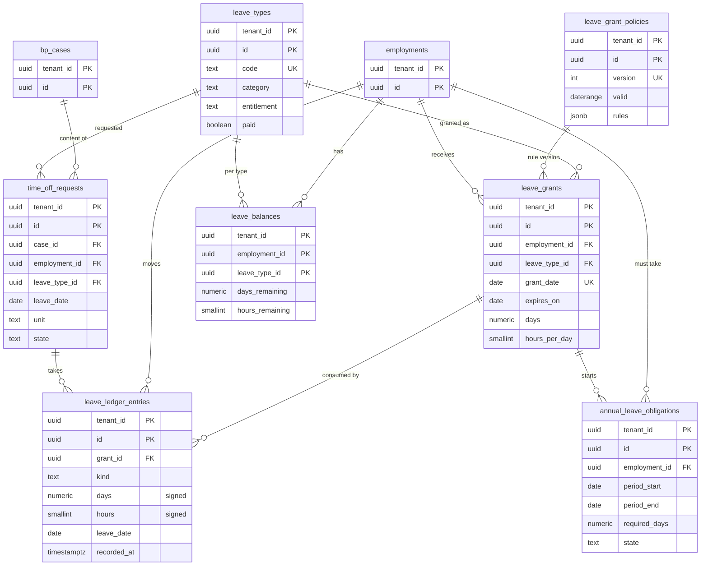

# Data model: 休暇

休暇の種類、付与の方針、年休と特別休暇の付与と台帳、残り、年 5 日の義務、休暇の申請、年次有給休暇管理簿。休職は持たない（[core-hr.md](core-hr.md) の `employment_status`）。振る舞いは [absence-and-leave.md](../absence-and-leave.md)、決定は [ADR-0024](../../decisions/0024-annual-leave-grant-ledger.md)、[ADR-0025](../../decisions/0025-special-leave-and-leave-of-absence-boundary.md)。規約は [data-model.md](../data-model.md) の 3 節。

- 日数は `numeric(5,1)`（0.5 日の単位）、時間は `smallint`（時間の単位。MVP は 1 時間）。
- 残りは有効日付の facet にしない。台帳の `leave_date` と `recorded_at` の 2 つで絞って足す（時点の残り。[absence-and-leave.md](../absence-and-leave.md) の 4.1 節）。
- 保存：付与・台帳・義務は「年次有給休暇管理簿」（履行期間の満了から、既定 5 年）。

## 1. ER 図

## 2. テーブル

### 2.1 `leave_types`

休暇の種類（年休、特別休暇、法定の短期の休暇）。DM-1 で休職の種類と分けた。定義元：[absence-and-leave.md](../absence-and-leave.md) の 3.2 節。

| 列 | 型 | NULL | 既定 | 説明 |
| --- | --- | --- | --- | --- |
| `tenant_id` | `uuid` | NOT NULL | — | |
| `id` | `uuid` | NOT NULL | `uuidv7()` | |
| `code` | `text` | NOT NULL | — | 年休は `sys.annual`（テナントに 1 つ） |
| `name` | `text` | NOT NULL | — | |
| `category` | `text` | NOT NULL | — | `annual`・`special`・`statutory_short` |
| `paid` | `boolean` | NOT NULL | — | |
| `pay_basis` | `text` | NOT NULL | `'none'` | `none`・`normal_wage`・`average_wage`・`fixed`（[payroll-jp-rules.md](../payroll-jp-rules.md) の 7.3 節） |
| `units` | `text[]` | NOT NULL | — | `day`・`half_day`・`hour` |
| `entitlement` | `text` | NOT NULL | — | `ledger`・`per_event`・`unlimited` |
| `per_event_rules` | `jsonb` | NULL | — | `per_event`：事象の種類ごとの日数の上限（本人の結婚、忌引の続柄など） |
| `ledger_rules` | `jsonb` | NULL | — | `ledger` の特別休暇：付与の日、日数、繰越の可否と上限、失効 |
| `counts_as_attendance` | `boolean` | NOT NULL | `false` | 出勤率で出勤とみなすか（DT-ABS-001 の #4） |
| `requires_attachment` | `boolean` | NOT NULL | `false` | |
| `max_days_per_event` | `numeric(5,1)` | NULL | — | |
| `payroll_item_code` | `text` | NULL | — | 給与の項目（`pay_items.code`） |
| `hourly_agreement_on` | `date` | NULL | — | 時間単位の労使協定の記録の日（年休。なければ時間単位を使えない） |
| `active_from`・`active_to` | `date` | NOT NULL・NULL | — | 使える期間 |

- キー：PK `(tenant_id, id)`。UK `(tenant_id, code)`。
- 一意：`(tenant_id) WHERE category = 'annual'`。
- CHECK：`category IN (...)`、`entitlement IN (...)`、`category <> 'annual' OR entitlement = 'ledger'`、`'hour' <> ALL(units) OR category <> 'annual' OR hourly_agreement_on IS NOT NULL`。
- 運用：RLS。保存はテナントの契約の間。

### 2.2 `leave_grant_policies`

付与の方針（斉一的付与、上乗せ）の版（版の表）。`leave_policy_change` で有効化する。定義元：[absence-and-leave.md](../absence-and-leave.md) の 4.4 節。

| 列 | 型 | NULL | 既定 | 説明 |
| --- | --- | --- | --- | --- |
| `tenant_id` | `uuid` | NOT NULL | — | |
| `id` | `uuid` | NOT NULL | `uuidv7()` | |
| `leave_type_id` | `uuid` | NOT NULL | — | 年休か `ledger` の特別休暇 |
| `version` | `int` | NOT NULL | — | |
| `valid` | `daterange` | NOT NULL | — | |
| `rules` | `jsonb` | NOT NULL | — | `uniform_date`（`MM-DD`）、`on_hire`、`first_uniform`（`full`・`prorate`）、`extra_by_service_years`、`attendance_rate_treatment`、`service_continuation_on_rehire` |
| `statutory_check` | `jsonb` | NOT NULL | — | 法定を下回らない検査の結果（366 日 × 所定の 5 区分 × 10 年。PROP-ABS-003）。下回れば保存を拒む |
| `status` | `text` | NOT NULL | `'draft'` | `draft`・`active`・`retired` |
| `activation_case_id` | `uuid` | NULL | — | |

- キー：PK `(tenant_id, id)`。UK `(tenant_id, leave_type_id, version)`。
- 排他：`(tenant_id =, leave_type_id =, valid &&) WHERE status = 'active'`。
- 運用：RLS。保存は年次有給休暇管理簿（付与が版を指す）。

### 2.3 `leave_grants`

付与（1 付与 1 行）。追記のみ。定義元：[absence-and-leave.md](../absence-and-leave.md) の 4.1・4.2 節。

| 列 | 型 | NULL | 既定 | 説明 |
| --- | --- | --- | --- | --- |
| `tenant_id` | `uuid` | NOT NULL | — | |
| `id` | `uuid` | NOT NULL | `uuidv7()` | |
| `employment_id` | `uuid` | NOT NULL | — | |
| `leave_type_id` | `uuid` | NOT NULL | — | |
| `grant_date` | `date` | NOT NULL | — | 基準日（前倒しの付与の日）。実行の日ではない |
| `expires_on` | `date` | NOT NULL | — | 付与の 2 年後の同じ日（その日から使えない） |
| `days` | `numeric(5,1)` | NOT NULL | — | 付与の日数 |
| `statutory_days` | `numeric(5,1)` | NOT NULL | — | そのうち法定の最低 |
| `hours_per_day` | `smallint` | NOT NULL | — | 時間単位の 1 日の時間数（付与のときに固定） |
| `basis` | `jsonb` | NOT NULL | — | 継続勤務の月数、出勤率（10 進の文字列）、比例の行、規則の版。P2 |
| `policy_version_id` | `uuid` | NULL | — | → `leave_grant_policies` |
| `case_id` | `uuid` | NOT NULL | — | 付与の案件（システム）か `special_leave_grant` |
| `recorded_at` | `timestamptz` | NOT NULL | `now()` | |

- キー：PK `(tenant_id, id)`。UK `(tenant_id, employment_id, leave_type_id, grant_date)`（二重の付与の防止）。
- 索引：`(tenant_id, employment_id, leave_type_id, grant_date)` — 古い付与から充てる。`(tenant_id, expires_on)` — 失効の日次の実行。
- CHECK：`days >= 0`、`statutory_days <= days`、`days * 2 = trunc(days * 2)`（0.5 日の単位）、`expires_on > grant_date`。
- 更新：追記のみ。付与の誤りは台帳の `adjust` の行で直す。
- 運用：RLS。保存は年次有給休暇管理簿。
- S1 の量：年 100 万行（1 人 1 回）＋特別休暇。

### 2.4 `leave_ledger_entries`

休暇の動きの台帳。追記のみ。定義元：[absence-and-leave.md](../absence-and-leave.md) の 4.1・4.5・4.6・8・9 節。

| 列 | 型 | NULL | 既定 | 説明 |
| --- | --- | --- | --- | --- |
| `tenant_id` | `uuid` | NOT NULL | — | |
| `id` | `uuid` | NOT NULL | `uuidv7()` | |
| `employment_id` | `uuid` | NOT NULL | — | |
| `grant_id` | `uuid` | NULL | — | 充てた付与（`unlimited`・`per_event` は NULL） |
| `leave_type_id` | `uuid` | NOT NULL | — | |
| `kind` | `text` | NOT NULL | — | `take`・`take_cancel`・`expire`・`adjust`・`migrate`・`day_to_hours` |
| `days` | `numeric(5,1)` | NOT NULL | `0` | 符号つき（取得は負） |
| `hours` | `smallint` | NOT NULL | `0` | 符号つき |
| `leave_date` | `date` | NULL | — | 取得の日（`expire` は失効の日、`migrate` は移行の基準の日） |
| `half` | `text` | NULL | — | 半日：`am`・`pm` |
| `time_off_request_id` | `uuid` | NULL | — | |
| `case_id` | `uuid` | NOT NULL | — | |
| `designated` | `boolean` | NOT NULL | `false` | 使用者の時季の指定 |
| `planned` | `boolean` | NOT NULL | `false` | 計画的付与 |
| `reverses_entry_id` | `uuid` | NULL | — | `take_cancel`・`adjust` が打ち消す行 |
| `recorded_at` | `timestamptz` | NOT NULL | `now()` | |

- キー：PK `(tenant_id, id)`。FK `(tenant_id, grant_id)` → `leave_grants`、`(tenant_id, time_off_request_id)` → `time_off_requests`、`(tenant_id, case_id)` → `bp_cases`。
- 索引：`(tenant_id, employment_id, leave_date)` — 管理簿、勤怠の日の計算。`(tenant_id, grant_id)` — 付与ごとの残り。
- CHECK：`kind IN (...)`、`days <> 0 OR hours <> 0`、`kind <> 'take' OR days <= 0`。
- 遅延制約のトリガー：付与ごとに `days + Σ台帳の days ≥ 0`（時間は `day_to_hours` を含めて ≥ 0）をコミットで確かめる（[data-model.md](../data-model.md) の 5 節）。
- 更新：追記のみ。
- 運用：RLS。保存は年次有給休暇管理簿。
- S1 の量：年 1,500 万行（取得が大半）。

### 2.5 `leave_balances`

雇用 × 休暇の種類の残り（派生。台帳の増分で保つ）。申請の受付の検査で 1 行を読む。

| 列 | 型 | NULL | 既定 | 説明 |
| --- | --- | --- | --- | --- |
| `tenant_id` | `uuid` | NOT NULL | — | |
| `employment_id` | `uuid` | NOT NULL | — | |
| `leave_type_id` | `uuid` | NOT NULL | — | |
| `days_remaining` | `numeric(6,1)` | NOT NULL | — | 失効していない付与の残りの合計 |
| `hours_remaining` | `smallint` | NOT NULL | — | |
| `hours_used_in_grant_year` | `smallint` | NOT NULL | `0` | 時間単位の年の上限（5 日 × `hours_per_day`）の判定 |
| `pending_days` | `numeric(6,1)` | NOT NULL | `0` | 申請中の日数 |
| `updated_at` | `timestamptz` | NOT NULL | — | |

- キー：PK `(tenant_id, employment_id, leave_type_id)`。
- 更新：台帳の追記と同じトランザクション。夜間に台帳から作り直して比べる（食い違いは SEV3）。
- 運用：RLS。派生（保存の対象外）。S1 の量：約 200 万行。

### 2.6 `annual_leave_obligations`

年 5 日の取得義務の履行期間（DT-ABS-003）。付与のたびに作り直す。定義元：[absence-and-leave.md](../absence-and-leave.md) の 5 節。

| 列 | 型 | NULL | 既定 | 説明 |
| --- | --- | --- | --- | --- |
| `tenant_id` | `uuid` | NOT NULL | — | |
| `id` | `uuid` | NOT NULL | `uuidv7()` | |
| `employment_id` | `uuid` | NOT NULL | — | |
| `base_grant_id` | `uuid` | NOT NULL | — | 第一基準日の付与 |
| `second_grant_id` | `uuid` | NULL | — | 按分のときの第二基準日の付与 |
| `period_start`・`period_end` | `date` | NOT NULL | — | 履行期間（`period_end` を含む） |
| `required_days` | `numeric(3,1)` | NOT NULL | — | 求める日数 |
| `rule_row` | `smallint` | NOT NULL | — | DT-ABS-003 の当たった行 |
| `state` | `text` | NOT NULL | `'open'` | `open`・`met`・`obligation_unmet`・`superseded` |
| `notices` | `jsonb` | NOT NULL | `'[]'` | 6・3・1 か月前の案内の記録 |
| `closed_at` | `timestamptz` | NULL | — | |

- キー：PK `(tenant_id, id)`。
- 一意：`(tenant_id, employment_id, base_grant_id) WHERE state <> 'superseded'`。
- 索引：`(tenant_id, period_end) WHERE state = 'open'` — 案内と期間の終わりの判定。
- 更新：作り直しは前の行を `superseded` にして新しい行を足す。
- 運用：RLS。保存は年次有給休暇管理簿。

### 2.7 `time_off_requests`

休暇の申請（`time_off_request` と `annual_leave_designation` の案件の中身の射影）。定義元：[absence-and-leave.md](../absence-and-leave.md) の 5.2・8 節。

| 列 | 型 | NULL | 既定 | 説明 |
| --- | --- | --- | --- | --- |
| `tenant_id` | `uuid` | NOT NULL | — | |
| `id` | `uuid` | NOT NULL | `uuidv7()` | |
| `case_id` | `uuid` | NOT NULL | — | |
| `employment_id` | `uuid` | NOT NULL | — | |
| `leave_type_id` | `uuid` | NOT NULL | — | |
| `leave_date` | `date` | NOT NULL | — | 複数日の申請は日ごとに 1 行 |
| `unit` | `text` | NOT NULL | — | `day`・`half_day`・`hour` |
| `half` | `text` | NULL | — | `am`・`pm` |
| `start_time`・`end_time` | `time` | NULL | — | 時間単位 |
| `hours` | `smallint` | NULL | — | |
| `event` | `jsonb` | NULL | — | `per_event` の事象の日と続柄。P2 |
| `designated` | `boolean` | NOT NULL | `false` | 時季の指定（本人の意見の聴取の記録は案件の payload） |
| `state` | `text` | NOT NULL | `'requested'` | `requested`・`approved`・`denied`・`cancelled` |
| `deny_reason_code` | `text` | NULL | — | 年休の却下は時季変更の理由の区分が必須 |

- キー：PK `(tenant_id, id)`。FK `(tenant_id, case_id)` → `bp_cases`。
- 一意（重なり）：`(tenant_id, employment_id, leave_date) WHERE state IN ('requested','approved') AND unit = 'day'`。半日・時間の重なりは受付の検査（DT-ABS-004 の #7）。
- 索引：`(tenant_id, employment_id, leave_date)` — 勤怠の日の計算、重なりの検査。
- CHECK：`unit IN (...)`、`state IN (...)`、`(unit = 'hour') = (hours IS NOT NULL)`。年休の却下に理由の区分があることは、種類を見るトリガーで確かめる。
- 運用：RLS。保存は年次有給休暇管理簿。S1 の量：月 300 万行。

## 3. ビュー

### 3.1 `annual_leave_register`

年次有給休暇管理簿（施行規則 24 条の 7）。`annual_leave_obligations`・`leave_grants`・`leave_ledger_entries` の射影。列：`tenant_id`、`employment_id`、`period_start`・`period_end`、基準日（第一・第二）、付与の日数、取得の時季（日付と半日・時間）、取得の日数。`known_at` を指定した出力は監査の権限を要する（台帳の `recorded_at <= known_at` で絞る）。出力は [reporting.md](../reporting.md) の 5.1 節の仕組み。
