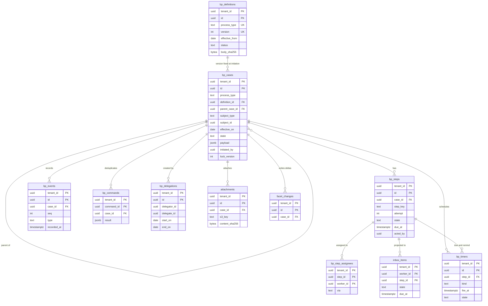

# Data model: 業務プロセス

業務プロセスの定義と版、案件、ステップ、担当、イベント、冪等、タイマー、委任、受信箱、添付。振る舞いは [business-process-engine.md](../business-process-engine.md)、決定は [ADR-0003](../../decisions/0003-business-process-engine.md)、[ADR-0013](../../decisions/0013-bp-definition-format-and-versions.md)〜[ADR-0016](../../decisions/0016-bp-definition-validation-and-activation.md)。規約は [data-model.md](../data-model.md) の 3 節。

## 1. ER 図

## 2. テーブル

### 2.1 `bp_definitions`

業務プロセスの定義の版（版の表）。定義元：[business-process-engine.md](../business-process-engine.md) の 3.3・11 節。

| 列 | 型 | NULL | 既定 | 説明 |
| --- | --- | --- | --- | --- |
| `tenant_id` | `uuid` | NOT NULL | — | |
| `id` | `uuid` | NOT NULL | `uuidv7()` | 版の ID（案件が固定する） |
| `process_type` | `text` | NOT NULL | — | [business-process-engine.md](../business-process-engine.md) の 3.1 節の種類 |
| `version` | `int` | NOT NULL | — | 種類ごとに 1 から |
| `effective_from` | `date` | NOT NULL | — | 起票の日（テナントの暦）がこの日以後の案件に使う |
| `body` | `jsonb` | NOT NULL | — | 定義の JSON（ステップ、式の木、`depends_on`、`cancel`・`rescind`・`correct` の方針、`bulk_approval`、`inherit_approval`） |
| `body_sha256` | `bytea` | NOT NULL | — | RFC 8785 の正規の形のハッシュ |
| `status` | `text` | NOT NULL | `'draft'` | `draft`・`pending_activation`・`active`・`retired` |
| `based_on_version` | `int` | NULL | — | 写した元の版（システムの既定か前の版） |
| `validation` | `jsonb` | NULL | — | 静的な検査・模擬の実行の結果（警告を含む） |
| `created_by`・`created_at` | `uuid`・`timestamptz` | NOT NULL | — | 編集者 |
| `activated_by`・`activated_at` | `uuid`・`timestamptz` | NULL | — | `bp_definition_activation` の承認者と時刻 |
| `activation_case_id` | `uuid` | NULL | — | 有効化の案件 |

- キー：PK `(tenant_id, id)`。UK `(tenant_id, process_type, version)`。FK `(tenant_id, activation_case_id)` → `bp_cases`（`DEFERRABLE`）。
- 一意：`(tenant_id, process_type) WHERE status = 'draft'` — 下書きは種類ごとに 1 つ。
- 索引：`(tenant_id, process_type, effective_from DESC) WHERE status = 'active'` — 起票のときの版の選び方。
- CHECK：`status IN (...)`、`status <> 'active' OR (activated_by IS NOT NULL AND activated_by <> created_by)`（編集と有効化は別の人。S5）。
- 更新：`active` にした後は `status` を `retired` にする更新だけ（トリガー）。
- 運用：RLS。保存はテナントの契約の間（古い版も消さない。案件が指す）。
- S1 の量：テナントあたり種類 40 × 版 数個。全体で数万行。

### 2.2 `bp_cases`

案件。状態機械の正本。定義元：[business-process-engine.md](../business-process-engine.md) の 6 節。

| 列 | 型 | NULL | 既定 | 説明 |
| --- | --- | --- | --- | --- |
| `tenant_id` | `uuid` | NOT NULL | — | |
| `id` | `uuid` | NOT NULL | `uuidv7()` | |
| `process_type` | `text` | NOT NULL | — | |
| `definition_id` | `uuid` | NOT NULL | — | 起票の日に選んだ版 |
| `parent_case_id` | `uuid` | NULL | — | 親の案件（一括、再編、訂正、退職の後の手続き） |
| `relation` | `text` | NULL | — | 親との関係：`child`・`correction`・`rescind`・`bulk_row` |
| `subject_type` | `text` | NOT NULL | — | `worker`・`employment`・`job_assignment`・`organization`・`position`・`role_assignment`・`payroll_run`・`tenant` など |
| `subject_id` | `uuid` | NULL | — | 新しい主体を作る案件（入社）は完了で埋める |
| `job_assignment_id` | `uuid` | NULL | — | ルーティングの起点の職務の割り当て |
| `effective_on` | `date` | NULL | — | 発令の日 |
| `state` | `text` | NOT NULL | `'in_progress'` | `in_progress`・`completed`・`partially_applied`・`cancelled`・`denied`・`rescinded` |
| `payload` | `jsonb` | NOT NULL | — | 提案の値（種類ごとの Zod のスキーマ）。口座は暗号文。P は種類による（最大 P2） |
| `based_on_version_ids` | `uuid[]` | NOT NULL | `'{}'` | 起票者が見た版 |
| `initiated_by` | `uuid` | NOT NULL | — | 起票者（委任では委任した人） |
| `initiated_on_behalf_of` | `uuid` | NULL | — | 実際の操作者が代理人のとき、代理人（[business-process-engine.md](../business-process-engine.md) の 7 節） |
| `initiator_type` | `text` | NOT NULL | `'worker'` | `worker`・`integration`・`system` |
| `initiated_at` | `timestamptz` | NOT NULL | `now()` | |
| `completed_at` | `timestamptz` | NULL | — | |
| `rescinded_by_case_id` | `uuid` | NULL | — | |
| `bulk_batch_id` | `uuid` | NULL | — | 一括の取り込みの行から作ったとき → `bulk_import_batches` |
| `lock_version` | `int` | NOT NULL | `0` | 楽観ロック |

- キー：PK `(tenant_id, id)`。FK `(tenant_id, definition_id)` → `bp_definitions`、`(tenant_id, parent_case_id)` → `bp_cases`。
- 索引：`(tenant_id, subject_type, subject_id, initiated_at DESC)` — 主体の案件の履歴。`(tenant_id, state, process_type) WHERE state IN ('in_progress','partially_applied')` — 進行中の一覧。`(tenant_id, parent_case_id)` — 子の案件。`(tenant_id, initiated_by, initiated_at DESC)` — 自分の申請。
- CHECK：`state IN (...)`、`state <> 'completed' OR completed_at IS NOT NULL`、`state <> 'rescinded' OR rescinded_by_case_id IS NOT NULL`。
- 更新：状態は遷移関数だけ（DT-BP-001）。`payload` は起票と差し戻しの後の再起票だけ。
- 運用：RLS。パーティションなし。保存は案件の対象のデータの種類（例：給与の変更は賃金その他労働関係に関する重要な書類）。
- S1 の量：月 300 万件（休暇の申請が大半）。年 3,600 万行。

### 2.3 `bp_steps`

案件のステップの試行。定義元：[business-process-engine.md](../business-process-engine.md) の 4・6 節。

| 列 | 型 | NULL | 既定 | 説明 |
| --- | --- | --- | --- | --- |
| `tenant_id` | `uuid` | NOT NULL | — | |
| `id` | `uuid` | NOT NULL | `uuidv7()` | |
| `case_id` | `uuid` | NOT NULL | — | |
| `step_key` | `text` | NOT NULL | — | 定義のステップの `key` |
| `step_type` | `text` | NOT NULL | — | `initiation`・`approval`・`approval_group`・`action`・`sub_process`・`service`・`notification`・`completion` |
| `attempt` | `int` | NOT NULL | `1` | 差し戻しで開き直すと増える（5 回まで） |
| `state` | `text` | NOT NULL | `'pending'` | `pending`・`open`・`completed`・`skipped`・`sent_back`・`cancelled`・`stuck` |
| `condition_result` | `boolean` | NULL | — | `when` の評価の結果 |
| `due_at` | `timestamptz` | NULL | — | |
| `opened_at`・`closed_at` | `timestamptz` | NULL | — | |
| `acted_by` | `uuid` | NULL | — | 実際の操作者 |
| `acted_on_behalf_of` | `uuid` | NULL | — | 委任した人 |
| `action` | `text` | NULL | — | `approve`・`send_back`・`deny`・`complete_action`・`service_result` |
| `comment` | `text` | NULL | — | 承認・差し戻しのコメント。P は内容による（画面で個人情報を書かないよう注意を出す） |
| `service_state` | `jsonb` | NULL | — | サービスのステップの試行と補償の記録 |

- キー：PK `(tenant_id, id)`。UK `(tenant_id, case_id, step_key, attempt)`。FK `(tenant_id, case_id)` → `bp_cases`。
- 索引：`(tenant_id, case_id)`。`(tenant_id, state) WHERE state = 'stuck'` — 監視。
- CHECK：`state IN (...)`、`step_type IN (...)`。
- 運用：RLS。保存は案件と同じ。
- S1 の量：案件あたり 3〜5 行。年 1.5 億行。

### 2.4 `bp_step_assignees`

ステップの担当（ルーティングの結果）。定義元：[business-process-engine.md](../business-process-engine.md) の 5 節。

| 列 | 型 | NULL | 既定 | 説明 |
| --- | --- | --- | --- | --- |
| `tenant_id` | `uuid` | NOT NULL | — | |
| `step_id` | `uuid` | NOT NULL | — | |
| `worker_id` | `uuid` | NOT NULL | — | 担当の人 |
| `via` | `text` | NOT NULL | — | `role`・`group`・`fallback`・`reassign`・`escalation`・`subject` |
| `assigned_at` | `timestamptz` | NOT NULL | `now()` | |
| `removed_at` | `timestamptz` | NULL | — | 付け替えで外した時刻 |

- キー：PK `(tenant_id, step_id, worker_id)`。FK `(tenant_id, step_id)` → `bp_steps`、`(tenant_id, worker_id)` → `workers`。
- 索引：`(tenant_id, worker_id) WHERE removed_at IS NULL` — 担当の変化の影響の調べ（異動の発効）。
- 更新：同じトランザクションで `inbox_items` を足す・閉じる。

### 2.5 `bp_events`

案件のイベント。追記のみ。監査の正本の 1 つ。定義元：[business-process-engine.md](../business-process-engine.md) の 6・14 節。

| 列 | 型 | NULL | 既定 | 説明 |
| --- | --- | --- | --- | --- |
| `tenant_id` | `uuid` | NOT NULL | — | |
| `id` | `uuid` | NOT NULL | `uuidv7()` | |
| `case_id` | `uuid` | NOT NULL | — | |
| `seq` | `int` | NOT NULL | — | 案件の中の連番 |
| `type` | `text` | NOT NULL | — | `initiated`・`step_opened`・`approved`・`sent_back`・`denied`・`cancelled`・`reassigned`・`timer_fired`・`completed`・`rescinded`・`corrected`・`stale_basis`・`routing_fallback` など |
| `step_id` | `uuid` | NULL | — | |
| `payload` | `jsonb` | NOT NULL | `'{}'` | 許可リストのスキーマ。値は入れない（ID、コード、条件の評価の結果） |
| `actor` | `uuid` | NULL | — | 実際の操作者（システムは NULL） |
| `actor_type` | `text` | NOT NULL | — | `worker`・`integration`・`system` |
| `on_behalf_of` | `uuid` | NULL | — | |
| `recorded_at` | `timestamptz` | NOT NULL | `clock_timestamp()` | |

- キー：PK `(tenant_id, id, recorded_at)`。UK `(tenant_id, case_id, seq, recorded_at)`（パーティションの鍵を含む。`seq` の一意は案件の行ロックで守る）。
- 索引：`(tenant_id, case_id, seq)`。
- 更新：追記のみ（`app` は `INSERT`・`SELECT`）。
- 運用：RLS。`recorded_at` の月ごとのパーティション。保存は案件の対象のデータの種類の最長。監査の連鎖への入れ方は持ち越し（[data-model.md](../data-model.md) の 8 節）。
- S1 の量：月 3,000 万行。

### 2.6 `bp_commands`

画面・API の操作の冪等。定義元：[business-process-engine.md](../business-process-engine.md) の 6.2 節。

| 列 | 型 | NULL | 既定 | 説明 |
| --- | --- | --- | --- | --- |
| `tenant_id` | `uuid` | NOT NULL | — | |
| `command_id` | `uuid` | NOT NULL | — | 画面・API が付ける |
| `case_id` | `uuid` | NULL | — | 起票では結果の案件 |
| `operation` | `text` | NOT NULL | — | `initiate`・`approve` など |
| `actor` | `uuid` | NOT NULL | — | 同じ `command_id` を別の人が送ったら拒む |
| `result` | `jsonb` | NOT NULL | — | 1 回目の応答（状態と ID だけ） |
| `created_at` | `timestamptz` | NOT NULL | `now()` | |

- キー：PK `(tenant_id, command_id)`。
- 索引：`(created_at)` — 30 日を過ぎた行の削除。
- 運用：RLS。日次のジョブで 30 日より古い行を消す。
- S1 の量：常時 数千万行（30 日分）。

### 2.7 `bp_timers`

期限・督促・エスカレーションのタイマー。定義元：[business-process-engine.md](../business-process-engine.md) の 10.1 節、[ADR-0015](../../decisions/0015-bp-deadlines-reminders-and-inbox.md)。

| 列 | 型 | NULL | 既定 | 説明 |
| --- | --- | --- | --- | --- |
| `tenant_id` | `uuid` | NOT NULL | — | |
| `id` | `uuid` | NOT NULL | `uuidv7()` | |
| `case_id` | `uuid` | NOT NULL | — | |
| `step_id` | `uuid` | NULL | — | 業務の期限（給与の締め）はステップを持たない |
| `kind` | `text` | NOT NULL | — | `due`・`remind`・`escalate`・`auto_deny`・`business_deadline` |
| `fire_at` | `timestamptz` | NOT NULL | — | 営業日で求めた時刻 |
| `state` | `text` | NOT NULL | `'scheduled'` | `scheduled`・`fired`・`cancelled` |
| `fired_at` | `timestamptz` | NULL | — | |

- キー：PK `(tenant_id, id)`。FK `(tenant_id, case_id)` → `bp_cases`、`(tenant_id, step_id)` → `bp_steps`。
- 索引：`(fire_at) WHERE state = 'scheduled'` — `scheduler` のロールの取り出し。`(tenant_id, step_id) WHERE state = 'scheduled'` — ステップが閉じたときの取り消し。
- CHECK：`kind IN (...)`、`state IN (...)`。`auto_deny` は承認のステップに作らない（トリガー）。
- 運用：RLS。`fired`・`cancelled` は 1 年で消す。
- S1 の量：常時 50 万行。

### 2.8 `bp_delegations`

委任の設定。定義元：[business-process-engine.md](../business-process-engine.md) の 7 節。

| 列 | 型 | NULL | 既定 | 説明 |
| --- | --- | --- | --- | --- |
| `tenant_id` | `uuid` | NOT NULL | — | |
| `id` | `uuid` | NOT NULL | `uuidv7()` | |
| `delegator_id` | `uuid` | NOT NULL | — | 委任した人 |
| `delegate_id` | `uuid` | NOT NULL | — | 代理人 |
| `alternate_id` | `uuid` | NULL | — | 代理人の不在のとき受ける人 |
| `scope` | `text` | NOT NULL | — | `initiate`・`inbox`・`both` |
| `process_types` | `text[]` | NOT NULL | `'{}'` | 空は委任できるすべての種類 |
| `start_on`・`end_on` | `date` | NOT NULL | — | テナントの暦。両端を含む。最長 180 日 |
| `created_by_case_id` | `uuid` | NOT NULL | — | `delegation` の案件 |
| `revoked_at` | `timestamptz` | NULL | — | |

- キー：PK `(tenant_id, id)`。
- 排他：`EXCLUDE USING gist (tenant_id WITH =, delegator_id WITH =, daterange(start_on, end_on, '[]') WITH &&) WHERE (revoked_at IS NULL AND process_types = '{}')`。種類を指定した委任の重なりは、種類ごとにアプリで検査する（配列の重なりを排他制約で書けないため）。
- 索引：`(tenant_id, delegate_id, start_on, end_on) WHERE revoked_at IS NULL` — 受信箱の結び（今日有効な委任）。
- CHECK：`delegate_id <> delegator_id`、`end_on >= start_on`、`end_on - start_on <= 180`、`process_types` に `security_policy_activation`・`bp_definition_activation` を含まない。
- 運用：RLS。保存は監査ログと同じ（権限の変更に準じる）。

### 2.9 `inbox_items`

受信箱（担当の割り当ての射影）。定義元：[business-process-engine.md](../business-process-engine.md) の 10.2 節。

| 列 | 型 | NULL | 既定 | 説明 |
| --- | --- | --- | --- | --- |
| `tenant_id` | `uuid` | NOT NULL | — | |
| `worker_id` | `uuid` | NOT NULL | — | 担当の人（委任は写さない） |
| `step_id` | `uuid` | NOT NULL | — | |
| `case_id` | `uuid` | NOT NULL | — | |
| `process_type` | `text` | NOT NULL | — | |
| `reason` | `text` | NOT NULL | — | `assigned`・`escalation`・`fyi` |
| `due_at` | `timestamptz` | NULL | — | |
| `opened_at` | `timestamptz` | NOT NULL | `now()` | |
| `closed_at` | `timestamptz` | NULL | — | |
| `state` | `text` | NOT NULL | `'open'` | `open`・`done`・`withdrawn` |

- キー：PK `(tenant_id, worker_id, step_id)`。
- 索引：`(tenant_id, worker_id, state, due_at)` — 受信箱の一覧（p95 200ms）。
- 運用：RLS。`done`・`withdrawn` は 90 日で消す（案件とイベントは残る）。
- S1 の量：常時 数百万行。

### 2.10 `attachments`

案件と記録に付けるファイル（労働条件の通知の写し、紙の同意書の写し、協定の書面など）の索引。本体は S3 の `attachments/{tenant}/{id}`（[stores.md](stores.md)）。[data-model.md](../data-model.md) の 6 節の DM-14 で定義した。

| 列 | 型 | NULL | 既定 | 説明 |
| --- | --- | --- | --- | --- |
| `tenant_id` | `uuid` | NOT NULL | — | |
| `id` | `uuid` | NOT NULL | `uuidv7()` | |
| `case_id` | `uuid` | NULL | — | 付けた案件 |
| `purpose` | `text` | NOT NULL | — | `labor_conditions_notice`・`wage_payment_consent`・`overtime_agreement`・`labor_office_approval`・`other` |
| `domain` | `text` | NOT NULL | — | 閲覧の権限のドメイン |
| `file_name` | `text` | NOT NULL | — | |
| `content_type` | `text` | NOT NULL | — | PDF・画像だけ |
| `size_bytes` | `bigint` | NOT NULL | — | 20 MB まで |
| `content_sha256` | `bytea` | NOT NULL | — | |
| `s3_key` | `text` | NOT NULL | — | |
| `uploaded_by`・`uploaded_at` | `uuid`・`timestamptz` | NOT NULL | — | |

- キー：PK `(tenant_id, id)`。
- 索引：`(tenant_id, case_id)`。
- アップロードのときに個人番号の形を走査し、あれば拒む（[integrations-and-bulk.md](../integrations-and-bulk.md) の 11 節と同じ）。
- 運用：RLS。保存は `purpose` から決まるデータの種類（例：協定は賃金その他労働関係に関する重要な書類）。
