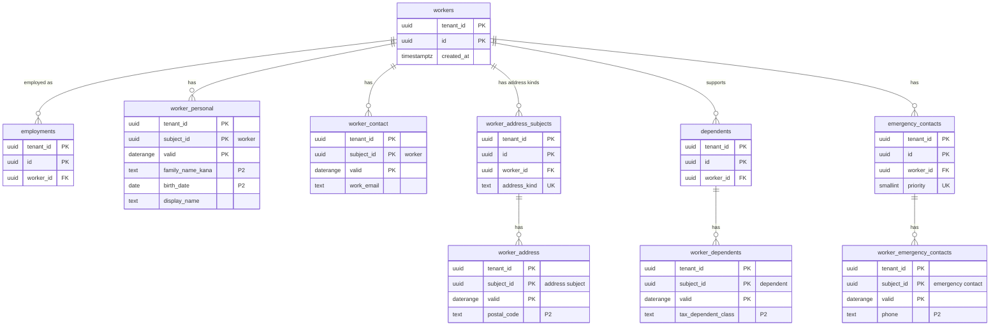
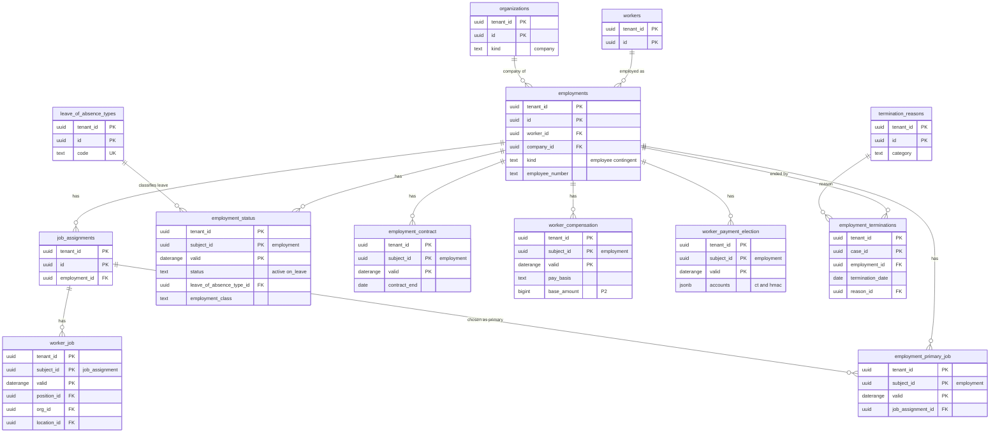
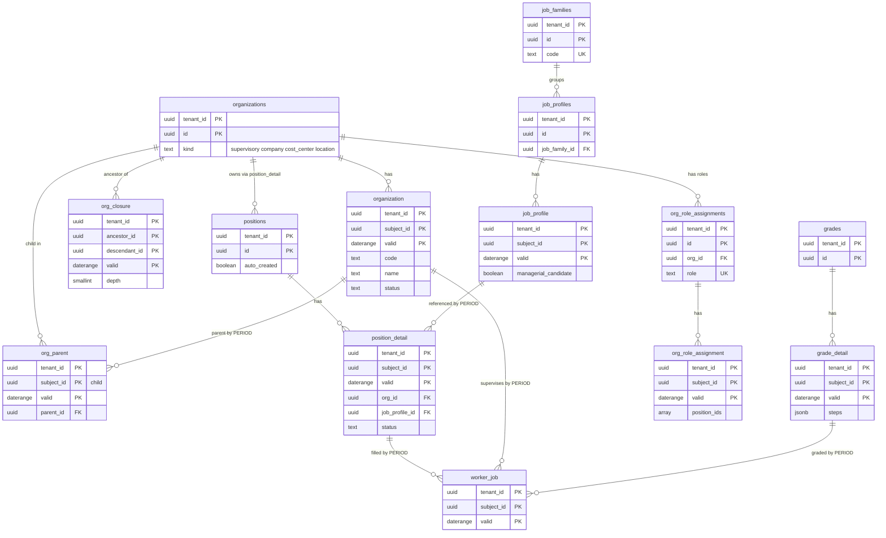

# Data model: Core HR

人・雇用・職務の割り当て、個人の情報、報酬、退職、組織（監督組織・会社・コストセンター・事業所）、階層の閉包、ポジション、職務、等級、組織のロール。振る舞いは [core-hr.md](../core-hr.md)、決定は [ADR-0010](../../decisions/0010-person-employment-job-assignment-model.md)〜[ADR-0012](../../decisions/0012-worker-lifecycle-events-and-legal-checks.md)。facet の 3 つの表の共通の列は [temporal.md](temporal.md) の 2 節、規約は [data-model.md](../data-model.md) の 3 節。

- facet の節は **値の列** だけを書く。現在の表と版の表に型のある列として写すもの（外部キー・検索）には「写す」と書く。それ以外は版の `state` と差分の `delta` の中だけにある。
- 保存（主体のデータの種類）：人・雇用・職務の表と facet は「労働者名簿」（退職の日から、既定 5 年）。退職者のどの規則にも当たらない facet（緊急連絡先など）も、最長の規則が終わるまで（[audit-and-retention.md](../audit-and-retention.md) の 5.2 節）。組織・ポジション・職務・等級はテナントの契約の間。

## 1. ER 図

### 1.1 人と個人の情報

### 1.2 雇用と職務の割り当て

### 1.3 組織・ポジション・職務・等級

## 2. 主体と設定の表

### 2.1 `workers`

同じ個人（再雇用でも同じ）。変わらない属性だけ。定義元：[core-hr.md](../core-hr.md) の 3.1 節。

| 列 | 型 | NULL | 既定 | 説明 |
| --- | --- | --- | --- | --- |
| `tenant_id` | `uuid` | NOT NULL | — | |
| `id` | `uuid` | NOT NULL | `uuidv7()` | |
| `created_by_case_id` | `uuid` | NOT NULL | — | 作った案件（`hire`・`migration`） |
| `created_at` | `timestamptz` | NOT NULL | `now()` | |

- キー：PK `(tenant_id, id)`。FK `(tenant_id, created_by_case_id)` → `bp_cases`。
- 運用：RLS。保存は労働者名簿（最後の雇用の退職から）。行の削除は `retention_purger` が、facet と雇用を消した後に行う。
- S1 の量：約 120 万行（在籍 100 万人と、保存の期間の中の退職者）。

### 2.2 `employments`

1 つの会社との 1 回の雇用。退職と再雇用で別の行。定義元：[core-hr.md](../core-hr.md) の 3.1・7 節。

| 列 | 型 | NULL | 既定 | 説明 |
| --- | --- | --- | --- | --- |
| `tenant_id` | `uuid` | NOT NULL | — | |
| `id` | `uuid` | NOT NULL | `uuidv7()` | |
| `worker_id` | `uuid` | NOT NULL | — | |
| `company_id` | `uuid` | NOT NULL | — | → `organizations`（`kind = 'company'`） |
| `kind` | `text` | NOT NULL | — | `employee`・`contingent` |
| `employee_number` | `text` | NOT NULL | — | 社員番号。P1。同じ人の再雇用は同じ番号（テナントの設定で新しい番号） |
| `created_by_case_id` | `uuid` | NOT NULL | — | `hire`・`rehire`・`migration` の案件 |
| `created_at` | `timestamptz` | NOT NULL | `now()` | |

- キー：PK `(tenant_id, id)`。FK `(tenant_id, worker_id)` → `workers`、`(tenant_id, company_id)` → `organizations`、`(tenant_id, created_by_case_id)` → `bp_cases`。
- 排他：`EXCLUDE USING gist (tenant_id WITH =, employee_number WITH =, worker_id WITH <>)` — 1 つの社員番号は 1 人だけを指す（再雇用の同じ番号は許す）。
- 索引：`(tenant_id, worker_id)` — 人の雇用の一覧。`(tenant_id, employee_number)` — 社員番号での検索、一括の取り込みの主体の解決、SSO の属性での結び。
- CHECK：`kind IN ('employee','contingent')`。会社の種類はトリガーで確かめる。
- 同じ人・同じ会社の雇用の期間の重なりは、`employment_status` の期間で判定する（行ロックとアプリの検査。[data-model.md](../data-model.md) の 5 節）。
- 運用：RLS。保存は労働者名簿。
- S1 の量：約 130 万行。

### 2.3 `job_assignments`

雇用の中の 1 つの仕事（主たる職務と兼務）。`worker_job` の主体。定義元：[core-hr.md](../core-hr.md) の 3.1・3.2 節。

| 列 | 型 | NULL | 既定 | 説明 |
| --- | --- | --- | --- | --- |
| `tenant_id` | `uuid` | NOT NULL | — | |
| `id` | `uuid` | NOT NULL | `uuidv7()` | |
| `employment_id` | `uuid` | NOT NULL | — | |
| `created_by_case_id` | `uuid` | NOT NULL | — | |
| `created_at` | `timestamptz` | NOT NULL | `now()` | |

- キー：PK `(tenant_id, id)`。FK `(tenant_id, employment_id)` → `employments`。
- 索引：`(tenant_id, employment_id)`。
- 主か兼務かは `employment_primary_job` の facet で決まる（行に持たない）。同時の割り当ては 5 まで（アプリの検査）。
- S1 の量：約 140 万行。

### 2.4 `worker_address_subjects`・`dependents`・`emergency_contacts`

人の中の複数の主体（住所の種類ごと、扶養の親族ごと、緊急連絡先ごと）。facet の主体の表（[data-model.md](../data-model.md) の 6 節の DM-9）。

| 表 | 列（`tenant_id`・`id`・`worker_id`・`created_by_case_id`・`created_at` に加えて） | 一意 |
| --- | --- | --- |
| `worker_address_subjects` | `address_kind text NOT NULL`（`resident_register`：住民票、`residence`：居所） | `(tenant_id, worker_id, address_kind)` |
| `dependents` | なし | — |
| `emergency_contacts` | `priority smallint NOT NULL`（1 から） | `(tenant_id, worker_id, priority)` |

- キー：PK `(tenant_id, id)`。FK `(tenant_id, worker_id)` → `workers`。
- `dependents.id` は保管庫の `mn_records.subject_id`（`subject_kind = 'dependent'`）と `mn_links` の主体でもある。
- 上限：扶養の親族 20（アプリ）。
- 運用：RLS。保存は主体の人と同じ。
- S1 の量：住所 150 万、扶養 120 万、緊急連絡先 100 万行。

### 2.5 `employment_terminations`

退職の記録（理由、通知の日、警告への理由）。`terminate` の案件の完了で書く射影。定義元：[core-hr.md](../core-hr.md) の 5.4 節（DT-HR-002）。facet は退職で閉じて状態が消えるので、退職の事由（労働者名簿の記入の事項）をここに持つ（[data-model.md](../data-model.md) の 6 節の DM-14）。

| 列 | 型 | NULL | 既定 | 説明 |
| --- | --- | --- | --- | --- |
| `tenant_id` | `uuid` | NOT NULL | — | |
| `case_id` | `uuid` | NOT NULL | — | `terminate`・`contract_end` の案件 |
| `employment_id` | `uuid` | NOT NULL | — | |
| `termination_date` | `date` | NOT NULL | — | 退職日（最後の在籍日）。雇用の `valid` の上限はこの翌日 |
| `last_working_day` | `date` | NULL | — | 最終出勤日 |
| `reason_id` | `uuid` | NOT NULL | — | → `termination_reasons`。P2（`worker.employment.termination_details`） |
| `notice_on` | `date` | NULL | — | 通知の日（解雇なら予告の日） |
| `warnings` | `jsonb` | NOT NULL | `'[]'` | DT-HR-002 の当たった行の番号と不足の日数 |
| `override_reason` | `text` | NULL | — | 警告を見て進めた理由。P2 |
| `labor_office_approval` | `jsonb` | NULL | — | 除外の認定の記録（日付、添付の ID）。DT-HR-002 の #4 |
| `recorded_at` | `timestamptz` | NOT NULL | — | |
| `rescinded_at` | `timestamptz` | NULL | — | 退職の取消で埋める |

- キー：PK `(tenant_id, case_id)`。FK `(tenant_id, employment_id)` → `employments`、`(tenant_id, reason_id)` → `termination_reasons`。
- 一意：`(tenant_id, employment_id) WHERE rescinded_at IS NULL` — 雇用に生きている退職は 1 つ。
- 更新：追記のみ。`rescinded_at` の埋め込みだけを案件の取消の関数に許す。
- 運用：RLS。保存は「雇入れ・退職に関する書類」（既定 5 年）。
- S1 の量：年 10 万行ほど（退職率 10% と置く）。

### 2.6 `organizations`

組織の主体（変わらない属性）。定義元：[core-hr.md](../core-hr.md) の 4.1 節。

| 列 | 型 | NULL | 既定 | 説明 |
| --- | --- | --- | --- | --- |
| `tenant_id` | `uuid` | NOT NULL | — | |
| `id` | `uuid` | NOT NULL | `uuidv7()` | |
| `kind` | `text` | NOT NULL | — | `supervisory`・`company`・`cost_center`・`location` |
| `created_by_case_id` | `uuid` | NOT NULL | — | |
| `created_at` | `timestamptz` | NOT NULL | `now()` | |

- キー：PK `(tenant_id, id)`。
- 索引：`(tenant_id, kind)`。
- CHECK：`kind IN (...)`。監督組織の木の根は 1 つ（`org_parent` の検査）。
- 上限：1 テナント 20,000（全種類。アプリ）。
- 運用：RLS。保存はテナントの契約の間。
- S1 の量：最大のテナントで 3,000。全体で 30 万行ほど。

### 2.7 `org_closure`

監督組織（とコストセンター）の階層の、日付の範囲つきの閉包。派生の表。定義元：[core-hr.md](../core-hr.md) の 4.2 節、[ADR-0011](../../decisions/0011-effective-dated-org-hierarchy-closure.md)。

| 列 | 型 | NULL | 既定 | 説明 |
| --- | --- | --- | --- | --- |
| `tenant_id` | `uuid` | NOT NULL | — | |
| `ancestor_id` | `uuid` | NOT NULL | — | 自分自身を含む（`depth = 0`） |
| `descendant_id` | `uuid` | NOT NULL | — | |
| `depth` | `smallint` | NOT NULL | — | 0〜15 |
| `valid` | `daterange` | NOT NULL | — | |

- キー：PK `(tenant_id, ancestor_id, descendant_id, valid WITHOUT OVERLAPS)`。
- 索引：GiST `(tenant_id, descendant_id, valid)` — 権限の `scopeFilter`（対象の組織が根の下位か）とルーティング（上へたどる）。主キーの GiST は「根の下の全部」を引く。
- CHECK：`depth BETWEEN 0 AND 15`、`NOT isempty(valid)`。
- 更新：`org_parent` の差分と同じトランザクションで、動いた部分木の影響の日から後を作り直す（`temporal_owner` の関数）。夜間に辺から作り直して突き合わせる（`rebuild_org_closure(tenant)`）。
- 運用：RLS。保存は `organizations` と同じ。
- S1 の量：最大のテナントで 1 日の区切りあたり 1.8 万行、再編を重ねて 10 万行。全体で 500 万行ほど。

### 2.8 `positions`

ポジションの主体。定義元：[core-hr.md](../core-hr.md) の 4.3 節。

| 列 | 型 | NULL | 既定 | 説明 |
| --- | --- | --- | --- | --- |
| `tenant_id` | `uuid` | NOT NULL | — | |
| `id` | `uuid` | NOT NULL | `uuidv7()` | |
| `auto_created` | `boolean` | NOT NULL | `false` | ジョブ管理の組織で入社・異動のときに自動で作った |
| `created_by_case_id` | `uuid` | NOT NULL | — | |
| `created_at` | `timestamptz` | NOT NULL | `now()` | |

- キー：PK `(tenant_id, id)`。
- 運用：RLS。保存はテナントの契約の間。
- S1 の量：最大のテナントで 3.5 万。全体で 120 万行ほど。

### 2.9 `job_families`・`job_profiles`・`grades`

職種（`job_families`。有効日付を持たない分類）と、職務・等級の facet の主体。定義元：[core-hr.md](../core-hr.md) の 4.3 節。

| 表 | 列（`tenant_id`・`id`・`created_at` に加えて） | 一意 |
| --- | --- | --- |
| `job_families` | `code text NOT NULL`、`name text NOT NULL`、`active boolean NOT NULL DEFAULT true` | `(tenant_id, code)` |
| `job_profiles` | `job_family_id uuid NOT NULL`（→ `job_families`）、`created_by_case_id uuid NOT NULL` | — |
| `grades` | `created_by_case_id uuid NOT NULL` | — |

- 職務・等級のコードと名前は facet（`job_profile`・`grade_detail`）にあり、コードの一意は現在の表の排他制約で守る（4 節）。
- 運用：RLS。保存はテナントの契約の間。
- S1 の量：どれもテナントあたり数百。

### 2.10 `org_role_assignments`

組織×ロールの主体（`org_role_assignment` の facet の主体）。定義元：[core-hr.md](../core-hr.md) の 4.5 節。

| 列 | 型 | NULL | 既定 | 説明 |
| --- | --- | --- | --- | --- |
| `tenant_id` | `uuid` | NOT NULL | — | |
| `id` | `uuid` | NOT NULL | `uuidv7()` | |
| `org_id` | `uuid` | NOT NULL | — | → `organizations` |
| `role` | `text` | NOT NULL | — | `manager`・`hr_partner`・`payroll_admin`・`time_admin` など（システムの一覧＋テナントの追加） |
| `created_at` | `timestamptz` | NOT NULL | `now()` | |

- キー：PK `(tenant_id, id)`。UK `(tenant_id, org_id, role)`。FK `(tenant_id, org_id)` → `organizations`。
- 運用：RLS。保存はテナントの契約の間。権限の変更として監査する（`role_assignment_change`）。

### 2.11 `leave_of_absence_types`

休職の種類（DM-1）。テナントの設定。定義元：[core-hr.md](../core-hr.md) の 5.2 節、[ADR-0025](../../decisions/0025-special-leave-and-leave-of-absence-boundary.md)。

| 列 | 型 | NULL | 既定 | 説明 |
| --- | --- | --- | --- | --- |
| `tenant_id` | `uuid` | NOT NULL | — | |
| `id` | `uuid` | NOT NULL | `uuidv7()` | |
| `code` | `text` | NOT NULL | — | システムの種類は `sys.` で始まる（業務上の傷病、私傷病、産前産後、育児、介護、出向、その他） |
| `name` | `text` | NOT NULL | — | |
| `pay_treatment` | `text` | NOT NULL | `'unpaid'` | `unpaid`・`partial`・`paid`（意味の判定は給与と社労士の確認） |
| `si_exemption_candidate` | `boolean` | NOT NULL | `false` | 社会保険料の免除の候補を示すか |
| `dismissal_protected` | `boolean` | NOT NULL | `false` | 解雇の制限の対象か（DT-HR-002 の #2） |
| `counts_as_attendance` | `boolean` | NOT NULL | `false` | 年休の出勤率で出勤とみなすか。39 条 10 項の 4 種は `true` で外せない（トリガー） |
| `is_system` | `boolean` | NOT NULL | `false` | |
| `active` | `boolean` | NOT NULL | `true` | 使わなくなった種類は `false`（行は消さない） |

- キー：PK `(tenant_id, id)`。UK `(tenant_id, code)`。
- 運用：RLS。変更は設定の画面（ドメインの `modify`）で、監査に残す。種類そのものが機微（`worker.employment.leave_type`）なのは、facet の中の割り当てで、この表ではない。

### 2.12 `termination_reasons`

退職の理由の区分。テナントの設定。定義元：[core-hr.md](../core-hr.md) の 5.4 節。

| 列 | 型 | NULL | 既定 | 説明 |
| --- | --- | --- | --- | --- |
| `tenant_id` | `uuid` | NOT NULL | — | |
| `id` | `uuid` | NOT NULL | `uuidv7()` | |
| `code` | `text` | NOT NULL | — | |
| `name` | `text` | NOT NULL | — | |
| `category` | `text` | NOT NULL | — | `voluntary`・`company`・`dismissal`・`retirement_age`・`contract_end`・`death`・`transfer`・`other`（DT-HR-002 の判定に使う） |
| `active` | `boolean` | NOT NULL | `true` | |

- キー：PK `(tenant_id, id)`。UK `(tenant_id, code)`。CHECK：`category IN (...)`。
- 運用：RLS。

## 3. 人と雇用の facet

### 3.1 `worker_personal`（主体：`workers`、contiguous）

| 列 | 型 | NULL | 説明 |
| --- | --- | --- | --- |
| `family_name`・`given_name` | `text` | NOT NULL | 漢字の氏名。P2。写す |
| `family_name_kana`・`given_name_kana` | `text` | NOT NULL | カナ。P2。写す（検索） |
| `family_name_roman`・`given_name_roman` | `text` | NULL | P2 |
| `former_family_name` | `text` | NULL | 旧姓。P2 |
| `use_former_name` | `boolean` | NOT NULL | 旧姓の併記の希望 |
| `display_name` | `text` | NOT NULL | 表示の名前（`worker.public`）。P1。写す |
| `birth_date` | `date` | NOT NULL | P2。写す（年齢の判定）。訂正だけで変える |
| `sex` | `text` | NOT NULL | `female`・`male`・`unspecified`（賃金台帳・届出の区分）。P2 |
| `nationality` | `text` | NULL | ISO 3166-1。P2 |
| `disability_class` | `text` | NOT NULL | `none`・`general`・`special`（本人の障害者控除の区分だけ。病名は持たない。L10）。P2 |

- 索引（現在の表）：GIN `pg_trgm` `(family_name_kana || given_name_kana)`、`(family_name || given_name)` — 人の検索と入社の重複の確認（DM-13）。`(tenant_id, birth_date)` — 重複の候補。
- マイナンバーは持たない（`mn_links`。[vault.md](vault.md)）。

### 3.2 `worker_address`（主体：`worker_address_subjects`、gapped）

| 列 | 型 | NULL | 説明 |
| --- | --- | --- | --- |
| `postal_code` | `text` | NOT NULL | `^[0-9]{7}$`。P2 |
| `prefecture` | `text` | NOT NULL | JIS X 0401 の 2 桁。P2 |
| `city` | `text` | NOT NULL | 市区町村。P2 |
| `municipality_code` | `text` | NULL | 全国地方公共団体コード（6 桁）。P2 |
| `street` | `text` | NOT NULL | 町域以下。P2 |
| `building` | `text` | NULL | P2 |
| `street_kana` | `text` | NULL | P2 |

### 3.3 `worker_contact`（主体：`workers`、contiguous）

| 列 | 型 | NULL | 説明 |
| --- | --- | --- | --- |
| `personal_phone` | `text` | NULL | P2（`worker.contact`） |
| `personal_email` | `text` | NULL | P2。通知の宛先に使わない（通知はログインのメール） |
| `work_phone` | `text` | NULL | P1（`worker.public`） |
| `work_email` | `text` | NULL | P1（`worker.public`）。写す（SSO の属性での結び） |

### 3.4 `worker_dependents`（主体：`dependents`、gapped）

| 列 | 型 | NULL | 説明 |
| --- | --- | --- | --- |
| `relationship` | `text` | NOT NULL | `spouse`・`child`・`parent`・`other_relative` など。P2 |
| `family_name`・`given_name`・`family_name_kana`・`given_name_kana` | `text` | NOT NULL | P2 |
| `birth_date` | `date` | NOT NULL | P2 |
| `sex` | `text` | NULL | P2 |
| `cohabiting` | `boolean` | NOT NULL | 同居。P2 |
| `disability_class` | `text` | NOT NULL | `none`・`general`・`special`・`special_cohabiting`。P2 |
| `tax_dependent_class` | `text` | NOT NULL | `none`・`spouse_withholding`・`general`・`specified`・`elderly`・`elderly_cohabiting`・`specified_relative`（令和 8 年分の特定親族を含む。判定の関数は DT-JP-002）。P2 |
| `si_dependent` | `boolean` | NOT NULL | 健康保険の被扶養者。P2 |
| `income_estimate` | `bigint` | NULL | 所得の見積額（円）。税の扶養の判定の入力。P2 |

- `tax_dependent_class` の数え上げは `worker_tax_profile` の計算の入力（[payroll-jp.md](payroll-jp.md)）。この facet は申告の内容を持つだけ。

### 3.5 `worker_emergency_contacts`（主体：`emergency_contacts`、gapped）

| 列 | 型 | NULL | 説明 |
| --- | --- | --- | --- |
| `name` | `text` | NOT NULL | P2 |
| `relationship` | `text` | NOT NULL | P2 |
| `phone` | `text` | NOT NULL | P2 |

### 3.6 `employment_status`（主体：`employments`、gapped）

在籍と休職。入社で始まり、退職で `end`（翌日）。定義元：[core-hr.md](../core-hr.md) の 3.3・5.2 節。

| 列 | 型 | NULL | 説明 |
| --- | --- | --- | --- |
| `status` | `text` | NOT NULL | `active`・`on_leave`。写す |
| `leave_of_absence_type_id` | `uuid` | NULL | `status = 'on_leave'` のとき必須。→ `leave_of_absence_types`。P2（`worker.employment.leave_type`）。写す |
| `employment_class` | `text` | NOT NULL | `regular`・`contract`・`part_time`・`shokutaku`。写す |
| `time_class` | `text` | NOT NULL | `full_time`・`part_time` |
| `scheduled_minutes_per_day` | `int` | NOT NULL | 1 日の所定労働時間（分） |
| `scheduled_minutes_per_week` | `int` | NOT NULL | 週の所定労働時間（分）。年休の比例付与の判定（DT-ABS-002） |
| `scheduled_days_per_week` | `smallint` | NULL | 週で定める人 |
| `scheduled_days_per_year` | `smallint` | NULL | 週以外で定める人 |

- 現在の表の CHECK：`(status = 'on_leave') = (leave_of_absence_type_id IS NOT NULL)`、`scheduled_days_per_week IS NOT NULL OR scheduled_days_per_year IS NOT NULL`。
- 索引（現在の表）：GiST `(tenant_id, status, valid)` — 休職中の一覧。
- coverage の親として、他の雇用の facet の `PERIOD` の外部キーの参照先になる。

### 3.7 `employment_contract`（主体：`employments`、gapped）

| 列 | 型 | NULL | 説明 |
| --- | --- | --- | --- |
| `contract_start`・`contract_end` | `date` | NULL | 有期の契約の期間（含む）。`contingent` は `contract_end` 必須 |
| `renewal_count` | `smallint` | NOT NULL | 更新の回数 |
| `workplace_initial`・`workplace_change_scope` | `text` | NULL | 就業の場所と、その変更の範囲（令和 6 年 4 月からの明示の事項） |
| `duties_initial`・`duties_change_scope` | `text` | NULL | 業務と、その変更の範囲 |
| `notice_delivered_on` | `date` | NULL | 労働条件の通知の交付の日 |
| `notice_attachment_id` | `uuid` | NULL | → `attachments`（写し） |
| `supplier_company_name` | `text` | NULL | 外部の人の提供元の会社 |
| `contract_number` | `text` | NULL | 外部の人の契約の番号 |

### 3.8 `employment_primary_job`（主体：`employments`、contiguous）

| 列 | 型 | NULL | 説明 |
| --- | --- | --- | --- |
| `job_assignment_id` | `uuid` | NOT NULL | その日の主たる職務。写す。`PERIOD` の外部キー → `worker_job` |

- 雇用ごとに毎日ちょうど 1 つ（PROP-HR-002）。給与の既定の組織・事業所・コストセンターはここから取る。

### 3.9 `worker_job`（主体：`job_assignments`、contiguous）

定義元：[core-hr.md](../core-hr.md) の 3.3 節、[object-model-and-effective-dating.md](../object-model-and-effective-dating.md) の 4 節。

| 列 | 型 | NULL | 説明 |
| --- | --- | --- | --- |
| `employment_id` | `uuid` | NOT NULL | coverage の親。現在の表の列 |
| `position_id` | `uuid` | NOT NULL | 写す。`PERIOD` → `position_detail` |
| `job_profile_id` | `uuid` | NOT NULL | 写す。`PERIOD` → `job_profile` |
| `org_id` | `uuid` | NOT NULL | 監督組織。写す。`PERIOD` → `organization` |
| `cost_center_id` | `uuid` | NULL | 写す。`PERIOD` → `organization` |
| `location_id` | `uuid` | NOT NULL | 事業所。写す。`PERIOD` → `organization` |
| `grade_id` | `uuid` | NULL | 写す。`PERIOD` → `grade_detail` |
| `job_level` | `text` | NULL | 職位（表示） |

- 現在の表の索引：GiST `(tenant_id, org_id, valid)` — 組織の全員の一覧、権限の対象の組織。GiST `(tenant_id, position_id, valid)` — ポジションに 1 人（PROP-HR-004 の検査）。GiST `(tenant_id, location_id, valid)` — 事業所ごとの 36 協定・賃金台帳。
- 版の表の索引：GiST `(tenant_id, org_id, valid, known)` — `known_at` を指定した組織の一覧。

### 3.10 `worker_compensation`（主体：`employments`、contiguous）

| 列 | 型 | NULL | 説明 |
| --- | --- | --- | --- |
| `pay_basis` | `text` | NOT NULL | `monthly`・`daily`・`hourly` |
| `base_amount` | `bigint` | NOT NULL | 基本給（円。月額・日額・時間額）。P2 |
| `allowances` | `jsonb` | NOT NULL | `[{"code": "family", "amount": 10000}]`。50 件まで。コードは `pay_items` の項目。P2 |
| `grade_id` | `uuid` | NULL | 写す。`PERIOD` → `grade_detail` |
| `grade_step` | `smallint` | NULL | 号俸 |

- CHECK：`base_amount >= 0`。兼務の手当は `allowances` の 1 つ（[core-hr.md](../core-hr.md) の 3.2 節）。

### 3.11 `worker_payment_election`（主体：`employments`、gapped）

振込先。定義元：[core-hr.md](../core-hr.md) の 3.3 節、[payments-and-accounting.md](../payments-and-accounting.md) の 3.1 節。

| 列 | 型 | NULL | 説明 |
| --- | --- | --- | --- |
| `accounts` | `jsonb` | NOT NULL | 1〜3 件：`seq`、`bank_code`（4 桁）、`bank_name`、`branch_code`（3 桁）、`branch_name`、`account_type`（`1` 普通・`2` 当座・`4` 貯蓄）、`account_number_ct`（暗号文の base64）、`account_hmac`（base64）、`holder_kana`（全銀協の文字の検査済み）、`allocation`（`{"kind": "fixed", "amount": 50000}`・`{"kind": "percent", "rate": "0.3"}`・`{"kind": "remainder"}`）、`priority`。P2 |
| `account_hmacs` | `bytea[]` | NOT NULL | 口座ごとの `account_hmac`。写す（重複の検知） |

- 現在の表の索引：GIN `(account_hmacs)` — 新しい口座が別の従業員の口座と同じかの警告（THR-022）。
- CHECK（Zod と現在の表のトリガー）：口座 1〜3、`remainder` はちょうど 1 つ、`percent` の合計 ≦ 1。
- 口座番号の平文は差分・版・現在のどれにも入らない。

## 4. 組織の facet

### 4.1 `organization`（主体：`organizations`、gapped）

| 列 | 型 | NULL | 説明 |
| --- | --- | --- | --- |
| `kind` | `text` | NOT NULL | 主体の `kind` の写し（排他制約のため）。写す |
| `code` | `text` | NOT NULL | 写す |
| `name` | `text` | NOT NULL | 写す |
| `name_en` | `text` | NULL | |
| `status` | `text` | NOT NULL | `active`・`inactive`（廃止は `end`。`inactive` は凍結） |
| `staffing_model` | `text` | NULL | 監督組織だけ：`position`・`job`（[ADR-0010](../../decisions/0010-person-employment-job-assignment-model.md)） |
| `corporate_number` | `text` | NULL | 会社だけ：法人番号（13 桁。個人番号ではない） |
| `si_office_id` | `uuid` | NULL | 事業所だけ：社会保険の適用事業所 → `si_offices` |
| `labor_insurance_office_id` | `uuid` | NULL | 事業所だけ：労働保険の適用事業所 → `labor_insurance_offices` |
| `address` | `jsonb` | NULL | 事業所の所在地 |
| `gl_dimension_code` | `text` | NULL | コストセンターだけ：会計の部門のコード |

- 現在の表の排他：`EXCLUDE USING gist (tenant_id WITH =, kind WITH =, code WITH =, valid WITH &&)` — 同じ日に同じ種類・同じコードの組織は 1 つ。
- CHECK：種類ごとの列だけを持つ（例：`kind <> 'location'` なら `si_office_id IS NULL`）。

### 4.2 `org_parent`（主体：`organizations`（子）、gapped）

| 列 | 型 | NULL | 説明 |
| --- | --- | --- | --- |
| `parent_id` | `uuid` | NOT NULL | 写す。`PERIOD` → `organization` |

- 監督組織とコストセンターだけが持つ。会社と事業所は階層を持たない（アプリの検査）。
- 循環（`ORG_CYCLE`）と深さ 15 は、閉包を引いて判定する。変更と `org_closure` の作り直しを同じトランザクションで行う。

### 4.3 `position_detail`（主体：`positions`、gapped）

| 列 | 型 | NULL | 説明 |
| --- | --- | --- | --- |
| `org_id` | `uuid` | NOT NULL | 所属の監督組織。写す。`PERIOD` → `organization`（coverage） |
| `job_profile_id` | `uuid` | NOT NULL | 写す。`PERIOD` → `job_profile` |
| `location_id` | `uuid` | NULL | 写す |
| `cost_center_id` | `uuid` | NULL | 写す |
| `status` | `text` | NOT NULL | `open`・`filled`・`frozen`・`closed`。写す |
| `title` | `text` | NULL | |

- 現在の表の索引：GiST `(tenant_id, org_id, status, valid)` — 組織図の空きのポジションの数、入社・異動の候補。

### 4.4 `job_profile`（主体：`job_profiles`、gapped）

| 列 | 型 | NULL | 説明 |
| --- | --- | --- | --- |
| `code` | `text` | NOT NULL | 写す |
| `name` | `text` | NOT NULL | |
| `grade_min_id`・`grade_max_id` | `uuid` | NULL | 職務の等級の範囲 |
| `managerial_candidate` | `boolean` | NOT NULL | 管理監督者に当たりうるかの印（判断は企業。L6） |
| `default_employment_class` | `text` | NULL | |

- 現在の表の排他：`(tenant_id =, code =, valid &&)`。

### 4.5 `grade_detail`（主体：`grades`、gapped）

| 列 | 型 | NULL | 説明 |
| --- | --- | --- | --- |
| `code` | `text` | NOT NULL | 写す |
| `name` | `text` | NOT NULL | |
| `rank` | `smallint` | NOT NULL | 並び（昇格・降格の判定） |
| `steps` | `jsonb` | NOT NULL | 号俸の表 `[{"step": 1, "base_amount": 250000}]`。P0（表で、個人の額ではない） |

- 現在の表の排他：`(tenant_id =, code =, valid &&)`。

### 4.6 `org_role_assignment`（主体：`org_role_assignments`、gapped）

| 列 | 型 | NULL | 説明 |
| --- | --- | --- | --- |
| `position_ids` | `uuid[]` | NOT NULL | 割り当てたポジション（`manager` は 1 つ）。写す |
| `include_subordinates` | `boolean` | NOT NULL | 権限の範囲に下位の組織を含むか |

- 現在の表の索引：GIN `(position_ids)` — ポジションから持つロールを引く（権限の表の作り直し、ルーティング）。
- CHECK：`role = 'manager'` なら要素 1 つ（主体の `role` を見るトリガー）。
- 変更は権限の変更として、職務分掌の検査点 2 を通る（[security-model.md](../security-model.md) の 5.3 節）。
