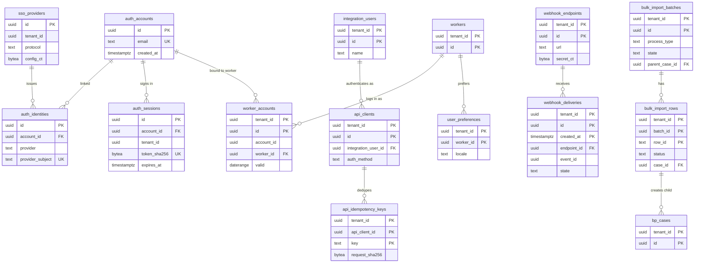

# Data model: ログインと連携

ログイン（Better Auth の表。テナントの外）、SSO の接続、アカウントと人の結び、API の利用者と連携用の利用者、公開の API の冪等、Webhook、一括の取り込み、画面の設定と計測。振る舞いは [integrations-and-bulk.md](../integrations-and-bulk.md) と [self-service-ui.md](../self-service-ui.md)、決定は [ADR-0042](../../decisions/0042-bulk-import-through-business-processes.md)、[ADR-0044](../../decisions/0044-sso-api-clients-and-clock-terminals.md)、[ADR-0038](../../decisions/0038-single-responsive-spa-and-offline-clock.md)。規約は [data-model.md](../data-model.md) の 3 節（Better Auth の表の扱いは 3.3.2 節）。

- 打刻機の表（`clock_terminals`、`terminal_badges`、`unmatched_clock_events`）は [time.md](time.md)、移行と並行稼働の表は [payroll.md](payroll.md) の 6 節。

## 1. ER 図

## 2. ログイン（Better Auth。テナントの外）

Better Auth の表を本システムの名前に改名して使う（`auth_` の接頭辞）。列は Better Auth の版に合わせ、ここには本システムが頼る列だけを書く。読み書きは `packages/auth` だけ（lint）。定義元：[integrations-and-bulk.md](../integrations-and-bulk.md) の 7 節、[data-model.md](../data-model.md) の 3.3.2 節（DM-3）。

| 表 | 本システムが頼る列 | キー・制約 | 備考 |
| --- | --- | --- | --- |
| `auth_accounts` | `id uuid`、`email text NULL`（P1）、`email_verified boolean`、`created_at`、`disabled_at timestamptz NULL` | PK `(id)`。UK `(lower(email))` | 人事のデータを置かない。パスワードの列は使わない（パスワードでログインしない） |
| `auth_identities` | `id`、`account_id`、`provider text`（`saml:<sso_provider_id>`・`oidc:<sso_provider_id>`・`passkey`・`email_otp`・`enrollment_code`）、`provider_subject text`、パスキーの公開鍵と資格情報の ID | PK `(id)`。UK `(provider, provider_subject)` | 初回の登録のコードはハッシュで持ち、1 回限り 72 時間 |
| `auth_sessions` | `id`、`account_id`、`tenant_id uuid NOT NULL`、`token_sha256 bytea`、`created_at`、`last_seen_at`、`idle_timeout_s int`、`expires_at`（絶対 12 時間）、`step_up_at timestamptz NULL`、`revoked_at` | PK `(id)`。UK `(token_sha256)`。索引 `(account_id)`、`(tenant_id, account_id)` | セッションのテナントとホスト名のテナントが違えば拒む（THR-002）。退職の翌日 0 時に失効（発効のタイマー） |
| `auth_verifications` | `id`、`identifier`、`value_sha256`、`expires_at` | PK `(id)` | メールの OTP など。期限の後に消す |
| `sso_providers` | `id`、`tenant_id uuid NOT NULL`、`protocol text`（`saml`・`oidc`）、`issuer text`、`domain text`、`config_ct bytea`（OIDC のクライアントの秘密、SAML の SP の鍵などをテナントの鍵で暗号化）、`attribute_map jsonb`（社員番号かメールで結ぶ）、`required_for_roles text[]`、`created_by`、`disabled_at` | PK `(id)`。UK `(tenant_id, issuer)` | 登録は本システムの管理 API（`security.admin`）の後に、サーバーの側で Better Auth の関数を呼ぶ |

- 運用：RLS なし（3.3 節）。セッションは DB が正本で、Valkey にキャッシュ（[stores.md](stores.md)）。保存：セッションは失効から 30 日、アカウントは結びがなくなってから 1 年。ログインの成功・失敗は `audit_events`。
- S1 の量：アカウント 100 万、セッション 常時 数十万行。

## 3. アカウントと人

### 3.1 `worker_accounts`

ログインのアカウントと人の結び（期間つきの行。テナントの中）。定義元：[integrations-and-bulk.md](../integrations-and-bulk.md) の 7.2 節。

| 列 | 型 | NULL | 既定 | 説明 |
| --- | --- | --- | --- | --- |
| `tenant_id` | `uuid` | NOT NULL | — | |
| `id` | `uuid` | NOT NULL | `uuidv7()` | |
| `account_id` | `uuid` | NOT NULL | — | → `auth_accounts`（テナントの外。DB の FK なし） |
| `worker_id` | `uuid` | NOT NULL | — | |
| `valid` | `daterange` | NOT NULL | — | 入社の発効で始め、退職の発効で閉じる |
| `bound_by` | `text` | NOT NULL | — | `sso_attribute`・`enrollment_code`・`admin` |
| `emergency_admin` | `boolean` | NOT NULL | `false` | IdP の障害のときにログインできる非常用の管理者 |

- キー：PK `(tenant_id, id)`。FK `(tenant_id, worker_id)` → `workers`。
- 排他：`(tenant_id =, account_id =, valid &&)` と `(tenant_id =, worker_id =, valid &&)` — 1 つのテナントの中で、アカウントと人は同時に 1 対 1。
- JIT で人を作らない（結べなければログインを拒む）。
- 運用：RLS。保存は雇用の終わりまで＋監査ログ。

## 4. API と Webhook

### 4.1 `integration_users`・`api_clients`

連携用の利用者（人でない利用者）と API の利用者。定義元：[integrations-and-bulk.md](../integrations-and-bulk.md) の 6.2 節。

| 表 | 列（`tenant_id`・`id` に加えて） | キー・制約 |
| --- | --- | --- |
| `integration_users` | `name text NOT NULL`、`description text NULL`、`created_by uuid NOT NULL`、`created_at`、`disabled_at timestamptz NULL` | PK `(tenant_id, id)`。UK `(tenant_id, name)` |
| `api_clients` | `integration_user_id uuid NOT NULL`、`client_id text NOT NULL`（公開の ID）、`auth_method text NOT NULL`（`private_key_jwt`・`client_secret_basic`）、`public_jwks jsonb NULL`、`secret_sha256 bytea NULL`（1 回だけ表示）、`allowed_ip_prefixes cidr[] NOT NULL DEFAULT '{}'`、`rate_limit jsonb NULL`、`created_by uuid NOT NULL`、`created_at`、`revoked_at timestamptz NULL` | PK `(tenant_id, id)`。UK `(client_id)`（テナントをまたいで一意。`resolve_api_client` で RLS の前に引く）。CHECK `(auth_method = 'private_key_jwt') = (public_jwks IS NOT NULL)`、`(auth_method = 'client_secret_basic') = (secret_sha256 IS NOT NULL)` |

- 連携用の利用者の権限は `security_group_members` の所属で決まる（人と同じ判定）。`approve` を与えない（職務分掌の既定の規則）。
- アクセストークン（`<brand>_at_`、15 分）は DB に持たず、Valkey にハッシュで置く（[stores.md](stores.md)）。
- 運用：RLS。保存はテナントの契約の間。発行と取消は `audit_events`。

### 4.2 `api_idempotency_keys`

公開の API の `Idempotency-Key`（24 時間）。定義元：[integrations-and-bulk.md](../integrations-and-bulk.md) の 6.1 節。

| 列 | 型 | NULL | 既定 | 説明 |
| --- | --- | --- | --- | --- |
| `tenant_id` | `uuid` | NOT NULL | — | |
| `api_client_id` | `uuid` | NOT NULL | — | |
| `key` | `text` | NOT NULL | — | 255 文字まで |
| `request_sha256` | `bytea` | NOT NULL | — | 同じキーで違う要求なら 422 |
| `response_status` | `smallint` | NULL | — | 処理中は NULL |
| `response_body` | `jsonb` | NULL | — | 案件の ID と状態だけ（個人情報を入れない） |
| `created_at` | `timestamptz` | NOT NULL | `now()` | |
| `expires_at` | `timestamptz` | NOT NULL | — | 作成から 24 時間 |

- キー：PK `(tenant_id, api_client_id, key)`。索引：`(expires_at)` — 1 時間ごとの削除。
- 運用：RLS。パーティションなし（削除のジョブ）。S1 の量：常時 数十万行。

### 4.3 `webhook_endpoints`・`webhook_deliveries`

Webhook の登録と配信。本文は事象の種類と ID だけ（[stores.md](stores.md) の 5 節）。定義元：[integrations-and-bulk.md](../integrations-and-bulk.md) の 6.3 節。

`webhook_endpoints`：

| 列 | 型 | NULL | 既定 | 説明 |
| --- | --- | --- | --- | --- |
| `tenant_id` | `uuid` | NOT NULL | — | |
| `id` | `uuid` | NOT NULL | `uuidv7()` | |
| `url` | `text` | NOT NULL | — | `https` だけ。名前解決の後の IP を送信のたびに検査 |
| `event_types` | `text[]` | NOT NULL | — | `bp.case_completed`・`temporal.activated`・`payroll.run_state_changed`・`bulk_import.completed` |
| `secret_ct` | `bytea` | NOT NULL | — | 署名の秘密（テナントの鍵のエンベロープ暗号化。1 回だけ表示） |
| `created_by`・`created_at` | `uuid`・`timestamptz` | NOT NULL | — | |
| `disabled_at` | `timestamptz` | NULL | — | 24 時間の再送で止めた、または管理者が止めた |
| `disabled_reason` | `text` | NULL | — | |

`webhook_deliveries`：

| 列 | 型 | NULL | 既定 | 説明 |
| --- | --- | --- | --- | --- |
| `tenant_id` | `uuid` | NOT NULL | — | |
| `id` | `uuid` | NOT NULL | `uuidv7()` | |
| `created_at` | `timestamptz` | NOT NULL | `now()` | パーティションの鍵 |
| `endpoint_id` | `uuid` | NOT NULL | — | |
| `event_id` | `uuid` | NOT NULL | — | outbox の事象の ID（受け手の重複の除去） |
| `event_type` | `text` | NOT NULL | — | |
| `state` | `text` | NOT NULL | `'pending'` | `pending`・`succeeded`・`retrying`・`failed` |
| `attempts` | `smallint` | NOT NULL | `0` | |
| `next_attempt_at` | `timestamptz` | NULL | — | 指数の待ち。24 時間まで |
| `last_status` | `smallint` | NULL | — | |
| `last_error` | `text` | NULL | — | |

- キー：endpoints は PK `(tenant_id, id)`。deliveries は PK `(tenant_id, id, created_at)`、UK `(tenant_id, endpoint_id, event_id, created_at)`。
- 索引：`(next_attempt_at) WHERE state IN ('pending','retrying')` — 送信の取り出し（`scheduler`）。
- 運用：RLS。deliveries は `created_at` の月ごとのパーティションで 3 か月。endpoints はテナントの契約の間。

## 5. 一括の取り込み

### 5.1 `bulk_import_batches`

一括の取り込みのファイル（親の案件 `bulk_import` と対）。定義元：[integrations-and-bulk.md](../integrations-and-bulk.md) の 3 節。

| 列 | 型 | NULL | 既定 | 説明 |
| --- | --- | --- | --- | --- |
| `tenant_id` | `uuid` | NOT NULL | — | |
| `id` | `uuid` | NOT NULL | `uuidv7()` | |
| `process_type` | `text` | NOT NULL | — | 雛形の種類（`hire`・`resident_tax_notice` など）。打刻機のファイルは `clock_import`（業務プロセスを使わない） |
| `template_version` | `int` | NOT NULL | — | 雛形の版 |
| `file_name` | `text` | NOT NULL | — | |
| `file_sha256` | `bytea` | NOT NULL | — | |
| `s3_key` | `text` | NOT NULL | — | `import-files/{tenant}/{batch_id}`（30 日で消す） |
| `row_count` | `int` | NULL | — | 5 万行まで |
| `state` | `text` | NOT NULL | `'uploaded'` | `uploaded`・`validating`・`validated`・`confirmed`・`running`・`completed`・`partially_applied`・`rejected` |
| `preview` | `jsonb` | NULL | — | 予覧の要約（件数、主体の数、警告の件数。値を持たない） |
| `proceed_with_rejections` | `boolean` | NOT NULL | `false` | 拒否の行があっても進めるか（既定は拒否 0 件のときだけ） |
| `parent_case_id` | `uuid` | NULL | — | 確定で作る `bulk_import` の案件 |
| `uploaded_by`・`uploaded_at` | `uuid`・`timestamptz` | NOT NULL | — | |
| `result_s3_key` | `text` | NULL | — | 結果のファイル（行の ID・状態・案件の ID・理由のコードだけ） |

- キー：PK `(tenant_id, id)`。FK `(tenant_id, parent_case_id)` → `bp_cases`。
- 索引：`(tenant_id, uploaded_at DESC)`。`(tenant_id, file_sha256)` — 同じ内容のファイルの警告。
- 取り込みのファイルに個人番号の形があれば、列を読まずに拒む。
- 運用：RLS。保存は 1 年（行と同じ）。

### 5.2 `bulk_import_rows`

行ごとの状態（値を持たない）。

| 列 | 型 | NULL | 既定 | 説明 |
| --- | --- | --- | --- | --- |
| `tenant_id` | `uuid` | NOT NULL | — | |
| `batch_id` | `uuid` | NOT NULL | — | |
| `row_id` | `text` | NOT NULL | — | ファイルの行の ID（冪等のキー） |
| `row_no` | `int` | NOT NULL | — | |
| `subject_key` | `text` | NULL | — | 主体の社員番号・コードのハッシュ（同じ主体の直列の判定。値を持たない） |
| `effective_on` | `date` | NULL | — | |
| `operation` | `text` | NOT NULL | — | `change`・`end`・`correct`・`rescind` |
| `content_sha256` | `bytea` | NOT NULL | — | 行の中身のハッシュ（別のファイルの同じ内容の警告） |
| `status` | `text` | NOT NULL | `'pending'` | `pending`・`accepted`・`warning`・`rejected`・`running`・`completed`・`failed`・`blocked` |
| `error_codes` | `text[]` | NOT NULL | `'{}'` | `SAME_DAY_CONFLICT` など |
| `case_id` | `uuid` | NULL | — | 子の案件 |

- キー：PK `(tenant_id, batch_id, row_id)`。FK `(tenant_id, batch_id)` → `bulk_import_batches`、`(tenant_id, case_id)` → `bp_cases`。
- 索引：`(tenant_id, batch_id, subject_key, effective_on)` — 主体ごとに有効日の順で流す。
- 運用：RLS。保存は 1 年。S1 の量：3 月に最大のテナントで 1 万行、全体で年 数百万行。

## 6. 画面

### 6.1 `user_preferences`

| 列 | 型 | NULL | 既定 | 説明 |
| --- | --- | --- | --- | --- |
| `tenant_id` | `uuid` | NOT NULL | — | |
| `worker_id` | `uuid` | NOT NULL | — | |
| `locale` | `text` | NOT NULL | `'ja'` | `ja`・`en` |
| `show_wareki` | `boolean` | NOT NULL | `false` | 和暦の併記 |
| `default_view` | `text` | NULL | — | |
| `notification_digest` | `boolean` | NOT NULL | `false` | 1 日 1 回のまとめ |
| `updated_at` | `timestamptz` | NOT NULL | `now()` | |

- キー：PK `(tenant_id, worker_id)`。運用：RLS。保存は雇用の終わりまで。

### 6.2 `ui_task_timings`

画面の作業の時間の日次の集計（個人を特定しない。雇用の ID を持たない）。定義元：[self-service-ui.md](../self-service-ui.md) の 11 節。

| 列 | 型 | NULL | 既定 | 説明 |
| --- | --- | --- | --- | --- |
| `tenant_id` | `uuid` | NOT NULL | — | |
| `day` | `date` | NOT NULL | — | |
| `task` | `text` | NOT NULL | — | `clock_in`・`time_off_request`・`approve` など |
| `device_class` | `text` | NOT NULL | — | `mobile`・`desktop` |
| `count` | `int` | NOT NULL | — | 5 未満の組は書かない |
| `p50_ms`・`p95_ms` | `int` | NOT NULL | — | |
| `completion_rate` | `numeric(5,4)` | NOT NULL | — | |

- キー：PK `(tenant_id, day, task, device_class)`。運用：RLS。保存は 2 年。
