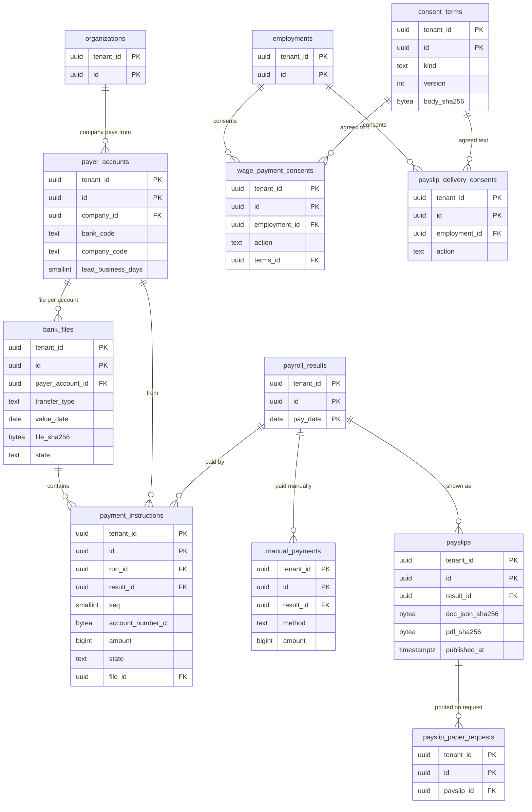
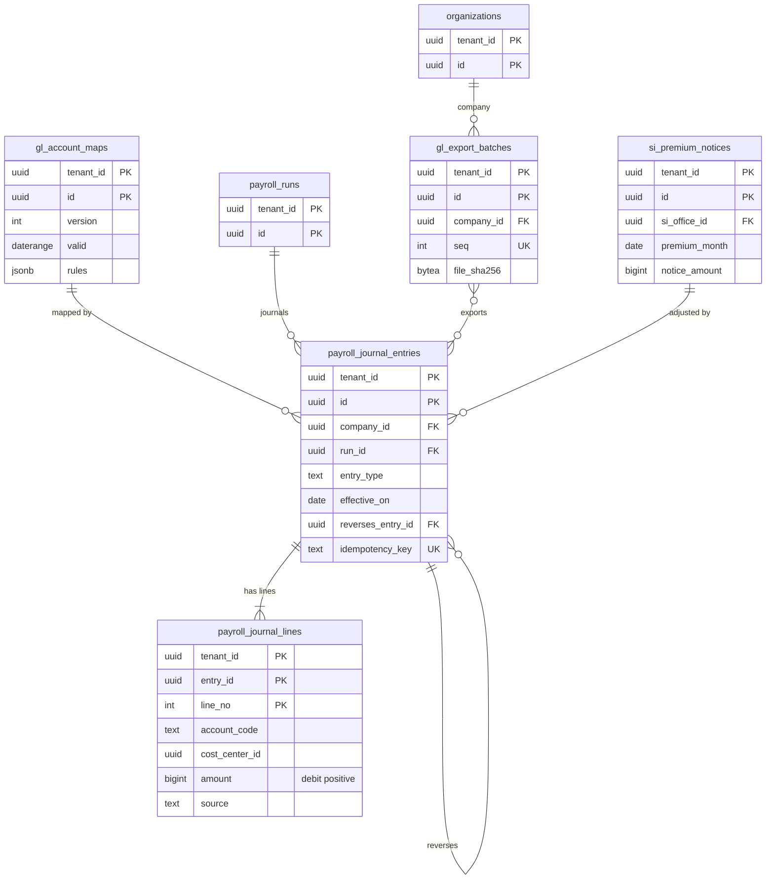

# Data model: 支払と会計

支払元の口座、口座振込の同意と同意の文面、支払の指示、振込ファイル、振込以外の支払い、明細と電子交付の承諾、書面の請求、勘定の対応、仕訳と出力、社会保険の納入告知、賃金台帳。振る舞いは [payments-and-accounting.md](../payments-and-accounting.md)、決定は [ADR-0035](../../decisions/0035-bank-transfer-files.md)〜[ADR-0037](../../decisions/0037-payroll-journal-export.md)、[ADR-0050](../../decisions/0050-electronic-books-act-readiness.md)。規約は [data-model.md](../data-model.md) の 3 節。

- 口座番号は暗号文（`account_number_ct`）だけ。平文は振込ファイルの生成の中だけ（[data-model.md](../data-model.md) の 3.10 節）。
- 仕訳は従業員の ID を持たない（会社 × 部門 × 勘定 × 元の項目）。

## 1. ER 図

### 1.1 支払と明細

### 1.2 仕訳と出力

## 2. 支払

### 2.1 `payer_accounts`

支払元の口座（会社の設定）。定義元：[payments-and-accounting.md](../payments-and-accounting.md) の 3.3〜3.5 節。

| 列 | 型 | NULL | 既定 | 説明 |
| --- | --- | --- | --- | --- |
| `tenant_id` | `uuid` | NOT NULL | — | |
| `id` | `uuid` | NOT NULL | `uuidv7()` | |
| `company_id` | `uuid` | NOT NULL | — | |
| `bank_code`・`branch_code` | `text` | NOT NULL | — | 4 桁・3 桁 |
| `bank_name_kana`・`branch_name_kana` | `text` | NOT NULL | — | |
| `account_type` | `text` | NOT NULL | — | `1`・`2` |
| `account_number` | `text` | NOT NULL | — | 会社の口座（7 桁）。個人の情報ではない（P0） |
| `company_code` | `text` | NOT NULL | — | 振込依頼人の会社コード（10 桁） |
| `requester_name_kana` | `text` | NOT NULL | — | 依頼人名 |
| `file_options` | `jsonb` | NOT NULL | — | コード区分（`0` JIS・`1` EBCDIC）、レコードの区切り（`crlf`・`lf`・`none`）、EOF の扱い |
| `lead_business_days` | `smallint` | NOT NULL | `3` | 振込指定日の何営業日前に渡すか（銀行ごと。未検証） |
| `active` | `boolean` | NOT NULL | `true` | |

- キー：PK `(tenant_id, id)`。FK `(tenant_id, company_id)` → `organizations`。
- CHECK：`bank_code ~ '^[0-9]{4}$'`、`branch_code ~ '^[0-9]{3}$'`、`company_code ~ '^[0-9]{10}$'`。
- 運用：RLS。保存は振込ファイル（既定 5 年）。

### 2.2 `consent_terms`

同意・承諾の文面のバージョン（口座振込の同意、明細の電子交付の承諾）。[data-model.md](../data-model.md) の 6 節の DM-14 で定義した。

| 列 | 型 | NULL | 既定 | 説明 |
| --- | --- | --- | --- | --- |
| `tenant_id` | `uuid` | NOT NULL | — | |
| `id` | `uuid` | NOT NULL | `uuidv7()` | |
| `kind` | `text` | NOT NULL | — | `wage_payment`・`payslip_e_delivery` |
| `version` | `int` | NOT NULL | — | |
| `body` | `text` | NOT NULL | — | 文面（L3・L4 の確認まで確定しない） |
| `body_sha256` | `bytea` | NOT NULL | — | |
| `published_at` | `timestamptz` | NULL | — | |

- キー：PK `(tenant_id, id)`。UK `(tenant_id, kind, version)`。
- 更新：公開の後は変えない。運用：RLS。保存は同意の記録と同じ。

### 2.3 `wage_payment_consents`

口座振込の同意（追記のみ）。定義元：[payments-and-accounting.md](../payments-and-accounting.md) の 3.2 節。

| 列 | 型 | NULL | 既定 | 説明 |
| --- | --- | --- | --- | --- |
| `tenant_id` | `uuid` | NOT NULL | — | |
| `id` | `uuid` | NOT NULL | `uuidv7()` | |
| `employment_id` | `uuid` | NOT NULL | — | |
| `action` | `text` | NOT NULL | — | `granted`・`withdrawn` |
| `method` | `text` | NOT NULL | — | `self_service`・`paper_scanned` |
| `terms_id` | `uuid` | NOT NULL | — | → `consent_terms` |
| `attachment_id` | `uuid` | NULL | — | 紙の同意書の写し |
| `case_id` | `uuid` | NULL | — | 振込先の登録の案件 |
| `recorded_at`・`recorded_by` | `timestamptz`・`uuid` | NOT NULL | — | |

- キー：PK `(tenant_id, id)`。
- 索引：`(tenant_id, employment_id, recorded_at DESC)` — 最新の同意の状態。
- 更新：追記のみ。運用：RLS。保存は賃金に関する書類（既定 5 年）。

### 2.4 `payment_instructions`

支払の指示（振込の 1 件）。`finalized` のときに、確定の結果と `known_at` の振込先の facet から作る。定義元：[payments-and-accounting.md](../payments-and-accounting.md) の 3.3・3.6 節。

| 列 | 型 | NULL | 既定 | 説明 |
| --- | --- | --- | --- | --- |
| `tenant_id` | `uuid` | NOT NULL | — | |
| `id` | `uuid` | NOT NULL | `uuidv7()` | |
| `run_id` | `uuid` | NOT NULL | — | |
| `result_id` | `uuid` | NOT NULL | — | |
| `pay_date` | `date` | NOT NULL | — | 結果の外部キーのため |
| `employment_id` | `uuid` | NOT NULL | — | |
| `seq` | `smallint` | NOT NULL | — | 口座の順（1〜3） |
| `payer_account_id` | `uuid` | NOT NULL | — | |
| `transfer_type` | `text` | NOT NULL | — | `11`（給与）・`12`（賞与） |
| `value_date` | `date` | NOT NULL | — | 振込指定日 |
| `bank_code`・`branch_code` | `text` | NOT NULL | — | |
| `bank_name_kana`・`branch_name_kana` | `text` | NULL | — | |
| `account_type` | `text` | NOT NULL | — | |
| `account_number_ct` | `bytea` | NOT NULL | — | 暗号文。P2 |
| `holder_kana` | `text` | NOT NULL | — | 検査・変換の済んだ受取人名。P2 |
| `amount` | `bigint` | NOT NULL | — | P2 |
| `new_code` | `text` | NOT NULL | — | `0`・`1`・`2` |
| `state` | `text` | NOT NULL | `'planned'` | `planned`・`in_file`・`released`・`returned`・`reissued`・`excluded` |
| `return_reason` | `text` | NULL | — | 不能の理由 |
| `reissue_of_id` | `uuid` | NULL | — | 再支払いの元の指示 |
| `file_id` | `uuid` | NULL | — | → `bank_files` |
| `created_at` | `timestamptz` | NOT NULL | `now()` | |

- キー：PK `(tenant_id, id)`。UK `(tenant_id, result_id, seq, reissue_of_id)`（`NULLS NOT DISTINCT`）。FK `(tenant_id, result_id, pay_date)` → `payroll_results`、`(tenant_id, payer_account_id)` → `payer_accounts`、`(tenant_id, file_id)` → `bank_files`。
- 索引：`(tenant_id, payer_account_id, transfer_type, value_date, bank_code, branch_code, employment_id, seq)` — ファイルの並び（決定的な順）。
- CHECK：`amount BETWEEN 1 AND 9999999999`、`transfer_type IN ('11','12')`、`new_code IN ('0','1','2')`。
- 更新：`state`・`file_id`・`return_reason` だけ。金額と口座は変えない（変えるなら `payroll_cancel` か再支払い）。
- 運用：RLS。保存は振込ファイル（既定 5 年）。S1 の量：月 84 万行（70 万人 × 1.2 口座）。

### 2.5 `bank_files`

全銀協の形式の振込ファイル（支払元の口座 × 種別 × 振込指定日）。定義元：[payments-and-accounting.md](../payments-and-accounting.md) の 3.4・3.5 節。形式は [stores.md](stores.md) の 7.1 節。

| 列 | 型 | NULL | 既定 | 説明 |
| --- | --- | --- | --- | --- |
| `tenant_id` | `uuid` | NOT NULL | — | |
| `id` | `uuid` | NOT NULL | `uuidv7()` | |
| `run_id` | `uuid` | NOT NULL | — | |
| `payer_account_id` | `uuid` | NOT NULL | — | |
| `transfer_type` | `text` | NOT NULL | — | |
| `value_date` | `date` | NOT NULL | — | |
| `record_count` | `int` | NOT NULL | — | データ・レコードの件数 |
| `total_amount` | `bigint` | NOT NULL | — | |
| `file_sha256` | `bytea` | NOT NULL | — | 承認が結び付くハッシュ |
| `s3_key` | `text` | NOT NULL | — | `bank-files/{tenant}/{file_id}`（`<brand>-bank-files` の鍵） |
| `generation` | `int` | NOT NULL | `1` | 作り直しの回数（同じ指示からは同じバイト列。違えば SEV2） |
| `state` | `text` | NOT NULL | `'generated'` | `generated`・`approved`・`downloaded`・`superseded` |
| `approved_case_id` | `uuid` | NULL | — | `payroll_payment_release` の案件 |
| `approved_sha256` | `bytea` | NULL | — | 承認のときのハッシュ（取り出しで `file_sha256` と比べる） |
| `dr_regenerated_sha256` | `bytea` | NULL | — | 大阪での作り直しの確認のハッシュ（毎日。[ADR-0055](../../decisions/0055-disaster-recovery-and-payday-continuity.md)） |
| `created_at` | `timestamptz` | NOT NULL | `now()` | |

- キー：PK `(tenant_id, id)`。一意：`(tenant_id, run_id, payer_account_id, transfer_type, value_date) WHERE state <> 'superseded'`。
- CHECK：`state <> 'approved' OR approved_sha256 = file_sha256`。
- 取り出しは再認証と 1 回限りの URL（Valkey。[stores.md](stores.md)）。取り出しは `audit_events`。
- 運用：RLS。保存は振込ファイル（既定 5 年。確認で短くする方向）。

### 2.6 `manual_payments`

振込以外の支払い（現金など）の記録。[data-model.md](../data-model.md) の 6 節の DM-14 で定義した。定義元：[payments-and-accounting.md](../payments-and-accounting.md) の 3.7 節。

| 列 | 型 | NULL | 既定 | 説明 |
| --- | --- | --- | --- | --- |
| `tenant_id` | `uuid` | NOT NULL | — | |
| `id` | `uuid` | NOT NULL | `uuidv7()` | |
| `result_id` | `uuid` | NOT NULL | — | |
| `pay_date` | `date` | NOT NULL | — | |
| `employment_id` | `uuid` | NOT NULL | — | |
| `reason` | `text` | NOT NULL | — | `no_consent`・`account_invalid`・`returned` |
| `method` | `text` | NOT NULL | — | `cash`・`other` |
| `amount` | `bigint` | NOT NULL | — | P2 |
| `paid_on` | `date` | NOT NULL | — | |
| `receipt_confirmed` | `boolean` | NOT NULL | `false` | 受け取りの確認 |
| `recorded_by`・`recorded_at` | `uuid`・`timestamptz` | NOT NULL | — | |

- キー：PK `(tenant_id, id)`。FK `(tenant_id, result_id, pay_date)` → `payroll_results`。
- 更新：追記のみ（誤りは逆の行）。運用：RLS。保存は賃金に関する書類。

## 3. 明細

### 3.1 `payslips`

給与明細（確定の結果から作る変わらない文書）。定義元：[payments-and-accounting.md](../payments-and-accounting.md) の 4 節。

| 列 | 型 | NULL | 既定 | 説明 |
| --- | --- | --- | --- | --- |
| `tenant_id` | `uuid` | NOT NULL | — | |
| `id` | `uuid` | NOT NULL | `uuidv7()` | |
| `run_id` | `uuid` | NOT NULL | — | |
| `result_id` | `uuid` | NOT NULL | — | |
| `pay_date` | `date` | NOT NULL | — | |
| `employment_id` | `uuid` | NOT NULL | — | |
| `kind` | `text` | NOT NULL | — | `regular`・`bonus`・`off_cycle` |
| `doc_json_sha256` | `bytea` | NOT NULL | — | 表示の文書（RFC 8785） |
| `pdf_sha256` | `bytea` | NULL | — | 決定的な PDF（生成が遅れれば後で埋める） |
| `s3_prefix` | `text` | NOT NULL | — | `payslips/{tenant}/{id}` |
| `delivery` | `text` | NOT NULL | — | `electronic`・`paper`（承諾の台帳から） |
| `publish_at` | `timestamptz` | NOT NULL | — | 公開の予定 |
| `published_at` | `timestamptz` | NULL | — | |
| `revoked_at` | `timestamptz` | NULL | — | 支払の前の `payroll_cancel` |
| `revoked_reason` | `text` | NULL | — | |
| `created_at` | `timestamptz` | NOT NULL | `now()` | |

- キー：PK `(tenant_id, id)`。FK `(tenant_id, result_id, pay_date)` → `payroll_results`。
- 一意：`(tenant_id, result_id) WHERE revoked_at IS NULL`。
- 索引：`(tenant_id, employment_id, pay_date DESC) WHERE revoked_at IS NULL` — 本人の明細の一覧。`(publish_at) WHERE published_at IS NULL AND revoked_at IS NULL` — 公開のジョブ。
- 更新：`pdf_sha256`（空から 1 回）、`published_at`、`revoked_*` だけ。
- 運用：RLS。保存は給与明細（既定 7 年）。S1 の量：月 100 万行（賞与の月 200 万行）。

### 3.2 `payslip_delivery_consents`・`payslip_paper_requests`

電子交付の承諾（追記のみ）と、承諾の後の書面の請求（追記のみ）。定義元：[payments-and-accounting.md](../payments-and-accounting.md) の 4.3 節。

| 表 | 列（`tenant_id`・`id` に加えて） | キー・索引 |
| --- | --- | --- |
| `payslip_delivery_consents` | `employment_id uuid NOT NULL`、`action text NOT NULL`（`granted`・`withdrawn`・`deemed`）、`method text NOT NULL`（`web_view`・`pdf_download`）、`terms_id uuid NOT NULL`（→ `consent_terms`）、`notice_id uuid NULL`（みなしの承諾の通知。通知の文面・送った日・期限は `details`）、`details jsonb NOT NULL DEFAULT '{}'`、`recorded_at timestamptz NOT NULL`、`recorded_by uuid NOT NULL` | PK `(tenant_id, id)`。索引 `(tenant_id, employment_id, recorded_at DESC)`。CHECK `action <> 'deemed' OR notice_id IS NOT NULL` |
| `payslip_paper_requests` | `employment_id uuid NOT NULL`、`payslip_id uuid NULL`（NULL は以後すべて）、`run_id uuid NULL`、`source text NOT NULL`（`self_service`・`proxy_record`）、`recorded_at timestamptz NOT NULL`、`recorded_by uuid NOT NULL` | PK `(tenant_id, id)`。索引 `(tenant_id, employment_id)` |

- みなしの承諾はテナントが選んだときだけ（L3・L38）。
- 運用：RLS。保存は給与明細と同じ。

## 4. 仕訳

### 4.1 `gl_account_maps`

勘定の対応（バージョンの表）。定義元：[payments-and-accounting.md](../payments-and-accounting.md) の 7.1 節。

| 列 | 型 | NULL | 既定 | 説明 |
| --- | --- | --- | --- | --- |
| `tenant_id` | `uuid` | NOT NULL | — | |
| `id` | `uuid` | NOT NULL | `uuidv7()` | |
| `company_id` | `uuid` | NOT NULL | — | |
| `version` | `int` | NOT NULL | — | |
| `valid` | `daterange` | NOT NULL | — | |
| `rules` | `jsonb` | NOT NULL | — | `gl_mapping_key`・項目の区分 → `{debit, credit, dimension}` |
| `cost_center_allocation` | `text` | NOT NULL | `'period_end_primary'` | `period_end_primary`・`prorate_days` |
| `accounting_date_basis` | `text` | NOT NULL | `'pay_date'` | `pay_date`・`period_end`（L9） |
| `status` | `text` | NOT NULL | `'draft'` | `draft`・`active`・`retired` |
| `activated_at`・`activated_by` | `timestamptz`・`uuid` | NULL | — | |

- キー：PK `(tenant_id, id)`。UK `(tenant_id, company_id, version)`。排他 `(tenant_id =, company_id =, valid &&) WHERE status = 'active'`。
- 確定の前の検査：鍵のない項目があれば止める。運用：RLS。保存は給与の仕訳（既定 10 年）。

### 4.2 `payroll_journal_entries`・`payroll_journal_lines`

給与の仕訳（追記のみ、釣り合う）。定義元：[payments-and-accounting.md](../payments-and-accounting.md) の 7.2・7.3 節、[ADR-0037](../../decisions/0037-payroll-journal-export.md)。

`payroll_journal_entries`：

| 列 | 型 | NULL | 既定 | 説明 |
| --- | --- | --- | --- | --- |
| `tenant_id` | `uuid` | NOT NULL | — | |
| `id` | `uuid` | NOT NULL | `uuidv7()` | |
| `company_id` | `uuid` | NOT NULL | — | |
| `run_id` | `uuid` | NULL | — | 納入告知の調整は NULL |
| `entry_type` | `text` | NOT NULL | — | `finalize`・`employer_estimate`・`payment`・`payment_return`・`cancel`・`employer_adjust` |
| `effective_on` | `date` | NOT NULL | — | 会計の日（既定は支給日） |
| `reverses_entry_id` | `uuid` | NULL | — | 逆仕訳の元 |
| `map_version_id` | `uuid` | NOT NULL | — | → `gl_account_maps` |
| `idempotency_key` | `text` | NOT NULL | — | `finalize:{run_id}`、`employer_estimate:{run_id}`、`payment:{run_id}:{payer_account_id}:{value_date}`、`return:{instruction_id}`、`cancel:{entry_id}`、`adjust:{notice_id}` |
| `exported_batch_id` | `uuid` | NULL | — | 出力した束（空から 1 回だけ） |
| `created_at` | `timestamptz` | NOT NULL | `now()` | |

`payroll_journal_lines`：

| 列 | 型 | NULL | 既定 | 説明 |
| --- | --- | --- | --- | --- |
| `tenant_id` | `uuid` | NOT NULL | — | |
| `entry_id` | `uuid` | NOT NULL | — | |
| `line_no` | `int` | NOT NULL | — | |
| `account_code` | `text` | NOT NULL | — | |
| `cost_center_id` | `uuid` | NULL | — | 部門 |
| `amount` | `bigint` | NOT NULL | — | 借方が正、貸方が負、0 は禁止 |
| `source` | `text` | NOT NULL | — | 元の項目のコードか区分（従業員の ID は入れない） |

- キー：entries は PK `(tenant_id, id)`、UK `(tenant_id, idempotency_key)`、FK `(tenant_id, reverses_entry_id)` → 同じ表。lines は PK `(tenant_id, entry_id, line_no)`、FK `(tenant_id, entry_id)` → entries。
- 一意：`(tenant_id, reverses_entry_id) WHERE reverses_entry_id IS NOT NULL`（逆仕訳は 1 回）。
- 索引：`(tenant_id, company_id, created_at, id) WHERE exported_batch_id IS NULL` — 未出力の仕訳の束の組み立て。`(tenant_id, run_id)`。
- CHECK：`amount <> 0`、`entry_type IN (...)`。
- 遅延制約のトリガー：仕訳ごとに行の合計が 0、行が 2 つ以上（[data-model.md](../data-model.md) の 5 節）。
- 更新：追記のみ（`exported_batch_id` の埋め込みだけ例外）。確定の遷移と確定の仕訳、取消と逆仕訳は同じトランザクション。
- 運用：RLS。保存は給与の仕訳（既定 10 年。L5・L9）。S1 の量：1 実行 数百〜数千行。年 数千万行。

### 4.3 `gl_export_batches`

仕訳の出力の束（会社ごとの連番）。定義元：[payments-and-accounting.md](../payments-and-accounting.md) の 7.4 節。形式は [stores.md](stores.md) の 7.2 節。

| 列 | 型 | NULL | 既定 | 説明 |
| --- | --- | --- | --- | --- |
| `tenant_id` | `uuid` | NOT NULL | — | |
| `id` | `uuid` | NOT NULL | `uuidv7()` | |
| `company_id` | `uuid` | NOT NULL | — | |
| `seq` | `int` | NOT NULL | — | 会社ごとの連番 |
| `entry_ids` | `uuid[]` | NOT NULL | — | `created_at, id` の順 |
| `format` | `text` | NOT NULL | `'generic_csv'` | `generic_csv`・`tenant_template` |
| `template_id` | `uuid` | NULL | — | テナントの列の対応の雛形 |
| `file_sha256` | `bytea` | NOT NULL | — | 同じ束は同じバイト列（PROP-PMT-005） |
| `s3_key` | `text` | NOT NULL | — | `gl-exports/{tenant}/{company}/{seq}.csv` |
| `created_at`・`created_by` | `timestamptz`・`uuid` | NOT NULL | — | |

- キー：PK `(tenant_id, id)`。UK `(tenant_id, company_id, seq)`。
- 運用：RLS。出力の権限は経理の担当に絞る。保存は給与の仕訳（既定 10 年）。

### 4.4 `si_premium_notices`

社会保険料の納入告知の額（事業主の負担の調整の元）。[data-model.md](../data-model.md) の 6 節の DM-14 で定義した。定義元：[payments-and-accounting.md](../payments-and-accounting.md) の 7.2 節、[payroll-jp-rules.md](../payroll-jp-rules.md) の 4.3 節。

| 列 | 型 | NULL | 既定 | 説明 |
| --- | --- | --- | --- | --- |
| `tenant_id` | `uuid` | NOT NULL | — | |
| `id` | `uuid` | NOT NULL | `uuidv7()` | |
| `company_id` | `uuid` | NOT NULL | — | |
| `si_office_id` | `uuid` | NOT NULL | — | → `si_offices` |
| `premium_month` | `date` | NOT NULL | — | 保険料の月 |
| `notice_amount` | `bigint` | NOT NULL | — | 告知額（健康保険・介護・支援金・厚生年金・拠出金の合計） |
| `breakdown` | `jsonb` | NOT NULL | — | 部分ごとの額 |
| `employee_total` | `bigint` | NOT NULL | — | 同じ月の本人の負担の合計（確定の結果から） |
| `employer_estimate` | `bigint` | NOT NULL | — | 事業主の見込みの合計 |
| `adjustment` | `bigint` | NOT NULL | — | 告知額 −（本人 ＋ 見込み） |
| `adjust_entry_id` | `uuid` | NULL | — | `employer_adjust` の仕訳 |
| `entered_by`・`entered_at` | `uuid`・`timestamptz` | NOT NULL | — | |

- キー：PK `(tenant_id, id)`。UK `(tenant_id, si_office_id, premium_month)`。
- CHECK：`adjustment = notice_amount - employee_total - employer_estimate`。
- 運用：RLS。保存は給与の仕訳。

## 5. ビュー

### 5.1 `wage_ledger`

賃金台帳（労基法 108 条、施行規則 54 条）の射影。行は事業場（`location`）× 雇用 × 実行。列：`tenant_id`、`location_id`（実行の期間の末日の主たる職務の事業所。L39）、`employment_id`、氏名・性別（`worker_personal` を `known_at` で読む）、賃金計算期間、労働日数・労働時間数・延長の時間数（`statutory_ot`）・休日の時間数（`legal_holiday_work`）・深夜の時間数（`night`）（`time_period_summaries` から。`managerial` の印の人は深夜以外を空欄）、項目の種類ごとの額（`payroll_result_lines`）。`contingent` の雇用は出さない。出力は [reporting.md](../reporting.md) の 5.1 節の仕組み。保存の対象は元のデータ（賃金台帳の規則。既定 5 年）。
