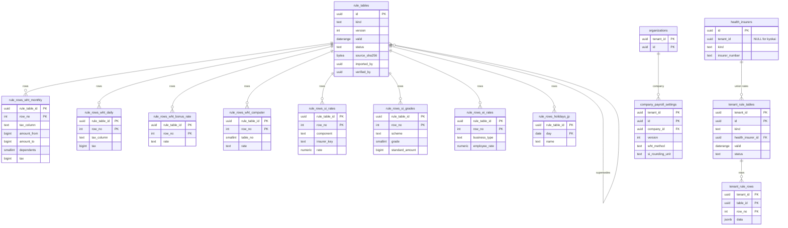
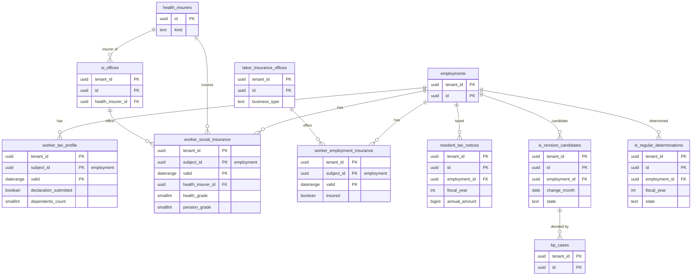

# Data model: 日本の給与の規則

規則表（全テナントに共通）と行、テナントの規則表、会社の給与の設定、保険者と適用事業所、税・社会保険・雇用保険の facet、住民税の通知、随時改定と定時決定の候補。振る舞いは [payroll-jp-rules.md](../payroll-jp-rules.md)、決定は [ADR-0030](../../decisions/0030-rule-table-ingestion-and-verification.md)〜[ADR-0034](../../decisions/0034-overtime-premiums-and-proration.md)、[ADR-0062](../../decisions/0062-rule-table-release-calendar.md)。規約は [data-model.md](../data-model.md) の 3 節。

- 規則表の値をコードに書かない。コードは表を読むだけ（[AGENTS.md](../../../AGENTS.md)）。
- 料率は `numeric(12,10)`（表の値をそのまま）。計算は `packages/money` の `Dec` に読み替える。金額の区間は円の `bigint` の半開区間 `[from, to)`（`to` が NULL は上限なし）。
- 保存：規則表と元のファイルは「給与の実行の入力の文書・結果」（結果がバージョンを指す間は消さない）。facet は「扶養控除等申告書・健康保険・厚生年金保険・雇用保険に関する書類」の長いほう。

## 1. ER 図

### 1.1 規則表と設定

### 1.2 資格と改定の候補

## 2. 規則表（テナントの外）

### 2.1 `rule_tables`

規則表のバージョン。全テナントに共通（RLS の例外。[data-model.md](../data-model.md) の 3.3 節）。定義元：[payroll-jp-rules.md](../payroll-jp-rules.md) の 2 節、[delivery.md](../delivery.md) の 6 節。

| 列 | 型 | NULL | 既定 | 説明 |
| --- | --- | --- | --- | --- |
| `id` | `uuid` | NOT NULL | `uuidv7()` | 実行の `rule_versions` が指す |
| `kind` | `text` | NOT NULL | — | `wht_monthly`・`wht_daily`・`wht_bonus_rate`・`wht_computer`・`si_health_rates`・`si_kaigo_rates`・`si_child_support_rate`・`si_pension_rate`・`si_grades_health`・`si_grades_pension`・`si_bonus_caps`・`si_employer_child_contribution`・`ei_rates`・`commute_nontaxable_limits`・`overtime_min_rates`・`holidays_jp` |
| `version` | `int` | NOT NULL | — | 種類ごとに 1 から |
| `key_type` | `text` | NOT NULL | — | 適用の鍵：`pay_date_year`・`premium_month`・`fiscal_year`・`wage_cutoff_date`・`pay_date`・`work_date`・`date` |
| `valid` | `daterange` | NOT NULL | — | 鍵の値で引く適用の期間（保険料の月は月の 1 日で表す） |
| `status` | `text` | NOT NULL | `'imported'` | `imported`・`verified`・`published`・`superseded`・`rejected` |
| `source_url` | `text` | NOT NULL | — | 公的な資料の URL |
| `fetched_on` | `date` | NOT NULL | — | 取得日 |
| `source_sha256` | `bytea` | NOT NULL | — | 元のファイル（S3 の `rule-sources/{kind}/{sha256}`） |
| `parsed_sha256` | `bytea` | NOT NULL | — | 読み取った行の正規の形のハッシュ |
| `auto_checks` | `jsonb` | NOT NULL | — | 自動の検査の結果（連続、単調、範囲、前のバージョンとの差） |
| `imported_by` | `uuid` | NOT NULL | — | 運用者（`rules.import`） |
| `verified_by` | `uuid` | NULL | — | 運用者（`rules.verify`） |
| `verification` | `jsonb` | NULL | — | 照合の記録（計算の例、無作為の 30 行、境界の行の一致） |
| `published_at` | `timestamptz` | NULL | — | 規則表のリリース（`rules.publish`） |
| `release_bundle_sha256` | `bytea` | NULL | — | 署名した束のハッシュ（[ADR-0062](../../decisions/0062-rule-table-release-calendar.md)） |
| `supersedes_id` | `uuid` | NULL | — | 訂正で置き換えたバージョン（同じ `valid`） |
| `note` | `text` | NULL | — | |

- キー：PK `(id)`。UK `(kind, version)`。FK `(supersedes_id)` → 同じ表。
- 排他：`EXCLUDE USING gist (kind WITH =, valid WITH &&) WHERE (status = 'published')` — 公開したバージョンの期間は重ならない。
- CHECK：`verified_by IS NULL OR verified_by <> imported_by`（S8）、`status NOT IN ('verified','published') OR verified_by IS NOT NULL`、`status <> 'published' OR published_at IS NOT NULL`。
- 更新：`published` の後は `superseded` への変更だけ。訂正の公開は outbox の `rule_table.corrected` を書く。
- 運用：RLS なし。書くのは `platform` だけ。`app` は読むだけ。S3 のセル構成では Global の原本を各セルへ配る。
- S1 の量：年 数十バージョン。

### 2.2 `rule_rows_*`（行の表）

種類ごとの型のある行。どれも `rule_table_id uuid NOT NULL`（→ `rule_tables`）と `row_no int NOT NULL` を持ち、PK は `(rule_table_id, row_no)`。バージョンの行は公開の後に変えない。RLS なし（テナントの外）。

| 表 | 対象の種類 | 列（`rule_table_id`・`row_no` に加えて） | 制約・索引 |
| --- | --- | --- | --- |
| `rule_rows_wht_monthly` | `wht_monthly` | `tax_column text`（`ko`・`otsu`）、`amount_from bigint`、`amount_to bigint NULL`、`dependents smallint NULL`（甲欄は 0〜7、乙欄は NULL）、`tax bigint`、`excess_over bigint NULL`・`excess_rate text NULL`（上限を超える区分の式） | 索引 `(rule_table_id, tax_column, dependents, amount_from)`。CHECK `amount_to IS NULL OR amount_to > amount_from` |
| `rule_rows_wht_daily` | `wht_daily` | 月額表と同じ列。`tax_column` に `hei` を足す | 同上 |
| `rule_rows_wht_bonus_rate` | `wht_bonus_rate` | `tax_column text`、`dependents smallint NULL`、`prev_month_from bigint`、`prev_month_to bigint NULL`、`rate text` | 索引 `(rule_table_id, tax_column, dependents, prev_month_from)` |
| `rule_rows_wht_computer` | `wht_computer` | `table_no smallint`（1〜4）、`lower bigint`、`upper bigint NULL`、`rate text NULL`、`constant bigint NULL`（加算・控除の定数）、`rounding text`（別表第一は切り上げ、第四は 10 円未満四捨五入） | 索引 `(rule_table_id, table_no, lower)` |
| `rule_rows_si_rates` | `si_health_rates`・`si_kaigo_rates`・`si_child_support_rate`・`si_pension_rate`・`si_employer_child_contribution` | `component text`（`health`・`kaigo`・`child_support`・`pension`・`employer_child`）、`insurer_key text NULL`（協会けんぽの都道府県のコード。全国一律は NULL）、`rate numeric(12,10)`（労使の合計の率） | UK `(rule_table_id, component, insurer_key)` |
| `rule_rows_si_grades` | `si_grades_health`・`si_grades_pension` | `scheme text`（`health`・`pension`）、`grade smallint`、`standard_amount bigint`、`remuneration_from bigint`、`remuneration_to bigint NULL` | UK `(rule_table_id, scheme, grade)`。索引 `(rule_table_id, scheme, remuneration_from)` |
| `rule_rows_si_bonus_caps` | `si_bonus_caps` | `scheme text`、`basis text`（`fiscal_year`・`month`）、`cap bigint` | UK `(rule_table_id, scheme)` |
| `rule_rows_ei_rates` | `ei_rates` | `business_type text`（`general`・`agri_sake`・`construction`）、`employee_rate numeric(12,10)`、`employer_rate numeric(12,10)` | UK `(rule_table_id, business_type)` |
| `rule_rows_commute_limits` | `commute_nontaxable_limits` | `means text`（`public_transport`・`car_or_bicycle`）、`distance_from_km numeric(6,1) NULL`、`distance_to_km numeric(6,1) NULL`、`monthly_limit bigint` | 索引 `(rule_table_id, means, distance_from_km)` |
| `rule_rows_overtime_min_rates` | `overtime_min_rates` | `category text`（`statutory_ot`・`over_60h`・`legal_holiday`・`night`）、`rate text` | UK `(rule_table_id, category)` |
| `rule_rows_holidays_jp` | `holidays_jp` | `day date`、`name text`。PK は `(rule_table_id, day)`（`row_no` は持つが鍵にしない） | PK `(rule_table_id, day)` |

- 区間の行は、自動の検査で「隙間なく続く」「税額が給与に対して減らない」「扶養の人数に対して増えない」「等級の境界が単調」を確かめる（[payroll-jp-rules.md](../payroll-jp-rules.md) の 2.2 節）。
- S1 の量：月額表は 1 バージョン 数千行、日額表 数千行、等級表 数十行。全体で 1 年 数万行。

## 3. テナントの規則と設定

### 3.1 `tenant_rule_tables`・`tenant_rule_rows`

テナントが入力する規則表（健康保険組合の料率・等級の特例など）。規則表と同じ形で、テナントの中に置く。取り込みと公開は業務プロセスで行い、別の人の承認を要する。

| 表 | 列 | キー・制約 |
| --- | --- | --- |
| `tenant_rule_tables` | `tenant_id`、`id`、`kind text`（`si_health_rates`・`si_kaigo_rates`・`si_child_support_rate`）、`health_insurer_id uuid NOT NULL`（→ `health_insurers` の組合の行）、`version int`、`valid daterange`、`status text`（`draft`・`published`・`superseded`）、`source_attachment_id uuid NULL`（組合の通知の写し）、`entered_by uuid`、`approved_by uuid NULL`、`approval_case_id uuid NULL` | PK `(tenant_id, id)`。UK `(tenant_id, kind, health_insurer_id, version)`。排他 `(tenant_id =, kind =, health_insurer_id =, valid &&) WHERE status = 'published'`。CHECK `approved_by IS NULL OR approved_by <> entered_by` |
| `tenant_rule_rows` | `tenant_id`、`table_id`、`row_no int`、`data jsonb`（`rule_rows_si_rates` と同じ項目。種類ごとの Zod で検証） | PK `(tenant_id, table_id, row_no)` |

- 公開の訂正は `rule_table.corrected` を出す（システムの規則表と同じ）。
- 運用：RLS。保存は給与の入力・結果。

### 3.2 `company_payroll_settings`

会社の給与の計算の設定（バージョンの表）。実行の設定のバージョン（`payroll_config_snapshots`）に入る。定義元：[payroll-jp-rules.md](../payroll-jp-rules.md) の 3.3・4.3・7・8・9 節。

| 列 | 型 | NULL | 既定 | 説明 |
| --- | --- | --- | --- | --- |
| `tenant_id` | `uuid` | NOT NULL | — | |
| `id` | `uuid` | NOT NULL | `uuidv7()` | |
| `company_id` | `uuid` | NOT NULL | — | → `organizations`（`kind = 'company'`） |
| `version` | `int` | NOT NULL | — | |
| `valid` | `daterange` | NOT NULL | — | 年の途中の源泉の方式の変更は警告 |
| `wht_method` | `text` | NOT NULL | `'table'` | 甲欄の月額表：`table`・`computer`（電算機特例） |
| `si_rounding_unit` | `text` | NOT NULL | `'health_side_combined'` | `health_side_combined`・`per_component`（L32） |
| `si_employee_rounding` | `text` | NOT NULL | `'round_si_employee_share'` | 特約の丸め（L8） |
| `overtime_rounding` | `jsonb` | NOT NULL | — | 割増の端数の処理（通達の形の中から。DT-JP-009） |
| `monthly_minutes_rounding` | `text` | NOT NULL | `'none'` | 月の合計の 30 分の処理：`none`・`half_hour_half_up` |
| `premium_rates` | `jsonb` | NOT NULL | — | 割増の率（法定の最低以上だけ受ける） |
| `proration_method` | `text` | NOT NULL | — | 日割り：`calendar_days`・`scheduled_days`・`avg_scheduled_days` |
| `absence_deduction_method` | `text` | NOT NULL | — | 欠勤控除の方式 |
| `leave_pay_basis` | `text` | NOT NULL | `'normal_wage'` | 年休の日の賃金：`normal_wage`・`average_wage`・`standard_daily`（協定が要る） |
| `art24_agreement_on` | `date` | NULL | — | 賃金の控除の労使協定（24 条 1 項ただし書）の記録の日 |
| `art24_items` | `text[]` | NOT NULL | `'{}'` | 協定で控除できる項目のコード |
| `status` | `text` | NOT NULL | `'draft'` | `draft`・`active`・`retired` |
| `activation_case_id` | `uuid` | NULL | — | |

- キー：PK `(tenant_id, id)`。UK `(tenant_id, company_id, version)`。
- 排他：`(tenant_id =, company_id =, valid &&) WHERE status = 'active'`。
- 運用：RLS。保存は給与の入力・結果。

### 3.3 `health_insurers`

健康保険の保険者。協会けんぽの都道府県支部はシステムの行（`tenant_id IS NULL`、部分の RLS の例外。[data-model.md](../data-model.md) の 3.3.1 節）、健康保険組合はテナントの行。[data-model.md](../data-model.md) の 6 節の DM-14 で定義した。

| 列 | 型 | NULL | 既定 | 説明 |
| --- | --- | --- | --- | --- |
| `id` | `uuid` | NOT NULL | `uuidv7()` | |
| `tenant_id` | `uuid` | NULL | — | NULL はシステムの行 |
| `kind` | `text` | NOT NULL | — | `kyokai`・`union` |
| `prefecture` | `text` | NULL | — | 協会けんぽの支部（`rule_rows_si_rates.insurer_key`） |
| `name` | `text` | NOT NULL | — | |
| `insurer_number` | `text` | NULL | — | 保険者番号（8 桁） |
| `active` | `boolean` | NOT NULL | `true` | |

- キー：PK `(id)`。一意 `UNIQUE NULLS NOT DISTINCT (tenant_id, kind, prefecture, insurer_number)`。
- CHECK：`(tenant_id IS NULL) = (kind = 'kyokai')`、`kind <> 'kyokai' OR prefecture IS NOT NULL`。
- 料率：`kyokai` は規則表、`union` は `tenant_rule_tables`。

### 3.4 `si_offices`・`labor_insurance_offices`

社会保険と労働保険の適用事業所（事業所の facet `organization` が指す）。[data-model.md](../data-model.md) の 6 節の DM-14 で定義した。定義元：[core-hr.md](../core-hr.md) の 4.1 節、[payroll-jp-rules.md](../payroll-jp-rules.md) の 5.2 節。

| 表 | 列（`tenant_id`・`id` に加えて） | キー |
| --- | --- | --- |
| `si_offices` | `company_id uuid NOT NULL`、`name text NOT NULL`、`office_symbol text NOT NULL`（事業所整理記号）、`office_number text NULL`（事業所番号）、`health_insurer_id uuid NOT NULL`（→ `health_insurers`）、`address jsonb NULL`、`active boolean NOT NULL DEFAULT true` | PK `(tenant_id, id)`。UK `(tenant_id, office_symbol)` |
| `labor_insurance_offices` | `company_id uuid NOT NULL`、`name text NOT NULL`、`labor_insurance_number text NOT NULL`（労働保険番号 14 桁）、`ei_office_number text NULL`（雇用保険の適用事業所番号）、`business_type text NOT NULL`（`general`・`agri_sake`・`construction`）、`active boolean NOT NULL DEFAULT true` | PK `(tenant_id, id)`。UK `(tenant_id, labor_insurance_number)` |

- 運用：RLS。保存はテナントの契約の間。

## 4. 給与の facet

### 4.1 `worker_tax_profile`（主体：`employments`、gapped）

源泉所得税の区分。`dependent_change` と年ごとの申告の業務プロセスで書く。定義元：[payroll-jp-rules.md](../payroll-jp-rules.md) の 3.2 節（DT-JP-001・002）。

| 列 | 型 | NULL | 説明 |
| --- | --- | --- | --- |
| `declaration_submitted` | `boolean` | NOT NULL | 扶養控除等申告書の提出（甲欄・乙欄）。写す |
| `payment_form` | `text` | NOT NULL | `monthly`・`daily_or_weekly` |
| `day_laborer` | `boolean` | NOT NULL | 日雇賃金（丙欄） |
| `declaration` | `jsonb` | NOT NULL | 申告の内容：源泉控除対象配偶者、控除対象の扶養親族（`dependents.id` の一覧）、本人の障害者・寡婦・ひとり親・勤労学生の区分。P2 |
| `dependents_count` | `smallint` | NOT NULL | 申告の内容から関数で数えた扶養親族等の数（DT-JP-002）。写す |

- 行がない期間は「申告なし」ではなく「給与の対象でない」。申告なしは `declaration_submitted = false`。

### 4.2 `worker_social_insurance`（主体：`employments`、gapped）

社会保険の資格と標準報酬。定義元：[payroll-jp-rules.md](../payroll-jp-rules.md) の 4.2 節。

| 列 | 型 | NULL | 説明 |
| --- | --- | --- | --- |
| `health_insurer_id` | `uuid` | NULL | → `health_insurers`。写す |
| `si_office_id` | `uuid` | NULL | → `si_offices` |
| `health_insured` | `boolean` | NOT NULL | 健康保険の加入 |
| `pension_insured` | `boolean` | NOT NULL | 厚生年金の加入 |
| `acquired_on` | `date` | NULL | 資格の取得日 |
| `lost_on` | `date` | NULL | 資格の喪失日（退職日の翌日） |
| `health_grade`・`pension_grade` | `smallint` | NULL | 等級。写す。P2 |
| `standard_monthly_health`・`standard_monthly_pension` | `bigint` | NULL | 標準報酬月額。P2 |
| `determination_kind` | `text` | NULL | `acquisition`・`regular`・`interim`・`insurer`・`childcare_end` |
| `applies_from_month` | `date` | NULL | 適用の月 |
| `exempt_months` | `date[]` | NOT NULL | 保険料の免除の月（産前産後・育児休業）。担当が入力 |
| `short_time_worker` | `boolean` | NOT NULL | 短時間労働者（支払基礎日数 11 日） |

- 等級の変更は `si_grade_change` の業務プロセスだけ（システムは自動で変えない。[ADR-0004](../../decisions/0004-payroll-engine.md)）。
- 介護保険の第 2 号の判定は生年月日から求め、facet に持たない。

### 4.3 `worker_employment_insurance`（主体：`employments`、gapped）

| 列 | 型 | NULL | 説明 |
| --- | --- | --- | --- |
| `insured` | `boolean` | NOT NULL | 被保険者か（担当が記録。システムは所定の時間から候補を示す）。写す |
| `labor_insurance_office_id` | `uuid` | NULL | → `labor_insurance_offices`（事業の種類はここから） |
| `insured_number` | `text` | NULL | 雇用保険の被保険者番号。P2 |
| `acquired_on`・`lost_on` | `date` | NULL | |

## 5. 住民税と社会保険の改定

### 5.1 `resident_tax_notices`

住民税の特別徴収の通知（月割額をそのまま使う）。定義元：[payroll-jp-rules.md](../payroll-jp-rules.md) の 6.2 節（DM-4）。

| 列 | 型 | NULL | 既定 | 説明 |
| --- | --- | --- | --- | --- |
| `tenant_id` | `uuid` | NOT NULL | — | |
| `id` | `uuid` | NOT NULL | `uuidv7()` | 入力の文書の `notice_version` |
| `employment_id` | `uuid` | NOT NULL | — | |
| `fiscal_year` | `int` | NOT NULL | — | 年度（6 月〜翌 5 月の始まりの年） |
| `municipality_code` | `text` | NOT NULL | — | 全国地方公共団体コード |
| `notice_kind` | `text` | NOT NULL | — | `initial`・`change` |
| `annual_amount` | `bigint` | NOT NULL | — | 年税額。P2 |
| `monthly_amounts` | `bigint[]` | NOT NULL | — | 6 月〜5 月の 12 個。P2 |
| `effective_from_month` | `date` | NOT NULL | — | 変更の通知が置き換える最初の月 |
| `check_warnings` | `text[]` | NOT NULL | `'{}'` | 合計・6 月の端数の検査の警告 |
| `source_batch_id` | `uuid` | NULL | — | 一括の取り込み（MVP の入り口） |
| `case_id` | `uuid` | NOT NULL | — | `resident_tax_notice` の案件 |
| `recorded_at` | `timestamptz` | NOT NULL | `now()` | |
| `superseded_at` | `timestamptz` | NULL | — | 次の変更の通知で置き換えた |

- キー：PK `(tenant_id, id)`。
- 一意：`(tenant_id, employment_id, fiscal_year, effective_from_month) WHERE superseded_at IS NULL`。
- CHECK：`cardinality(monthly_amounts) = 12`、`annual_amount >= 0`。12 か月の合計と年税額の一致は警告（市区町村の例外があるので拒まない）。
- 運用：RLS。保存は 7 年（DM-4）。S1 の量：年 100 万行＋変更。

### 5.2 `si_revision_candidates`

随時改定の候補（DT-JP-005）。定義元：[payroll-jp-rules.md](../payroll-jp-rules.md) の 4.6 節。

| 列 | 型 | NULL | 既定 | 説明 |
| --- | --- | --- | --- | --- |
| `tenant_id` | `uuid` | NOT NULL | — | |
| `id` | `uuid` | NOT NULL | `uuidv7()` | |
| `employment_id` | `uuid` | NOT NULL | — | |
| `change_month` | `date` | NOT NULL | — | 変動の月（遡及の昇給は差額を払った月） |
| `months` | `date[]` | NOT NULL | — | 比べる 3 か月 |
| `base_days` | `smallint[]` | NOT NULL | — | 各月の支払基礎日数 |
| `avg_remuneration` | `bigint` | NOT NULL | — | 3 か月の平均（遡及の差額を除く。円未満切り捨て）。P2 |
| `current_grade`・`new_grade` | `smallint` | NOT NULL | — | 健康保険の等級（厚生年金は対応で引く） |
| `direction` | `text` | NOT NULL | — | `up`・`down` |
| `rule_row` | `smallint` | NOT NULL | — | DT-JP-005 の当たった行 |
| `applies_from_month` | `date` | NOT NULL | — | 変動の月から 4 か月目 |
| `state` | `text` | NOT NULL | `'open'` | `open`・`decided`・`dismissed` |
| `decision_case_id` | `uuid` | NULL | — | `si_grade_change` の案件 |
| `created_at` | `timestamptz` | NOT NULL | `now()` | |

- キー：PK `(tenant_id, id)`。UK `(tenant_id, employment_id, change_month)`。
- 運用：RLS。保存は健康保険・厚生年金保険に関する書類（長いほう）。

### 5.3 `si_regular_determinations`

定時決定の候補（算定基礎）。定義元：[payroll-jp-rules.md](../payroll-jp-rules.md) の 4.7 節。

| 列 | 型 | NULL | 既定 | 説明 |
| --- | --- | --- | --- | --- |
| `tenant_id` | `uuid` | NOT NULL | — | |
| `id` | `uuid` | NOT NULL | `uuidv7()` | |
| `employment_id` | `uuid` | NOT NULL | — | |
| `fiscal_year` | `int` | NOT NULL | — | 算定の年 |
| `months_used` | `date[]` | NOT NULL | — | 4〜6 月のうち支払基礎日数を満たした月 |
| `avg_remuneration` | `bigint` | NULL | — | P2 |
| `corrected_avg` | `bigint` | NULL | — | 遡及の差額を除いた修正平均額。P2 |
| `current_grade`・`proposed_grade` | `smallint` | NULL | — | |
| `excluded_reason` | `text` | NULL | — | 対象外（6 月以降の取得、6 月 30 日以前の退職、7 月改定、8・9 月の随時改定の予定） |
| `state` | `text` | NOT NULL | `'open'` | `open`・`decided`・`excluded` |
| `decision_case_id` | `uuid` | NULL | — | |

- キー：PK `(tenant_id, id)`。UK `(tenant_id, employment_id, fiscal_year)`。
- 運用：RLS。保存は健康保険・厚生年金保険に関する書類。S1 の量：年 100 万行。
