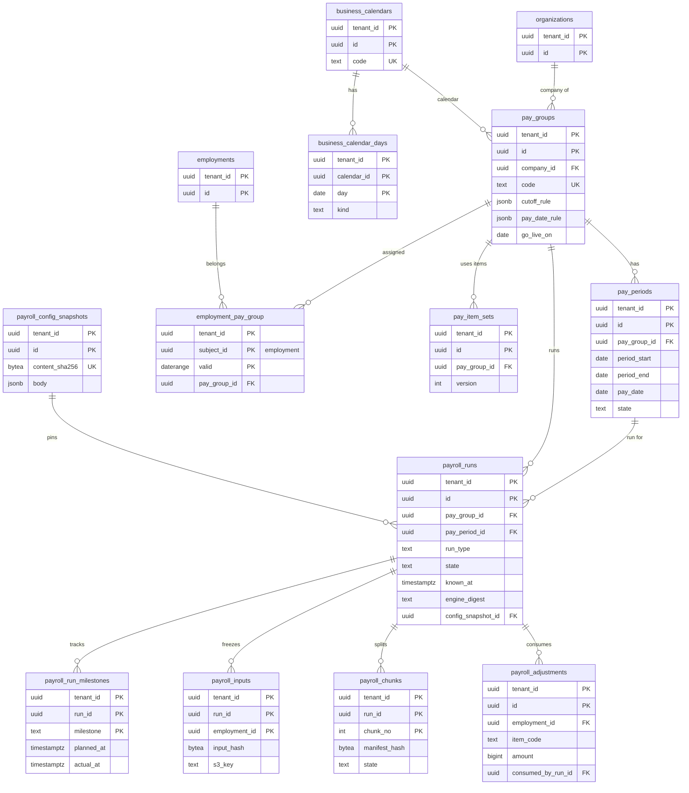
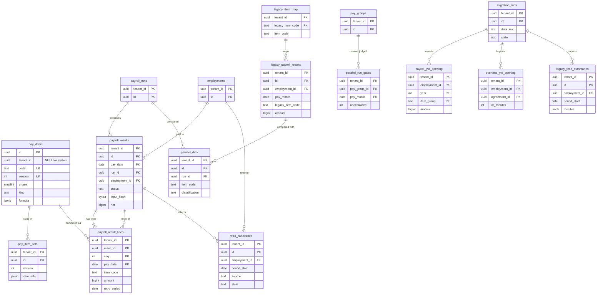

# Data model: 給与の計算

給与のグループと期間、営業日の暦、実行と里程標、設定のバージョン、入力の固定、束、項目、個別の調整、結果、遡及の候補、並行稼働、移行の期首の値。日本の法令の規則表と給与の facet は [payroll-jp.md](payroll-jp.md)、支払・明細・仕訳は [payments.md](payments.md)。振る舞いは [payroll-engine.md](../payroll-engine.md)、決定は [ADR-0004](../../decisions/0004-payroll-engine.md)、[ADR-0026](../../decisions/0026-payroll-run-stages-and-input-snapshot.md)〜[ADR-0029](../../decisions/0029-parallel-run-and-compute-partitioning.md)、[ADR-0043](../../decisions/0043-migration-history-and-parallel-run-inputs.md)、[ADR-0059](../../decisions/0059-payroll-run-slo-and-synthetic-run.md)、[ADR-0063](../../decisions/0063-payroll-flags-pinning-and-freeze-windows.md)。規約は [data-model.md](../data-model.md) の 3 節。

- 保存：実行・入力・結果・調整・遡及は「給与の実行の入力の文書・結果・エンジンのイメージ」（支給日から、既定 7 年）。並行稼働は DM-4。
- 金額は円の `bigint`、率は 10 進の文字列（[data-model.md](../data-model.md) の 3.6 節）。

## 1. ER 図

### 1.1 グループ・期間・実行

### 1.2 項目・結果・遡及・並行稼働

## 2. グループ・期間・暦

### 2.1 `pay_groups`

給与のグループ（期間つきの設定。頻度・締日・支給日）。定義元：[payroll-engine.md](../payroll-engine.md) の 3.1 節、[integrations-and-bulk.md](../integrations-and-bulk.md) の 4.2 節。

| 列 | 型 | NULL | 既定 | 説明 |
| --- | --- | --- | --- | --- |
| `tenant_id` | `uuid` | NOT NULL | — | |
| `id` | `uuid` | NOT NULL | `uuidv7()` | |
| `company_id` | `uuid` | NOT NULL | — | → `organizations`（`kind = 'company'`） |
| `code` | `text` | NOT NULL | — | |
| `frequency` | `text` | NOT NULL | `'monthly'` | MVP は `monthly` だけ |
| `cutoff_rule` | `jsonb` | NOT NULL | — | `{"day": 20}`・`{"day": "eom"}` |
| `pay_date_rule` | `jsonb` | NOT NULL | — | `{"month_offset": 0, "day": 25, "if_holiday": "previous_business_day"}` |
| `time_period_link` | `text` | NOT NULL | `'same_as_payroll'` | `same_as_payroll`・`previous_period` |
| `si_deduction_timing` | `text` | NOT NULL | `'next_month'` | `next_month`・`same_month`（DT-JP-004。`same_month` は警告。L33） |
| `payslip_publish_rule` | `jsonb` | NOT NULL | — | 明細の公開の時刻（既定：振込指定日の前の営業日の 12 時） |
| `calendar_id` | `uuid` | NOT NULL | — | → `business_calendars` |
| `go_live_on` | `date` | NULL | — | 本番の開始日。この日より前の期間に遡及の候補を作らない（[ADR-0043](../../decisions/0043-migration-history-and-parallel-run-inputs.md)） |
| `valid` | `daterange` | NOT NULL | — | グループの有効期間 |

- キー：PK `(tenant_id, id)`。UK `(tenant_id, code)`。FK `(tenant_id, company_id)` → `organizations`、`(tenant_id, calendar_id)` → `business_calendars`。
- CHECK：`frequency = 'monthly'`、`si_deduction_timing IN (...)`、`time_period_link IN (...)`。
- 更新：規則の変更は新しい期間から効かせる（作った `pay_periods` は変えない）。`go_live_on` は切り替えの手順で 1 回だけ設定（トリガー）。
- 運用：RLS。保存はテナントの契約の間。

### 2.2 `employment_pay_group`（facet。主体：`employments`、gapped）

| 列 | 型 | NULL | 説明 |
| --- | --- | --- | --- |
| `pay_group_id` | `uuid` | NOT NULL | → `pay_groups`。写す。雇用の会社のグループだけ（トリガー） |

- 1 人は日ごとに高々 1 つのグループに属する（重なりの制約）。月の途中の移動は、前後の期間でそれぞれ日割りにする。

### 2.3 `pay_periods`

給与の期間と予定。定義元：[payroll-engine.md](../payroll-engine.md) の 3.1・4.2 節。

| 列 | 型 | NULL | 既定 | 説明 |
| --- | --- | --- | --- | --- |
| `tenant_id` | `uuid` | NOT NULL | — | |
| `id` | `uuid` | NOT NULL | `uuidv7()` | |
| `pay_group_id` | `uuid` | NOT NULL | — | |
| `period_start`・`period_end` | `date` | NOT NULL | — | `period_end` を含む |
| `cutoff_date` | `date` | NOT NULL | — | 締日（雇用保険の料率の選び方。DT-JP-007） |
| `pay_date` | `date` | NOT NULL | — | 支給日（営業日） |
| `premium_month` | `date` | NOT NULL | — | 控除する社会保険料の月（`si_deduction_timing` から） |
| `time_period_id` | `uuid` | NULL | — | 使う勤怠の締めの期間 → `time_periods` |
| `schedule` | `jsonb` | NOT NULL | — | 支給日から逆算した期限（勤怠の締め、入力の固定、確定、振込ファイルの承認） |
| `state` | `text` | NOT NULL | `'planned'` | `planned`・`in_progress`・`closed` |

- キー：PK `(tenant_id, id)`。UK `(tenant_id, pay_group_id, period_start)`。
- 排他：`(tenant_id =, pay_group_id =, daterange(period_start, period_end, '[]') &&)`。
- 索引：`(pay_date)` — `scheduler` のロールが今後 5 営業日の予定を集める（予定のスケール、凍結の暦。[ADR-0060](../../decisions/0060-scheduled-peak-capacity.md)）。
- 運用：RLS。保存は給与の入力・結果。

### 2.4 `business_calendars`・`business_calendar_days`

営業日の暦（業務プロセスの期限と共通）。国民の祝日は規則表 `holidays_jp`（テナントの外）から読み、テナントの休日と銀行の休業日の差だけを日の表に持つ。定義元：[payroll-engine.md](../payroll-engine.md) の 3.2 節。`business_calendar_days` は [data-model.md](../data-model.md) の 6 節の DM-14 で定義した。

| 表 | 列 | キー・制約 |
| --- | --- | --- |
| `business_calendars` | `tenant_id`、`id`、`code text NOT NULL`、`name text NOT NULL`、`weekend_days smallint[] NOT NULL DEFAULT '{0,6}'`、`use_national_holidays boolean NOT NULL DEFAULT true`、`use_bank_holidays boolean NOT NULL DEFAULT true`（12 月 31 日〜1 月 3 日） | PK `(tenant_id, id)`、UK `(tenant_id, code)` |
| `business_calendar_days` | `tenant_id`、`calendar_id`、`day date NOT NULL`、`kind text NOT NULL`（`tenant_holiday`・`extra_business_day`）、`name text NULL` | PK `(tenant_id, calendar_id, day)` |

- 営業日の判定：週末でなく、（`use_national_holidays` なら）祝日でなく、（`use_bank_holidays` なら）銀行の休業日でなく、`tenant_holiday` でない日。`extra_business_day` は上を打ち消す。
- 運用：RLS。保存はテナントの契約の間。

## 3. 実行

### 3.1 `payroll_runs`

給与の実行（ステートマシン）。定義元：[payroll-engine.md](../payroll-engine.md) の 4・5 節（DT-PAY-001）。

| 列 | 型 | NULL | 既定 | 説明 |
| --- | --- | --- | --- | --- |
| `tenant_id` | `uuid` | NOT NULL | — | |
| `id` | `uuid` | NOT NULL | `uuidv7()` | |
| `pay_group_id` | `uuid` | NOT NULL | — | |
| `pay_period_id` | `uuid` | NOT NULL | — | |
| `run_type` | `text` | NOT NULL | — | `regular`・`bonus`・`off_cycle`・`parallel`（確定しない比較。影の比較にも使う） |
| `pay_date` | `date` | NOT NULL | — | 賞与・臨時は期間の支給日と違いうる |
| `population` | `jsonb` | NOT NULL | `'{}'` | 対象者の条件（`off_cycle` は雇用の一覧） |
| `state` | `text` | NOT NULL | `'draft'` | `draft`・`frozen`・`computing`・`computed`・`in_review`・`finalized`・`released`・`cancelled` |
| `known_at` | `timestamptz` | NULL | — | 入力の固定の時刻 − 10 秒 |
| `engine_digest` | `text` | NULL | — | Payroll Compute のイメージのダイジェスト（固定のときに記録。[ADR-0063](../../decisions/0063-payroll-flags-pinning-and-freeze-windows.md)） |
| `rule_versions` | `jsonb` | NULL | — | 規則表の種類 → `rule_tables.id`。固定のときに記録 |
| `rule_versions_hash` | `bytea` | NULL | — | |
| `config_snapshot_id` | `uuid` | NULL | — | → `payroll_config_snapshots` |
| `input_source` | `text` | NOT NULL | `'native'` | 並行稼働の入力の元：`native`・`legacy_time`（[integrations-and-bulk.md](../integrations-and-bulk.md) の 5 節） |
| `excluded` | `jsonb` | NOT NULL | `'[]'` | 人事が理由つきで除外した雇用（勤怠の未確定など） |
| `review_summary` | `jsonb` | NULL | — | 確認の検査（DT-PAY-004）の件数 |
| `finalize_case_id`・`release_case_id`・`cancel_case_id` | `uuid` | NULL | — | `payroll_finalize`・`payroll_payment_release`・`payroll_cancel` の案件 |
| `created_by`・`created_at` | `uuid`・`timestamptz` | NOT NULL | — | |
| `lock_version` | `int` | NOT NULL | `0` | |

- キー：PK `(tenant_id, id)`。FK `(tenant_id, pay_group_id)` → `pay_groups`、`(tenant_id, pay_period_id)` → `pay_periods`、`(tenant_id, config_snapshot_id)` → `payroll_config_snapshots`。
- 一意：`(tenant_id, pay_group_id, pay_period_id) WHERE run_type = 'regular' AND state <> 'cancelled'`（[data-model.md](../data-model.md) の 5 節）。
- 索引：`(tenant_id, pay_group_id, pay_date DESC)`。`(state, pay_date) WHERE state NOT IN ('released','cancelled')` — 里程標の監視（`scheduler`）。
- CHECK：`run_type IN (...)`、`state IN (...)`、`run_type <> 'parallel' OR state NOT IN ('finalized','released')`、`state NOT IN ('frozen','computing','computed','in_review','finalized','released') OR (known_at IS NOT NULL AND engine_digest IS NOT NULL AND config_snapshot_id IS NOT NULL)`。
- 更新：状態は遷移関数だけ（楽観ロック）。`known_at`・`engine_digest`・`rule_versions`・`config_snapshot_id` は固定の後に変えない（トリガー。固定のやり直しは `draft` に戻して全部を書き直す）。
- 運用：RLS。保存は給与の入力・結果。
- S1 の量：テナント × グループ × 月 ＋ 賞与。年 1 万行ほど。

### 3.2 `payroll_config_snapshots`

実行の「設定のバージョン」（内容のアドレス）。テナントの計算の設定（`company_payroll_settings` のバージョン）、項目の組のバージョン、給与に効くフラグの値をまとめて固定する。[data-model.md](../data-model.md) の 6 節の DM-14 で定義した。定義元：[payroll-engine.md](../payroll-engine.md) の 5.1 節、[delivery.md](../delivery.md) の 8 節。

| 列 | 型 | NULL | 既定 | 説明 |
| --- | --- | --- | --- | --- |
| `tenant_id` | `uuid` | NOT NULL | — | |
| `id` | `uuid` | NOT NULL | `uuidv7()` | |
| `content_sha256` | `bytea` | NOT NULL | — | `body` の RFC 8785 の正規の形のハッシュ |
| `body` | `jsonb` | NOT NULL | — | `{"company_payroll_settings": "<id>", "pay_item_set": "<id>", "gl_account_map": "<id>", "flags": {"payroll.xxx": true}}` |
| `created_at` | `timestamptz` | NOT NULL | `now()` | |

- キー：PK `(tenant_id, id)`。UK `(tenant_id, content_sha256)`（同じ内容は 1 行）。
- 更新：追記のみ。運用：RLS。保存は給与の入力・結果。

### 3.3 `payroll_run_milestones`

実行の里程標（予定と実際）。[data-model.md](../data-model.md) の 6 節の DM-14 で定義した。定義元：[observability.md](../observability.md) の 3.3 節、[ADR-0059](../../decisions/0059-payroll-run-slo-and-synthetic-run.md)。

| 列 | 型 | NULL | 既定 | 説明 |
| --- | --- | --- | --- | --- |
| `tenant_id` | `uuid` | NOT NULL | — | |
| `run_id` | `uuid` | NOT NULL | — | |
| `milestone` | `text` | NOT NULL | — | `time_locked`・`frozen`・`computed`・`finalized`・`bank_file_approved` |
| `planned_at` | `timestamptz` | NOT NULL | — | 支給日と `lead_business_days` から逆算 |
| `actual_at` | `timestamptz` | NULL | — | |
| `delay_cause` | `text` | NULL | — | `system`・`tenant` |
| `waiting_seconds` | `int` | NOT NULL | `0` | 段の中で人の操作を待った時間 |

- キー：PK `(tenant_id, run_id, milestone)`。
- 索引：`(planned_at) WHERE actual_at IS NULL` — 30 分の遅れの呼び出し（`scheduler`）。
- 運用：RLS。保存は給与の入力・結果。

### 3.4 `payroll_inputs`

入力の固定の記録（本体は S3 の内容のアドレス）。定義元：[payroll-engine.md](../payroll-engine.md) の 5 節。

| 列 | 型 | NULL | 既定 | 説明 |
| --- | --- | --- | --- | --- |
| `tenant_id` | `uuid` | NOT NULL | — | |
| `run_id` | `uuid` | NOT NULL | — | |
| `employment_id` | `uuid` | NOT NULL | — | |
| `input_hash` | `bytea` | NOT NULL | — | 正規の形（RFC 8785）の SHA-256 |
| `known_at` | `timestamptz` | NOT NULL | — | 1 人の再計算は新しい `known_at` |
| `s3_key` | `text` | NOT NULL | — | `payroll-inputs/{tenant}/{sha256}.json` |
| `time_summary_id` | `uuid` | NULL | — | 使った勤怠の集計のバージョン |
| `created_at` | `timestamptz` | NOT NULL | `now()` | |
| `superseded_at` | `timestamptz` | NULL | — | 1 人の再計算で置き換えた |

- キー：PK `(tenant_id, run_id, employment_id, created_at)`。
- 一意：`(tenant_id, run_id, employment_id) WHERE superseded_at IS NULL`。
- 更新：固定のやり直しは `run_id` ごとに行を消す（`draft` に戻したときだけ。S3 の文書は残す）。
- 運用：RLS。保存は給与の入力・結果。S1 の量：月 100 万行＋再計算。

### 3.5 `payroll_chunks`

計算の束。中身は再試行でも変えない。定義元：[payroll-engine.md](../payroll-engine.md) の 9 節。

| 列 | 型 | NULL | 既定 | 説明 |
| --- | --- | --- | --- | --- |
| `tenant_id` | `uuid` | NOT NULL | — | |
| `run_id` | `uuid` | NOT NULL | — | |
| `chunk_no` | `int` | NOT NULL | — | |
| `employment_ids` | `uuid[]` | NOT NULL | — | 雇用の ID の順に 250 人（既定） |
| `manifest_hash` | `bytea` | NOT NULL | — | |
| `state` | `text` | NOT NULL | `'queued'` | `queued`・`computing`・`computed`・`loaded`・`failed` |
| `attempts` | `smallint` | NOT NULL | `0` | 3 回まで |
| `result_s3_key` | `text` | NULL | — | `payroll-results/{tenant}/{run}/{chunk}.jsonl` |
| `result_sha256` | `bytea` | NULL | — | Loader が確かめる |
| `updated_at` | `timestamptz` | NOT NULL | `now()` | |

- キー：PK `(tenant_id, run_id, chunk_no)`。
- 運用：RLS。保存は給与の入力・結果。S1 の量：1 日 1,100 束（ピーク）。

## 4. 項目と調整

### 4.1 `pay_items`

支給・控除・中間の項目（バージョンの表）。システムの行（`tenant_id IS NULL`）は RLS の部分の例外（[data-model.md](../data-model.md) の 3.3.1 節）。定義元：[payroll-engine.md](../payroll-engine.md) の 6.1〜6.3 節、[ADR-0027](../../decisions/0027-pay-item-graph-and-formula-language.md)。

| 列 | 型 | NULL | 既定 | 説明 |
| --- | --- | --- | --- | --- |
| `id` | `uuid` | NOT NULL | `uuidv7()` | |
| `tenant_id` | `uuid` | NULL | — | NULL はシステムの行 |
| `code` | `text` | NOT NULL | — | システムは `jp.` で始まる |
| `version` | `int` | NOT NULL | — | |
| `name` | `text` | NOT NULL | — | |
| `phase` | `smallint` | NOT NULL | — | 0 中間、1 支給、2 欠勤控除、3 総支給、4 社会保険、5 雇用保険、6 源泉所得税、7 住民税、8 その他の控除、9 差引 |
| `kind` | `text` | NOT NULL | — | `earning`・`deduction`・`intermediate`・`employer_cost`・`info` |
| `owner` | `text` | NOT NULL | — | `system`・`tenant` |
| `formula` | `jsonb` | NOT NULL | — | テナントは式の木、システムは組み込みの ID |
| `depends_on` | `text[]` | NOT NULL | `'{}'` | 参照する項目のコード（保存のときに段の順と循環を検査） |
| `flags` | `text[]` | NOT NULL | `'{}'` | `taxable`・`si_remuneration`・`ei_wage`・`overtime_base`・`fixed_wage`・`non_taxable_commute`・`requires_art24_agreement`・`retro_eligible` |
| `rounding` | `text` | NULL | — | 名前付きの丸め（DT-JP-010） |
| `payslip_section` | `text` | NULL | — | 明細の欄 |
| `gl_mapping_key` | `text` | NULL | — | 仕訳の対応の鍵 |
| `valid` | `daterange` | NOT NULL | — | |
| `status` | `text` | NOT NULL | `'draft'` | `draft`・`active`・`retired` |
| `activation_case_id` | `uuid` | NULL | — | `pay_item_change` |

- キー：PK `(id)`。一意：`UNIQUE NULLS NOT DISTINCT (tenant_id, code, version)`。
- 排他：`EXCLUDE USING gist (coalesce(tenant_id, '00000000-0000-0000-0000-000000000000'::uuid) WITH =, code WITH =, valid WITH &&) WHERE (status = 'active')`。
- CHECK：`(tenant_id IS NULL) = (owner = 'system')`、`(tenant_id IS NULL) = (code LIKE 'jp.%')`、`phase BETWEEN 0 AND 9`、`kind IN (...)`。`requires_art24_agreement` の項目は、`company_payroll_settings` に労使協定の記録がなければ有効化を拒む（トリガー）。
- 運用：部分の RLS（3.3.1 節）。保存はテナントの契約の間（結果がバージョンを指す）。
- S1 の量：システム 100 行ほど、テナントあたり数百行。

### 4.2 `pay_item_sets`

給与のグループが使う項目の組のバージョン。定義元：[payroll-engine.md](../payroll-engine.md) の 6.1 節。

| 列 | 型 | NULL | 既定 | 説明 |
| --- | --- | --- | --- | --- |
| `tenant_id` | `uuid` | NOT NULL | — | |
| `id` | `uuid` | NOT NULL | `uuidv7()` | |
| `pay_group_id` | `uuid` | NOT NULL | — | |
| `version` | `int` | NOT NULL | — | |
| `item_refs` | `jsonb` | NOT NULL | — | `[{"code": "base", "version": 3}]`（システムの項目を含む） |
| `graph_check` | `jsonb` | NOT NULL | — | 段の順・循環（`CYCLE`）の検査の結果 |
| `status` | `text` | NOT NULL | `'draft'` | `draft`・`active`・`retired` |
| `activated_at`・`activated_by` | `timestamptz`・`uuid` | NULL | — | 給与の担当の承認 |

- キー：PK `(tenant_id, id)`。UK `(tenant_id, pay_group_id, version)`。一意 `(tenant_id, pay_group_id) WHERE status = 'active'`。
- 運用：RLS。

### 4.3 `payroll_adjustments`

個別の調整（手の支給・控除）と賞与の支給額の入力。次の実行の入力の固定で読む。[data-model.md](../data-model.md) の 6 節の DM-14 で定義した。定義元：[payroll-engine.md](../payroll-engine.md) の 5.1・7.1・8 節。

| 列 | 型 | NULL | 既定 | 説明 |
| --- | --- | --- | --- | --- |
| `tenant_id` | `uuid` | NOT NULL | — | |
| `id` | `uuid` | NOT NULL | `uuidv7()` | |
| `employment_id` | `uuid` | NOT NULL | — | |
| `kind` | `text` | NOT NULL | — | `adjustment`・`bonus_amount`・`legacy_period_retro`（本番の開始より前の期間の遡及の手の調整） |
| `item_code` | `text` | NOT NULL | — | 項目のコード |
| `amount` | `bigint` | NOT NULL | — | 円。P2 |
| `target_pay_group_id` | `uuid` | NOT NULL | — | |
| `target_run_type` | `text` | NOT NULL | — | `regular`・`bonus`・`off_cycle` |
| `target_pay_date` | `date` | NULL | — | 賞与の支給日など |
| `for_period_start` | `date` | NULL | — | 過去の期間への入力（`payroll.adjustment_retro` を出す） |
| `bonus_period_months` | `smallint` | NULL | — | 賞与の計算の期間の月数（源泉の 6・12 の判定） |
| `case_id` | `uuid` | NOT NULL | — | `bonus_entry`・個別の調整の案件・`bulk_import` の子 |
| `consumed_by_run_id` | `uuid` | NULL | — | 固定した実行 |
| `cancelled_at` | `timestamptz` | NULL | — | |

- キー：PK `(tenant_id, id)`。FK `(tenant_id, consumed_by_run_id)` → `payroll_runs`。
- 索引：`(tenant_id, target_pay_group_id, target_run_type) WHERE consumed_by_run_id IS NULL AND cancelled_at IS NULL` — 入力の固定での読み取り。
- CHECK：`kind IN (...)`、`kind <> 'bonus_amount' OR (target_run_type = 'bonus' AND amount >= 0)`。
- 更新：`consumed_by_run_id` の埋め込み（実行の取消で空に戻す）と `cancelled_at` だけ。
- 職務分掌：入力（`payroll.input` の `modify`）と `payroll_finalize` の承認は別の人（S4）。
- 運用：RLS。保存は給与の入力・結果。

## 5. 結果

### 5.1 `payroll_results`

1 人 × 実行の結果。`finalized` の後は書き換えない。定義元：[payroll-engine.md](../payroll-engine.md) の 6.4 節。

| 列 | 型 | NULL | 既定 | 説明 |
| --- | --- | --- | --- | --- |
| `tenant_id` | `uuid` | NOT NULL | — | |
| `id` | `uuid` | NOT NULL | `uuidv7()` | |
| `pay_date` | `date` | NOT NULL | — | パーティションの鍵（実行の支給日。DM-15） |
| `run_id` | `uuid` | NOT NULL | — | |
| `employment_id` | `uuid` | NOT NULL | — | |
| `status` | `text` | NOT NULL | — | `ok`・`error`・`excluded` |
| `error` | `jsonb` | NULL | — | 項目と理由のコード（値は入れない） |
| `input_hash` | `bytea` | NOT NULL | — | |
| `rule_versions_hash` | `bytea` | NOT NULL | — | |
| `engine_digest` | `text` | NOT NULL | — | |
| `config_snapshot_id` | `uuid` | NOT NULL | — | |
| `gross` | `bigint` | NOT NULL | — | 支給の合計。P2 |
| `total_deductions` | `bigint` | NOT NULL | — | 控除の合計。P2 |
| `net` | `bigint` | NOT NULL | — | 差引の支給額。P2 |
| `review_flags` | `text[]` | NOT NULL | `'{}'` | DT-PAY-004 の当たった行 |
| `computed_at` | `timestamptz` | NOT NULL | — | |
| `superseded_by` | `uuid` | NULL | — | 確定の前の 1 人の再計算で置き換えた結果 |

- キー：PK `(tenant_id, id, pay_date)`。FK `(tenant_id, run_id)` → `payroll_runs`、`(tenant_id, employment_id)` → `employments`。
- 一意：`(tenant_id, run_id, employment_id, pay_date) WHERE superseded_by IS NULL` — Loader の二重の取り込みの防止。
- 索引：`(tenant_id, employment_id, pay_date DESC)` — 明細の一覧、前月の値（賞与の税率）。
- CHECK：`net = gross - total_deductions`（`status = 'ok'` のとき）、`status IN (...)`。
- 更新：実行が `finalized` の後は `UPDATE`・`DELETE` をトリガーで拒む（実行の状態を見る）。
- 運用：RLS。`pay_date` の月ごとのパーティション。保存は既定 7 年。
- S1 の量：月 100 万行（賞与の月は 200 万行）。

### 5.2 `payroll_result_lines`

結果の項目ごとの行。定義元：[payroll-engine.md](../payroll-engine.md) の 6.4・7.2 節。

| 列 | 型 | NULL | 既定 | 説明 |
| --- | --- | --- | --- | --- |
| `tenant_id` | `uuid` | NOT NULL | — | |
| `result_id` | `uuid` | NOT NULL | — | |
| `pay_date` | `date` | NOT NULL | — | 結果と同じ |
| `seq` | `int` | NOT NULL | — | 評価の順 |
| `item_code` | `text` | NOT NULL | — | |
| `item_version` | `int` | NOT NULL | — | |
| `amount` | `bigint` | NOT NULL | — | 円（中間の項目は 0）。遡及の差は負がありうる。P2 |
| `quantity` | `numeric(12,4)` | NULL | — | 時間・日数など |
| `rate` | `text` | NULL | — | 10 進の文字列 |
| `basis` | `jsonb` | NULL | — | 計算の根拠（表の行、等級、基礎の額）。P2 |
| `retro_period` | `date` | NULL | — | 遡及の差の行の元の期間（期間の始まり） |
| `retro_of_result_id` | `uuid` | NULL | — | 元の結果 |

- キー：PK `(tenant_id, result_id, seq, pay_date)`。FK `(tenant_id, result_id, pay_date)` → `payroll_results`。
- 索引：`(tenant_id, item_code, pay_date)` — 項目ごとの集計（賃金台帳、レポートの `payroll_result_lines`）。`(tenant_id, retro_of_result_id) WHERE retro_of_result_id IS NOT NULL` — 期間 P の前の差額の合計。
- 更新：結果と同じ。
- 運用：RLS。`pay_date` の月ごとのパーティション。保存は既定 7 年。
- S1 の量：月 1〜2 億行（1 人 平均 125 行）。取り込みは `COPY`。

### 5.3 `retro_candidates`

遡及の候補。定義元：[payroll-engine.md](../payroll-engine.md) の 7.1 節。

| 列 | 型 | NULL | 既定 | 説明 |
| --- | --- | --- | --- | --- |
| `tenant_id` | `uuid` | NOT NULL | — | |
| `id` | `uuid` | NOT NULL | `uuidv7()` | |
| `employment_id` | `uuid` | NOT NULL | — | |
| `period_start` | `date` | NOT NULL | — | 影響を受ける確定した期間 |
| `affected_result_id` | `uuid` | NOT NULL | — | 元の結果 |
| `source` | `text` | NOT NULL | — | `temporal`・`time_summary`・`absence`・`rule_table`・`adjustment` |
| `source_ref` | `jsonb` | NOT NULL | — | 事象の ID、facet、案件 |
| `detected_at` | `timestamptz` | NOT NULL | `now()` | |
| `state` | `text` | NOT NULL | `'open'` | `open`・`excluded`・`consumed`・`outside_window`・`pre_go_live` |
| `exclusion_reason` | `text` | NULL | — | 除外の理由（監査の報告に出る） |
| `consumed_by_run_id` | `uuid` | NULL | — | |

- キー：PK `(tenant_id, id)`。
- 一意：`(tenant_id, employment_id, period_start, source, (source_ref->>'event_id'))` — 同じ事象の重複の候補を作らない。
- 索引：`(tenant_id, employment_id) WHERE state = 'open'` — 入力の固定での読み取り。
- CHECK：`state <> 'excluded' OR exclusion_reason IS NOT NULL`。
- 運用：RLS。保存は給与の入力・結果。

## 6. 並行稼働と移行

### 6.1 `legacy_payroll_results`・`legacy_item_map`

現行のシステムの結果（従業員 × 項目 × 月）と項目の対応。定義元：[payroll-engine.md](../payroll-engine.md) の 10 節、[integrations-and-bulk.md](../integrations-and-bulk.md) の 5 節。

| 表 | 列 | キー・制約 |
| --- | --- | --- |
| `legacy_payroll_results` | `tenant_id`、`id`、`employment_id uuid NOT NULL`、`pay_month date NOT NULL`、`run_kind text NOT NULL`（`regular`・`bonus`）、`legacy_item_code text NOT NULL`、`amount bigint NOT NULL`（P2）、`migration_run_id uuid NOT NULL` | PK `(tenant_id, id)`。UK `(tenant_id, employment_id, pay_month, run_kind, legacy_item_code)` |
| `legacy_item_map` | `tenant_id`、`legacy_item_code text NOT NULL`、`item_code text NULL`（NULL は「比べない」）、`note text NULL` | PK `(tenant_id, legacy_item_code)` |

- 取り込みの検査：現行の給与の一覧表の合計（支給・控除・差引の総額、人数）と一致。
- 運用：RLS。本番の環境の中だけ。保存は本番の開始から 1 年（DM-4）。

### 6.2 `parallel_diffs`

並行稼働の差。許容の幅はない（1 円も差）。定義元：[payroll-engine.md](../payroll-engine.md) の 10 節。

| 列 | 型 | NULL | 既定 | 説明 |
| --- | --- | --- | --- | --- |
| `tenant_id` | `uuid` | NOT NULL | — | |
| `id` | `uuid` | NOT NULL | `uuidv7()` | |
| `run_id` | `uuid` | NOT NULL | — | `run_type = 'parallel'` |
| `employment_id` | `uuid` | NOT NULL | — | |
| `pay_month` | `date` | NOT NULL | — | |
| `item_code` | `text` | NOT NULL | — | |
| `ours` | `bigint` | NOT NULL | — | P2 |
| `legacy` | `bigint` | NOT NULL | — | P2 |
| `classification` | `text` | NULL | — | `our_bug`・`legacy_bug`・`config_diff`・`rounding_rule_diff`・`input_diff`・`timing_diff` |
| `explanation` | `text` | NULL | — | 給与の担当の説明 |
| `approved_by`・`approved_at` | `uuid`・`timestamptz` | NULL | — | QA の承認 |
| `closed_at` | `timestamptz` | NULL | — | `our_bug` は計算し直しで差が消えたときだけ |

- キー：PK `(tenant_id, id)`。UK `(tenant_id, run_id, employment_id, item_code)`。
- CHECK：`ours <> legacy`、`classification <> 'our_bug' OR approved_at IS NULL`（`our_bug` は説明済みにならない）。
- 報告の外への出力は、雇用をテナントの HMAC の仮の ID にし、額を出さない（[stores.md](stores.md) の 2.1 節）。
- 運用：RLS。保存は本番の開始から 1 年。

### 6.3 `parallel_run_gates`

切り替えの判定（月ごと）。額を持たない。

| 列 | 型 | NULL | 既定 | 説明 |
| --- | --- | --- | --- | --- |
| `tenant_id` | `uuid` | NOT NULL | — | |
| `pay_group_id` | `uuid` | NOT NULL | — | |
| `pay_month` | `date` | NOT NULL | — | |
| `includes_bonus` | `boolean` | NOT NULL | — | |
| `diff_count` | `int` | NOT NULL | — | |
| `unexplained` | `int` | NOT NULL | — | 説明のない差（`our_bug` を含む） |
| `passed` | `boolean` | NOT NULL | — | `unexplained = 0` |
| `judged_by`・`judged_at` | `uuid`・`timestamptz` | NOT NULL | — | |

- キー：PK `(tenant_id, pay_group_id, pay_month)`。CHECK：`passed = (unexplained = 0)`。
- 運用：RLS。保存は監査ログと同じ 10 年（DM-4）。

### 6.4 `migration_runs`

移行の取り込みの実行（データの種類ごと）。定義元：[integrations-and-bulk.md](../integrations-and-bulk.md) の 4 節。

| 列 | 型 | NULL | 既定 | 説明 |
| --- | --- | --- | --- | --- |
| `tenant_id` | `uuid` | NOT NULL | — | |
| `id` | `uuid` | NOT NULL | `uuidv7()` | |
| `data_kind` | `text` | NOT NULL | — | `org`・`worker_history`・`si_history`・`payroll_ytd`・`leave_balances`・`resident_tax`・`overtime_ytd`・`legacy_results`・`legacy_time` |
| `target` | `text` | NOT NULL | — | `sandbox`・`production`（テナントの `environment` と一致） |
| `bulk_batch_id` | `uuid` | NULL | — | 業務プロセスを通す種類の一括の取り込み |
| `state` | `text` | NOT NULL | `'uploaded'` | `uploaded`・`validated`・`applied`・`failed` |
| `verification` | `jsonb` | NULL | — | 件数・合計・時点の人員の一致（個人を特定する値を持たない） |
| `run_by`・`started_at`・`finished_at` | `uuid`・`timestamptz`・`timestamptz` | — | — | 導入の担当 |

- キー：PK `(tenant_id, id)`。運用：RLS。保存は給与の入力・結果（検証の記録）。

### 6.5 `payroll_ytd_opening`・`overtime_ytd_opening`・`legacy_time_summaries`

移行の期首の累計と、並行稼働の現行の勤怠の集計。

| 表 | 列 | キー | 保存 |
| --- | --- | --- | --- |
| `payroll_ytd_opening` | `tenant_id`、`employment_id`、`year int`（暦年）、`item_group text`（`gross_taxable`・`income_tax`・`si_employee`・`ei_employee`・`health_std_bonus_fy`（年度の標準賞与額の累計）など）、`amount bigint`（P2）、`as_of date`、`migration_run_id` | PK `(tenant_id, employment_id, year, item_group)` | 給与の入力・結果 |
| `overtime_ytd_opening` | `tenant_id`、`employment_id`、`agreement_id`、`period_start date`、`ot_minutes int`、`holiday_ot_minutes int`、`months_over_45h smallint`、`monthly_history jsonb`（直前 5 か月の時間外＋休日。M4）、`migration_run_id` | PK `(tenant_id, employment_id, agreement_id)` | 36 協定の記録 |
| `legacy_time_summaries` | `tenant_id`、`id`、`employment_id`、`period_start date`、`period_end date`、`minutes jsonb`、`days jsonb`（P2）、`migration_run_id` | PK `(tenant_id, id)`、UK `(tenant_id, employment_id, period_start)` | 本番の開始から 1 年（DM-4） |

- どれも追記のみ（取り直しは移行の実行ごと消して入れ直す。`migration_runs.state <> 'applied'` のときだけ）。運用：RLS。
