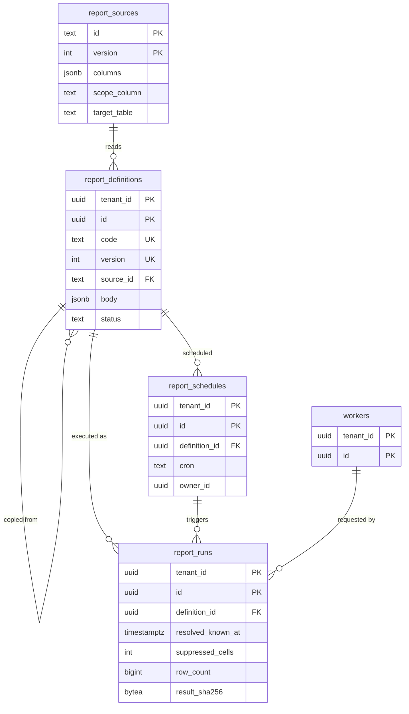

# Data model: レポート

レポートのデータの元（システム）、定義（版）、実行の記録、定期の出力の予約。分析用の基盤（S2）の表の形は [stores.md](stores.md) の 8 節。振る舞いは [reporting.md](../reporting.md) と [integrations-and-bulk.md](../integrations-and-bulk.md) の 3.5 節、決定は [ADR-0040](../../decisions/0040-declarative-reports-and-analytics-store.md)、[ADR-0041](../../decisions/0041-small-cell-suppression-for-sensitive-aggregates.md)。規約は [data-model.md](../data-model.md) の 3 節。

- レポートは値を DB に保存しない。実行の記録は値を持たず、結果は S3 に 7 日だけ置く。
- レポートは画面・API と同じ権限の判定（`project`・`scopeFilter`）を通り、`report_app` のロールで読む（[data-model.md](../data-model.md) の 3.2 節）。

## 1. ER 図

## 2. テーブル

### 2.1 `report_sources`

データの元（システムの定義。テナントの外）。テナントは足せない。定義元：[reporting.md](../reporting.md) の 4.1 節。

| 列 | 型 | NULL | 既定 | 説明 |
| --- | --- | --- | --- | --- |
| `id` | `text` | NOT NULL | — | `workers_as_of`・`job_history`・`org_tree_as_of`・`positions_as_of`・`time_summaries`・`leave_balances_as_of`・`payroll_result_lines`・`bp_cases`・`wage_ledger`・`annual_leave_register`・`worker_register`・`attendance_register` |
| `version` | `int` | NOT NULL | — | 列の追加は版の変更 |
| `row_unit` | `text` | NOT NULL | — | 行の単位の説明 |
| `columns` | `jsonb` | NOT NULL | — | 列ごと：名前、型、ドメイン、`pii_class`、集計の軸にできるか、条件に使えるか（個人を特定できる列は不可。DT-RPT-002 の #5） |
| `scope_column` | `text` | NOT NULL | — | `scopeFilter` の対象の組織の列 |
| `target_table` | `text` | NOT NULL | — | 読む表・ビュー（現在の表か版の表を時点で選ぶ） |
| `analytics_table` | `text` | NULL | — | S2 の Iceberg の表 |

- キー：PK `(id, version)`。
- CHECK：どの列もドメインを持つ（CI）。マイナンバー・口座番号・要配慮の列を持たない（CI の列名と型の許可リスト）。
- 運用：RLS なし（[data-model.md](../data-model.md) の 3.3 節）。書くのは `migrator` だけ。

### 2.2 `report_definitions`

レポートの定義（版の表。自由な SQL を持たない）。定義元：[reporting.md](../reporting.md) の 4.2 節。

| 列 | 型 | NULL | 既定 | 説明 |
| --- | --- | --- | --- | --- |
| `tenant_id` | `uuid` | NOT NULL | — | |
| `id` | `uuid` | NOT NULL | `uuidv7()` | |
| `code` | `text` | NOT NULL | — | 標準のレポートの写しは、元を `based_on_id` に持つ |
| `version` | `int` | NOT NULL | — | |
| `source_id` | `text` | NOT NULL | — | |
| `source_version` | `int` | NOT NULL | — | |
| `body` | `jsonb` | NOT NULL | — | `ReportDefinition`（列、条件の式の木、`groupBy`、`measures`、`asOf`、`freshness`、`sort`） |
| `static_check` | `jsonb` | NOT NULL | — | 型と、機微な値の集計の規則の検査の結果 |
| `visibility` | `text` | NOT NULL | `'private'` | `private`・`shared`（共有しても実行者の権限で絞る） |
| `based_on_id` | `uuid` | NULL | — | |
| `status` | `text` | NOT NULL | `'active'` | `active`・`retired` |
| `owner_id` | `uuid` | NOT NULL | — | |
| `created_at` | `timestamptz` | NOT NULL | `now()` | |

- キー：PK `(tenant_id, id)`。UK `(tenant_id, code, version)`。FK `(source_id, source_version)` → `report_sources`（テナントの外の表への FK。`report_sources` の行は消さない）。
- 更新：版を足すだけ。運用：RLS。保存はテナントの契約の間（実行の記録が版を指す）。

### 2.3 `report_runs`

実行の記録（値を持たない）。定義元：[reporting.md](../reporting.md) の 4.3 節。

| 列 | 型 | NULL | 既定 | 説明 |
| --- | --- | --- | --- | --- |
| `tenant_id` | `uuid` | NOT NULL | — | |
| `id` | `uuid` | NOT NULL | `uuidv7()` | |
| `definition_id` | `uuid` | NOT NULL | — | 版 |
| `requested_by` | `uuid` | NOT NULL | — | 人か連携の利用者 |
| `on_behalf_of` | `uuid` | NULL | — | 代理のログイン |
| `schedule_id` | `uuid` | NULL | — | |
| `mode` | `text` | NOT NULL | — | `sync`・`async`・`bulk_export` |
| `params` | `jsonb` | NOT NULL | — | `effective_on`（点か系列）、`known_at` の指定の有無、条件の値（個人を特定できる値は持てない） |
| `resolved_known_at` | `timestamptz` | NOT NULL | — | 安定の境界に丸めた値 |
| `store` | `text` | NOT NULL | `'aurora'` | `aurora`・`analytics`（S2） |
| `dropped_domains` | `text[]` | NOT NULL | `'{}'` | 射影で落とした列のドメイン |
| `suppressed_cells` | `int` | NOT NULL | `0` | 抑止した区分の数（どの区分かは残さない） |
| `row_count` | `bigint` | NULL | — | |
| `subject_set_sha256` | `bytea` | NULL | — | 一括の出力の対象の人の一覧のハッシュ |
| `result_sha256` | `bytea` | NULL | — | |
| `output_s3_key` | `text` | NULL | — | `report-outputs/{tenant}/{run_id}`（7 日） |
| `format` | `text` | NULL | — | `table`・`csv`・`xlsx`・`pdf` |
| `state` | `text` | NOT NULL | `'running'` | `running`・`succeeded`・`failed`・`timed_out` |
| `started_at`・`finished_at` | `timestamptz` | NOT NULL・NULL | — | |

- キー：PK `(tenant_id, id)`。
- 索引：`(tenant_id, requested_by, started_at DESC)` — 自分の実行と取り出し。`(tenant_id, state) WHERE state = 'running'` — 同時の上限（テナント 5、利用者 2）。
- 運用：RLS。保存は監査ログ（既定 10 年）。S1 の量：1 日 数万行。

### 2.4 `report_schedules`

定期の出力（毎日・毎月）の予約。[data-model.md](../data-model.md) の 6 節の DM-14 で定義した。定義元：[integrations-and-bulk.md](../integrations-and-bulk.md) の 3.5 節。

| 列 | 型 | NULL | 既定 | 説明 |
| --- | --- | --- | --- | --- |
| `tenant_id` | `uuid` | NOT NULL | — | |
| `id` | `uuid` | NOT NULL | `uuidv7()` | |
| `definition_id` | `uuid` | NOT NULL | — | |
| `owner_id` | `uuid` | NOT NULL | — | 実行の権限の主体（人か連携の利用者）。権限は実行のたびに判定する |
| `cron` | `text` | NOT NULL | — | テナントの暦（`daily`・`monthly` の形だけ） |
| `format` | `text` | NOT NULL | — | `csv`・`xlsx` |
| `next_run_at` | `timestamptz` | NOT NULL | — | |
| `active` | `boolean` | NOT NULL | `true` | |

- キー：PK `(tenant_id, id)`。索引：`(next_run_at) WHERE active`（`scheduler`）。
- 出力は S3 の `export-files/{tenant}/{run_id}` に置き、API で取りに来てもらう（押し出す SFTP は MVP の外）。
- 運用：RLS。
