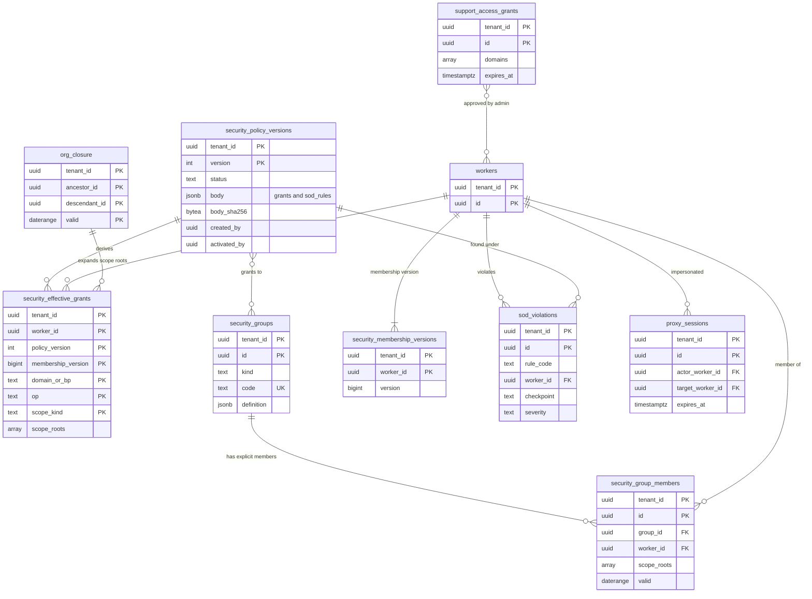

# Data model: 権限

権限の方針の版、セキュリティグループと所属、所属の版、利用者ごとの権限の表、職務分掌の違反、代理のログイン、サポートの参照の許可。振る舞いは [security-model.md](../security-model.md) と [security.md](../security.md) の 7 節、決定は [ADR-0017](../../decisions/0017-authorization-evaluator.md)〜[ADR-0020](../../decisions/0020-sensitive-read-audit-and-access-explanations.md)、[ADR-0053](../../decisions/0053-operator-access-and-vault-break-glass.md)。規約は [data-model.md](../data-model.md) の 3 節。

- ドメインと操作の一覧はシステムの定数（コード）で、表に持たない（[security-model.md](../security-model.md) の 3.1・3.2 節）。
- 職務分掌の規則は、システムの規則（S1〜S8）がコードの定数、テナントの規則が `security_policy_versions.body.sod_rules`。表 `sod_rules` は持たない（[data-model.md](../data-model.md) の 6 節）。
- 閲覧・拒否・代理の要求の記録は `audit_events`（[tenancy-and-audit.md](tenancy-and-audit.md)）。

## 1. ER 図

## 2. テーブル

### 2.1 `security_policy_versions`

権限の方針の版（版の表）。定義元：[security-model.md](../security-model.md) の 7.2・8 節。

| 列 | 型 | NULL | 既定 | 説明 |
| --- | --- | --- | --- | --- |
| `tenant_id` | `uuid` | NOT NULL | — | |
| `version` | `int` | NOT NULL | — | 1 から |
| `status` | `text` | NOT NULL | `'draft'` | `draft`・`pending_activation`・`active`・`superseded`・`rejected` |
| `body` | `jsonb` | NOT NULL | — | `grants`：`[{group_id, domain \| process_type, ops[]}]`、`sod_rules`：テナントの規則 `[{code, a, b, scope, strength}]`、`special`：`payroll.retro_override` などの特別の権限 |
| `body_sha256` | `bytea` | NOT NULL | — | |
| `based_on_version` | `int` | NULL | — | 戻しは前の版の中身を写した新しい版 |
| `diff_summary` | `jsonb` | NULL | — | 有効化の前に作る、前の版との差（権限を得る・失う人数。人の ID は持たない） |
| `created_by` | `uuid` | NOT NULL | — | 編集者（`security.config`） |
| `activated_by` | `uuid` | NULL | — | 承認者（`security.activation`） |
| `activated_at` | `timestamptz` | NULL | — | |
| `activation_case_id` | `uuid` | NULL | — | `security_policy_activation` の案件 |
| `comment` | `text` | NULL | — | |
| `lock_version` | `int` | NOT NULL | `0` | 下書きの編集の楽観ロック |

- キー：PK `(tenant_id, version)`。
- 一意：`(tenant_id) WHERE status = 'active'`（有効な版は 1 つ）、`(tenant_id) WHERE status = 'draft'`（下書きは 1 つ）。
- CHECK：`status IN (...)`、`status NOT IN ('active','superseded') OR (activated_by IS NOT NULL AND activated_by <> created_by)`（S3）。
- 更新：`active` の後は `superseded` への変更だけ（トリガー）。
- 運用：RLS。保存は監査ログ（既定 10 年）。
- S1 の量：テナントあたり年 数十版。

### 2.2 `security_groups`

セキュリティグループ。定義元：[security-model.md](../security-model.md) の 4.1 節。

| 列 | 型 | NULL | 既定 | 説明 |
| --- | --- | --- | --- | --- |
| `tenant_id` | `uuid` | NOT NULL | — | |
| `id` | `uuid` | NOT NULL | `uuidv7()` | |
| `kind` | `text` | NOT NULL | — | `user`・`role`・`job`・`org_membership`・`self`・`intersection` |
| `code` | `text` | NOT NULL | — | `payroll_admins` など |
| `name` | `text` | NOT NULL | — | |
| `definition` | `jsonb` | NOT NULL | — | 種類ごと：`role` はロールの名前、`job` は職務・等級の条件、`org_membership` は根の組織と下位、`intersection` は構成のグループ（2〜4）、`user` は範囲（`all`・`orgs`） |
| `is_system` | `boolean` | NOT NULL | `false` | `self` など |
| `created_at`・`updated_at` | `timestamptz` | NOT NULL | — | |
| `retired_at` | `timestamptz` | NULL | — | 方針から外したグループ |

- キー：PK `(tenant_id, id)`。UK `(tenant_id, code)`。
- CHECK：`kind IN (...)`。
- 更新：定義の変更は方針の下書きと一緒に有効化する（`security.config`）。
- 上限：1 テナント 2,000（アプリ）。
- 運用：RLS。保存は監査ログ。

### 2.3 `security_group_members`

`user` のグループの明示の所属（期間つきの行）。`role`・`job`・`org_membership` の所属は組織・職務の facet から判定のときに決まり、ここに持たない。定義元：[security-model.md](../security-model.md) の 4.4・7.2 節。

| 列 | 型 | NULL | 既定 | 説明 |
| --- | --- | --- | --- | --- |
| `tenant_id` | `uuid` | NOT NULL | — | |
| `id` | `uuid` | NOT NULL | `uuidv7()` | |
| `group_id` | `uuid` | NOT NULL | — | `kind = 'user'` のグループだけ |
| `worker_id` | `uuid` | NULL | — | 人。連携の利用者は `integration_user_id` |
| `integration_user_id` | `uuid` | NULL | — | → `integration_users` |
| `scope_kind` | `text` | NOT NULL | — | `all`・`orgs` |
| `scope_roots` | `uuid[]` | NOT NULL | `'{}'` | 範囲の根の組織 |
| `include_sub` | `boolean` | NOT NULL | `true` | |
| `valid` | `daterange` | NOT NULL | — | 所属の期間 |
| `source_case_id` | `uuid` | NOT NULL | — | `security_group_membership_change` の案件 |
| `closed_by_case_id` | `uuid` | NULL | — | 期間を閉じた案件 |

- キー：PK `(tenant_id, id)`。FK `(tenant_id, group_id)` → `security_groups`、`(tenant_id, worker_id)` → `workers`、`(tenant_id, integration_user_id)` → `integration_users`。
- 排他：`EXCLUDE USING gist (tenant_id WITH =, group_id WITH =, coalesce(worker_id, integration_user_id) WITH =, valid WITH &&)`。
- CHECK：`num_nonnulls(worker_id, integration_user_id) = 1`、`scope_kind = 'all' OR cardinality(scope_roots) > 0`。
- 更新：期間を閉じる `UPDATE` だけ（[data-model.md](../data-model.md) の 3.4.1 節の C）。
- 運用：RLS。保存は監査ログ。

### 2.4 `security_membership_versions`

人ごとの所属の版（権限のキャッシュのキー）。[data-model.md](../data-model.md) の 6 節の DM-14 で定義した。定義元：[security-model.md](../security-model.md) の 7.3 節。

| 列 | 型 | NULL | 既定 | 説明 |
| --- | --- | --- | --- | --- |
| `tenant_id` | `uuid` | NOT NULL | — | |
| `worker_id` | `uuid` | NOT NULL | — | 人（連携の利用者は `integration_users.id` を同じ列に入れる） |
| `version` | `bigint` | NOT NULL | `1` | 所属・ロール・職務・組織の所属が変わるたびに 1 つ上げる |
| `updated_at` | `timestamptz` | NOT NULL | `now()` | |

- キー：PK `(tenant_id, worker_id)`。
- 更新：業務プロセスの完了（所属・ロール・職務・異動）と、発効のタイマー（将来日付のロールの割り当て）の同じトランザクションで上げる。
- 運用：RLS。人の削除で消す。

### 2.5 `security_effective_grants`

利用者ごとの権限の表（派生）。定義元：[security-model.md](../security-model.md) の 7.2 節。

| 列 | 型 | NULL | 既定 | 説明 |
| --- | --- | --- | --- | --- |
| `tenant_id` | `uuid` | NOT NULL | — | |
| `worker_id` | `uuid` | NOT NULL | — | 人か連携の利用者 |
| `policy_version` | `int` | NOT NULL | — | |
| `membership_version` | `bigint` | NOT NULL | — | |
| `domain_or_bp` | `text` | NOT NULL | — | ドメイン（`worker.compensation`）か `bp:<process_type>` |
| `op` | `text` | NOT NULL | — | `view`・`modify`・`get`・`put`・`aggregate`・`initiate`・`approve`・`cancel`・`rescind`・`correct`・`reassign`・`retro_override`・`approve_without_route` など |
| `scope_kind` | `text` | NOT NULL | — | `all`・`orgs`（`self` は行を持たない） |
| `scope_roots` | `uuid[]` | NOT NULL | `'{}'` | |
| `include_sub` | `boolean` | NOT NULL | `true` | |
| `grant_ids` | `uuid[]` | NOT NULL | — | 由来の権限（説明の報告） |
| `built_at` | `timestamptz` | NOT NULL | `now()` | |

- キー：PK `(tenant_id, worker_id, policy_version, membership_version, domain_or_bp, op, scope_kind, include_sub)`。
- 索引：`(tenant_id, policy_version, domain_or_bp, op)` — 「この項目を誰が見られるか」の報告。
- 更新：方針の有効化・所属の変更・発効で、影響を受けた人の行を作り直す。古い版の行は、次の版の作り直しの後に消す。
- キャッシュ：Valkey の `authz:{tenant}:{worker}:{policy_version}:{membership_version}`（[stores.md](stores.md)）。
- 運用：RLS。派生なので保存の対象外（作り直せる）。
- S1 の量：約 300 万行（`self` 以外の権限を持つ 15% × 平均 20 行）。

### 2.6 `sod_violations`

職務分掌の違反。定義元：[security-model.md](../security-model.md) の 5.3 節（DT-SEC-002）。

| 列 | 型 | NULL | 既定 | 説明 |
| --- | --- | --- | --- | --- |
| `tenant_id` | `uuid` | NOT NULL | — | |
| `id` | `uuid` | NOT NULL | `uuidv7()` | |
| `rule_code` | `text` | NOT NULL | — | `S1`〜`S8` かテナントの規則のコード |
| `worker_id` | `uuid` | NOT NULL | — | |
| `policy_version` | `int` | NOT NULL | — | |
| `checkpoint` | `text` | NOT NULL | — | `activation`・`membership_change`・`case_action`・`nightly_scan` |
| `severity` | `text` | NOT NULL | — | `block`・`warn` |
| `outcome` | `text` | NOT NULL | — | `blocked`・`warned`・`reported` |
| `overlap_orgs` | `uuid[]` | NOT NULL | `'{}'` | 範囲が重なった組織 |
| `case_id` | `uuid` | NULL | — | 検査点 2・3 の案件 |
| `detected_at` | `timestamptz` | NOT NULL | `now()` | |
| `resolved_at` | `timestamptz` | NULL | — | 夜間の走査の違反が解消した時刻 |

- キー：PK `(tenant_id, id)`。
- 索引：`(tenant_id, resolved_at) WHERE checkpoint = 'nightly_scan'` — 未解消の一覧。
- 運用：RLS。保存は監査ログ。
- S1 の量：小さい（数万行）。

### 2.7 `proxy_sessions`

代理のログイン。定義元：[security-model.md](../security-model.md) の 9 節。

| 列 | 型 | NULL | 既定 | 説明 |
| --- | --- | --- | --- | --- |
| `tenant_id` | `uuid` | NOT NULL | — | |
| `id` | `uuid` | NOT NULL | `uuidv7()` | |
| `actor_worker_id` | `uuid` | NOT NULL | — | 代理でログインした管理者 |
| `target_worker_id` | `uuid` | NOT NULL | — | 見え方を確かめる相手 |
| `mode` | `text` | NOT NULL | — | `read_only`（本番）・`read_write`（sandbox） |
| `reason` | `text` | NOT NULL | — | |
| `started_at` | `timestamptz` | NOT NULL | `now()` | |
| `expires_at` | `timestamptz` | NOT NULL | — | 本番 30 分、sandbox 2 時間 |
| `ended_at` | `timestamptz` | NULL | — | |
| `auth_session_id` | `uuid` | NOT NULL | — | → `auth_sessions`（テナントの外。DB の FK なし） |

- キー：PK `(tenant_id, id)`。
- CHECK：`actor_worker_id <> target_worker_id`、`mode IN (...)`。本番のテナントでは `mode = 'read_only'` と 30 分以内をトリガーで確かめる（`tenants.environment` を読む）。
- 運用：RLS。代理の間の全要求は `audit_events` に `on_behalf_of` つきで残る。保存は監査ログ。

### 2.8 `support_access_grants`

テナントの管理者による、本システムのサポートの参照の許可。定義元：[security.md](../security.md) の 7 節、[ADR-0053](../../decisions/0053-operator-access-and-vault-break-glass.md)。

| 列 | 型 | NULL | 既定 | 説明 |
| --- | --- | --- | --- | --- |
| `tenant_id` | `uuid` | NOT NULL | — | |
| `id` | `uuid` | NOT NULL | `uuidv7()` | |
| `granted_by` | `uuid` | NOT NULL | — | テナントの管理者（`security.admin`） |
| `domains` | `text[]` | NOT NULL | — | 許すドメイン。`worker.sensitive`・`my_number` は選べない |
| `ticket_ref` | `text` | NOT NULL | — | 問い合わせの番号 |
| `starts_at`・`expires_at` | `timestamptz` | NOT NULL | — | 最長 7 日（既定 24 時間） |
| `revoked_at` | `timestamptz` | NULL | — | |

- キー：PK `(tenant_id, id)`。
- CHECK：`NOT (domains && ARRAY['worker.sensitive','my_number'])`、`expires_at > starts_at`。
- 運用：RLS。運用者の参照は `platform_audit_events` に許可の ID つきで残る。保存は監査ログ。
