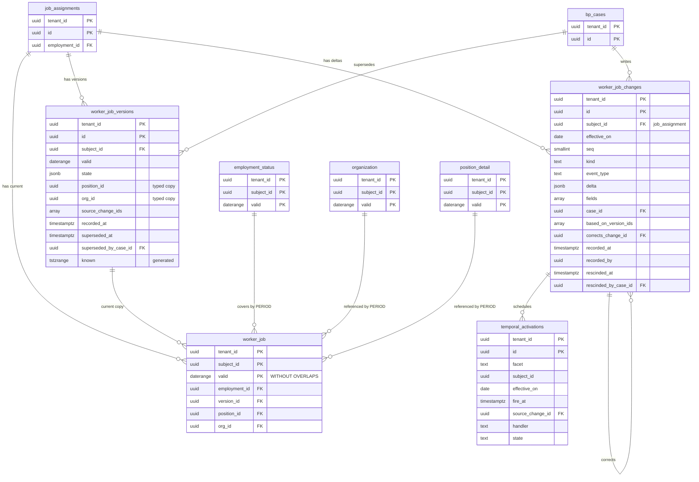

# Data model: 有効日付の共通の形

facet ごとの差分・バージョン・現在の 3 つの表の列、facet の一覧、発効の予定。振る舞いは [object-model-and-effective-dating.md](../object-model-and-effective-dating.md)、決定は [ADR-0002](../../decisions/0002-effective-dated-data-model.md)、[ADR-0006](../../decisions/0006-temporal-table-triplet-and-fold.md)〜[ADR-0009](../../decisions/0009-temporal-reference-model-testing.md) にある。規約は [data-model.md](../data-model.md) の 3 節（特に 3.4 節）。

## 1. ER 図

`worker_job` を例に、3 つの表と、主体・案件・参照先の関係を描く。他の facet も同じ形。

## 2. 3 つの表の共通の列

マイグレーションは `FacetSpec` から生成する（手で書かない。E2 の `temporal-ddl-generator`）。facet ごとの値の列（型のある列）は、各領域のファイルの facet の節にある。値の列は、バージョンの表の `state`（`jsonb`、全体）に必ず入り、外部キーと検索に使うものだけを型のある列にも写す（バージョンと現在の両方）。

### 2.1 `<facet>_changes`（差分）

| 列 | 型 | NULL | 既定 | 説明 |
| --- | --- | --- | --- | --- |
| `tenant_id` | `uuid` | NOT NULL | — | |
| `id` | `uuid` | NOT NULL | `uuidv7()` | |
| `subject_id` | `uuid` | NOT NULL | — | facet の主体（下の 3 節の表の「主体の表」の ID） |
| `effective_on` | `date` | NOT NULL | — | 有効日（テナントの暦） |
| `seq` | `smallint` | NOT NULL | — | 同じ日の順序。`FacetSpec.seqTable` の事象の種類の優先度（訂正は元と同じ） |
| `kind` | `text` | NOT NULL | — | `change`・`correction`・`end` |
| `event_type` | `text` | NOT NULL | — | `hire`・`job_change`・`terminate`・`migration` など（業務プロセスの種類から） |
| `delta` | `jsonb` | NOT NULL | — | `{"set": {...}, "unset": [...]}`。Zod で検証。暗号化する項目は暗号文のまま。P は facet による |
| `fields` | `text[]` | NOT NULL | — | 触れた項目（DT-TEMP-001・004 の判定） |
| `case_id` | `uuid` | NOT NULL | — | → `bp_cases`（[ADR-0003](../../decisions/0003-business-process-engine.md)） |
| `based_on_version_ids` | `uuid[]` | NOT NULL | `'{}'` | 起票者が見たバージョン（DT-TEMP-004） |
| `corrects_change_id` | `uuid` | NULL | — | `kind = 'correction'` のとき、訂正した差分 |
| `recorded_at` | `timestamptz` | NOT NULL | — | ロックの後の `clock_timestamp()` |
| `recorded_by` | `uuid` | NOT NULL | — | 操作者（`workers.id`、連携の利用者、システム） |
| `rescinded_at` | `timestamptz` | NULL | — | 取消・訂正で退けた時刻（空から 1 回だけ埋める） |
| `rescinded_by_case_id` | `uuid` | NULL | — | 退けた案件 |

- キー：PK `(tenant_id, id)`。FK `(tenant_id, subject_id)` → 主体の表、`(tenant_id, case_id)` → `bp_cases`、`(tenant_id, corrects_change_id)` → 同じ表。
- 索引：`(tenant_id, subject_id, effective_on, seq)` — 畳み込みの読み取り。`(tenant_id, case_id)` — 取消（案件が書いた差分の列挙）。
- CHECK：`kind IN (...)`、`(kind = 'correction') = (corrects_change_id IS NOT NULL)`、`(rescinded_at IS NULL) = (rescinded_by_case_id IS NULL)`、`effective_on >= '1900-01-01'`。
- 更新：`app` は `INSERT`・`SELECT` だけ。`rescinded_*` の埋め込みは `temporal_owner` の関数だけ。トリガーで他の列の更新と、埋めた後の更新を拒む。

### 2.2 `<facet>_versions`（バージョン）

| 列 | 型 | NULL | 既定 | 説明 |
| --- | --- | --- | --- | --- |
| `tenant_id` | `uuid` | NOT NULL | — | |
| `id` | `uuid` | NOT NULL | `uuidv7()` | |
| `subject_id` | `uuid` | NOT NULL | — | |
| `valid` | `daterange` | NOT NULL | — | 有効時間 `[start, end)`。`end` なしは上限なし |
| `state` | `jsonb` | NOT NULL | — | 畳み込んだ状態の全体（`FacetSpec.fields` で検証済み） |
| （値の列） | facet による | facet による | — | 外部キー・検索に使う列の写し（例：`position_id`、`org_id`） |
| `source_change_ids` | `uuid[]` | NOT NULL | — | この状態を作った差分 |
| `recorded_at` | `timestamptz` | NOT NULL | — | 記録時間の始まり |
| `superseded_at` | `timestamptz` | NULL | — | 置き換えた時刻（空から 1 回だけ埋める） |
| `superseded_by_case_id` | `uuid` | NULL | — | 置き換えた案件 |
| `known` | `tstzrange` | NOT NULL | 生成列 | `tstzrange(recorded_at, superseded_at)` |

- キー：PK `(tenant_id, id)`。FK `(tenant_id, subject_id)` → 主体の表。
- 索引：GiST `(tenant_id, subject_id, valid, known)` — 時点の問い合わせ（有効日 D を時刻 T の知識で）。facet によっては GiST `(tenant_id, org_id, valid, known)` — `known_at` を指定した組織の一覧（レポートの非同期）。
- CHECK：`NOT isempty(valid)`、`lower(valid) >= '1900-01-01'`、`superseded_at IS NULL OR superseded_at >= recorded_at`。
- 更新：`superseded_*` の埋め込みだけ（2.1 節と同じ）。

### 2.3 `<facet>`（現在の知識）

| 列 | 型 | NULL | 既定 | 説明 |
| --- | --- | --- | --- | --- |
| `tenant_id` | `uuid` | NOT NULL | — | |
| `subject_id` | `uuid` | NOT NULL | — | |
| `valid` | `daterange` | NOT NULL | — | |
| `version_id` | `uuid` | NOT NULL | — | → `<facet>_versions` |
| （coverage の親の ID） | `uuid` | NOT NULL | — | 主体から決まる親（例：`worker_job.employment_id`）。`PERIOD` の外部キーに使う |
| （値の列） | facet による | facet による | — | バージョンと同じ型のある列 |

- キー：PK `(tenant_id, subject_id, valid WITHOUT OVERLAPS)`。FK `(tenant_id, version_id)` → バージョン。facet ごとの `PERIOD` の外部キー（coverage と参照先）。
- 索引：facet ごと。一覧の「組織の全員を日 D で」は GiST `(tenant_id, org_id, valid)`。
- 更新：行の削除と追加は `temporal_owner` の関数（`temporal.apply_fold`、`temporal.rebuild_current`）だけ。`app` は `SELECT` と関数の `EXECUTE` だけ。
- `superseded_at IS NULL` のバージョンとちょうど 1 対 1。夜間の検査で突き合わせる（[object-model-and-effective-dating.md](../object-model-and-effective-dating.md) の 12.3 節）。

### 2.4 共通の運用

- テナント：3 つの表とも RLS（[data-model.md](../data-model.md) の 3.2 節）。関数の中でも呼び出し元の `app.tenant_id` で RLS が効く。
- パーティション：S1 はなし。S2 で `_changes`・`_versions` を `recorded_at` の月で分ける。現在の表は分けない（パーティションをまたぐ重なりを検査できないため）。
- 保存：facet の主体のデータの種類（各領域のファイル）。退職者の主体は、保存の期間の後に `retention_purger` が 3 つの表から主体ごとに消す。
- S1 の量：バージョンは 1 人あたり年 20 バージョン（全 facet）× 100 万人 ≒ 年 2,000 万行。差分は年 1,500 万行。1 人・1 facet の差分は警告 2,000、拒否 10,000（[object-model-and-effective-dating.md](../object-model-and-effective-dating.md) の 3.1・9 節）。

## 3. facet の一覧

全部で 22 個（物理の表は 66）。「隙間」は `gapped`（途切れてよい）と `contiguous`（coverage の親の期間の中で途切れない）。値の列の定義は「定義」の列のファイルにある。

| facet | 主体（`subject_id` の先） | 隙間 | coverage の親 | 主な `PERIOD` の外部キー | ドメイン | P | 定義 |
| --- | --- | --- | --- | --- | --- | --- | --- |
| `worker_personal` | `workers` | contiguous | — | — | `worker.personal`・`worker.public` | P2 | [core-hr.md](core-hr.md) |
| `worker_address` | `worker_address_subjects` | gapped | — | — | `worker.address` | P2 | 同上 |
| `worker_contact` | `workers` | contiguous | — | — | `worker.contact` | P2 | 同上 |
| `worker_dependents` | `dependents` | gapped | — | — | `worker.dependents` | P2 | 同上 |
| `worker_emergency_contacts` | `emergency_contacts` | gapped | — | — | `worker.contact` | P2 | 同上 |
| `employment_status` | `employments` | gapped | — | → `leave_of_absence_types`（バージョンでなく通常の FK） | `worker.employment`・`worker.employment.leave_type` | P1〜P2 | 同上 |
| `employment_contract` | `employments` | gapped | `employment_status` | — | `worker.employment` | P1 | 同上 |
| `employment_primary_job` | `employments` | contiguous | `employment_status` | → `worker_job` | `worker.job` | P1 | 同上 |
| `worker_job` | `job_assignments` | contiguous | `employment_status` | → `organization`、`position_detail`、`grade_detail`、`job_profile` | `worker.job` | P1 | 同上 |
| `worker_compensation` | `employments` | contiguous | `employment_status` | → `grade_detail` | `worker.compensation` | P2 | 同上 |
| `worker_payment_election` | `employments` | gapped | `employment_status` | — | `worker.payment_election` | P2 | 同上 |
| `organization` | `organizations` | gapped | — | — | `org.structure` | P0 | 同上 |
| `org_parent` | `organizations`（子） | gapped | `organization` | → `organization`（親） | `org.structure` | P0 | 同上 |
| `position_detail` | `positions` | gapped | `organization`（所属） | → `organization`、`job_profile` | `position.management` | P0 | 同上 |
| `job_profile` | `job_profiles` | gapped | — | — | `position.management` | P0 | 同上 |
| `grade_detail` | `grades` | gapped | — | — | `position.management` | P0 | 同上 |
| `org_role_assignment` | `org_role_assignments` | gapped | `organization` | → `organization` | `org.structure` | P0 | 同上 |
| `employment_work_rule` | `employments` | contiguous | `employment_status` | — | `time.records` | P1 | [time.md](time.md) |
| `employment_pay_group` | `employments` | gapped | `employment_status` | — | `payroll.input` | P0 | [payroll.md](payroll.md) |
| `worker_tax_profile` | `employments` | gapped | `employment_status` | — | `payroll.input` | P2 | [payroll-jp.md](payroll-jp.md) |
| `worker_social_insurance` | `employments` | gapped | `employment_status` | — | `payroll.input` | P2 | 同上 |
| `worker_employment_insurance` | `employments` | gapped | `employment_status` | — | `payroll.input` | P1 | 同上 |

- `FacetSpec.subject` の値：`worker`・`address`・`dependent`・`emergency_contact`・`employment`・`job_assignment`・`position`・`organization`・`role_assignment`・`job_profile`・`grade`（[data-model.md](../data-model.md) の 6 節の DM-9）。
- `employment_pay_group` は `gapped`：雇用のうち給与の対象でない期間（`contingent` の雇用、給与を外部で払う期間）を持てるようにする。
- 給与の facet（`worker_tax_profile` など）が `gapped` なのは、資格のない期間（被保険者でない、申告書がない）を「行なし」で表すため。資格の有無の区分を値に持つかは facet ごとに決めた（[payroll-jp.md](payroll-jp.md)）。

## 4. `temporal_activations`

将来日付の差分の、発効の日の副作用の予定。定義元：[object-model-and-effective-dating.md](../object-model-and-effective-dating.md) の 8 節（DT-TEMP-005）。

| 列 | 型 | NULL | 既定 | 説明 |
| --- | --- | --- | --- | --- |
| `tenant_id` | `uuid` | NOT NULL | — | |
| `id` | `uuid` | NOT NULL | `uuidv7()` | 副作用の冪等キー |
| `subject_type` | `text` | NOT NULL | — | `FacetSpec.subject` の値 |
| `subject_id` | `uuid` | NOT NULL | — | |
| `facet` | `text` | NOT NULL | — | |
| `effective_on` | `date` | NOT NULL | — | |
| `fire_at` | `timestamptz` | NOT NULL | — | `effective_on` のテナントの暦の 0 時 |
| `source_change_id` | `uuid` | NOT NULL | — | → `<facet>_changes`（表が facet ごとなので DB の FK はなし） |
| `handler` | `text` | NOT NULL | — | 登録した副作用（`sso_account_enable`、`authz_cache_bump`、`bp_reassign_notice`、`notify` など） |
| `state` | `text` | NOT NULL | `'scheduled'` | `scheduled`・`fired`・`cancelled` |
| `fired_at` | `timestamptz` | NULL | — | |
| `attempts` | `int` | NOT NULL | `0` | |
| `created_at` | `timestamptz` | NOT NULL | `now()` | |

- キー：PK `(tenant_id, id)`。
- 索引：`(fire_at) WHERE state = 'scheduled'` — BP Worker の取り出し（`scheduler` のロールが候補を探し、`FOR UPDATE SKIP LOCKED`）。`(tenant_id, source_change_id)` — 取消・訂正での予定の取り消し。
- CHECK：`state IN (...)`、`(state = 'fired') = (fired_at IS NOT NULL)`。
- 運用：RLS。パーティションなし。`fired`・`cancelled` の行は 1 年で消す（運用の記録）。
- S1 の量：常時 数十万行（4 月 1 日の前に 30 万件の予定。[capacity.md](../capacity.md) の 1 節）。
- 性質：生きている差分のうち `effective_on > 記録の日` のものと 1 対 1（PROP-TEMP-008）。
