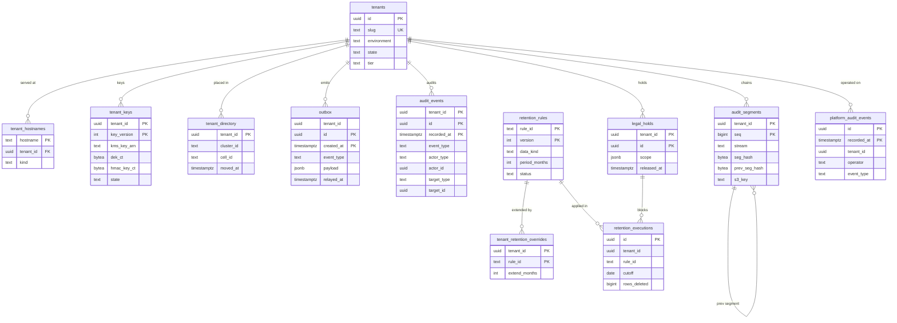

# Data model: テナント・outbox・監査・保存

テナント、ホスト名、テナントの鍵、クラスタ（セル）の対応、outbox、テナントの監査、プラットフォームの監査、連鎖のセグメント、保存の期間の規則表、テナントの延長、保全、削除の実行。振る舞いは [security.md](../security.md) の 5 節、[infrastructure.md](../infrastructure.md) の 7〜9 節、[audit-and-retention.md](../audit-and-retention.md)、決定は [ADR-0048](../../decisions/0048-audit-log-hash-chain-and-anchoring.md)〜[ADR-0050](../../decisions/0050-electronic-books-act-readiness.md)、[ADR-0052](../../decisions/0052-kms-key-hierarchy.md)、[ADR-0056](../../decisions/0056-stages-cluster-sharding-and-cells.md)。規約は [data-model.md](../data-model.md) の 3 節。

## 1. ER 図

## 2. テナント（テナントの外）

### 2.1 `tenants`

テナント。RLS の外（[data-model.md](../data-model.md) の 3.3 節）。書くのは `platform` だけ。

| 列 | 型 | NULL | 既定 | 説明 |
| --- | --- | --- | --- | --- |
| `id` | `uuid` | NOT NULL | `uuidv7()` | |
| `slug` | `text` | NOT NULL | — | ホスト名の `<tenant>` |
| `display_name` | `text` | NOT NULL | — | |
| `environment` | `text` | NOT NULL | — | `production`・`sandbox`・`monitoring`（社内の監視用。合成の給与の実行） |
| `production_tenant_id` | `uuid` | NULL | — | sandbox の元の本番のテナント |
| `state` | `text` | NOT NULL | `'implementing'` | `implementing`・`live`・`suspended`・`offboarding`・`deleted`（`migration` の種類は `implementing` の間だけ） |
| `tier` | `text` | NOT NULL | `'standard'` | `standard`・`large`・`dedicated_key`（費用のタグ、専用の鍵の選択肢） |
| `calendar_tz` | `text` | NOT NULL | `'Asia/Tokyo'` | テナントの暦 |
| `settings` | `jsonb` | NOT NULL | `'{}'` | 契約の機能（permission のフラグの元）、k の既定の上書き（3 以上）など |
| `created_at` | `timestamptz` | NOT NULL | `now()` | |
| `offboarded_at` | `timestamptz` | NULL | — | |

- キー：PK `(id)`。UK `(slug)`。CHECK `environment IN (...)`、`state IN (...)`、`(environment = 'sandbox') = (production_tenant_id IS NOT NULL)`。
- 保存：テナントの削除の後も行を残す（`state = 'deleted'`。監査の記録が指す）。

### 2.2 `tenant_hostnames`

ホスト名 → テナント（要求の最初に引く）。

| 列 | 型 | NULL | 既定 | 説明 |
| --- | --- | --- | --- | --- |
| `hostname` | `text` | NOT NULL | — | `<tenant>.<brand>.<domain>`、`mn.<tenant>.<brand>.<domain>`（保管庫の画面） |
| `tenant_id` | `uuid` | NOT NULL | — | |
| `kind` | `text` | NOT NULL | — | `app`・`vault_web` |
| `created_at` | `timestamptz` | NOT NULL | `now()` | |

- キー：PK `(hostname)`。FK `(tenant_id)` → `tenants`。
- 読み取り：`resolve_tenant_by_host(host)`。結果はプロセスの中で 60 秒キャッシュ。

### 2.3 `tenant_keys`

テナントの鍵。S1 は KMS の鍵の ARN、S2 からはセルの鍵で包んだテナントの DEK。人事の側の HMAC の鍵もここ（DM-12）。定義元：[security.md](../security.md) の 5.2・5.3 節。

| 列 | 型 | NULL | 既定 | 説明 |
| --- | --- | --- | --- | --- |
| `tenant_id` | `uuid` | NOT NULL | — | |
| `key_version` | `int` | NOT NULL | `1` | |
| `kms_key_arn` | `text` | NOT NULL | — | S1：`<brand>-tenant-<tenant_id>`。S2：`<brand>-cell-<cell_id>` |
| `dek_ct` | `bytea` | NULL | — | S2：セルの鍵で包んだテナントの DEK（暗号の文脈に `tenant_id`） |
| `hmac_key_ct` | `bytea` | NOT NULL | — | 32 バイトの HMAC の鍵を、テナントの鍵（S2 は DEK）で包んだもの |
| `state` | `text` | NOT NULL | `'active'` | `active`・`pending_deletion`・`destroyed` |
| `deletion_scheduled_at` | `timestamptz` | NULL | — | |
| `destroyed_at` | `timestamptz` | NULL | — | 暗号の消去の完了（バックアップの期限の後） |

- キー：PK `(tenant_id, key_version)`。一意 `(tenant_id) WHERE state = 'active'`。
- 読み取り：`tenant_key_for_current()`（`SECURITY DEFINER`。`app.tenant_id` の行だけを返す）。
- 保存：テナントの削除の後も行を残す（包んだ DEK は破棄で消す）。

### 2.4 `tenant_directory`（S2 から）

テナント → クラスタ（S3 はセル）。S3 では Global に置く。定義元：[infrastructure.md](../infrastructure.md) の 8・9 節。

| 列 | 型 | NULL | 既定 | 説明 |
| --- | --- | --- | --- | --- |
| `tenant_id` | `uuid` | NOT NULL | — | |
| `cluster_id` | `text` | NOT NULL | — | Aurora のクラスタ |
| `vault_cluster_id` | `text` | NOT NULL | — | |
| `cell_id` | `text` | NULL | — | S3 |
| `primary_region` | `text` | NOT NULL | `'ap-northeast-1'` | |
| `moved_at` | `timestamptz` | NULL | — | |

- キー：PK `(tenant_id)`。要求の経路はホスト名の DNS でセルに届き、この表を同期に引かない。

## 3. outbox

### 3.1 `outbox`

同じトランザクションで書く事象（transactional outbox）。Relay が SQS へ中継する。[data-model.md](../data-model.md) の 6 節の DM-14 で定義した。事象の種類と本文は [stores.md](stores.md) の 4 節。

| 列 | 型 | NULL | 既定 | 説明 |
| --- | --- | --- | --- | --- |
| `tenant_id` | `uuid` | NOT NULL | — | |
| `id` | `uuid` | NOT NULL | `uuidv7()` | 事象の ID（受け手の冪等のキー） |
| `created_at` | `timestamptz` | NOT NULL | `now()` | パーティションの鍵 |
| `event_type` | `text` | NOT NULL | — | `temporal.changed` など |
| `queue` | `text` | NOT NULL | — | 送り先のキュー |
| `payload` | `jsonb` | NOT NULL | — | ID とコードだけ（個人情報の値を入れない） |
| `trace_context` | `text` | NULL | — | W3C の `traceparent`（[observability.md](../observability.md) の 2 節） |
| `relayed_at` | `timestamptz` | NULL | — | |

- キー：PK `(id, created_at)`。
- 索引：`(created_at) WHERE relayed_at IS NULL` — Relay の取り出し（最古の行の経過時間を監視。60 秒で呼び出し）。
- 運用：RLS（書くのは `app`。`relay` は `BYPASSRLS` で読むだけ）。`created_at` の日ごとのパーティション。中継の済んだ日のパーティションを 2 日後に `DROP`。
- S1 の量：1 日 数千万行（打刻 400 万、案件、再計算）。

## 4. 監査

### 4.1 `audit_events`

テナントの監査（追記のみ）。定義元：[audit-and-retention.md](../audit-and-retention.md) の 3・3.1 節。

| 列 | 型 | NULL | 既定 | 説明 |
| --- | --- | --- | --- | --- |
| `tenant_id` | `uuid` | NOT NULL | — | |
| `id` | `uuid` | NOT NULL | `uuidv7()` | 連鎖の順 |
| `recorded_at` | `timestamptz` | NOT NULL | `clock_timestamp()` | |
| `event_type` | `text` | NOT NULL | — | `security.policy_activated`・`access.sensitive_read`・`access.denied_summary`・`export.downloaded`・`auth.login_failed` など |
| `actor_type` | `text` | NOT NULL | — | `worker`・`integration`・`terminal`・`system`・`operator` |
| `actor_id` | `uuid` | NULL | — | |
| `on_behalf_of` | `uuid` | NULL | — | 委任・代理 |
| `target_type` | `text` | NULL | — | |
| `target_id` | `uuid` | NULL | — | |
| `result` | `text` | NOT NULL | — | `allowed`・`denied`・`succeeded`・`failed` |
| `reason_code` | `text` | NULL | — | |
| `request_id` | `text` | NULL | — | |
| `client_ip_prefix` | `inet` | NULL | — | /24 |
| `details` | `jsonb` | NOT NULL | `'{}'` | 許可リストのスキーマ（ドメイン、経路、件数、権限の ID、ハッシュ）。値を入れない |
| `late` | `boolean` | NOT NULL | `false` | 安定の境界の後に見つかった遅れの行 |

- キー：PK `(tenant_id, id, recorded_at)`。
- 索引：`(tenant_id, target_type, target_id, recorded_at)` — 対象ごとの閲覧の記録。`(tenant_id, actor_id, recorded_at)` — 利用者ごと。`(recorded_at, tenant_id, id)` — audit-archiver の書き出し。
- 更新：`app` は `INSERT`・`SELECT`（`audit` の経路だけ）。書けなければ操作ごと失敗（機微な閲覧は応答しない）。
- 運用：RLS。`recorded_at` の月ごとのパーティション。Aurora に 13 か月。その後はセグメント（log-archive）で保存の期間（監査ログ 10 年、閲覧の記録 5 年、拒否のまとめ 1 年。L5・L10）。
- S1 の量：1 日 数百万行（1〜2 GB）。13 か月で約 0.5 TB。

### 4.2 `platform_audit_events`

プラットフォームの監査（RLS の外。運用者の本番へのアクセス、break-glass、テナントの作成・停止・削除、規則表の公開、削除の実行、保全）。

| 列 | 型 | NULL | 既定 | 説明 |
| --- | --- | --- | --- | --- |
| `id` | `uuid` | NOT NULL | `uuidv7()` | |
| `recorded_at` | `timestamptz` | NOT NULL | `clock_timestamp()` | |
| `tenant_id` | `uuid` | NULL | — | テナントにかかる操作 |
| `operator` | `text` | NOT NULL | — | IAM Identity Center の利用者の ID（人事のデータの人ではない） |
| `event_type` | `text` | NOT NULL | — | `db.read_granted`・`break_glass.used`・`rules.published`・`retention.executed`・`tenant.suspended` など |
| `support_grant_id` | `uuid` | NULL | — | テナントの許可の参照 |
| `approvals` | `jsonb` | NOT NULL | `'[]'` | 2 人の承認など |
| `details` | `jsonb` | NOT NULL | `'{}'` | 値を入れない |

- キー：PK `(id, recorded_at)`。索引：`(tenant_id, recorded_at)`。
- 運用：RLS なし。追記のみ。月ごとのパーティション。13 か月の後はセグメント（`platform` の連鎖）。

### 4.3 `audit_segments`

連鎖のセグメントのハッシュの控え（検証を速くする）。定義元：[audit-and-retention.md](../audit-and-retention.md) の 4 節。

| 列 | 型 | NULL | 既定 | 説明 |
| --- | --- | --- | --- | --- |
| `tenant_id` | `uuid` | NOT NULL | — | プラットフォームの連鎖は定数の ID |
| `seq` | `bigint` | NOT NULL | — | テナントの中の連番 |
| `stream` | `text` | NOT NULL | — | `audit_events`（`bp_events`・差分を入れる形は E11） |
| `window_start`・`window_end` | `timestamptz` | NOT NULL | — | 1 分（1 時間にまとめる案は E11） |
| `first_id`・`last_id` | `uuid` | NOT NULL | — | |
| `row_count` | `int` | NOT NULL | — | |
| `prev_seg_hash` | `bytea` | NOT NULL | — | |
| `seg_hash` | `bytea` | NOT NULL | — | `SHA-256(prev_seg_hash ‖ 各行のハッシュの列)` |
| `s3_key` | `text` | NOT NULL | — | `audit/{tenant}/{yyyy}/{mm}/{dd}/{seq}.jsonl.gz` |
| `anchored_on` | `date` | NULL | — | 日の署名に入った日 |
| `after_verification_failure` | `boolean` | NOT NULL | `false` | |

- キー：PK `(tenant_id, seq)`。UK `(tenant_id, stream, window_start)`。
- 更新：`audit_archiver` の追記だけ（`anchored_on` の埋め込みを除く）。
- 運用：RLS。書くのは `audit_archiver`（`BYPASSRLS`）だけ。保存は監査ログ。

## 5. 保存の期間

### 5.1 `retention_rules`

保存の期間の規則表（テナントの外。バージョンの表）。定義元：[audit-and-retention.md](../audit-and-retention.md) の 5.1・5.2 節、[ADR-0049](../../decisions/0049-retention-rules-table-and-legal-hold.md)。

| 列 | 型 | NULL | 既定 | 説明 |
| --- | --- | --- | --- | --- |
| `rule_id` | `text` | NOT NULL | — | `worker_register`・`wage_ledger`・`hire_termination_docs`・`important_labor_records`・`annual_leave_register`・`health_insurance_docs`・`pension_docs`・`employment_insurance_docs`・`tax_declarations`・`withholding_records`・`payroll_run_artifacts`・`payroll_journal`・`payslips`・`bank_files`・`audit_log`・`sensitive_read_log`・`deny_summary`・`resident_tax_notices`・`parallel_run_data`・`parallel_run_gates`・`import_files`・`report_outputs`・`former_worker_misc` |
| `version` | `int` | NOT NULL | — | |
| `data_kind` | `text` | NOT NULL | — | 規則表の「データの種類」の名前 |
| `legal_basis` | `text` | NOT NULL | — | 根拠（条文、出典） |
| `start_event` | `text` | NOT NULL | — | `termination`・`last_entry`・`completion`・`pay_date`・`recorded`・`go_live`・`next_jan_10_plus_1` など |
| `period_months` | `int` | NOT NULL | — | 動かす期間（確認待ちは候補の最長） |
| `period_basis` | `text` | NOT NULL | — | `from_start_event`・`from_next_jan_10_plus_1` など |
| `status` | `text` | NOT NULL | — | `confirmed`・`pending_review` |
| `candidates` | `jsonb` | NULL | — | 確認待ちの間の候補 |
| `object_lock_mode` | `text` | NOT NULL | — | `compliance`・`governance`・`none`（短くなる見込みのものは `compliance` にしない） |
| `source_url` | `text` | NULL | — | |
| `checked_on` | `date` | NOT NULL | — | |
| `reviewed_by` | `text` | NULL | — | 確認した専門家の区分 |
| `published_at` | `timestamptz` | NULL | — | |

- キー：PK `(rule_id, version)`。使うバージョンは、`rule_id` ごとに公開の済んだバージョンのうち `version` が最大のもの（削除のジョブが実行の記録にバージョンを残す）。
- CHECK：`status <> 'pending_review' OR candidates IS NOT NULL`。
- 運用：RLS なし。書くのは `platform`（取り込み・確認・公開の手順）。

### 5.2 `tenant_retention_overrides`・`legal_holds`・`retention_executions`

テナントの延長（延ばすだけ）、保全、削除の実行の記録。

| 表 | 列 | キー・制約 | テナント |
| --- | --- | --- | --- |
| `tenant_retention_overrides` | `tenant_id`、`rule_id text`、`extend_months int`、`reason text`、`set_by uuid`、`set_at timestamptz` | PK `(tenant_id, rule_id)`。CHECK `extend_months > 0` | RLS |
| `legal_holds` | `tenant_id`、`id`、`scope jsonb`（テナント全体・雇用の一覧・期間・データの種類）、`reason text`、`set_by`、`set_at`、`released_by NULL`、`released_at NULL` | PK `(tenant_id, id)`。索引 `(tenant_id) WHERE released_at IS NULL` | RLS。S3 には Object Lock のリーガルホールドを付ける |
| `retention_executions` | `id`、`tenant_id`、`rule_id`、`data_kind`、`cutoff date`、`preview jsonb`（件数）、`rows_deleted bigint`、`partitions_dropped text[]`、`objects_deleted bigint`、`approved_by text[]`（運用の担当 2 人）、`started_at`、`finished_at` | PK `(id)`。索引 `(tenant_id, started_at)`。CHECK `cardinality(approved_by) >= 2` | RLS の外（3.3 節）。`platform_audit_events` にも残す |

- `retention_purger` のトリガーは、削除のトランザクションに `retention_executions` の行があり、対象が生きている `legal_holds` の範囲に入らないことを確かめる。
- 保存：どれも監査ログ。
