# Data model: 勤怠

打刻、訂正、客観的な記録と乖離、勤務の規則とシフト、日の結果、36 協定と警告、締めの期間と集計、打刻機。振る舞いは [time-and-attendance.md](../time-and-attendance.md) と [integrations-and-bulk.md](../integrations-and-bulk.md) の 8 節、決定は [ADR-0021](../../decisions/0021-clock-events-corrections-and-objective-records.md)〜[ADR-0023](../../decisions/0023-overtime-agreement-monitoring-and-monthly-close.md)、[ADR-0044](../../decisions/0044-sso-api-clients-and-clock-terminals.md)。規約は [data-model.md](../data-model.md) の 3 節。

- 保存：打刻・訂正・日の結果・集計・36 協定の記録は「賃金その他労働関係に関する重要な書類」（完結の日から、既定 5 年。[audit-and-retention.md](../audit-and-retention.md) の 5.2 節）。
- 時間は分の `int`。区分の分は `jsonb`（[data-model.md](../data-model.md) の 3.6 節）。

## 1. ER 図

```mermaid
erDiagram
    employments ||--o{ time_clock_events : "clocks"
    employments ||--o{ time_clock_corrections : "corrected"
    time_clock_events ||--o{ time_clock_corrections : "voided by"
    employments ||--o{ time_objective_logs : "observed"
    employments ||--o{ time_divergences : "diverges"
    work_rules ||--o{ shift_patterns : "defines"
    shift_patterns ||--o{ shift_assignments : "assigned"
    employments ||--o{ employment_work_rule : "follows"
    employments ||--o{ work_day_results : "computed"
    time_periods ||--o{ time_period_summaries : "locks"
    work_day_results }o--o{ time_period_summaries : "summarized in"
    overtime_agreements ||--o{ overtime_alerts : "limits"
    clock_terminals ||--o{ time_clock_events : "sends"
    clock_terminals ||--o{ terminal_badges : "reads"
    clock_terminals ||--o{ unmatched_clock_events : "unmatched"

    time_clock_events {
        uuid tenant_id PK
        uuid id PK
        timestamptz occurred_at PK
        uuid employment_id FK
        uuid client_event_id UK
        text kind
        text source
    }
    time_clock_corrections {
        uuid tenant_id PK
        uuid id PK
        uuid employment_id FK
        date work_date
        text action "add void"
        uuid target_event_id
        uuid case_id FK
    }
    time_objective_logs {
        uuid tenant_id PK
        uuid id PK
        uuid employment_id FK
        date work_date
        timestamptz first_seen
        timestamptz last_seen
    }
    time_divergences {
        uuid tenant_id PK
        uuid id PK
        uuid employment_id FK
        date work_date
        text kind
        text state
    }
    work_rules {
        uuid tenant_id PK
        uuid id PK
        text code UK
        int version UK
        text type
    }
    shift_patterns {
        uuid tenant_id PK
        uuid id PK
        uuid work_rule_id FK
        text code
    }
    shift_assignments {
        uuid tenant_id PK
        uuid id PK
        uuid employment_id FK
        date work_date
        int version
    }
    employment_work_rule {
        uuid tenant_id PK
        uuid subject_id PK "employment"
        daterange valid PK
        text work_rule_code
        array flags
    }
    work_day_results {
        uuid tenant_id PK
        uuid employment_id PK
        date work_date PK
        int version PK
        bytea input_hash
        jsonb minutes
        text status
    }
    time_periods {
        uuid tenant_id PK
        uuid id PK
        uuid company_id FK
        date period_start
        date period_end
        text state
    }
    time_period_summaries {
        uuid tenant_id PK
        uuid period_id PK
        uuid employment_id PK
        int version PK
        bytea summary_hash
    }
    overtime_agreements {
        uuid tenant_id PK
        uuid id PK
        uuid location_id FK
        daterange valid
        int monthly_limit_min
    }
    overtime_alerts {
        uuid tenant_id PK
        uuid id PK
        uuid employment_id FK
        uuid agreement_id FK
        text metric
        text level
    }
    clock_terminals {
        uuid tenant_id PK
        uuid id PK
        bytea key_sha256 UK
        uuid location_id FK
    }
    terminal_badges {
        uuid tenant_id PK
        uuid id PK
        text badge_id
        uuid employment_id FK
        daterange valid
    }
    unmatched_clock_events {
        uuid tenant_id PK
        uuid id PK
        uuid terminal_id FK
        text badge_id
        text state
    }
    employments {
        uuid tenant_id PK
        uuid id PK
    }
```

## 2. テーブル

### 2.1 `time_clock_events`

打刻の生の事象。追記のみ。定義元：[time-and-attendance.md](../time-and-attendance.md) の 3.1・3.2 節。

| 列 | 型 | NULL | 既定 | 説明 |
| --- | --- | --- | --- | --- |
| `tenant_id` | `uuid` | NOT NULL | — | |
| `id` | `uuid` | NOT NULL | `uuidv7()` | サーバーの ID |
| `employment_id` | `uuid` | NOT NULL | — | |
| `client_event_id` | `uuid` | NOT NULL | — | 端末の UUIDv7、打刻機は `UUIDv5(terminal_id, terminal_seq)`。冪等のキー |
| `kind` | `text` | NOT NULL | — | `clock_in`・`clock_out`・`break_start`・`break_end` |
| `occurred_at` | `timestamptz` | NOT NULL | — | 端末（打刻機）の時刻。秒まで。P2 |
| `received_at` | `timestamptz` | NOT NULL | `now()` | サーバーの時刻 |
| `source` | `text` | NOT NULL | — | `web`・`mobile_web`・`terminal`・`import` |
| `device_id` | `text` | NULL | — | ブラウザの端末の登録の ID |
| `terminal_id` | `uuid` | NULL | — | → `clock_terminals` |
| `terminal_seq` | `bigint` | NULL | — | |
| `import_batch_id` | `uuid` | NULL | — | ファイルの取り込み → `bulk_import_batches` |
| `location_id` | `uuid` | NULL | — | その時点の事業所（`worker_job` から） |
| `client_ip_prefix` | `inet` | NULL | — | /24 |
| `flags` | `text[]` | NOT NULL | `'{}'` | `late_arrival_72h`・`clock_skew`・`duplicate_kind` |

- キー：PK `(tenant_id, id, occurred_at)`。UK `(tenant_id, employment_id, client_event_id, occurred_at)` — 冪等（再送は同じ `occurred_at` を持つ。[data-model.md](../data-model.md) の 3.11 節）。
- 索引：`(tenant_id, employment_id, occurred_at)` — 日の区間の組み立て。
- CHECK：`kind IN (...)`、`source IN (...)`、`(source = 'terminal') = (terminal_id IS NOT NULL)`。
- 更新：追記のみ。
- 運用：RLS。`occurred_at` の月ごとのパーティション。保存は既定 5 年（期限の後に `DROP`）。
- S1 の量：1 日 400 万行、年 14 億行。ピーク 1,200 件/秒の挿入（[capacity.md](../capacity.md) の 2.1 節）。

### 2.2 `time_clock_corrections`

打刻の訂正（足す・外す）。打刻を消さない。定義元：[time-and-attendance.md](../time-and-attendance.md) の 3.4 節。

| 列 | 型 | NULL | 既定 | 説明 |
| --- | --- | --- | --- | --- |
| `tenant_id` | `uuid` | NOT NULL | — | |
| `id` | `uuid` | NOT NULL | `uuidv7()` | |
| `employment_id` | `uuid` | NOT NULL | — | |
| `work_date` | `date` | NOT NULL | — | |
| `case_id` | `uuid` | NOT NULL | — | `time_correction` の案件 |
| `action` | `text` | NOT NULL | — | `add`・`void` |
| `target_event_id` | `uuid` | NULL | — | `void` の対象（`time_clock_events.id`。パーティションの表なので DB の FK なし） |
| `kind` | `text` | NULL | — | `add` の種類 |
| `occurred_at` | `timestamptz` | NULL | — | `add` の時刻。P2 |
| `reduces_minutes` | `boolean` | NOT NULL | `false` | 労働時間を減らす訂正（理由を必須にし、月次の報告に出す） |
| `reason_code` | `text` | NOT NULL | — | |
| `reason_text` | `text` | NULL | — | P2 |
| `recorded_at` | `timestamptz` | NOT NULL | `now()` | |

- キー：PK `(tenant_id, id)`。FK `(tenant_id, case_id)` → `bp_cases`。
- 索引：`(tenant_id, employment_id, work_date)`。
- CHECK：`(action = 'void') = (target_event_id IS NOT NULL)`、`(action = 'add') = (kind IS NOT NULL AND occurred_at IS NOT NULL)`。
- 更新：追記のみ。訂正の取消は案件の取消で `void` の逆（`add` を無効にする行）を足す。
- 運用：RLS。保存は既定 5 年。
- S1 の量：年 数千万行（打刻の数 %）。

### 2.3 `time_objective_logs`

客観的な記録（PC のログ、入退室）の日ごとの最初と最後。定義元：[time-and-attendance.md](../time-and-attendance.md) の 3.3 節。

| 列 | 型 | NULL | 既定 | 説明 |
| --- | --- | --- | --- | --- |
| `tenant_id` | `uuid` | NOT NULL | — | |
| `id` | `uuid` | NOT NULL | `uuidv7()` | |
| `employment_id` | `uuid` | NOT NULL | — | |
| `work_date` | `date` | NOT NULL | — | |
| `source` | `text` | NOT NULL | — | `pc_log`・`entry_log` |
| `first_seen`・`last_seen` | `timestamptz` | NOT NULL | — | P2 |
| `import_batch_id` | `uuid` | NULL | — | |
| `received_at` | `timestamptz` | NOT NULL | `now()` | |

- キー：PK `(tenant_id, id)`。UK `(tenant_id, employment_id, work_date, source, import_batch_id)`。
- 運用：RLS。保存は既定 5 年。S1 の量：連携するテナントで 1 日数十万行。

### 2.4 `time_divergences`

打刻と客観的な記録の乖離（DT-TIME-001）。自動では直さない。

| 列 | 型 | NULL | 既定 | 説明 |
| --- | --- | --- | --- | --- |
| `tenant_id` | `uuid` | NOT NULL | — | |
| `id` | `uuid` | NOT NULL | `uuidv7()` | |
| `employment_id` | `uuid` | NOT NULL | — | |
| `work_date` | `date` | NOT NULL | — | |
| `kind` | `text` | NOT NULL | — | `start_gap`・`end_gap`・`no_clock` |
| `minutes` | `int` | NOT NULL | — | 乖離の分 |
| `threshold` | `int` | NOT NULL | — | 判定に使ったしきい値（既定 30 分） |
| `state` | `text` | NOT NULL | `'open'` | `open`・`explained`・`corrected` |
| `reason_code` | `text` | NULL | — | |
| `reason_text` | `text` | NULL | — | P2 |
| `resolved_by`・`resolved_at` | `uuid`・`timestamptz` | NULL | — | |

- キー：PK `(tenant_id, id)`。UK `(tenant_id, employment_id, work_date, kind)`。
- 索引：`(tenant_id, state, work_date) WHERE state = 'open'` — 締めの前の未解消の一覧。
- 運用：RLS。保存は既定 5 年。

### 2.5 `work_rules`

勤務の規則（バージョンの表）。定義元：[time-and-attendance.md](../time-and-attendance.md) の 4.1 節。

| 列 | 型 | NULL | 既定 | 説明 |
| --- | --- | --- | --- | --- |
| `tenant_id` | `uuid` | NOT NULL | — | |
| `id` | `uuid` | NOT NULL | `uuidv7()` | バージョンの ID（日の結果が記録する） |
| `code` | `text` | NOT NULL | — | facet が指す安定したコード |
| `version` | `int` | NOT NULL | — | |
| `valid` | `daterange` | NOT NULL | — | このバージョンを使う期間 |
| `type` | `text` | NOT NULL | — | `fixed`・`shift`・`flex`・`monthly_variable` |
| `schedule` | `jsonb` | NOT NULL | — | 固定の始業・終業・休憩、半日の区切り |
| `scheduled_minutes_per_day` | `int` | NULL | — | |
| `week_start` | `smallint` | NOT NULL | `0` | 週の起算の曜日（0 = 日曜） |
| `legal_holiday_rule` | `jsonb` | NOT NULL | — | `fixed_weekday`・`last_rest_day_in_week`・`four_in_four_weeks`（起算日） |
| `rest_days` | `jsonb` | NOT NULL | — | 所定の休日（曜日、テナントの暦の休日） |
| `variable_period` | `jsonb` | NULL | — | 変形の期間と起算日（1 か月以内） |
| `flex` | `jsonb` | NULL | — | 清算期間（1 か月）、コアタイム、総労働時間、32 条の 3 第 3 項の印 |
| `ot_60h_basis` | `text` | NOT NULL | `'payroll_period'` | 60 時間の月の数え方（`payroll_period`・`calendar_month`。L18） |
| `status` | `text` | NOT NULL | `'draft'` | `draft`・`active`・`retired` |
| `activated_by`・`activated_at` | `uuid`・`timestamptz` | NULL | — | |

- キー：PK `(tenant_id, id)`。UK `(tenant_id, code, version)`。
- 排他：`EXCLUDE USING gist (tenant_id WITH =, code WITH =, valid WITH &&) WHERE (status = 'active')`。
- CHECK：`type IN (...)`、`type <> 'flex' OR flex IS NOT NULL`、`type <> 'monthly_variable' OR variable_period IS NOT NULL`。
- 運用：RLS。保存はテナントの契約の間（日の結果がバージョンを指す）。

### 2.6 `employment_work_rule`（facet。主体：`employments`、contiguous）

| 列 | 型 | NULL | 説明 |
| --- | --- | --- | --- |
| `work_rule_code` | `text` | NOT NULL | → `work_rules.code`。写す |
| `flags` | `text[]` | NOT NULL | `managerial`・`discretionary`・`annual_variable`・`overtime_exempt_rnd`。付け外しは業務プロセスで理由つき。写す |
| `clock_required` | `boolean` | NOT NULL | 打刻を使うか（自己申告の運用のときは客観的な記録の連携を必須にする） |

- 職務の「管理監督者に当たりうるか」（`job_profile.managerial_candidate`）と `managerial` の印が食い違えば警告（アプリ）。

### 2.7 `shift_patterns`

シフトの型。定義元：[time-and-attendance.md](../time-and-attendance.md) の 4.2 節。

| 列 | 型 | NULL | 既定 | 説明 |
| --- | --- | --- | --- | --- |
| `tenant_id` | `uuid` | NOT NULL | — | |
| `id` | `uuid` | NOT NULL | `uuidv7()` | |
| `work_rule_id` | `uuid` | NOT NULL | — | → `work_rules` |
| `code` | `text` | NOT NULL | — | |
| `start_time`・`end_time` | `time` | NOT NULL | — | |
| `crosses_midnight` | `boolean` | NOT NULL | `false` | |
| `breaks` | `jsonb` | NOT NULL | `'[]'` | |
| `scheduled_minutes` | `int` | NOT NULL | — | |

- キー：PK `(tenant_id, id)`。UK `(tenant_id, work_rule_id, code)`。
- 運用：RLS。

### 2.8 `shift_assignments`

日ごとのシフトの割り当て（公開の後の変更はバージョンを足す）。

| 列 | 型 | NULL | 既定 | 説明 |
| --- | --- | --- | --- | --- |
| `tenant_id` | `uuid` | NOT NULL | — | |
| `id` | `uuid` | NOT NULL | `uuidv7()` | |
| `employment_id` | `uuid` | NOT NULL | — | |
| `work_date` | `date` | NOT NULL | — | |
| `version` | `int` | NOT NULL | `1` | |
| `shift_pattern_id` | `uuid` | NULL | — | 休日は NULL |
| `is_rest_day` | `boolean` | NOT NULL | `false` | |
| `is_legal_holiday` | `boolean` | NOT NULL | `false` | |
| `published_at` | `timestamptz` | NULL | — | 月の単位で公開 |
| `change_reason` | `text` | NULL | — | 公開の後の変更の理由（変形の期間の途中の変更は警告） |
| `superseded_at` | `timestamptz` | NULL | — | 次のバージョンで置き換えた時刻 |

- キー：PK `(tenant_id, id)`。UK `(tenant_id, employment_id, work_date, version)`。
- 一意：`(tenant_id, employment_id, work_date) WHERE superseded_at IS NULL`。
- 更新：`superseded_at` の埋め込みだけ。
- 運用：RLS。保存は既定 5 年。S1 の量：シフトのテナントで 1 人 1 日 1 行。年 1 億行ほど。

### 2.9 `work_day_results`

日の計算の結果（バージョンの追記）。定義元：[time-and-attendance.md](../time-and-attendance.md) の 5.8 節。

| 列 | 型 | NULL | 既定 | 説明 |
| --- | --- | --- | --- | --- |
| `tenant_id` | `uuid` | NOT NULL | — | |
| `id` | `uuid` | NOT NULL | `uuidv7()` | 集計の `day_result_ids` が指す |
| `employment_id` | `uuid` | NOT NULL | — | |
| `work_date` | `date` | NOT NULL | — | |
| `version` | `int` | NOT NULL | — | |
| `input_hash` | `bytea` | NOT NULL | — | 打刻・訂正・休暇・シフト・規則の入力の SHA-256。前のバージョンと同じなら書かない |
| `calc_engine_version` | `text` | NOT NULL | — | |
| `work_rule_version_id` | `uuid` | NOT NULL | — | → `work_rules` |
| `minutes` | `jsonb` | NOT NULL | — | `{scheduled_worked, non_statutory_ot, statutory_ot, statutory_ot_over_60, legal_holiday_work, rest_day_work, night, leave_paid_minutes, absence_minutes}`。P2 |
| `intervals` | `jsonb` | NOT NULL | — | 組にした区間（出勤簿の出力）。P2 |
| `issues` | `text[]` | NOT NULL | `'{}'` | `unpaired`・`clock_skew`・`divergence_open` |
| `status` | `text` | NOT NULL | — | `final`・`provisional` |
| `computed_at` | `timestamptz` | NOT NULL | `now()` | |
| `superseded_at` | `timestamptz` | NULL | — | |

- キー：PK `(tenant_id, employment_id, work_date, version)`。UK `(tenant_id, id, work_date)`。
- 一意：`(tenant_id, employment_id, work_date) WHERE superseded_at IS NULL`。
- 更新：`superseded_at` の埋め込みだけ。
- 運用：RLS。`work_date` の月ごとのパーティション。保存は既定 5 年。
- S1 の量：1 日 150 万行ほど（入力が変わった日だけ書く）。年 5.5 億行。

### 2.10 `overtime_agreements`

36 協定（事業所ごとの期間つきの行。届出の単位で 1 行）。facet ではない（[data-model.md](../data-model.md) の 6 節の DM-11）。定義元：[time-and-attendance.md](../time-and-attendance.md) の 6.1 節。

| 列 | 型 | NULL | 既定 | 説明 |
| --- | --- | --- | --- | --- |
| `tenant_id` | `uuid` | NOT NULL | — | |
| `id` | `uuid` | NOT NULL | `uuidv7()` | |
| `location_id` | `uuid` | NOT NULL | — | 事業場 → `organizations`（`kind = 'location'`） |
| `valid` | `daterange` | NOT NULL | — | 協定の有効期間 |
| `period_start` | `date` | NOT NULL | — | 対象期間（1 年）の起算日 |
| `daily_limit_min`・`monthly_limit_min`・`annual_limit_min` | `int` | NOT NULL | — | 協定の時間 |
| `holiday_days_per_month` | `smallint` | NOT NULL | — | |
| `special_clause` | `boolean` | NOT NULL | `false` | |
| `special_monthly_limit_min` | `int` | NULL | — | 休日を含み 6,000 未満 |
| `special_annual_limit_min` | `int` | NULL | — | 43,200 以下 |
| `special_months_max` | `smallint` | NULL | — | 6 以下 |
| `variable_over_3m` | `boolean` | NOT NULL | `false` | 42・320 時間の形 |
| `filed_on` | `date` | NULL | — | 届出の日 |
| `document_attachment_id` | `uuid` | NULL | — | → `attachments` |
| `source_case_id` | `uuid` | NOT NULL | — | `overtime_agreement_change` の案件 |
| `closed_by_case_id` | `uuid` | NULL | — | |

- キー：PK `(tenant_id, id)`。FK `(tenant_id, location_id)` → `organizations`。
- 排他：`EXCLUDE USING gist (tenant_id WITH =, location_id WITH =, valid WITH &&)`。
- CHECK（法の上限）：`monthly_limit_min <= (CASE WHEN variable_over_3m THEN 2520 ELSE 2700 END)`、`annual_limit_min <= (CASE WHEN variable_over_3m THEN 19200 ELSE 21600 END)`、`special_monthly_limit_min < 6000`、`special_annual_limit_min <= 43200`、`special_months_max <= 6`、`special_clause OR special_monthly_limit_min IS NULL`。
- 運用：RLS。保存は 36 協定の記録（既定 5 年）。

### 2.11 `overtime_alerts`

36 協定の警告（DT-TIME-003）。

| 列 | 型 | NULL | 既定 | 説明 |
| --- | --- | --- | --- | --- |
| `tenant_id` | `uuid` | NOT NULL | — | |
| `id` | `uuid` | NOT NULL | `uuidv7()` | |
| `employment_id` | `uuid` | NOT NULL | — | |
| `agreement_id` | `uuid` | NULL | — | M3・M4 は事業所をまたいで通算するので NULL がありうる |
| `metric` | `text` | NOT NULL | — | `M1`〜`M7`、`RND100`（研究開発の印の人） |
| `level` | `text` | NOT NULL | — | `approaching`・`forecast_breach`・`breached` |
| `month` | `date` | NOT NULL | — | 月の 1 日（協定の起算日からの月） |
| `value_min`・`limit_min` | `int` | NOT NULL | — | P2 |
| `forecast_min` | `int` | NULL | — | |
| `raised_at` | `timestamptz` | NOT NULL | `now()` | |
| `notified` | `jsonb` | NOT NULL | `'{}'` | 送った先（本人、上長、人事）と時刻 |
| `acknowledged_by`・`acknowledged_at` | `uuid`・`timestamptz` | NULL | — | |

- キー：PK `(tenant_id, id)`。UK `(tenant_id, employment_id, metric, month, level)` — 同じ値・同じ段は月に 1 回。
- 索引：`(tenant_id, month, level)` — 人事の一覧。
- 運用：RLS。保存は 36 協定の記録（既定 5 年）。

### 2.12 `time_periods`

勤怠の締めの期間（会社 × 締日）。定義元：[time-and-attendance.md](../time-and-attendance.md) の 7.1・7.2 節。

| 列 | 型 | NULL | 既定 | 説明 |
| --- | --- | --- | --- | --- |
| `tenant_id` | `uuid` | NOT NULL | — | |
| `id` | `uuid` | NOT NULL | `uuidv7()` | |
| `company_id` | `uuid` | NOT NULL | — | → `organizations` |
| `cutoff_rule` | `text` | NOT NULL | — | 締日の規則（`pay_groups.cutoff_rule` と同じ形の文字列） |
| `period_start`・`period_end` | `date` | NOT NULL | — | `period_end` を含む |
| `state` | `text` | NOT NULL | `'open'` | `open`・`employee_review`・`manager_review`・`hr_locked`・`handed_off` |
| `locked_at`・`locked_by` | `timestamptz`・`uuid` | NULL | — | |
| `reopen_count` | `int` | NOT NULL | `0` | `time_period_reopen` の回数 |

- キー：PK `(tenant_id, id)`。
- 排他：`EXCLUDE USING gist (tenant_id WITH =, company_id WITH =, cutoff_rule WITH =, daterange(period_start, period_end, '[]') WITH &&)`。
- 運用：RLS。保存は既定 5 年。

### 2.13 `time_period_summaries`

締めの集計のバージョン（給与の入力）。定義元：[time-and-attendance.md](../time-and-attendance.md) の 7.3 節。

| 列 | 型 | NULL | 既定 | 説明 |
| --- | --- | --- | --- | --- |
| `tenant_id` | `uuid` | NOT NULL | — | |
| `id` | `uuid` | NOT NULL | `uuidv7()` | 給与の入力の文書の `time.summary_id` |
| `period_id` | `uuid` | NOT NULL | — | |
| `employment_id` | `uuid` | NOT NULL | — | |
| `version` | `int` | NOT NULL | — | |
| `minutes` | `jsonb` | NOT NULL | — | 区分ごとの期間の合計。P2 |
| `days` | `jsonb` | NOT NULL | — | `scheduled_days`・`worked_days`・`absence_days`・`paid_leave_days` など。P2 |
| `day_result_ids` | `uuid[]` | NOT NULL | — | 使った日の結果のバージョン |
| `summary_hash` | `bytea` | NOT NULL | — | SHA-256 |
| `locked_at`・`locked_by` | `timestamptz`・`uuid` | NOT NULL | — | |
| `superseded_at` | `timestamptz` | NULL | — | 締めた後の訂正で新しいバージョンを作ったとき |

- キー：PK `(tenant_id, period_id, employment_id, version)`。UK `(tenant_id, id)`。
- 一意：`(tenant_id, period_id, employment_id) WHERE superseded_at IS NULL`。
- 更新：`superseded_at` の埋め込みだけ。新しいバージョンは outbox の `time.summary_superseded` を書く。
- 運用：RLS。保存は既定 5 年。S1 の量：月 100 万行。

### 2.14 `clock_terminals`

打刻機の登録。定義元：[integrations-and-bulk.md](../integrations-and-bulk.md) の 8 節。

| 列 | 型 | NULL | 既定 | 説明 |
| --- | --- | --- | --- | --- |
| `tenant_id` | `uuid` | NOT NULL | — | |
| `id` | `uuid` | NOT NULL | `uuidv7()` | |
| `name` | `text` | NOT NULL | — | |
| `location_id` | `uuid` | NULL | — | 置いた事業所 |
| `key_sha256` | `bytea` | NOT NULL | — | `<brand>_tk_` の鍵の SHA-256（1 回だけ表示） |
| `allowed_ip_prefixes` | `cidr[]` | NOT NULL | `'{}'` | 空なら制限なし |
| `seq_mode` | `text` | NOT NULL | — | `terminal_seq`・`hash`（連番を持たない機種） |
| `last_received_at` | `timestamptz` | NULL | — | 1 時間の無受信の監視 |
| `created_by`・`created_at` | `uuid`・`timestamptz` | NOT NULL | — | |
| `revoked_at` | `timestamptz` | NULL | — | |

- キー：PK `(tenant_id, id)`。UK `(key_sha256)`（テナントをまたいで一意。`resolve_terminal_by_key` で RLS の前に引く）。
- 運用：RLS。発行と取消は `audit_events`。

### 2.15 `terminal_badges`・`unmatched_clock_events`

カードと雇用の結び（期間つきの行）と、結べなかった打刻。

| 表 | 列（`tenant_id`・`id` に加えて） | キー・制約 |
| --- | --- | --- |
| `terminal_badges` | `badge_id text NOT NULL`（カードの ID。P1）、`employment_id uuid NOT NULL`、`valid daterange NOT NULL`、`source_case_id uuid NULL` | 排他 `(tenant_id =, badge_id =, valid &&)`。索引 `(tenant_id, employment_id)` |
| `unmatched_clock_events` | `terminal_id uuid NOT NULL`、`badge_id text NOT NULL`、`terminal_seq bigint NULL`、`kind text NOT NULL`、`occurred_at timestamptz NOT NULL`（P2）、`received_at timestamptz NOT NULL`、`state text NOT NULL DEFAULT 'open'`（`open`・`matched`・`discarded`）、`matched_event_id uuid NULL`、`resolved_by uuid NULL` | UK `(tenant_id, terminal_id, badge_id, terminal_seq, occurred_at)`。索引 `(tenant_id, state) WHERE state = 'open'` |

- 結んだ打刻は `time_clock_events` に `source = 'terminal'` で追記し、`matched_event_id` を埋める。捨てるときは理由を記録する。
- 運用：RLS。保存は既定 5 年。
