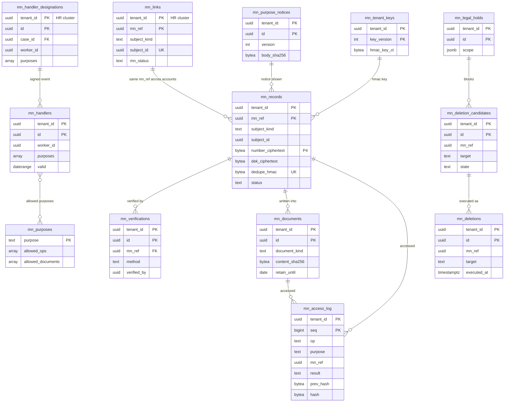

# Data model: マイナンバーの保管庫

保管庫（vault-prod のアカウントの専用の Aurora）の表と、人事の側の参照の表。振る舞いは [my-number-vault.md](../my-number-vault.md)、決定は [ADR-0005](../../decisions/0005-security-and-my-number.md)、[ADR-0045](../../decisions/0045-my-number-collection-and-identity-verification.md)〜[ADR-0047](../../decisions/0047-my-number-retention-and-deletion.md)、[ADR-0053](../../decisions/0053-operator-access-and-vault-break-glass.md)、[ADR-0054](../../decisions/0054-accounts-network-and-vault-boundary.md)。規約は [data-model.md](../data-model.md) の 3 節。

- **P4（個人番号、番号の一部、番号を書いた書類、本人確認の画像）は、保管庫の表と保管庫の S3 だけに置く。** 人事の側には `mn_ref` と状態と書類の ID だけ（[data-model.md](../data-model.md) の 3.9 節）。
- 保管庫の Aurora も `tenant_id` と FORCE RLS（ロール `vault_app`）。例外は `mn_purposes` だけ。人事の Aurora との間に DB の外部キーはない（値で対応する）。
- 保管庫のアクセスの記録・削除の記録は番号・番号の一部・HMAC を含まない。
- 保存の値は、どれも確認待ち（L2、L44〜L50）。

## 1. ER 図

## 2. 人事の側（人事の Aurora）

### 2.1 `mn_links`

人・扶養の親族と `mn_ref` の結びと、保管庫の状態の写し。有効日付でない（[data-model.md](../data-model.md) の 6 節の DM-10）。

| 列 | 型 | NULL | 既定 | 説明 |
| --- | --- | --- | --- | --- |
| `tenant_id` | `uuid` | NOT NULL | — | |
| `mn_ref` | `uuid` | NOT NULL | — | 保管庫が作る UUIDv7 |
| `subject_kind` | `text` | NOT NULL | — | `worker`・`dependent` |
| `subject_id` | `uuid` | NOT NULL | — | `workers.id` か `dependents.id` |
| `mn_status` | `text` | NOT NULL | `'none'` | `none`・`registered`・`verified`・`deleted` |
| `status_changed_at` | `timestamptz` | NOT NULL | `now()` | 保管庫で状態が変わった時刻 |
| `vault_change_seq` | `bigint` | NULL | — | 最後に引き取った保管庫の変更の連番（重複の除去） |

- キー：PK `(tenant_id, mn_ref)`。UK `(tenant_id, subject_kind, subject_id)`。
- 更新：人事の側の worker が、保管庫の `status` の操作で「前回の連番より後の変更の一覧」を 1 分ごとに引き取り、`app` のロールで更新する（経路は人事 → 保管庫の片方向だけ。[ADR-0054](../../decisions/0054-accounts-network-and-vault-boundary.md)。[data-model.md](../data-model.md) の 6 節の DM-17）。本人の登録の直後は、保管庫の画面から人事の画面に戻るときにも 1 回引き取る。業務プロセスを通さない（人事の事実ではなく保管庫の写し）。変更は `audit_events` に残す。
- 権限：`worker.personal`（本人は `worker`、扶養は `worker.dependents`）の `view` で「登録済み」などの状態だけを見せる。
- 運用：RLS。保存は主体（人・扶養の親族）と同じ。

### 2.2 `mn_handler_designations`

事務取扱担当者の指定の案件の中身（`mn_handler_designation`）と、保管庫への送信の記録。

| 列 | 型 | NULL | 既定 | 説明 |
| --- | --- | --- | --- | --- |
| `tenant_id` | `uuid` | NOT NULL | — | |
| `id` | `uuid` | NOT NULL | `uuidv7()` | |
| `case_id` | `uuid` | NOT NULL | — | 事務取扱責任者の起票、別の人の承認 |
| `worker_id` | `uuid` | NOT NULL | — | 担当者 |
| `purposes` | `text[]` | NOT NULL | — | `mn_purposes` の値 |
| `valid` | `daterange` | NOT NULL | — | |
| `training_attested_at` | `timestamptz` | NOT NULL | — | 教育の実施の記録 |
| `sent_event_id` | `uuid` | NULL | — | outbox の `mn.handler_designated` |
| `vault_ack_at` | `timestamptz` | NULL | — | 保管庫が `mn_handlers` に書いた応答 |

- キー：PK `(tenant_id, id)`。UK `(tenant_id, case_id)`。
- 運用：RLS。保存は監査ログ。

## 3. 保管庫（vault の Aurora）

### 3.1 `mn_records`

番号の本体（エンベロープ暗号化）。定義元：[my-number-vault.md](../my-number-vault.md) の 5 節。

| 列 | 型 | NULL | 既定 | 説明 |
| --- | --- | --- | --- | --- |
| `tenant_id` | `uuid` | NOT NULL | — | |
| `mn_ref` | `uuid` | NOT NULL | `uuidv7()` | |
| `subject_kind` | `text` | NOT NULL | — | `worker`・`dependent` |
| `subject_id` | `uuid` | NOT NULL | — | 人事の側の ID（人か扶養の親族） |
| `number_ciphertext` | `bytea` | NOT NULL | — | AES-256-GCM。AAD は `tenant_id ‖ mn_ref`。P4 |
| `dek_ciphertext` | `bytea` | NOT NULL | — | レコードごとの DEK を `vault-mn` で包んだもの |
| `key_arn_version` | `text` | NOT NULL | — | 包んだ鍵 |
| `dedupe_hmac` | `bytea` | NOT NULL | — | テナントの HMAC の鍵による番号の HMAC（重複の登録の検知） |
| `hmac_key_version` | `int` | NOT NULL | — | → `mn_tenant_keys` |
| `status` | `text` | NOT NULL | `'registered'` | `registered`・`verified`・`deleted` |
| `purpose_notice_id` | `uuid` | NOT NULL | — | 表示した利用目的の通知のバージョン |
| `registered_at` | `timestamptz` | NOT NULL | `now()` | |
| `verified_at` | `timestamptz` | NULL | — | |
| `verification_id` | `uuid` | NULL | — | → `mn_verifications` |
| `migrated` | `boolean` | NOT NULL | `false` | 移行の記録（現行のシステムで確認済みとテナントが表明） |
| `change_seq` | `bigint` | NOT NULL | — | 状態が変わるたびに振るテナントの中の連番（人事の側の引き取り。`mn_links`） |

- キー：PK `(tenant_id, mn_ref)`。一意：`(tenant_id, dedupe_hmac) WHERE status <> 'deleted'`、`(tenant_id, subject_kind, subject_id) WHERE status <> 'deleted'`。
- CHECK：`status IN (...)`、`status <> 'verified' OR verification_id IS NOT NULL`。
- 削除：`vault_purger` が行を消す（番号の暗号文・包んだ DEK・HMAC を残さない）。`mn_deletions` を先に書く。
- 運用：RLS（`vault_app`）。保存は [my-number-vault.md](../my-number-vault.md) の 10.1 節（最後の法定の事務まで。L2）。
- S1 の量：約 200 万行。

### 3.2 `mn_verifications`

本人確認の記録（方法、書類の種類、確認した人）。定義元：[my-number-vault.md](../my-number-vault.md) の 4.2 節。

| 列 | 型 | NULL | 既定 | 説明 |
| --- | --- | --- | --- | --- |
| `tenant_id` | `uuid` | NOT NULL | — | |
| `id` | `uuid` | NOT NULL | `uuidv7()` | |
| `mn_ref` | `uuid` | NOT NULL | — | |
| `method` | `text` | NOT NULL | — | `mn_card`・`number_doc_and_id_doc`・`id_known_by_employment`・`migrated` |
| `doc_kinds` | `text[]` | NOT NULL | — | |
| `image_keys` | `text[]` | NOT NULL | `'{}'` | S3 の `verification-images/{tenant}/{id}`（30 日で消す。L44） |
| `omission_reason` | `text` | NULL | — | 身元確認の省略の理由（L45） |
| `verified_by` | `uuid` | NOT NULL | — | 事務取扱担当者 |
| `verified_at` | `timestamptz` | NOT NULL | — | |
| `images_deleted_at` | `timestamptz` | NULL | — | |

- キー：PK `(tenant_id, id)`。FK `(tenant_id, mn_ref)` → `mn_records`（本体の削除で `ON DELETE CASCADE`。削除の記録は `mn_deletions`）。
- 運用：RLS。画像の削除は日次のジョブ。

### 3.3 `mn_tenant_keys`

テナントの HMAC の鍵（`vault-hmac` で包む）。[data-model.md](../data-model.md) の 6 節の DM-14 で定義した。定義元：[my-number-vault.md](../my-number-vault.md) の 5 節。

| 列 | 型 | NULL | 既定 | 説明 |
| --- | --- | --- | --- | --- |
| `tenant_id` | `uuid` | NOT NULL | — | |
| `key_version` | `int` | NOT NULL | — | |
| `hmac_key_ct` | `bytea` | NOT NULL | — | 32 バイトの乱数を `vault-hmac` で包んだもの |
| `created_at` | `timestamptz` | NOT NULL | `now()` | |
| `retired_at` | `timestamptz` | NULL | — | |

- キー：PK `(tenant_id, key_version)`。一意 `(tenant_id) WHERE retired_at IS NULL`。
- 運用：RLS。テナントの解約で消す。

### 3.4 `mn_purposes`・`mn_purpose_notices`

目的（システムの表。テナントの外）と、テナントが登録した利用目的の通知の文面のバージョン。定義元：[my-number-vault.md](../my-number-vault.md) の 4.1・6.3 節。

| 表 | 列 | キー |
| --- | --- | --- |
| `mn_purposes` | `purpose text`（`identity_verification`・`withholding_slip`・`salary_payment_report`・`health_pension_notification`・`employment_insurance_notification`・`dependents_declaration`）、`allowed_ops text[]`（`verify`・`reveal`・`generate_document`・`download_document`・`delete`）、`allowed_documents text[]` | PK `(purpose)`。RLS なし（`vault_migrator` だけが書く） |
| `mn_purpose_notices` | `tenant_id`、`id`、`version int`、`body text`、`body_sha256 bytea`、`published_at timestamptz`、`published_by uuid` | PK `(tenant_id, id)`。UK `(tenant_id, version)` |

- 運用：`mn_purpose_notices` は RLS。保存は監査ログ（記録がバージョンを指す）。

### 3.5 `mn_handlers`

事務取扱担当者（期間つきの行）。人事の側の業務プロセスの完了の署名つきの事象でだけ書く。定義元：[my-number-vault.md](../my-number-vault.md) の 6.3 節。

| 列 | 型 | NULL | 既定 | 説明 |
| --- | --- | --- | --- | --- |
| `tenant_id` | `uuid` | NOT NULL | — | |
| `id` | `uuid` | NOT NULL | `uuidv7()` | |
| `worker_id` | `uuid` | NOT NULL | — | 人事の側の人の ID |
| `purposes` | `text[]` | NOT NULL | — | |
| `valid` | `daterange` | NOT NULL | — | |
| `designated_by_case_id` | `uuid` | NOT NULL | — | 人事の側の案件 |
| `approved_by` | `uuid` | NOT NULL | — | |
| `training_attested_at` | `timestamptz` | NOT NULL | — | |
| `event_signature` | `bytea` | NOT NULL | — | 受けた事象の署名（`hr-vault-assertion` の公開鍵で確かめた） |

- キー：PK `(tenant_id, id)`。排他 `(tenant_id =, worker_id =, valid &&)`。
- 判定：操作者が今日有効な行を持ち、その目的を含み、操作が目的の `allowed_ops` にあること。委任では委任した人と実際の操作者の両方。
- 運用：RLS。保存は監査ログ。

### 3.6 `mn_documents`

法定の書類の索引（本体は保管庫の S3）。定義元：[my-number-vault.md](../my-number-vault.md) の 6.4・10 節。

| 列 | 型 | NULL | 既定 | 説明 |
| --- | --- | --- | --- | --- |
| `tenant_id` | `uuid` | NOT NULL | — | |
| `id` | `uuid` | NOT NULL | `uuidv7()` | 人事の側に返す書類の ID |
| `document_kind` | `text` | NOT NULL | — | `si_acquisition`（E11 の 1 種の候補）など。E13 で `withholding_slip` など |
| `purpose` | `text` | NOT NULL | — | |
| `mn_refs` | `uuid[]` | NOT NULL | — | 書類に書いた番号の主体 |
| `source_sha256` | `bytea` | NOT NULL | — | 番号を含まない元のデータのハッシュ |
| `content_sha256` | `bytea` | NOT NULL | — | |
| `s3_key` | `text` | NOT NULL | — | `docs/{tenant}/{document_id}`（`vault-docs` の鍵） |
| `retention_rule_id` | `text` | NOT NULL | — | → `retention_rules`（人事の側の共通の規則表の ID） |
| `retain_until` | `date` | NOT NULL | — | |
| `generated_by` | `uuid` | NOT NULL | — | 担当者（代理の Worker の主張の操作者） |
| `generated_at` | `timestamptz` | NOT NULL | `now()` | |

- キー：PK `(tenant_id, id)`。索引：`(tenant_id, retain_until)` — 削除の候補。GIN `(mn_refs)`。
- 運用：RLS。保存は書類の種類ごと。

### 3.7 `mn_access_log`

アクセスの記録（追記のみ、テナントごとのハッシュの連鎖）。定義元：[my-number-vault.md](../my-number-vault.md) の 8 節、[ADR-0048](../../decisions/0048-audit-log-hash-chain-and-anchoring.md)。

| 列 | 型 | NULL | 既定 | 説明 |
| --- | --- | --- | --- | --- |
| `tenant_id` | `uuid` | NOT NULL | — | |
| `seq` | `bigint` | NOT NULL | — | テナントごとの連番 |
| `id` | `uuid` | NOT NULL | `uuidv7()` | |
| `at` | `timestamptz` | NOT NULL | `clock_timestamp()` | |
| `actor_worker_id` | `uuid` | NULL | — | |
| `on_behalf_of` | `uuid` | NULL | — | |
| `actor_kind` | `text` | NOT NULL | — | `handler`・`employee_self`・`service` |
| `purpose` | `text` | NULL | — | |
| `op` | `text` | NOT NULL | — | `register`・`status`・`verify`・`reveal`・`generate_document`・`download_document`・`delete`・`access_log` |
| `mn_ref` | `uuid` | NULL | — | |
| `document_id` | `uuid` | NULL | — | |
| `result` | `text` | NOT NULL | — | `allowed`・`denied`・`error` |
| `deny_reason` | `text` | NULL | — | |
| `request_id` | `text` | NOT NULL | — | ALB の要求の ID と突き合わせる |
| `source_service` | `text` | NOT NULL | — | |
| `client_ip_prefix` | `inet` | NULL | — | /24 |
| `prev_hash` | `bytea` | NOT NULL | — | |
| `hash` | `bytea` | NOT NULL | — | `SHA-256(prev_hash ‖ 正規の形の行)` |

- キー：PK `(tenant_id, seq)`。UK `(id)`。
- 索引：`(tenant_id, mn_ref, at)`、`(tenant_id, actor_worker_id, at)` — 取扱状況の確認の検索。
- 採番：テナントの最後の行を `FOR UPDATE` で取って `seq + 1`、`prev_hash` を連ねる（操作と同じトランザクション。書けなければ操作ごと失敗）。
- 更新：追記のみ。行を log-archive の `vault-audit/{tenant}/...` へ送り、日次に連鎖を確かめる。
- 運用：RLS。保存は監査ログ。S1 の量：1 日 数千〜数万行。

### 3.8 `mn_deletion_candidates`・`mn_deletions`・`mn_legal_holds`

削除の候補（日次）、削除の記録（番号を含まない）、保全。定義元：[my-number-vault.md](../my-number-vault.md) の 10 節、[ADR-0047](../../decisions/0047-my-number-retention-and-deletion.md)。

| 表 | 列（`tenant_id`・`id` に加えて） | キー・制約 |
| --- | --- | --- |
| `mn_deletion_candidates` | `mn_ref uuid NULL`、`document_id uuid NULL`、`target text`（`record`・`document`・`verification_images`）、`retention_rule_id text`、`due_on date`（候補から 30 日以内に消す）、`state text`（`open`・`held`・`approved`・`executed`）、`hold_id uuid NULL`、`first_approved_by uuid NULL`、`second_approved_by uuid NULL`、`created_at` | PK `(tenant_id, id)`。一意 `(tenant_id, target, coalesce(mn_ref, document_id)) WHERE state IN ('open','held','approved')`。CHECK `second_approved_by IS NULL OR second_approved_by <> first_approved_by`。索引 `(due_on) WHERE state = 'open'`（30 日の遅れの監視） |
| `mn_deletions` | `mn_ref uuid NULL`、`subject_kind text`、`target text`、`document_kind text NULL`、`retention_rule_id text`、`candidate_id uuid`、`candidate_at timestamptz`、`approved_by uuid`、`second_approved_by uuid`、`executed_at timestamptz`、`backup_expiry_at timestamptz`（実行＋35 日）、`change_seq bigint`（`deleted` の変更として人事の側が引き取る） | PK `(tenant_id, id)`。追記のみ。番号も HMAC も持たない |
| `mn_legal_holds` | `scope jsonb`（テナント全体・人・期間）、`reason text`、`set_by uuid`、`set_at`、`released_by uuid NULL`、`released_at NULL` | PK `(tenant_id, id)` |

- 削除の証明（期間の中の `mn_deletions` の一覧の PDF）をテナントに出せる。バックアップの中の暗号文が 35 日残る扱いは L48。
- 運用：RLS。保存は監査ログ。

### 3.9 `mn_assertion_nonces`

操作者の主張（JWT）の `jti` の 1 回限りの確認。[data-model.md](../data-model.md) の 6 節の DM-14 で定義した。保管庫は Valkey を持たないので DB に置く。

| 列 | 型 | NULL | 既定 | 説明 |
| --- | --- | --- | --- | --- |
| `jti` | `uuid` | NOT NULL | — | |
| `tenant_id` | `uuid` | NOT NULL | — | |
| `expires_at` | `timestamptz` | NOT NULL | — | 主張の期限（60 秒）＋時計のずれの余裕 |

- キー：PK `(tenant_id, jti)`。索引：`(expires_at)` — 1 分ごとの削除。
- 運用：RLS。保存しない（期限の後に消す）。
