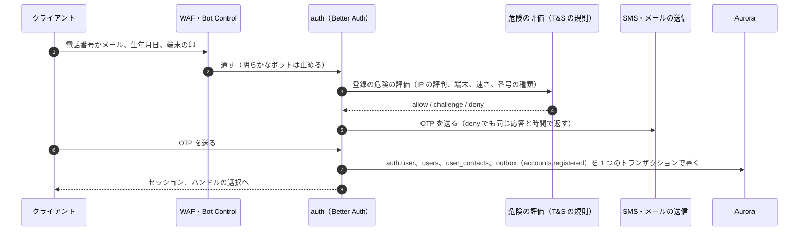
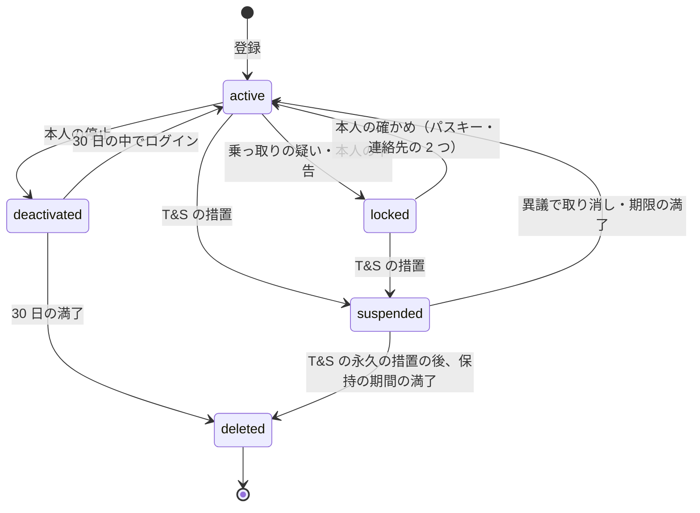

# Accounts and Auth: X

登録（電話番号・メールの確認）、ログイン（パスキー、OTP、Google・Apple）、セッション、ハンドル、アカウントの状態（鍵、凍結、停止の猶予、削除）、年齢の扱いの枠組み、ログインの記録、第三者のアプリの認可の画面を決める。認証の部品は、Linear の題材と同じく Better Auth を `packages/auth` で包んで使う（[ADR-0001](../decisions/0001-platform-and-stack.md)）。

| ADR | 決定 |
| --- | --- |
| [0043](../decisions/0043-auth-methods-and-sessions.md) | 認証は Better Auth を `packages/auth` で包む。パスワードを持たず、パスキー・電話番号の OTP・メールの OTP・Google・Apple でログインする。登録には電話番号かメールの確認を必須にし、電話の確認がないアカウントは上限を下げる。Web は HttpOnly のクッキー、アプリは端末の安全な保存に置く不透明なトークン。セッションの写しを Valkey に置き、取り消しは 5 秒以内に全入口へ効かせる |
| [0044](../decisions/0044-account-states-deletion-and-age.md) | アカウントの状態を `active`・`locked`・`suspended`・`deactivated`・`deleted` の 5 つにし、状態の遷移は Accounts だけが outbox を通して行う。停止は 30 日の猶予の後に削除の流れへ入る。ハンドルは削除・変更の後に一定の期間は他人に渡さない。生年月日から年齢の区分を作り、`visible()` には区分だけを渡す。最低の年齢と確かめの方法は法務の L5 の後に設定で入れる |

前提は、テナントが 1 つで本人だけの表を FORCE RLS で守ること（[ADR-0004](../decisions/0004-single-tenant-and-visibility.md)）、利用者の ID が `tid` であること（[ADR-0002](../decisions/0002-post-ids-and-ordering.md)）、変更を outbox から流すこと（[ADR-0005](../decisions/0005-event-log-and-outbox.md)）。

## 1. 目的と範囲

- 扱う：
  - 登録と、電話番号・メールアドレスの確認
  - ログインの手段（パスキー、OTP、Google、Apple）と、強いログインの設定
  - セッション（Web とアプリ）、端末の一覧、取り消し
  - ハンドル（`@name`）の規則と変更
  - アカウントの状態（鍵アカウントの切り替え、`locked`、`suspended`、`deactivated`、`deleted`）
  - 年齢の扱いの枠組み（法務の L5）
  - ログインの記録（発信者情報の開示に使う。法務の L2）
  - 第三者のアプリの認可の画面と、認可したアプリの一覧
- 扱わない：
  - 公開 API のトークンの形、範囲、レート制限（[api-and-rate-limits.md](api-and-rate-limits.md)）
  - スパムの判定と、登録の時の危険の評価の規則（[trust-and-safety.md](trust-and-safety.md)）。ここは判定の結果を受ける口だけを持つ
  - 乗っ取りへの対応の全体（[security.md](security.md) の 8 節）。ここは仕組み（`locked`、連絡先の変更の保留）を持つ
  - プロフィールの画面の描画（[clients.md](clients.md)）
  - 削除の後始末の全体（[security.md](security.md) の 7 節）

### 1.1 関わる非機能要件

| NFR | この領域での意味 |
| --- | --- |
| NFR-004 | ログインとセッションの確かめは、タイムラインの読み出しの前に通る。確かめが落ちると読み出しの可用性（99.95%）を下げる。確かめは Valkey の写しで行い、Accounts が落ちても既存のセッションは使える（9 節） |
| NFR-005 | 登録・状態の変更は確定を返したら失わない |
| NFR-009 | 鍵アカウントの切り替え、`suspended`・`deactivated` は、`visible()` を通して 60 秒以内に全経路に効く |
| NFR-011 | 登録の確認と、電話の確認がないアカウントの上限の引き下げで、スパムのアカウントを減らす |

## 2. 本家の形と、使う部品（確かめたこと）

### 2.1 本家

| 項目 | 内容 | 出典 |
| --- | --- | --- |
| 登録 | 電話番号かメールアドレスで登録し、確認のコードを受ける | **未検証**（help.x.com は 403） |
| ログイン | パスワード、Google・Apple、パスキー | **未検証**（同上） |
| 停止 | 停止（deactivate）の後 30 日で削除される。期間の中にログインすると戻る | **未検証**（同上） |
| 上限 | 投稿 1 日 2,400 件など | [intent.md](../intent.md) の出典（検索結果の抜粋） |

- 本家のヘルプセンターは、確認の時点で取得が 403 になった（[architecture/README.md](README.md) の 1.3 節）。この節の本家の振る舞いは参考にとどめ、本システムの値は下で独自に決める。

### 2.2 Better Auth

いずれも 2026-10-04 に確認。

| 項目 | 内容 | 出典 |
| --- | --- | --- |
| 電話番号の OTP | 6 桁、既定 300 秒、試行 3 回。超えるとコードを無効にして 403 を返す。`signUpOnVerification` で確認と同時にアカウントを作れる | [Phone Number](https://www.better-auth.com/docs/plugins/phone-number) |
| Apple | `socialProviders` で使える。iOS のネイティブの ID トークンでのログインは、アプリのバンドル ID を `appBundleIdentifier` に渡す。クライアントの秘密の JWT は 6 か月より先の期限を Apple が拒むので、180 日で作り直す | [Apple](https://www.better-auth.com/docs/authentication/apple) |
| メールの OTP、パスキー、セッション、複数のセッション | Linear の題材で確かめた内容を引き継ぐ（[Linear の accounts-and-auth.md](../../../linear/docs/architecture/accounts-and-auth.md) の 2.2 節） | 同左 |

### 2.3 ストアの規則

| 規則 | 内容 | 出典 |
| --- | --- | --- |
| App Store 4.8 | 第三者・ソーシャルのログインで主のアカウントを作る・認証するアプリは、同等の別のログインの手段（名前とメールだけを集め、メールを隠せるもの）も出す | [App Review Guidelines](https://developer.apple.com/app-store/review/guidelines/)（2026-10-04 に確認） |
| App Store 5.1.1(v) | アカウントを作れるアプリは、アプリの中でアカウントの削除もできるようにする | 同上 |

- Google でのログインを出すので、Apple でのログインも出す（4.8）。アカウントの削除の入口をアプリの中に置く（5.1.1(v)、6 節）。

## 3. 部品の使い方

ADR-0043。

| 部品 | 使うか | 理由 |
| --- | --- | --- |
| 核（アカウント、セッション） | 使う | — |
| `phone-number` | 使う | 電話番号の OTP での登録とログイン |
| `email-otp` | 使う | メールの OTP での登録とログイン。1 通に 6 桁のコードと、同じコードを URL のフラグメントに入れたリンク（Linear と同じ） |
| `@better-auth/passkey` | 使う | パスキー |
| Google、Apple（`socialProviders`） | 使う | Web はリダイレクト、アプリはネイティブの ID トークン |
| `multi-session` | 使う | 1 つの端末で複数のアカウントを切り替える（1 端末 5 つまで） |
| パスワード（`emailAndPassword`） | **使わない** | 使い回しのパスワードによる乗っ取り（クレデンシャルスタッフィング）の入口をなくす |
| OAuth の提供者の部品 | 使わない | 第三者のアプリの OAuth は Public API の中に小さく持つ（[api-and-rate-limits.md](api-and-rate-limits.md) の 4 節） |
| 組織（organization） | 使わない | この題材に組織はない |

- `auth` のサービスは Hono の上に Better Auth を載せ、`https://<brand>.<domain>/api/auth/*` で受ける。表は Aurora の `auth` スキーマ。他のサービスは `auth` スキーマを読まない。
- Better Auth の型と関数を `packages/auth` の外から直接使わない（lint）。版は固定し、patch だけを自動で上げる。High 以上の告知は 7 日以内に上げるか回避を入れる（[security.md](security.md) の 10 節）。
- 利用者の ID は `tid`（ADR-0002）。Better Auth の `user.id` に、登録の時に `packages/tid` で振った 10 進の文字列を渡す（生成の関数を設定で差し替える）。`auth.user.id` と `users.id`（公開の利用者の表）は同じ値にする。

## 4. 登録

### 4.1 流れ

- 登録で集めるもの：電話番号かメールアドレス（どちらか必須）、表示名、生年月日（7 節）、ハンドル（後で選んでもよい。選ぶまでは仮のハンドル `u<tid の下 10 桁>`）。
- 確認が済むまで、アカウントの行を作らない（`signUpOnVerification`）。確認の前の入力は `verification` の行にだけ持ち、10 分で消える。
- 危険の評価が `challenge` のときは、もう一方の連絡先の確認か、パスキーの登録を足す。`deny` のときも、応答の形と時間を `allow` と同じにし、OTP を送らない（連絡先の有無と、評価の結果を明かさない）。評価の規則は [trust-and-safety.md](trust-and-safety.md)。

### 4.2 電話番号

- 形は E.164 に正規化する。MVP では日本の番号（`+81`）だけを受ける。SMS の不正な大量送信（送信料の詐取）の的を狭めるため。海外の番号は S3 で検討する（[intent.md](../intent.md) の MVP の後）。
- 1 つの電話番号を確認済みにできるアカウントは 5 つまで（`policy.phone.max_accounts`）。凍結（`suspended`）のアカウントも数に入れる。
- 電話の確認がないアカウント（メールだけで登録）は、投稿・フォロー・DM の上限を下げる（[api-and-rate-limits.md](api-and-rate-limits.md) の 5.3 節の `unverified` の段）。電話を後で確かめれば、すぐ通常の段に上がる。
- 保存：`user_contacts` に、暗号文（`pii` の鍵の封筒の暗号化）と、検索用の HMAC（`contact_hmac`）を持つ。平文の列を持たない（[security.md](security.md) の 5 節）。

### 4.3 メールアドレス

- 小文字に正規化して保存する。`+` の後の部分は消さない（本人の意図を変えない）。重複の判定は正規化の後の HMAC で行い、1 つのメールアドレスは 1 アカウントだけ。
- 使い捨てのメールのドメインは、T&S の規則で拒む（[ADR-0040](../decisions/0040-spam-and-bot-defense.md)、[trust-and-safety.md](trust-and-safety.md)）。Accounts は一覧を持たず、危険の評価の結果（`deny`）として受ける。

### 4.4 OTP の値

| 項目 | 電話 | メール |
| --- | --- | --- |
| 桁 | 6 | 6 |
| 期限 | 5 分（Better Auth の既定） | 10 分（届きの遅れに備える） |
| 試行 | 3 回。超えたら新しいコード | 同左 |
| 保存 | ハッシュ | ハッシュ |
| 送信の上限（連絡先ごと） | 1 時間に 3 回、1 日に 10 回 | 1 時間に 5 回 |
| 送信の上限（IP ごと） | 1 時間に 20 回 | 1 時間に 30 回 |
| 送信の上限（全体） | `ops.auth.sms_per_minute`（S1 の既定 3,000/分） | — |

- 送信の上限は、WAF の規則と、`auth` の中の Valkey の桶（[api-and-rate-limits.md](api-and-rate-limits.md) の 5 節の `auth.*` の方針）の両方で数える。Valkey が落ちているとき、SMS の送信は **止める**（失敗を返す）。送信料の詐取を防ぐため、ここだけは開いたままにしない。
- SMS の送信事業者は 2 社を持ち、片方が落ちたら他方へ切り替える（`ops.auth.sms_provider`）。送信事業者は外国にある第三者に当たりうる（法務の L4）。

## 5. ログイン

### 5.1 手段

| 手段 | 流れ | 備考 |
| --- | --- | --- |
| パスキー | 条件付きの UI（自動入力）。`rpID` は `<brand>.<domain>`。アプリはプラットフォームのパスキーの API（関連するドメインの設定） | 推奨の手段。登録の直後と、ログインの 3 回目に登録を勧める |
| 電話の OTP | 4.4 節 | — |
| メールの OTP | 4.4 節。リンクは URL のフラグメントに置き、押すボタンを挟む | — |
| Google | OIDC。`email_verified` が真のときだけ、同じメールのアカウントに結ぶ | 範囲は `openid email profile` |
| Apple | Web はリダイレクト、iOS はネイティブの ID トークン。メールを隠す中継のアドレスもそのまま使う | 2.3 節 |

### 5.2 結び付け

DT-AUTH-001：ログインの手段の識別子が、どのアカウントになるか。上から評価し、最初に当たった行。

| # | 条件 | 結果 |
| --- | --- | --- |
| 1 | その識別子（Google・Apple の `sub`、パスキーの ID、確認済みの電話・メール）が既にアカウントに結ばれている | そのアカウント（状態の判定は 6 節） |
| 2 | Google・Apple で、`email_verified` が偽 | 拒否 |
| 3 | 同じメールアドレスのアカウントがあり、そのアカウントが `strong_login`（5.3 節） | 拒否。「パスキーでログインしてから、設定で結んでください」 |
| 4 | 同じメールアドレスのアカウントがある | 結び、結んだことを既存の全連絡先に知らせる |
| 5 | それ以外 | 登録の流れ（4 節）へ。生年月日を聞く |

### 5.3 強いログイン

- 設定 `login_policy`：`standard`（どの手段でもよい）と `strong`（パスキーだけ。OTP と Google・Apple ではログインできない）。
- `strong` にするには、パスキーを 2 つ以上（別の端末）登録していることを求める。1 つを失っても締め出されないため。
- 報道機関・自治体・企業の公式のアカウントには `strong` を勧める（乗っ取りの影響が大きい。[security.md](security.md) の 8 節）。

### 5.4 重い操作の確かめ

次の操作は、10 分以内のログイン（`freshAge`）か、その場のパスキー・OTP の確かめを求める。

- 連絡先（電話・メール）の追加・変更・削除、パスキーの追加・削除、`login_policy` の変更
- ハンドルの変更、停止（`deactivated`）、データの書き出し
- 第三者のアプリへの `dm.*` の範囲の認可

連絡先の変更は、6.3 節の保留を通す。

## 6. セッション

ADR-0043。

### 6.1 形

| 入口 | 持ち方 | 期限 |
| --- | --- | --- |
| Web | クッキー `<brand>_sess`（HttpOnly、Secure、`SameSite=Lax`、`Domain=<brand>.<domain>`） | 使わないまま 30 日で切れる。`updateAge` 1 日 |
| アプリ（iOS・Android） | 不透明なトークン（`<brand>_ses_` ＋ base62 の乱数 32 文字 ＋ チェックサム 6 文字）。`Authorization: Bearer`。iOS は Keychain、Android は Keystore（`expo-secure-store`） | 使わないまま 90 日で切れる。`updateAge` 1 日 |
| Realtime Gateway（WebSocket） | 接続の時にセッションを確かめ、`session_id` を接続に結ぶ | セッションと同じ |

- アプリのセッションを長くするのは、スマートフォンで毎回ログインを求めないため。絶対の期限は置かない。代わりに、端末の一覧と取り消し、乗っ取りの検出（[security.md](security.md) の 8 節）で抑える。
- セッションのトークンは SHA-256 のハッシュで保存する。
- CSRF：状態を変える Web の要求は、`Origin` が `https://<brand>.<domain>` であることを確かめる。

### 6.2 確かめと写し

- `auth` は、セッションの有効を Valkey（`vk-edge` のクラスタ。[infrastructure.md](infrastructure.md) の 5 節）に写す。キーはトークンの SHA-256、値は `(user_id, session_id, state, age_band, flags)`、TTL 10 分。
- App API・Public API・Gateway は写しを読む。なければ `auth` の内部の API（`POST /internal/session/verify`）に聞き、写しを作る。
- 写しには、アカウントの状態（`active`・`locked` など）と年齢の区分を入れる。`visible()` の `ViewerContext` を組むときに、ここから読む（ADR-0004）。

### 6.3 取り消しと、連絡先の変更の保留

- 取り消し：端末の一覧から個別・全部。アカウントの状態の変更（`locked`・`suspended`・`deactivated`）でも全部を取り消す。
- `auth` は取り消しを、Valkey の写しを消し、`sess:revoked` のチャンネル（sharded pub/sub）に流す。Gateway は受けたら該当の接続を切る。目標は **取り消しから 5 秒以内に全入口で使えない**。pub/sub を取りこぼしても、写しの TTL（10 分）で必ず切れる。
- **連絡先の変更の保留**：電話・メールの変更は、新しい連絡先の確認の後、**48 時間の保留** に入る。保留の間は、古い連絡先へ「取り消す」のリンクを送り、古い連絡先からの取り消しで変更を戻し、全セッションを取り消して `locked` にする。保留の間、新しい連絡先ではログインできない。パスキーで確かめた変更は、保留を 24 時間に縮める。乗っ取りの後に連絡先を奪われる経路を塞ぐため（[security.md](security.md) の 8 節）。

### 6.4 ログインの記録

- `login_events`（本人だけの表。RLS）：`(id, owner_id, session_id, method, ip_ct, port_ct, ua_hash, country, asn, created_at)`。IP アドレスとポートは暗号文（`pii-logs` の鍵）。
- 発信者情報の開示（法務の L2）に使う。**何を何日持つかは法務の L2・L8 の確認待ち**。それまでは、保持の期間を設定の値（`retention.login_events`）で持ち、値を決めるまで本番で消さない（[security.md](security.md) の 7 節の「消さない」の既定）。
- 本人には、端末の一覧に、国・おおよその地域・端末の種類・最後に使った時刻を出す。IP アドレスそのものは出さない。
- 開示の請求への対応で読むのは T&S の `ts_reader` のロールで、案件の ID を必ず記録する（[security.md](security.md) の 6 節）。

## 7. ハンドルとプロフィール

- ハンドル：英数字と `_`、4〜15 文字。大文字と小文字を区別しないで一意（`lower(handle)` の一意の索引）。予約語（`settings`、`api`、`home` など、URL の第 1 の段と重なる語）と、運営のアカウントに紛らわしい語は使えない（一覧は設定で持つ）。
- 変更：1 日 2 回まで。古いハンドルは **30 日** 他人に渡さない（`handle_holds`）。その間、元の持ち主は戻せる。古いハンドルの URL は転送しない（なりすましの踏み台にしない）。
- 削除（`deleted`）のアカウントのハンドルは **90 日** 他人に渡さない。凍結（`suspended`）の間はハンドルを保つ。
- 表示名・自己紹介・アイコン・ヘッダーの画像は `profiles` の行。画像は Media のアップロードを使う（[media.md](media.md)）。

## 8. アカウントの状態

ADR-0044。

### 8.1 状態

| 状態 | 本人 | 他人からの見え方（`visible()`） | セッション |
| --- | --- | --- | --- |
| `active` | 通常 | 通常（鍵アカウントは `protected` の印で別に判定） | 有効 |
| `locked` | ログインはできるが、確かめを済ませるまで読み出しだけ | 通常 | 状態に入る時に全部を取り消す |
| `suspended` | ログインして、措置と異議の画面だけを見られる | 投稿とプロフィールを隠す（措置の範囲は T&S が決める） | 全部を取り消し、新しいセッションは制限つき |
| `deactivated` | ログインすると戻すかを聞く | プロフィールと投稿を隠す。数（フォロワーなど）からも外す | 全部を取り消す |
| `deleted` | なし | 隠す。行は墓石（tombstone）で残し、中身は消す | なし |

- **鍵アカウント** は状態ではなく、`users.protected` の印である。切り替えは Accounts が outbox（`accounts.protected_changed`）に書き、閲覧者の集合の写しを無効にする。切り替えの直後から、承認のない人には `visible()` が `hide` を返す（[follow-graph.md](follow-graph.md)、[quality.md](../quality.md) の 2.2.1 節）。
- 状態の遷移は Accounts のサービスだけが書く。`users.state` の更新と outbox（`accounts.state_changed`）を同じトランザクションで書き、写し・検索・通知・カウンターは出来事で後始末する。`visible()` は `PostState` の作者の状態を見るので、後始末の前でも隠れる（NFR-009）。
- T&S の措置（`suspended`）は、`moderation_actions` に根拠を書いてから、Accounts の内部の API を呼んで状態を変える（[trust-and-safety.md](trust-and-safety.md)）。

### 8.2 停止と削除

- 停止（`deactivated`）：本人が重い操作の確かめ（5.4 節）の後に行う。アプリの中に入口を置く（App Store 5.1.1(v)）。
- 猶予：**30 日**（`policy.deactivation_grace_days`）。中にログインし、戻すを選ぶと `active` に戻る。戻した時、写しと検索の索引は出来事で戻す。
- 30 日の満了で、Accounts のジョブが `deleted` に変え、削除の流れ（[security.md](security.md) の 7.2 節）を始める。
- 法的な保全（開示・捜査の保全の要請）がかかっているアカウントは、猶予の満了でも中身を消さない（`legal_holds`。[security.md](security.md) の 7.3 節）。本人の画面上は削除済みとして扱う。
- 凍結の最中に本人が停止しても、凍結の記録は保つ（措置の回避に使わせない）。

## 9. 年齢の扱い（法務の確認待ち：L5）

ADR-0044。**最低の年齢、確かめの方法、未成年への制限の中身は法務の L5 の確認待ち**。設計は、どの結論にも合う枠組みだけを置く。

- 登録で生年月日を集める（必須）。保存は暗号文（`pii` の鍵）で、平文の生年月日を他のサービスに渡さない。
- 年齢の区分 `age_band` を Accounts が計算する：`under_min`・`minor`・`adult`。境の年齢は設定の値（`policy.age.min`・`policy.age.adult`）で、L5 の後に入れる。値が未設定のうちは、登録の Story の spec を承認しない（[roadmap.md](../roadmap.md) の E2）。
- `under_min`：登録を拒む。入力した生年月日は保存しない。同じ端末からの再試行を 24 時間止める（端末の印）。
- `minor`：`ViewerContext` の年齢の区分として `visible()` に渡す（ADR-0004）。センシティブなメディアの既定、DM の申請の受け方、おすすめに使う特徴の制限は、L5 の後に [trust-and-safety.md](trust-and-safety.md)・[direct-messages.md](direct-messages.md)・[ranking-and-recommendation.md](ranking-and-recommendation.md) で決める。
- 区分は誕生日で変わるので、毎日のジョブで `age_band` を計算し直し、変わった利用者に出来事（`accounts.age_band_changed`）を流す。
- 年齢の確かめ（本人確認の書類、外部の確かめの事業者）は、L5 で必要になったら部品を選ぶ。確かめの結果は `age_verified_at` と方法だけを持ち、書類の画像を持たない設計を第一にする。

## 10. 第三者のアプリの認可の画面

- 画面は `https://<brand>.<domain>/i/oauth/authorize`。セッションで本人を確かめ、アプリの名前・開発者・求める範囲を出す。トークンの発行は Public API（[api-and-rate-limits.md](api-and-rate-limits.md) の 4 節）。
- `dm.*` の範囲を求めるアプリは、5.4 節の確かめを求め、画面で「このアプリはあなたの DM を読めます」と別に示す。
- 設定に「認可したアプリ」の一覧を置き、個別に取り消せる。取り消しはトークンの一式を無効にし、Public API の写しを 5 秒以内に消す（6.3 節と同じ仕組み）。
- `locked`・`suspended`・`deactivated` に入ると、そのアカウントのアプリのトークンも全部を取り消す。

## 11. 障害のときの振る舞い

| 障害 | 振る舞い |
| --- | --- |
| `auth` のタスクが落ちる | 既存のセッションは Valkey の写しで確かめ続ける。写しのない要求は、`auth` が戻るまで 503。登録とログインは止まる |
| Valkey（`vk-edge`）が落ちる | セッションの確かめは `auth` の内部の API へ回り、`auth` は Aurora の reader を読む。負荷が上がるので、`auth` を 3 倍まで広げる（[capacity.md](capacity.md) の 4 節）。SMS の送信は止める（4.4 節） |
| SMS の送信事業者が落ちる | もう 1 社へ切り替える。両方が落ちたら、電話の OTP を止め、メール・パスキーを案内する |
| Aurora の writer のフェイルオーバー | 登録と状態の変更は数十秒失敗する。ログインは既存のアカウントなら reader で読めるが、セッションの書き込みが要るので失敗する。クライアントは再試行する |
| 大阪への切り替え | `auth` スキーマは Global Database で大阪にある。写しは空から作る。SMS の送信事業者の設定は大阪にも持つ（[infrastructure.md](infrastructure.md) の 7 節） |

## 12. data-model への項目

| 表・置き場所 | 中身 | 種類 |
| --- | --- | --- |
| `auth.user`・`auth.session`・`auth.account`・`auth.verification`・`auth.passkey` | Better Auth の表。`auth` スキーマ、`auth` のロールだけ | RLS の外 |
| `users` | `id`（`tid`）、`handle`、`state`、`protected`、`login_policy`、`age_band`、`created_at`、`state_changed_at` | 公開の表 |
| `profiles` | 表示名、自己紹介、アイコン・ヘッダーのメディアの ID、場所、URL | 公開の表 |
| `user_contacts` | `(user_id, kind, value_ct, contact_hmac, verified_at, pending_until)` | 本人だけの表（RLS） |
| `user_birthdates` | `(user_id, birthdate_ct)` | 本人だけの表（RLS）。Accounts だけが読む |
| `handle_holds` | `(handle_lower, user_id, reason, until)` | 公開の表（書くのは Accounts だけ） |
| `login_events` | 6.4 節 | 本人だけの表（RLS）。保持は法務の L2・L8 |
| `account_state_history` | 状態の遷移の記録（理由、主体、措置の ID） | 運用の表 |
| Valkey `sess:{sha256}` | セッションの写し（TTL 10 分） | 写し |
| Valkey `sess:revoked` | 取り消しの知らせ（sharded pub/sub） | — |

- `users.id`・`auth.user.id` は `tid`。その他（`session`、`login_events`、`account_state_history`）は UUIDv7（ADR-0002 の表）。

## 13. テスト

| 種類 | 対象 |
| --- | --- |
| 表駆動 | DT-AUTH-001（結び付け）、DT-AUTH-002（状態 × 操作 × 入口の可否。8.1 節の表を spec の決定表にする）、年齢の区分の境（L5 の値を入れた後） |
| 性質 | PROP-AUTH-001：任意の取り消し・状態の変更・pub/sub の取りこぼしの列の後、取り消したセッションは 10 分（写しの TTL）を超えて使えない。PROP-AUTH-002：任意の連絡先の変更と取り消しの列で、保留の間は古い連絡先からの取り消しが必ず勝つ |
| 結合 | 登録で `auth.user`・`users`・outbox が 1 つのトランザクションで書かれる（途中の失敗で何も残らない）。鍵の切り替えの後、承認のない人の全経路の読み出しで投稿が出ない（[quality.md](../quality.md) の 2.2.1 節の行） |
| E2E | 電話・メールの登録、パスキーの登録とログイン、Apple（iOS）、停止と 30 日の中での戻し（仮想の時計）、アプリの中のアカウントの削除の入口 |
| 負荷 | OTP の送信の上限が攻撃の形（多数の IP、多数の番号）で効く。セッションの確かめが Valkey の喪失で `auth` に回っても NFR-003 を保つ |
| セキュリティ | 連絡先の有無を応答の形と時間で明かさない（時間の差の統計の試験）。OTP の総当たりが 3 回で止まる |

## 14. Story の候補

| Epic | Story | 中身 |
| --- | --- | --- |
| E2 | `auth-signup-login` | 3〜5 節。法務：L5（年齢の境の値） |
| E2 | `sessions-and-devices` | 6 節。ログインの記録の保持は法務：L2 |
| E2 | `contact-change-hold` | 6.3 節の保留と取り消しのリンク |
| E2 | `profile-and-handle` | 7 節 |
| E2 | `protected-account` | 8.1 節の鍵アカウントの切り替え |
| E2 | `account-states` | 8 節の状態と遷移、`deactivated` の猶予 |
| E2 | `age-band` | 9 節の枠組み。法務：L5 |
| E13 | `oauth-consent-screen` | 10 節（api-and-rate-limits の `oauth-apps` と共同） |
| E14 | `account-deletion-pipeline` | 8.2 節から security の 7.2 節へ（security の `data-lifecycle` と共同）。法務：L8 |

## 15. 未解決の問い

### 決定

2026-10-04 の既定案。E2 と E14 で覆りうる。

- **パスワードを持たない**（ADR-0043）。パスキー、OTP、Google・Apple。
- **登録には電話かメールの確認が必須**。電話の確認がないアカウントは上限を下げる。MVP の電話番号は日本だけ。
- **セッション**：Web 30 日、アプリ 90 日（使わないまま）。取り消しは 5 秒以内。
- **連絡先の変更は 48 時間の保留**。
- **停止の猶予は 30 日**、ハンドルは変更の後 30 日・削除の後 90 日保つ（ADR-0044）。

### 持ち越し

| 問い | いつ・どう決めるか |
| --- | --- |
| 最低の年齢、確かめの方法、未成年の制限（L5） | 法務の確認。E2 の `age-band` の spec の承認の前 |
| ログインの記録の項目と保持の日数（L2・L8） | 法務の確認。E2 の `sessions-and-devices` |
| SMS の送信事業者と、外国にある第三者への提供の扱い（L4） | 法務の確認と選定。E2 の前 |
| 1 つの電話番号のアカウントの上限（5） | E11 のスパムの計測で見直す |
| 海外の電話番号 | S3 の海外の拡大の時 |
| パスキーだけの登録（連絡先なし） | 回復の手段がなくなるので MVP では許さない。利用の様子を見て再検討 |

## 16. quality.md・runbooks への項目

### quality.md

- E2 の合否基準に、DT-AUTH-001・002 の全行と PROP-AUTH-001・002 を足す。
- 漏れの経路の表に「アカウントの状態の変更（停止・凍結）の直後」の主体を足すことを提案する（鍵の切り替えと同じ扱い）。

### runbooks

- `sms-abuse.md`：SMS の送信の急増（`ops.auth.sms_per_minute` を下げる、送信事業者の切り替え）。`spam-wave.md` から参照する。
- `account-takeover.md`：[security.md](security.md) の 8 節の手順。

## 出典

いずれも 2026-10-04 に確認。

- Better Auth, [Phone Number](https://www.better-auth.com/docs/plugins/phone-number)、[Apple](https://www.better-auth.com/docs/authentication/apple)
- Apple, [App Review Guidelines](https://developer.apple.com/app-store/review/guidelines/)（4.8、5.1.1(v)）
- 他の Better Auth の事実は Linear の題材の accounts-and-auth.md の出典に従う。
