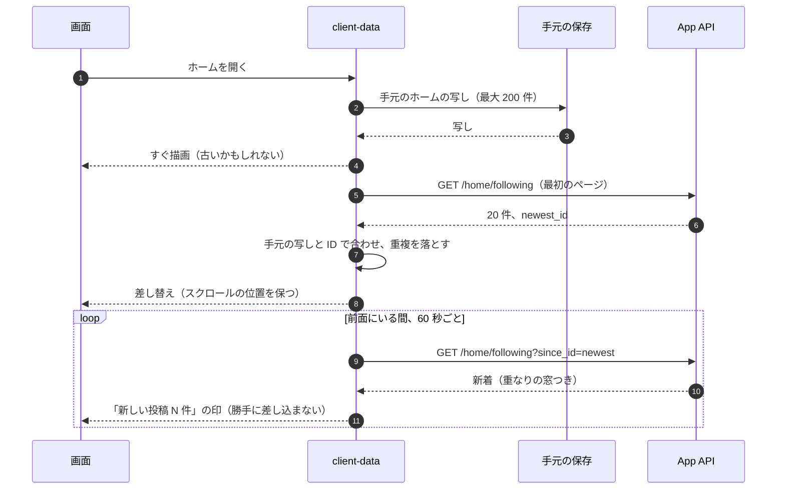

# Clients: X

Web（React の SPA と PWA）と iOS・Android（React Native、Expo）のクライアントを決める。共通のパッケージ、データの層と手元の保存（タイムラインのオフラインの写し）、タイムラインの描画と先読み、投稿の作成（日本語の入力、文字数、オフラインの送信）、閲覧の出来事の送り方、プッシュ通知と深いリンク、公開の URL の HTML、アクセシビリティ。アプリの配布と最低のバージョンは [delivery.md](delivery.md) にある。

| ADR | 決定 |
| --- | --- |
| [0049](../decisions/0049-client-data-layer-and-offline.md) | Web とアプリは、API のクライアント・型・文字数・見える範囲の表示の規則・データの層を同じ TypeScript のパッケージで持つ。データの層は TanStack Query で、ホームの最初の 200 件・プロフィール・下書きを手元に保存する（Web は IndexedDB、アプリは SQLite）。DM の中身は手元に保存しない。オフラインの投稿は手元の送信の待ち行列に入れ、`Idempotency-Key` で二重の作成を防ぐ。公開の投稿・プロフィールの URL は、App API がログインしていない人として `visible()` を通した最小の HTML（OGP）を返す |
| [0050](../decisions/0050-timeline-list-rendering.md) | タイムラインの一覧は、アプリは FlashList、Web は自前の仮想化の一覧で描く。項目の高さの見積もりを投稿の形から計算する。基準の端末で、スクロールの間の落ちたフレームの割合を CI と RUM で測り、決めた基準を 2 回の改善で満たせない画面だけ、ネイティブの一覧の部品に置き換える |

前提は、クライアントを Web と React Native（Expo）にした決定（[ADR-0001](../decisions/0001-platform-and-stack.md)）、ID を文字列で扱うこと（[ADR-0002](../decisions/0002-post-ids-and-ordering.md)）、閲覧の出来事を Ingest に束ねて送ること（[ADR-0005](../decisions/0005-event-log-and-outbox.md)）。

## 1. 目的と範囲

- 扱う：
  - 共通のパッケージと、Web・アプリの構成
  - データの層、手元の保存、オフラインの振る舞い
  - タイムラインの描画、先読み、新着の取り込み
  - 投稿の作成：日本語の入力、文字数、メディアの添付、オフラインの送信
  - 閲覧の出来事の送り方（何を閲覧とするかは [engagement-and-counters.md](engagement-and-counters.md)）
  - プッシュ通知の受け方、深いリンク、ユニバーサルリンク
  - 公開の URL の最小の HTML（リンクのカード、検索エンジン）
  - アクセシビリティ
- 扱わない：
  - アプリのストアの配布、OTA の更新、最低のバージョン（[delivery.md](delivery.md)）
  - プッシュ通知の送信と中身の作り方（[notifications.md](notifications.md)）
  - 端末に残るデータの安全（[security.md](security.md) の 4 節）
  - 画面の見た目を本家にどこまで寄せるか（法務の L10。12 節）

### 1.1 関わる非機能要件

| NFR | この領域での意味 |
| --- | --- |
| NFR-003 | サーバーの p99 300ms に、クライアントの描画を足した体感を RUM で測る。最初のページの描画まで、基準の端末で p75 1.5 秒を目標にする（クライアントの目標。NFR の外） |
| NFR-006 | 閲覧の出来事を束ねて送る（10 秒か 50 件）。送れなかった閲覧は捨ててよい |
| NFR-009 | 手元の写しに残った投稿を、削除・ブロック・措置の後に出し続けない（4.4 節） |
| NFR-013 | 画像のアップロードの前に、端末で大きさを縮める（6.3 節） |

## 2. 構成

### 2.1 パッケージ

| パッケージ | 中身 | 使う側 |
| --- | --- | --- |
| `packages/api-client` | App API の型付きのクライアント（OpenAPI から生成）。ID はブランド型の文字列 | Web、アプリ |
| `packages/text` | 重み付きの文字数、URL の 23、メンション・ハッシュタグの抜き出し（[posts-and-ids.md](posts-and-ids.md)） | Web、アプリ、サーバー |
| `packages/visibility-ui` | `visible()` の結果（`interstitial` の理由）から、警告の表示の文言と操作を決める | Web、アプリ |
| `packages/client-data` | TanStack Query の問い合わせの鍵、正規化した保存（投稿・利用者を ID で 1 つに）、手元の保存の口、送信の待ち行列 | Web、アプリ |
| `packages/i18n` | 文言（日本語が既定、英語） | Web、アプリ |
| `packages/design-tokens` | 色・文字・間隔の値（自前のデザイン。12 節の L10） | Web、アプリ |

- 見える範囲の判定そのもの（`packages/visibility`）はクライアントに置かない。判定はサーバーだけが行う。クライアントは、サーバーが付けた `interstitial` の理由を表示するだけ。

### 2.2 Web

- React の SPA。Vite で作り、ハッシュ付きの資産を CloudFront（S3）で配る。ルーターは型付きのもの（TanStack Router）。
- PWA：Service Worker で殻（HTML・JS・CSS・フォント）を手元に置き、オフラインでも開ける。API の応答は Service Worker で持たない（データの層の手元の保存に任せる。手元の写しを 2 つ持たない）。
- Web のプッシュ（Web Push）は MVP では持たない。ブラウザの通知の許可の画面の悪用が多く、日本の利用はアプリが中心のため。

### 2.3 アプリ（iOS・Android）

- Expo（開発ビルドと `prebuild`）。JS のエンジンは Hermes。画面の移動は Expo Router。
- 主な部品：FlashList（一覧。ADR-0050）、`expo-image`（画像の取り込みと保存）、`expo-sqlite`（手元の保存）、`expo-secure-store`（セッションのトークン）、`expo-notifications`（プッシュのトークン）、`expo-updates`（OTA。[delivery.md](delivery.md) の 5 節）、`expo-video`（動画、HLS）。
- バンドル ID・URL のスキームは `<brand>` で書く（`com.<brand>.app`、`<brand>://`）。リポジトリ共通の ADR-0006。
- 対応する OS：iOS は直近の 2 つの主のバージョン、Android は API 29（Android 10）以上を既定にする。ストアの要求と RUM の分布で毎年見直す。

## 3. データの層

ADR-0049。

### 3.1 問い合わせと正規化

- TanStack Query で、画面ごとの問い合わせ（ホーム、プロフィール、会話、通知、検索）を持つ。応答の投稿・利用者は、ID で 1 つの保存（正規化）に入れ、問い合わせは ID の並びだけを持つ。同じ投稿のいいねの数・状態が、どの画面でも同じになる。
- いいね・リポスト・フォローは、押した時に手元の状態を先に変え（楽観の更新）、失敗したら戻す。数はサーバーの応答の値で置き換える（手元で数を足し引きしたまま残さない）。

### 3.2 ホームの読み出しと新着

- 新着の確かめは `since_id` で行う。サーバーは重なりの窓（10 秒）ぶん戻して返すので、クライアントは ID で重複を落とす（ADR-0002、[api-and-rate-limits.md](api-and-rate-limits.md) の 3.4 節）。
- 新着を勝手に一覧の上に差し込まない。読んでいる位置が動くため。「新しい投稿」の印を押すか、上まで戻ると差し込む。
- おすすめのタイムラインは、毎回サーバーが並べ直すので、手元の写しは「最後に見た 1 ページ」だけを持ち、開いた時に入れ替える。
- 背景から戻ったときは、5 分以上たっていれば、最初のページを取り直す。

### 3.3 先読み

- 一覧の残りが 10 件になったら、次のページを取る（`until_id`）。
- 画像は、画面の 2 枚先の項目まで先に取る（`expo-image` の `prefetch`、Web は `<link rel=preload>` ではなく画像の要素の `loading=lazy` と、近づいたら `decode()`）。動画は画面に入るまで取らない（回線の量を抑える）。
- 回線が遅い（RUM の推定が 3G 相当）か、データの節約の設定のときは、画像を小さいバージョンで取り、先読みを 1 枚にする。

## 4. 手元の保存とオフライン

ADR-0049。

### 4.1 保存するもの

| 中身 | 保存 | 量 | 期限 |
| --- | --- | --- | --- |
| ホーム（フォロー中）の写し | ID の並び ＋ 投稿・利用者の正規化の行 | 最大 200 件 | 7 日 |
| おすすめの最後の 1 ページ | 同上 | 20 件 | 1 日 |
| 自分のプロフィールと投稿 | 同上 | 最新 50 件 | 7 日 |
| 通知の一覧 | 通知の行（中身はサーバーが作った文） | 最新 50 件 | 7 日 |
| 下書き | 本文、添付の手元の参照 | 制限なし | 本人が消すまで |
| 送信の待ち行列 | 4.3 節 | 20 件 | 24 時間 |
| 画像 | `expo-image` のディスクのキャッシュ、Web は HTTP のキャッシュ | 端末の設定（既定 300 MB） | LRU |

- 置き場所：アプリは `expo-sqlite`（アカウントごとに 1 つの DB ファイル）、Web は IndexedDB（アカウントごとに 1 つの DB）。
- **DM の中身は手元に保存しない**（メモリーの中だけ）。DM は本人だけのデータで、共有の端末や、端末の盗難で読まれる危うさが大きい（[security.md](security.md) の 4 節）。通知の一覧に出る DM の通知も「メッセージが届きました」だけにする。
- ログアウトとアカウントの切り替えで、そのアカウントの DB を消す（Web は DB を消し、Service Worker の殻は残す）。

### 4.2 オフラインのときの振る舞い

| 操作 | オフラインのとき |
| --- | --- |
| ホーム・プロフィール・通知を開く | 手元の写しを出し、「オフライン」の帯を出す |
| スクロールで続きを読む | 手元の写しの終わりで止まり、「オフラインです」を出す |
| 投稿 | 送信の待ち行列に入れる（4.3 節） |
| いいね・リポスト・フォロー | 押せない（灰色）。楽観の更新を手元に溜めない。後で送ると、相手の状態が変わっている（削除・ブロック）ことが多く、食い違いの説明が難しいため |
| DM | 読めない、送れない |
| 検索 | 使えない |

### 4.3 オフラインの投稿

- 投稿の作成の時に、クライアントが `Idempotency-Key`（UUIDv7）を作り、待ち行列の行に持つ。送るたびに同じキーを付ける。サーバーは 24 時間の中の同じキーに前の結果を返す（[api-and-rate-limits.md](api-and-rate-limits.md) の 3.5 節、[posts-and-ids.md](posts-and-ids.md)）。
- 回線が戻ったら古い順に送る。メディアの添付は、先にアップロードを済ませてから投稿を送る。
- 待ち行列の行が 24 時間を超えたら送らず、下書きに戻して知らせる（時間がたった投稿を本人の確認なしに出さない）。
- 投稿の `tid` はサーバーが振る（`packages/tid` はサーバーだけ）。待ち行列の間は、手元の仮の ID で画面に出し、確定したら置き換える。

### 4.4 手元の写しと見える範囲

- 手元の写しは、サーバーが返した時点の `visible()` の結果である。その後に削除・ブロック・措置が起きても、オフラインの間は手元に残る。
- 次のどれかで、手元の写しの投稿を消す（NFR-009 の 60 秒は、オンラインの端末に対して守る）：
  - 最初のページを取り直したとき：サーバーの応答にない、写しの中の範囲の投稿を消す（同じ ID の範囲の中で、サーバーが返さなかったものは見えなくなったとみなす）
  - 投稿を開いたとき：サーバーが `not_found` を返したら消す
  - ブロック・ミュートをした直後：その作者の投稿を手元で消す
  - Realtime Gateway から「見えなくなった」の知らせ（`hidden` の出来事。削除・措置の対象の ID の束）を受けたとき：画面と写しから消す。知らせの範囲（全員に流すか、閲覧の記録のある人だけか）は [timeline-fanout.md](timeline-fanout.md) と合わせて決める（12 節の持ち越し）
- オフラインで 7 日を超えた写しは、開かずに消す。

## 5. タイムラインの描画

ADR-0050。

### 5.1 一覧

- アプリ：FlashList。項目の種類（本文だけ、画像 1 枚、画像 2〜4 枚、動画、引用、リポスト、返信の連なり）を `getItemType` で分け、部品を使い回す。
- Web：自前の仮想化の一覧（画面の外の項目を DOM から外す）。`content-visibility` に頼らず、高さの見積もりで位置を決める。
- 高さの見積もり：投稿の本文の重み付きの長さと、メディアの縦横の比（サーバーが返す）から、描画の前に高さを計算する。画像の読み込みで高さが変わらないように、枠を先に取る。
- 本文の中のリンク・メンション・ハッシュタグは、`packages/text` の抜き出しの結果（サーバーが付けた範囲）で描き、クライアントで正規表現を回さない。

### 5.2 滑らかさの基準

- 基準の端末：Android は 4 年前の中位の機種、iOS は直近の 3 つ前の世代の標準の機種（型番は開発リポジトリで固定する）。
- 計測：ホームの 200 件を一定の速さでスクロールし、落ちたフレームの割合（UI のスレッドと JS のスレッドの両方）を測る。CI の固定の端末（[delivery.md](delivery.md) の 2 節）と、RUM（端末の 10% を抜き取り）で見る。
- 基準：落ちたフレーム 1% 以下（p75）、5% 以下（p95）。
- **ネイティブの部品への置き換えの条件**（ADR-0001 の「該当の画面だけネイティブ」）：基準を外した画面に、(1) 項目の部品の軽量化、(2) 画像の取り込みと高さの見積もりの見直し、の 2 回の改善をしても基準を満たせないとき、その画面の一覧だけをネイティブの一覧の部品（Expo の module で包む）にする。置き換えは ADR を足して記録する。

### 5.3 警告と隠す表示

- サーバーが `interstitial`（センシティブなメディア、措置の警告）を付けた投稿は、`packages/visibility-ui` の文言で覆いを出し、押すと見せる。覆いの中のメディアは、押すまで取らない。
- `hide` の投稿はサーバーが返さない（クライアントに届かない）。

## 6. 投稿の作成

### 6.1 日本語の入力と文字数

- 文字数は `packages/text` で数える（サーバーと同じコード。ADR-0001）。残りの数を円の印と数で出す。
- IME の変換の途中（`compositionstart`〜`compositionend`、アプリは `TextInput` の変換の状態）も、変換の中の文字を数に入れる。確定で数が跳ねないようにするため。
- 変換の途中の Enter で送信しない。送信は送信のボタンか、Web の Ctrl／Cmd ＋ Enter だけ。
- 上限を超えた部分は色を変えて示す（切り捨てない）。

### 6.2 下書きと予約

- 下書きは、手元（4.1 節）と、サーバーの本人だけの表（`drafts`）の両方に置く。端末をまたぐときはサーバーの下書きを使う（[posts-and-ids.md](posts-and-ids.md) の 12 節）。予約の投稿は MVP に含めない（[roadmap.md](../roadmap.md) の延期の一覧）。

### 6.3 メディアの添付

- 画像は、端末で長辺 4,096 ピクセル・JPEG の質 85 に縮めてから送る（HEIC は JPEG に変える）。位置の情報（EXIF の GPS）は端末で消してから送る。サーバーでも消す（[media.md](media.md)）。
- 代替のテキスト（ALT）を、添付の直後に入力できる形にする。入力しないで投稿するときに、1 度だけ促す（設定で止められる）。
- 動画は分割して送る（[media.md](media.md) の分割のアップロード）。背景に回っても続ける（アプリはバックグラウンドの送信の仕組み）。

## 7. 閲覧の出来事

- 何を「閲覧」とするか（画面に出た割合と時間）は [engagement-and-counters.md](engagement-and-counters.md) で決める。クライアントは、その規則を `packages/client-data` の 1 か所に実装する。
- 送り方：投稿の ID を束ね、10 秒か 50 件ごとに `POST https://<brand>.<domain>/i/views`（Ingest）へ送る（ADR-0005）。背景に回る時と画面を閉じる時に、残りを送る（Web は `navigator.sendBeacon`）。
- 送れなかった束は、1 回だけ再送し、それでも失敗したら捨てる（閲覧は失ってよい出来事。ADR-0005）。手元に溜め込まない。
- 同じ投稿の閲覧は、同じ画面の表示の中では 1 回だけ送る。

## 8. プッシュ通知と深いリンク

### 8.1 受け方

- 許可を求める時：最初のフォローか、最初の返信を受けた時に、意味を説明してから OS の許可の画面を出す。起動の直後に出さない。
- トークンの登録：`expo-notifications` で APNs・FCM のトークンを得て、App API の通知の端末の登録（[notifications.md](notifications.md)）へ送る。ログアウトで消す。
- 中身：プッシュの本体には、通知の ID と種類だけを入れ、表示の文はアプリが取りに行く形を第一の案にする（iOS は Notification Service Extension、Android は FCM のデータのメッセージ）。取れなければ、汎用の文（「新しい通知があります」）を出す。外国にある第三者（プッシュの事業者）に本文を渡さないため（法務の L4）。最終の形は [notifications.md](notifications.md) で決める。

### 8.2 深いリンク

- ユニバーサルリンク（iOS）と App Links（Android）で `https://<brand>.<domain>/<handle>/posts/<id>` などを開く。関連するドメインのファイル（`apple-app-site-association`、`assetlinks.json`）は CloudFront で配る。
- `<brand>://` のスキームは、OAuth の戻りと、通知からの移動だけに使う。

## 9. 公開の URL の HTML

ADR-0049。

- `https://<brand>.<domain>/<handle>/posts/<id>` と `https://<brand>.<domain>/<handle>` は、CloudFront のビヘイビアで App API の `ssr-lite` の口へ送る（[infrastructure.md](infrastructure.md) の 2.2 節）。
- App API は、**ログインしていない人として `visible()` を判定し**、`show` のときだけ、OGP のメタ（タイトル、説明、画像）と、本文を入れた最小の HTML を返す。HTML は SPA の殻を読み込み、ブラウザでは SPA が引き継ぐ。
- `hide` のときは、存在を明かさない 404 の HTML を返す。鍵アカウントの投稿も同じ。
- キャッシュ：CloudFront で 60 秒。削除・措置の時は CloudFront の無効化を出す（NFR-009 の 60 秒。[media.md](media.md) の配信の停止と同じ仕組み）。
- 漏れの経路の表の「埋め込み・リンクのカード」の行（[quality.md](../quality.md) の 2.2.1 節）にあたる。

## 10. アクセシビリティ

- 目標：Web は WCAG 2.2 AA。アプリは同じ基準を、VoiceOver・TalkBack で確かめる（[quality.md](../quality.md) の 2.2 節）。
- 投稿の項目は 1 つのまとまりとして読み上げる（作者、時刻、本文、メディアの ALT、数）。数は「いいね 1.2 万」を「いいね 1 万 2 千」と読む形の文を付ける。
- 操作（いいね・リポスト・返信・共有）は、読み上げの操作の一覧（iOS の rotor、Android のアクション）からも行える。
- 文字の大きさの設定（Dynamic Type、Android のフォントの倍率）に従う。200% で本文が切れない。
- 動きを減らす設定のとき、動画と GIF を自動で再生しない（設定がなくても、自動の再生を止める設定を置く）。
- 色の対比 4.5:1 以上（本文）。色だけで状態を示さない（いいね済みは形も変える）。
- ALT のないメディアは、読み上げで「画像（説明なし）」と言う。

## 11. 指標（RUM）

| 指標 | 内容 |
| --- | --- |
| `client.home_first_render` | ホームを開いてから最初のページの描画まで（手元の写しから・サーバーから） |
| `client.scroll_dropped_frames` | 5.2 節 |
| `client.post_submit` | 投稿の送信から確定の表示まで、失敗の率（理由のコード） |
| `client.offline_queue` | 待ち行列の件数、24 時間で下書きに戻した数 |
| `client.crash_free_sessions` | クラッシュのないセッションの割合（[delivery.md](delivery.md) の 4 節の止める条件） |
| `client.view_batches_dropped` | 送れずに捨てた閲覧の束 |

- RUM には投稿の本文・ID・利用者の ID を入れない（[observability.md](observability.md) の 3 節）。

## 12. data-model への項目

クライアントの手元の保存はサーバーの data-model の外。サーバーの側の項目だけを挙げる。

| 表・置き場所 | 中身 | 種類 |
| --- | --- | --- |
| `drafts` | 下書き（本人だけ） | 本人だけの表（RLS）。[posts-and-ids.md](posts-and-ids.md) と共有 |
| `push_devices` | プッシュのトークン | [notifications.md](notifications.md) が持つ |
| 手元（アプリ）`expo-sqlite`：`posts`・`users`・`timeline_items`・`drafts`・`send_queue`・`meta` | 4.1 節 | 手元の写し（バージョンの番号を `meta` に持ち、上がったら作り直す） |
| 手元（Web）IndexedDB：同じ形 | 同上 | 同上 |

## 13. テスト

| 種類 | 対象 |
| --- | --- |
| 単体 | 高さの見積もり、手元の写しとサーバーの応答の合わせ（重複・消えた投稿）、待ち行列の 24 時間 |
| 性質 | PROP-CLI-001：任意のサーバーの応答の列（重なりの窓、順の入れ替え）を合わせても、手元の一覧は ID の降順で重複がない。PROP-CLI-002：任意の送信の失敗・再送の列で、同じ下書きから確定する投稿は 1 件以下（`Idempotency-Key`。サーバーと結合で確かめる） |
| E2E | Playwright（Web）、Maestro（アプリ）：登録、投稿、ホームに出る、ブロックで消える、オフラインでホームを開く、オフラインで投稿して回線の回復で 1 件だけ出る、DM が手元に残らない（ログアウトの後に DB が空） |
| 描画 | 5.2 節の固定の端末での落ちたフレーム（[delivery.md](delivery.md) の 2 節） |
| 日本語 | IME の変換の途中の文字数、変換の途中の Enter で送らない（Web は 3 つのブラウザ、アプリは iOS・Android の日本語のキーボード） |
| アクセシビリティ | `@axe-core/playwright`（PR）、VoiceOver・TalkBack の手動（リリースの前） |
| 公開の URL | ログインしていない人として、鍵アカウント・削除・措置の投稿の HTML が 404 になる（漏れの経路の表） |

## 14. Story の候補

| Epic | Story | 中身 |
| --- | --- | --- |
| E2 | `web-app-shell` | 2.2 節、PWA の殻、ルーター、`packages/client-data` の骨格 |
| E2 | `mobile-app-shell` | 2.3 節、Expo の構成、セッションの保存 |
| E5 | `home-client-cache` | 3.2・4 節：ホームの手元の写し、新着、オフラインの表示 |
| E5 | `timeline-list-rendering` | 5 節、固定の端末での計測（ADR-0050） |
| E3 | `composer` | 6 節：文字数、IME、メディアの添付、ALT |
| E3 | `offline-post-queue` | 4.3 節（posts-and-ids の冪等の受け口と共同） |
| E6 | `view-event-client` | 7 節（engagement-and-counters の閲覧の規則と共同） |
| E8 | `push-client` | 8 節（notifications と共同）。法務：L4 |
| E3 | `public-url-ssr-lite` | 9 節 |
| E14 | `accessibility-audit` | 10 節の手動の確かめ |

## 15. 未解決の問い

### 決定

2026-10-04 の既定案。

- **データの層は TanStack Query で、ホームの 200 件を手元に。DM の中身は手元に置かない**（ADR-0049）。
- **オフラインの投稿は待ち行列と `Idempotency-Key`。いいね・フォローはオフラインで押せない**。
- **公開の URL は App API の最小の HTML**。SSR の枠組み（Next.js など）は使わない。
- **一覧は FlashList と自前の仮想化。基準を 2 回の改善で満たせない画面だけネイティブ**（ADR-0050）。
- **Web のプッシュは MVP では持たない**。

### 持ち越し

| 問い | いつ・どう決めるか |
| --- | --- |
| 画面の見た目と操作を本家にどこまで寄せるか（L10） | 法務の確認。E2 以降の画面の Story の spec の承認の前。それまでは自前のデザイン（`packages/design-tokens`）で作る |
| 外部送信の規律（電気通信事業法）の公表の対象になる、クライアントの外部への送信（L3） | 法務の確認。RUM・クラッシュの報告の送り先が当たる |
| 「見えなくなった」の知らせを誰に送るか | [timeline-fanout.md](timeline-fanout.md) と E5 で決める |
| プッシュの本体に本文を入れるか | [notifications.md](notifications.md) と法務の L4 |
| Web のプッシュ | S2 の前に、利用の割合を見て決める |

## 16. quality.md・runbooks への項目

### quality.md

- 漏れの経路の表に「クライアントの手元の写し」の行を足すことを提案する（判定の場所：4.4 節の消す規則。確かめること：ブロック・削除の後、オンラインの端末で 60 秒以内に画面から消える）。
- E2・E5 の合否基準に、5.2 節の滑らかさの基準と、PROP-CLI-001・002 を足す。

### runbooks

- クライアントの止める条件（クラッシュの率、投稿の失敗の率）は [delivery.md](delivery.md) の 4 節に置く。

## 出典

- Expo, [Expo Updates v1 の仕様](https://docs.expo.dev/technical-specs/expo-updates-1/)（2026-10-04 に確認）は [delivery.md](delivery.md) で使う。
- W3C, WCAG 2.2。
