# Data model: X

データモデルの正本。規約、置き場所、全体の ER 図、横断の不変条件、領域ごとの表の定義をここと [data-model/](data-model/) に置く。

- **列・制約・索引の正本は、このファイルと `data-model/` の各ファイル** である。領域の文書（[posts-and-ids.md](posts-and-ids.md) など）は振る舞いの正本で、各文書の「data-model への項目」の節は要点だけを書く。両者が食い違ったら、このデータモデルに合わせて領域の文書を直す。
- 実装の変更（開発リポジトリの `changes/`）でマイグレーションを書くときは、同じ PR でここを更新する。
- 方針の元は [ADR-0002](../decisions/0002-post-ids-and-ordering.md)（`tid`）、[ADR-0004](../decisions/0004-single-tenant-and-visibility.md)（単一のテナントと `visible()`）、[ADR-0005](../decisions/0005-event-log-and-outbox.md)（outbox と出来事）、[ADR-0051](../decisions/0051-encryption-and-key-layout.md)（暗号化）、[ADR-0053](../decisions/0053-data-lifecycle-and-retention.md)（保持）。
- 行数・容量の「S1 の量」は、[capacity.md](capacity.md) の 1・5 節からの **初期見積もり** である。E14 の負荷試験で置き換える。

## 1. ファイルの構成

| ファイル | 領域 | 表の数 |
| --- | --- | --- |
| [data-model/users-and-accounts.md](data-model/users-and-accounts.md) | `auth` スキーマ、利用者、プロフィール、ハンドル、状態の記録、本人の設定・連絡先・生年月日・ログインの記録・データの書き出し | 14 |
| [data-model/posts.md](data-model/posts.md) | 投稿、冪等の記録、抜き出し、短縮 URL、メディアの付け先、下書き、投稿の時の IP、`tid` の貸し出し、S2 の索引の表と対応表 | 13（うち S2 で 3） |
| [data-model/graph.md](data-model/graph.md) | フォロー・ブロックの 2 つの向き、ミュート、ミュートの語、S2 の対応表 | 7（うち S2 で 1） |
| [data-model/engagement.md](data-model/engagement.md) | いいね・リポスト・ブックマーク、数の書き戻し、照合と閲覧の補正の記録、S2 の対応表 | 9（うち S2 で 1） |
| [data-model/timelines-and-ranking.md](data-model/timelines-and-ranking.md) | 作者の方式の記録、おすすめへの操作、モデル、実験。写しと正本の対応 | 4 |
| [data-model/notifications.md](data-model/notifications.md) | 通知、まとめの開いている行、行為者、既読、設定、プッシュの端末と送信 | 7 |
| [data-model/search-and-trends.md](data-model/search-and-trends.md) | 索引の作業、トレンドの記録・基準・除外 | 4 |
| [data-model/media.md](data-model/media.md) | メディア、アップロード、バージョン、PDQ の一覧、照合の結果、配信の停止 | 6 |
| [data-model/dm.md](data-model/dm.md) | 会話、参加者、メッセージ、非表示、申請、設定 | 6 |
| [data-model/trust-and-safety.md](data-model/trust-and-safety.md) | 措置、通報、証拠、案件、異議、危険の点、規則、法令の案件、保全、開示 | 12 |
| [data-model/api-and-apps.md](data-model/api-and-apps.md) | 開発者、アプリ、秘密、認可、トークン、計量 | 6 |
| [data-model/platform-and-audit.md](data-model/platform-and-audit.md) | outbox、消費者の担当と位置と重複、監査、保持の方針、見える範囲の監査 | 7 |
| [data-model/stores.md](data-model/stores.md) | DB の外：Valkey の鍵、Kinesis の流れと出来事の形、Firehose、S3、SQS、OpenSearch、プッシュの中身、API の形 | — |

合計 95 表（S1 で 90、S2 で足す 5）。ER 図は領域ごとに 12 個と、下の 4 節の全体図 1 個。

## 2. 置き場所

| 置き場所 | 中身 | 詳細 |
| --- | --- | --- |
| Aurora PostgreSQL 18（S1 は `main` の 1 クラスタ） | 唯一の正本。`public` スキーマと `auth` スキーマ（Better Auth） | 3.12 節、[infrastructure.md](infrastructure.md) の 4 節 |
| ElastiCache（Valkey）`vk-timeline`・`vk-cache`・`vk-counters`・`vk-edge` | 写しと短い状態。正本を置かない | [data-model/stores.md](data-model/stores.md) の 1 節 |
| Kinesis Data Streams（8 つの流れ） | 確定した出来事のログ（7 日） | 同 2 節 |
| Firehose → S3（Iceberg） | データレイク、失ってよい分析の記録 | 同 3・4 節 |
| SQS | 仕事の待ち行列 | 同 5 節 |
| OpenSearch | 検索の索引（写し） | 同 6 節 |
| S3 | メディア、隔離、書き出し、開示、監査の写し、OTA | 同 4 節 |
| CloudFront KeyValueStore `media-deny` | メディアの配信の拒否の一覧 | 同 4 節 |
| AppConfig | フラグ（`release.*`・`ops.*`・`experiment.*`）と決めた値（`policy.*`・`retention.*`・`legal.*`・`ts.*`） | [delivery.md](delivery.md) の 3 節 |
| 端末（`expo-sqlite`・IndexedDB） | 手元の写しと送信の待ち行列 | [clients.md](clients.md) の 4 節 |

## 3. 規約

### 3.1 ID

| 種類 | 型 | 作り方 | 対象 |
| --- | --- | --- | --- |
| `tid` | `bigint` | `packages/tid`（41 ビットのミリ秒・10 ビットの生成器・12 ビットの連番、起点 2026-01-01。[ADR-0002](../decisions/0002-post-ids-and-ordering.md)） | 投稿（リポストの行を含む）、利用者、DM のメッセージ（`message_id`）、メディア、短縮 URL（`link_id`） |
| UUIDv7 | `uuid` | PostgreSQL 18 の `uuidv7()` | その他の行（通知、措置、通報、案件、会話、セッションの行、アプリ、監査、出来事の `event_id` など） |
| 組の主キー | 列の組 | — | 関係の表（`following`、`likes` など）、抜き出しの表 |
| その他 | `text`・`smallint` | — | 短縮 URL の `code`（base62）、`media_key`（base32 の 26 文字）、生成器の番号 |

- **`tid` は DB で振らない**（連番・`uuidv7()`・乱数で投稿・利用者・DM のメッセージ・メディアの ID を作らない）。列の既定の値を持たない。
- **`tid` の行の `created_at` は ID の時刻にする。** 挿入のトリガー `set_created_at_from_tid()` が `tid_timestamp(id)`（`(id >> 22) + 起点` のミリ秒）を入れる。ID だけから月の区画を決められる（`posts` の範囲の分割）。UUIDv7 の行の `created_at` は `now()`。
- **API と JSON では 10 進の文字列**で返す（[ADR-0002](../decisions/0002-post-ids-and-ordering.md)）。出来事の `payload` も文字列。
- `auth.user.id` は `tid` の 10 進の文字列（`text`）で、`users.id`（`bigint`）と同じ値。型が違うので DB の外部キーを張らない。
- 会話の中の DM の順は `seq`（会話ごとの連番）で決める。`tid` は生成器の間でおおむねの順で、確定の順とも一致しないため。

### 3.2 テナントと RLS

- **テナントは 1 つ。** テナントの列と、テナントの RLS を置かない（[ADR-0004](../decisions/0004-single-tenant-and-visibility.md)）。
- **本人だけの表**は `owner_id bigint NOT NULL` を持ち、FORCE RLS を張る。トランザクションごとに `SET LOCAL app.actor_id = '<利用者の tid>'` を設定する。`current_setting` の `missing_ok` を使わないので、設定がなければ問い合わせ自体が失敗する（安全側）。

```sql
ALTER TABLE <t> ENABLE ROW LEVEL SECURITY;
ALTER TABLE <t> FORCE ROW LEVEL SECURITY;
CREATE POLICY owner_only ON <t>
  USING      (owner_id = current_setting('app.actor_id')::bigint)
  WITH CHECK (owner_id = current_setting('app.actor_id')::bigint);
```

ポリシーの一覧（[ADR-0004](../decisions/0004-single-tenant-and-visibility.md) の一覧の正本。マイグレーションの検査 [ADR-0061](../decisions/0061-ci-gates.md) は、この表の全部に `owner_id`・参加者の列と FORCE RLS があることを確かめる）：

| ポリシー | 表 |
| --- | --- |
| 本人（`owner_id = app.actor_id`） | `drafts`、`mutes`、`muted_words`、`bookmarks`、`ranking_feedback`、`notifications`、`notification_open_groups`、`notification_actors`、`notification_cursors`、`notification_settings`、`push_devices`、`push_deliveries`、`user_settings`、`user_contacts`、`user_birthdates`、`login_events`、`data_export_requests`、`oauth_grants`、`dm_message_hidden`、`dm_settings` |
| 参加者（`SECURITY DEFINER` の `dm_member_seq(conversation_id)` で引く） | `dm_conversations`、`dm_participants`、`dm_messages`（[data-model/dm.md](data-model/dm.md) の 2 節） |
| 送り手と受け手（`app.actor_id IN (sender_id, recipient_id)`） | `dm_requests` |

- 通知の Worker・Gateway・`push-sender`・`ranking`（`ranking_feedback`）は、受け手・閲覧者ごとに `SET LOCAL app.actor_id` してから読み書きする。
- バッチと流れの処理（fan-out、集計、索引）は本人だけの表を読まない。読む必要がある処理は、決まった `SECURITY DEFINER` の関数で、要るものだけを返す（3.3 節）。
- 本人だけの表を運用の人が読むのは `ts_reader` で、案件の ID を必須にする（[ADR-0052](../decisions/0052-audit-and-operator-access.md)）。DM の本文（`body_ct`）は `ts_reader` も読めない。

### 3.3 DB のロール

サービスごとにロールを分け、列の単位で `UPDATE` を許す。人の常時のアクセスはない（break-glass だけ。[ADR-0052](../decisions/0052-audit-and-operator-access.md)）。

| ロール | 使う | 主な権限 |
| --- | --- | --- |
| `migrator` | マイグレーション | 所有者。DDL |
| `auth` | `auth` | `auth` スキーマの読み書き。`users`・`profiles`・`user_contacts`・`user_birthdates` の登録の書き込み（Accounts の内部の関数を通す） |
| `accounts` | `accounts` | `users`（`handle`・`state`・`protected`・`login_policy`・`age_band`・`pinned_post_id`・`flags`・`state_version`）、`profiles`、`handle_holds`、`account_state_history`、本人だけのアカウントの表 |
| `post` | `post` | `posts`（`state`・`deleted_at`・`state_version`・`has_media`）と抜き出しの表、`post_requests`、`short_links`、`drafts`、`post_origin_logs`（`INSERT` だけ）、`tid_generator_leases`、`media`（`attached` への遷移） |
| `graph` | `graph` | 関係の表、`users.graph_version` |
| `engagement` | `engagement` | `likes`・`user_likes`・`reposts`・`bookmarks`、リポストの `posts` の行 |
| `dm` | `dm` | DM の表（参加者の RLS の対象）。`media`（`attached` への遷移） |
| `ts` | `ts`・`ts-stream` | T&S の表、`posts.mod_flags`・`mod_geo`・`state_version`、`users.account_mod`・`account_mod_detail`・`state_version`、`media`（`withheld`・`sensitive_labels`）、`short_links.safety_state`、`trend_overrides` |
| `ts_reader` | `ts-console` | `BYPASSRLS`。ただし本人だけの表と開示のログは `ts_read_*(case_id, …)` の関数だけ（監査ログに書く）。`dm_messages.body_ct` の権限なし |
| `media` | `media`・`media-worker` | メディアの表（`media_match_results` は `INSERT` だけ） |
| `notification` | `notification-builder`・`push-sender`・`mailer` | 通知の表（本人の RLS の対象） |
| `public_api` | `public-api` | `developer_accounts`・`apps`・`app_credentials`・`oauth_tokens`・`api_usage_daily`、`oauth_resolve_token()` |
| `stream_consumer` | 消費者 | `stream_leases`・`stream_checkpoints`・`processed_events`、消費者ごとの結果の表（`fanout_mode_log`、`users.fanout_mode`、S2 の逆向きの表、索引の表、`search_reindex_jobs`、`trend_*`） |
| `counter_writer` | `counter-aggregator` | `post_counters`・`user_counters` の書き込み |
| `counter_reconciler` | `reconciler` | 関係の表の数え直し（読み取り）、`counter_reconcile_log`、`count_bookmarks()` |
| `relay` | `relay` | `outbox` の `SELECT` と `sent_at` の `UPDATE` だけ |
| `retention` | `retention-jobs` | 保持の対象の表の物理の削除と `purged` への遷移。`is_held()` を必ず通す |
| 読み出しのサービス | `app-api`・`timeline`・`ranking`・`search-api`・`gateway` | reader の公開の表の `SELECT`。本人だけの表は本人の RLS の対象 |

- 全部のロールで `outbox` と `audit_events` は `INSERT` だけ。`audit_events`・`moderation_actions` の `DELETE` はどのロールにも与えない（保持のジョブを除く）。

### 3.4 RLS の外の表

本人だけの表（3.2 節）以外は RLS を掛けない。種類と、守り方は次のとおり。

| 種類 | 表 | 守り方 |
| --- | --- | --- |
| 公開の表 | `users`、`profiles`、`handle_holds`、`posts` と抜き出しの表、`short_links`、`following`、`followers`、`blocks`、`blocked_by`、`likes`、`user_likes`、`reposts`、`post_counters`、`user_counters`、`media`、`media_variants`、S2 の索引の表 | 見える範囲は読み出しの時の `visible()`（3.5 節）。一覧の範囲（いいねの一覧は作者だけ等）は API の層 |
| 運用の表 | `post_requests`、`post_origin_logs`、`tid_generator_leases`、`account_state_history`、`fanout_mode_log`、`ranking_models`、`ranking_experiments`、`counter_reconcile_log`、`view_daily_corrections`、`search_reindex_jobs`、`trend_*`、`media_upload_sessions`、`media_hash_blocklist`、`media_match_results`、`media_takedowns`、T&S の 12 表、`developer_accounts`、`apps`、`app_credentials`、`oauth_tokens`、`api_usage_daily`、基盤の 7 表、`*_shard_map` | 3.3 節のロールの権限。T&S の読み出しは案件の ID と監査ログ |
| `auth` スキーマ | `auth.user`、`auth.session`、`auth.account`、`auth.verification`、`auth.passkey` | `auth` のロールだけ。他のサービスは読まない |

RLS の前に他人の行を引く必要がある処理は、`SECURITY DEFINER` の関数だけで行い、要る値だけを返す。一覧：`contact_owner_count`（[users-and-accounts.md](data-model/users-and-accounts.md)）、`dm_member_seq`・`dm_member_state`・`dm_recipient_policy`（[dm.md](data-model/dm.md)）、`push_token_claim`（[notifications.md](data-model/notifications.md)）、`count_bookmarks`（[engagement.md](data-model/engagement.md)）、`oauth_resolve_token`（[api-and-apps.md](data-model/api-and-apps.md)）、`ts_my_actions`・`ts_my_reports`・`ts_read_*`・`is_held`（[trust-and-safety.md](data-model/trust-and-safety.md)）、期限のジョブの候補を引く関数（`mutes`・`notification_open_groups`・`data_export_requests`）。足すときは本書を更新する。

### 3.5 見える範囲（`visible()`）に渡す列

`visible(viewer, post)` は `packages/visibility` の純粋な関数で、全部の読み出しの経路が通る（[ADR-0004](../decisions/0004-single-tenant-and-visibility.md)）。DB に見える範囲の列（「誰に見えるか」の結果）を持たない。関数に渡す値の元は次のとおり。

| 入力 | 値 | 元の列 | 写し |
| --- | --- | --- | --- |
| `ViewerContext.viewer_id`・`age_band`・状態 | 閲覧者 | `users.id`・`age_band`・`state` | `sess:` |
| `ViewerContext.blocks` | ブロックした・された人 | `blocks`・`blocked_by` | `vb:` |
| `ViewerContext.mutes`・`muted_words` | ミュート、語の照合器 | `mutes`・`muted_words` | `vm:`・`vw:` |
| `ViewerContext.approved_protected` | `active` でフォローしている鍵アカウント | `following` × `users.protected` | `vp:` |
| `ViewerContext.sensitive`・`region` | センシティブの設定、地域 | `user_settings.sensitive_media`、閲覧の国（CloudFront の見出し） | — |
| `ViewerContext.surface` | 読み出しの面 | 呼び出しの経路 | — |
| `PostState.author` | 作者の状態・鍵・措置の要約 | `users.state`・`protected`・`account_mod`・`state_version` | `as:` |
| `PostState` | 投稿の状態・措置の要約・センシティブ・返信の制限・種類・元 | `posts.state`・`mod_flags`・`mod_geo`・`sensitive`・`reply_policy`・`kind`・`repost_of_id`・`quoted_post_id`・`state_version` | `ps:` |

**`posts.mod_flags` のビット**（措置の要約。正本は `moderation_actions`。[ADR-0038](../decisions/0038-moderation-action-model.md)）：

| ビット | 値 | 名前 | 立てる措置 | `visible()` |
| --- | --- | --- | --- | --- |
| 0 | 1 | `LABEL` | `label` | 閲覧者の設定で `interstitial`。おすすめでは落とす |
| 1 | 2 | `REDUCE` | `reduce` | 本人とフォロワーには出す。検索・おすすめのフォロー外・トレンド・返信の上位から外す |
| 2 | 4 | `REMOVED` | `remove` | 全員に `hide`（作者には措置の枠） |
| 3 | 8 | `AGE_GATED` | `label`（`params.age_gate`） | `minor` に `hide`（境の値は L5 の後） |
| 4 | 16 | `GEO_WITHHELD` | `geo_withhold`（地域は `posts.mod_geo`） | 閲覧の国が `mod_geo` にあれば `hide` |
| 5 | 32 | `UNDER_REVIEW` | `interim_reduce` | おすすめのフォロー外とトレンドから外す |
| 6 | 64 | `NO_ENGAGE` | `reduce`（`params.no_engage`） | 表示は `REDUCE` と同じ。いいね・リポストを受け付けない |
| 7 | 128 | `MEDIA_REMOVED` | `remove_media`（付いた投稿に写す） | 投稿は出し、止めたメディアの枠を出す |

**`users.account_mod` のビット**（詳細は `users.account_mod_detail`）：

| ビット | 値 | 名前 | 立てる措置 |
| --- | --- | --- | --- |
| 0 | 1 | `LABEL_ACCOUNT` | `label_account` |
| 1 | 2 | `REDUCE_ACCOUNT` | `reduce_account` |
| 2 | 4 | `READ_ONLY` | `read_only`（期限と解除の条件は `account_mod_detail`） |
| 3 | 8 | `SUSPENDED` | `suspend`（`users.state = suspended` と一緒に立つ） |
| 4 | 16 | `FEATURE_LIMIT` | `feature_limit`（種類と値は `account_mod_detail.feature_limits`） |

- 要約は、対象に効いている `moderation_actions` の行を全部畳み込んで計算し直す（一番新しい行だけを見ない）。措置のサービスの外で書かない（lint）。

### 3.6 状態のバージョンと写し

- **状態のバージョン**：`posts.state_version`・`media.state_version`・`users.state_version`（作者の状態）は、状態か措置の要約を変えるたびに 1 上げる。トリガーで、上げない更新と下げる更新を拒む。写し（`ps:`・`as:`、OpenSearch の外部のバージョン）はバージョンの新しいものだけを書く（[ADR-0009](../decisions/0009-post-state-tombstones-and-state-cache.md)）。
- **関係のバージョン**：`users.graph_version` は、関わる辺を変えるたびに上げる。閲覧者の集合の写しはバージョンの新しいものだけを書く（[ADR-0012](../decisions/0012-viewer-sets-cache.md)）。
- **写しは正本にしない**：Valkey・OpenSearch・数の表（`post_counters`・`user_counters`）は写しで、正本から作り直せる（[data-model/timelines-and-ranking.md](data-model/timelines-and-ranking.md) の 2 節）。写しを直接 `UPDATE` で直さない（照合の経路だけ）。

### 3.7 時刻

- 時刻は `timestamptz`（UTC で保存）。API は RFC 3339 の UTC で返す。
- 日付は `date` 型で、JST の日を入れる（`api_usage_daily.day`、`view_daily_corrections.day`、`notifications.bucket_on`）。例外は `processed_events.event_on`（UUIDv7 の時刻の UTC の日）。
- 期限は DB の `now()` で決める（`tid_generator_leases.expires_at`、`stream_leases.expires_at`）。タスクの時計と比べない。
- 列の名前：時刻は `_at`、日付は `_on`・`day`、期限は `expires_at`・`until`。

### 3.8 削除と状態

- **行を消さずに墓石にする**（[ADR-0053](../decisions/0053-data-lifecycle-and-retention.md)）。投稿は `state = deleted`・`deleted_at`、利用者は `state = deleted`・`deleted_at`、メディアは `withheld`。墓石を立てた時点で `visible()` が `hide` を返す。
- **物理の削除は保持の期間の後のジョブだけ**（`retention` のロール）。ジョブは 1,000 行ずつ、毎回 `is_held()`（`legal_holds`）を確かめる。投稿は `purged`（中身を消し、骨を残す）にする。
- **法務の確認待ちの種類は、物理の削除を止める**（`retention.<種類>.enabled = false`。`retention_policies`）。L8 の値が決まるまで、`posts` の `purged`、DM、連絡先、ログインの記録、投稿の時の IP、措置・通報・案件、監査ログの物理の削除を本番で動かさない。
- **辺がない＝行がない**：関係の表（フォロー、ブロック、ミュート、いいね、リポスト、ブックマーク）は、取り消しで行を消す。履歴は出来事のログとデータレイク。
- **追記だけの表**：`moderation_actions`（内容の列）、`moderation_action_events`、`account_state_history`、`audit_events`。
- 状態は `text` と `CHECK (... IN (...))` で持つ。PostgreSQL の列挙型を使わない（値の追加でロックを取らないため）。

### 3.9 暗号化

KMS の鍵はデータの種類ごとに分ける（マルチリージョンの鍵、大阪に複製。[ADR-0051](../decisions/0051-encryption-and-key-layout.md)、[security.md](security.md) の 5 節）。

| 鍵 | 使う場所 |
| --- | --- |
| `aurora` | Aurora のクラスタとスナップショット |
| `pii` | `user_contacts.value_ct`、`user_birthdates.birthdate_ct`、`push_devices.token_ct`、S3 の `exports` |
| `pii-logs` | `login_events.ip_ct`・`port_ct`、`post_origin_logs.ip_ct`・`port_ct` |
| `dm-content` | `dm_conversations.dek_wrapped`（会話ごとの DEK を包む。本文 `dm_messages.body_ct` は DEK で暗号化） |
| `ts-evidence` | `report_evidence.payload_ct`、`legal_cases.requester_ct`・`claim_ct`、S3 の `media-quarantine`・`disclosures` |
| `media` | S3 のメディアのバケット、OTA |
| `lake` | データレイクの S3、Firehose、Athena |
| `audit` | log-archive |
| `secrets` | Secrets Manager（`contact-hmac`、`lake-pseudonym`、`next_token` の HMAC の鍵、事業者の鍵） |
| `stream` | Kinesis・SQS |
| `cache` | ElastiCache |

- **アプリの層の暗号化の列は `*_ct`**（`bytea`）。AES-256-GCM の封筒の暗号化で、暗号文と包んだデータキーを同じ列に持つ。データキーは 1 時間ごとに作り直し、タスクのメモリーにだけ置く。
- **等しさの検索の列は `*_hmac`**（`bytea`）。正規化した値の HMAC-SHA256。鍵は `kid` で 2 つ並べて入れ替える（`user_contacts.hmac_kid`）。`contact_hmac`（連絡先）、`token_hmac`（プッシュのトークン）、`reporter_hmac`（通報者）、`ua_hash`（User-Agent）。`auth.user.email`・`phone_number` も HMAC の文字列（[data-model/users-and-accounts.md](data-model/users-and-accounts.md) の 2 節）。
- **ハッシュだけを持つ秘密**：セッション（`auth.session.token`）、OAuth のトークン（`oauth_tokens.token_hash`）、アプリの秘密（`app_credentials.secret_hash`）は SHA-256。平文を持たない。
- 平文の電話・メール・生年月日・IP の列を作らない（スキーマの lint で列の名前と型を検査する）。

### 3.10 命名と型

- 表は英語の複数形の `snake_case`。列は `snake_case`。参照は `<単数形>_id`。本人の列は `owner_id`、関係の両端は `src_id`・`dst_id`。
- 公開の ID の `tid` は `bigint`。`numeric` で ID を持たない。
- 決まった形の入れ子で検索しないもの（`params`、`types`、`filters`、`signals`、`arms`、`lsn`）は `jsonb`。形は `packages/contract` の Zod で検証してから書く。
- 配列（`text[]`・`bigint[]`）は、上限の小さい集合（`mod_geo`、`recent_actor_ids`、`scopes`）にだけ使う。

### 3.11 パーティションと保持

| 表 | パーティション（S1） | DB に置く期間 | その後 |
| --- | --- | --- | --- |
| `posts`・`post_mentions`・`post_hashtags`・`post_urls`・`post_media` | `id`（`post_id`）の範囲で月 | 保持の期間（L8） | `purged`（骨を残す） |
| `outbox` | `created_at` の時間 | 全部送って 1 時間 | `DROP` |
| `processed_events` | `event_on` の日 | 8 日 | `DROP` |
| `notifications`・`notification_actors` | `bucket_on` の日 | 90 日 | `DROP` |
| `push_deliveries` | `sent_at` の日 | 7 日 | `DROP` |
| `login_events`・`post_origin_logs` | `created_at` の月 | **L2・L8 の確認待ち**（消さない） | — |
| `audit_events` | `at` の月 | 1 年 | log-archive（Object Lock、L8） |
| `counter_reconcile_log`・`view_daily_corrections` | 月 | 13 か月 | `DROP` |
| `trend_snapshots` | `computed_at` の月 | 90 日 | `DROP` |
| `post_requests` | なし | 24 時間 | 1 時間ごとに消す |

- パーティションは pg_partman で先に作る（日 14 個、月 3 個、時間 48 個）。
- 保持の値の正本は [security.md](security.md) の 7.1 節と AppConfig の `retention.*`。表ごとの保持は各ファイルの「保持」に書く。

### 3.12 Aurora のクラスタと S2 の分割

S1 は `main` の 1 クラスタ（writer 1 台＋reader 2 台）。S2 で機能ごとのクラスタに分け、投稿・関係・エンゲージメントは鍵で 1,024 の論理の分割に分ける（[ADR-0010](../decisions/0010-post-table-partitioning-s2.md)、[ADR-0013](../decisions/0013-graph-partitioning.md)）。論理の分割は `xxHash64(鍵) mod 1024`、物理のクラスタへの対応は `*_shard_map`。

| S2 のクラスタ | 表 | 分ける鍵 |
| --- | --- | --- |
| `posts`（4 クラスタから） | `posts` と抜き出しの表、`short_links`、`post_origin_logs`、`media` とメディアの表 | 投稿の ID（メディアはメディアの ID） |
|  | `post_requests`、`author_posts` | 作者の ID |
|  | `conversation_posts` | 会話の ID |
| `graph`（4 クラスタから） | `following`、`blocks` | `src_id` |
|  | `followers`、`blocked_by`、`user_counters` | `dst_id`（`user_counters` は利用者の ID） |
|  | `mutes`、`muted_words` | `owner_id` |
| `engagement` | `likes`、`reposts`、`post_counters` | 投稿の ID |
|  | `user_likes`、`bookmarks` | 利用者の ID |
| `dm` | DM の 6 表 | 分けない（S2 の着手の時に決める） |
| `accounts` | `auth` スキーマ、`users`、`profiles`、アカウントの本人だけの表、`handle_holds`、`account_state_history`、`drafts` | 分けない |
| `core`（S1 の `main` を引き継ぐ） | 通知、T&S、公開 API、ランキング、検索とトレンド、基盤と監査の表、`*_shard_map`、`tid_generator_leases`、`fanout_mode_log` | 分けない |

- `outbox` は各クラスタに持ち、Relay は各クラスタを読む（[infrastructure.md](infrastructure.md) の 10.1 節）。
- 分けた後に同じトランザクションで書けなくなる組と、推奨の扱いは 7 節の持ち越し。

## 4. 全体の ER 図

領域をまたぐ主な関係だけを描く。列の詳細は各領域の図にある。投稿どうしの参照、S2 で別のクラスタになる参照は論理の参照で、DB の外部キーを張らない。

```mermaid
erDiagram
    users ||--|| profiles : "shows"
    users ||--o{ posts : "writes"
    posts ||--o{ posts : "parent of reply, quote, repost"
    posts ||--o{ post_media : "attaches"
    media ||--o| post_media : "attached as"
    users ||--o{ media : "uploads"
    users ||--o{ following : "follows"
    users ||--o{ followers : "followed by"
    users ||--o{ blocks : "blocks"
    users ||--o{ mutes : "mutes"
    posts ||--o{ likes : "liked"
    users ||--o{ likes : "likes"
    posts ||--o{ reposts : "reposted"
    users ||--o{ bookmarks : "bookmarks"
    posts ||--o| post_counters : "counted by"
    users ||--o{ notifications : "receives"
    users ||--o{ dm_participants : "joins"
    dm_conversations ||--|{ dm_participants : "has"
    dm_conversations ||--o{ dm_messages : "contains"
    moderation_cases ||--|{ reports : "groups"
    moderation_cases ||--o{ moderation_actions : "decided as"
    moderation_actions ||--|{ moderation_action_events : "transitions"
    legal_cases ||--o{ legal_holds : "preserves"
    apps ||--o{ oauth_grants : "granted"
    users ||--o{ oauth_grants : "grants"

    users {
        bigint id PK "tid"
        text handle_lower UK
        text state
        boolean protected
        smallint account_mod
        bigint state_version
        bigint graph_version
    }
    profiles {
        bigint user_id PK, FK
        text display_name
    }
    posts {
        bigint id PK "tid"
        bigint author_id FK
        text kind
        bigint conversation_id
        text state
        smallint mod_flags
        bigint state_version
    }
    post_media {
        bigint post_id PK, FK
        bigint media_id PK, FK
    }
    media {
        bigint media_id PK "tid"
        text state
        text media_key UK
    }
    following {
        bigint src_id PK, FK
        bigint dst_id PK, FK
        text state
    }
    followers {
        bigint dst_id PK, FK
        bigint src_id PK, FK
        text state
    }
    blocks {
        bigint src_id PK, FK
        bigint dst_id PK, FK
    }
    mutes {
        bigint owner_id PK, FK
        bigint target_id PK
    }
    likes {
        bigint post_id PK, FK
        bigint user_id PK, FK
    }
    reposts {
        bigint post_id PK, FK
        bigint user_id PK, FK
        bigint repost_id UK
    }
    bookmarks {
        bigint owner_id PK, FK
        bigint post_id PK
    }
    post_counters {
        bigint post_id PK
        bigint likes
        bigint views
    }
    notifications {
        bigint owner_id PK, FK
        uuid id PK
        text type
        text group_key
    }
    dm_conversations {
        uuid conversation_id PK
        text direct_key UK
        bigint last_seq
    }
    dm_participants {
        uuid conversation_id PK, FK
        bigint user_id PK, FK
        text state
    }
    dm_messages {
        uuid conversation_id PK, FK
        bigint seq PK
        bigint message_id UK "tid"
        bytea body_ct
    }
    moderation_cases {
        uuid case_id PK
        text queue
        text state
    }
    reports {
        uuid report_id PK
        uuid case_id FK
    }
    moderation_actions {
        uuid action_id PK
        text target_kind
        bigint target_id
        text kind
        text state
    }
    moderation_action_events {
        uuid action_id PK, FK
        integer seq PK
    }
    legal_cases {
        uuid case_id PK
        text kind
        timestamptz due_at
    }
    legal_holds {
        uuid hold_id PK
        uuid case_id FK
        text subject_kind
        text subject_id
    }
    apps {
        uuid id PK
        text plan
    }
    oauth_grants {
        bigint owner_id PK, FK
        uuid id PK
        uuid app_id FK
    }
```



## 5. 横断の不変条件

| 不変条件 | 守り方（DB とジョブ） | 根拠 |
| --- | --- | --- |
| **`tid` は重ならず、生成器ごとに単調に増える**：同じ生成器の番号の持ち主の時刻の範囲が重ならない | 貸し出しの `FOR UPDATE SKIP LOCKED` と、前の持ち主の `expires_at` より後からしか振らない規則。時計が戻ったら振らない。`posts`・`users`・`media` の主キー、`dm_messages.message_id`・`short_links.link_id` の一意で重複を検出してアラート | [ADR-0002](../decisions/0002-post-ids-and-ordering.md)、PROP-TID-001 |
| **リージョンで生成器の範囲が分かれる**：東京 0〜511、大阪 512〜1023 | `tid_generator_leases` の CHECK | [ADR-0056](../decisions/0056-disaster-recovery-osaka.md) |
| **確定した変更と出来事は食い違わない** | 変更と `outbox` を同じトランザクションで書く。書き込みのサービスから Kinesis へ直接書かない（lint、IAM） | [ADR-0005](../decisions/0005-event-log-and-outbox.md)、PROP-POST-002 |
| **消費者は冪等** | DB は結果の表の主キーか `processed_events`、Valkey の数は `sub` ごとの連番（`cnt_apply`）、写しはバージョン（`ps_put`・`vs_apply`・外部のバージョン）、fan-out は `tl_insert` の重複の除去 | ADR-0005、[ADR-0023](../decisions/0023-counter-aggregation-and-reconciliation.md) |
| **投稿の再送は 1 件**：同じ `(author_id, client_request_id)` から確定する投稿は 1 つ | `post_requests` の主キーを投稿と同じトランザクションで書く | [ADR-0008](../decisions/0008-post-write-path-and-idempotency.md)、PROP-POST-001 |
| **`following` と `followers`（`blocks` と `blocked_by`）は互いの逆** | S1 は同じトランザクションで書く。S2 は正本を先に書き、逆向きを出来事から冪等に作る。照合のジョブで差を測る | [ADR-0007](../decisions/0007-follow-graph-storage.md)、[ADR-0013](../decisions/0013-graph-partitioning.md)、PROP-GRAPH-001 |
| **`likes` と `user_likes` は互いの逆** | 同じトランザクション（S1）。出来事は行を足した・消したときだけ | [ADR-0022](../decisions/0022-engagement-relations-and-writes.md)、PROP-CNT-005 |
| **ブロックがあれば、両向きのフォローの辺（`active`・`pending`）がない** | 組の勧告ロックの中で、ブロックと両向きの辺の削除を同じトランザクションで書く。S2 は消費者が正本の `blocks` を確かめる | [ADR-0011](../decisions/0011-graph-edge-state-machine-and-locking.md)、PROP-GRAPH-002 |
| **数の写しは正本に収束する**：写しは関係の表の数え直しと一致する | 写しの直接の `UPDATE` を禁止（`counter_writer`・`counter_reconciler` だけ）。書き戻しは絶対の値。照合で `cnt_set` と `counter_reconcile_log` | ADR-0005、ADR-0023、PROP-CNT-001・002 |
| **閲覧の数は減らず、数えすぎない** | 位置を先に記録してから足す。`views = GREATEST(...)`。補正は上にだけ | [ADR-0024](../decisions/0024-view-counts-ingest-and-approximation.md)、PROP-CNT-004 |
| **削除・ブロック・鍵・措置の内容はどの経路にも出ない** | 全部の読み出しが `visible()` を通る（`Visible<T>` の型と lint）。DB に「見える」の結果を持たない。写しはバージョンの新しいものだけ。`ps:`・`as:` の寿命 45 秒。検索は粗い絞り込みの後に `visible()` を当て直す。メディアは拒否の一覧 | [ADR-0004](../decisions/0004-single-tenant-and-visibility.md)、[ADR-0009](../decisions/0009-post-state-tombstones-and-state-cache.md)、[ADR-0033](../decisions/0033-media-delivery-and-takedown.md)、NFR-009 |
| **状態のバージョンは単調に増える** | `state_version`・`graph_version` のトリガー（上げない更新・下げる更新を拒む）。`ps_put`・`vs_apply`・OpenSearch の `external_gte` | ADR-0009、[ADR-0012](../decisions/0012-viewer-sets-cache.md)、PROP-POST-003 |
| **措置は記録してから効かせる**：要約（`mod_flags`・`account_mod`）は効いている措置の行の畳み込みと一致する | `moderation_actions`・`moderation_action_events`・要約・`state_version`・`outbox` を同じトランザクション。要約の列は `ts` のロールだけが書ける。措置の内容の列は書き換えない（トリガー） | [ADR-0038](../decisions/0038-moderation-action-model.md)、PROP-TS-001 |
| **保全の対象は物理の削除をされない** | 削除のジョブは `is_held()` を毎回通す。`legal_holds` の削除の権限を与えない | [ADR-0041](../decisions/0041-legal-requests-and-transparency.md)、[ADR-0053](../decisions/0053-data-lifecycle-and-retention.md)、PROP-TS-004、PROP-SEC-001 |
| **監査は追記だけ** | `audit_events` の `UPDATE`・`DELETE` をトリガーで拒む。outbox の `audit` から log-archive（Object Lock）へ | [ADR-0052](../decisions/0052-audit-and-operator-access.md)、PROP-SEC-002 |
| **本人だけの表は本人にしか見えない** | `owner_id` と FORCE RLS。マイグレーションの検査（3.2 節の一覧） | ADR-0004、[ADR-0061](../decisions/0061-ci-gates.md) |
| **DM は参加者にしか見えず、会話の中の順は欠けも重なりもない** | 参加者の RLS（`seq >= joined_seq`）、会話の行の鍵で `last_seq` を上げる、`(conversation_id, sender_id, client_msg_id)` の一意。`body_ct` は運用のロールに読ませない | [ADR-0035](../decisions/0035-dm-conversation-model-and-storage.md)、PROP-DM-001・002 |
| **既読の位置は戻らない** | `GREATEST` で更新（`notification_cursors.last_seen_at`、`dm_participants.last_read_seq`） | [ADR-0031](../decisions/0031-read-state-and-visibility-rechecks.md)、PROP-NOTIF-003、PROP-DM-004 |
| **まとめの開いている通知は 1 つ** | `notification_open_groups` の主キー | [ADR-0029](../decisions/0029-notification-rows-and-grouping.md)、PROP-NOTIF-004 |
| **メディアは `ready` の後にだけ、1 つの投稿か DM に付く** | `post_media.media_id` の一意、`media` の遷移のトリガー、付け先と同じトランザクション | [ADR-0032](../decisions/0032-media-upload-and-processing.md)、PROP-MEDIA-001 |
| **リポストは 1 人 1 回、会話の ID は根の ID** | `reposts` の主キー。`posts` の CHECK（根は `conversation_id = id`）と書き込みの時の写し | ADR-0008、PROP-POST-005 |
| **写しにしかない状態を作らない** | 写しの全部に作り直しの元（[data-model/timelines-and-ranking.md](data-model/timelines-and-ranking.md) の 2 節、[data-model/stores.md](data-model/stores.md)）。例外は閲覧の数だけ | [ADR-0003](../decisions/0003-timeline-fanout-hybrid.md)、PROP-TL-002 |

## 6. 段階ごとの変化

| 段階 | 変化 |
| --- | --- |
| S1 | Aurora の `main` の 1 クラスタ（大阪に Global Database）。`posts` は `id` の範囲で月ごと。Valkey の 4 クラスタ、Kinesis の 8 つの流れ |
| S2 | 3.12 節のクラスタに分ける。投稿・関係・エンゲージメントは 1,024 の論理の分割（`post_shard_map`・`graph_shard_map`・`engagement_shard_map`）。`author_posts`・`conversation_posts` を足し、作者・会話の一覧はそこから読む。`followers`・`blocked_by`・`user_likes` は出来事から作る。投稿の冪等の記録は 2 段の書き込み（`post_requests.state = reserved`） |
| S3 | 分割の数を増やす。タイムラインの写しを記憶の階層に分ける（[infrastructure.md](infrastructure.md) の 10.2 節）。東京と大阪の両方で読み出しを受ける |

## 7. 持ち越し

| 項目 | いつ・どう決めるか |
| --- | --- |
| 行数・容量の見積もり、パーティションの粒度（とくに `notifications` の 1 日 3,000 万行、`dm_messages` の年 1.6 TB） | E14 の負荷試験、E8・E12 の Story |
| 法定の保存期間（`purged` の時期、DM、連絡先、ログインの記録、投稿の時の IP、措置・通報、監査） | 法務の確認（[intent.md](../intent.md) の L2・L8） |
| S2 で同じトランザクションを保てない書き込み：(1) フォローと `users.graph_version`（関係と利用者が別のクラスタ）、(2) 措置と `posts.mod_flags`・`users.account_mod`（T&S と対象が別のクラスタ）、(3) 投稿と `media` の `attached` への遷移（投稿とメディアが別の分割） | S2 の着手の時に ADR を書く。推奨は [README.md](README.md) の 6 節 |
| `auth.user` に連絡先の HMAC を入れる扱いが Better Auth のバージョンで動くか | E2 の `auth-signup-login` |
| `seen:` の Bloom の型を ElastiCache の Valkey で使えるか | E1 の着手の時 |
| `media_hash_blocklist` の近さの照合の索引（10 万件を超えたら） | E11 の `media-hash-matching` |
