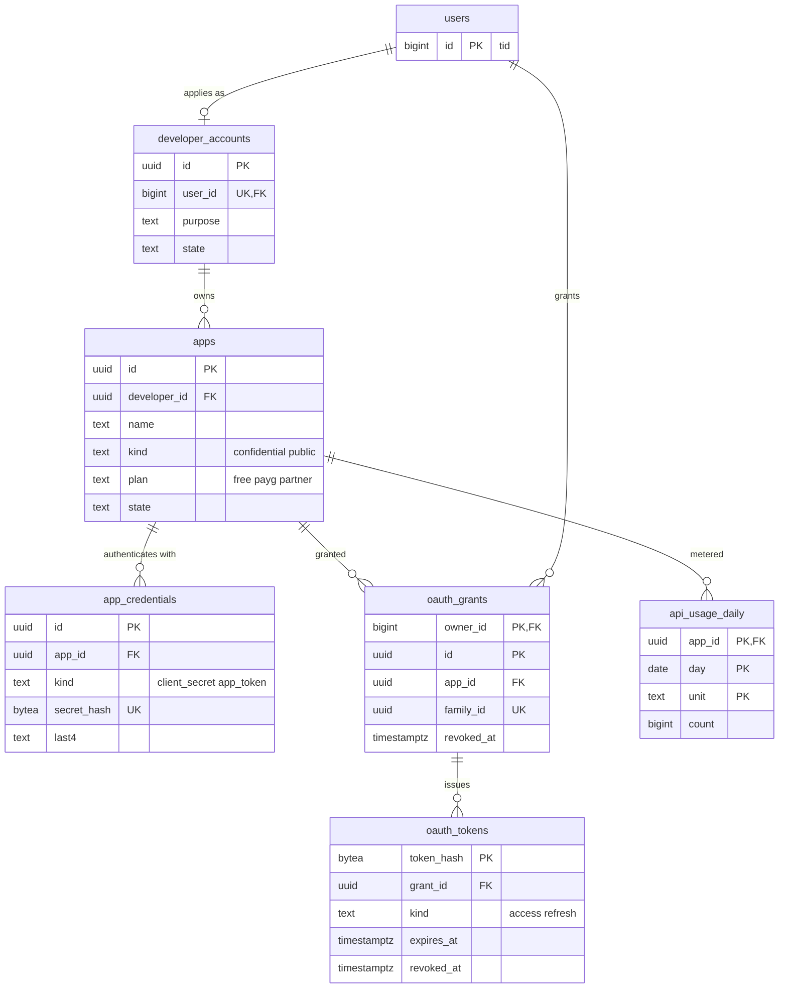

# Data model: 公開 API とアプリ

開発者のアカウント、アプリ、アプリの秘密、利用者の認可、OAuth のトークン、日ごとの計量。振る舞いは [api-and-rate-limits.md](../api-and-rate-limits.md)、決定は [ADR-0046](../../decisions/0046-public-api-shape-and-oauth.md)（API の形と OAuth）、[ADR-0047](../../decisions/0047-rate-limit-token-buckets.md)（レート制限）、[ADR-0048](../../decisions/0048-usage-plans-and-metering.md)（計量とプラン）にある。レート制限の桶・月の計量・トークンの写し・認可コードは Valkey（[stores.md](stores.md) の 1.4 節）。規約は [data-model.md](../data-model.md) の 3 節。

## 1. ER 図

## 2. 共通

- ID は UUIDv7。公開の ID として出すアプリの ID も UUIDv7 の文字列（[api-and-rate-limits.md](../api-and-rate-limits.md) の 10 節）。
- 秘密とトークンは SHA-256 のハッシュだけを持つ。平文は発行の応答で 1 回だけ返す。形（`<brand>_oat_`・`<brand>_ort_`・`<brand>_app_`・`<brand>_ocs_` ＋ 乱数 32 文字 ＋ チェックサム 6 文字）は [api-and-rate-limits.md](../api-and-rate-limits.md) の 4.2 節。
- トークンの照合は `public_api` のロールの `SECURITY DEFINER` の関数 `oauth_resolve_token(hash)` で行い、`(user_id, app_id, scopes, kind, expires_at)` だけを返す。写しは Valkey の `tok:{sha256}`（5 分）。

## 3. 表

### 3.1 `developer_accounts`

| 列 | 型 | NULL | 既定 | 説明 |
| --- | --- | --- | --- | --- |
| `id` | `uuid` | NOT NULL | `uuidv7()` | |
| `user_id` | `bigint` | NOT NULL | — | `active` で電話の確認済みの利用者 |
| `purpose` | `text` | NOT NULL | — | 利用の目的（自由の記述、1,000 文字まで） |
| `state` | `text` | NOT NULL | `'active'` | `active`・`suspended` |
| `created_at`・`updated_at` | `timestamptz` | NOT NULL | `now()` | |

- キー：PK `id`。UK `user_id`。FK `user_id` → `users`。
- 保持：利用者の削除で `suspended` にし、アプリを止める。S1 の量：数万行。

### 3.2 `apps`

| 列 | 型 | NULL | 既定 | 説明 |
| --- | --- | --- | --- | --- |
| `id` | `uuid` | NOT NULL | `uuidv7()` | 公開のクライアントの ID |
| `developer_id` | `uuid` | NOT NULL | — | |
| `name` | `text` | NOT NULL | — | 認可の画面に出す |
| `description` | `text` | NULL | — | |
| `kind` | `text` | NOT NULL | — | `confidential`・`public` |
| `redirect_uris` | `text[]` | NOT NULL | — | 完全一致 |
| `scopes` | `text[]` | NOT NULL | — | 求める範囲（[api-and-rate-limits.md](../api-and-rate-limits.md) の 4.4 節） |
| `plan` | `text` | NOT NULL | `'free'` | `free`・`payg`・`partner` |
| `monthly_caps` | `jsonb` | NOT NULL | `'{}'` | `payg` の開発者が決めた上限（単位ごと） |
| `state` | `text` | NOT NULL | `'active'` | `active`・`suspended`・`deleted` |
| `created_at`・`updated_at` | `timestamptz` | NOT NULL | `now()` | |

- キー：PK `id`。FK `developer_id` → `developer_accounts`。
- 索引：`(developer_id)` — 1 つの開発者のアカウントで 10 まで（書き込みの側で数える）。
- CHECK：値の一覧、`cardinality(redirect_uris) BETWEEN 1 AND 10`、`scopes <@ ARRAY[...4.4 節の範囲...]`。
- 停止は `audit_events` に書く。S1 の量：数万行。

### 3.3 `app_credentials`

| 列 | 型 | NULL | 既定 | 説明 |
| --- | --- | --- | --- | --- |
| `id` | `uuid` | NOT NULL | `uuidv7()` | |
| `app_id` | `uuid` | NOT NULL | — | |
| `kind` | `text` | NOT NULL | — | `client_secret`（`<brand>_ocs_`）・`app_token`（`<brand>_app_`） |
| `secret_hash` | `bytea` | NOT NULL | — | SHA-256 |
| `last4` | `text` | NOT NULL | — | 画面の表示用の末尾 4 文字 |
| `created_at` | `timestamptz` | NOT NULL | `now()` | |
| `revoked_at` | `timestamptz` | NULL | — | 作り直し、シークレットスキャンの通報 |

- キー：PK `id`。UK `secret_hash`。FK `app_id` → `apps`。
- 一意：`UNIQUE (app_id, kind) WHERE revoked_at IS NULL`（種類ごとに有効なものは 1 つ。作り直しは前のものを取り消してから）。
- 読み出し：`public_api` のロールだけ。S1 の量：数万行。

### 3.4 `oauth_grants`

利用者がアプリに与えた認可。本人だけの表（本人は自分の認可の一覧を見て取り消す）。

| 列 | 型 | NULL | 既定 | 説明 |
| --- | --- | --- | --- | --- |
| `owner_id` | `bigint` | NOT NULL | — | 認可した利用者 |
| `id` | `uuid` | NOT NULL | `uuidv7()` | |
| `app_id` | `uuid` | NOT NULL | — | |
| `scopes` | `text[]` | NOT NULL | — | 与えた範囲 |
| `family_id` | `uuid` | NOT NULL | `uuidv7()` | リフレッシュトークンの一式（再使用を見たら一式を取り消す） |
| `created_at` | `timestamptz` | NOT NULL | `now()` | |
| `revoked_at` | `timestamptz` | NULL | — | |

- キー：PK `(owner_id, id)`。UK `family_id`。FK `owner_id` → `users`、`app_id` → `apps`。
- 一意：`UNIQUE (owner_id, app_id) WHERE revoked_at IS NULL`（1 つのアプリに有効な認可は 1 つ。範囲を広げるときは作り直す）。
- 索引：`(app_id) WHERE revoked_at IS NULL` — アプリの停止で全部を取り消す（`public_api` の関数）。
- RLS：本人。アカウントが `locked`・`suspended`・`deactivated` に入ったら全部を取り消す（`accounts` の関数）。
- 保持：取り消しから 90 日で消す（この文書で決めた）。S1 の量：数十万行。

### 3.5 `oauth_tokens`

利用者のアクセストークンとリフレッシュトークン。`public_api` のロールだけ。

| 列 | 型 | NULL | 既定 | 説明 |
| --- | --- | --- | --- | --- |
| `token_hash` | `bytea` | NOT NULL | — | SHA-256 |
| `grant_id` | `uuid` | NOT NULL | — | → `oauth_grants.id` |
| `owner_id` | `bigint` | NOT NULL | — | 認可の利用者（照合の関数が返す） |
| `app_id` | `uuid` | NOT NULL | — | |
| `kind` | `text` | NOT NULL | — | `access`（2 時間）・`refresh`（使わないまま 90 日） |
| `family_id` | `uuid` | NOT NULL | — | |
| `expires_at` | `timestamptz` | NOT NULL | — | |
| `used_at` | `timestamptz` | NULL | — | リフレッシュトークンを使った時刻（2 回目の使用は再使用） |
| `revoked_at` | `timestamptz` | NULL | — | |
| `created_at` | `timestamptz` | NOT NULL | `now()` | |

- キー：PK `token_hash`。FK `(owner_id, grant_id)` → `oauth_grants(owner_id, id)`。
- 索引：`(family_id)` — 一式の取り消し。`(expires_at)` — 切れた行の掃除（毎日）。
- CHECK：`kind IN ('access','refresh')`。
- 保持：切れてから 7 日で消す。S1 の量：数百万行。

### 3.6 `api_usage_daily`

日ごとの計量（[api-and-rate-limits.md](../api-and-rate-limits.md) の 6.1 節）。Firehose `api-usage` の記録を Athena で集計して書く。

| 列 | 型 | NULL | 既定 | 説明 |
| --- | --- | --- | --- | --- |
| `app_id` | `uuid` | NOT NULL | — | |
| `day` | `date` | NOT NULL | — | JST の日 |
| `unit` | `text` | NOT NULL | — | `post_read`・`user_read`・`write`・`dm_read` |
| `count` | `bigint` | NOT NULL | — | |
| `computed_at` | `timestamptz` | NOT NULL | `now()` | |

- キー：PK `(app_id, day, unit)`。FK `app_id` → `apps`。
- 書き込み：`INSERT ... ON CONFLICT DO UPDATE`（集計のやり直しで上書き）。
- 保持：25 か月（この文書で決めた。請求の連携の前の比べ）。S1 の量：1 日 数万行。
