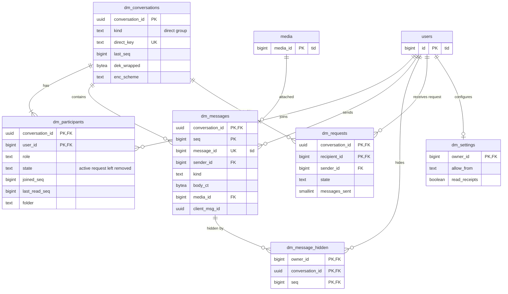

# Data model: DM

会話、参加者、メッセージ、本人の側だけの非表示、申請、設定。振る舞いは [direct-messages.md](../direct-messages.md)、決定は [ADR-0035](../../decisions/0035-dm-conversation-model-and-storage.md)（会話のモデルと保存）、[ADR-0036](../../decisions/0036-dm-consent-requests-and-reporting.md)（申請と通報）、[ADR-0037](../../decisions/0037-dm-e2ee-readiness.md)（E2EE への備え）にある。通報の証拠の写しは [trust-and-safety.md](trust-and-safety.md) の `report_evidence`。規約は [data-model.md](../data-model.md) の 3 節。

## 1. ER 図



## 2. 守り方

- **参加者の RLS**（[direct-messages.md](../direct-messages.md) の 4.3 節）。ポリシーは `SECURITY DEFINER` の関数 `dm_member_seq(conversation_id)` を使う。関数は閲覧者（`app.actor_id`）が `active` か `request` の参加者なら `joined_seq` を、そうでなければ NULL を返す（`dm_participants` のポリシーが自分を引いて再帰しないため）。

```sql
CREATE POLICY dm_messages_read ON dm_messages
  USING (seq >= dm_member_seq(conversation_id));
CREATE POLICY dm_messages_write ON dm_messages FOR INSERT
  WITH CHECK (sender_id = current_setting('app.actor_id')::bigint
              AND dm_member_state(conversation_id) = 'active');
```

- **列の暗号化**：本文は会話ごとの DEK（AES-256-GCM）で暗号化し、DEK は KMS の `dm-content` の鍵で包んで `dm_conversations.dek_wrapped` に持つ（[ADR-0035](../../decisions/0035-dm-conversation-model-and-storage.md)）。`body_ct` は `{版 1 バイト, nonce 12 バイト, 暗号文, タグ 16 バイト}`。
- **中身を読む権限**：`ts_reader` を含む運用のロールに `dm_messages.body_ct` の `SELECT` を与えない。通報の証拠は `report_evidence` に写す（参加者の権限で読んでから）。
- **付随の情報も出さない**：`sender_id`・`created_at`・`seq` もログ・分析に出さない。`dm` の流れは ID だけで、Firehose に写さない。
- **順**：会話の中の順は `seq`（会話ごとの連番、欠けなし）。`tid` の `message_id` は公開の ID で、順の正本ではない。

## 3. 表

### 3.1 `dm_conversations`

| 列 | 型 | NULL | 既定 | 説明 |
| --- | --- | --- | --- | --- |
| `conversation_id` | `uuid` | NOT NULL | `uuidv7()` | |
| `kind` | `text` | NOT NULL | — | `direct`・`group` |
| `direct_key` | `text` | NULL | — | 1 対 1 のとき `"{min(a,b)}:{max(a,b)}"` |
| `title` | `text` | NULL | — | グループの名前（暗号化しない。50 文字まで） |
| `created_by` | `bigint` | NOT NULL | — | |
| `last_seq` | `bigint` | NOT NULL | `0` | 送信のたびに `UPDATE ... RETURNING` で 1 上げる（会話の行の鍵で一列にする） |
| `last_message_at` | `timestamptz` | NULL | — | |
| `dek_wrapped` | `bytea` | NULL | — | 包んだ DEK。暗号の削除の後は NULL |
| `enc_scheme` | `text` | NOT NULL | `'kms-aes256gcm-v1'` | E2EE（MLS）を入れたら版を足す（[ADR-0037](../../decisions/0037-dm-e2ee-readiness.md)） |
| `dek_destroyed_at` | `timestamptz` | NULL | — | 全員が抜けた会話の暗号の削除 |
| `created_at` | `timestamptz` | NOT NULL | `now()` | |

- キー：PK `conversation_id`。UK `direct_key`。FK `created_by` → `users`。
- CHECK：`kind IN ('direct','group')`、`(kind = 'direct') = (direct_key IS NOT NULL)`、`dek_wrapped IS NOT NULL OR dek_destroyed_at IS NOT NULL`。
- RLS：参加者（`dm_member_seq(conversation_id) IS NOT NULL`）。作成の時は `WITH CHECK (created_by = app.actor_id)`。
- 保持：全員が抜けた会話は、法務の L8 の後に DEK を消してから行を消す。S1 の量：数千万行（見積もり）。

### 3.2 `dm_participants`

| 列 | 型 | NULL | 既定 | 説明 |
| --- | --- | --- | --- | --- |
| `conversation_id` | `uuid` | NOT NULL | — | |
| `user_id` | `bigint` | NOT NULL | — | |
| `role` | `text` | NOT NULL | `'member'` | `owner`・`member` |
| `state` | `text` | NOT NULL | — | `active`・`request`（申請・招待を受けた人）・`left`・`removed` |
| `joined_seq` | `bigint` | NOT NULL | — | 入った（戻った）時の `last_seq + 1` |
| `last_read_seq` | `bigint` | NOT NULL | `0` | 既読。`GREATEST` で進める（戻らない） |
| `muted` | `boolean` | NOT NULL | `false` | 会話のミュート（通知だけ止める） |
| `folder` | `text` | NOT NULL | — | `inbox`・`requests` |
| `created_at`・`updated_at` | `timestamptz` | NOT NULL | `now()` | `updated_at` は送信のたびに上げる（同期の `since`） |

- キー：PK `(conversation_id, user_id)`。FK `conversation_id` → `dm_conversations`、`user_id` → `users`。
- 索引：`(user_id, folder, updated_at DESC)` — 受信箱・申請の箱の一覧と同期（[direct-messages.md](../direct-messages.md) の 6.1 節）。
- CHECK：`state IN (...)`、`folder IN ('inbox','requests')`、`last_read_seq >= 0`。グループは `active` と `request` の合計 50 人まで（書き込みの側）。
- RLS：同じ会話の参加者が読める。自分の行（`last_read_seq`・`muted`・`folder`）だけ更新できる。
- S1 の量：会話の 2〜3 倍。

### 3.3 `dm_messages`

| 列 | 型 | NULL | 既定 | 説明 |
| --- | --- | --- | --- | --- |
| `conversation_id` | `uuid` | NOT NULL | — | |
| `seq` | `bigint` | NOT NULL | — | 会話の中の連番（1 から欠けなし） |
| `message_id` | `bigint` | NOT NULL | — | `tid` |
| `sender_id` | `bigint` | NOT NULL | — | |
| `kind` | `text` | NOT NULL | — | `text`・`media`・`post_share`・`system` |
| `body_ct` | `bytea` | NULL | — | 本文の暗号文（`system` は NULL） |
| `media_id` | `bigint` | NULL | — | → `media`（`purpose = dm`） |
| `shared_post_id` | `bigint` | NULL | — | 共有した投稿（論理の参照。表示は受け手ごとに `visible()`、`surface = dm_share`） |
| `client_msg_id` | `uuid` | NULL | — | 送信の冪等の鍵（`system` は NULL） |
| `created_at` | `timestamptz` | NOT NULL | `tid` の時刻 | |

- キー：PK `(conversation_id, seq)`。UK `message_id`。UK `(conversation_id, sender_id, client_msg_id)`。FK `conversation_id` → `dm_conversations`、`sender_id` → `users`、`media_id` → `media`（S1）。
- CHECK：`kind IN (...)`、`kind <> 'media' OR media_id IS NOT NULL`、`kind <> 'post_share' OR shared_post_id IS NOT NULL`、`kind = 'system' OR (body_ct IS NOT NULL AND client_msg_id IS NOT NULL)`、`seq >= 1`。
- RLS：2 節のポリシー。
- 分割：S1 は分けない。S2 は DM のクラスタ（会話の ID のハッシュで分けるかは S2 の着手の時に決める）。
- 保持：**法務の L8 の確認待ち**。相手がいる会話の扱いは [direct-messages.md](../direct-messages.md) の 8 節。
- S1 の量：1 日 約 1,500 万行、1 行 約 300 B。年 約 1.6 TB（初期見積もり。E12 で見直す）。

### 3.4 `dm_message_hidden`

本人の側だけで消したメッセージ。本人だけの表。

| 列 | 型 | NULL | 既定 | 説明 |
| --- | --- | --- | --- | --- |
| `owner_id` | `bigint` | NOT NULL | — | |
| `conversation_id` | `uuid` | NOT NULL | — | |
| `seq` | `bigint` | NOT NULL | — | |
| `created_at` | `timestamptz` | NOT NULL | `now()` | |

- キー：PK `(owner_id, conversation_id, seq)`。FK `(conversation_id, seq)` → `dm_messages`。
- 会話を消す（本人の `left`）は、行を 1 件ずつ足さず、`dm_participants` の `left` と `joined_seq` で隠す。
- RLS：本人。S1 の量：少ない。

### 3.5 `dm_requests`

申請（[direct-messages.md](../direct-messages.md) の 5.2 節）。送り手と受け手が読める。

| 列 | 型 | NULL | 既定 | 説明 |
| --- | --- | --- | --- | --- |
| `conversation_id` | `uuid` | NOT NULL | — | |
| `recipient_id` | `bigint` | NOT NULL | — | |
| `sender_id` | `bigint` | NOT NULL | — | 送り手（グループの招待は足した人） |
| `state` | `text` | NOT NULL | `'pending'` | `pending`・`accepted`・`declined`・`reported`・`expired` |
| `messages_sent` | `smallint` | NOT NULL | `0` | 申請の間に送った数（3 通まで） |
| `created_at` | `timestamptz` | NOT NULL | `now()` | |
| `decided_at` | `timestamptz` | NULL | — | `declined` の後 30 日の判定にも使う |

- キー：PK `(conversation_id, recipient_id)`。FK → `dm_conversations`、`users`。
- 索引：`(recipient_id, state, created_at DESC)` — 申請の箱。`(sender_id, created_at DESC)` — 送り手の 7 日の反応の数の作り直し（写しは Valkey の `dmrq:`）。`(created_at) WHERE state = 'pending'` — 30 日の期限のジョブ。
- CHECK：`state IN (...)`、`messages_sent BETWEEN 0 AND 3`、`sender_id <> recipient_id`。
- RLS：`app.actor_id IN (sender_id, recipient_id)`。
- 保持：会話と同じ。S1 の量：1 日 数十万行。

### 3.6 `dm_settings`

本人だけの表。`user_settings` の列にしない（統合の決定）。

| 列 | 型 | NULL | 既定 | 説明 |
| --- | --- | --- | --- | --- |
| `owner_id` | `bigint` | NOT NULL | — | |
| `allow_from` | `text` | NOT NULL | `'following'` | `everyone`・`following`・`none`。`minor` は `following` に固定（L5 まで） |
| `read_receipts` | `boolean` | NOT NULL | `true` | |
| `updated_at` | `timestamptz` | NOT NULL | `now()` | |

- キー：PK `owner_id`。CHECK `allow_from IN ('everyone','following','none')`。
- 送り手の側の判定（`DT-DM-001`）は受け手の設定を読むので、`SECURITY DEFINER` の関数 `dm_recipient_policy(recipient_id)` が `allow_from` と `read_receipts` だけを返す。
- S1 の量：数十万行（行がない人は既定）。

## 4. 書き込みのまとまり

| 操作 | 1 つのトランザクションで書く表 |
| --- | --- |
| 送信 | `dm_conversations`（`last_seq`）、`dm_messages`、`dm_participants`（`updated_at`）、`media`（`attached`）、`outbox`（`dm`：`dm.message_created`、ID だけ） |
| 新しい申請 | `dm_conversations`、`dm_participants`（送り手 `active`、受け手 `request`）、`dm_messages`、`dm_requests`、`outbox`（`dm.request_created`） |
| 申請を受ける | `dm_requests`（`accepted`）、`dm_participants`（`active`、`inbox`）、`outbox`（`dm.request_accepted`） |
| 既読 | `dm_participants.last_read_seq`（出来事は出さない。相手には Gateway で伝える） |
