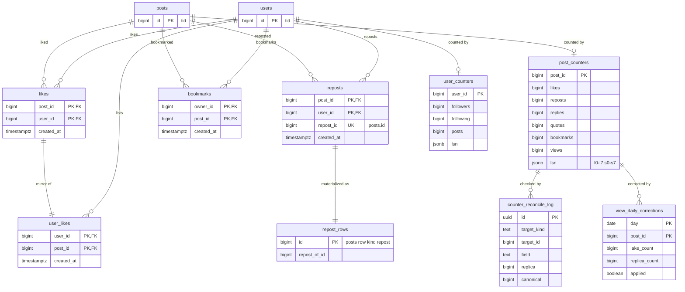

# Data model: エンゲージメントと数

いいね（2 つの向き）、リポスト、ブックマーク、数の写しの書き戻しの表、照合と閲覧の補正の記録、S2 の対応表。振る舞いは [engagement-and-counters.md](../engagement-and-counters.md)、決定は [ADR-0022](../../decisions/0022-engagement-relations-and-writes.md)（関係と書き込み）、[ADR-0023](../../decisions/0023-counter-aggregation-and-reconciliation.md)（集計と照合）、[ADR-0024](../../decisions/0024-view-counts-ingest-and-approximation.md)（閲覧）にある。Valkey の `pc:`・`uc:` の形は [stores.md](stores.md) の 1.3 節。規約は [data-model.md](../data-model.md) の 3 節。

## 1. ER 図

`repost_rows` は `posts` の `kind = repost` の行を表す図の上の名前で、別の表ではない。`engagement_shard_map`（S2）は図から外した。

## 2. 関係の表

関係の表が数の正本（[ADR-0005](../../decisions/0005-event-log-and-outbox.md)）。書き込みは `INSERT ... ON CONFLICT DO NOTHING` と `DELETE`。行を足した・消したときだけ outbox に出来事を書く（[ADR-0022](../../decisions/0022-engagement-relations-and-writes.md)）。出来事の流れは `engagement`、鍵は `"{post_id}:{user_id mod 8}"`（[ADR-0023](../../decisions/0023-counter-aggregation-and-reconciliation.md)）。

### 2.1 `likes`

投稿の側から見たいいね。いいねの数の正本。

| 列 | 型 | NULL | 既定 | 説明 |
| --- | --- | --- | --- | --- |
| `post_id` | `bigint` | NOT NULL | — | |
| `user_id` | `bigint` | NOT NULL | — | |
| `created_at` | `timestamptz` | NOT NULL | `now()` | |

- キー：PK `(post_id, user_id)`。FK `post_id` → `posts`、`user_id` → `users`（S1。S2 は論理の参照）。
- 索引：`(post_id, created_at DESC)` — 投稿にいいねした人の一覧（作者だけが読める。[engagement-and-counters.md](../engagement-and-counters.md) の 3.3 節）。照合の数え直しは主キーで行う。
- RLS：なし（公開の表）。一覧の範囲は API の層で守る。
- 分割：S1 なし。S2 はエンゲージメントのクラスタで `post_id` の論理の分割。
- 保持：取り消しで消す。アカウントの削除で消す（数は照合で直す）。投稿の `purged` で消す。
- S1 の量：1 日 5,000 万行、1 行 約 50 B。年 約 900 GB（[capacity.md](../capacity.md) の 5.1 節）。

### 2.2 `user_likes`

利用者の側から見たいいね。本人のいいねの一覧（本人だけが読める）。

| 列 | 型 | NULL | 既定 | 説明 |
| --- | --- | --- | --- | --- |
| `user_id` | `bigint` | NOT NULL | — | |
| `post_id` | `bigint` | NOT NULL | — | |
| `created_at` | `timestamptz` | NOT NULL | — | `likes` と同じ値 |

- キー：PK `(user_id, post_id)`。
- 索引：`(user_id, created_at DESC)` — 本人のいいねの一覧。
- 分割：S1 は `likes` と同じトランザクションで書く。S2 は `user_id` の論理の分割で、出来事から作る。
- S1 の量：`likes` と同じ。

### 2.3 `reposts`

リポストの関係。数の正本で、1 人 1 回。

| 列 | 型 | NULL | 既定 | 説明 |
| --- | --- | --- | --- | --- |
| `post_id` | `bigint` | NOT NULL | — | 元の投稿 |
| `user_id` | `bigint` | NOT NULL | — | リポストした人 |
| `repost_id` | `bigint` | NOT NULL | — | リポストの `posts` の行の `tid` |
| `created_at` | `timestamptz` | NOT NULL | `now()` | |

- キー：PK `(post_id, user_id)`。UK `repost_id`。FK `post_id` → `posts`、`user_id` → `users`（S1）。`repost_id` は論理の参照。
- 索引：`(post_id, created_at DESC)` — リポストした人の一覧（投稿を見られる人）。
- 取り消し：`reposts` の行を消し、リポストの `posts` の行を `deleted` にする（同じトランザクション。S2 は [ADR-0010](../../decisions/0010-post-table-partitioning-s2.md) のとおり `reposts` を先に書き、出来事から `posts` を直す）。
- S1 の量：1 日 約 300 万行（見積もり）。

### 2.4 `bookmarks`

本人だけの表。数は投稿の作者だけに見せる。

| 列 | 型 | NULL | 既定 | 説明 |
| --- | --- | --- | --- | --- |
| `owner_id` | `bigint` | NOT NULL | — | |
| `post_id` | `bigint` | NOT NULL | — | |
| `created_at` | `timestamptz` | NOT NULL | `now()` | |

- キー：PK `(owner_id, post_id)`。FK `owner_id` → `users`。`post_id` は論理の参照。
- 索引：`(owner_id, created_at DESC)` — 一覧。`(post_id)` — 照合の数え直し（`counter_reconciler` が件数だけを読む）。
- RLS：本人。照合は `counter_reconciler` の関数 `count_bookmarks(post_id)` だけ（行の中身を返さない）。
- 出来事：`bookmark.created`・`bookmark.deleted` は `post_id` と `sub` だけで、`owner_id` を含めない。
- S1 の量：1 日 約 200 万行（見積もり）。

## 3. 数の表（写しの書き戻し）

どちらも写しで、正本ではない（[ADR-0023](../../decisions/0023-counter-aggregation-and-reconciliation.md)）。書くのは `counter-aggregator` の書き戻しと `reconciler` の照合だけ（他のロールに `UPDATE` の権限を与えない）。

### 3.1 `post_counters`

| 列 | 型 | NULL | 既定 | 説明 |
| --- | --- | --- | --- | --- |
| `post_id` | `bigint` | NOT NULL | — | |
| `likes`・`reposts`・`replies`・`quotes`・`bookmarks` | `bigint` | NOT NULL | `0` | 写しの絶対の値 |
| `views` | `bigint` | NOT NULL | `0` | 閲覧の概算。`GREATEST` で書く（減らない） |
| `lsn` | `jsonb` | NOT NULL | `'{}'` | `sub`（0〜7）ごとの最後に当てた Kinesis の連番とシャードの ID：`{"l":["…"×8],"s":["…"×8]}` |
| `updated_at` | `timestamptz` | NOT NULL | `now()` | |

- キー：PK `post_id`。`post_id` は論理の参照（投稿の `purged` の後も数を残す）。
- 書き込み：60 秒ごとに `INSERT ... ON CONFLICT (post_id) DO UPDATE SET likes = EXCLUDED.likes, ..., views = GREATEST(post_counters.views, EXCLUDED.views)`。差分を足さない。
- CHECK：全部の数 `>= 0`。
- 読み出し：Valkey の `pc:` がないときの戻し（連番を含む）。
- 分割：S1 なし。S2 はエンゲージメントのクラスタで `post_id` の論理の分割。
- 保持：投稿と同じ。S1 の量：エンゲージメントのある投稿で年 約 2 億行、1 行 約 200 B。

### 3.2 `user_counters`

| 列 | 型 | NULL | 既定 | 説明 |
| --- | --- | --- | --- | --- |
| `user_id` | `bigint` | NOT NULL | — | |
| `followers`・`following`・`posts` | `bigint` | NOT NULL | `0` | 写しの絶対の値。正本は `followers`・`following` の `active` の行と、`posts` の `active` の行 |
| `lsn` | `jsonb` | NOT NULL | `'{}'` | `post_counters` と同じ形 |
| `updated_at` | `timestamptz` | NOT NULL | `now()` | |

- キー：PK `user_id`。
- 使う：フォローの上限の判定、fan-out の方式の切り替え（[follow-graph.md](../follow-graph.md) の 7 節）、プロフィールの表示。
- 置き場所：S2 は関係のクラスタ（`graph`）。S1 の量：300 万行。

### 3.3 `counter_reconcile_log`

照合で見つけた差（指標 K4）。運用の表。

| 列 | 型 | NULL | 既定 | 説明 |
| --- | --- | --- | --- | --- |
| `id` | `uuid` | NOT NULL | `uuidv7()` | |
| `target_kind` | `text` | NOT NULL | — | `post`・`user` |
| `target_id` | `bigint` | NOT NULL | — | |
| `field` | `text` | NOT NULL | — | `likes`・`reposts`・`replies`・`quotes`・`bookmarks`・`followers`・`following`・`posts` |
| `replica` | `bigint` | NOT NULL | — | 写しの値 |
| `canonical` | `bigint` | NOT NULL | — | 正本の数え直しの値 |
| `run_kind` | `text` | NOT NULL | — | `sample`・`top`・`weekly` |
| `checked_at` | `timestamptz` | NOT NULL | `now()` | |

- キー：PK `(id, checked_at)`。索引 `(checked_at)`。
- 分割：`checked_at` の月。保持：13 か月（この文書で決めた。指標の前年比のため）。
- S1 の量：差のあったものだけ。月 数千行の見込み。

### 3.4 `view_daily_corrections`

閲覧の数の日ごとの補正の記録（[engagement-and-counters.md](../engagement-and-counters.md) の 5.2 節）。

| 列 | 型 | NULL | 既定 | 説明 |
| --- | --- | --- | --- | --- |
| `day` | `date` | NOT NULL | — | JST の日 |
| `post_id` | `bigint` | NOT NULL | — | |
| `lake_count` | `bigint` | NOT NULL | — | データレイクの集計 |
| `replica_count` | `bigint` | NOT NULL | — | 写しの値 |
| `applied` | `boolean` | NOT NULL | — | 写しより 1% 以上多く、上げたら真。写しのほうが多ければ偽（減らさない） |
| `created_at` | `timestamptz` | NOT NULL | `now()` | |

- キー：PK `(day, post_id)`。
- 分割：`day` の月。保持：13 か月（この文書で決めた）。
- S1 の量：補正の対象の投稿だけ。1 日 数万行の見込み。

### 3.5 `engagement_shard_map`（S2）

エンゲージメントのクラスタの論理の分割の対応。形は `post_shard_map` と同じ（[posts.md](posts.md) の 5.3 節）。`likes`・`reposts`・`post_counters` は `post_id`、`user_likes`・`bookmarks` は利用者の ID の論理の分割を引く。この表は統合の後に足した（[README.md](../README.md) の 6 節）。

## 4. 書き込みのまとまり

| 操作 | 1 つのトランザクションで書く表（S1） |
| --- | --- |
| いいね | `likes`、`user_likes`、`outbox`（`like.created`。行を足したときだけ） |
| いいねの取り消し | `likes`・`user_likes` の行を消す、`outbox`（`like.deleted`。行を消したときだけ） |
| リポスト | `reposts`、`posts`（`kind = repost`）、`post_origin_logs`、`outbox`（`post.created`、`repost.created`） |
| ブックマーク | `bookmarks`、`outbox`（`bookmark.created`。`owner_id` を含めない） |
| 書き戻し | `post_counters`・`user_counters` を絶対の値で（`counter-aggregator`） |
| 照合 | Valkey の `cnt_set` の後、`counter_reconcile_log`（`reconciler`） |
