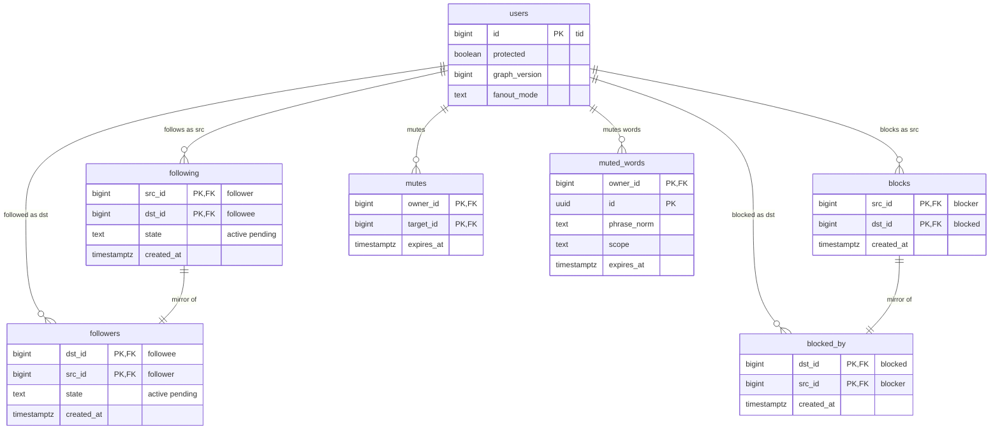

# Data model: 関係（フォロー・ブロック・ミュート）

フォローの 2 つの向きの表、ブロックの 2 つの向きの表、ミュート、ミュートの語、S2 の対応表。振る舞いは [follow-graph.md](../follow-graph.md)、決定は [ADR-0007](../../decisions/0007-follow-graph-storage.md)（2 つの隣接の表）、[ADR-0011](../../decisions/0011-graph-edge-state-machine-and-locking.md)（状態機械とロック）、[ADR-0012](../../decisions/0012-viewer-sets-cache.md)（閲覧者の集合）、[ADR-0013](../../decisions/0013-graph-partitioning.md)（分割）にある。数の写し（`user_counters`）は [engagement.md](engagement.md)、閲覧者の集合の Valkey の鍵は [stores.md](stores.md) の 1.2 節。規約は [data-model.md](../data-model.md) の 3 節。

## 1. ER 図

`following` と `followers`、`blocks` と `blocked_by` は同じ辺の 2 つの向きで、行は 1 対 1 で対応する（S1 は同じトランザクション。S2 は出来事の遅れの中で）。図では互いの対応を `||--||` で書く。

`graph_shard_map`（S2）は他の表と関係を持たないので図から外した。

## 2. 書き込みの規則（全表に共通）

- **組の勧告ロック**：フォロー・解除・申請・承認・拒否・フォロワーの削除・ブロック・解除は、`pg_advisory_xact_lock(graph_pair_key(least(a,b), greatest(a,b)))` を取ってから両向きを読む（[ADR-0011](../../decisions/0011-graph-edge-state-machine-and-locking.md)）。`graph_pair_key` は 2 つの ID から 64 ビットの鍵を作る関数（`hashtextextended`）。
- **2 つの向きは同じトランザクション**（S1）：`following` と `followers`、`blocks` と `blocked_by` を同時に書き、同時に消す。S2 は `following`・`blocks` を正本にして先に書き、逆向きは `graph` の流れから冪等に作る（[ADR-0013](../../decisions/0013-graph-partitioning.md)）。
- **バージョン**：辺を変えるトランザクションは、関わる利用者の `users.graph_version` を上げる。確定の直後に閲覧者の集合の写し（`vb:`・`vm:`・`vp:`・`vw:`・`vv:`）を `vs_apply` で更新する（[ADR-0012](../../decisions/0012-viewer-sets-cache.md)）。
- **ブロックの排他**：ブロックを書くトランザクションで、両向きのフォローの辺（`active`・`pending`）を消す（`follow.deleted`、理由 `block`）。
- **辺がない＝行がない**：解除・拒否・削除は行を消す。履歴は出来事のログとデータレイクに残る。
- outbox：`graph` の流れ、鍵は `src_id`。

## 3. 表

### 3.1 `following`

する側から見たフォローの辺。公開の表（鍵アカウントの一覧は本人と承認したフォロワーだけ。`visible()` の利用者のバージョン）。

| 列 | 型 | NULL | 既定 | 説明 |
| --- | --- | --- | --- | --- |
| `src_id` | `bigint` | NOT NULL | — | フォローする人 |
| `dst_id` | `bigint` | NOT NULL | — | フォローされる人 |
| `state` | `text` | NOT NULL | — | `active`・`pending`（鍵アカウントへの申請） |
| `created_at` | `timestamptz` | NOT NULL | `now()` | フォロー（申請）の時刻。承認でも変えない |
| `updated_at` | `timestamptz` | NOT NULL | `now()` | 承認の時刻 |

- キー：PK `(src_id, dst_id)`。FK `src_id`・`dst_id` → `users`（S1。S2 は論理の参照）。
- 索引：
  - `(src_id, created_at DESC, dst_id DESC)` — フォロー中の一覧のページング（[follow-graph.md](../follow-graph.md) の 5.3 節）。
  - `(src_id) WHERE state = 'pending'` — 送った申請の数（1,000 件の上限）と一覧。
  - 主キー `(src_id, dst_id)` — 返信の制限の「作者がフォローしている」の判定、作り直しのフォロー先の一覧。
- CHECK：`src_id <> dst_id`、`state IN ('active','pending')`。
- 分割：S1 なし。S2 は `src_id` の論理の分割。
- 保持：辺は消したら消える。アカウントの削除で消す。S1 の量：6,000 万行、1 行 約 60 B（[capacity.md](../capacity.md) の 5.1 節）。

### 3.2 `followers`

される側から見たフォローの辺。fan-out の配り先のページ（`(dst_id, src_id)` の順に 1,000 人ずつ）と、フォロワーの一覧。

| 列 | 型 | NULL | 既定 | 説明 |
| --- | --- | --- | --- | --- |
| `dst_id` | `bigint` | NOT NULL | — | フォローされる人 |
| `src_id` | `bigint` | NOT NULL | — | フォローする人 |
| `state` | `text` | NOT NULL | — | `following.state` と同じ |
| `created_at`・`updated_at` | `timestamptz` | NOT NULL | — | `following` と同じ値 |

- キー：PK `(dst_id, src_id)` — fan-out のページの順。FK → `users`（S1）。
- 索引：`(dst_id, created_at DESC, src_id DESC)` — フォロワーの一覧。`(dst_id) WHERE state = 'pending'` — 届いた申請の一覧。
- CHECK：`following` と同じ。
- 分割：S2 は `dst_id` の論理の分割。出来事から作る。
- S1 の量：6,000 万行。

### 3.3 `blocks`

ブロックした側から見た辺。API には本人の分だけを出す。

| 列 | 型 | NULL | 既定 | 説明 |
| --- | --- | --- | --- | --- |
| `src_id` | `bigint` | NOT NULL | — | ブロックした人 |
| `dst_id` | `bigint` | NOT NULL | — | ブロックされた人 |
| `created_at` | `timestamptz` | NOT NULL | `now()` | |

- キー：PK `(src_id, dst_id)`。FK → `users`（S1）。
- 索引：`(src_id, created_at DESC)` — ブロックの一覧。
- CHECK：`src_id <> dst_id`。
- 読み出し：書き込みの判定（フォロー・返信・DM・引用）は主キーを両向きで引く。読み出しの判定は閲覧者の集合の写し（`vb:`）で行う。
- 分割：S2 は `src_id` の論理の分割。
- S1 の量：300 万行（見積もり）。

### 3.4 `blocked_by`

ブロックされた側から見た辺。閲覧者の集合 `vb:` の「ブロックされた人」の元。

| 列 | 型 | NULL | 既定 | 説明 |
| --- | --- | --- | --- | --- |
| `dst_id` | `bigint` | NOT NULL | — | ブロックされた人 |
| `src_id` | `bigint` | NOT NULL | — | ブロックした人 |
| `created_at` | `timestamptz` | NOT NULL | — | `blocks` と同じ値 |

- キー：PK `(dst_id, src_id)`。索引 `(dst_id, created_at DESC)`。
- RLS：なし。ただし API・画面に出さない（ブロックされたことを知らせない）。読むのは閲覧者の集合の読み込みだけ。
- 分割：S2 は `dst_id` の論理の分割。出来事から作る。S1 の量：300 万行。

### 3.5 `mutes`

アカウントのミュート。本人だけの表。逆向きの表を持たない（[ADR-0012](../../decisions/0012-viewer-sets-cache.md)）。

| 列 | 型 | NULL | 既定 | 説明 |
| --- | --- | --- | --- | --- |
| `owner_id` | `bigint` | NOT NULL | — | ミュートした人 |
| `target_id` | `bigint` | NOT NULL | — | ミュートされた人 |
| `created_at` | `timestamptz` | NOT NULL | `now()` | |
| `expires_at` | `timestamptz` | NULL | — | 24 時間・7 日・30 日・なし |

- キー：PK `(owner_id, target_id)`。FK `owner_id` → `users`。`target_id` は論理の参照（相手の削除で行を残しても害がない）。
- 索引：`(owner_id, created_at DESC)` — 一覧。`(expires_at) WHERE expires_at IS NOT NULL` — 期限のジョブ（`SECURITY DEFINER` の関数で `(owner_id, target_id)` だけを引き、本人の権限で消す）。
- CHECK：`owner_id <> target_id`。1 人 10,000 件まで（`ops.graph.max_mutes`。書き込みの側で数える）。
- RLS：本人。
- 保持：本人が消すまで。ブロックしても残す（[follow-graph.md](../follow-graph.md) の 4.3 節）。S1 の量：300 万行（見積もり）。

### 3.6 `muted_words`

| 列 | 型 | NULL | 既定 | 説明 |
| --- | --- | --- | --- | --- |
| `owner_id` | `bigint` | NOT NULL | — | |
| `id` | `uuid` | NOT NULL | `uuidv7()` | |
| `phrase` | `text` | NOT NULL | — | 入力の表記（100 文字まで） |
| `phrase_norm` | `text` | NOT NULL | — | NFKC → 小文字 → カタカナをひらがなへ → 空白を 1 つ |
| `scope` | `text` | NOT NULL | `'all'` | `home`・`notifications`・`all` |
| `created_at` | `timestamptz` | NOT NULL | `now()` | |
| `expires_at` | `timestamptz` | NULL | — | |

- キー：PK `(owner_id, id)`。UK `(owner_id, phrase_norm)`。FK `owner_id` → `users`。
- CHECK：`char_length(phrase) BETWEEN 1 AND 100`、`scope IN ('home','notifications','all')`。1 人 200 件まで（書き込みの側）。
- RLS：本人。写しは組み立てた照合器 `vw:`。
- S1 の量：100 万行（見積もり）。

### 3.7 `graph_shard_map`（S2）

関係の表の論理の分割から物理のクラスタへの対応（[ADR-0013](../../decisions/0013-graph-partitioning.md)）。形は `post_shard_map`（[posts.md](posts.md) の 5.3 節）と同じ。

| 列 | 型 | NULL | 既定 | 説明 |
| --- | --- | --- | --- | --- |
| `logical_partition` | `smallint` | NOT NULL | — | `xxHash64(user_id) mod 1024` |
| `cluster` | `text` | NOT NULL | — | |
| `state` | `text` | NOT NULL | `'active'` | `active`・`moving` |
| `moved_at` | `timestamptz` | NULL | — | |

- キー：PK `logical_partition`。置き場所：`core` のクラスタ。

## 4. 書き込みのまとまり

| 操作 | 1 つのトランザクションで書く表（S1） |
| --- | --- |
| フォロー | `following`、`followers`、`users.graph_version`（する側）、`outbox`（`follow.created` か `follow.requested`） |
| 承認 | `following`・`followers` の `state`、`users.graph_version`（両方）、`outbox`（`follow.approved`） |
| 解除・拒否・取り消し・フォロワーの削除 | `following`・`followers` の行を消す、`users.graph_version`、`outbox`（`follow.deleted`、理由つき） |
| ブロック | `blocks`、`blocked_by`、両向きのフォローの行を消す、`users.graph_version`（両方）、`outbox`（`block.created`、消した辺の `follow.deleted`） |
| ミュート | `mutes`、`users.graph_version`（本人）、`outbox`（`mute.created`） |
| ミュートの語 | `muted_words`、`users.graph_version`（本人）。出来事は出さない（写しの `vw:` は確定の直後に作り直す） |
| 鍵を外す | 申請を 1,000 件ずつ `active` にするジョブ（1 回ごとに 1 トランザクション、`follow.approved`） |
