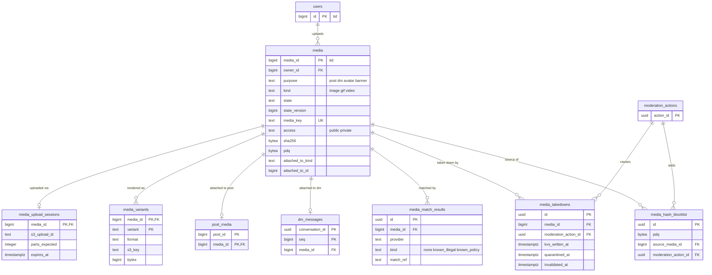

# Data model: メディア

メディアの正本、分割のアップロード、変換の版、自前の PDQ の一覧、照合の結果、配信の停止の進み。振る舞いは [media.md](../media.md)、決定は [ADR-0032](../../decisions/0032-media-upload-and-processing.md)（アップロードと変換）、[ADR-0033](../../decisions/0033-media-delivery-and-takedown.md)（配信と停止）、[ADR-0034](../../decisions/0034-media-hash-matching.md)（ハッシュの照合）にある。S3 の置き場と CloudFront KeyValueStore の形は [stores.md](stores.md) の 4 節。規約は [data-model.md](../data-model.md) の 3 節。

## 1. ER 図

## 2. 表

### 2.1 `media`

メディアの正本。状態を変えるたびに `state_version` を上げる（投稿と同じ規則。[ADR-0009](../../decisions/0009-post-state-tombstones-and-state-cache.md)）。定義元：[media.md](../media.md) の 4.2 節。

| 列 | 型 | NULL | 既定 | 説明 |
| --- | --- | --- | --- | --- |
| `media_id` | `bigint` | NOT NULL | — | `tid`。公開の ID |
| `owner_id` | `bigint` | NOT NULL | — | 上げた人 |
| `purpose` | `text` | NOT NULL | — | `post`・`dm`・`avatar`・`banner` |
| `kind` | `text` | NOT NULL | — | `image`・`gif`・`video` |
| `state` | `text` | NOT NULL | `'initiated'` | `initiated`・`uploaded`・`scanning`・`processing`・`ready`・`attached`・`withheld`・`blocked`・`failed`・`expired`・`purged` |
| `state_version` | `bigint` | NOT NULL | `1` | |
| `media_key` | `text` | NOT NULL | — | 推測できない配信のキー（128 ビットの乱数の base32、26 文字。[media.md](../media.md) の 8.1 節） |
| `access` | `text` | NOT NULL | — | `public`（公開の CDN）・`private`（署名付きの URL。鍵アカウントと DM） |
| `mime` | `text` | NULL | — | 先頭のバイトで確かめた形式 |
| `bytes` | `bigint` | NOT NULL | — | 申告の大きさ。完了の後に実際の大きさと比べる |
| `width`・`height` | `integer` | NULL | — | |
| `duration_ms` | `integer` | NULL | — | 動画・GIF |
| `sha256` | `bytea` | NULL | — | 元の SHA-256（32 バイト） |
| `pdq` | `bytea` | NULL | — | PDQ（32 バイト。画像と動画の代表のフレーム） |
| `blurhash` | `text` | NULL | — | |
| `alt_text` | `text` | NULL | — | 代替のテキスト（1,000 文字まで） |
| `sensitive_labels` | `text[]` | NOT NULL | `'{}'` | `nudity`・`violence`・`other`（作者か T&S の措置） |
| `attached_to_kind` | `text` | NULL | — | `post`・`dm`・`profile` |
| `attached_to_id` | `bigint` | NULL | — | 投稿の ID、DM のメッセージの `message_id`、利用者の ID |
| `created_at` | `timestamptz` | NOT NULL | `tid` の時刻 | |
| `ready_at`・`withheld_at` | `timestamptz` | NULL | — | |
| `updated_at` | `timestamptz` | NOT NULL | `now()` | |

- キー：PK `media_id`。UK `media_key`。FK `owner_id` → `users`（S1）。
- 索引：`(owner_id, created_at)` — 利用者の上限（1 日の件数と量）。`(state, created_at) WHERE state IN ('initiated','ready','failed','expired')` — 24 時間の掃除。`(attached_to_kind, attached_to_id)` — 投稿・DM の削除の後始末。
- CHECK：
  - `media_key ~ '^[a-z2-7]{26}$'`
  - `purpose`・`kind`・`state`・`access`・`attached_to_kind` の値の一覧
  - `state NOT IN ('attached','withheld') OR attached_to_kind IS NOT NULL`（付いた後は付け先を持つ）、`(attached_to_kind IS NULL) = (attached_to_id IS NULL)`
  - `purpose <> 'dm' OR access = 'private'`
  - `octet_length(pdq) = 32`、`octet_length(sha256) = 32`、`char_length(alt_text) <= 1000`
- トリガー：`state` を変えて `state_version` を上げない更新を拒む。`ready` を経ない `attached` を拒む。
- 書く：`media`（アップロード・変換）、`post`・`dm`（`ready` → `attached`。付け先と同じトランザクション）、`ts`（`withheld`・`sensitive_labels`）、`retention`（`purged`）。
- RLS：なし。本人以外に元の情報（`sha256`・`pdq`）を出さない（API の層）。
- 保持：[media.md](../media.md) の 10 節。`expired`・`failed` は 24 時間、`withheld` は法務の L8 の後、`blocked` は L7 の確認待ち。
- S1 の量：1 日 約 30 万行（投稿の 2 割 ＋ DM・プロフィール）、1 行 約 400 B。

### 2.2 `media_upload_sessions`

分割のアップロードの作業。完了か期限で消す。

| 列 | 型 | NULL | 既定 | 説明 |
| --- | --- | --- | --- | --- |
| `media_id` | `bigint` | NOT NULL | — | |
| `s3_upload_id` | `text` | NOT NULL | — | S3 の multipart upload の ID |
| `parts_expected` | `integer` | NOT NULL | — | 8 MiB ごと |
| `declared_sha256` | `bytea` | NULL | — | 完了の要求で受け取る全体の SHA-256 |
| `expires_at` | `timestamptz` | NOT NULL | — | 24 時間 |
| `created_at` | `timestamptz` | NOT NULL | `now()` | |

- キー：PK `media_id`。FK → `media`（`ON DELETE CASCADE`）。
- 索引：`(expires_at)` — 期限の切れた作業の掃除（S3 の `AbortMultipartUpload`）。
- S1 の量：同時に数万行。

### 2.3 `media_variants`

変換の後の版（[media.md](../media.md) の 5・6 節）。

| 列 | 型 | NULL | 既定 | 説明 |
| --- | --- | --- | --- | --- |
| `media_id` | `bigint` | NOT NULL | — | |
| `variant` | `text` | NOT NULL | — | 画像 `thumb`・`small`・`medium`・`large`、動画 `hls`・`poster`、GIF は `mp4` |
| `format` | `text` | NOT NULL | — | `webp`・`jpeg`・`png`・`mp4`・`m3u8` |
| `s3_key` | `text` | NOT NULL | — | `public/` か `private/` の下（[stores.md](stores.md) の 4 節） |
| `bytes` | `bigint` | NOT NULL | — | |
| `width`・`height` | `integer` | NULL | — | |

- キー：PK `(media_id, variant)`。FK → `media`。
- 保持：`media` と同じ。S1 の量：1 日 約 100 万行。

### 2.4 `media_hash_blocklist`

措置で `remove` にしたメディアの PDQ の自前の一覧（[ADR-0034](../../decisions/0034-media-hash-matching.md)）。T&S のロールが書き、`media-worker` が読む。

| 列 | 型 | NULL | 既定 | 説明 |
| --- | --- | --- | --- | --- |
| `id` | `uuid` | NOT NULL | `uuidv7()` | |
| `pdq` | `bytea` | NOT NULL | — | 256 ビット |
| `source_media_id` | `bigint` | NOT NULL | — | |
| `moderation_action_id` | `uuid` | NOT NULL | — | → `moderation_actions` |
| `created_at` | `timestamptz` | NOT NULL | `now()` | |
| `removed_at` | `timestamptz` | NULL | — | 措置の取り消しで外す |

- キー：PK `id`。UK `(pdq, source_media_id)`。FK → `media`、`moderation_actions`。
- 照合：ハミング距離 31 以下で一致。B-tree で引けないので、`media-worker` は `removed_at IS NULL` の全件を 60 秒ごとに読み込み、手元で比べる（S1 で数万件の見込み。10 万件を超えたら BK 木などの索引を ADR で決める）。
- 保持：措置の記録と同じ（L8）。

### 2.5 `media_match_results`

照合の結果。T&S のロールだけが読める（`media` のロールは `INSERT` だけ）。

| 列 | 型 | NULL | 既定 | 説明 |
| --- | --- | --- | --- | --- |
| `id` | `uuid` | NOT NULL | `uuidv7()` | |
| `media_id` | `bigint` | NOT NULL | — | |
| `provider` | `text` | NOT NULL | — | `external`（提供者は未定）・`internal`（自前の一覧） |
| `kind` | `text` | NOT NULL | — | `none`・`known_illegal`・`known_policy` |
| `match_ref` | `text` | NULL | — | 提供者の一致の ID か、`media_hash_blocklist.id` |
| `checked_at` | `timestamptz` | NOT NULL | `now()` | |

- キー：PK `id`。FK `media_id` → `media`。索引 `(media_id)`。
- CHECK：`kind = 'none' OR match_ref IS NOT NULL`。
- 保持：`none` は 30 日（この文書で決めた。提供者の障害の調査のため）。一致は L7・L8 の確認待ち。
- S1 の量：1 日 約 60 万行（2 つの照合）。

### 2.6 `media_takedowns`

配信の停止の進み（[media.md](../media.md) の 8.4 節）。

| 列 | 型 | NULL | 既定 | 説明 |
| --- | --- | --- | --- | --- |
| `id` | `uuid` | NOT NULL | `uuidv7()` | |
| `media_id` | `bigint` | NOT NULL | — | |
| `cause` | `text` | NOT NULL | — | `moderation`・`post_deleted`・`account_deleted` |
| `moderation_action_id` | `uuid` | NULL | — | → `moderation_actions` |
| `deny_kind` | `text` | NOT NULL | — | `removed`（404）・`legal`（451） |
| `kvs_written_at` | `timestamptz` | NULL | — | 拒否の一覧に書いた時刻 |
| `quarantined_at` | `timestamptz` | NULL | — | 隔離の置き場へ移した時刻 |
| `invalidation_id` | `text` | NULL | — | CloudFront の無効化の ID |
| `invalidated_at` | `timestamptz` | NULL | — | |
| `kvs_removed_at` | `timestamptz` | NULL | — | 無効化の 24 時間後に拒否の一覧から外した時刻 |
| `reversed_at` | `timestamptz` | NULL | — | 措置の取り消しで戻した時刻 |
| `created_at` | `timestamptz` | NOT NULL | `now()` | |

- キー：PK `id`。FK `media_id` → `media`、`moderation_action_id` → `moderation_actions`。
- 一意：`UNIQUE (media_id) WHERE reversed_at IS NULL`（効いている停止は 1 つ）。
- 索引：`(invalidated_at) WHERE kvs_removed_at IS NULL` — 24 時間後に外すジョブ。
- CHECK：`cause <> 'moderation' OR moderation_action_id IS NOT NULL`、`deny_kind IN ('removed','legal')`。
- 保持：1 年（この文書で決めた。停止の調査のため）。S1 の量：1 日 数万行。
