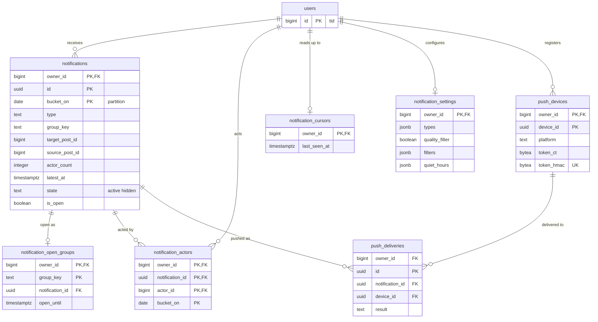

# Data model: 通知

通知の行、まとめの開いている行の索引、行為者、既読の位置、設定、プッシュの端末と送信の記録。全部が本人だけの表。振る舞いは [notifications.md](../notifications.md)、決定は [ADR-0029](../../decisions/0029-notification-rows-and-grouping.md)（行とまとめ）、[ADR-0030](../../decisions/0030-push-and-email-delivery.md)（プッシュとメール）、[ADR-0031](../../decisions/0031-read-state-and-visibility-rechecks.md)（既読と見える範囲）にある。未読の数・殺到の状態の Valkey の鍵は [stores.md](stores.md) の 1.4 節、プッシュの中身は 7 節。規約は [data-model.md](../data-model.md) の 3 節。

## 1. ER 図

## 2. 共通

- 全部の表に `owner_id` と FORCE RLS（本人）。`notification-builder` と `push-sender` は受け手ごとに `SET LOCAL app.actor_id` してから読み書きする（[ADR-0004](../../decisions/0004-single-tenant-and-visibility.md)）。
- 1 秒ぶんの出来事を受け手ごとにまとめ、受け手ごとに 1 つのトランザクションで書く（[notifications.md](../notifications.md) の 5.1 節）。
- **まとめの開いている行は `notification_open_groups` で 1 つにする。** 領域の文書の「部分の一意の索引 `(owner_id, group_key) WHERE is_open`」は、日ごとに分けた表では張れない（PostgreSQL の分けた表の一意の索引は、分ける鍵を含む必要がある。まとめの窓は日をまたぐ）。そこで開いている行の索引を分けない小さな表に持ち、その主キーで 1 つにする。統合の後の決定（[README.md](../README.md) の 6 節）。

## 3. 表

### 3.1 `notifications`

| 列 | 型 | NULL | 既定 | 説明 |
| --- | --- | --- | --- | --- |
| `owner_id` | `bigint` | NOT NULL | — | 受け手 |
| `id` | `uuid` | NOT NULL | `uuidv7()` | |
| `bucket_on` | `date` | NOT NULL | — | 分ける鍵。まとめない種類は `source_post_id` の `tid` の日（JST）、まとめる種類は開いた日 |
| `type` | `text` | NOT NULL | — | `reply`・`mention`・`quote`・`like`・`repost`・`follow`・`follow_request`・`follow_accepted`・`account_notice`・`reply_digest` |
| `group_key` | `text` | NULL | — | まとめる種類だけ。`{type}:{target}`（`like`・`repost` は投稿の ID、`follow`・`follow_request` は受け手自身） |
| `target_post_id` | `bigint` | NULL | — | いいね・リポスト・返信・引用された投稿（受け手の投稿） |
| `source_post_id` | `bigint` | NULL | — | 返信・メンション・引用の投稿 |
| `notice_ref` | `uuid` | NULL | — | `account_notice` の元（`moderation_actions.action_id`・`appeals.appeal_id`） |
| `recent_actor_ids` | `bigint[]` | NOT NULL | `'{}'` | 最近の行為者 50 人まで（新しい順） |
| `actor_count` | `integer` | NOT NULL | `0` | 行為者の数（殺到の状態では概算） |
| `latest_at` | `timestamptz` | NOT NULL | `now()` | 一覧の並びの時刻。行為者を足すと新しくする |
| `state` | `text` | NOT NULL | `'active'` | `active`・`hidden`（読む時の判定で恒久に出さないと分かった行） |
| `is_open` | `boolean` | NOT NULL | `false` | まとめの行が行為者を受け付けるか |
| `open_until` | `timestamptz` | NULL | — | 開いてから 24 時間 |
| `created_at` | `timestamptz` | NOT NULL | `now()` | |

- キー：PK `(owner_id, id, bucket_on)`。
- 一意：`UNIQUE (owner_id, type, source_post_id, bucket_on) WHERE source_post_id IS NOT NULL`（まとめない種類の冪等。`bucket_on` は `source_post_id` から決まるので、同じ出来事は同じ日の区画に入る）。
- 索引：`(owner_id, latest_at DESC, id DESC) WHERE state = 'active'` — 一覧（20 件）と未読の数え直し。`(owner_id, target_post_id)` — 投稿の削除の後始末。
- CHECK：
  - `type IN (...)`、`state IN ('active','hidden')`
  - `(group_key IS NOT NULL) = (type IN ('like','repost','follow','follow_request'))`
  - `type NOT IN ('reply','mention','quote') OR source_post_id IS NOT NULL`
  - `cardinality(recent_actor_ids) <= 50`、`actor_count >= cardinality(recent_actor_ids)`
  - `NOT is_open OR open_until IS NOT NULL`
- RLS：本人。
- 分割：`bucket_on` の日。90 日を過ぎた区画を `DROP`（`retention.notifications`、技術の理由の値）。
- S1 の量：1 日 約 3,000 万行（作成。まとめで更新が多い）、1 行 約 200 B。90 日で 約 27 億行・540 GB（初期見積もり。E8 の負荷試験で見直す。[capacity.md](../capacity.md) の 5.1 節）。

### 3.2 `notification_open_groups`

まとめの開いている行の索引（2 節）。この文書で足した表。

| 列 | 型 | NULL | 既定 | 説明 |
| --- | --- | --- | --- | --- |
| `owner_id` | `bigint` | NOT NULL | — | |
| `group_key` | `text` | NOT NULL | — | |
| `notification_id` | `uuid` | NOT NULL | — | 開いている `notifications` の行 |
| `bucket_on` | `date` | NOT NULL | — | その行の区画 |
| `open_until` | `timestamptz` | NOT NULL | — | |

- キー：PK `(owner_id, group_key)` — 開いている行は受け手とまとめの鍵ごとに 1 つ。
- 書き込み：行為者が来たら `INSERT ... ON CONFLICT DO NOTHING RETURNING` で開くか、既存の行を取る。既読の位置を越えたか `open_until` を過ぎたら、`notifications.is_open = false` と、この行の削除を同じトランザクションで行う。
- 索引：`(open_until)` — 閉じるジョブ（`SECURITY DEFINER` の関数で候補だけを引く）。
- RLS：本人。S1 の量：開いている行の数（数百万行）。

### 3.3 `notification_actors`

まとめの行の行為者。主キーで重ねない。殺到の状態では書かない（Valkey の `nha:`・`nhr:`）。

| 列 | 型 | NULL | 既定 | 説明 |
| --- | --- | --- | --- | --- |
| `owner_id` | `bigint` | NOT NULL | — | |
| `notification_id` | `uuid` | NOT NULL | — | |
| `actor_id` | `bigint` | NOT NULL | — | |
| `bucket_on` | `date` | NOT NULL | — | 行の区画と同じ |
| `created_at` | `timestamptz` | NOT NULL | `now()` | |

- キー：PK `(owner_id, notification_id, actor_id, bucket_on)`。FK `(owner_id, notification_id, bucket_on)` → `notifications`。
- 一意の行為者の追加（`INSERT ... ON CONFLICT DO NOTHING`）が成功したときだけ `actor_count` を 1 足す。
- 分割・保持：`bucket_on` の日、90 日。S1 の量：1 日 約 5,000 万行（いいねとフォローの数に比例）。

### 3.4 `notification_cursors`

既読の位置。受け手ごとに 1 本（[ADR-0031](../../decisions/0031-read-state-and-visibility-rechecks.md)）。

| 列 | 型 | NULL | 既定 | 説明 |
| --- | --- | --- | --- | --- |
| `owner_id` | `bigint` | NOT NULL | — | |
| `last_seen_at` | `timestamptz` | NOT NULL | `'-infinity'` | 一覧の先頭の `latest_at` |
| `updated_at` | `timestamptz` | NOT NULL | `now()` | |

- キー：PK `owner_id`。更新は `GREATEST(last_seen_at, $1)`（戻さない）。
- S1 の量：100 万行（通知を開いた利用者）。

### 3.5 `notification_settings`

| 列 | 型 | NULL | 既定 | 説明 |
| --- | --- | --- | --- | --- |
| `owner_id` | `bigint` | NOT NULL | — | |
| `types` | `jsonb` | NOT NULL | `'{}'` | 種類ごとの `{list, push, email}` の可否。空は既定（一覧・プッシュは全部、メールは要約だけ） |
| `quality_filter` | `boolean` | NOT NULL | `true` | |
| `filters` | `jsonb` | NOT NULL | `'{}'` | `not_following`・`not_followed_by`・`new_account`・`no_verified_phone`・`no_avatar`（既定は全部 `false`） |
| `quiet_hours` | `jsonb` | NULL | — | `{"start":"23:00","end":"07:00"}`（JST） |
| `email_digest` | `boolean` | NULL | — | 要約のメール。NULL は既定（既定の値は法務の L11 の後） |
| `updated_at` | `timestamptz` | NOT NULL | `now()` | |

- キー：PK `owner_id`。行がない利用者は既定。
- CHECK：`jsonb_typeof(types) = 'object'`、`jsonb_typeof(filters) = 'object'`。形は `packages/contract` の Zod で検証してから書く。
- S1 の量：数十万行。

### 3.6 `push_devices`

| 列 | 型 | NULL | 既定 | 説明 |
| --- | --- | --- | --- | --- |
| `owner_id` | `bigint` | NOT NULL | — | |
| `device_id` | `uuid` | NOT NULL | — | アプリの導入ごとに端末が作る UUIDv7 |
| `platform` | `text` | NOT NULL | — | `ios`・`android` |
| `token_ct` | `bytea` | NOT NULL | — | APNs・FCM のトークンの封筒の暗号文（`pii` の鍵）。ログに出さない |
| `token_hmac` | `bytea` | NOT NULL | — | トークンの HMAC（同じトークンの付け替え） |
| `app_version` | `text` | NOT NULL | — | |
| `locale` | `text` | NOT NULL | `'ja'` | |
| `created_at` | `timestamptz` | NOT NULL | `now()` | |
| `last_seen_at` | `timestamptz` | NOT NULL | `now()` | |
| `disabled_at` | `timestamptz` | NULL | — | 事業者の「登録されていない」の応答 |

- キー：PK `(owner_id, device_id)`。UK `token_hmac` — 1 つのトークンは 1 人に結ぶ（別のアカウントでログインしたら前の行を消す。`SECURITY DEFINER` の関数 `push_token_claim(hmac)`）。
- 索引：`(owner_id) WHERE disabled_at IS NULL` — 送り先の一覧。
- CHECK：`platform IN ('ios','android')`。
- 保持：ログアウト・アカウントの削除で消す。無効にして 30 日で消す。S1 の量：150 万行。

### 3.7 `push_deliveries`

送信の記録。本文を持たない。

| 列 | 型 | NULL | 既定 | 説明 |
| --- | --- | --- | --- | --- |
| `owner_id` | `bigint` | NOT NULL | — | |
| `id` | `uuid` | NOT NULL | `uuidv7()` | |
| `notification_id` | `uuid` | NULL | — | DM のプッシュは NULL |
| `device_id` | `uuid` | NOT NULL | — | |
| `kind` | `text` | NOT NULL | — | `notification`・`dm`・`dm_request` |
| `result` | `text` | NOT NULL | — | `sent`・`skipped`（送る直前の判定の行の番号を `reason` に）・`failed`・`invalid_token` |
| `reason` | `text` | NULL | — | `DT-NOTIF-002` の行（`hidden`・`not_visible`・`blocked`・`setting_off`・`quiet_hours`・`already_seen`・`rate_capped`） |
| `sent_at` | `timestamptz` | NOT NULL | `now()` | |

- キー：PK `(owner_id, id, sent_at)`。`notification_id`・`device_id` は論理の参照。
- 索引：`(owner_id, sent_at DESC)` — 受け手ごとの 1 時間 30 件の上限の数え（写しは Valkey）。
- 分割・保持：`sent_at` の日、7 日。S1 の量：1 日 約 2,000 万行。
